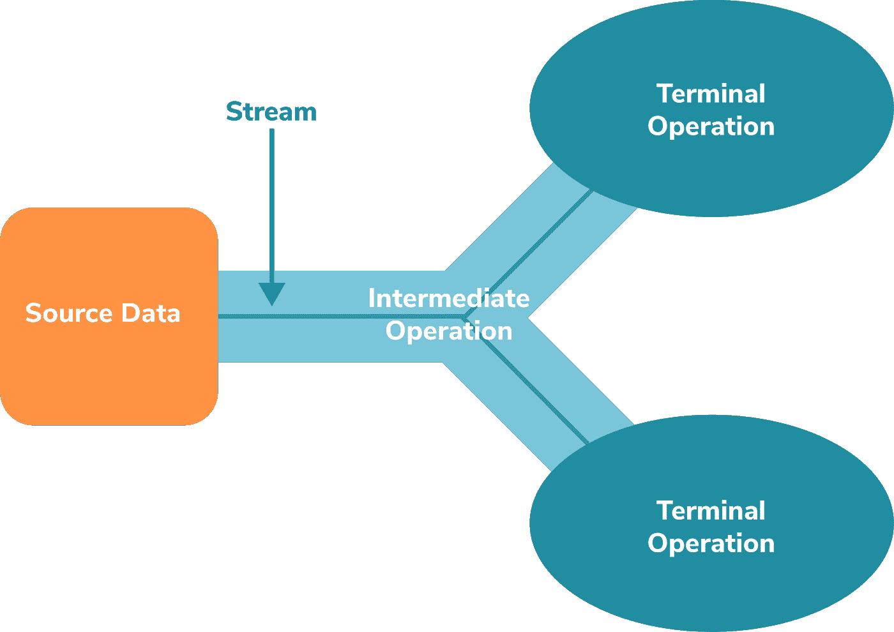
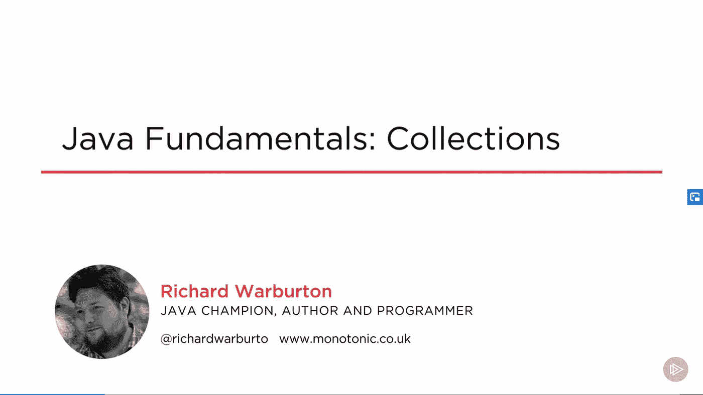
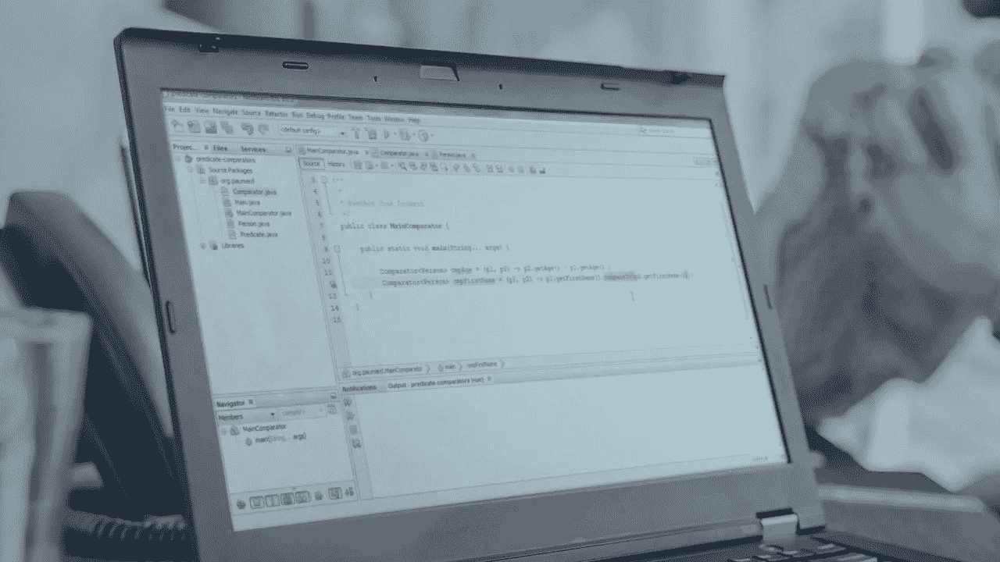
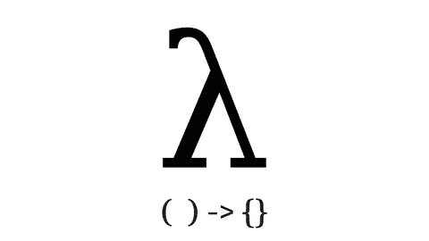
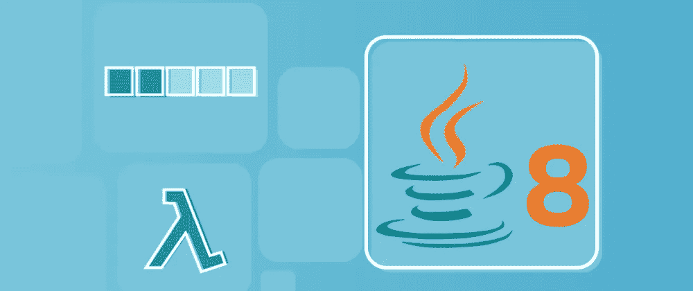
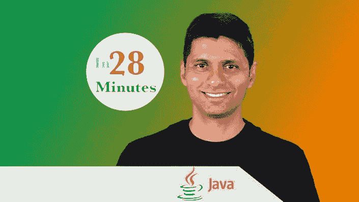

# 2023 年学习 Java 集合框架和流 API 的 7 门最佳课程

> 原文：<https://medium.com/javarevisited/7-best-java-collections-and-stream-api-courses-for-beginners-in-2020-3ad18d52c38?source=collection_archive---------0----------------------->

## 我最喜欢的 2023 年从 Udemy，Coursera，Pluralsight，Educative 学习 Java 集合和 Stream API 的在线课程。

大家好，如果你想学习 Java 集合和流 API，并寻找最好的集合和流 Java 课程，那么你来对地方了。之前我已经分享过 [b **est Java 初学者课程**](/javarevisited/top-5-java-online-courses-for-beginners-best-of-lot-1e1e240a758) ，今天我要分享的是学习 Collections 和 Stream 这两个来自 JDK 最重要的 API 的最佳课程

如果您一直在用 Java 编程，那么您应该知道集合和流是两个最重要的 Java APIs。在我 15 年的职业 Java 开发生涯中，几乎没有一个 Java 程序是我没有使用过集合中的任何类的，最近还使用了[流 API](https://javarevisited.blogspot.com/2014/03/2-examples-of-streams-with-Java8-collections.html) 中的任何类。

我坚信每一个 Java 开发者都应该对这两者有很好的了解，这也是我写这篇文章的原因。如果你是 Java 的新手，那么你可能会想为什么它们如此重要？

它们很重要，因为它们处理数据，而数据是每个应用和业务的核心。例如，如果你创建一个像脸书这样的应用程序，那么你把你的用户存储在内存的什么地方呢？

最有可能的是，你将它们存储在一个链表或者哈希表中，它们是 Java 集合框架提供的类。事实上，List 和 Hashtable 的选择也会对你如何搜索用户产生影响，这也是为什么扎实了解 [Java 集合](https://www.java67.com/2019/07/top-50-java-generics-and-collection-interview-questions.html)和[流](/javarevisited/7-best-java-tutorials-and-books-to-learn-lambda-expression-and-stream-api-and-other-features-3083e6038e14)很重要。

换句话说，Java 集合框架也提供了流行数据结构的实现，如数组、链表、哈希表、树、栈、队列、优先级队列等。在 Java 编程语言中。

流相对较新，它提供了一种从集合中提取数据并执行常见操作的方法，如[过滤](https://javarevisited.blogspot.com/2018/05/java-8-filter-map-collect-stream-example.html)、[转换](https://javarevisited.blogspot.com/2016/03/difference-between-map-and-flatmap-in-java8.html)、[聚合](https://www.java67.com/2018/11/10-examples-of-collectors-in-java-8.html)、规范化等等。

对 Java 集合和流的良好了解对编写更好的 Java 代码大有帮助，这是每个 Java 开发人员的目标，也是任何想成为专业 Java 开发人员的人所必须的。

如果你想提高你对 Java 集合框架和 Stream API 的认识，并寻找一些优秀的资源，那就留下来吧。在这篇文章中，我将分享深入学习 Java 集合和流 API 的最佳在线课程。

顺便说一句，如果你是 Java 新手，并且正在寻找一门涵盖 Java 开发人员需要了解的所有内容的课程，那么我建议你查看 Udmey 上的 [**完整的 Java MasterClass**](https://click.linksynergy.com/fs-bin/click?id=JVFxdTr9V80&subid=0&offerid=323058.1&type=10&tmpid=14538&RD_PARM1=https%3A%2F%2Fwww.udemy.com%2Fjava-the-complete-java-developer-course%2F) 课程。它也是最新的课程之一，涵盖了 var、集合的静态工厂方法和最近 Java 版本的 Java 模块等新特性。

<https://click.linksynergy.com/fs-bin/click?id=JVFxdTr9V80&subid=0&offerid=323058.1&type=10&tmpid=14538&RD_PARM1=https%3A%2F%2Fwww.udemy.com%2Fjava-the-complete-java-developer-course%2F>  

# 深入学习 Java 集合和流 API 的 7 门最佳课程

在不浪费你更多时间的情况下，这里是我列出的从零开始学习 Java 集合和流 API 并掌握它们以编写更好的 Java 代码的最佳在线课程:

## 1. [Java 基础:理查德·沃伯顿作品集](https://pluralsight.pxf.io/c/1193463/424552/7490?u=https%3A%2F%2Fwww.pluralsight.com%2Fcourses%2Fjava-collections-fundamentals)

这是一门有点老的课程，但仍然是学习 Java 基础知识的最佳课程之一，比如列表、集合、映射、队列、堆栈等。由 Java 冠军和受欢迎的讲师 Richard Warburton 创建，该课程包含一些对 Java 开发人员最有用的信息。

课程从为什么你真的需要使用集合而不是数组开始，涵盖了[列表](https://javarevisited.blogspot.com/2011/05/example-of-arraylist-in-java-tutorial.html#axzz5nIL3mj2W)、[集合](https://www.java67.com/2013/01/difference-between-set-list-and-map-in-java.html)和[映射](https://www.java67.com/2013/02/10-examples-of-hashmap-in-java-programming-tutorial.html)的功能，并解释了不同数据结构的权衡。

由于处理数据是任何业务问题的基础，而 Java 集合是设计用于在内存中存储和处理数据的数据结构，因此对集合的良好了解是必不可少的，如果您想先从基础开始，那么这是您的正确选择。

**这里是加入本课程的链接** — [Java 基础:集合](https://pluralsight.pxf.io/c/1193463/424552/7490?u=https%3A%2F%2Fwww.pluralsight.com%2Fcourses%2Fjava-collections-fundamentals)

虽然你需要 plur sight 会员资格才能进入这门课程，但别担心，plur sight 已经免费提供他们所有的 [**7000+课程一个月**](/javarevisited/7000-free-pluralsight-courses-to-build-in-demand-tech-skills-without-leaving-your-house-40edb50a8cf2) 。你可以利用 fo 来学习收藏。

如果可以的话，我也鼓励你加入 Pluralsight，因为你将有机会接触到 7000 多门由专家讲授的最新技术课程，这些课程对于需要保持自我更新的程序员来说是必不可少的。你也可以使用他们的 [**10 天免费试听**](https://pluralsight.pxf.io/c/1193463/424552/7490?u=https%3A%2F%2Fwww.pluralsight.com%2Flearn) 免费观看这个课程。

<https://pluralsight.pxf.io/c/1193463/424552/7490?u=https%3A%2F%2Fwww.pluralsight.com%2Flearn>  

## 2.[在 Java 8 中使用 Lambda 表达式从集合到流](https://pluralsight.pxf.io/c/1193463/424552/7490?u=https%3A%2F%2Fwww.pluralsight.com%2Fcourses%2Fjava-8-lambda-expressions-collections-streams)

这是另一个 Java 冠军 Jose Paumard 在 Pluralsight 上的另一个课程，他在 Pluralsight 上创建了深入的 Java 课程。我第一次见到 Jose Paumard 是在参加他的[多线程课程](https://pluralsight.pxf.io/c/1193463/424552/7490?u=https%3A%2F%2Fwww.pluralsight.com%2Fcourses%2Fjava-patterns-concurrency-multi-threading)，这也是一门很棒的课程。我不是说过 Pluralsight 有专家指导的课程，他们的 Java 课程就是一个很好的例子，因为大多数课程都是由 Jose 和 Richard Warburton 这样的 Java 冠军设计和创建的。

顾名思义，本课程专注于 Java 中一种新的编码方式，它将向您介绍 Java 8 中基于 [lambda 表达式](https://javarevisited.blogspot.com/2014/02/10-example-of-lambda-expressions-in-java8.html)、[函数接口](https://javarevisited.blogspot.com/2018/01/what-is-functional-interface-in-java-8.html)、集合框架和流 API 的新模式。

**这里是加入本课程的链接** — [在 Java 8 中使用 Lambda 表达式从集合到流](https://pluralsight.pxf.io/c/1193463/424552/7490?u=https%3A%2F%2Fwww.pluralsight.com%2Fcourses%2Fjava-8-lambda-expressions-collections-streams)

你不仅会学到 lambda 表达式，还会学到用 Java 处理大量数据的新模式，否则 Lambda 就没那么有用了。这些新模式已经被添加到集合框架和[新的流 API 中。](https://www.java67.com/2016/08/java-8-stream-filter-method-example.html)

本课程还解释了关键的函数式编程概念，如[映射、过滤和收集](/javarevisited/how-to-use-streams-map-filter-and-collect-methods-in-java-1e13609a318b)，如它们是什么以及为什么将它们添加到流 API 中。最终，您将学习用 Java 高效处理批量数据的新方法，并提高您的并行编程技能。

## 3.[集合简介&Java 中的泛型](https://click.linksynergy.com/deeplink?id=JVFxdTr9V80&mid=39197&murl=https%3A%2F%2Fwww.udemy.com%2Fcourse%2Fintroduction-to-generics-in-java%2F)

本课程为理解 Java 中的泛型、基本集合和反射提供了一个简单的指南！它由 Holczer Balazs 创建，该课程受到 Udemy 超过 12，000 名学生的信任。

在本课程中，您将学习用 Java 编程语言构建全功能程序所需的基本概念和函数。

您还将学习到[泛型类型](https://www.java67.com/2019/07/top-50-java-generics-and-collection-interview-questions.html)的基础知识、泛型方法、类型参数以及与这些主题相关的理论背景。这是 Java 的基础部分，所以绝对值得学习。

**这里是加入本课程的链接** — [集合简介&Java 中的泛型](https://click.linksynergy.com/deeplink?id=JVFxdTr9V80&mid=39197&murl=https%3A%2F%2Fwww.udemy.com%2Fcourse%2Fintroduction-to-generics-in-java%2F)

## 4. [Java Streams API 开发人员指南](https://click.linksynergy.com/deeplink?id=JVFxdTr9V80&mid=39197&murl=https%3A%2F%2Fwww.udemy.com%2Fcourse%2Fjava-streams%2F)

纳尔逊·德加洛是 Udemy 上最被低估的 Java 讲师之一。我参加过他的一些课程，比如这个课程和 Spring Boot 基础课程，我对他的教学方式和清晰的解释以及背景中的工作代码印象深刻。

本课程完全专注于 Java 流 API，您将学习一个 Java 开发人员需要了解的所有基本概念和方法，如[映射](https://www.java67.com/2015/01/java-8-map-function-examples.html)、[缩减](http://www.java67.com/2016/09/map-reduce-example-java8.html)、[平面映射](http://www.java67.com/2016/03/how-to-use-flatmap-in-java-8-stream.html)、[过滤器](http://www.java67.com/2018/03/java-8-stream-find-first-and-filter-example.html)、[分组依据](https://javarevisited.blogspot.com/2015/07/how-to-do-group-by-in-java-8.html#axzz5HKr46xFJ)等。Nelson 不仅解释了特定方法的作用，还展示了如何在更大范围内使用该方法的代码。如果你需要一个实践课程来学习 Java 流，那么我强烈推荐你去看看这个课程。

**这里是加入本 Java Stream 课程的链接** — [Java Streams API 开发者指南](https://click.linksynergy.com/deeplink?id=JVFxdTr9V80&mid=39197&murl=https%3A%2F%2Fwww.udemy.com%2Fcourse%2Fjava-streams%2F)

## 5.[现代 Java——通过编码学习 Java 8 的特性](https://click.linksynergy.com/deeplink?id=JVFxdTr9V80&mid=39197&murl=https%3A%2F%2Fwww.udemy.com%2Fcourse%2Fmodern-java-learn-java-8-features-by-coding-it%2F)

自从 Java 8 问世以来，已经过去了许多年，但是仍然有一些开发人员害怕学习 Java 8 中的 Lambdas、Streams、新的日期 API、Optionals 和并行编程，除非你开始编写代码，否则你是学不会的。如果你害怕 Java 中的函数式编程，那么这门课程就是为你而设的。在本课程中，你将通过编写像 [lambdas](https://javarevisited.blogspot.com/2018/07/java-8-tutorials-resources-and-examples-lambda-expression-stream-api-functional-interfaces.html) 和 [stream](https://javarevisited.blogspot.com/2018/08/top-5-free-java-8-and-9-courses-for-programmers.html) 这样的代码来学习 Java 8 的所有新特性。如果你想学习所有的新特性，比如 Lambdas、Streams、Optionals、Functional Interfaces 和并行编程，那么这个课程就是为你准备的。

**以下是加入本课程的链接** — [现代 Java —通过编写代码了解 Java 8 的特性](https://click.linksynergy.com/deeplink?id=JVFxdTr9V80&mid=39197&murl=https%3A%2F%2Fwww.udemy.com%2Fcourse%2Fmodern-java-learn-java-8-features-by-coding-it%2F)

## 6.[面向有经验开发者的 Java 8:Lambdas，Stream API & Beyond](https://www.educative.io/courses/java-8-lambdas-stream-api-beyond?affiliate_id=5073518643380224)

这是 Educative(一个基于文本的交互式学习门户)为有经验的 Java 开发人员提供的另一个学习和掌握流 API 的极好课程。本课程的 USP 是你可以在你的浏览器中练习流问题。

在本课程中，您将了解 lambdas、Java Stream API、函数接口，以及许多其他与[集合](https://javarevisited.blogspot.com/2020/04/top-5-courses-to-learn-java-collections-and-streams.html#axzz6XMFoMrEo)、[内存管理](/javarevisited/5-best-advanced-java-performance-and-memory-management-courses-for-experienced-programmers-f7b2e07be5ca)、[日期&时间 API](https://javarevisited.blogspot.com/2015/03/20-examples-of-date-and-time-api-from-Java8.html#axzz6cRYpiwdu) 相关的新改进。

完成本课程后，您将精通 Java 8 的所有功能，并准备好在自己的代码中利用这些新特性。

**这里是加入本课程的链接**——[面向有经验开发者的 Java 8:Lambdas，Stream API & Beyond](https://www.educative.io/courses/java-8-lambdas-stream-api-beyond?affiliate_id=5073518643380224)

而且，如果你发现教育平台和他们的互动课程很有用，那么你还可以获得 [**教育订阅**](https://www.educative.io/subscription?affiliate_id=5073518643380224) ，它不仅提供这门课程，还提供他们 100 多门课程，每月只需 18 美元。它非常划算，非常适合获得一些实践学习经验。

<https://www.educative.io/subscription?affiliate_id=5073518643380224>  

## 7.[用 Lambdas & Streams](https://click.linksynergy.com/deeplink?id=JVFxdTr9V80&mid=39197&murl=https%3A%2F%2Fwww.udemy.com%2Fcourse%2Ffunctional-programming-with-java%2F) 学习 Java 函数式编程

这是我最喜欢的 Java 开发人员学习 Stream API 的课程。我真的很喜欢 Ranga Karnam 的教学风格和它选择的解释概念的例子。

在完成了 Ranga 的 [Spring Boot 和微服务课程](https://click.linksynergy.com/fs-bin/click?id=JVFxdTr9V80&subid=0&offerid=323058.1&type=10&tmpid=14538&RD_PARM1=https%3A%2F%2Fwww.udemy.com%2Fmicroservices-with-spring-boot-and-spring-cloud%2F)后，我毫不犹豫地加入了，我很高兴我加入了，因为我学到了很多在 Java 中使用 Stream API 的有用方法。

在本课程中，您将学习使用函数式编程编写优秀的 Java 代码。您将使用函数式编程以及 Lambda 表达式、方法引用、流和函数接口来解决大量 Java 难题和练习。

**这里是加入本课程的链接** — [用 Lambdas & Streams](https://click.linksynergy.com/deeplink?id=JVFxdTr9V80&mid=39197&murl=https%3A%2F%2Fwww.udemy.com%2Fcourse%2Ffunctional-programming-with-java%2F) 学习 Java 函数式编程

以上是关于深入学习 Java 集合和 Stream API 的**最佳课程**。正如我所说的，这些主题对于每个 Java 开发人员来说都非常非常重要，如果您想成为一名专业的 Java 开发人员，您应该花一些时间来学习和掌握这些技能。

对 Java 集合和流的良好了解不仅有助于你在 Java 面试中取得好成绩，还有助于你用 Java 写出更好的代码。一个糟糕的集合选择会使你的应用程序变慢，而一个好的选择会使它变得快速和稳定。
其他 **Java 编程文章**你可能喜欢

*   [2023 年 Java 开发者路线图](https://javarevisited.blogspot.com/2019/10/the-java-developer-roadmap.html)
*   [10 门免费数据结构与算法课程](http://www.java67.com/2019/02/top-10-free-algorithms-and-data.html)
*   [学习 Spring 框架的前 5 门课程](https://javarevisited.blogspot.com/2018/06/top-6-spring-framework-online-courses-Java-programmers.html)
*   [Java 开发人员必备的 10 个测试工具](https://javarevisited.blogspot.com/2018/01/10-unit-testing-and-integration-tools-for-java-programmers.html)
*   [面向初学者和有经验程序员的 10 门免费 Java 课程](http://www.java67.com/2018/08/top-10-free-java-courses-for-beginners-experienced-developers.html)
*   [2023 年成为更好的 Java 程序员的 10 个技巧](http://javarevisited.blogspot.sg/2018/05/10-tips-to-become-better-java-developer.html)
*   [学习 Docker 和 Kubernetes 的前 5 门课程](https://javarevisited.blogspot.com/2019/05/top-5-courses-to-learn-docker-and-kubernetes-for-devops.html)
*   [2023 年 Java 开发者应该学会的 10 件事？](https://javarevisited.blogspot.sg/2017/12/10-things-java-programmers-should-learn.html#axzz53ENLS1RB)
*   Java 和 Web 开发人员应该学习的 10 个框架
*   [深入了解 Spring Boot 的五大课程](https://www.java67.com/2018/06/5-best-courses-to-learn-spring-boot-in.html)
*   [2023 年每个 Java 开发人员都应该阅读的 10 本书](http://www.java67.com/2018/02/10-books-java-developers-should-read-in.html)
*   [深入学习 Java 并发的 5 门课程](https://javarevisited.blogspot.com/2018/06/top-5-java-multithreading-and-concurrency-courses-experienced-programmers.html#axzz5kEPsvqbp)
*   [学习 Java 性能和 JVM 的前 5 门课程](https://javarevisited.blogspot.com/2019/04/top-5-courses-to-learn-jvm-internals.html)

感谢您阅读本文。如果你喜欢这些 *Java 集合和流 API 课程*，那么请与你的朋友和同事分享。如果您有任何问题或反馈，请留言。

**P. S. —** 如果您是 Java 编程世界的新手，并且正在寻找一些免费课程来开始您的 Java 编程之旅，那么您也可以看看这个列表，它列出了[**我最喜欢的面向初学者的免费 Java 课程**](/javarevisited/10-free-courses-to-learn-java-in-2019-22d1f33a3915) **。它包含了 Udemy、Coursera、Pluralsight 和 Educative 为初学者提供的一些最好的免费 Java 课程。**

<https://www.java67.com/2018/08/top-10-free-java-courses-for-beginners-experienced-developers.html> 