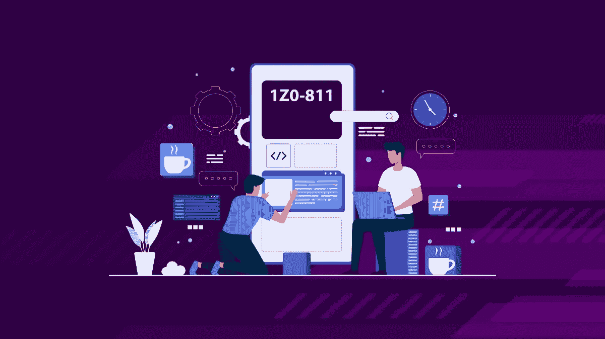
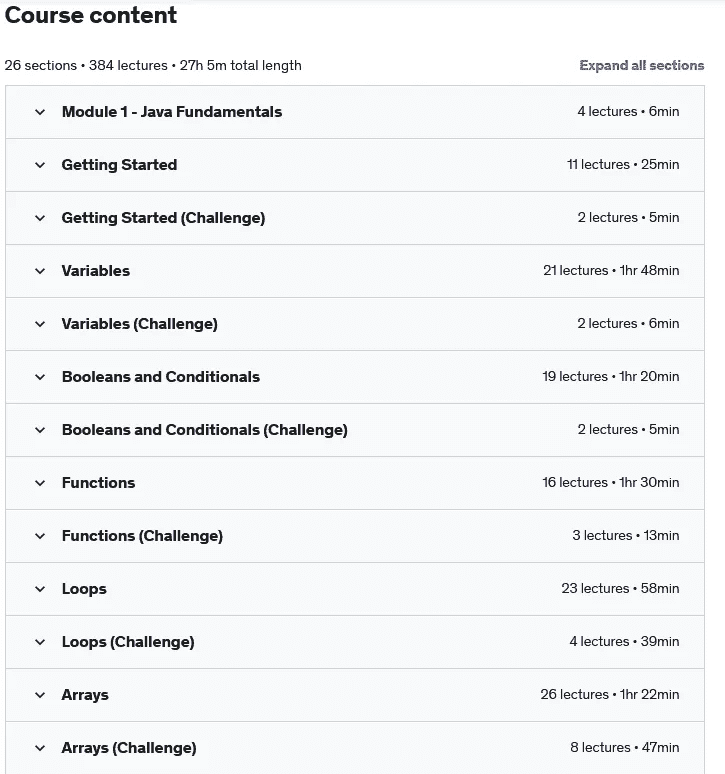
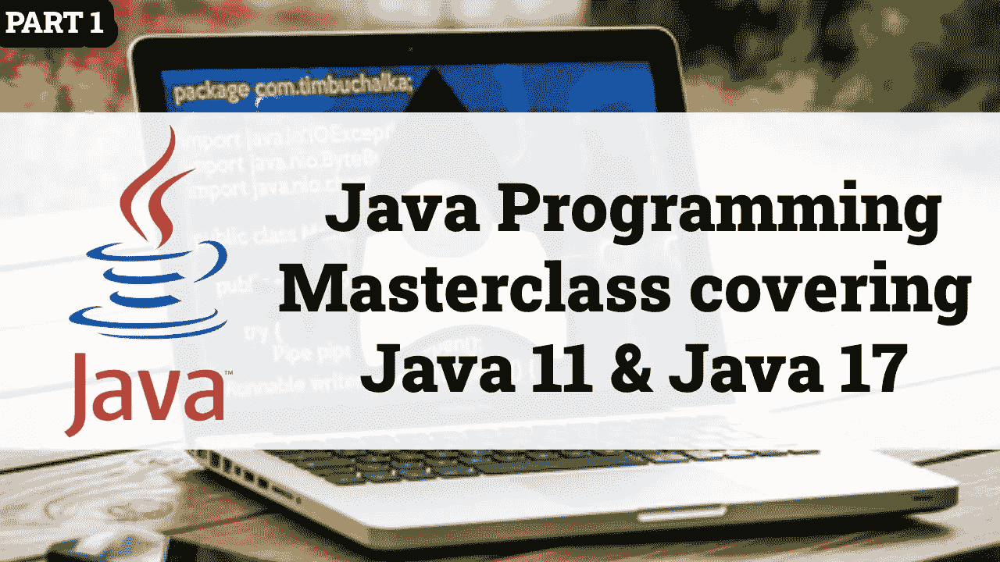
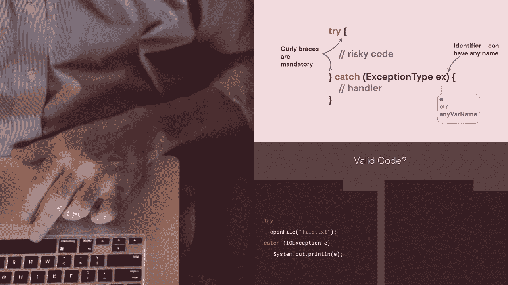
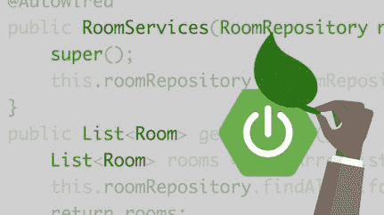
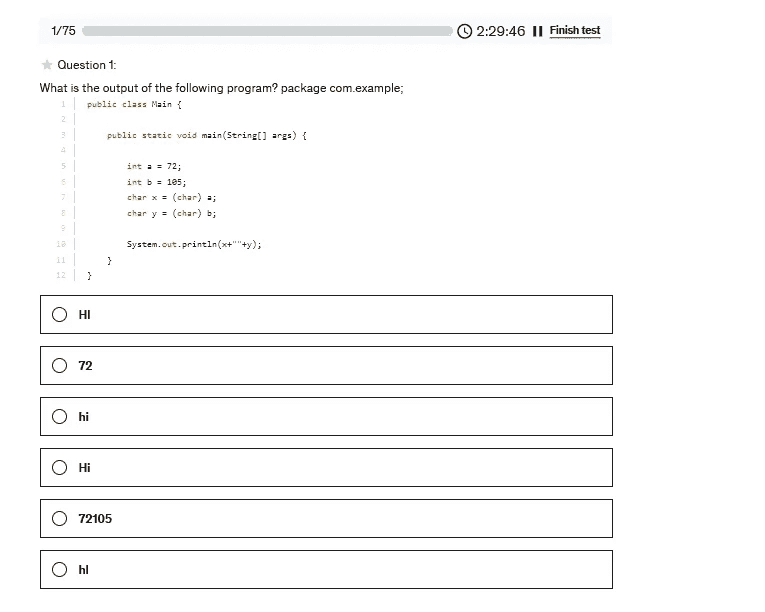
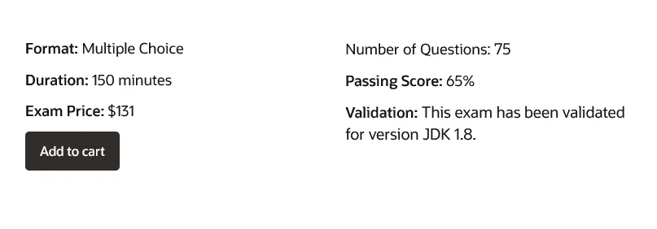

# 2022 年破解 1z 0–811 考试的 7 门最佳 Java 基础课程和实践测试

> 原文：<https://medium.com/javarevisited/7-best-java-foundations-courses-and-practice-test-to-crack-1z0-811-exam-e32819a12f5a?source=collection_archive---------2----------------------->

## 我最喜欢的 Java 在线课程和练习测试，为 1z 0–811 考试做准备，并成为一名认证 Java 基础工程师。

大家好，如果你正在准备代码为 1z 0–811 的 Java 基础认证考试，并且正在寻找最好的准备材料，如书籍、在线课程和教程，那么你来对地方了。

在过去，我已经分享了 [**最佳 Java 课程**](/javarevisited/top-5-java-online-courses-for-beginners-best-of-lot-1e1e240a758) 和 [**最佳初学者 Java 书籍**](/javarevisited/5-best-core-java-books-for-beginners-20e3f723e3a) ，在本文中，我将分享最佳在线课程和实践测试，您可以参加这些课程和实践测试来准备 2022 年的 Java 基础考试。

但是，在我告诉你可以用来提高你在 Java 基础中的机会的最佳课程和实践测试之前，让我告诉你 Java 基础认证到底是什么，因为许多 Java 开发人员和 Java 初学者不熟悉这个考试。

他们认为成为一名认证 Java 开发人员的唯一途径是通过[Java SE Developer 1z 0–819 考试](/javarevisited/5-best-books-courses-and-practice-tests-to-crack-java-se-11-certification-ocajp-11-1z0-815-6c861d6d147f)，这个考试相当难考，但是你不用担心，**通过 Java Foundations 1z 0–811 考试你还有另外一个选择。**

正如我所说的，这是一个初级认证考试，提供了实际操作 Java 知识和技能的具体证据。

Java 基础认证**也被称为 Oracle 认证基础助理考试。获得相关认证意味着您能够胜任 [Java 编程](/javarevisited/review-of-courseras-java-programming-software-engineering-fundamentals-specialization-4dcfa0ed2de4)的基础知识，使您能够展示概念性知识和实践技能。**

您还将充分意识到自己的能力，使您能够展示自己的潜力，并随着技能、知识和认证水平的提高，成为公司越来越有价值的资产。

[*Oracle Certified Foundations Associate certification for Java*](/javarevisited/7-best-online-courses-to-prepare-for-oracles-java-se-8-certification-ocajp-8-and-ocpjp-8-2fd0d6779a9e)主要面向参加过 Oracle Academy 计划的大专院校学生。

理想情况下，他们还应该学习计算机科学，包括相关的 Java 课程。尽管考试并不假设你有任何 Java 的专业实践经验，但你应该对 Java 编程语言和概念有一个基本的了解，并具备数学、逻辑和分析解决问题的技能。

# 2022 年面向初学者的 5 门最佳 Java 基础考试课程

在这里，我们整理了一个前 5 名课程的列表，你可以用它来通过 Java 基础认证考试。请继续阅读，了解更多信息。我将在线 Java 课程和 Java 实践测试都包括在内，因为它们对于构建和通过 Java 认证所需的速度和准确性非常重要。

我建议您首先通过在线课程学习 Java，然后尽可能多地解决练习题，以评估您的知识，并提高在给定时间内正确解决所有问题所需的速度和准确性。

## 1.[完整的 Java 开发训练营](https://click.linksynergy.com/deeplink?id=CuIbQrBnhiw&mid=39197&murl=https%3A%2F%2Fwww.udemy.com%2Fcourse%2Fthe-complete-java-development-bootcamp%2F)

这是 Udemy 上的一门新的 Java 课程，我加入它是因为它是由何塞·波尔蒂利亚和他的导师团队如 Ryan Slim 和 Jad Slim 创建的。我加入是因为我看到了波尔蒂利亚的名字，这是我从他的经典 Python 训练营课程中知道的，我必须说，我没有失望。

这是 2022 年学习 Java 的*最佳课程之一，非常适合想要首先学习 Java，然后通过 Java 基础考试成为认证 Java 专业人员的初学者和新手。该课程完全更新，并带有 *100+编码挑战*，这使得它非常有吸引力。*

它有超过 27 小时的内容，70 多篇文章和 4 个可下载的资源。它从头开始介绍 Java，这意味着您将学习变量、if 和 else 之类的控制语句、for、while 和 do-while 循环之类的循环，然后学习函数和类。这种结构使得它成为初学者学习 Java 的最佳资源之一。

本课程的内容也与 Java 基础考试相当一致，您可以将教学大纲与课程内容进行比较，这也使它成为 Java 基础考试的一个有吸引力的资源，我向所有第一次学习 Java 的人强烈推荐它，以通过这次考试。

这里是参加本课程的链接。[完整的 Java 开发训练营](https://click.linksynergy.com/deeplink?id=CuIbQrBnhiw&mid=39197&murl=https%3A%2F%2Fwww.udemy.com%2Fcourse%2Fthe-complete-java-development-bootcamp%2F)

## 2. [Java 编程大师班覆盖 Java 11 & Java 17](https://click.linksynergy.com/deeplink?id=JVFxdTr9V80&mid=39197&murl=https%3A%2F%2Fwww.udemy.com%2Fcourse%2Fjava-the-complete-java-developer-course%2F)

这是 Udemy 上的另一门精彩的 Java 课程，涵盖了学习 Java 所需的一切，包括 Streams、Lambdas、Regex、TDD、测试、可选、JDBC、SQL Intro 以及 Java 11 和 Java 17 的新特性。

购买本课程后，您将终身获得 80 多个小时的点播视频讲座、3 篇文章和 1 个可下载的教育资源。它还附带了 52 个编码练习。

本课程将从学习 Java 编程语言的基础开始。您将学习面向对象的编程、类和对象。

您还将发现 IntelliJ IDE 的强大功能，如重构、调试器和创建项目类型，如 Native Maven 和 Gradle。

**以下是加入本课程的链接—** [Java 编程大师班涵盖 Java 11 & Java 17](https://click.linksynergy.com/deeplink?id=JVFxdTr9V80&mid=39197&murl=https%3A%2F%2Fwww.udemy.com%2Fcourse%2Fjava-the-complete-java-developer-course%2F)

## 3.[专业 Java 开发人员职业入门:Java 基础](https://click.linksynergy.com/deeplink?id=CuIbQrBnhiw&mid=39197&murl=https%3A%2F%2Fwww.udemy.com%2Fcourse%2Fneutrino-java-foundations%2F)

在本课程中，您将学习基本的编程概念，如函数、for 循环和条件语句。你也将能够像程序员一样解决问题。

这是一门非常好的课程，可以从头开始学习 Java，也可以为 Java 基础考试做准备，因为它将教你如何使用 Java 编程语言和 JDK 类和库来编写代码。

当你完成本课程时，你不仅能够阅读他人编写的 Java 代码，而且能够自己编写 Java 程序。

**以下是加入本课程的链接—** [专业 Java 开发人员职业入门:Java 基础](https://click.linksynergy.com/deeplink?id=CuIbQrBnhiw&mid=39197&murl=https%3A%2F%2Fwww.udemy.com%2Fcourse%2Fneutrino-java-foundations%2F)

## 4. [Java 基础:异常处理](https://pluralsight.pxf.io/c/1193463/424552/7490?u=https%3A%2F%2Fwww.pluralsight.com%2Fcourses%2Fjava-fundamentals-exception-handling)

在本课程中，您将学习 Java 中异常处理的所有知识，从错误处理到创建您自己的自定义异常。

这是一门很棒的课程，因为它将教你 Java 中异常处理是如何工作的。您还将理解检查异常和未检查异常之间的区别。通过学习如何创建自定义例外，您将完成本课程。

**这里是加入本课程的链接—** [Java 基础:异常处理](https://pluralsight.pxf.io/c/1193463/424552/7490?u=https%3A%2F%2Fwww.pluralsight.com%2Fcourses%2Fjava-fundamentals-exception-handling)

不过，你需要一个 [Pluralsight 会员](https://pluralsight.pxf.io/c/1193463/424552/7490?u=https%3A%2F%2Fwww.pluralsight.com%2Fpricing%2Fskills)才能加入这个课程，费用大约是每月 29 美元或每年 299 美元(14%的折扣)。我向所有程序员强烈推荐这个订阅，因为它提供了超过 7000 个在线课程的即时访问，以学习任何技术技能。或者，你也可以使用他们的 [**10 天免费通行证**](https://pluralsight.pxf.io/c/1193463/424552/7490?u=https%3A%2F%2Fwww.pluralsight.com%2Fpricing%2Ffree-trial) 免费观看这门课程。

 [## Pluralsight |个人免费试用

### 立即开始免费试用 Pluralsight！查看我们为个人和团队提供的服务，如果您不确定…

pluralsight.pxf.io](https://pluralsight.pxf.io/c/1193463/424552/7490?u=https%3A%2F%2Fwww.pluralsight.com%2Fpricing%2Ffree-trial) 

## 5.[学习 Java【领英学习】](https://linkedin-learning.pxf.io/c/1193463/449670/8005?u=https%3A%2F%2Fwww.linkedin.com%2Flearning%2Flearning-java-4%3Ftrk%3Dlearning-serp_learning-search-card_search-card%26upsellOrderOrigin%3Ddefault_guest_learning)

这是 LinkedIn 学习平台上最受欢迎、评分最高的初级 Java 课程之一。这门课程的讲师是凯瑟琳·霍奇(Kathryn Hodge)，她是 LinkedIn Learning 的作者，也是康卡斯特 NBC 环球公司的软件工程师。

本课程将帮助您开始使用 Java，这是最流行的编程语言之一。该课程涵盖了所有基础知识，如数据类型、字符串、函数和 for 循环。

您将学习如何控制代码的流程和逻辑，并调试项目以确保其正常运行。你还将获得现实生活中的例子和挑战，让你测试自己。

**这里是加入本课程的链接**——[学习 Java【领英学习】](https://linkedin-learning.pxf.io/c/1193463/449670/8005?u=https%3A%2F%2Fwww.linkedin.com%2Flearning%2Flearning-java-4%3Ftrk%3Dlearning-serp_learning-search-card_search-card%26upsellOrderOrigin%3Ddefault_guest_learning)

顺便说一下，你需要一个 LinkedIn Learning 会员才能观看这个课程，费用大约为每月*29.99 美元*，但你也可以通过参加他们的 [**1 个月免费试用**](http://linkedin-learning.pxf.io/c/1193463/449670/8005?u=https%3A%2F%2Fwww.linkedin.com%2Flearning%2Fsubscription%2Fproducts) 来免费观看这个课程，这是探索他们 17000 多门最新技术在线课程的一个好方法。

 [## LinkedIn Learning 免费试用和订阅价格

### 从初级到高级的 18，000 多门专家指导课程的个性化、高质量内容。基于社区的…

linkedin-learning.pxf.io](http://linkedin-learning.pxf.io/c/1193463/449670/8005?u=https%3A%2F%2Fwww.linkedin.com%2Flearning%2Fsubscription%2Fproducts) 

# 2022 年 Java 基础考试[1z 0–811]的 2 个最佳实践测试

既然我们已经看到了学习 Java 编程语言和准备 Java 基础考试的在线课程，那么是时候看看最佳 Java 基础考试实践测试了。

这些模拟测试对于备考至关重要，因为它让您有机会在真实的考试环境中解决问题。我建议你解决尽可能多的问题，以便在第一次尝试中真正破解它。

## 1. [Java 基础考试 1z 0–811 模拟考试 2022 新增](https://www.udemy.com/course/java-foundations-exam-1z0-811-practice-tests-new/?referralCode=FE9DD7923503304B7EE3)【Udemy】

这是我自己的 Udemy 课程，在这里我分享了 3 个 Java 基础考试的全长练习题。每个模拟测试包含 75 个问题，它们与教学大纲紧密相关，并模拟真实的考试。

我还提供了每个问题的答案和详细的解释，你不仅可以了解问题的主要概念，还可以了解为什么其他选项是错误的。当你练习这些问题时，你还会学到一些东西，比如通过排除法找到正确的答案，因为我会高度关注每个选项。

为了获得最佳效果，我建议您在安静的、类似考试的地方进行这些模拟测试，并严格遵守时间表。把它当成模拟考试，尽你最大的努力拿 100/100 分。一旦你完成了考试，检查所有你做错的问题以及为什么它们是错的。

如果你有更多的时间，也检查一下哪个问题是正确的，并阅读他们的解释，以进一步巩固你的知识。这和我过去准备 Java 认证的方法一模一样，将帮助你在考试中获得 100 分。

**这里是加入本课程的链接** — [Java 基础考试 1z 0–811 模拟考试 2022 新](https://www.udemy.com/course/java-foundations-exam-1z0-811-practice-tests-new/?referralCode=FE9DD7923503304B7EE3)

## 2. [Java 认证:OCA(1z 0–808)考试模拟](https://click.linksynergy.com/deeplink?id=CuIbQrBnhiw&mid=39197&murl=https%3A%2F%2Fwww.udemy.com%2Fcourse%2Fjava-oca%2F)【Udemy】

如果您希望通过 Oracle Certified Associate:Java SE8 程序员认证考试，这是一门完美的课程。当您购买本课程时，您将获得 6 个模拟测试的终身访问权限，甚至可以在移动设备上访问。

这些模拟测试是由 Udayan Khattry 创建的，他是 SCWD SCJP 的 Oracle 数据库 SQL 认证专家。Udyan 对 Java 有深入的了解，他的问题是很好的答案，解释简洁，并提供了一个学习的机会。

**以下是加入本课程的链接** — [Java 认证:OCA(1z 0–808)考试模拟](https://click.linksynergy.com/deeplink?id=CuIbQrBnhiw&mid=39197&murl=https%3A%2F%2Fwww.udemy.com%2Fcourse%2Fjava-oca%2F)

# **Java 基础考试**常见问题

现在，让我们来看看关于该考试的常见问题，以及作为初学者为什么应该准备 Java 基础考试:

**1。什么是 Java 基础考试？** Java 基础认证也称为 Oracle 认证基础助理考试。获得相关认证意味着您有能力掌握 Java 编程的基础知识，使您能够展示概念性知识和实践技能。

**2。拿到这个认证有什么好处？** 你也将充分意识到自己的能力，随着你的技能、知识和认证水平的提高，你将展示自己的潜力，并成为公司越来越有价值的资产。

**3。我可以尝试这个认证吗？** Oracle Certified Foundations Associate certification for Java 主要面向参加过 Oracle Academy 计划的大专院校学生。

理想情况下，他们还应该学习计算机科学，包括相关的 Java 课程。

尽管该考试不要求任何 Java 专业实践经验，但您应该对 Java 编程语言和概念有一个基本的了解，并具备数学、逻辑和分析问题解决的技能。

**4。Java 1z 0–811 考试有多少题？**

总共有 75 个问题，及格分数为 65%，这意味着你需要回答 49 个问题才能通过考试。

以上是关于代码为 1z 0–811 的 Java 基础认证的**最佳在线课程和实践测试。如您所见，我已经为您提供了通过 Java 基础认证考试所需的所有资源。现在轮到你了。如果您喜欢这份 5 门最佳 Java 基础考试课程的列表，请随意与您的朋友和家人分享。**

其他**认证资源**针对 **IT 专业人士**和 Java 程序员

*   [2022 年 Java 开发者路线图](https://javarevisited.blogspot.com/2019/10/the-java-developer-roadmap.html)
*   [Java 基础认证官方指南](https://education.oracle.com/java-foundations/pexam_1Z0-811)
*   [Spring 认证对工作和事业有帮助吗？](https://javarevisited.blogspot.com/2017/07/does-spring-certification-help-in-job-and-career.html)
*   [如何破解 2022 年 AWS 解决方案架构师考试](https://javarevisited.blogspot.com/2019/08/how-to-crack-aws-certified-solution-architect-exam.html)
*   [面向程序员的 5 大免费 Java 11 实践测试](https://javarevisited.blogspot.com/2019/07/top-4-java-11-certification-free-mock-exams-practice-tests-ocajp11-ocpjp11-1z0-815-16-questions.html)
*   [如何通过 Spring Core Professional 5.0 认证](https://javarevisited.blogspot.com/2018/08/how-to-crack-spring-core-professional-certification-exam-java-latest.html)
*   [如何破解甲骨文 2022 年 Java 认证](https://medium.freecodecamp.org/how-to-pass-oracles-java-certifications-a-practical-guide-for-developers-e9b607ba6173)
*   [10 门学习数据结构和算法的免费课程](http://www.java67.com/2019/02/top-10-free-algorithms-and-data.html)
*   [通过 AWS 解决方案架构师助理考试的 5 次免费模拟测试](https://javarevisited.blogspot.com/2019/08/top-5-free-aws-solution-architect-Associate-certification-dumps-practice-questions.html)
*   每个软件开发人员都应该学习的 10 件事
*   [2022 年破解 PMP 认证的五大课程](https://javarevisited.blogspot.com/2019/09/top-5-courses-to-crack-pmp-project-management-professional-certification-exam.html)
*   [程序员学习 Git 的 5 大免费课程](https://javarevisited.blogspot.com/2018/01/5-free-git-courses-for-programmers-to-learn-online.html)
*   [OCAJP 和 OCPJP 考试 10 道免费样题](http://www.java67.com/2017/05/10-free-java-8-certification-sample-questions-OCAJP8-OCPJP8-Mock-Exams.html)

感谢您阅读本文。如果这些在线课程和模拟测试帮助您通过了 Java 基础 1z 0–811 认证，那么请与您的朋友和同事分享。如果您有任何问题或反馈，请留言。

**P. S.** —如果您是 Java 新手，并且正在寻找一门全面的课程来深入学习 Java，既有助于工作又能获得该证书，那么我强烈建议您查看 Udemy 上的 [**完整的 Java Masterclass**](https://click.linksynergy.com/deeplink?id=JVFxdTr9V80&mid=39197&murl=https%3A%2F%2Fwww.udemy.com%2Fcourse%2Fjava-the-complete-java-developer-course%2F) 课程。这是学习 Java 的最全面和最新的课程之一，涵盖了 Java 最新版本的新特性。

 [## 2022 年供初学者在线学习的 5 大 Java 编程课程——最好的

### 如果你是计算机科学专业的毕业生，或者想学习 Java 并且正在寻找一些很棒的资源，比如…

javarevisited.blogspot.com](https://javarevisited.blogspot.com/2018/05/top-5-java-courses-for-beginners-to-learn-online.html)