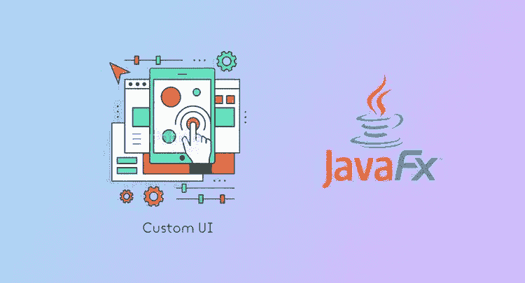
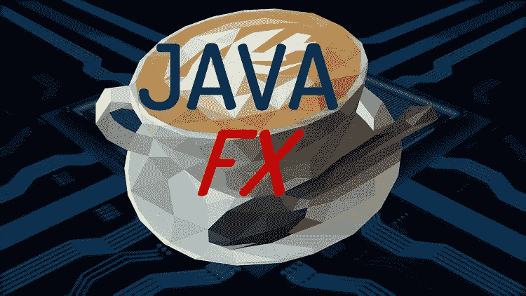
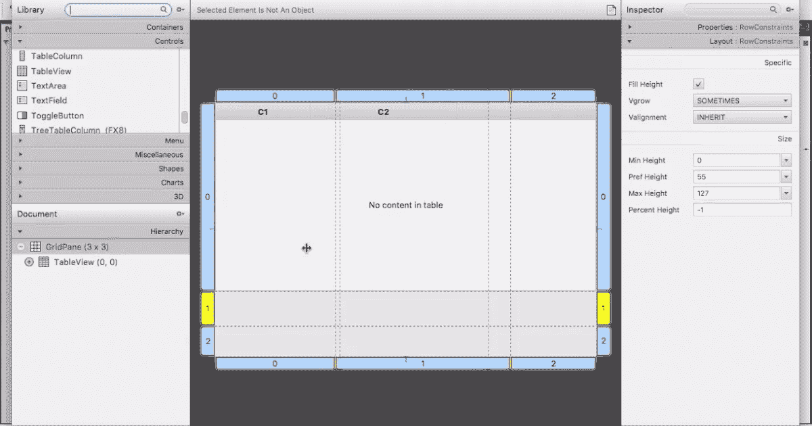
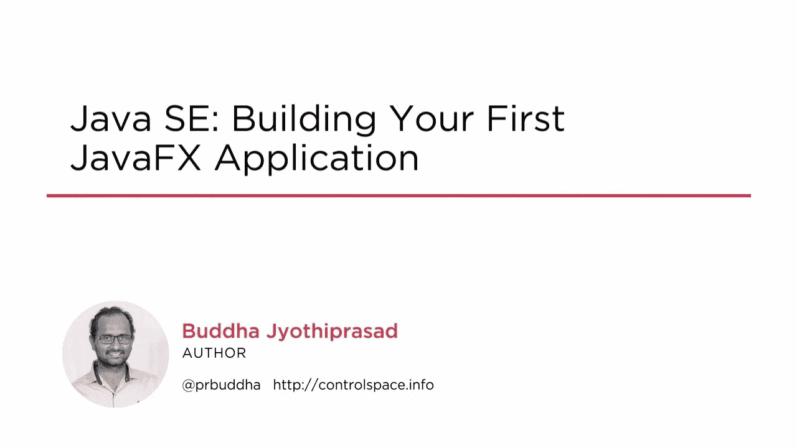
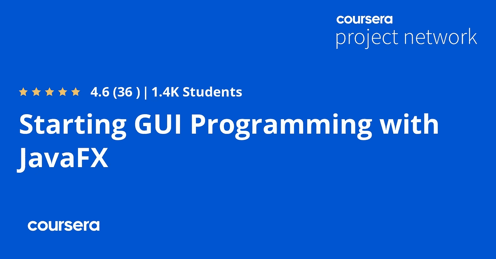
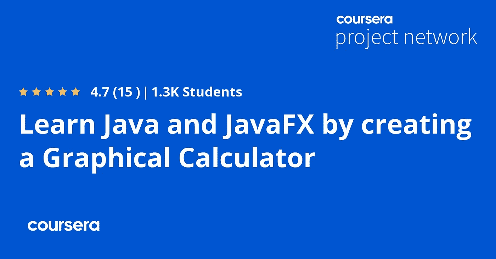
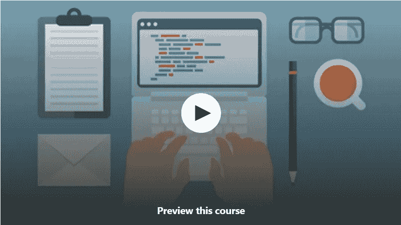

# 2023 年 7 门最佳 Java FX 初学者在线课程

> 原文：<https://medium.com/javarevisited/7-best-java-fx-online-courses-for-beginners-9e774ba6f996?source=collection_archive---------0----------------------->

## 我最喜欢的 2023 年从零开始学习 Java FX 的在线课程来自 Udemy，Pluralsight，Coursera，等网站。

image_credit — Udemy

大家好，如果你想学习 Java FX 的 GUI 编程，并寻找最好的 Java FX 课程，那么你来对地方了。之前，我已经分享了 [**最佳 Java 编程课程**](/javarevisited/top-5-java-online-courses-for-beginners-best-of-lot-1e1e240a758) 今天，我将与您分享从零开始学习 Java FX 的最佳在线课程。

Java FX 是用 Java 创建 GUI 应用程序的最新和最好的方法。曾经有一段时间，AWT 和 Swing 在用 Java 开发基于 GUI 的应用程序时非常流行，但慢慢地，Java Swing 让位于 [C#](https://www.java67.com/2019/03/5-free-c-net-courses-to-learn-online.html) ，后者成为开发桌面 GUI 的标准语言，AWS 也输掉了与 Swing 的战斗。

很长一段时间，没有一种流行的技术来用 Java 构建 GUI 应用程序，但后来 Java 引入了 **JavaFX、**一种更现代的 GUI 开发 API 来收复失地。

虽然我认为 Java FX 还没有达到 Swing 已经达到的高度，也没有挑战桌面 GUI 开发中的 [C#](/javarevisited/5-best-c-c-sharp-programming-courses-for-beginners-in-2020-494f7afc7a5c) ，但是它发展得很好，现在已经成为 GUI 开发的标准 Java 技术，尤其是开发跨平台 GUI 应用程序。

虽然 C#非常适合开发基于 Windows 的 GUI，但它仍然不是开发跨平台 GUI 的解决方案。我知道这两个[。NET](https://javarevisited.blogspot.com/2019/10/top-5-courses-to-learn-asp-net-in-2019.html) 和 [C#](/javarevisited/9-free-c-c-sharp-courses-and-tutorials-for-beginners-and-intermediate-programmers-best-of-lot-dc8c793aab31) 正在朝那个方向发展，但是前面还有很长的路要走，如果你现在想开发一个跨平台的 GUI，Java FX 可能是比任何其他技术更好的选择。

JavaFX 是 Java 进化的下一步。它旨在为企业业务应用程序提供一个轻量级的硬件加速平台。

从 JDK 7 开始，JavaFX 自动包含在标准的 JDK 和 JRE 包、Java 开发工具包 JDK 和 Java 运行时环境 JRE 中。

顺便说一句，如果你是 Java 世界的新手，并且正在寻找一门全面的 Java 课程来深入学习 Java，那么我强烈推荐你参加 Udemy 上由 Tim Buchalaka 开设的 [**完整的 Java 大师班**](https://click.linksynergy.com/deeplink?id=CuIbQrBnhiw&mid=39197&murl=https%3A%2F%2Fwww.udemy.com%2Fcourse%2Fjava-the-complete-java-developer-course%2F) 课程。这个 80+小时的课程是 2023 年在线学习 Java 最全面的课程。

 [## 完整的 Java 软件开发人员大师班(针对 Java 17)

### 你刚刚在网上偶然发现了最完整、最深入的 Java 编程课程。拥有超过 480，000 名学生…

udemy.com](https://click.linksynergy.com/deeplink?id=CuIbQrBnhiw&mid=39197&murl=https%3A%2F%2Fwww.udemy.com%2Fcourse%2Fjava-the-complete-java-developer-course%2F) 

# 2023 年学习 Java FX 的 7 门最佳在线课程

在不浪费你更多时间的情况下，这里列出了学习 Java FX 的最佳课程。这些是程序员(包括初学者和中级开发人员)在 Java FX 上评价最高、最受信任的在线课程，也是专家推荐的课程。

你没有必要参加所有的课程，你可以选择一个你和导师联系更好的课程。

我强烈推荐你*在加入这些 Java FX 课程之前先看看它们的预览*。这将有助于你判断这是否是适合你的课程。如果你可以不跳过地浏览预览，那么这是一个很好的迹象，表明你正在与教师沟通。

## 1.[使用 JavaFx 进行高级 Java 编程:编写电子邮件客户端](https://click.linksynergy.com/deeplink?id=JVFxdTr9V80&mid=39197&murl=https%3A%2F%2Fwww.udemy.com%2Fcourse%2Fadvanced-programming-with-javafx-build-an-email-client%2F)

如果你正在寻找一个实践的，基于项目的课程来学习 Java FX，那么这是最适合你的课程。顾名思义，您将通过构建一个电子邮件客户端来学习 JavaFX。我经常说，没有比实际动手更好的学习方法，本课程也遵循这一理念。你可以把这门课看作一个大型的编程练习。您将构建一些有意义的东西，在这个过程中，您将[学习 Java FX](/javarevisited/6-free-courses-to-learn-servlet-jsp-and-java-fx-in-2020-best-of-lot-720201c84f63) 并探索它的 UI 组件、数据绑定和并发解决方案。本课程分为 9 个部分，采用循序渐进的方法来构建软件，这对于初级和中级 Java 开发人员来说都是非常理想的。由 Alex Horea 创建的本课程有超过 7 个小时的内容和一个学习 Java FX 的大练习。完成本课程后，您还将获得一份结业证书，可以将其添加到您的简历中，以展示您的 Java FX 技能。

**这里是加入本课程**——[Java FX 高级 Java 编程](https://click.linksynergy.com/deeplink?id=JVFxdTr9V80&mid=39197&murl=https%3A%2F%2Fwww.udemy.com%2Fcourse%2Fadvanced-programming-with-javafx-build-an-email-client%2F)的链接

谈到社交证明，这是 [Udemy](https://javarevisited.blogspot.com/2019/08/top-10-udemy-courses-and-certifications-for-programmers.html) 上评分最高的 Java FX 课程，受到全球 3300 多名 Java 开发人员的信任，这真是太神奇了。如果你想在 2023 年学习 JavaFX，我强烈推荐你这门课。

## 2. [Java Fx 概念训练营 2023](https://click.linksynergy.com/deeplink?id=JVFxdTr9V80&mid=39197&murl=https%3A%2F%2Fwww.udemy.com%2Fcourse%2Fjava-fx-concepts-with-practical-examples%2F)【Udemy 课程】

这是学习 JavaFX 的最佳课程之一，适合初学者或任何想学习 Java FX 概念的人，以便使用 Java 编程语言创建 GUI。

在本课程中，你将学习 JavaFX 的所有基本概念，并结合实际例子。这是一门实践课程，您将通过下载和安装必要的软件来建立自己的开发环境。

你还可以访问实际例子的源代码文件，这样你就不需要在听课的时候重新编写代码了。

由 [Usman Raoof，](https://click.linksynergy.com/deeplink?id=CuIbQrBnhiw&mid=39197&murl=https%3A%2F%2Fwww.udemy.com%2Fuser%2Fabidraza2%2F) [Fahad Chaudhry](https://click.linksynergy.com/deeplink?id=CuIbQrBnhiw&mid=39197&murl=https%3A%2F%2Fwww.udemy.com%2Fuser%2Fdeniz-doruk%2F) 本课程包括 8.5 小时的内容、1 个可下载的资源、终身访问、在手机和电视上访问，以及可以在 LinkedIn 上展示或添加到您已经丰富多彩的简历中的结业证书。

**以下是加入本课程的链接** — [Java FX 概念及实例](https://click.linksynergy.com/deeplink?id=JVFxdTr9V80&mid=39197&murl=https%3A%2F%2Fwww.udemy.com%2Fcourse%2Fjava-fx-concepts-with-practical-examples%2F)

谈到社会证明，这门课程平均有 4.0 的评分，受到超过 1221 名学生的信任，这是很了不起的。总的来说，这是一门自学 Java FX 的好课程。

## 3. [Java SE:构建您的第一个 JavaFX 应用程序](https://pluralsight.pxf.io/c/1193463/424552/7490?u=https%3A%2F%2Fwww.pluralsight.com%2Fcourses%2Fjava-se-java-fx-application-building-your-first#)

如果您拥有 Pluralsight 会员资格，并且正在寻找学习 JavaFX 的课程，那么您应该查看该课程，快速了解 JavaFX 的基本特性，并帮助您构建您的第一个 Java FX 应用程序。

由佛陀 Jyothiprasad 创建，本课程将教你如何建立自己的开发环境，并从 word go 开始编写桌面应用程序。它还教您如何开发对用户事件做出反应的应用程序。

您还将了解如何保存用户数据，以及如何将任务存储在 XML 文件中，以便在会话间共享。完成本课程后，您将能够使用 Java FX 开发自己的桌面应用程序。

**这里是加入本课程的链接** — [Java SE:构建您的第一个 JavaFX 应用](https://pluralsight.pxf.io/c/1193463/424552/7490?u=https%3A%2F%2Fwww.pluralsight.com%2Fcourses%2Fjava-se-java-fx-application-building-your-first#)

顺便说一句，你需要一个 [**多重视野会员**](https://pluralsight.pxf.io/c/1193463/424552/7490?u=https%3A%2F%2Fwww.pluralsight.com%2Flearn) 才能进入这个课程。它的月费约为 29 美元，年费约为 299 美元，但它也提供了对 Pluralsight 上所有 7000 多门在线课程的访问。

由于程序员需要不断地学习让自己保持最新，我强烈建议你申请一个 Pluralsight 会员。你也可以试试他们的 [**10 天免费试用**](https://pluralsight.pxf.io/c/1193463/424552/7490?u=https%3A%2F%2Fwww.pluralsight.com%2Flearn) 免费进入这个 Java FX 课程。

 [## 对个人来说

### Pluralsight 的使命一直是公平的技术竞争环境。不管你想学什么，或者…

pluralsight.pxf.io](https://pluralsight.pxf.io/c/1193463/424552/7490?u=https%3A%2F%2Fwww.pluralsight.com%2Flearn) 

## 4.[用 JavaFX 开始 GUI 编程](https://coursera.pxf.io/c/3294490/1164545/14726?u=https%3A%2F%2Fwww.coursera.org%2Fprojects%2Fgui-programming-javafx)【Coursera 项目】

这是学习 JavaFX 并开始用 Java 编程语言创建 GUI 应用程序的最好的 Coursera 项目之一。如果你不知道 Coursera guided project 是学习任何新技能的最简单的方法。

你不需要下载任何软件，因为你的工作空间就在你的浏览器中的云桌面上，你的讲师将在分屏视频中一步一步地指导你。

在这个 2 小时的指导项目中，您将学习使用 JavaFX 创建 GUI 应用程序的基础知识。您将通过创建一个使用 Scene Builder 和 FXML 设计的简单用户界面来实现这一点。

GUI 应用程序本身将由 JavaFX 框架提供支持。

虽然 JavaFX 有相当多的组件提供了大量的功能，但是我们将着重于创建一些简单的东西来熟悉这个框架和它的一些核心功能。

**这里是加入这个项目的链接**——[用 JavaFX 开始 GUI 编程](https://coursera.pxf.io/c/3294490/1164545/14726?u=https%3A%2F%2Fwww.coursera.org%2Fprojects%2Fgui-programming-javafx)

## 5. [Java FX 初学者教程](https://click.linksynergy.com/deeplink?id=JVFxdTr9V80&mid=39197&murl=https%3A%2F%2Fwww.udemy.com%2Fcourse%2Fjavafx-tutorials-for-beginners%2F)【Udemy 在线课程】

这是 Udemy 上的另一个很棒的课程，学习用 JavaFX GUI 框架创建桌面应用程序，Java FX GUI 框架是用于创建桌面应用程序的现代标准 Java API。这是一门综合课程，在他的课程中，你将会学到几乎所有的 Java FX UI 组件。你将从基础开始，比如在不同的 Java IDEs 上安装 Java FX，比如在不同的操作系统上安装 [Eclipse](https://javarevisited.blogspot.com/2020/05/top-5-courses-to-learn-eclipse-ide-for-java-developers.html) 、 [IntelliJIdea](https://dev.to/javinpaul/5-best-courses-to-learn-intellij-idea-for-java-developers-5e6n) 、Netbeans 等，比如 Windows、Mac 和 Linux。

之后，您将学习如何创建我们的第一个 JavaFx 项目。然后，我们将学习如何内置使用不同的 JavaFX UI 控件，如标签、按钮、单选按钮、切换按钮、复选框、选择框、文本字段、滚动条、进度条和进度指示器、超链接、工具提示、HTML 编辑器、标题窗格和折叠、菜单、列表视图、表格视图、树视图和其他组件。

**这里是加入本课程的链接** — [Java FX 初学者教程](https://click.linksynergy.com/deeplink?id=JVFxdTr9V80&mid=39197&murl=https%3A%2F%2Fwww.udemy.com%2Fcourse%2Fjavafx-tutorials-for-beginners%2F)

谈到社会证明，77 名参与者对这门课程的平均评分为 4.3，已经有超过 3，334 名学生注册了这门课程，这充分说明了这门课程的质量。

## 6.[通过创建图形计算器学习 Java 和 Java FX](https://coursera.pxf.io/c/3294490/1164545/14726?u=https%3A%2F%2Fwww.coursera.org%2Fprojects%2Flearn-java-and-javafx-graphical-calculator)[项目]

这是 Coursera 的另一个非常棒的基于项目的课程，通过开发一个实时项目来学习 Java FX，一个图形计算器来学习基本的 Java FX 组件和概念。

在这个 1 小时 30 分钟长的项目中，您将学习如何使用 Java 及其最有前途的图形库之一创建一个全功能的图形计算器；JavaFX。

这个项目也给你一个世界上最广泛使用的编程语言的开端；Java，可以为你打开很多机会。

该项目将教你基本的编程基础，如数据结构和条件语句。学习 Java 和 JavaFX 将为您打开大门，让您创建丰富的跨平台应用程序来满足您的需求。

**这里是加入本课程的链接**——[通过创建图形计算器学习 Java 和 Java FX](https://coursera.pxf.io/c/3294490/1164545/14726?u=https%3A%2F%2Fwww.coursera.org%2Fprojects%2Flearn-java-and-javafx-graphical-calculator)

顺便说一句，如果你发现 Coursera 的课程很有用，因为它们是由世界各地的知名公司和大学创建的，我建议你加入 Coursera Plus 的订阅计划，它可以让你无限制地访问他们最受欢迎的课程、专业知识、专业证书和指导项目。

 [## Coursera Plus |无限制访问 7，000 多门在线课程

### 用 Coursera Plus 投资你的职业目标。无限制访问 90%以上的课程、项目…

coursera.pxf.io](https://coursera.pxf.io/c/3294490/1164545/14726?u=https%3A%2F%2Fwww.coursera.org%2Fcourseraplus) 

## 7.[Java FX 速成班:制作 GUI 应用程序的最佳方式](https://click.linksynergy.com/deeplink?id=JVFxdTr9V80&mid=39197&murl=https%3A%2F%2Fwww.udemy.com%2Fcourse%2Fcrash-course-into-javafx-the-best-way-to-make-gui-apps%2F)【免费】

这是初学者和中级 Java 开发人员学习 Java FX 的最佳免费在线课程之一。在本课程中，您将学习如何使用最流行的 Java GUI 工具包创建响应式 GUI 应用程序，并探索 JavaFX

的基础知识。在这个免费的 JavaFX 课程中，您将学习 Java FX 基础和基本 GUI 概念。即使你以前没有任何 GUI 编程经验，你也会发现你可以直接进入其中，因为所有的语法和概念都会被彻底解释。

由[**Anirudh Balasubramanian**](https://click.linksynergy.com/deeplink?id=CuIbQrBnhiw&mid=39197&murl=https%3A%2F%2Fwww.udemy.com%2Fuser%2Fanirudhbalasubramanian2%2F)创建，这个 4 小时 53 分钟的课程独特地带来了真实世界的项目，深入到每个主题，并不断实施我们所涵盖的主题。

**以下是加入本课程**—[Java FX 速成班](https://click.linksynergy.com/deeplink?id=JVFxdTr9V80&mid=39197&murl=https%3A%2F%2Fwww.udemy.com%2Fcourse%2Fcrash-course-into-javafx-the-best-way-to-make-gui-apps%2F)的链接

这个课程最大的好处是它是完全免费的，你不需要支付任何费用，你所需要的只是一个免费的 Udemy 账户。

以上就是学习 Java FX 的一些**最佳课程。**2023 年学习 JavaFX 的免费和付费课程你都看过。正如我说过的，Java FX 是 Oracle 最新的 GUI 开发技术，也是 JDK 的一部分。如果你想用 Java 开发一个 GUI 应用程序，那么 Java FX 是一个很好的开始。

您可能想探索的其他**编程资源文章**

*   [成为全栈 Java 开发人员的前 5 门课程](https://javarevisited.blogspot.com/2020/04/top-5-courses-to-become-full-stack-java-developer-with-Angular-and-Reactjs.html#axzz6Nq9yk7Sc)
*   [通过 Open JavaFX 开始使用 JavaFX](https://openjfx.io/openjfx-docs/)
*   [学习 Spring Security 和 OAuth 的 10 门课程 2](/javarevisited/top-10-courses-to-learn-spring-security-and-oauth2-with-spring-boot-for-java-developers-8f0222d6066d)
*   [5 门免费学习核心 Java 的在线课程](http://javarevisited.blogspot.sg/2017/11/top-5-free-java-courses-for-beginners.html#axzz4zuIICRs9)
*   [学习正则表达式的前 5 门课程](https://javarevisited.blogspot.com/2020/04/top-5-courses-to-learn-regular-expression-regex.html)
*   [学习 Java 微服务的 7 大课程](/javarevisited/top-5-courses-to-learn-microservices-in-java-and-spring-framework-e9fed1ba804d)
*   [编程/编码工作面试 10 门课程](http://javarevisited.blogspot.sg/2018/02/10-courses-to-prepare-for-programming-job-interviews.html)
*   [深入学习 Spring 的 5 大课程](https://javarevisited.blogspot.com/2018/06/top-6-spring-framework-online-courses-Java-programmers.html)
*   [面向有经验的 Java 开发人员的 5 大 Java 设计模式课程](http://javarevisited.blogspot.sg/2018/02/top-5-java-design-pattern-courses-for-developers.html)
*   [面向 Java 开发人员的 10 门高级 Spring Boot 课程](/javarevisited/10-advanced-spring-boot-courses-for-experienced-java-developers-5e57606816bd)
*   [学习 learn Shell 脚本的 5 门课程](http://javarevisited.blogspot.sg/2018/02/5-courses-to-learn-shell-scripting-in-linux.html)
*   [面向 Java 开发人员的 10 个免费 Spring Boot 教程和课程](/javarevisited/10-free-spring-boot-tutorials-and-courses-for-java-developers-53dfe084587e)

感谢您阅读本文。如果你喜欢这些*最佳 Java FX 在线课程*，那么请与你的朋友和同事分享。如果您有任何问题或反馈，请留言。

**P. S.** —如果您是 Java 世界的新手，并且正在寻找一门全面的 Java 课程来深入学习 Java，那么我强烈推荐您加入 Udemy 上由 Tim Buchalaka 及其团队开设的 [**完整的 Java 大师班**](https://click.linksynergy.com/deeplink?id=CuIbQrBnhiw&mid=39197&murl=https%3A%2F%2Fwww.udemy.com%2Fcourse%2Fjava-the-complete-java-developer-course%2F) 课程。它也是最新的课程，涵盖了最新 Java 版本的新特性。

 [## 完整的 Java 软件开发人员大师班(针对 Java 10)

### 你刚刚在网上偶然发现了最完整、最深入的 Java 编程课程。拥有超过 480，000 名学生…

udemy.com](https://click.linksynergy.com/deeplink?id=CuIbQrBnhiw&mid=39197&murl=https%3A%2F%2Fwww.udemy.com%2Fcourse%2Fjava-the-complete-java-developer-course%2F)