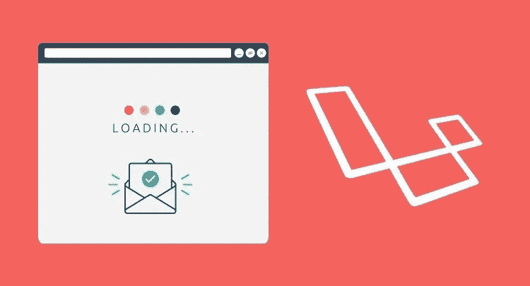
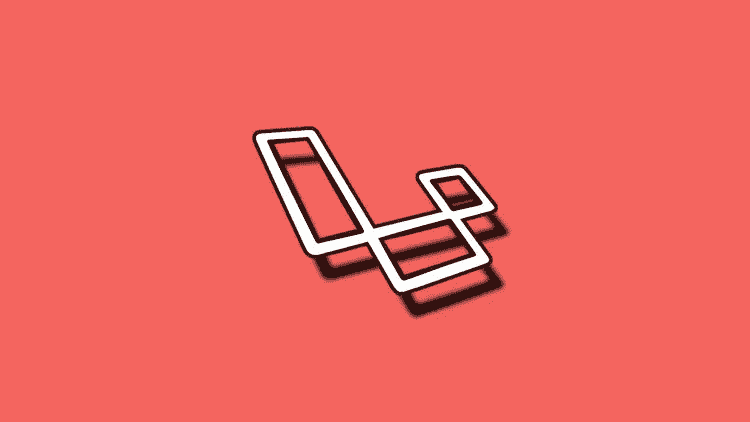
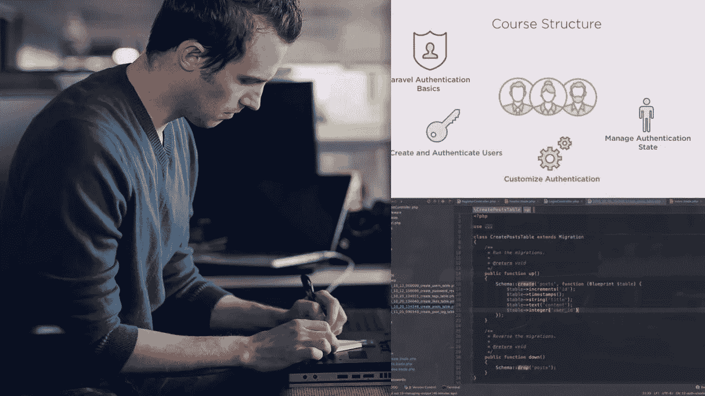
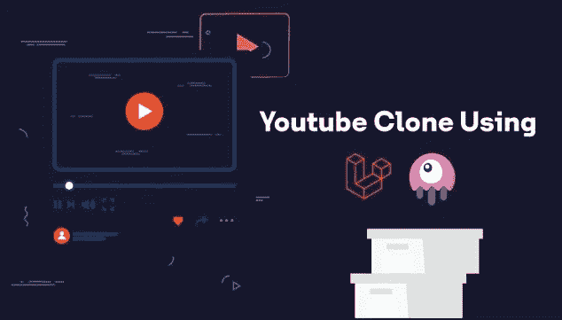

# 2023 年面向初学者和 PHP 开发人员的 7 门最佳 Laravel 在线课程

> 原文：<https://medium.com/javarevisited/7-best-laravel-online-courses-for-beginners-and-php-developers-61deac95f6b4?source=collection_archive---------0----------------------->

## 我最喜欢的学习 Laravel 的在线课程，Laravel 是一个来自 Udemy、Pluralsight 和其他在线学习门户的 PHP 后端框架。

大家好，如果你是一名 PHP 开发人员，想要学习 PHP 中强大的后端框架之一 Laravel，并寻找最好的资源，那么你来对地方了。前面我已经分享了学习 Nodejs 和 [Spring Boot](/javarevisited/top-10-courses-to-learn-spring-boot-in-2020-best-of-lot-6ffce88a1b6e) 这两个最流行的后端框架的 [**最佳课程，在这篇文章里，我将分享 2023 年学习 Laravel 的最佳在线课程。**](/javarevisited/top-10-online-courses-to-learn-node-js-in-depth-8ef0e31ca139)

许多人认为，自从 [Node.js](https://javarevisited.blogspot.com/2018/01/top-5-nodejs-and-express-js-online-courses-for-web-developers.html) 出现以来， [PHP](https://javarevisited.blogspot.com/2020/01/top-5-programming-language-for-freelancers-and-startups.html) 已经失去了它的突出地位。但是，它仍然是服务器端开发社区中最流行的语言之一。

对于 PHP 开发人员，尤其是熟悉某种 PHP 框架的开发人员，仍然有巨大的需求。一些流行的 PHP 框架有 Codeigniter、CakePHP、Yii 和 Laravel。在所有这些中，Laravel 最受欢迎。

由 Taylor Otwell 于 2011 年构建， [Laravel](https://laravel.com/) 是一个简单且富于表现力的 PHP 框架。以下是 Laravel 的一些优势:

1.  它有内置的认证。
2.  它是安全的。
3.  有几种授权技术。
4.  它带有一个面向对象的库。
5.  它支持对象关系映射。
6.  它可以很容易地与邮件服务集成。
7.  URL 生成得到了简化。
8.  它还支持 MVC 架构。
9.  单元测试很容易。
10.  它已经预装了模板工具

这些都是很好的优点。学习 Laravel 并不困难，尽管你可能需要适当的 PHP 知识。这篇文章将列出一些最好的在线课程。

这些课程是由专家创建的，受到了成千上万 PHP 开发人员的信任。他们也是从像两个最受欢迎的在线门户网站[**【Udemy】**](https://click.linksynergy.com/deeplink?id=JVFxdTr9V80&mid=39197&murl=https%3A%2F%2Fwww.udemy.com%2F)和 [**Pluralsight**](https://pluralsight.pxf.io/c/1193463/424552/7490?u=https%3A%2F%2Fwww.pluralsight.com%2Flearn) 这样的网站中挑选出来的。

# 2023 年学习的 7 门最佳 Laravel 在线课程

不要浪费你的时间，这里是你可以参加的学习 Laraval 框架的最好的在线培训课程。这些课程受到成千上万开发者的信任，并由 Udemy 和 Pluralsight 等流行的在线学习平台主办。

## 1.[面向初学者的带 Laravel 的 PHP 成为 Laravel 高手](https://click.linksynergy.com/deeplink?id=JVFxdTr9V80&mid=39197&murl=https%3A%2F%2Fwww.udemy.com%2Fcourse%2Fphp-with-laravel-for-beginners-become-a-master-in-laravel%2F)

如果你想掌握 Laravel，从路由、控制器、视图等基础到数据库、中间件、CRUD 操作等高级概念，《PHP with Laravel for 初学者——成为 Laravel 高手》是你的最佳选择。这门课是 udemy 最畅销的 Laravel 课程。

要求

*   需要 PHP 面向对象编程的基础知识

总共有 43 个小时的视频内容，这是一个巨大的课程。每个概念都解释得很好，没有匆忙。你还会发现额外的功能，甚至关于升级的 Laravel 版本的知识。如果你有足够的时间，就选这门课。

**这里是加入这个最好的 Laravel 课程的链接**——[PHP 与 Laravel 的初学者](https://click.linksynergy.com/deeplink?id=JVFxdTr9V80&mid=39197&murl=https%3A%2F%2Fwww.udemy.com%2Fcourse%2Fphp-with-laravel-for-beginners-become-a-master-in-laravel%2F)

## 2.[Laravel(PHP 框架)入门](https://pluralsight.pxf.io/c/1193463/424552/7490?u=https%3A%2F%2Fwww.pluralsight.com%2Fcourses%2Flaravel-php-framework-getting-started-users-authentication)【plural sight】

相对来说，较小的课程“Laravel (PHP 框架)-用户和认证入门”是为那些想学习 Laravel 认证和授权基础知识的人准备的。由于认证和授权是全栈开发的重要组成部分，您可能需要专门的课程来学习这些概念。Pluralsight 的这门课程是一个很好的选择，因为它是由最好的在线讲师 [Max Schwarzmuller](https://click.linksynergy.com/deeplink?id=JVFxdTr9V80&mid=39197&murl=https%3A%2F%2Fwww.udemy.com%2Fuser%2Fmaximilian-schwarzmuller%2F) 创建的。

先决条件:

*   PHP 知识

在参加了 Max 的[**Angular Complete Guide**](https://click.linksynergy.com/deeplink?id=JVFxdTr9V80&mid=39197&murl=https%3A%2F%2Fwww.udemy.com%2Fcourse%2Fthe-complete-guide-to-angular-2%2F)和 [**React Complete Guide、**](https://click.linksynergy.com/deeplink?id=JVFxdTr9V80&mid=39197&murl=https%3A%2F%2Fwww.udemy.com%2Fcourse%2Freact-the-complete-guide-incl-redux%2F) 和其他 web 开发课程后，我确信这将是另一个瑰宝，我没有失望。事实上，我很惊讶看到 Max 在 Pluralsight 上的课程，因为他主要在 Udemy 上发布他的课程。

**以下是加入本课程的链接**—[Laravel 入门](https://pluralsight.pxf.io/c/1193463/424552/7490?u=https%3A%2F%2Fwww.pluralsight.com%2Fcourses%2Flaravel-php-framework-getting-started-users-authentication)

要学习这门课程，你需要拥有 Pluralsight 会员资格，费用约为每月 29 美元或每年 299 美元。或者，你也可以利用他们的 [**10 天免费试用期**](https://pluralsight.pxf.io/c/1193463/424552/7490?u=https%3A%2F%2Fwww.pluralsight.com%2Flearn) 来免费参加这个课程。

 [## 对个人来说

### 无论你想进入一个新的领域，改善你的角色，还是把你的伟大想法变成现实，Pluralsight…

pluralsight.pxf.io](https://pluralsight.pxf.io/c/1193463/424552/7490?u=https%3A%2F%2Fwww.pluralsight.com%2Flearn) 

## 3.[拉韦勒项目:了解拉韦勒 10 号楼项目](https://click.linksynergy.com/deeplink?id=JVFxdTr9V80&mid=39197&murl=https%3A%2F%2Fwww.udemy.com%2Fcourse%2Fprojects-in-laravel-learn-laravel-building-10-projects%2F)

“项目在拉勒维尔:学习拉勒维尔建设 10 个项目”是一门课程，为那些喜欢学习不同的项目。在整个课程中，您将学习 10 个不同的项目。

课程从基础网站、待办事项等简单项目开始，逐渐过渡到图片库、REST API 等复杂项目，最后以 [Vue.js](/javarevisited/top-5-online-courses-to-learn-vue-js-in-2021-249e66b60646) 联系人管理器、带管理区的背包网站等高级项目结束。

要求

*   需要 PHP 的基础知识。
*   需要了解 HTML 和 JavaScript 的知识。

课程讲解了 Laravel 以及 API 集成、前端开发等其他重要概念。如果你已经熟悉 PHP，你可以去上这门课，因为它是一门中级课程。

**以下是加入本课程的链接** — [拉勒维尔项目:了解拉勒维尔建筑 10 项目](https://click.linksynergy.com/deeplink?id=JVFxdTr9V80&mid=39197&murl=https%3A%2F%2Fwww.udemy.com%2Fcourse%2Fprojects-in-laravel-learn-laravel-building-10-projects%2F)

## 4.[用 Laravel 构建 RESTful API:用 Laravel 构建真正的 API](https://click.linksynergy.com/deeplink?id=JVFxdTr9V80&mid=39197&murl=https%3A%2F%2Fwww.udemy.com%2Fcourse%2Frestful-api-with-laravel-php-homestead-passport-hateoas%2F)

RESTful 服务已经成为现代 web 开发中非常重要的一部分。为了理解和掌握 RESTful web 服务的概念，你需要适当的指导，Udemy 上的“RESTful APIs with PHP and Laravel”是可以指导你使用 PHP 和 Laravel 的 RESTful 服务的最好课程之一。

本课程讲解如何创建 API 端点，处理请求，在数据库中存储数据。这三个都是基本概念。此外，教师还解释了如何使用正确的身份验证来保护服务。
要求

*   需要 PHP 的知识。

总的来说，对于那些想学习 RESTful 服务和 PHP 以及 Laravel 的人来说，这个课程是一个很好的选择。如果你真的想完全使用 Laraval web 框架，你可以参加这个课程。

**这里是加入本课程**——[RESTful API with Laravel](https://click.linksynergy.com/deeplink?id=JVFxdTr9V80&mid=39197&murl=https%3A%2F%2Fwww.udemy.com%2Fcourse%2Frestful-api-with-laravel-php-homestead-passport-hateoas%2F)的链接

## 5.[Laravel——真实项目完全指南](https://click.linksynergy.com/deeplink?id=JVFxdTr9V80&mid=39197&murl=https%3A%2F%2Fwww.udemy.com%2Fcourse%2Fbest-laravel%2F)

不管你是 PHP 和 Laravel 的初学者还是高级水平，udemy 上的“Laravel 2023，真实世界项目的完整指南”是为每个人准备的。该课程从基础开始，逐渐过渡到涵盖几个优秀项目的高级课程。

要求

*   需要具备 [PHP](https://www.php.net/) 面向对象编程的基础知识。
*   需要理解 PHP 的 composer。

课程还有四个项目:任务申请、完整博客、完整论坛。项目真的很有趣，导师也定期更新课程。

**这里是加入这个 PHP 课程的链接——**[Laravel——完全指南](https://click.linksynergy.com/deeplink?id=JVFxdTr9V80&mid=39197&murl=https%3A%2F%2Fwww.udemy.com%2Fcourse%2Fbest-laravel%2F)

## 6.[使用 Laravel 和 Livewire 构建 Youtube 克隆](https://click.linksynergy.com/deeplink?id=JVFxdTr9V80&mid=39197&murl=https%3A%2F%2Fwww.udemy.com%2Fcourse%2Fbuilding-youtube-clone-using-laravel-and-livewire%2F)

这是一个基于项目的学习 Laravel 的在线课程，也是学习 Laravel 后端框架的最佳方式。在本课程中，您将使用 Livewire 构建一个 Youtube 克隆，并使用 FFMPEG 进行视频编码。

顺便说一下，这是一门高级 PHP 课程，期望你了解 PHP 和 Laravel 基础知识；以下是本课程的先决条件:

**课程前提:**

*   基本的 PHP 知识
*   基本的语言知识和建立语言环境的能力
*   基础知识 [Bootstrap CSS 框架](/javarevisited/6-best-bootstrap-online-courses-for-web-designers-and-developers-a688e192b2e2)
*   精通 [HTML](/javarevisited/10-best-html-and-css-courses-for-beginners-in-2021-6757eec00032) 、 [CSS](/javarevisited/10-best-css-online-courses-for-beginners-and-experienced-developers-54aa2e8c0253) 和 [Javascript](/javarevisited/my-favorite-free-tutorials-and-courses-to-learn-javascript-8f4d0a71faf2)
*   确保你至少有 PHP 7.4

总的来说，终极课程是建立有用的东西并学习。如果你了解 Laravel，并想把你的 PHP 和 Laravel 技能提高到一个新的水平或重新开始，这个课程是一个很好的资源加入。

**这是加入本课程的链接**——[使用 Laravel 和 Livewire 构建 Youtube 克隆](https://click.linksynergy.com/deeplink?id=JVFxdTr9V80&mid=39197&murl=https%3A%2F%2Fwww.udemy.com%2Fcourse%2Fbuilding-youtube-clone-using-laravel-and-livewire%2F)

以上是 2023 年 T4 学习 Laravel 框架的最佳在线课程。在所有的 PHP 框架中，Laravel 是最受欢迎的。PHP 可能已经过了它的黄金时期，但是它仍然没有任何发展。它仍然在全世界广泛使用。Laravel 在 PHP 框架的使用中占有绝大部分份额。所以值得学习 [Laravel](https://laravel.com/) 。

本文列出的课程是你会在网上找到的最好的 Laraval 培训课程。学习 Laravel，需要先有 PHP 的知识。这是所列课程中最基本的要求。

其他**您可能喜欢的 Web 开发文章**

*   [完整的 Web 开发者路线图](https://javarevisited.blogspot.com/2019/02/the-2019-web-developer-roadmap.html)
*   [我最喜欢学习的课程打字稿](/javarevisited/7-best-courses-to-learn-typescript-in-depth-58439e1ce729)
*   [面向 Web 开发者的 7 门免费 Node.js 课程](/javarevisited/7-free-courses-to-learn-node-js-in-2020-2f1dd6722b49)
*   [2023 年我最喜欢学的网页开发课程](/better-programming/my-5-favorite-courses-to-learn-web-development-in-2019-a5e74167f8b2)
*   [面向 Java 开发者的 5 门免费 Spring 框架课程](http://www.java67.com/2017/11/top-5-free-core-spring-mvc-courses-learn-online.html)
*   [深入学习 JavaScript 的 10 门课程](https://javarevisited.blogspot.com/2018/06/top-10-courses-to-learn-javascript-in.html)
*   [深入学习 HTML 和 CSS 的 5 大课程](https://javarevisited.blogspot.com/2019/05/top-5-html-5-and-css-3-courses-for-web-developers.html)
*   [2023 年学习 Bootstrap 的五门免费课程](https://www.java67.com/2019/01/5-free-bootstrap-course-to-learn-online.html)
*   [为什么学习 Web 开发永远不晚](https://javarevisited.blogspot.com/2019/06/its-never-too-late-to-learn-web-development.html)
*   [10 本书和课程学棱角](/javarevisited/top-10-angular-books-and-courses-for-beginners-and-experienced-web-developers-best-of-lot-9a2dae87f04c)
*   [2023 年学习 React 和 Redux 的 5 大课程](https://javarevisited.blogspot.com/2018/08/top-5-react-js-and-redux-courses-to-learn-online.html)
*   [深入学习 Angular 的前 5 门课程](https://javarevisited.blogspot.com/2018/06/5-best-courses-to-learn-angular.html)
*   [2023 年学习 Node.js 的 5 门最佳课程](https://javarevisited.blogspot.com/2018/01/top-5-nodejs-and-express-js-online-courses-for-web-developers.html#axzz5VllnxgVT)
*   [如何在 2023 年成为 Moder React JS 开发者](https://javarevisited.blogspot.com/2018/10/the-2018-react-developer-roadmap.html)

感谢您阅读本文。如果你觉得这些 *PHP 幼虫课程*有用，请分享给你的朋友和同事。如果您有任何问题或反馈，请留言。

**P. S.** —如果你对学习 Laraval 框架感兴趣，但正在寻找免费的在线培训课程，你也可以在 Udemy 上查看这个 [**面向初学者的幼虫 6 PHP 框架**](https://click.linksynergy.com/deeplink?id=JVFxdTr9V80&mid=39197&murl=https%3A%2F%2Fwww.udemy.com%2Fcourse%2Flaravel-6-framework%2F) 课程。本课程完全免费，您需要一个 Udemy 帐户才能在线参加本课程。

 [## 免费的 Laravel 教程——Laravel 6 PHP 框架，适合初学者

### 嗨！我是卡兹·阿里安。我是一名热爱教学的网络开发人员，我是 eLe easy Learning 的创始人，也是一名…

udemy.com](https://click.linksynergy.com/deeplink?id=JVFxdTr9V80&mid=39197&murl=https%3A%2F%2Fwww.udemy.com%2Fcourse%2Flaravel-6-framework%2F)