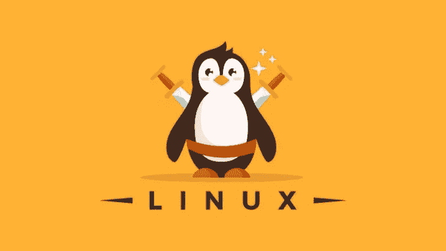
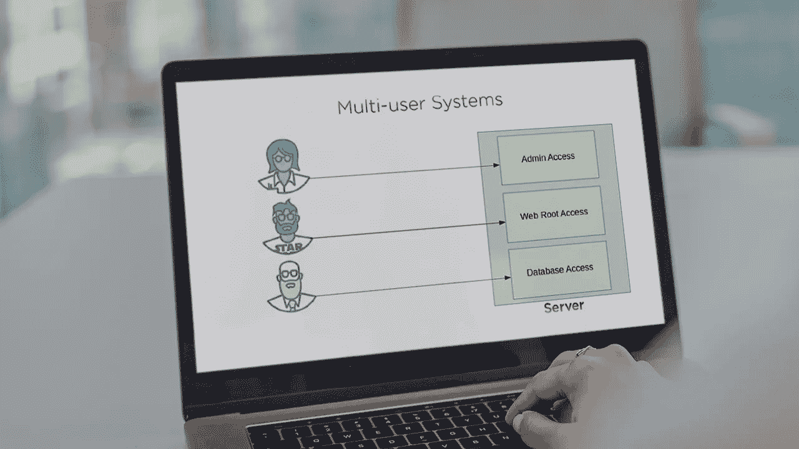
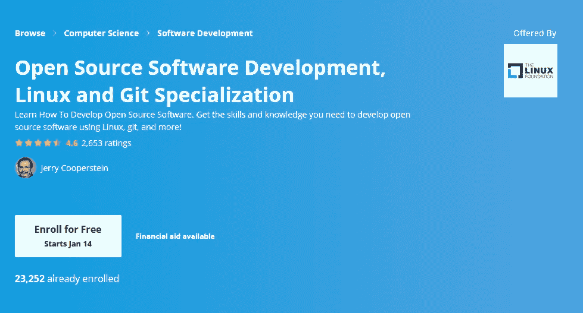
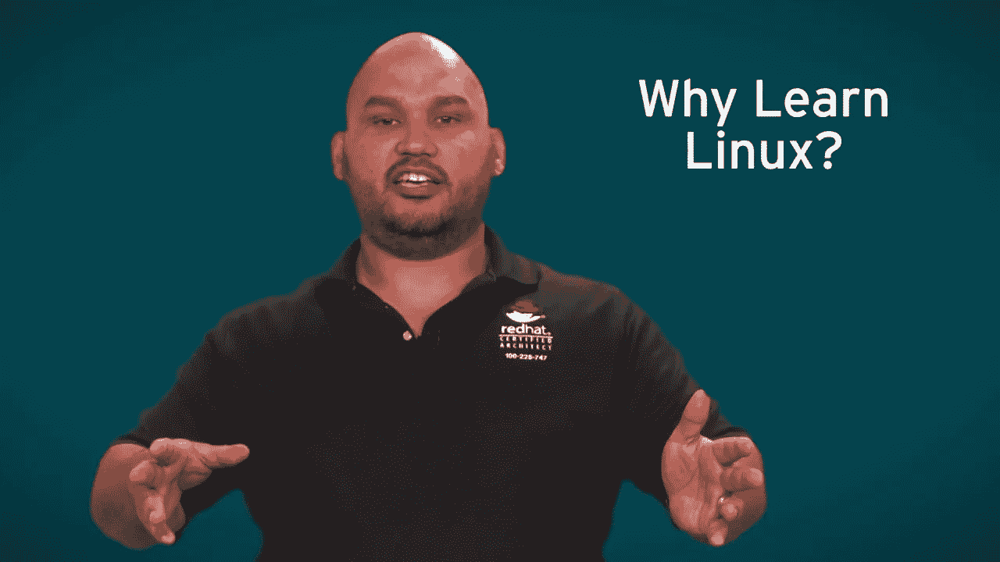
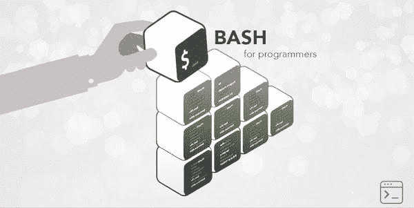
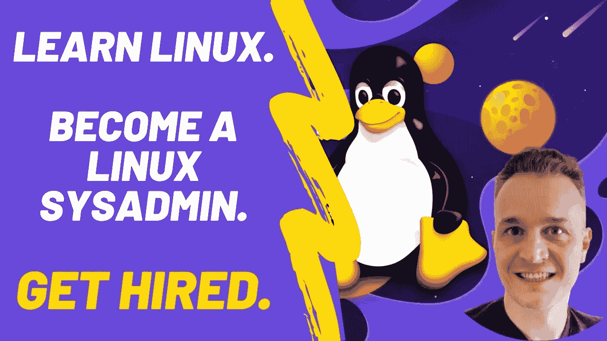

# 2023 年程序员和 DevOps 工程师在线学习的 8 门最佳 Linux 课程

> 原文：<https://medium.com/javarevisited/7-best-linux-courses-for-developers-cloud-engineers-and-devops-in-2021-7415314087e1?source=collection_archive---------0----------------------->

## Udemy、Coursera、edX、Pluralsight 的最佳 Linux 在线课程，面向初学者、有经验的开发人员和 DevOps 工程师。

image_credit — Udemy

大家好，如果你想在 2023 年学习 Linux 操作系统和 Linux 命令行，用于开发、云计算或 DevOps，并寻找最好的 Linux 课程，那么你来对地方了。以前我给程序员和开发者分享过一些 [**免费 Linux 课程**](/javarevisited/top-10-courses-to-learn-linux-command-line-in-2020-best-and-free-f3ee4a78d0c0?source=collection_home---4------0-----------------------) 和 [**免费 bash 脚本课程**](/javarevisited/6-free-courses-to-learn-bash-shell-scripting-in-linux-and-unix-a50461ecd4fe) 。

之后，你们中的许多人要求更全面的在线 Linux 课程，以深入学习 Linux，这激励我写这篇文章。在本文中，你会发现来自我最喜欢的在线学习平台 [Udemy](/javarevisited/10-best-udemy-online-courses-for-java-developers-4c9ab70cd01f) 、 [Pluralsight](/javarevisited/10-best-aws-certified-cloud-practitioner-clf-c01-online-courses-and-practice-test-to-crack-ecc0f913091e) 、 [Coursera](/javarevisited/18-coursera-courses-you-can-join-in-2020-to-learn-from-the-worlds-top-tech-companies-google-74af46967d1e?source=collection_home---4------0-----------------------) 、 [Educative](https://www.educative.io/subscription?affiliate_id=5073518643380224) 和 [edX](https://www.awin1.com/cread.php?awinmid=6798&awinaffid=631878&clickref=&p=) 的最佳 Linux 在线培训课程。

你可以加入这些*在线课程，深入学习 Linux】，成为更好更精通的开发者、系统管理员、[云工程师](/javarevisited/7-free-google-cloud-devops-engineer-certification-courses-f0046ac39f7e)和 IT 专业人士。其中一些 Linux 课程还为你提供了一个证书，你可以把它放在你的简历或 LinkedIn 个人资料中。*

作为一名 Linux 专业人员、用户或专家，你可以从事许多工作，比如 Linux 系统管理员，他的工作是管理组织中运行 Linux 的每一台计算机，比如管理超级用户或 root 用户，增强服务器的基础设施等等。

另一方面，你可以作为一名 **Linux 系统工程师**工作，你的工作是执行远程故障排除，为他们的 Linux 系统中的任何问题确定解决方案，等等。在一些公司，Linux 系统管理员的年薪约为 7.2 万美元，系统工程师的年薪约为 10 万美元或更多。

因此，如果你想成为一名 **Linux 系统管理员**或 *Linux 系统工程师*，你可以读完这篇文章，你会看到一些课程，教你如何从零到高级 Linux 用户作为一名专业人士使用 Linux。

Linux 也是[程序员](https://javarevisited.blogspot.com/2019/01/10-things-every-programmer-and-software-engineer-should-know.html)、[云工程师](/javarevisited/10-best-aws-certified-cloud-practitioner-clf-c01-online-courses-and-practice-test-to-crack-ecc0f913091e)和[开发者](https://dev.to/javinpaul/11-essential-skills-software-developers-should-learn-in-2020-1bio)的必备技能，因为它的性能和安全特性决定了大多数服务器端应用都运行在 Linux 上。

对于他们来说，掌握 Linux 操作系统、其引导过程、文件系统、重要目录、权限和其他基本概念的基础知识是非常必要的。现在你已经知道了 Linux 的重要性，让我们深入学习这些 Linux 课程。

# 2023 年面向初学者的 8 门最佳 Linux 在线课程

在不浪费你更多时间的情况下，这里有你可以参加的深入学习 Linux 的最好的在线课程。这些课程由专家创建，受到全球成千上万开发人员、云工程师、系统管理员和程序员的信任。如果你必须在 Linux 操作系统下工作，那么你必须在 2023 年参加这些课程来学习 Linux

## [1。Linux 精通:11.5 小时掌握 Linux 命令行](https://click.linksynergy.com/deeplink?id=JVFxdTr9V80&mid=39197&murl=https%3A%2F%2Fwww.udemy.com%2Fcourse%2Flinux-mastery%2F)

这是 2023 年学习 Linux 最好的 Udemy 课程之一。这个 Udemy 课程由 Ziyad Hiya 创建，它将通过基于项目的方法从头开始教你 Linux 命令行。

最重要的是，你会享受到学习经验，这是学习新技能的关键。本课程的另一个优点是，讲师将 CLI 和 GUI 混合在一起，展示了 Linux 用户和 Linux 管理员的两个世界。

这个 **11.5 小时的**课程将教会你以下事情:

1.  如何从头开始使用 Linux 命令行
2.  如何创建 Bash 脚本和 Cron 调度软件来自动化枯燥的任务！
3.  如何完全从命令行操作 Linux 电脑！
4.  如何在 Linux 机器上找到并安装软件？
5.  获得对 Linux 的全面理解&填补任何现有的知识空白！

总的来说，这是一门适合初学者的课程，组织良好，清晰明了，但仍然简洁明了，因此在各种主题上进步很快。

**这里是加入这个最好的 Linux 课程的链接**——[Linux 掌握:在 11.5 小时内掌握 Linux 命令行](https://click.linksynergy.com/deeplink?id=JVFxdTr9V80&mid=39197&murl=https%3A%2F%2Fwww.udemy.com%2Fcourse%2Flinux-mastery%2F)

## 2.【Linux 入门 (Pluralsight 最佳课程)

如果你想学习从初级到高级的 Linux 课程，并向你展示实用的课程，而不仅仅是关于历史等等的理论，你可以在 [Pluralsight](/javarevisited/10-best-aws-certified-cloud-practitioner-clf-c01-online-courses-and-practice-test-to-crack-ecc0f913091e) 上看到这个 Linux 入门课程。

你将从在你的机器上安装和管理 Linux 系统开始如何在开源操作系统上安装软件。接下来，将向您介绍 Linux 服务器版本，您将在 apache 服务器上安装它，以及如何使用这个版本的 Linux。

在本课程中，您将学到:

*   在你的电脑上安装 Linux 桌面。
*   如何使用 Linux 桌面？
*   安装和使用 Linux 服务器。

**这里是加入本 Linux 课程**—[Linux 入门](https://pluralsight.pxf.io/c/1193463/424552/7490?u=https%3A%2F%2Fwww.pluralsight.com%2Fcourses%2Fgetting-started-linux)的链接

顺便说一句，你需要一个 Pluralsight 会员才能参加这个课程，费用大约是每月 29 美元或一年 299 美元。这让你不仅能接触到这门课程，还能接触到 7000 多门关于最新技术的课程。或者，你也可以参加他们的 [**10 天免费试用**](https://pluralsight.pxf.io/c/1193463/424552/7490?u=https%3A%2F%2Fwww.pluralsight.com%2Flearn) 来免费参加这个课程。

<https://pluralsight.pxf.io/c/1193463/424552/7490?u=https%3A%2F%2Fwww.pluralsight.com%2Flearn>  

## 3.[开源软件开发，Linux 和 Git 专业化](https://coursera.pxf.io/c/3294490/1164545/14726?u=https%3A%2F%2Fwww.coursera.org%2Fspecializations%2Foss-development-linux-git)【Coursera 最佳课程】

这是在线学习 Linux 的最好的 Coursera 课程之一，它适合初学者和有经验的开发人员、云工程师，由 Linux 基金会提供。

如果你是开源世界的初学者，你想学习如何创建在 Linux 中工作的开源项目，以及如何作为专业人士使用 Linux 操作系统，那么你需要在 [**Coursera**](https://coursera.pxf.io/c/3294490/1164545/14726?u=https%3A%2F%2Fwww.coursera.org%2F) 上看到这个专业。

你将从开源项目的历史和它们如何造福世界开始，然后转向如何使用 [Linux](/javarevisited/top-10-courses-to-learn-linux-command-line-in-2020-best-and-free-f3ee4a78d0c0?source=collection_home---4------0-----------------------) 和[命令行](/javarevisited/top-10-unix-and-linux-productivity-tips-for-programmers-and-developers-c748129cf3e8)。接下来，您将了解如何使用 bash 脚本和自动化任务、文件系统等进行编程。

在本课程中，您将学到:

*   安装和使用 Linux。
*   使用 bash 脚本和编程。
*   创建开源项目。

最后，您将看到如何使用 git 来构建开源软件，以及如何初始化存储库和更改它们，等等。

**这里是加入 Coursera Linux 课程** — [开源软件开发、Linux 和 Git 专业化](https://coursera.pxf.io/c/3294490/1164545/14726?u=https%3A%2F%2Fwww.coursera.org%2Fspecializations%2Foss-development-linux-git)的链接

而且，如果你觉得 Coursera 的课程和证书有用，那么我也建议你加入 Coursera Plus 的<https://coursera.pxf.io/c/3294490/1164545/14726?u=https%3A%2F%2Fwww.coursera.org%2Fcourseraplus>**，这是 Coursera 的一个订阅计划，让你可以无限制地访问他们最受欢迎的课程、专业、专业证书和指导项目。它每年花费大约 399 美元，但是它完全值得你的钱，因为你得到了无限的证书。**

**<https://coursera.pxf.io/c/3294490/1164545/14726?u=https%3A%2F%2Fwww.coursera.org%2Fcourseraplus> ** 

## **4.[红帽企业 Linux 基础](https://www.awin1.com/cread.php?awinmid=6798&awinaffid=631878&clickref=&p=%5B%5Bhttps%3A%2F%2Fwww.edx.org%2Fcourse%2Ffundamentals-of-red-hat-enterprise-linux) (edX 最佳课程)**

**这是来自 edX 的最好的 Linux 课程，edX 是一个由麻省理工学院和哈佛大学创建的受欢迎的非营利性在线学习平台。Red Hat 是一个运行在云服务器上的开源 Linux 发行版，要管理它们，您需要成为一名 Linux 服务器管理员，本课程将向您传授这个 Linux 发行版的基础知识。

您将在本课程中学到:**

*   **使用命令行。**
*   **管理文件和权限。**
*   **安装和更新软件。**

**首先，您将学习如何使用 Red Hat Linux Enterprise 的命令行来管理文件，例如创建和编辑文件。然后学习如何管理用户和组，控制[文件权限](https://javarevisited.blogspot.com/2011/11/file-permissions-in-unix-linux-example.html)。最后，管理 Linux 进程并更新安装在这个 Linux 发行版上的软件。**

****这是 edX Linux 课程** — [红帽企业版 Linux 基础](https://www.awin1.com/cread.php?awinmid=6798&awinaffid=631878&clickref=&p=%5B%5Bhttps%3A%2F%2Fwww.edx.org%2Fcourse%2Ffundamentals-of-red-hat-enterprise-linux)的链接**

****

## **5.[程序员的狂欢(教育性最佳课程)](https://www.educative.io/collection/10370001/5734099469729792?authorName=Educative?affiliate_id=5073518643380224)**

**对于希望学习 Bash 和 Linux 的开发人员和 DevOps 工程师来说，这是另一个很好的课程。如果您不知道，Bash 是一个很好的自动化工具，因为它允许您编写 shell 脚本来自动化琐碎的任务。**

**本课程的目标是帮助你掌握 Linux，主要是 BASH。你将涵盖理论和实践两个方面。**

**首先，您将学习一些理解事物所必需的 Linux 概念，然后学习一些漂亮的命令，从中获得有用的东西。Educative 的互动学习平台让它变得更好。**

****这里是加入这个交互式 Linux 课程**——[程序员聚会](https://www.educative.io/collection/10370001/5734099469729792?authorName=Educative?affiliate_id=5073518643380224)的链接**

****

**而且，如果你找到一个教育平台和他们的互动课程，比如[钻研系统设计面试](https://www.educative.io/collection/5668639101419520/5649050225344512?affiliate_id=5073518643380224)、[钻研面向对象设计面试](https://www.educative.io/collection/5668639101419520/5692201761767424?affiliate_id=5073518643380224)，那么考虑购买 [**教育订阅**](https://www.educative.io/subscription?affiliate_id=5073518643380224) ，每月只需 14 美元就能获得他们的 100 多门课程。非常划算，非常适合准备编码面试。**

**<https://www.educative.io/subscription?affiliate_id=5073518643380224> ** 

## **6 [在 5 天内学会 Linux，提升你的职业生涯](https://click.linksynergy.com/deeplink?id=JVFxdTr9V80&mid=39197&murl=https%3A%2F%2Fwww.udemy.com%2Fcourse%2Flearn-linux-in-5-days%2F) (Udemy 课程)**

**如果你想在很短的时间内从头开始学习 Linux，学习如何使用命令行和不同的 Linux 发行版，那么 udemy 的这个课程非常适合你。你将从 Linux 的历史、什么是 Linux 以及如何在你的机器上安装它开始。接下来，您将从 Linux 的文件系统和最常用的命令行、超级用户/Root、Linux 目录等等开始。

在本课程中，您将学到:**

*   **在您的机器上安装 Linux 系统。**
*   **不同的 Linux 操作系统。**
*   **如何使用 Linux 命令行？**

**稍后，您将探索如何更改文件和目录权限、共享文件、定制命令提示符，以及如何在 Linux 系统上安装应用程序。**

****这是参加本课程的链接**——[在 5 天内学会 Linux，提升你的职业生涯](https://click.linksynergy.com/deeplink?id=JVFxdTr9V80&mid=39197&murl=https%3A%2F%2Fwww.udemy.com%2Fcourse%2Flearn-linux-in-5-days%2F)**

****

## **7. [Linux 管理训练营:从初级到高级](https://click.linksynergy.com/deeplink?id=JVFxdTr9V80&mid=39197&murl=https%3A%2F%2Fwww.udemy.com%2Fcourse%2Flinux-administration-bootcamp%2F)**

**这是学习 Linux 的最佳 Udemy 课程，尤其是对于有经验的开发人员。如果你想在 2023 年成为一名 Linux 管理员，并从头开始达到高级水平，那么这个课程很适合你，因为你将学到成为一名 Linux 管理员或服务器管理员所需的所有经验。

你将首先了解红帽等服务器中流行的 Linux 发行版以及如何安装它们，如何使用 Linux 命令行管理它们并与之交互。

你将在本课程中学习到:**

*   **不同的 Linux 发行版。**
*   **安装软件并管理它们。**
*   **配置 Linux 网络。**

**接下来，您将看到文件和目录权限以及如何更改它们，以及更多高级主题，直到您成为一名[专业 Linux 用户](https://dev.to/javinpaul/top-10-linux-courses-for-programmers-and-developers-5-are-free-43al)。**

****这里是加入这个 Linux 管理课程**——[Linux 管理训练营](https://click.linksynergy.com/deeplink?id=JVFxdTr9V80&mid=39197&murl=https%3A%2F%2Fwww.udemy.com%2Fcourse%2Flinux-administration-bootcamp%2F)的链接**

****

## **8. [DevOps Bootcamp:学习 Linux &成为 Linux 系统管理员](https://academy.zerotomastery.io/p/devops-bootcamp?affcode=441520_zytgk2dn)【ZTM】**

**这是 2023 年在线学习 Linux 的又一个惊人课程。这个 DevOps Bootcamp 课程的目的是让学生从一个完全的 Linux 初学者成为自信而有效的 Linux 系统管理员。**

**你可能在想为什么要学习 Linux？**

**因为 Linux 为互联网提供了动力。到处都是。从最小到最大的公司，如亚马逊、微软、SpaceX，他们都在后端使用 Linux。**

**这也是每个程序员需要学习的宝贵技能。在你职业生涯的某个时候，你可能不得不使用 Linux。所以这是一个扩展你的技能和推进你职业生涯的绝佳机会。**

****以下是加入本课程的链接** — [DevOps Bootcamp:学习 Linux &成为 Linux 系统管理员](https://academy.zerotomastery.io/p/devops-bootcamp?affcode=441520_zytgk2dn)**

****

**顺便说一句，你需要一个 [**ZTM 会员**](https://academy.zerotomastery.io/a/aff_c0gnlvf7/external?affcode=441520_zytgk2dn) 才能观看这个课程，这个课程每月花费大约 39 美元，但也提供了许多超级吸引人和有用的课程。你也可以使用我的代码**朋友 10** 来获得你选择的任何套餐的 10%的折扣。**

**<https://academy.zerotomastery.io/a/aff_c0gnlvf7/external?affcode=441520_zytgk2dn> ** 

**这就是为开发人员和 DevOps 工程师提供的最好的 Linux 在线课程。你可以参加这些课程中的任何一门或几门来深入学习 Linux。**

**与 Windows 和 macOS 等其他操作系统相比，Linux 更注重安全性和稳定性，这也是 Linux 在超级计算机和服务器上非常受欢迎的原因。在本文中，您已经看到了许多帮助您学习该系统的课程。**

**对于 Linux 系统管理员也有巨大的需求，如果你想成为一名 Linux 系统管理员，那么你可以在 2023 年加入这个资源从头开始学习 Linux。

其他**程序员免费在线课程****

*   **[深入学习 Docker 的 10 门免费课程](https://javarevisited.blogspot.com/2018/02/10-free-docker-container-courses-for-Java-Developers.html)**
*   **[2023 年学习 Kubernetes 的 7 门免费课程](/javarevisited/7-free-online-courses-to-learn-kubernetes-in-2020-3b8a68ec7abc)**
*   **[免费学习区块链技术的 5 门课程](http://www.java67.com/2018/02/5-free-blockchain-technology-courses.html)**
*   **[10 门免费学习数据结构和算法的课程](http://www.java67.com/2019/02/top-10-free-algorithms-and-data.html)**
*   **[5 门免费课程，学习核心 Spring、Spring Boot 和 Spring MVC](http://www.java67.com/2017/11/top-5-free-core-spring-mvc-courses-learn-online.html)**
*   **[2023 年网络开发者路线图](https://javarevisited.blogspot.com/2019/02/the-2019-web-developer-roadmap.html)**
*   **[2023 年学习 Linux 命令的 10 门免费课程](/javarevisited/top-10-courses-to-learn-linux-command-line-in-2020-best-and-free-f3ee4a78d0c0)**
*   **面向 Java 和 DevOps 工程师的 5 门免费 Docker 课程**
*   **[学习数据科学和机器学习的 10 门免费课程](http://www.java67.com/2018/10/top-10-data-science-and-machine-learning-courses.html)**
*   **[我最喜欢的 2023 年学 AWS 的课程](/javarevisited/top-10-courses-to-learn-amazon-web-services-aws-cloud-in-2020-best-and-free-317f10d7c21d)**
*   **[初学者学习 Java 的 10 门免费课程](http://www.java67.com/2018/08/top-10-free-java-courses-for-beginners-experienced-developers.html)**
*   **[学习 Oracle 和微软 SQL Server 数据库的 5 门课程](http://www.java67.com/2018/02/5-free-oracle-and-microsoft-sql-server-online-courses.html)**
*   **[2023 年十大云认证目标](https://www.java67.com/2020/09/top-10-cloud-certification-you-can-aim.html)**
*   **[成为全栈 Java 开发者的 10 门课程](/javarevisited/10-best-java-full-stack-web-development-courses-to-join-in-2020-6cd6cd2e5868)**
*   **[提高生产力和速度的 9 个 Linux 技巧](/javarevisited/top-10-unix-and-linux-productivity-tips-for-programmers-and-developers-c748129cf3e8)**

**感谢您阅读本文。如果你喜欢这些来自 Udemy、Pluralsight、Coursera 和 edX 的**最佳 Linux 在线培训课程**，那么请将它们分享给你的朋友和同事。如果您有任何问题或反馈，请留言。**

****附言——**如果你热衷于学习 Linux，但正在寻找免费的在线课程来开始你的培训，那么你也可以看看这个 [**Red Hat Enterprise Linux 技术概述(免费**](http://bit.ly/2hj3IYt) **)，这是 Udemy 的一个**免费课程。这是完全免费的，你只需要创建一个 Udemy 帐户就可以进入这门课程，它也是免费的。**

**<http://bit.ly/2hj3IYt> **