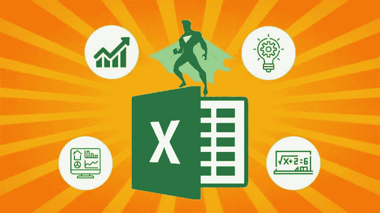
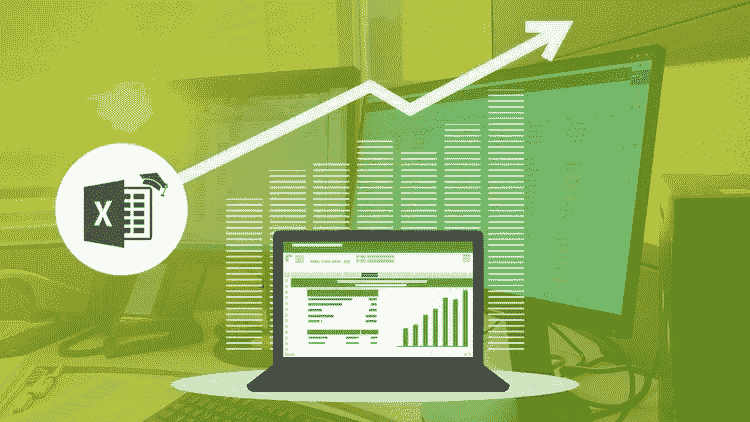
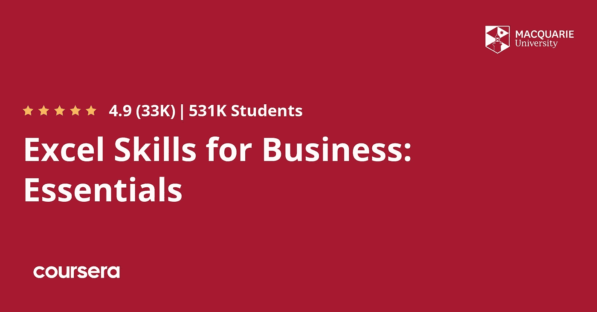
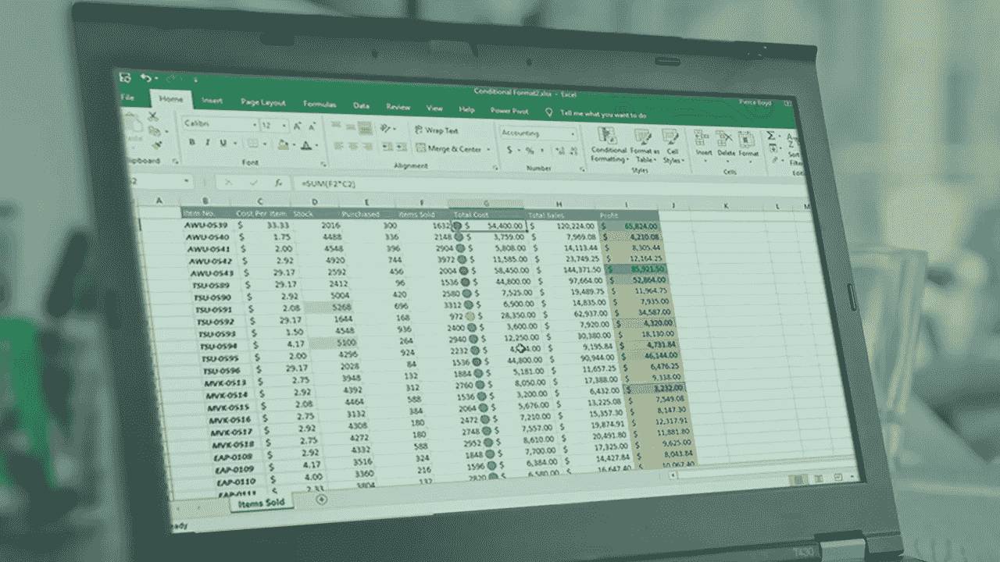
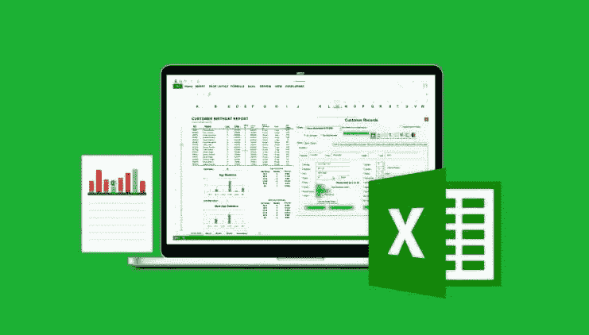
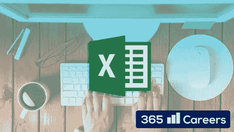
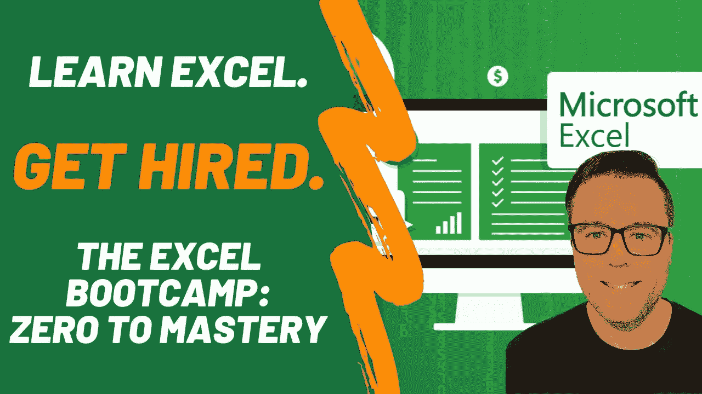

# 2023 年 IT 专业人士在线学习的 8 门最佳 Microsoft Excel 课程

> 原文：<https://medium.com/javarevisited/7-best-microsoft-excel-courses-for-beginners-33a069708680?source=collection_archive---------1----------------------->

## Udemy、Coursera 和 Pluralsight 为初学者和有经验的 IT 专业人员提供的学习 Microsoft Excel 的最佳在线课程集。

大家好，如果你想成为一名数据分析师并学习微软 Excel，或者想在 2023 年学习 Excel 并寻找最好的在线课程，那么你来对地方了。在过去，我已经分享了一些 [**高级 Excel 课程**](/javarevisited/5-advanced-courses-to-learn-microsoft-excel-in-depth-b556aaee5f6c) 来学习 VBA 和宏之类的东西，在这篇文章中，我将分享更多全面的 Excel 课程来深入学习 Microsoft Excel。

这些是来自 [Udemy](https://click.linksynergy.com/fs-bin/click?id=JVFxdTr9V80&offerid=323058.9410&type=3&subid=0) 、 [Pluralsight](https://pluralsight.pxf.io/c/1193463/424552/7490?u=https%3A%2F%2Fwww.pluralsight.com%2Flearn) 和 [Coursera](https://click.linksynergy.com/deeplink?id=JVFxdTr9V80&mid=40328&murl=https%3A%2F%2Fwww.coursera.org%2F) 等网站的最好的 MS Excel 课程，成千上万的开发人员加入了这些课程来学习这一有用的技能，你也可以这样做。

但是你可能在想**为什么要在 2023 年学 Excel？**2023 年 Excel 值得学习吗？有意义吗？？

“Excel？？来吧，为什么不是一个[区块链](/javarevisited/6-best-places-to-learn-blockchain-for-free-dcb20bd92c8f)？ [NFT](https://www.coursesrank.com/2022/02/10-best-courses-to-learn-nft-in-2022.html) ，还是 [Web3](/javarevisited/10-free-nft-non-fungible-tokens-metaverse-and-web3-0-courses-for-beginners-421b1d6ca263) ！”(你不担心吗😉)

我承认，一开始我并不认为真的有必要有一篇关于学习 Excel 的最佳在线课程的文章。但我错了。

它比我想象的要强大得多。

我有这个想法…这是不是很有趣，基本上每个应用程序(尤其是 B2B 应用程序)都有一个“导出到 excel / csv”按钮…对，为什么会这样？？…

可能是因为大约 7 . 5 亿人仍在使用 Excel🤯。尽管它于 1987 年首次推出，但仍在增长。

结合这一事实，Excel 有自己的内置编程语言(VBA)，很明显，Excel 是每个开发人员工具箱中的有用工具。

微软 Excel 是 IT 专业人士最重要的工具之一。它不仅是最常见的电子表格工具，还提供强大的图表和分析功能。

它不仅对程序员和支持专业人员有用，对从事 It 和计算机科学工作的其他人也同样有用，比如业务分析师(BAs)、质量分析师(QAs)和[项目经理](https://javarevisited.blogspot.com/2019/09/top-5-courses-to-crack-pmp-project-management-professional-certification-exam.html)。

如果你想要一个工具，可以比较数据，创建图表，做数据分析，并允许你创建一个强大的数据处理模板，然后学习 Excel。因为以上种种原因，我认为 Excel 在 2023 年及以后仍然值得学习。

我知道你们中的许多人已经知道微软的 Excel，但问题是大多数人只知道几个 Excel 的功能，而错过了许多对你的日常工作有帮助的有趣的东西。

例如，你可以使用 **VLOOKUP** 来查找一个出现在一个列表中但不在其他列表中的项目。类似地，您可以在名称列表中找到重复的元素，甚至删除重复的元素。它也是一个非常好的工具，可以根据模板自动生成 SQL 查询。

如果你确信 Microsoft Excel 是一个很棒的工具，学习它可以提高你作为 it 专业人员的工作效率，那么现在是时候深入研究一些有用的资源来学习和掌握 Microsoft Excel 了。

在本文中，我将分享一些**深入学习 Excel 的最佳课程**。这个列表既包含免费的 excel 课程，也包含付费的资源，对 IT 专业人士如程序员、软件工程师、商业分析师、质量分析师和项目经理都很有用。

微软办公软件无处不在，安装在超过 7.5 亿台电脑上，但大多数用户只知道如何建立一个基本的表格，甚至可能只是做一些公式。了解 Excel 2023 的基础知识可以帮助你成为一名更全面的专业人士。

它不仅对程序员和 It 专业人员有用，而且对担任行政助理办公室职员、审计师、会计师、商业分析师、金融分析师、信贷顾问、销售代表、销售经理、金融经理、投资银行家、房地产经纪人、市场研究分析师、金融顾问、业务运营经理和企业家的人也有用

# 初学者和有经验的 IT 专业人员学习 Microsoft Excel 的 8 个最佳在线课程

如我所说，微软 Excel 是一个非常有用的数据分析、核对和自动化工具。我曾经使用 Excel 分析数据，[使用一些基本的 Excel 函数及其公式复制功能生成 SQL 查询](https://javarevisited.blogspot.com/2017/03/how-to-enclose-list-of-values-into-single-quotes-using-microsoft-excel-for-sql-query.html#axzz6nqcNtdCN)。

作为一名 Java 开发人员，Excel 在分析数据、解决问题和提供生产支持方面帮助很大。我坚信每个程序员都应该了解 Excel 的基本知识。

## 1.[微软 Excel — Excel 从初级到高级](https://click.linksynergy.com/deeplink?id=JVFxdTr9V80&mid=39197&murl=https%3A%2F%2Fwww.udemy.com%2Fcourse%2Fmicrosoft-excel-2013-from-beginner-to-advanced-and-beyond%2F)

这是学习微软 Excel 最好最全面的课程之一。这只是一门课程，但涵盖了我迄今为止使用的几乎所有 Microsoft Excel 版本，包括 Microsoft Excel 2010、Excel 2013、Excel 2016、Excel 2019 以及 Office 365。

这门课最棒的地方是主题的逻辑发展，关于宏观和 VBA 的部分对我来说是新的。Excel 是一个非常强大的工具，了解它的所有方面是值得的。凯尔很好地解释了它们。

以下是您将在本课程中学到的重要知识:

1.  Microsoft Excel 的基础知识
2.  如何使用办公室中最常用的 Excel 函数
3.  如何在列表或表格中维护大量 Excel 数据
4.  如何在 IF、VLOOKUP、INDEX、MATCH 函数中使用动态公式
5.  如何使用 Microsoft Excel 的全部功能，通过宏和 VBA 自动完成日常任务
6.  如何通过掌握最流行的工具之一数据透视表来创建动态报表

讲师 [Kyle Pew](https://click.linksynergy.com/deeplink?id=JVFxdTr9V80&mid=39197&murl=https%3A%2F%2Fwww.udemy.com%2Fuser%2Fkyle-pew%2F) 是微软认证培训师，非常有知识，这在他的教学风格中表现出来。本课程对于希望学习 Microsoft Excel 处理常见任务的初学者和有经验的人都非常有用。

Kyle 也是一位反应非常迅速的培训师，如果您有任何疑问，可以在 QnA 中与他联系，他几乎总能给出准确的答案。

**这里是加入这个最好的 Excel 课程的链接**——[微软 Excel——Excel 从初级到高级](https://click.linksynergy.com/deeplink?id=JVFxdTr9V80&mid=39197&murl=https%3A%2F%2Fwww.udemy.com%2Fcourse%2Fmicrosoft-excel-2013-from-beginner-to-advanced-and-beyond%2F)

谈到社会证明，这是 Udemy 中最受欢迎的学习 Microsoft Excel 的课程之一，超过 464，832 名学生注册了该课程。近 139，359 名学员对该课程的平均评分为 4.6 分，这充分证明了该课程的质量。

## 2. [Excel 商务专业技能证书](https://coursera.pxf.io/c/3294490/1164545/14726?u=https%3A%2F%2Fwww.coursera.org%2Fspecializations%2Fexcel)【Coursera】

你会惊讶地发现，你还可以在 Coursera 上获得微软 Excel 认证，向全世界展示你的微软 Excel 技能。该专业面向当今寻求发展最关键和最基本的数字技能的任何人。这个专业化也给你提供了一个认证。当你完成每一门课程并完成动手项目时，你将获得一张[证书](https://javarevisited.blogspot.com/2019/10/top-5-coursera-professional-certificates-for-programmers-IT-professionals.html)，你可以与未来的雇主和你的职业网络分享。

本专业有 4 门课程
**1。商业 Excel 技巧:要点
2。商务 Excel 技能:中级 I
3。商务 Excel 技能:中级 II
4。商务 Excel 技能:高级**

与其他 Coursera 课程一样，这些课程也是免费审核的，这意味着您可以免费参加这些课程，但如果您需要认证，则需要支付少量费用。如果你需要一个证书在 LinkedIn 这样的社交媒体上分享，或者在你的简历上给潜在的雇主，这是一个很好的专业化加入。

**这里是加入本认证的链接——**——[Excel 商务专业技能证书](https://coursera.pxf.io/c/3294490/1164545/14726?u=https%3A%2F%2Fwww.coursera.org%2Fspecializations%2Fexcel)

而且，如果你觉得 Coursera 的课程和证书很有用，那么你也应该加入 Coursera Plus 课程，这是 Coursera 的一个订阅计划，它为你提供**无限制访问**他们最受欢迎的课程、专业、专业证书和指导项目。它每年花费大约 399 美元，但是它完全物有所值，因为你可以获得无限制的证书

 [## Coursera Plus |无限制访问 7，000 多门在线课程

### 在 Coursera 上可以无限制地访问 90%以上的课程、项目、专业和专业证书

coursera.pxf.io](https://coursera.pxf.io/c/3294490/1164545/14726?u=https%3A%2F%2Fwww.coursera.org%2Fcourseraplus) 

## 3.[比尔·凯勒曼的 Excel 2019 要点](https://pluralsight.pxf.io/c/1193463/424552/7490?u=https%3A%2F%2Fwww.pluralsight.com%2Fcourses%2Fexcel-2019-essentials)【plural sight】

如果你有 plur sight 会员资格，并且正在寻找一个在 plur sight 中学习 Microsoft Excel 的好课程，那么你会喜欢这个课程的。本课程《Excel 2019 essential》由比尔·库尔特曼(Bill Kulterman)创建，旨在教你 Excel 2019 的基础知识以及如何使用 Excel 2019。

以下是你在本课程中将学到的主要东西:
1。如何使用功能区界面和后台视图
2。如何使用工作表、单元格、列和行。
3。如何使用格式和自动选项

完成本课程后，您将掌握创建自己的电子表格和准备 Microsoft Office 考试所需的 Excel 2019 技能和知识。

**这里是加入本次 Excel 课程的链接**——[Excel 2019 精要](https://pluralsight.pxf.io/c/1193463/424552/7490?u=https%3A%2F%2Fwww.pluralsight.com%2Fcourses%2Fexcel-2019-essentials)

顺便说一句，你需要一个 Pluralsight 会员才能参加这个课程，费用是每月 29 美元或每年 299 美元(14%的折扣)。或者，你也可以参加他们的 [**10 天免费试训**](https://pluralsight.pxf.io/c/1193463/424552/7490?u=https%3A%2F%2Fwww.pluralsight.com%2Flearn) 来免费参加这个课程。

 [## 个人技术技能|多视角

### 借助 Pluralsight，在开发运维、机器学习、云、安全基础设施等领域构建所需技能…

pluralsight.pxf.io](https://pluralsight.pxf.io/c/1193463/424552/7490?u=https%3A%2F%2Fwww.pluralsight.com%2Flearn) 

## 4. [Microsoft Excel —高级 Excel 公式&函数](https://click.linksynergy.com/deeplink?id=JVFxdTr9V80&mid=39197&murl=https%3A%2F%2Fwww.udemy.com%2Fcourse%2Fexcel-for-analysts%2F)

这是一门学习 Microsoft Excel 进行数据分析的高级在线课程。本课程由我在 Udemy 上最喜欢的导师之一、Excel 专家[克里斯·达顿](https://click.linksynergy.com/deeplink?id=JVFxdTr9V80&mid=39197&murl=https%3A%2F%2Fwww.udemy.com%2Fuser%2Fchrisdutton3%2F)创建，本课程将教你所有你需要知道的关于 Microsoft Excel 进行数据分析的知识。

这里是你在这个课程中学到的主要东西:
1 .如何像 Excel 一样思考，从零开始写出强大动态的 Excel 公式？
2。如何使用 Excel 自动化、简化并彻底革新您的工作流程。
3。在其他课程中找不到的有用提示、工具和案例研究。
4。如何构建 Excel 公式来分析日期、文本字段、值和数组。

课程组织有序，主题涵盖了所有必要的功能，如果学员愿意在课程结束后更深入地学习，所有其他替代功能都将很容易理解和应用。Chris 的解释简单易懂，并附有例子，所以你会自动学习，我的意思是这个过程本身是如此之好，以至于成功只是一个副作用。

总的来说，这是学习 Microsoft Excel 有用功能和特性的最高级课程之一。

**以下是加入本课程的链接** — [Microsoft Excel —高级 Excel 公式&函数](https://click.linksynergy.com/deeplink?id=JVFxdTr9V80&mid=39197&murl=https%3A%2F%2Fwww.udemy.com%2Fcourse%2Fexcel-for-analysts%2F)

你还可以终身访问项目文件、测验、家庭作业练习和一对一的专家支持，这非常非常有用。谈到社交证明，这门课程受到超过 161，266 名学生的信任，在近 31，820 名参与者中平均得分为 4.6。

## 5.【Excel 程序员终极课程

到目前为止，我们已经看到了微软 Excel 的初级课程，Excel 的高级课程，现在是时候看看这个面向程序员的终极 Excel 课程了。这个课程是为任何想学习 Excel VBA 自动化秘密的人准备的。以下是你将在这门课程中学到的主要东西:
1 .如何自动化和自定义数据输入表单。
2。如何掌握多场景下的单元格和范围对象
3？如何自定义您的 VBA 编辑器，并了解所有的工具栏和选项。
4。如何从零开始记录、修改或编写宏
5。如何使用 IF-THEN 语句并征服所有逻辑运算符
7。如何调试和解决代码问题。
8。如何让 Excel 自动运行？对于完全的新手和/或正在寻找复习或参考工具的学生来说，该课程同样有用，可以为他们的项目挑选相关的课程。

**这里是加入本课程**—[Excel 程序员终极课程](https://click.linksynergy.com/deeplink?id=JVFxdTr9V80&mid=39197&murl=https%3A%2F%2Fwww.udemy.com%2Fcourse%2Fultimate-excel-programmer%2F)的链接

不需要事先的编程知识，但是如果你有一些微软 Excel 的知识，那么这是一个完美的课程来补充你的技能，并通过一些实践使它们达到一个水平。

谈到社会证明，这门课程受到超过 98，014 名学生的信任，在近 12，693 名参与者中，平均得分为 4.4。对于任何想学出类拔萃的人来说，这确实是一门有用的课程。

## 6.[微软 Excel 2016 初学者&中级 Excel 培训](https://click.linksynergy.com/deeplink?id=JVFxdTr9V80&mid=39197&murl=https%3A%2F%2Fwww.udemy.com%2Fcourse%2Fmicrosoft-excel-2016-beginners-intermediate-excel-training%2F)

这是另一个从零开始学习 Microsoft Excel 的很棒的 Udemy 课程。本课程使用的 Microsoft Excel 2016 不是最新版本，但仍然是最受欢迎的 Excel 版本，基础知识没有太大变化。

由 365 Careers 创建，这是 Udemy 上最好的 Excel 课程之一，它包括你需要的一切。我们将从最基本的开始，然后逐步建立一个坚实的基础，在你的整个职业生涯中为你服务。

以下是本课程的一些 USP:

*   高质量的制作—高清视频和动画幻灯片
*   知识渊博的讲师(四大会计+商业金融经验)
*   可下载的资料:课程附带了一整套可下载的资料(讲义、Excel 文件等。)
*   广泛的案例研究将帮助你巩固你所学的一切
*   出色的支持:如果您不理解某个概念，或者您只是想给我们写信，我们会在 24 小时内给您答复

本课程适合之前没有任何 Excel 使用经验的人。您将从非常基础的内容开始学习，并逐渐转向一些更高级的功能，如查找函数、带条件的函数、目标搜索、数据透视表、自定义格式、Excel 2016 图表以及其他常用于财务建模的工具。

**这里是加入本课程的链接**——[微软 Excel 2016 初学者&中级 Excel 培训](https://click.linksynergy.com/deeplink?id=JVFxdTr9V80&mid=39197&murl=https%3A%2F%2Fwww.udemy.com%2Fcourse%2Fmicrosoft-excel-2016-beginners-intermediate-excel-training%2F)

## 7.[微软 Excel 从零到英雄:完整 Excel 指南 2023](https://click.linksynergy.com/deeplink?id=JVFxdTr9V80&mid=39197&murl=https%3A%2F%2Fwww.udemy.com%2Fcourse%2Fexcel-quick-start-guide-from-beginner-to-expert%2F)

这是 Udemy 为初学者提供的另一个很棒的 Excel 课程。本 Microsoft Excel 课程将通过精心设计的课程，仅教授您在商业环境中最常用的 Excel 功能，让您成为 Microsoft Excel 的大师。

这是一个完整而简洁的 MS Excel 教程，可以在 6 小时内完成。我们知道您的时间很重要，因此我们创建了这个快节奏的课程，不会在不相关的 Excel 操作上浪费时间。

以下是您将在本课程中学到的关键技能:

*   **数学函数**如 SUM、AVERAGE、RAND、MIN & MAX、SUMPRODUCT。
*   **文本公式**如修剪、连接、替换、上&下、长度、左、右&中间
*   **逻辑公式**如 AND & OR，IF，COUNTIF，SUMIF
*   **日期-时间(时态)公式**如今天&现在，日，月&年，日期定义&天
*   **查找公式**如 VLOOKUP、HLOOKUP、INDEX、MATCH
*   **数据工具** —本讲座涵盖数据操作工具，如数据排序和过滤、数据验证、删除重复、导入数据(文本到列)
*   **格式化数据和表格**如着色、改变字体、对齐和表格格式化选项，如添加边框、突出显示表格标题、带状行等。
*   **数据透视表**、**图表** as、条形图/柱形图、折线图、散点图、饼图&圆环图、统计图—直方图、瀑布图、迷你图
*   **宏**如录制宏、运行宏、创建运行宏的按钮。

要么您是 Excel 新手，要么您已经使用过它，但希望更好地使用 Excel 的高级功能。不管怎样，这个课程对你来说都很棒。

**这里是加入这个最好的 Excel 课程的链接**——[微软 Excel 零到英雄:Excel 完全指南 2023](https://click.linksynergy.com/deeplink?id=JVFxdTr9V80&mid=39197&murl=https%3A%2F%2Fwww.udemy.com%2Fcourse%2Fexcel-quick-start-guide-from-beginner-to-expert%2F)

## 8.Excel 训练营:零到精通【ZTM 学院】

这是 2023 年学习 Microsoft Excel 的又一门令人惊叹、极具吸引力的最新课程。这个课程是由 ZTM 学院和安德烈·内戈伊创建的，只对 ZTM 成员开放。

本课程将教你从零开始学习 Excel。即使你已经知道一些 Excel，你也会学到高级的主题，比如数据分析和建模、数据透视表和 VBA。

这个 14 个多小时的全高清课程将教你成为 10%顶尖 Excel 专家所需学习的一切。它还附带 13+额外的练习，项目和资源，进入独家 ZTM 社区，你还将获得一个结业证书。

**以下是加入本课程的链接—**[Excel 训练营:零到精通](https://academy.zerotomastery.io/p/excel-bootcamp?affcode=441520_zytgk2dn)

这个 Excel 课程是给谁上的？本 Excel 课程面向希望学习和掌握 Excel 的初学者和高级专业人员。

任何像开发人员、[数据科学家、](/javarevisited/10-free-data-science-online-courses-for-beginners-a5fe78c2cb7b)、[机器学习工程师](https://javarevisited.blogspot.com/2021/01/10-tools-data-scientists-and-machine-learning-engineers.html)、业务分析师、产品经理、销售/营销人员以及任何使用数据进行商业决策的人都可以加入这个课程学习 Excel。

本课程也非常适合希望在数据分析和/或数据科学领域工作的任何人，以及希望通过将数据科学和数据分析技能添加到自己的工具包中来加快职业发展的程序员。

顺便说一句，你需要一个 [**ZTM 会员**](https://academy.zerotomastery.io/a/aff_c0gnlvf7/external?affcode=441520_zytgk2dn) 才能观看这个课程，这个课程每月花费大约 39 美元，但也提供了许多超级有趣和有用的课程。您还可以使用我的代码**好友 10** 获得您选择的任何套餐的 10%折扣。

 [## 学习编码。被录用。加入零至掌握学院。|零到精通

### 不要在无聊、过时的教程上浪费时间。加入 500，000 多名学生的行列，学习编程，获得聘用并在以下领域取得成功…

academy.zerotomastery.io](https://academy.zerotomastery.io/a/aff_c0gnlvf7/external?affcode=441520_zytgk2dn) 

以上就是 2023 年学习微软 Excel 的一些**最佳在线课程。微软 Excel 是任何 IT 专业人士最重要的工具之一。**

正如我所说的，一个普通的 IT 专业人员在使用 Microsoft Excel 时很少触及皮毛，学习它不仅可以让你在分析和工作中更有效率，还可以让你成为一个更全面的开发人员。

其他**数据分析文章和资源**你可能喜欢

*   [2023 年学习微软 Power BI 的前 5 门课程](https://www.java67.com/2020/06/top-5-courses-to-learn-microsoft-power-BI.html)
*   [深入学习 VBA 和 Excel 宏的五大高级课程](https://javarevisited.blogspot.com/2019/09/top-5-courses-to-learn-microsoft-excel-macros-vba-and-data-visualization.html)
*   [学习 Tableau for Data Visualization 的前 5 门课程](https://javarevisited.blogspot.com/2019/07/top-5-tableau-online-courses-and-certifications-for-data-science-engineers.html)
*   每个程序员都应该学习的 12 件事
*   [学习 Python 进行数据分析的 5 大课程](https://javarevisited.blogspot.com/2019/10/top-5-courses-to-learn-pandas-for-data-analysis-python.html)
*   [学习 Python 数据科学的 5 大课程](/javarevisited/top-10-resources-to-learn-data-science-and-machine-learning-best-of-lot-f153e1f44e89)
*   [学习数据库和 SQL 的前 5 门课程](https://javarevisited.blogspot.com/2018/05/top-5-sql-and-database-courses-to-learn-online.html)
*   每个软件开发人员在 2023 年应该学会的 11 项技能
*   [10 门 Coursera 课程和数据分析师认证](https://javarevisited.blogspot.com/2020/08/top-10-coursera-certifications-to-learn-Data-Science-Visualization-and-Data-Analysis.html)
*   [2023 年学习 Python 编程的十大课程](/better-programming/top-5-courses-to-learn-python-in-2018-best-of-lot-26644a99e7ec)
*   [学习熊猫数据分析的 5 大课程](https://becominghuman.ai/5-best-courses-to-learn-pythons-pandas-libary-for-data-analysis-and-data-science-34b62abb0e96)
*   [学习机器学习的 5 大免费课程](https://www.java67.com/2019/01/5-free-courses-to-learn-machine-and-deep-learning-in-2019.html)
*   [初学者学习 TensorFlow 的 5 大课程](https://hackernoon.com/top-5-tensorflow-and-ml-courses-for-programmers-8b30111cad2c)
*   [面向数据科学家的 10 大 TensorFlow 课程](https://dev.to/javinpaul/10-of-the-best-tensorflow-courses-to-learn-machine-learning-from-coursera-and-udemy-37bf)
*   [面向程序员的 10 门机器学习和深度学习课程](https://hackernoon.com/top-5-courses-to-learn-python-in-2018-best-of-lot-26644a99e7ec)

感谢您阅读本文。如果您发现这些课程对学习 Microsoft Excel 有用，请与您的朋友和同事分享。如果您有任何问题或反馈，请留言。

**附言**——如果你热衷于学习微软 Excel，但正在寻找*免费在线培训课程*，那么你也可以在 Udemy 上查看这个 [**对初学者有用的 Excel**](https://click.linksynergy.com/deeplink?id=JVFxdTr9V80&mid=39197&murl=https%3A%2F%2Fwww.udemy.com%2Fcourse%2Fuseful-excel-for-beginners%2F)。它完全免费，受到超过 283，000 名学生的信任。它有超过 9.5 小时的内容，就像任何其他付费课程。

 [## 免费 Excel 教程-对初学者有用的 Excel

### 我，Dinesh Natarajan Mohan，自 2001 年以来一直从事 Microsoft Excel 工作。我的专业是报道领域…

udemy.com](https://click.linksynergy.com/deeplink?id=JVFxdTr9V80&mid=39197&murl=https%3A%2F%2Fwww.udemy.com%2Fcourse%2Fuseful-excel-for-beginners%2F)