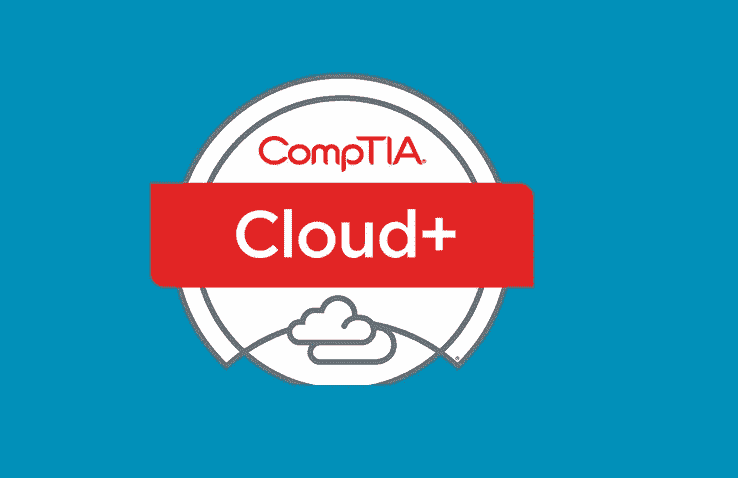
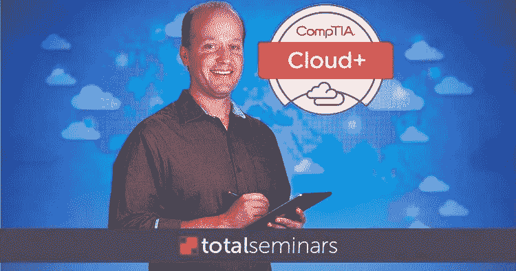
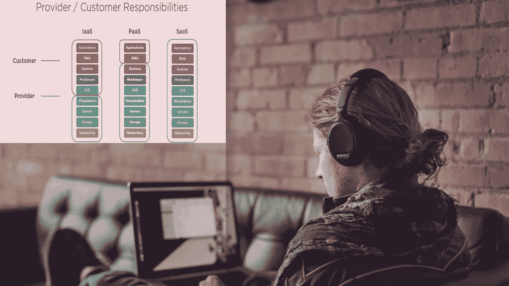
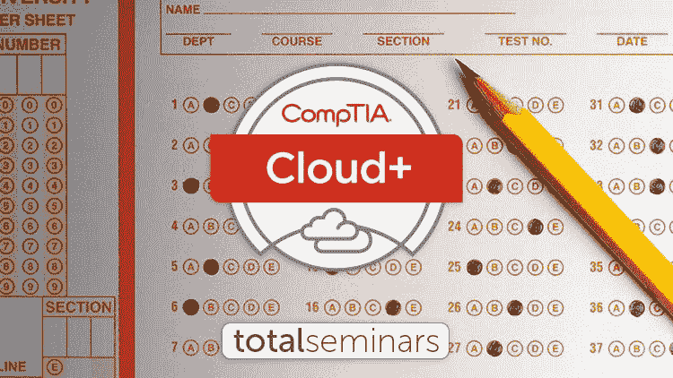

# 2022 年 7 门最佳 CompTIA Cloud+(CV0–002)认证考试课程和实践测试

> 原文：<https://medium.com/javarevisited/7-best-online-courses-and-mock-tests-for-comptia-cloud-cv0-002-certification-exam-b97f4679a8c5?source=collection_archive---------0----------------------->

## 我最喜欢的准备 2022 年考 CV0–002 考试代码的 CompTIA Cloud+认证的在线课程和练习测试，来自 Udemy 和 Pluralsight。

大家好，如果你正在准备 2022 年的**CompTIA Cloud+(CV0–002)认证考试，并寻找通过该考试的最佳在线课程和练习测试，那么你来对地方了。**

过去，我曾分享过通过各种 CompTIA 认证的最佳在线课程，如[**【CompTIA A+】**](/javarevisited/6-best-comptia-a-220-1001-and-220-1002-online-training-courses-practice-tests-and-dumps-cfc25759b808)、 [**IT 基础**](/javarevisited/6-best-courses-and-practice-tests-to-crack-comptia-fc0-u61-comptia-it-fundamentals-itf-67f81162be37) 、 [**Linux+**](/javarevisited/6-best-comptia-linux-plus-certification-exam-xk0-004-courses-and-practice-tests-in-2021-a244c98eda4d) 、 [**服务器+**](/javarevisited/7-best-comptia-server-certification-resources-courses-practice-tests-7e5e07dcda30) 和**[+](https://javarevisited.blogspot.com/2020/06/top-5-courses-to-crack-comptia-security-certification-exam-sy0-501.html)**考试，在本文中，我将分享最佳的 CompTIA 云+认证课程和实践测试，以破解

*这些课程是由专家创建的，受到了成千上万通过了这一热门考试的 fo 开发人员的信任，您也可以加入他们，为 CompTIA 认证做更好的准备。*

*随着科技世界向云计算加速发展，对认证云从业者、程序员和开发人员的需求也在增加，Comp TIA 认证可以帮助你成为 [**认证云专家**](https://javarevisited.blogspot.com/2020/09/top-10-aws-certifications-for-cloud-professionals.html) 。*

*CompTIA Cloud+是一项认证，旨在验证您在管理、配置和维护云服务方面的专业知识，以及从业务和技术角度来看[云计算](https://javarevisited.blogspot.com/2019/07/top-5-online-courses-to-learn-cloud-computing-aws.html)意味着什么。*

*尽管这不是必需的，但 CompTIA 建议您已经从事过任何与 it 相关的服务，因此您至少对云和信息技术有一些基本的了解。*

*CompTIA Cloud+ certification 持有人的平均年薪约为 7.3 万美元，但有时会根据你的经验而有所不同。*

*如果您计划在云行业工作或创建一些依赖云的服务，如 web 开发或构建软件即服务业务，您肯定应该查看这些课程，以获得更多关于这些 IT 行业的知识和理解。*

# *2022 年 CompTIA Cloud+(CV0–002)认证考试的 7 门最佳在线课程*

*这些是您可以参加的最好的在线培训课程，为 *CompTIA Cloud+代码为 CV0–002 的认证*做准备。它们完全是在线的，你可以从家里或办公室拿到，你可以按照自己的时间表学习。

这些 CompTIA Cloud+培训课程也非常实惠，在每月举行的快速销售期间，你可以在 [Udemy](https://click.linksynergy.com/deeplink?id=JVFxdTr9V80&mid=39197&murl=https%3A%2F%2Fwww.udemy.com%2F) 上只花 10 美元购买其中的大部分课程。*

## *1.[总计:云计算/ CompTIA 云+证书。(CV0–002)](https://click.linksynergy.com/deeplink?id=JVFxdTr9V80&mid=39197&murl=https%3A%2F%2Fwww.udemy.com%2Fcourse%2Ftotal-cloud-computing-comptia-cloud-cert-cv0-002%2F)*

*本课程向您展示了云计算的基础知识，以及如何处理它，如配置和管理，但它的目标是中级水平，因此它需要一些以前在某些行业的知识，如一般的 it，一些以前在服务器虚拟化、网络等方面的经验。*

*以下是您将在本课程中学到的主要内容:*

*   *云存储。*
*   *如何保护云服务？*
*   *关于 CompTIA Cloud+认证的一些测验。*

*本课程将向您介绍如何使用服务的实践课程，如 [Microsoft Azure](/javarevisited/5-best-azure-fundamentals-courses-to-pass-az-900-certification-exam-in-2020-9e602aea035d) 以便您可以在云上管理您的应用程序，以及如何部署它，云网络如何工作，云安全，访问协议，以及您将在本课程中获得经验的更多技术内容。*

***以下是加入本课程的链接** — [总计:云计算/ CompTIA Cloud+ Cert。(CV0–002)](https://click.linksynergy.com/deeplink?id=JVFxdTr9V80&mid=39197&murl=https%3A%2F%2Fwww.udemy.com%2Fcourse%2Ftotal-cloud-computing-comptia-cloud-cert-cv0-002%2F)*

**

## *2.[CompTIA Cloud+CV0–002 boot camp 获得认证！](https://click.linksynergy.com/deeplink?id=JVFxdTr9V80&mid=39197&murl=https%3A%2F%2Fwww.udemy.com%2Fcourse%2Fcomptia-cloud-cv0-002-bootcamp-get-certified%2F)*

*本课程的目标读者是中级水平的人员，他们在 it 行业有一定的专业知识，对 VMware 有深入的了解，在软件即服务(SaaS)等服务方面有丰富的经验。

你将在本课程中学习到:*

*   *一些云服务。*
*   *部署如何工作。*
*   *如何运行和保护云服务？*

*在整个课程中，您将体验一些云服务，如[亚马逊 AWS](https://javarevisited.blogspot.com/2020/05/top-5-amazon-web-services-aws-courses-for-beginners-and-experienced-programmers.html) 和[谷歌云](https://www.java67.com/2020/10/5-free-courses-to-pass-google-cloud-professional-cloud-devops-engineer-certificaiton.html)，您将看到部署如何工作，以及配置这些服务、故障排除、管理、维护，以及如何保护它们免受攻击者的攻击。*

***以下是参加本课程的链接**—[CompTIA Cloud+CV0–002 boot camp 获得认证！](https://click.linksynergy.com/deeplink?id=JVFxdTr9V80&mid=39197&murl=https%3A%2F%2Fwww.udemy.com%2Fcourse%2Fcomptia-cloud-cv0-002-bootcamp-get-certified%2F)*

**

## *3.[云的配置和部署](https://pluralsight.pxf.io/c/1193463/424552/7490?u=https%3A%2F%2Fwww.pluralsight.com%2Fcourses%2Fconfiguration-deployment-cloud-cv0-002)【plural sight】*

*这门关于 Pluralsight 的课程将教你关于如何配置和部署云所需了解的内容，它旨在帮助那些希望参加 **CompTIA Cloud+认证**课程的人深入了解关于云的更多技术内容。

在本课程中，您将学到:*

*   *配置和部署。*
*   *虚拟化和云架构。*
*   *服务基础设施迁移。*

*您将从基础开始，如解决方案评估、云组件，然后转向更高级的内容，如虚拟化、云存储、协议、网络、CPU 和内存。最后，您将看到服务基础设施迁移是如何工作的。*

*以下是参加本课程的链接— [云配置和部署](https://pluralsight.pxf.io/c/1193463/424552/7490?u=https%3A%2F%2Fwww.pluralsight.com%2Fcourses%2Fconfiguration-deployment-cloud-cv0-002)*

**

## *4.[云中的安全性](https://pluralsight.pxf.io/c/1193463/424552/7490?u=https%3A%2F%2Fwww.pluralsight.com%2Fcourses%2Fsecurity-cloud-plus-cv0-002)【plural sight CompTIA 云+课程】*

*如果您对安全领域有一些基本的了解，并且想要提高 CompTIA Cloud+认证的云安全技能，那么您就来对地方了。

您将从一些关于[安全性](/javarevisited/7-best-cyber-security-courses-for-programmers-and-developers-50afafae050b)和这方面所需工具的基础知识开始，接下来您将探索虚拟化云部署技术、安全配置、安全自动化工具和技术，以及更多关于云上安全性的内容。

在本课程中，您将学到:*

*   *虚拟化技术。*
*   *安全技术。*
*   *安全工具和配置。*

***这是参加本课程** — [云中的安全性](https://pluralsight.pxf.io/c/1193463/424552/7490?u=https%3A%2F%2Fwww.pluralsight.com%2Fcourses%2Fsecurity-cloud-plus-cv0-002)的链接*

**

*顺便说一句，你需要一个 [Pluralsight 会员](https://pluralsight.pxf.io/c/1193463/424552/7490?u=https%3A%2F%2Fwww.pluralsight.com%2Flearn)才能进入这个课程，费用大约是每月 29 美元或每年 299 美元(14%的折扣)。或者，您也可以通过注册他们的 [**10 天免费试用期**](https://pluralsight.pxf.io/c/1193463/424552/7490?u=https%3A%2F%2Fwww.pluralsight.com%2Flearn) 来免费查看该课程，该试用期允许 200 分钟访问他们所有的 7000 多门在线课程。*

*<https://pluralsight.pxf.io/c/1193463/424552/7490?u=https%3A%2F%2Fwww.pluralsight.com%2Flearn> * 

## *5. [CompTIA 云+高级](https://click.linksynergy.com/deeplink?id=JVFxdTr9V80&mid=39197&murl=https%3A%2F%2Fwww.udemy.com%2Fcourse%2Fcomptia-cloud-advanced-ci%2F)【UDEMY 课程】*

*我们列表中的最后一门课程是为那些对云服务有所了解，并希望提高自己的技能以达到安全、控制、恢复等主题的高级水平的人开设的。

你将在这门课中学到:*

*   *多方面的先进技术。*
*   *数据和网络安全。*
*   *恢复和测试工具。*

*您将学习一些关于云的测试技术，例如测试连接性以确保服务可用性、客户体验、[网络安全](https://javarevisited.blogspot.com/2020/03/top-5-courses-to-learn-cyber-security.html)、网络安全、数据安全、访问控制、灾难恢复等等。*

***这里是加入本课程的链接**——[CompTIA Cloud+Advanced](https://click.linksynergy.com/deeplink?id=JVFxdTr9V80&mid=39197&murl=https%3A%2F%2Fwww.udemy.com%2Fcourse%2Fcomptia-cloud-advanced-ci%2F)*

**

## *6. [CompTIA CLO-002: CompTIA 云基础知识+认证考试](https://www.certification-questions.com/practice-exam/comptia/clo-002?affiliateCode=fcff36fd-557a-4713-abf6-973e9924770f&utm_source=Javin&utm_medium=affiliate&utm_campaign=affiliate)*

*这是准备 CompTIA Cloud Plus 认证考试的另一个重要资源。这是一个 *CompTIA Cloud+考试转储*的集合，这些都是以前考试中的真题，由考生作为社区努力贡献出来。*

*您可以使用这些考试转储来了解考试格式，并查看真题的质量，以评估难度水平并找出要准备的重要主题。*

*以下是您将从 CompTIA Cloud+考试转储中获得的内容:*

*-问题数量:73*

*-考试测试:2*

*-最后更新:2022 年 4 月 20 日*

***这里是下载这个云+考试转储的链接**——[CompTIA CLO-002:CompTIA Cloud Essentials+认证考试](https://www.certification-questions.com/practice-exam/comptia/clo-002?affiliateCode=fcff36fd-557a-4713-abf6-973e9924770f&utm_source=Javin&utm_medium=affiliate&utm_campaign=affiliate)*

**

*他们还有一些 [**免费题**](https://www.certification-questions.com/comptia-dumps/clo-002.html?affiliateCode=fcff36fd-557a-4713-abf6-973e9924770f&utm_source=Javin&utm_medium=affiliate&utm_campaign=affiliate) 你可以在买考试模拟器之前先试一试，值得一试。*

## *7. [CompTIA Cloud+认证考试准备 CV002 模拟测试](https://click.linksynergy.com/deeplink?id=JVFxdTr9V80&mid=39197&murl=https%3A%2F%2Fwww.udemy.com%2Fcourse%2Ftotal-comptia-cloud-cv0-002-3-full-practice-tests%2F)*

*我经常说，模拟考试是任何 IT 或云认证的必要准备，CompTIA Cloud+认证也不例外，您需要用类似考试的问题和环境来练习，以准备真正的考试。而且，这是一个很好的练习测试，可以让你在真正考试前了解自己的情况。本课程包含 *3 个模拟测试，每个模拟测试有 90 个问题*。你可以在实际考试前用它们来测试你的准确性和速度。

以下是您将在本课程中获得的内容:*

*   *3 次全程模拟测试，共 270 道题*
*   *限时测试，实际时间限制为 90 分钟，及格分数为 85%*
*   *对答案的详细解释*
*   *相关的、写得很好的试题来模拟真实的考试*

*在实际的 **CompTIA Cloud+ CV002 考试**中，你需要在 90 分钟内解决 100 个问题，这确实是更少的时间，而且你还需要获得 750 分才能通过考试。*

*这意味着速度和准确性对于通过认证至关重要，这就是为什么你应该尽可能多地练习模拟测试和问题，以提高你的速度和准确性。*

***以下是加入本次考试的链接** — [CompTIA Cloud+认证考试备考 CV002 模拟考试](https://click.linksynergy.com/deeplink?id=JVFxdTr9V80&mid=39197&murl=https%3A%2F%2Fwww.udemy.com%2Fcourse%2Ftotal-comptia-cloud-cv0-002-3-full-practice-tests%2F)*

**

*以上是关于**最佳 CompTIA Cloud+认证课程和实践测试的全部内容。**您可以使用这些在线课程和练习测试来准备 CompTIA Cloud+(CV0–002)认证，并在第一次尝试时通过认证。*

*google cloud 和 amazon 等云系统已经成为许多服务的重要组成部分，如托管网站或创建软件即服务(Saas)，因此管理和配置这些类型的云服务需要一些专业人员来完成，于是出现了 *CompTIA Cloud+认证*。*

*您可能喜欢的其他 **IT 和云认证文章**:*

*   *[通过 CompTIA 网络+认证的前 5 门课程](https://javarevisited.blogspot.com/2020/07/top-5-courses-to-pass-comptia-network-plus-certification-exam.html)*
*   *[破解 AWS 解决方案架构师专业考试的前 5 门课程](https://javarevisited.blogspot.com/2020/04/top-5-course-to-crack-aws-solution-architect-professional-sap-c01-certification-exam.html)*
*   *[如何成为 Azure 认证管理员助理？](https://javarevisited.blogspot.com/2020/04/how-to-crack-microsoft-az-103-azure-administrator-associate-exam-certification.html)*
*   *[如何破解 Azure Fundamentals (AZ-900)认证](https://javarevisited.blogspot.com/2020/04/how-to-crack-microsoft-azure-fundamentals-certification-az-900-exam.html)*
*   *[准备 AWS 系统管理员认证的前 5 门课程](https://javarevisited.blogspot.com/2020/06/top-5-aws-certified-sysops-admin-associate-certification-exam.html)*
*   *[2022 年成为 Salesforce 认证开发者的前 5 名课程](https://javarevisited.blogspot.com/2020/06/top-5-salesforce-development-certification-training-courses.html)*
*   *[如何通过 AZ-300 Azure 解决方案架构师考试？](https://javarevisited.blogspot.com/2020/04/how-to-crack-microsoft-azure-solution-architect-exam-az-300.html)*
*   *[5 次免费的 AWS 解决方案架构师实践测试](https://javarevisited.blogspot.com/2019/08/top-5-free-aws-solution-architect-Associate-certification-dumps-practice-questions.html)*
*   *[学习 Docker 和 Kubernetes 的十大课程](https://dev.to/javinpaul/top-10-courses-to-learn-docker-and-kubernetes-for-programmers-4lg0)*
*   *[程序员前 5 名 AZ-900 模拟测试](https://javarevisited.blogspot.com/2020/02/top-5-AZ-900-exam-Azure-Fundamentals-certification-practice-tests-and-mock-exams-to.html)*
*   *[破解 Salesforce App Builder 认证的 5 门课程](https://javarevisited.blogspot.com/2020/06/top-5-courses-to-crack-salesforce-platform-app-builder-certification-exam.html)*
*   *[学习 Docker 和 Kubernetes 的十大课程](https://dev.to/javinpaul/top-10-courses-to-learn-docker-and-kubernetes-for-programmers-4lg0)*
*   *[破解 AWS DevOps 工程师考试的前 5 门课程](https://javarevisited.blogspot.com/2020/04/top-5-course-to-crack-aws-certified-devops-engineer-professional-exam-certification.html)*
*   *[如何破解甲骨文 2022 年 Java 认证？](https://medium.freecodecamp.org/how-to-pass-oracles-java-certifications-a-practical-guide-for-developers-e9b607ba6173)*
*   *[破解 Azure 云架构师(AZ-300)考试的前 5 门课程](https://javarevisited.blogspot.com/2019/07/top-5-courses-to-crack-azure-architecture-technologies-certification-az-300-exam.html#axzz6E6VuRMsx)*
*   *[通过 Salesforce 管理员认证的前 5 门课程](https://javarevisited.blogspot.com/2020/06/top-5-courses-to-crack-salesforce-administrator-certification.html)*
*   *[通过谷歌助理云工程师认证的前 5 门课程](https://javarevisited.blogspot.com/2019/07/top-5-google-cloud-platform-gcp-courses-certifications-online.html)*
*   *[破解 AWS 解决方案架构师认证的 5 大课程](https://javarevisited.blogspot.com/2019/05/top-5-courses-to-crack-aws-solutions-architect-associate-certification-exam-SAA-C01.html#axzz5rHwAwycj)*
*   *[如何通过 Spring Core Professional 5.0 认证](https://javarevisited.blogspot.com/2018/08/how-to-crack-spring-core-professional-certification-exam-java-latest.html)*
*   *[成为 GCP 云工程师助理的前 5 门课程](https://javarevisited.blogspot.com/2020/05/top-5-course-to-crack-google-cloud-associate-cloud-engineer-certification-exam.html) r*
*   *[通过谷歌助理云工程师认证的前 5 门课程](https://javarevisited.blogspot.com/2019/07/top-5-google-cloud-platform-gcp-courses-certifications-online.html)*
*   *[通过 AWS 云从业者认证的前 5 门课程](https://javarevisited.blogspot.com/2020/02/top-5-courses-to-crack-aws-certified-cloud-practitioner-exam-certification-clf-c01.html)*

*感谢您阅读本文。如果您喜欢这个 *CompTIA Cloud+ (CVO-002)在线培训课程*，无论是免费的还是付费的，请与您的朋友和同事分享。这确实有所不同，然后你提前分享。我真的很感激。

**附言——**如果你是云计算领域的新手，需要一个免费的在线培训课程，那么你也可以在 Udemy 上查看 [**云计算简介**](https://click.linksynergy.com/deeplink?id=JVFxdTr9V80&mid=39197&murl=https%3A%2F%2Fwww.udemy.com%2Fcourse%2Fintroduction-to-cloud-computing%2F) 。它是免费的，已经有超过 19 万人学习了这门课程。它并没有涵盖所有的主题，但却是一个开始准备的好课程。*

*<https://click.linksynergy.com/deeplink?id=JVFxdTr9V80&mid=39197&murl=https%3A%2F%2Fwww.udemy.com%2Fcourse%2Fintroduction-to-cloud-computing%2F> *