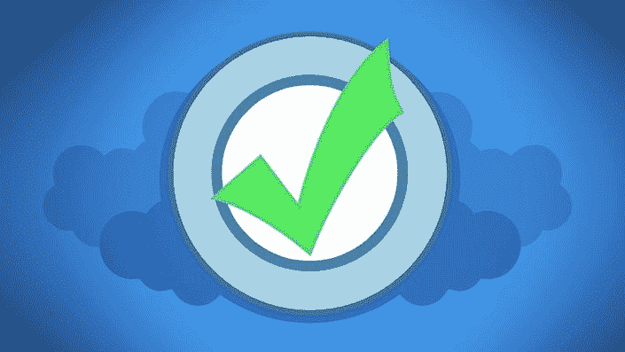
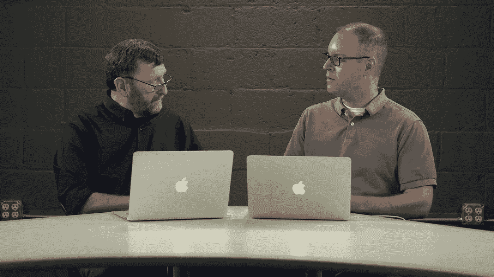
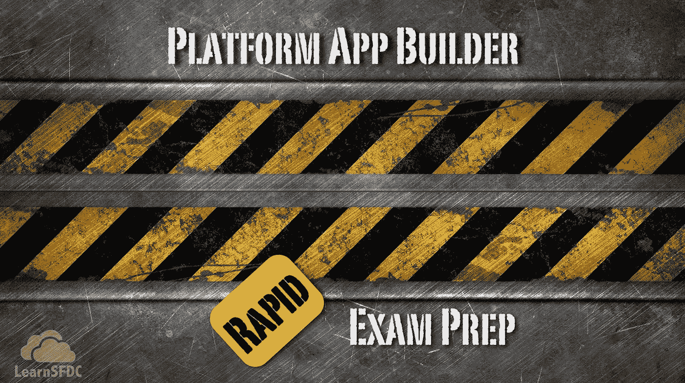
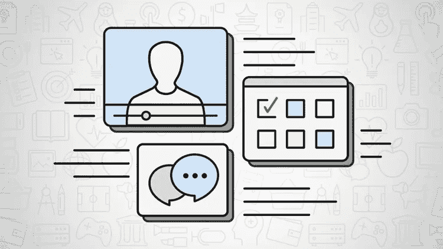

# 2023 年 Salesforce Platform App Builder 认证的 7 门最佳在线课程

> 原文：<https://medium.com/javarevisited/7-best-online-courses-for-salesforce-platform-app-builder-certification-in-2021-8e15a08693cf?source=collection_archive---------1----------------------->

## 为 2023 年 Salesforce Platform App Builder 认证做准备的最佳资源集合

image_credit — udemy

大家好，如果你正在准备**sales force Platform App Builder 认证**并寻找通过这一著名云考试的最佳在线课程，那么你来对地方了。

过去，我分享了准备 [Salesforce 开发人员](/javarevisited/7-best-courses-to-learn-salesforce-development-in-2021-1f861a0c2fff)和[管理员](https://javarevisited.blogspot.com/2020/06/top-5-courses-to-crack-salesforce-administrator-certification.html)认证的最佳课程，今天我将分享准备 Salesforce 平台应用构建认证的最佳在线课程。

这些在线课程已帮助成千上万的人成为 Salesforce 认证人员，您也可以通过认真学习这些在线课程、练习和解决练习题成为其中一员。

当听到 salesforce 这个词时，大多数人都会想到那个著名的 CRM，它管理和组织您的公司，并为您获取更多线索，等等，但事实是, [Salesforce](https://javarevisited.blogspot.com/2020/06/top-5-courses-to-crack-salesforce-administrator-certification.html) 不仅仅是一个 CRM，它还是一个巨大的平台，允许您构建自己的定制应用程序，设计仪表板，并部署您的应用程序。

为此，salesforce 推出了一项名为**sales force platformer app builder 认证**的认证，这也是我们将在本文中讨论的内容。

sales force platform app builder 是 salesforce admin 认证的更高级和扩展版本，用户将专注于设计数据模型，如设计用户界面和业务逻辑、设计应用报告并将其部署在服务器上，等等。这项技能的年薪在 97000 美元左右，是公司中最受欢迎的工作之一。在本文中，您将看到一些**最佳 salesforce app builder 课程**，这些课程将帮助您掌握基础知识和高级原则，从而通过考试并获得认证资格。

# 准备 2023 年 Salesforce Platform App Builder 考试的 7 门最佳在线课程

为了不浪费您的时间，这里列出了为*sales force Platform App Builder 认证考试*准备的最佳在线课程。这些课程是由专家推荐的，你可以在流行的在线网站如 Udemy、Coursera 和 Pluralsight 上获得。

## 1.[sales force Platform App Builder 认证课程](https://click.linksynergy.com/deeplink?id=JVFxdTr9V80&mid=39197&murl=https%3A%2F%2Fwww.udemy.com%2Fcourse%2Fsalesforce-platform-app-builder%2F)

这一长达九个小时的在线内容课程将涵盖您通过 Salesforce platform app builder 考试并获得认证所需的所有原则，它是为完全初学者设计的，不需要 Salesforce 平台或一般编码方面的知识。

本课程将涵盖 app builder 认证的所有方面，如安全报告、在平台内创建不同的应用、创建权限、移动应用、自动化等等，都将在该课程中涉及。

你将在本课程中学到:

*   salesforce 平台基础知识。
*   数据建模和管理。
*   设计用户界面。

**以下是参加本课程**—[sales force Platform App Builder 认证课程](https://click.linksynergy.com/deeplink?id=JVFxdTr9V80&mid=39197&murl=https%3A%2F%2Fwww.udemy.com%2Fcourse%2Fsalesforce-platform-app-builder%2F)的链接

为了更好地准备，您还可以将本课程与 Mike Wheeler 的[**sales force Platform App Builder 认证实践测试**结合起来。这包含两张 90 分钟的限时练习纸，每张 60 个问题。你可以在考试前使用它们来评估你的速度和准确性，并努力取得更好的成绩。](https://click.linksynergy.com/deeplink?id=JVFxdTr9V80&mid=39197&murl=https%3A%2F%2Fwww.udemy.com%2Fcourse%2Fsalesforce-platform-app-builder-certification-practice-tests%2F)

<https://click.linksynergy.com/deeplink?id=JVFxdTr9V80&mid=39197&murl=https%3A%2F%2Fwww.udemy.com%2Fcourse%2Fsalesforce-platform-app-builder-certification-practice-tests%2F>  

## 2. [Salesforce 管理员和平台应用构建者](https://click.linksynergy.com/deeplink?id=JVFxdTr9V80&mid=39197&murl=https%3A%2F%2Fwww.udemy.com%2Fcourse%2Fsalesforce-admin-platform-app-builder-for-beginners%2F)

这是为 Salesforce Platform App Builder 认证做准备的另一个很好的 Udemy 课程。本课程是一门完整的课程，不仅面向想要参加 salesforce 平台应用程序构建器认证的人员，还将涵盖您在进入 salesforce 管理认证中涵盖的 salesforce 应用程序构建器之前需要了解的基础知识。

本课程涵盖 salesforce CRM 平台的基础知识、云计算、数据建模、安全性、用户界面定制、数据管理、销售云，以及您将在一门免费课程中学到的更多主题。

你将在本课程中学习到:

*   了解 salesforce CRM 平台的基础知识。
*   创建应用程序、对象和字段。
*   在应用程序中创建报告。

此 *Salesforce 管理和平台应用构建器课程*有超过 42 小时的内容，足以准备 Salesforce 应用构建器和 Salesforce 管理员认证考试。

**这是参加本课程的链接** — [Salesforce 管理员和平台应用程序构建者](https://click.linksynergy.com/deeplink?id=JVFxdTr9V80&mid=39197&murl=https%3A%2F%2Fwww.udemy.com%2Fcourse%2Fsalesforce-admin-platform-app-builder-for-beginners%2F)

## 3.[开发 Salesforce Lightning 组件](https://pluralsight.pxf.io/c/1193463/424552/7490?u=https%3A%2F%2Fwww.pluralsight.com%2Fcourses%2Fplay-by-play-salesforce-reusable-lightning-components-builder)

这是了解 Salesforce 平台和准备 App builder 认证的最佳 Pluralsight 培训课程之一。如果您对 salesforce 平台有一些基本的了解，并且您希望通过构建一个具有更多高级功能的高度可重用的 salesforce 应用程序来增强您的技能，那么本课程非常适合您。

在本课程中，您将学到:

*   开发销售队伍闪电组件。
*   构建响应式设计。
*   了解如何在应用中实现一些代码。

您将通过练习和实现一些代码来发现如何解决现实世界中的问题，他将教您如何构建一些适用于桌面和移动设备的 lightning 组件等等。

**以下是参加本课程的链接** — [开发 Salesforce Lightning 组件](https://pluralsight.pxf.io/c/1193463/424552/7490?u=https%3A%2F%2Fwww.pluralsight.com%2Fcourses%2Fplay-by-play-salesforce-reusable-lightning-components-builder)

## 4.[构建 Salesforce 应用程序— Pluralsight](https://pluralsight.pxf.io/c/1193463/424552/7490?u=https%3A%2F%2Fwww.pluralsight.com%2Fcourses%2Fplay-by-play-building-salesforce-apps-base-lightning-components)

这是准备 Salesforce App Builder 认证的最佳 Pluralsight 课程。本 salesforce app builder 课程将帮助您全面了解基本照明集合，如按钮、格式日期和时间、格式数字、卡片以及构成 salesforce 应用程序的许多其他组件。

您将在本课程中学到:

*   基础闪电组件。
*   构建 salesforce 应用程序。
*   闪电元件的先进技术。

因此，本课程更侧重于照明组件，但也将讨论其他主题，如照明布局组件和高级嵌套布局、数据表组件以及更高级的技术。

**这是参加本课程的链接** — [构建 Salesforce 应用程序— Pluralsight](https://pluralsight.pxf.io/c/1193463/424552/7490?u=https%3A%2F%2Fwww.pluralsight.com%2Fcourses%2Fplay-by-play-building-salesforce-apps-base-lightning-components)

顺便说一句，你需要一个 Pluralsight 会员才能参加这个课程，费用大约是每月 29 美元或每年 299 美元(14%的折扣)。或者，你也可以参加他们的 [**10 天免费试用**](https://pluralsight.pxf.io/c/1193463/424552/7490?u=https%3A%2F%2Fwww.pluralsight.com%2Flearn) 来免费参加这个课程。

<https://pluralsight.pxf.io/c/1193463/424552/7490?u=https%3A%2F%2Fwww.pluralsight.com%2Flearn>  

## 5.[平台 App Builder:快速备考](https://click.linksynergy.com/deeplink?id=JVFxdTr9V80&mid=39197&murl=https%3A%2F%2Fwww.udemy.com%2Fcourse%2Fsalesforce-platform-app-builder-rapid-exam-prep%2F)

关于 salesforce app builder 的课程是帮助您准备考试的最佳在线课程之一，将通过向您展示一些您可能在 salesforce app builder 官方考试中发现的问题来测试您在该技术方面的知识。

在本课程中，您将学到:

*   测试你对这项技术的了解。
*   通过视频解释正确和错误的答案。
*   关于 app builder 技术的一些基础理论。

本课程的目的不是教你这项技术，所以你需要对什么是 [salesforce app builder](https://javarevisited.blogspot.com/2020/06/top-5-courses-to-crack-salesforce-platform-app-builder-certification-exam.html) 有一些了解，然后你可以转到本课程，看看你在进入正式考试之前是否有扎实的理解。

**这里是加入本课程的链接**——[平台 App Builder:快速备考](https://click.linksynergy.com/deeplink?id=JVFxdTr9V80&mid=39197&murl=https%3A%2F%2Fwww.udemy.com%2Fcourse%2Fsalesforce-platform-app-builder-rapid-exam-prep%2F)

## 6.[sales force Platform App Builder 认证课程 2023](https://click.linksynergy.com/deeplink?id=JVFxdTr9V80&mid=39197&murl=https%3A%2F%2Fwww.udemy.com%2Fcourse%2Fsalesforce-platform-app-builder-certification-course-2020%2F)

这是 Udemy 上评分最高的课程之一，为 2023 年的 Salesforce Platform App Builder 认证考试做准备。这门课程也非常注重实践，你不仅可以通过观察，还可以通过实践来学习。

本课程是根据官方考试指南组织的，将深入涵盖考试所需的所有方面，包括概念解释、示例和系统实施演示。本课程还包括一次真实考试的模拟测试。

以下是您将在本课程中学到的内容:

*   销售流程和 [Salesforce 基础知识](/javarevisited/7-best-courses-to-learn-salesforce-development-in-2021-1f861a0c2fff)
*   如何使用标准 Salesforce 对象
*   如何以及何时创建自定义 Salesforce 对象
*   如何配置 Salesforce 以满足客户需求
*   何时使用自定义代码
*   Salesforce 安全性如何工作
*   报告在 Salesforce 中的工作方式
*   Salesforce 应用程序开发生命周期
*   Salesforce 在哪些方面

您将在一个真实的项目场景中工作，并为一家名为“Amazing Auto”的虚构公司开发一个自定义应用程序，我将向您展示如何根据业务需求自定义 Salesforce。

**以下是参加本 Salesforce 课程**—[sales force Platform App Builder 认证课程 2023](https://click.linksynergy.com/deeplink?id=JVFxdTr9V80&mid=39197&murl=https%3A%2F%2Fwww.udemy.com%2Fcourse%2Fsalesforce-platform-app-builder-certification-course-2020%2F) 的链接

## 7.[sales force Platform App Builder 认证实践测试](https://click.linksynergy.com/deeplink?id=JVFxdTr9V80&mid=39197&murl=https%3A%2F%2Fwww.udemy.com%2Fcourse%2Fsalesforce-appbuilder-dumps-practicetests%2F)

模拟测试在第一次尝试通过认证的过程中起着重要的作用，我强烈建议您尽可能多地解决模拟问题。

虽然前面提到的一些课程确实包含模拟测试，但你需要更多的模拟测试才能在这次考试中获得高分(及格分数:63%)。这是在 [Udemy](/javarevisited/my-favorite-udemy-online-courses-for-programmers-and-software-engineers-f9d941dd0035) 上的一个模拟测试课程，共有 360 个问题，用于 Salesforce platform app builder 考试

您可以使用模拟测试来了解自己在考试前的情况，或者了解考试中通常会问到的问题类型。

**点击此处的链接，了解有关本次模拟考试**——[sales force Platform App Builder 认证模拟考试](https://click.linksynergy.com/deeplink?id=JVFxdTr9V80&mid=39197&murl=https%3A%2F%2Fwww.udemy.com%2Fcourse%2Fsalesforce-appbuilder-dumps-practicetests%2F)的更多信息

以上是关于 2023 年通过 Salesforce Platform App Builder 认证的**最佳在线课程。**阅读本文后，您现在已经有了许多 salesforce app builder 培训课程，这些课程可以教您通过考试、获得认证和找到职业所需的一切知识。

其他 **IT 认证文章您可能喜欢探讨**

*   [初学者学习 Salesforce 的 5 门免费课程](https://www.java67.com/2020/07/top-5-free-courses-to-learn-salesforce.html)
*   [破解 Azure 云架构师(AZ-300)考试的前 5 门课程](https://javarevisited.blogspot.com/2019/07/top-5-courses-to-crack-azure-architecture-technologies-certification-az-300-exam.html#axzz6E6VuRMsx)
*   [破解 AWS DevOps 工程师考试的前 5 门课程](https://javarevisited.blogspot.com/2020/04/top-5-course-to-crack-aws-certified-devops-engineer-professional-exam-certification.html)
*   [破解 AWS 解决方案架构师专业考试的前 5 门课程](https://javarevisited.blogspot.com/2020/04/top-5-course-to-crack-aws-solution-architect-professional-sap-c01-certification-exam.html)
*   [程序员前 5 名 AZ-900 模拟测试](https://javarevisited.blogspot.com/2020/02/top-5-AZ-900-exam-Azure-Fundamentals-certification-practice-tests-and-mock-exams-to.html)
*   [如何成为 Azure 认证管理员助理？](https://javarevisited.blogspot.com/2020/04/how-to-crack-microsoft-az-103-azure-administrator-associate-exam-certification.html)
*   [如何破解 Azure Fundamentals (AZ-900)认证](https://javarevisited.blogspot.com/2020/04/how-to-crack-microsoft-azure-fundamentals-certification-az-900-exam.html)
*   [通过谷歌助理云工程师认证的前 5 门课程](https://javarevisited.blogspot.com/2019/07/top-5-google-cloud-platform-gcp-courses-certifications-online.html)
*   [如何通过 AZ-300 Azure 解决方案架构师考试？](https://javarevisited.blogspot.com/2020/04/how-to-crack-microsoft-azure-solution-architect-exam-az-300.html)
*   [5 次免费的 AWS 解决方案架构师实践测试](https://javarevisited.blogspot.com/2019/08/top-5-free-aws-solution-architect-Associate-certification-dumps-practice-questions.html)
*   [破解 AWS 解决方案架构师认证的 5 大课程](https://javarevisited.blogspot.com/2019/05/top-5-courses-to-crack-aws-solutions-architect-associate-certification-exam-SAA-C01.html#axzz5rHwAwycj)
*   [准备 AWS 系统运营管理员认证的前 5 门课程](https://javarevisited.blogspot.com/2020/06/top-5-aws-certified-sysops-admin-associate-certification-exam.html)
*   [成为 GCP 云工程师助理的前 5 名课程](https://javarevisited.blogspot.com/2020/05/top-5-course-to-crack-google-cloud-associate-cloud-engineer-certification-exam.html) r
*   [通过谷歌助理云工程师认证的前 5 门课程](https://javarevisited.blogspot.com/2019/07/top-5-google-cloud-platform-gcp-courses-certifications-online.html)
*   [通过 AWS 云从业者认证的前 5 门课程](https://javarevisited.blogspot.com/2020/02/top-5-courses-to-crack-aws-certified-cloud-practitioner-exam-certification-clf-c01.html)

感谢您阅读本文。如果您喜欢这个*免费和付费的最佳 Salesforce 管理员在线培训课程*，请与您的朋友和同事分享。这确实有所不同，然后你提前分享。我真的很感激。

**P. S.** —如果您是 Salesforce 的新手，并且正在寻找一个免费的入门课程*来首先学习 Salesforce，那么我建议您加入这个免费的 Udemy 课程— [**以简单的步骤学习 SalesForce，并获得由 Parikshith Red 和 Samata Chag 颁发的认证**](https://click.linksynergy.com/deeplink?id=JVFxdTr9V80&mid=39197&murl=https%3A%2F%2Fwww.udemy.com%2Fcourse%2Flearn-salesforce-in-easy-steps-and-get-certified%2F) 。*

<https://click.linksynergy.com/deeplink?id=JVFxdTr9V80&mid=39197&murl=https%3A%2F%2Fwww.udemy.com%2Fcourse%2Flearn-salesforce-in-easy-steps-and-get-certified%2F> 