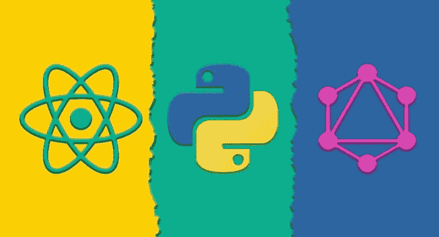
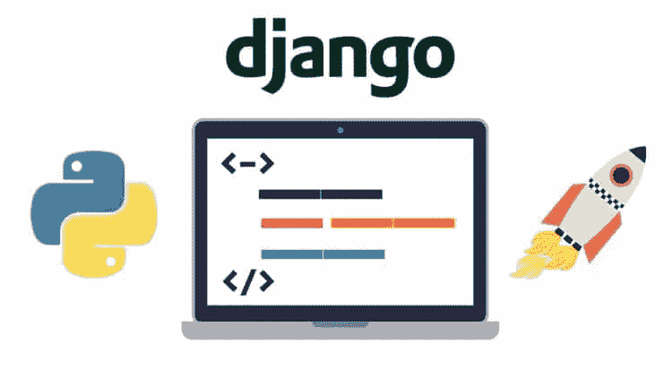
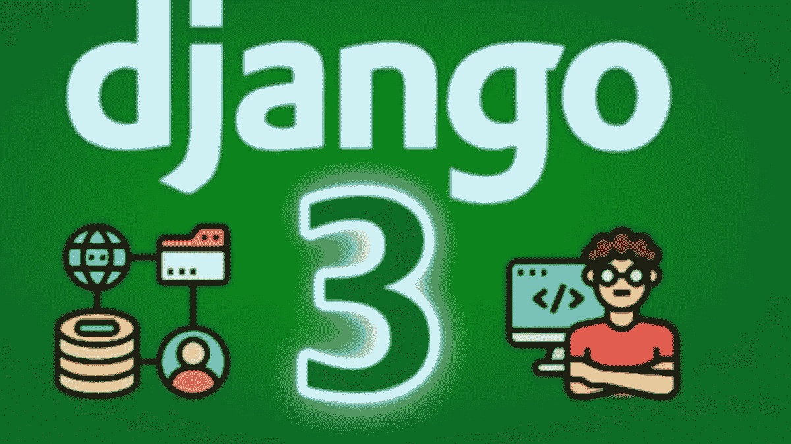
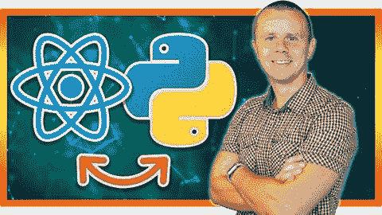

# 2023 年成为 FullStack Python 开发者的 7 门最佳在线课程

> 原文：<https://medium.com/javarevisited/7-best-online-courses-to-become-fullstack-python-developer-ea2cc52cfc86?source=collection_archive---------0----------------------->

## 我最喜欢的在线课程学习 Python，Django，Flask，React，GraphSQL， **SQLAlchemy，Jinja 2，以及其他 2023 年成为全栈 Python 开发者的必备工具**

image_credit —全栈 React、Python 和 GraphQL Udemy

大家好，如果你是一名 Python 程序员，并希望在 2023 年成为一名全栈 Python 开发者，并且正在寻找书籍、教程和在线课程等最佳资源，那么你来对地方了。

早些时候，我已经分享了 [**最好的 python 课程**](/better-programming/top-5-courses-to-learn-python-in-2018-best-of-lot-26644a99e7ec) ，在这篇文章中，我将分享你在 2023 年成为**全栈 Python 开发者可以加入的最好的在线课程。**

对全栈开发人员的需求很大，但具有 Python 编程技能的人并不多，这意味着全栈 Python 开发人员有巨大的机会。

但是，让我告诉你，成为一个全栈开发人员是具有挑战性的，需要不断的学习。你不仅需要了解 [Python](/javarevisited/10-free-python-tutorials-and-courses-from-google-microsoft-and-coursera-for-beginners-96b9ad20b4e6) 和后端框架如 [Flask](/javarevisited/5-best-python-flask-courses-for-beginners-2f262f8e23da) 和 [Django](/javarevisited/my-favorite-courses-to-learn-django-for-beginners-2020-ac172e2ab920) 还要了解前端框架如 [React](/javarevisited/top-10-free-courses-to-learn-react-js-c14edbd3b35f) 和 [Angular](/javarevisited/10-courses-to-learn-angular-for-web-development-6da1bd2856dc) 以及部署工具如 [Docker](/javarevisited/top-15-online-courses-to-learn-docker-kubernetes-and-aws-for-fullstack-developers-and-devops-d8cc4f16e773?source=collection_home---4------1-----------------------) 和 [Kubernetes](/javarevisited/7-free-online-courses-to-learn-kubernetes-in-2020-3b8a68ec7abc) 和 [DevOps](/javarevisited/13-best-courses-to-learn-devops-for-senior-developers-in-2020-a2997ff7c33c) 来进行前端引导。

全栈 web 开发是一个扩展术语，涵盖软件开发的不同阶段，如编码、项目管理、前端和后端技术、数据库管理系统等等。

前端技术是访问者将与之交互的外部覆盖，例如网站上的按钮，或者换句话说，当你看到网站页面时将面对你的用户界面。

另一方面，后端技术是当你与网站互动时网站内部发生的事情，比如当你注册时，网站会在服务器中注册你的信息，或者当你使用搜索栏时，它会执行一些查询来返回你正在寻找的确切项目。

在过去，我已经分享了学习 [Python 3](/better-programming/top-5-courses-to-learn-python-in-2018-best-of-lot-26644a99e7ec) 、 [Django](https://www.java67.com/2020/06/top-5-courses-to-learn-django-and-python-for-web-development.html) 、 [Flask](https://javarevisited.blogspot.com/2020/01/top-5-courses-to-learn-flask-for-web-development-with-python.html) 和[数据科学](https://javarevisited.blogspot.com/2018/03/top-5-data-science-and-machine-learning-online-courses-to-learn-online.html)的最佳课程，在这篇博客文章中，你将看到一些用于全栈 web 开发的**最佳课程**，它们用于创建网站的后端和前端，因此它将从头开始成为一个完整的网站。

顺便说一句，如果你是 Python 的新手，那么我也建议你首先通过一个全面的 Python 课程来学习基础知识。如果你需要推荐，我建议你参加 ZTM 学院的 Andrei Negaoie 的 [**完全 Python 开发者 2023:零到精通课程**](https://academy.zerotomastery.io/p/complete-python-developer-zero-to-mastery?affcode=441520_zytgk2dn) ，它不仅涵盖 Python 基础知识，还教你用 Python 进行 web 开发。

 [## 学习 Python。获得聘用| 2023 年完成 Python 开发:零到精通

### 成为一名专业的 Python 开发人员并被录用,“学习面向对象编程”“构建 12 个以上的真实世界……

academy.zerotomastery.io](https://academy.zerotomastery.io/p/complete-python-developer-zero-to-mastery?affcode=441520_zytgk2dn) 

顺便说一句，你需要一个 [ZTM 会员](https://academy.zerotomastery.io/a/aff_c0gnlvf7/external?affcode=441520_zytgk2dn)才能观看这个课程，这个课程每月花费大约 39 美元，但也提供了许多像这样超级吸引人和有用的课程。您还可以使用我的代码朋友 10 获得您选择的任何订阅的 10%的折扣。

# 2023 年 Python 程序员的 7 门最佳全栈开发课程

在不浪费你更多时间的情况下，这里列出了你可以在 2023 年成为全栈 Python 开发者的最佳在线课程。

这些在线培训课程涵盖了流行的 Python web 开发框架，如 Django、Flask 和 Web2Py，还包含基于项目的课程，您将通过使用 Python 实际构建项目和网站来学习。

## 1. [Python 和 Django 全栈 Web 开发者训练营](https://click.linksynergy.com/deeplink?id=JVFxdTr9V80&mid=39197&murl=https%3A%2F%2Fwww.udemy.com%2Fcourse%2Fpython-and-django-full-stack-web-developer-bootcamp%2F)

这是 2023 年学习全栈 Python 开发，成为每个公司都想要的全栈 Python 开发者最好的在线课程之一。

创建者不是别人正是[何塞·波尔蒂利亚](https://click.linksynergy.com/deeplink?id=JVFxdTr9V80&mid=39197&murl=https%3A%2F%2Fwww.udemy.com%2Fuser%2Fjoseportilla%2F)，他是 Udemy[最受欢迎的 Python 课程](https://click.linksynergy.com/deeplink?id=JVFxdTr9V80&mid=39197&murl=https%3A%2F%2Fwww.udemy.com%2Fcourse%2Fcomplete-python-bootcamp%2F)的作者，也是我最喜欢的导师之一。这个课程是为没有 Python 背景经验的初学者设计的，以便使用 Django 进行后端开发，或者使用前端编程语言，如 HTML、JQuery、CSS、Bootstrap、JavaScript 等等。在 udemy 课程中你会看到:

*   前端技术如 [HTML](/javarevisited/10-best-html-and-css-courses-for-beginners-in-2021-6757eec00032) ，JQuery， [CSS](/javarevisited/10-best-css-online-courses-for-beginners-and-experienced-developers-54aa2e8c0253) ， [Bootstrap](/javarevisited/6-best-bootstrap-online-courses-for-web-designers-and-developers-a688e192b2e2) ， [JavaScript](/javarevisited/12-free-courses-to-learn-javascript-and-es6-for-beginners-and-experienced-developers-aa35874c9a32) 。
*   Django 等后端技术。
*   从头开始建立一个完整的网站。

该课程在 Udemy 上提供，有超过 32 小时的视频内容，将带您完成许多实际练习，如创建管理仪表板，以及如何将[前端](https://www.java67.com/2020/10/best-frontend-skills-web-developer.html)与[后端](https://javarevisited.blogspot.com/2019/01/top-5-online-courses-to-become-web-developer.html)集成，使其成为一个完全复杂的网站。

**这里是加入这个全栈课程的链接**——[Python 和 Django 全栈 Web 开发者训练营](https://click.linksynergy.com/deeplink?id=JVFxdTr9V80&mid=39197&murl=https%3A%2F%2Fwww.udemy.com%2Fcourse%2Fpython-and-django-full-stack-web-developer-bootcamp%2F)

## 2.[使用 Python 进行全栈 web 开发和人工智能(Django)](https://click.linksynergy.com/deeplink?id=JVFxdTr9V80&mid=39197&murl=https%3A%2F%2Fwww.udemy.com%2Fcourse%2Funaicorn%2F)

如果你没有 python 或前端语言的实践经验，并且你想快速了解它们并跳到全栈 web 开发，那么这是适合你的课程。在 Udemy 课程中你会看到:

*   使用 Django 框架来构建网站的后端。
*   如何使用 AWS 主机并将其与您的网站整合。
*   在你的网站内部学习和使用[数据科学](/javarevisited/my-favorite-data-science-and-machine-learning-courses-from-coursera-udemy-and-pluralsight-eafc73acc73f)，人工智能，深度学习算法。

本课程首先向您介绍 python 入门，然后跳转到如何使用 Django 框架和前端技术。它将向您展示如何在您的网站内集成人工智能算法和[数据科学库](https://becominghuman.ai/10-free-courses-to-learn-python-machine-learning-libraries-scikit-learn-numpy-pandas-keras-3c77ba1a6907?source=---------13------------------)来在您的网站内进行分析，这是非常难得的技能。

**这里是加入本课程的链接** — [全栈 web 开发和人工智能与 Python](https://click.linksynergy.com/deeplink?id=JVFxdTr9V80&mid=39197&murl=https%3A%2F%2Fwww.udemy.com%2Fcourse%2Funaicorn%2F)

## 3.[使用 Python 的全栈 Web 开发(WEB2PY)](https://pluralsight.pxf.io/c/1193463/424552/7490?u=https%3A%2F%2Fwww.pluralsight.com%2Fcourses%2Ffull-stack-web-development-python-web2py)

Python 有许多框架可用于全栈 web 开发，其中最容易使用的框架之一是 WEB2PY。因此，如果你想学习这个框架，可以考虑参加 Pluralsight 上的 Python 全栈 Web 开发(WEB2PY)课程。

你会在《复数视线》课程中看到:

*   构建好的设计网页。
*   设计应用程序和数据库。
*   关系数据库概念。

该课程向您展示了如何使用这些框架创建一个功能齐全的网站，因为它拥有您学习全栈 web 开发所需的一切，因为它包括 web 服务器、管理、引导和 SQLite 数据库。所以你不用分开研究前端和后端来构建一个复杂的网站。

**这里是加入本课程的链接**——[用 Python 进行全栈 Web 开发](https://pluralsight.pxf.io/c/1193463/424552/7490?u=https%3A%2F%2Fwww.pluralsight.com%2Fcourses%2Ffull-stack-web-development-python-web2py)

顺便说一句，你需要一个 [**Pluralsight 会员**](https://pluralsight.pxf.io/c/1193463/424552/7490?u=https%3A%2F%2Fwww.pluralsight.com%2Flearn) 才能进入这门课程，费用大约是每月 29 美元或每年 299 美元(14%的折扣)。这是一项很好的投资，因为你将获得 7000 多门关于最新技术的在线课程，但如果你愿意，你也可以参加他们的 [10 天免费试用](https://pluralsight.pxf.io/c/1193463/424552/7490?u=https%3A%2F%2Fwww.pluralsight.com%2Flearn)来免费学习这门课程。

 [## 对个人来说

### 无论你想进入一个新的领域，改善你的角色，还是把你的伟大想法变成现实，Pluralsight…

pluralsight.pxf.io](https://pluralsight.pxf.io/c/1193463/424552/7490?u=https%3A%2F%2Fwww.pluralsight.com%2Flearn) 

## 4.[使用谷歌云平台的 Python 全栈 Web 开发](https://click.linksynergy.com/deeplink?id=JVFxdTr9V80&mid=39197&murl=https%3A%2F%2Fwww.udemy.com%2Fcourse%2Fdevelop-a-social-web-party-application-with-python%2F)

如果你想使用 flask 框架学习 python 全栈 web 开发，那么你来对地方了。本课程是为中级水平设计的，因此您需要学习一些 python 入门课程，以便与讲师一起完成这些课程。在 udemy 课程中你会看到:

*   使用 [Flask](https://flask.palletsprojects.com/en/1.1.x/) 框架构建了一个真实的聚会 web 应用程序。
*   使用谷歌云存储，API。
*   使用 Mongo DB 存储数据。

在这个大师班中，你将开发一个社交网络应用，如脸书和 Twitter，你将看到如何在 MongoDB 中收集数据，如何使用谷歌位置 API，然后如何使用[谷歌云服务](https://javarevisited.blogspot.com/2020/05/top-5-course-to-crack-google-cloud-associate-cloud-engineer-certification-exam.html)。

这里是参加本课程的链接。[用谷歌云平台进行 Python 全栈 Web 开发](https://click.linksynergy.com/deeplink?id=JVFxdTr9V80&mid=39197&murl=https%3A%2F%2Fwww.udemy.com%2Fcourse%2Fdevelop-a-social-web-party-application-with-python%2F)

## 5.【with Python Web 开发的全栈网站

如果你想学习如何用 Django 创建后端，只用一种编程语言创建前端，那么 Django 3——用 Python 创建全栈网站是你应该学习的课程。在这门课程中，你将学到以下内容

*   如何使用 Django 3 框架创建后端？
*   如何使用 Python Anywhere 在线发布您的网站
*   如何使用 Python 创建 3 个令人惊叹的网站？

该课程向您展示了如何将 Python 与前端技术结合到一个完整的网站中，使用 [HTML 5](https://javarevisited.blogspot.com/2019/05/top-5-html-5-and-css-3-courses-for-web-developers.html) 、 [CSS 3](/javarevisited/top-10-free-courses-to-learn-html-5-css-3-and-web-development-872d62d97a97) 和 [Bootstrap 4](/javarevisited/7-free-courses-to-learn-bootstrap-for-web-designers-and-developers-5135215648f1) 作为前端来创建丰富的交互式用户体验。

最后，您将创建一个全功能的待办事项列表管理器网站，用户可以在其中创建帐户，其前端使用标准 web 技术和后端 Python 代码进行编码。

**这里是加入本课程的链接**—[Django 3—Python Web 开发的全栈网站](https://click.linksynergy.com/deeplink?id=JVFxdTr9V80&mid=39197&murl=https%3A%2F%2Fwww.udemy.com%2Fcourse%2Fdjango-3-make-websites-with-python-tutorial-beginner-learn-bootstrap%2F)

## 6.[全栈 React、Python 和 GraphQL](https://click.linksynergy.com/deeplink?id=JVFxdTr9V80&mid=39197&murl=https%3A%2F%2Fwww.udemy.com%2Fcourse%2Ffull-stack-react-python-and-graphql%2F)

这是另一个 Udemy 课程，为初学者和有经验的 Python 开发人员学习使用 Python、React 和 GraphQL 进行 Fullstack Web 开发。

这门课程是为那些想要构建完整的、全栈的应用程序的程序员和开发人员设计的，这些应用程序具有先进的 [React](/javarevisited/the-2019-react-js-developer-roadmap-9a8e290b8a56?source=collection_home---4------2-----------------------) 用户界面，由健壮的 [Python 后端](/swlh/5-free-python-courses-for-beginners-to-learn-online-e1ca90687caf)提供支持，在服务器和客户端使用 [GraphQL](/javarevisited/top-5-graphql-tutorials-and-courses-for-beginners-fb5543506fc2?source=---------75------------------) 。

它涵盖了最新的 web 技术，重点是如何从前到后使用 GraphQL，React 中最新的技术和工具，包括 React Hooks、Apollo Boost 和 Material UI，以及如何将所有这些与 Python、Django 和 Graphene 结合起来，以实现惊人的堆栈。

如果你想选择 React 和 Python 组合，这可能是最受欢迎的前端和后端组合，那么这是最适合你的课程。

**这里是加入本课程的链接** — [全栈 React、Python 和 GraphQL](https://click.linksynergy.com/deeplink?id=JVFxdTr9V80&mid=39197&murl=https%3A%2F%2Fwww.udemy.com%2Fcourse%2Ffull-stack-react-python-and-graphql%2F)

## 7.[使用 React 和 Python 的全栈 Web 开发训练营](https://click.linksynergy.com/deeplink?id=JVFxdTr9V80&mid=39197&murl=https%3A%2F%2Fwww.udemy.com%2Fcourse%2Ffull-stack-web-development-bootcamp%2F)

这是 Udemy 上的另一门全新课程，面向希望在 2023 年通过学习 React 和 Python 成为全栈 Python 开发者的人。本课程由软件工程师博士和 Udemy 导师之一的波格丹一世·斯塔什丘克创建。

以下是您将在本课程中学到的内容:

1.  什么是 API，API 是如何工作的
2.  如何使用 React 构建单页面应用程序
3.  如何连接用 React 编写的前端应用程序和用 Python 编写的后端应用程序
4.  如何构建后端 API 服务
5.  如何使用 Python Flask 构建后端 API 服务

你还会学到几个有用的技术技巧，比如全栈开发者必备的 [JavaScript](https://www.java67.com/2020/10/best-javascript-courses-for.html) 、 [React](https://javarevisited.blogspot.com/2018/10/the-2018-react-developer-roadmap.html) 、 [Python](https://javarevisited.blogspot.com/2018/12/10-free-python-courses-for-programmers.html) 、Flask、API、 [Git](/javarevisited/7-best-courses-to-master-git-and-github-for-programmers-d671859a68b2) 和 VS 代码。

**这里是加入这个令人敬畏的课程**—[React 全栈 Web 开发训练营](https://click.linksynergy.com/deeplink?id=JVFxdTr9V80&mid=39197&murl=https%3A%2F%2Fwww.udemy.com%2Fcourse%2Ffull-stack-web-development-bootcamp%2F)的链接

以上是学习 Python 全栈开发的**最佳课程**。使用 Python 编程语言创建网站并不缺乏强大的库。像 [Django 3](https://www.java67.com/2020/06/top-5-courses-to-learn-django-and-python-for-web-development.html) 、 [Flask](https://javarevisited.blogspot.com/2020/01/top-5-courses-to-learn-flask-for-web-development-with-python.html#axzz6fMfranXP) 和 Web2Py 这样的库确实使得使用 Python 编程语言创建一个全功能的 Web 应用程序变得很容易。

其他**你可能喜欢的 Python 编程书籍和课程**

*   [2023 年学习 Python 的 10 个理由](https://javarevisited.blogspot.com/2018/05/10-reasons-to-learn-python-programming.html)
*   [初学 Python 的 5 大课程](https://javarevisited.blogspot.com/2018/03/top-5-courses-to-learn-python-in-2018.html)
*   Python 和 JavaScript，从哪个开始比较好？
*   [微软和谷歌的 10 个免费 Python 教程](/javarevisited/10-free-python-tutorials-and-courses-from-google-microsoft-and-coursera-for-beginners-96b9ad20b4e6)
*   【Udemy 十大 Python 和编码课程
*   [我最喜欢的 Django 开发者课程](/@javinpaul/my-favorite-courses-to-learn-django-for-beginners-2020-ac172e2ab920)
*   [深入学习 Python 的 10 门免费在线课程](https://javarevisited.blogspot.com/2018/12/10-free-python-courses-for-programmers.html)
*   [2023 年学习 Python 编程的前 5 本书](https://javarevisited.blogspot.com/2019/07/top-5-books-to-learn-python-in-2019.html#axzz6CF1B6UO6)
*   [面向 Python 开发者和初学者的 8 个项目](/javarevisited/8-projects-you-can-buil-to-learn-python-in-2020-251dd5350d56)
*   [2023 年我最喜欢的 web 开发课程](/better-programming/my-5-favorite-courses-to-learn-web-development-in-2019-a5e74167f8b2)
*   [学习数据科学和机器学习的 10 门课程](https://dev.to/javinpaul/10-data-science-and-machine-learning-courses-for-programmers-looking-to-switch-career-57kd)
*   [2023 年学习烧瓶的前 5 门课程](https://javarevisited.blogspot.com/2020/01/top-5-courses-to-learn-flask-for-web-development-with-python.html)
*   [10 门 Python 课程和程序员认证](/better-programming/top-5-courses-to-learn-python-in-2018-best-of-lot-26644a99e7ec)
*   [学习 Python 的十大免费教程](https://dev.to/javinpaul/top-5-places-to-learn-python-programming-for-free-m4c)
*   [学习数据科学的五大 Python 书籍](https://javarevisited.blogspot.com/2019/08/top-5-python-books-for-data-science-and-machine-learning.html)
*   Python 与 Java——初学者应该学习哪种编程语言？
*   [面向程序员的 10 本免费 Python 编程书籍](http://www.java67.com/2017/05/top-7-free-python-programming-books-pdf-online-download.html)

感谢您阅读本文。如果你觉得这些*最好的 Python 全栈开发课程*有用，那么请与你的朋友和同事分享。如果您有任何问题或反馈，请留言。

**P. S. —** 如果你热衷于学习使用 Python 进行全栈开发，但又在寻找免费的在线培训课程来学习 Django、Flask 和其他 Python web 开发框架，那么我建议你从 Udemy 上的— [**Django for 初学者(免费课程)**](https://click.linksynergy.com/deeplink?id=JVFxdTr9V80&mid=39197&murl=https%3A%2F%2Fwww.udemy.com%2Fcourse%2Fintrodjango%2F) 课程开始。这是完全免费的，你只需要一个免费的 Udemy 帐户就可以参加这个课程。

 [## React 和 Python 的全栈 Web 开发训练营

### 这是 React 和 Python Flask 全栈 Web 开发训练营。这是一门实践课程，你将从…

udemy.com](https://click.linksynergy.com/deeplink?id=JVFxdTr9V80&mid=39197&murl=https%3A%2F%2Fwww.udemy.com%2Fcourse%2Ffull-stack-web-development-bootcamp%2F)