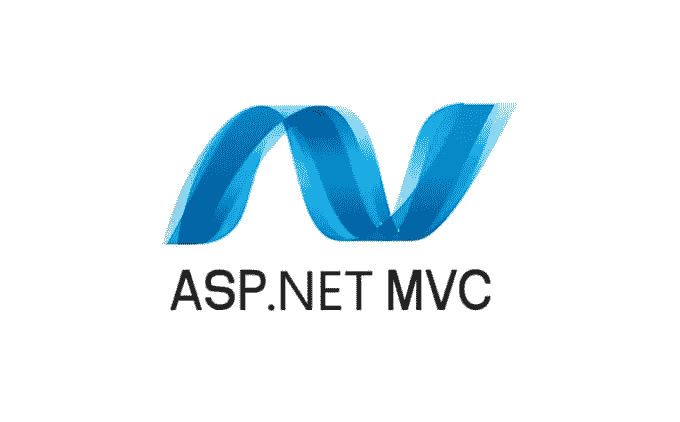
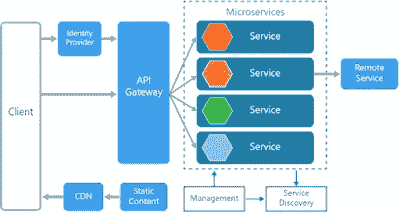
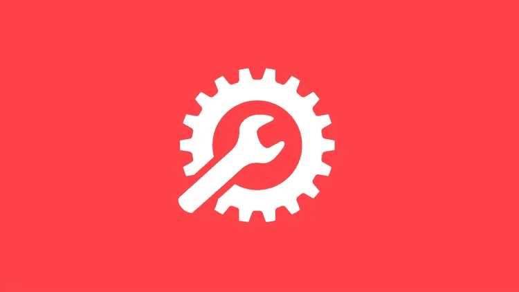
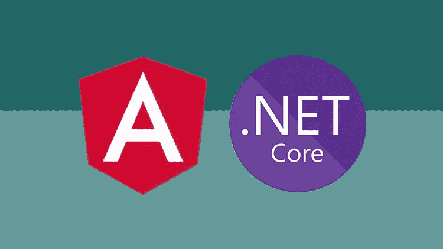
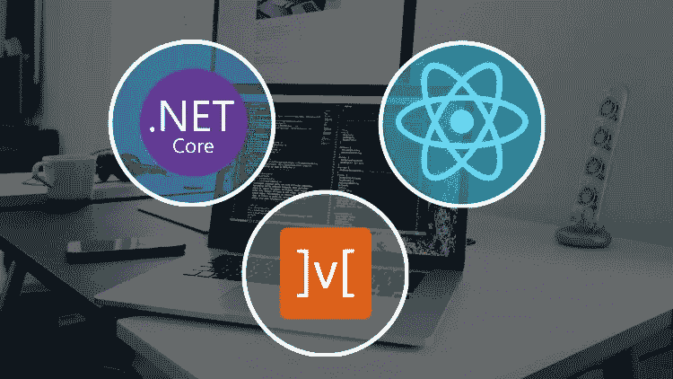
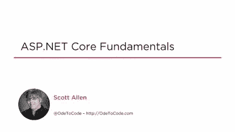
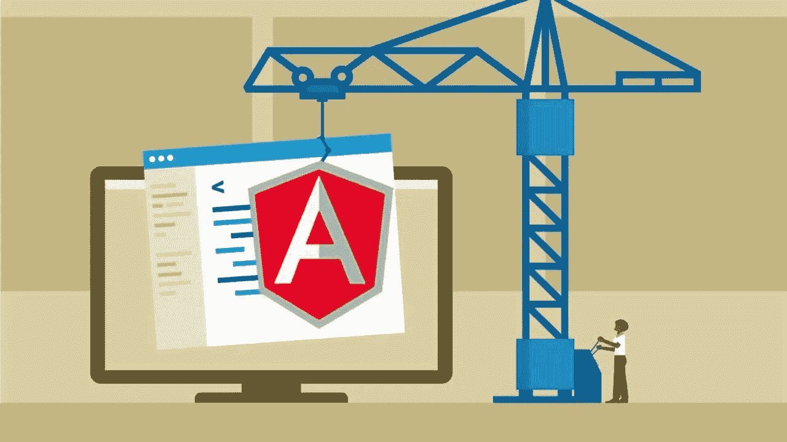
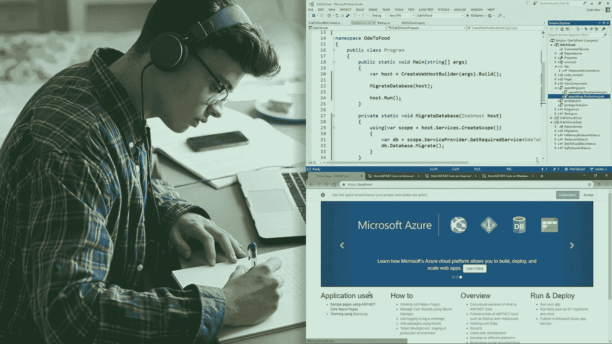

# 学习 ASP 的 7 门最佳课程。2023 年初学的 NET Core 和 MVC

> 原文：<https://medium.com/javarevisited/7-best-online-courses-to-learn-asp-net-core-and-mvc-in-depth-a68c1b728090?source=collection_archive---------0----------------------->

很多人不会同意，但是 ASP。NET 是最流行的技术之一，许多开发人员都在开发 ASP。网络遍布全球。作为一名 Java 开发人员，我接触 ASP 的机会有限。NET，尤其是在我的大学时代，但我有许多朋友在工作。网，为自己做得更好。

Java/JEE 和 ASP 之间总是有一些比较。NET 等**。NET technologies** ，但说实话，两者都很棒。这完全取决于你从事哪种技术，而这主要是由你公司的[建筑师](/javarevisited/top-5-courses-to-learn-software-architecture-in-2020-best-of-lot-5d34ebc52e9)决定的，而不是你自己。

我登陆 Java world 完全是出于运气，而我的朋友们登陆了。网络世界，但我们都在另一边工作过。当我开始写这份课程推荐书时，我找到他，问他是否愿意帮忙，他说不。他说，我没有时间做这些事情，我对现在的状况很满意。我说那很好，但是如果我想学 ASP，你能至少给我推荐一些我可以看一看的课程吗？网？奏效了。他说他会在几天内把名单用电子邮件发给我，他做到了。它只包含了几个课程，列表中的前两个，但是我必须包含至少 5 个课程才能使它成为一个列表。所以，我做了自己的研究，提出了这个学习 ASP 的课程清单。2023 年网。

如果你正在考虑学习 ASP。NET 并寻找一些优秀的资源，那么你来对地方了。这篇文章包含了一些学习 ASP 的最佳课程。2023 年的网。

大部分课程来自于 [Udemy](https://javarevisited.blogspot.com/2019/09/codecademy-vs-udemy-vs-onemonth-which-is-better-for-learning-code.html) 、 [Pluralsight](https://javarevisited.blogspot.com/2019/10/pluralsight-vs-codecademy-which-is-best-online-learning-platform.html) 、 [Coursera](https://javarevisited.blogspot.com/2019/10/top-5-coursera-professional-certificates-for-programmers-IT-professionals.html) 等平台。因为那是我学习的地方。还有许多其他伟大的平台，如 [Codecademy](/javarevisited/pluralsight-or-udemy-d9a94d2e8ee) 、 [OneMonth](https://javarevisited.blogspot.com/2019/09/codecademy-vs-udemy-vs-onemonth-which-is-better-for-learning-code.html) ，但它们通常没有所有技术的课程。

或者，你也可以查看 Youtube，这可能是学习几乎任何东西的唯一最重要的资源，而不仅仅是编程技术。

# 什么是 ASP。NET 和 ASP。2023 年的. NET 核心框架？

之前，我们先从学习 ASP 的课程列表开始。NET，我们先来了解一下什么是。NET 框架以及软件开发人员为什么使用它？根据维基百科，

*”。NET Framework 是微软开发的软件框架，主要运行在微软 Windows 上”。*

它包括一个名为框架类库的大型类库，并提供跨几种编程语言的语言互操作性。例如，您可以使用。NET 框架，使用类似于 [C#](https://www.java67.com/2019/03/5-free-c-net-courses-to-learn-online.html) 、VB.NET 商店、 [C++](http://www.java67.com/2018/02/5-free-cpp-courses-to-learn-programming.html) 和 F#的语言。

ASP.NET 可以说是构建在。NET 框架。您可以使用 ASP.NET 创建动态网页和安全的 web 应用程序。还有，。NET 支持控制台和[网络应用](/better-programming/my-5-favorite-courses-to-learn-web-development-in-2019-a5e74167f8b2)。

而且，ASP.NET 核心是 ASP.NET MVC 的下一代。这是对该框架的完全重写，但采用了模块化、云优化和跨平台的方式。

这意味着它可以在 Windows、 [Linux](https://dev.to/javinpaul/5-free-courses-to-learn-linux-for-beginners-367f) 和 Mac 上运行。如果你在 Mac 或 Linux 上，想在虚拟机上不运行 Windows 的情况下构建 ASP.NET 应用，你可以使用 ASP.NET 核心来实现！你甚至可以使用 Visual Studio 代码(VSCode)或者你喜欢的代码编辑器，用 [C#](https://javarevisited.blogspot.com/2019/11/top-5-courses-to-learn-c-sharp-in.html) 构建 ASP.NET 核心应用。

# 学习 ASP 的 7 门最佳在线课程。2023 年的网

现在你知道是什么了。NET 和什么是 ASP。让我们深入一些学习 ASP 的最佳课程。2023 年初学. NET。这些课程既适合初学者，也适合有一些经验的开发者，比如在 [Jav](/javarevisited/top-5-java-online-courses-for-beginners-best-of-lot-1e1e240a758) a 或 [C#](/javarevisited/9-free-c-c-sharp-courses-and-tutorials-for-beginners-and-intermediate-programmers-best-of-lot-dc8c793aab31) 中。

## 1.[完整的 ASP.NET MVC 5 课程](https://click.linksynergy.com/deeplink?id=JVFxdTr9V80&mid=39197&murl=https%3A%2F%2Fwww.udemy.com%2Fcourse%2Fthe-complete-aspnet-mvc-5-course%2F)

这是我朋友推荐的一道菜。我知道摩西·海姆达尼，看过他的几个 Youtube 视频，但这个课程完全让我震惊。我的意思是，在教授 ASP .NET 方面，他是一名优秀的教师。这是一门综合性的课程，但非常容易掌握，并且有一些真实世界的项目来尝试你所学的内容。在本课程中，你将学习如何用 ASP.NET MVC 5 构建快速安全的 web 应用程序。它涵盖了所有基本概念，如 MVC 架构模式和开发 web 应用程序所需的其他细节，如分页、性能、验证、API 等等。

**这里是加入本课程的链接** — [完整的 ASP.NET MVC 5 课程](https://click.linksynergy.com/deeplink?id=JVFxdTr9V80&mid=39197&murl=https%3A%2F%2Fwww.udemy.com%2Fcourse%2Fthe-complete-aspnet-mvc-5-course%2F)

您还将了解我最喜欢的测试 Web APIs 的工具 [Postman](https://javarevisited.blogspot.com/2020/02/top-5-postman-tutorials-and-courses-for-web-developers.html) 。在构建你自己的[RESTful API](https://javarevisited.blogspot.com/2018/02/top-5-restful-web-services-with-spring-courses-for-experienced-java-programmers.html)时，这也是有益的。

谈到社会证明，已经有超过 67，783 名学生注册了这门课程，近 20，000 名参与者对这门课程的平均评分为 4.3；这充分说明了它的了不起。如果你想学 ASP，我想问一下。NET MVC 5，加入这个课程。

## 2.[从零开始用 ASPNET 核心和 Angular 打造 app](https://click.linksynergy.com/deeplink?id=JVFxdTr9V80&mid=39197&murl=https%3A%2F%2Fwww.udemy.com%2Fcourse%2Fbuild-an-app-with-aspnet-core-and-angular-from-scratch%2F)

这是 Udemy 上的又一门学习 ASP 的优秀课程。网。在本课程中，讲师尼尔·卡明斯(Neil Cummings)是一名自由职业的 web 开发人员，他将向您展示一个如何从头到尾使用 ASP.NET 核心 WebAPI (v2.2)和 [Angular](https://hackernoon.com/top-10-angular-courses-tutorials-and-books-for-web-developers-e8a8e2c490c2?) (v8)构建应用程序的实际例子。是的，他真的是从零开始，然后编写代码并解释其中的每一行。不，他的申请不是微不足道的。Helloworld 类应用程序，它们是功能齐全的 [web 应用程序](/javarevisited/top-10-free-courses-to-learn-html-5-css-3-and-web-development-872d62d97a97)您可以在日常使用的网站中使用图像上传、发送电子邮件、认证、授权和许多其他功能。

说到社交证明，这门课程受到超过 29，000 名学生的信任，平均有近 7，000 名参与者给予 3.6 分的评分，这是一个惊人的成绩。如果你喜欢基于项目的学习和实践课程，我强烈建议你加入这个。

**这是加入本课程的链接** — [从头开始用 ASPNET Core 和 Angular 构建一个应用](https://click.linksynergy.com/deeplink?id=JVFxdTr9V80&mid=39197&murl=https%3A%2F%2Fwww.udemy.com%2Fcourse%2Fbuild-an-app-with-aspnet-core-and-angular-from-scratch%2F)

## 3.[使用构建应用程序的完整指南。Net Core 和 React](https://click.linksynergy.com/deeplink?id=JVFxdTr9V80&mid=39197&murl=https%3A%2F%2Fwww.udemy.com%2Fcourse%2Fcomplete-guide-to-building-an-app-with-net-core-and-react%2F)

这又是一个牛逼。NET 核心课程，由 Neil Cummings 教授，他是这个列表中第二个课程的讲师，使用。NET Core 和 Angular，在这个课程中，他做了同样的事情，但是用了 [React 框架](/javarevisited/top-10-free-courses-to-learn-react-js-c14edbd3b35f?source=extreme_main_feed----d3a191ac6ed-----5-1--------------------561c2dc6_a2b4_41e0_b7be_1d97edbf631c--8)。

以下是您将在本课程中学到的主要内容:

1.  如何使用 REact 和构建全栈 app？网络核心
2.  如何在？净项目
3.  如何使用实体框架核心作为 ORM 工具
4.  如何使用？网络核心身份
5.  如何使用 MobX 作为状态管理库

总的来说，这是一个使用。NET 核心框架。超过 9600 名学生在 Udemy 上信任了这门课程。

还有，**这里是加入本课程的链接** — [构建应用的完整指南。Net Core 和 React](https://click.linksynergy.com/deeplink?id=JVFxdTr9V80&mid=39197&murl=https%3A%2F%2Fwww.udemy.com%2Fcourse%2Fcomplete-guide-to-building-an-app-with-net-core-and-react%2F)

## 4.[Scott Allen 的 ASP.NET 核心基础](https://pluralsight.pxf.io/c/1193463/424552/7490?u=https%3A%2F%2Fwww.pluralsight.com%2Fcourses%2Faspdotnet-core-fundamentals)【plural sight 课程】

除了摩西·海姆达尼，我还发现了另一个教练。网络技术是斯科特艾伦在 Pluralsight。本课程涵盖了开始用 MVC 框架构建你的第一个 ASP.NET 核心应用程序所需要知道的基础知识。

您将学习诸如中间件、标签助手、视图组件、使用实体框架支持 [SQL Server](https://javarevisited.blogspot.com/2018/12/top-5-free-microsoft-sql-server-and-transact-sql-online-courses.html#axzz5hG3koJem) 以及身份框架的用户注册等主题。

您还将看到使用前端框架的新颖技术，如 [Bootstrap](https://www.java67.com/2019/01/5-free-bootstrap-course-to-learn-online.html) 和 [JavaScript](https://javarevisited.blogspot.com/2018/06/top-10-courses-to-learn-javascript-in.html) 库，如 [jQuery](https://hackernoon.com/top-5-free-jquery-courses-for-web-developers-best-of-lot-9f65a1ff25b6) 。思想，对 C#编程语言有较好的认识，对 HTML 和 web 开发有一定的了解是这门课所需要的。

**这是加入本课程的链接**——[Scott Allen 的《ASP.NET 核心基本面》](https://pluralsight.pxf.io/c/1193463/424552/7490?u=https%3A%2F%2Fwww.pluralsight.com%2Fcourses%2Faspdotnet-core-fundamentals)

顺便说一句，你需要一个 [**Pluralsight 会员**](https://pluralsight.pxf.io/c/1193463/424552/7490?u=https%3A%2F%2Fwww.pluralsight.com%2Fpricing) 才能加入这个课程，费用大约是每月 29 美元，每年 299 美元(14%的折扣)，但是完全值得。另类。你也可以使用他们的 [**10 天免费试用**](https://pluralsight.pxf.io/c/1193463/424552/7490?u=https%3A%2F%2Fwww.pluralsight.com%2Flearn) 来免费观看这个课程。

## 5.[用 ASP.NET 核心和 Angular 2 (4+)](https://click.linksynergy.com/deeplink?id=JVFxdTr9V80&mid=39197&murl=https%3A%2F%2Fwww.udemy.com%2Fcourse%2Faspnet-core-angular%2F) 构建一个真实世界的 App

这是 Mosh Hamedani 的另一门课程，我喜欢学习 ASP.NET 核心和实体框架核心。本课程将教你如何用 ASP.NET 核心、实体框架核心、 [Angular 2](https://javarevisited.blogspot.com/2018/06/5-best-courses-to-learn-angular.html) 构建一个全栈的 web app。

如果你不知道，ASP.NET 核心就是 ASP.NET 的下一代 MVC。这是对该框架的完全重写，但采用了模块化、云优化和跨平台的方式。它还允许你开发一个可以在 Mac OS 和 [Linux](https://javarevisited.blogspot.com/2018/02/5-courses-to-learn-shell-scripting-in-linux.html) 上运行的网络应用。许多公司已经开始使用 ASP.NET 核心构建他们的新应用。他们问新受访者是否熟悉。网芯。

所以，如果你在找工作并且有一些。NET 经验，建议你学习 ASP。NET Core 在竞争中保持领先。

**以下是加入本课程的链接** — [用 ASP.NET 核心和 Angular 2 (4+)](https://click.linksynergy.com/deeplink?id=JVFxdTr9V80&mid=39197&murl=https%3A%2F%2Fwww.udemy.com%2Fcourse%2Faspnet-core-angular%2F) 构建一个真实世界的应用

## 6.[ASP.NET MVC 5 基础，作者 Scott Allen](https://pluralsight.pxf.io/c/1193463/424552/7490?u=https%3A%2F%2Fwww.pluralsight.com%2Fcourses%2Faspdotnet-mvc5-fundamentals)

这是 Scott Allen 的另一门课程，它涵盖了 ASP.NET MVC 5 的所有新功能，以及 Visual Studio 中针对 web 开发人员的新功能，包括 WebApi 2、OWIN、Katana、SignalR 和实体框架版本 6。

介绍了身份和成员资格组件，并演示了如何定制和植入成员资格数据库。

它还包括编辑 [HTML](https://hackernoon.com/top-5-free-online-courses-to-learn-html-css-web-development-in-2020-ae8e7466dfa7) 、 [JavaScript](https://hackernoon.com/10-websites-to-learn-javascript-for-beginners-31e13bbdbb5c) 、 [CSS](https://javarevisited.blogspot.com/2019/05/top-5-html-5-and-css-3-courses-for-web-developers.html) 的提示和技巧，以及 Visual Studio 2013 和 Web Essentials 等扩展，这些扩展将 Zen 编码插件引入了 Visual Studio。

**这是加入本课程的链接**——【ASP.NET MVC 5 基础】Scott AllenT2

顺便说一句，你可以用一个会员身份同时参加 Pluralsight 课程。它的费用大约是每月 29 美元或一年 299 美元(14%的折扣),可以访问他们的 7000 多门在线课程。

或者，你也可以使用他们的 [**10 天免费通行证**](https://pluralsight.pxf.io/c/1193463/424552/7490?u=https%3A%2F%2Fwww.pluralsight.com%2Flearn) 免费进入这个课程。

 [## 个人技术技能|多视角

### 培养你在职业生涯中更快发展所需的技术技能。掌握最新的技术与数以千计的…

pluralsight.pxf.io](https://pluralsight.pxf.io/c/1193463/424552/7490?u=https%3A%2F%2Fwww.pluralsight.com%2Flearn) 

## 7.[利用 ASP.NET 核心开发应用](https://www.educative.io/courses/developing-applications-with-asp-net-core?affiliate_id=5073518643380224)【教育课程】

如果你正在寻找一个学习 ASP 的互动课程。这个基于文本的互动课程来自 [Educative](https://www.educative.io/subscription?affiliate_id=5073518643380224) 对初学者来说是一个很好的开始。

在本课程中，您将学习使用 ASP.NET 核心制作模型-视图-控制器(MVC)应用程序。您还将学习如何在代码中使用存储库模式，以及如何编写前端将使用的 JSON Web APIs。

本课程首先向您介绍模型-视图-控制器设计模式，以及您如何使用它来组织和开发您的 web 应用程序。然后，您将深入研究 JSON web APIs，它允许后端 ASP.NET 应用程序和前端 web/移动应用程序之间的通信。

在后半部分，您将了解存储库模式、关系如何工作，以及如何向您的应用程序添加身份验证和授权，在本课程结束时，您将有信心在 ASP.NET 核心中开发自己的应用程序。

**以下是参加本课程的链接** — [使用 ASP.NET 核心开发应用](https://www.educative.io/courses/developing-applications-with-asp-net-core?affiliate_id=5073518643380224)

而且，如果你发现教育平台和他们的互动课程很有用，那么你还可以获得 [**教育订阅**](https://www.educative.io/subscription?affiliate_id=5073518643380224) ，它不仅提供这门课程，还提供他们的 210 多门课程，每月仅需 14.9 美元。它非常划算，非常适合获得一些实践学习经验。

 [## 教育无限:保持领先

### 我们听到了您的反馈。你现在只需支付一次费用，就可以获得 Educative 上的所有课程。

www.educative.io](https://www.educative.io/subscription?affiliate_id=5073518643380224) 

## 8.[先进的 ASP.NET 酷睿 3.1 MVC](https://click.linksynergy.com/deeplink?id=JVFxdTr9V80&mid=39197&murl=https%3A%2F%2Fwww.udemy.com%2Fcourse%2Fmaster-aspnet-core-3-advanced%2F)

这是另一门很棒的课程。来自 Udemy 的 NET Core 3.1 和 MVC。本课程由 Bhrugen Patel 创建，它将教你如何使用存储库模式、N 层架构、API 和 ASP 创建真实世界的 web 应用程序。NET Core 3.0 框架。

以下是您将在本课程中学到的主要内容:

1.  如何创建和构造 ASP？NET MVC 核心 3 项目
2.  如何使用核心框架，如身份认证和实体 ORM
3.  如何实现存储库模式

总的来说，这是学习 ASP。NET Core 和 MVC 以动手和基于项目的方式。你所需要的只是一些 C#和。NET 经验，Visual Studio 代码和 SQL Server Management Studio 开始。

**以下是参加本课程的链接** — [高级 ASP.NET 核心 3.1 MVC](https://click.linksynergy.com/deeplink?id=JVFxdTr9V80&mid=39197&murl=https%3A%2F%2Fwww.udemy.com%2Fcourse%2Fmaster-aspnet-core-3-advanced%2F)

以上就是学习 ASP 的一些**最佳课程。2023 年网**。如果你想学习 ASP，这些绝对是最好的课程。NET 进行 web 开发。

我有目的地加入了一些课程来学习。NET 核心，这是未来的。NET 框架和 ASP。NET，许多公司仍在使用它来开发他们的 web 应用程序。如果你是从零开始学习，你最好从。NET CORE，不仅可以在 Windows 上运行，也可以在 Linux 和 macOS 上运行。

其他**你可能喜欢的免费编程课程**

*   2002 年网络开发者路线图
*   [2023 年我最喜欢学习的课程 node . js](/javarevisited/top-10-online-courses-to-learn-node-js-in-depth-8ef0e31ca139)
*   [学习 AWS、Docker 和 Kubernetes 的 15 门课程](/javarevisited/top-15-online-courses-to-learn-docker-kubernetes-and-aws-for-fullstack-developers-and-devops-d8cc4f16e773)
*   [2023 年 DevOps 开发者路线图](https://javarevisited.blogspot.com/2018/09/the-2018-devops-roadmap-your-guide-to-become-DevOps-Engineer.html)
*   [学习 iOS 应用开发的 5 门免费课程](https://javarevisited.blogspot.com/2018/11/5-free-ios-app-development-courses-for.html)
*   [面向 Java 程序员的 5 门免费 Spring 框架课程](http://www.java67.com/2017/11/top-5-free-core-spring-mvc-courses-learn-online.html)
*   [面向初学者的 5 门免费核心 Java 课程](http://www.java67.com/2017/11/top-5-free-core-spring-mvc-courses-learn-online.html)
*   [5 门免费学习机器和深度学习的课程](http://www.java67.com/2019/01/5-free-courses-to-learn-machine-and-deep-learning-in-2019.html)
*   [如何在 2023 年成为 React 开发者](https://javarevisited.blogspot.com/2018/10/the-2018-react-developer-roadmap.html)
*   [Udemy vs Pluralsight 复习——学习哪个好？](https://javarevisited.blogspot.com/2019/10/udemy-vs-pluralsight-review-which-is-better-to-learn-code.html)

感谢您阅读本文。如果你发现这些 ASP。NET 课程有用的话，请分享给你的朋友和同事。如果您有任何问题或反馈，请留言。

如果你正在寻找一门免费课程来启动你的 ASP。网游然后你还可以在 Udemy 上查看一下[**ASP.NET 零点:与 ASP.NET 核心的开发&棱角**](https://click.linksynergy.com/deeplink?id=JVFxdTr9V80&mid=39197&murl=https%3A%2F%2Fwww.udemy.com%2Fcourse%2Faspnet-zero-aspnet-core-angular%2F) 。这是一个完全免费的课程，你所需要做的就是创建一个 Udemy 帐户来注册课程，然后你就完成了。

 [## 免费 ASP.NET 核心教程-ASP.NET 零:发展与 ASP.NET 核心&角

### 我们正在开发开源和商业软件开发工具。我们最著名的产品是 AspNet 样板文件…

udemy.com](https://click.linksynergy.com/deeplink?id=JVFxdTr9V80&mid=39197&murl=https%3A%2F%2Fwww.udemy.com%2Fcourse%2Faspnet-zero-aspnet-core-angular%2F)