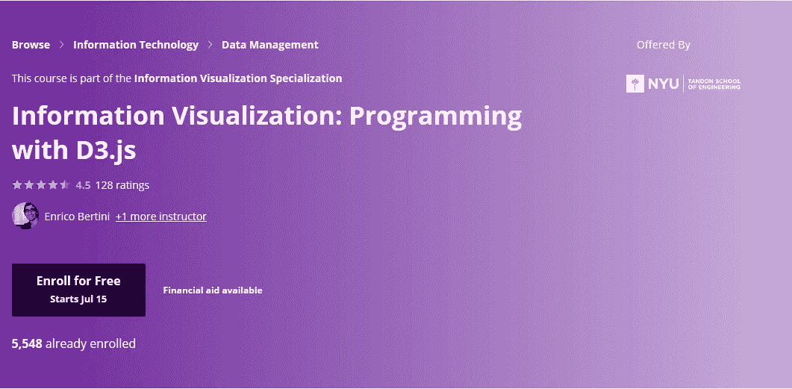
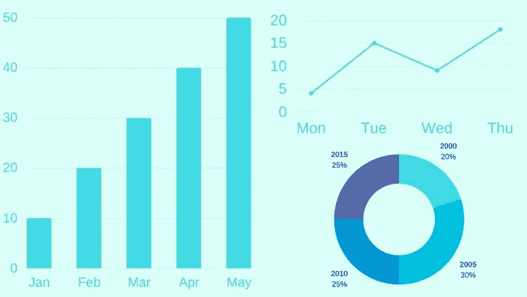
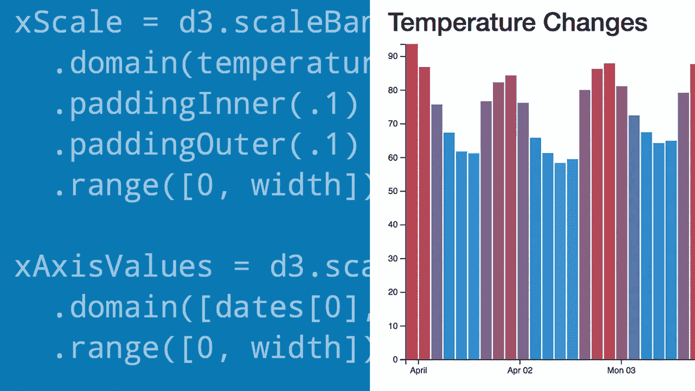
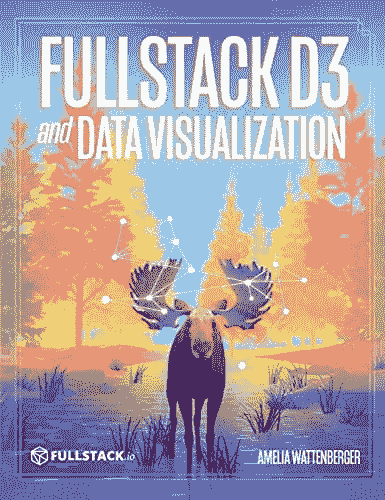

# 2023 年学习数据可视化的 10 个最佳 D3.js 在线课程和书籍

> 原文：<https://medium.com/javarevisited/7-best-online-courses-to-learn-d3-js-for-data-visualization-in-2020-1a8c79add4e4?source=collection_archive---------1----------------------->

## 我最喜欢从 Udemy、Coursera、Pluralsight 和 Codecademy 学习 D3.js 的在线课程和书籍

各位，如果你做过数据可视化工作，你可能听说过 D3——一个优秀的 JavaScript 库，它允许你为网络创建漂亮的交互式数据可视化。这在[数据科学家](https://javarevisited.blogspot.com/2018/10/data-science-and-machine-learning-courses-using-python-and-R-programming.html#axzz5gKfbWIIv)和[数据分析师](https://javarevisited.blogspot.com/2018/02/top-10-highest-paying-technical-jobs-programmers-software-developers.html#axzz5YWg3NwE7)中很普遍，他们经常需要这些可视化和图表来向利益相关者和商业人士展示数据见解。

如果你不熟悉 D3，不用担心，因为在这篇文章中，我会分享一些在 2023 年学习 D3 的很棒的课程。这些课程通过将数据绑定到 web 页面的元素，并基于这些数据定制元素，向您传授使用 D3 进行数据可视化的基础知识。

您还将学习如何使用 D3.js

构建不同种类的图表，如条形图、饼图、思维导图等，让我们从 D3.js 的完整形式开始；D3 代表**数据驱动文档**。这是一个用于[数据可视化](https://www.java67.com/2020/07/top-5-data-visualization-tools-every.html)的 [JavaScript 库](/javarevisited/10-of-the-most-popular-javascript-frameworks-libraries-for-web-development-in-2019-a2c8cea68094)，在数据科学家、统计学家、数学家、分析师以及任何想要获取原始数据并创建视觉上吸引人的图表和数据驱动的可视化的人当中非常流行，例如:

*   条形图
*   饼图
*   曲线图
*   气泡包装
*   树形图等

有效的可视化有助于用户分析和推理数据，并使复杂的数据更容易访问、理解和阅读！

# 为什么 D3.js 最适合数据可视化？

当谈到数据可视化库和 web 工具时，D3 不是唯一的选择；你也有 FusionCharts、HighCharts、charts.js，甚至谷歌开发人员的图表和工具，如面向数据科学家的 [**Tableau**](https://javarevisited.blogspot.com/2019/07/top-5-tableau-online-courses-and-certifications-for-data-science-engineers.html) ，但使 D3.js 与这些不同的是它的灵活性、优雅性和社区性。

D3 非常灵活地加载不同来源的数据，并帮助您进行独特的可视化。您可以使用 D3.js.

创建一个全新的可视化，这在使用 D3.js 之前是无法想象的，它也很优雅，因为您可以创建令人敬畏的可视化，但它最重要的优势是社区。如果你陷入困境，一个巨大的 D3 开发者社区可以支持你。

也有很多现有的代码来创建你想要的可视化；这使得使用 D3.js 创建数据可视化变得非常容易。

一张图片胜过千言万语，这一点对于数据可视化和 D3.js 来说再正确不过了。

# 2023 年初学者学习 D3.js 的 10 个最佳在线课程和书籍

现在你知道 D3.js 有多好了，那就来看看 2023 年你可以学习和掌握 D3 的一些最好的课程吧。记住不同的学习方式，如互动学习、基于项目的学习和视听学习。

我选择了提供这些类型的正确组合的课程。所有的课程都很棒，通过热情的教师和令人敬畏的内容提供了令人惊叹的学习体验。

## 1. [D3.js 数据可视化基础——动手操作](https://click.linksynergy.com/deeplink?id=JVFxdTr9V80&mid=39197&murl=https%3A%2F%2Fwww.udemy.com%2Fcourse%2Fd3jsbasics%2F)

这是 2023 年学习 D3.js 用 JavaScript 进行数据可视化的最好的动手课程。本课程将通过实际动手学习 d3 库，帮助你用 d3.js 设计和构建漂亮的数据可视化。

以下是您将在本课程中学到的主要内容:

*   学习 D3 的基础知识
*   获得广泛的知识，学习如何使用不同的可视化工具，如条形图、图表等。
*   在单个页面上开发具有大量可视化效果的令人惊叹的网页
*   使用 D3 和 SVG 创建令人惊叹的数据可视化
*   使用缩放有助于使您的视觉效果在任何浏览器或设备上工作。

谈到社会证明，已经有超过 11677 人加入了这门课程，它是 Udemy 上学习 D3.js 评分最高的课程之一，平均 4.8 分的评分表接近 1870 名参与者，令人印象深刻。

**以下是参加本课程的链接** — [D3.js 数据可视化基础知识—动手操作](https://click.linksynergy.com/deeplink?id=JVFxdTr9V80&mid=39197&murl=https%3A%2F%2Fwww.udemy.com%2Fcourse%2Fd3jsbasics%2F)

## 2..[掌握 D3.js 中的数据可视化](https://click.linksynergy.com/deeplink?id=JVFxdTr9V80&mid=39197&murl=https%3A%2F%2Fwww.udemy.com%2Fmasteringd3js%2F)【Udemy 最佳课程】

如果你想用 d3.js 设计和构建漂亮的数据可视化，这是另一个最好的在线课程。

课程从 D3 基础开始，然后在 7 个小时内涵盖高级数据仪表板可视化。这使得任何初学者都可以跟随他，使用 D3.js 构建他们的动态和交互式图表。

这也是一门非常动手的课程，并且您将在此过程中构建几个项目，这对巩固您的学习和应用您所学的知识非常重要。他也很乐于助人，一直在 Q 上回答问题。这门关于社会证明的课程有超过 8790 名学生注册。它还拥有平均 4.4 分的评分，接近 1600 分，这是惊人的。

**以下是加入本课程** — [掌握 D3.js 中的数据可视化](https://click.linksynergy.com/deeplink?id=JVFxdTr9V80&mid=39197&murl=https%3A%2F%2Fwww.udemy.com%2Fmasteringd3js%2F)的链接

## 3.[信息可视化:用 D3.js 编程](https://coursera.pxf.io/c/3294490/1164545/14726?u=https%3A%2F%2Fwww.coursera.org%2Flearn%2Finformation-visualization-programming-d3js)【Coursera】

在 Coursera 的这个免费课程中，你将学习如何使用 D3.js 为网络创建强大的可视化。学习 D3.js 可以让您自由地创建像条形图一样简单的东西，或者设计一些从来不存在的独特的可视化。本课程将理论和实践恰当地结合在一起，并提供了一步一步的指导，教你如何使用这个库来构建实际的可视化效果，并理解它们背后的理论概念。

本课程也是 [**信息可视化专业**](https://click.linksynergy.com/deeplink?id=JVFxdTr9V80&mid=40328&murl=https%3A%2F%2Fwww.coursera.org%2Fspecializations%2Finformation-visualization) 的一部分，包含更多掌握数据可视化的相关课程。像其他 Coursera 课程一样，这个课程也是**免费审核**，如果你需要证书或者想要获取测验和评估，你只需要付费。这门 Coursera D3 课程最棒的地方在于，你将通过运用你在这门课程中学到的技能，构建一个完整的可视化系统来可视化航线。

**这里是加入本课程** — [信息可视化:用 D3.js 编程](https://coursera.pxf.io/c/3294490/1164545/14726?u=https%3A%2F%2Fwww.coursera.org%2Flearn%2Finformation-visualization-programming-d3js)的链接

顺便说一句，如果你觉得 Coursera 的课程有用，因为它们是由知名公司如**谷歌**、 **IBM** 、**亚马逊**和世界上最好的大学创建的，我建议你加入 Coursera 的年度订阅计划 [**Coursera Plus**](https://coursera.pxf.io/c/3294490/1164545/14726?u=https%3A%2F%2Fwww.coursera.org%2Fspecializations%2Finformation-visualization) 。

这种单一订阅让你可以无限制地访问他们最受欢迎的**课程**、**专业化**、**职业证书**和**指导项目**。它每年花费大约 399 美元，但是它完全值得你的钱，因为你得到了**无限证书**。

<https://coursera.pxf.io/c/3294490/1164545/14726?u=https%3A%2F%2Fwww.coursera.org%2Fspecializations%2Finformation-visualization>  

## 4.[学习 CodeCademy 上的 D3 课程](https://www.pntra.com/t/TUJGR0lLR0JHRklJSkhCR0ZISk1N?url=https%3A%2F%2Fwww.codecademy.com%2Flearn%2Flearn-d3)

这是 CodeCademy Pro 上的一个非常棒的互动课程，将教你如何使用 D3 绘制图表和可视化。这是一个 2 小时的简短但充满力量的课程，包含 D3 上的互动课程。课程还有选择题和一个项目，教你如何使用 D3 绘制有意义的可视化。你很有可能已经拥有了 [**CodeCademy Pro 会员资格**](https://bit.ly/codecademypro)**，这意味着你可以免费使用这门课程。

但是，如果你还没有，我建议你买一个，因为 CodeCademy 有一些最好的互动课程，可以学习最新的技术和编程语言，如 [Python](https://dev.to/javinpaul/7-python-online-courses-for-beginners-and-intermediate-programmers-1h4k) 、 [Java](https://itnext.io/must-read-books-to-learn-java-programming-327a3768ea2f#f2fc) 、 [SQL](https://dev.to/javinpaul/5-online-courses-to-learn-sql-and-database-for-beginners-best-of-lot-5533) 、[Data science](/hackernoon/10-machine-learning-data-science-and-deep-learning-courses-for-programmers-7edc56078cde)e 等。他们的专业会员费用大约是每月 16 美元，你可以通过两天不喝咖啡来恢复——这也是一件健康的事情:-)**

****这里是加入这个 D3.js 课程**——[学习 D3](https://www.pntra.com/t/TUJGR0lLR0JHRklJSkhCR0ZISk1N?url=https%3A%2F%2Fwww.codecademy.com%2Flearn%2Flearn-d3) 的链接**

****

## **5.[用 D3.js & Firebase](https://click.linksynergy.com/deeplink?id=JVFxdTr9V80&mid=39197&murl=https%3A%2F%2Fwww.udemy.com%2Fbuild-data-uis-with-d3-firebase%2F) 构建数据可视化**

**这是 Udemy 上的另一门课程，对于学习如何使用 D3 和 Firebase 创建动态 SVG 数据可视化、条形图和饼图非常有用。由 Net Ninjam 创建，在本课程中，我将教你如何利用 D3 的能力来创建各种不同的数据驱动的可视化，如条形图、饼图、折线图、气泡图和树形图。

您还将了解 D3 选择、更改 SVG 属性&样式、比例、轴、过渡、分层数据以及其他重要的 D3.js 概念。谈到社会证明，已经有超过 3300 人以 4.6 的平均评分信任了这门课程，成为 Udemy 上学习 D3.js 评分最高的课程之一。**

****这里是加入本课程的链接**——[用 D3.js & Firebase](https://click.linksynergy.com/deeplink?id=JVFxdTr9V80&mid=39197&murl=https%3A%2F%2Fwww.udemy.com%2Fbuild-data-uis-with-d3-firebase%2F) 构建数据可视化**

****

## **6.[克里斯·伯伦斯 D3 入门](https://pluralsight.pxf.io/c/1193463/424552/7490?u=https%3A%2F%2Fwww.pluralsight.com%2Fcourses%2Fd3-getting-started)【多视课程】**

**这是学习 D3.js 的另一个很好的课程，但是是在复数视野上。如果你有 [Pluralsight 会员](http://pluralsight.pxf.io/c/1193463/424552/7490?u=https%3A%2F%2Fwww.pluralsight.com%2Flearn)，可以利用这个课程快速学习 D3.js。在本课程中，您将学习 D3 如何使用 SVG(可缩放矢量图形)创建数据可视化的基础。

接下来，你会发现如何创建一个强大的折线图，你可以适应你的工作。最后，您将探索如何使用强制布局创建强大的分层图，以及如何使用地理可视化来交流真实世界的数据。

完成本课程后，您将具备将数据转化为图片所需的 D3 和数据可视化技能和知识。**

****以下是加入本课程的链接** — [学习并理解 D3.js 进行数据可视化](https://click.linksynergy.com/deeplink?id=JVFxdTr9V80&mid=39197&murl=https%3A%2F%2Fwww.udemy.com%2Fcourse%2Flearn-d3js-for-data-visualization%2F)**

****

**唯一的问题是，你需要一个<http://pluralsight.pxf.io/c/1193463/424552/7490?u=https%3A%2F%2Fwww.pluralsight.com%2Flearn>****会员**才能进入这门课程，费用大约是每月 29 美元或每年 299 美元。他们还提供为期两天的 33%的折扣，这意味着你只需花 199 美元就可以订阅一年。****

****这绝对物有所值，因为你可以在他们的网站上获得 7000 多门技术和非技术课程，我相信每个开发者都应该拥有这种会员资格。以防万一，如果你还没有准备好，他们还提供一个 [**10 天的免费试用**](http://pluralsight.pxf.io/c/1193463/424552/7490?u=https%3A%2F%2Fwww.pluralsight.com%2Flearn) 足以免费进入这个课程。****

****<http://pluralsight.pxf.io/c/1193463/424552/7490?u=https%3A%2F%2Fwww.pluralsight.com%2Flearn> **** 

## ****7. [D3 提示和技巧:交互式数据可视化](https://www.educative.io/courses/d3-tips-data-visualization?affiliate_id=5073518643380224)[教育性]****

****如果你正在寻找基于文本的交互式课程来学习 D3.js，那么 Educative 的这个 D3.js 课程非常适合你。Educative 是一个相对较新的在线学习平台，它允许你在浏览器上运行代码，从而使你更容易学习。****

****在这个 D3.js 初学者课程中，您将从一个简单的线图开始您的 D3 之旅。您将学习如何将示例分解成各个组件，并通过单独修改每个组件来创建图形的变体。****

****之后，您将深入了解如何在 D3 中绘制元素，例如几何形状和路径。此外，您将学习对这些元素应用各种样式并调整它们的属性。****

****在此过程中，您将获得使用可视化条形图、直方图、树形图等技术的实践经验。在本课程结束时，您将对 D3.js 有一个大致的了解，以便进一步探索。****

******这里是加入本课程的链接**——[D3 提示和技巧:交互式数据可视化](https://www.educative.io/courses/d3-tips-data-visualization?affiliate_id=5073518643380224)****

********

****而且，如果你觉得教育平台和他们的互动课程有用，你还可以获得一个 [**教育订阅**](https://www.educative.io/subscription?affiliate_id=5073518643380224) ，它不仅提供这门课程，还提供他们的 210 多门课程，每月只需**$ 14.9**。它非常划算，非常适合获得一些实践学习经验。****

****<https://www.educative.io/subscription?affiliate_id=5073518643380224> **** 

## ****8.[用 D3.js 学习数据可视化](http://linkedin-learning.pxf.io/c/1193463/449670/8005?u=https%3A%2F%2Fwww.linkedin.com%2Flearning%2Flearning-data-visualization-with-d3-js)【LinkedIn 学习】****

****如果你是一名数据科学家或有志成为数据科学家，并在 2023 年寻找一门用 D3.js 学习数据可视化的惊人课程，那么 LinkedIn Learning(一个受欢迎的在线学习平台)的这门课程是一个很好的开始。****

****D3.js 库通过使解析数据和添加有意义的交互性变得更加容易，彻底改变了数据可视化。您还可以使用 D3、一点 HTML、CSS、JavaScript 和一些 SVG 图形让您的数据变得生动。****

****在本课程中，您不仅将学习 D3 库如何工作，还将学习如何使用它来解析来自不同来源的数据，并创建交互式的、视觉上令人兴奋的信息图和可视化。****

****您将学习一些基本概念，比如用 jQuery 风格的选择控制 HTML，以及通过 CSS 修改属性——然后继续学习 SVG 图形，这是 D3 可视化中图形的首选。****

****您还将使用 D3 方法，如缩放、事件、过渡、动画，以及如何处理数据，包括连接到外部数据源，这对数据科学家来说非常重要。总的来说，这是数据科学家学习 D3.js 的一个很好的课程。****

******这里是加入本课程**——[用 D3.js 学习数据可视化](http://linkedin-learning.pxf.io/c/1193463/449670/8005?u=https%3A%2F%2Fwww.linkedin.com%2Flearning%2Flearning-data-visualization-with-d3-js)的链接****

********

****你需要一个 LinkedIn Learning 会员才能观看这个课程，这个课程每月花费大约 19.99 美元，但是你也可以通过参加他们的 [**1 个月免费试用**](http://linkedin-learning.pxf.io/c/1193463/449670/8005?u=https%3A%2F%2Fwww.linkedin.com%2Flearning%2Fsubscription%2Fproducts) 来免费观看这个课程，这是一个探索他们关于最新技术的 16000+在线课程的好方法。****

## ****9. [**Fullstack D3 和数据可视化**](https://gumroad.com/a/137262195) **【学习 D3.js 的最佳书籍】******

****如果你喜欢阅读课程之外的书籍，你也可以看看这本很棒的书，深入学习 D3.js。本书由 Newline 创作，他是《full stack React<https://gumroad.com/a/221148275/LNUti>**和 [**ng-book:完整的 Angular Guide**](https://gumroad.com/a/221148275/FlvVl) 的作者，这两本书是 Javascript 开发人员学习 React 和 Angular 的最佳资源。******

*****Fullstack D3* 课程是 D3 的完整指南。通过展示每个步骤的几十个代码示例，您将通过在这个自定进度的在线课程暨书中创建可视化来获得对数据的新见解。****

****Fullstack D3 是一门自定进度的在线课程，在这里您将学习如何掌握 D3 并构建漂亮的自定义可视化效果。你会马上开始制作图表，学习新概念和设计理论。****

******这是加入本课程** — [Fullstack D3 和数据可视化](https://gumroad.com/a/137262195)的链接****

********

****如果你喜欢，你也可以在亚马逊 Kindle 上购买这本书，这里有链接到 [**Fullstack D3 和数据可视化**](https://www.amazon.com/Fullstack-Data-Visualization-beautiful-visualizations-ebook/dp/B07ZHS5L22?tag=javamysqlanta-20) **到**用 D3 构建漂亮的数据可视化。****

****<https://www.amazon.com/Fullstack-Data-Visualization-beautiful-visualizations-ebook/dp/B07ZHS5L22?tag=javamysqlanta-20> **** 

## ****10.[学习并理解用于数据可视化的 D3 . js](https://click.linksynergy.com/deeplink?id=JVFxdTr9V80&mid=39197&murl=https%3A%2F%2Fwww.udemy.com%2Fcourse%2Flearn-d3js-for-data-visualization%2F)【Udemy】****

****另一个综合课程是在 Udemy 上学习使用 JavaScript 进行数据可视化的 D3.js。本课程包含 10 小时的高质量内容、17 篇文章和 30 多种可下载资源。****

****以下是您将在本课程中学到的关键技能:****

*   ****如何使用 [D3](https://javarevisited.blogspot.com/2019/09/top-5-courses-to-learn-d3js-best.html) 和 SVG 创建令人惊叹的数据可视化****
*   ****使用 GeoJSON 构建交互式地图可视化****
*   ****理解使用 D3 操作 DOM 的选择****
*   ****了解用于构建各种图表和图形的布局****
*   ****为您的图形添加过渡和动画，以获得更有趣的用户体验****
*   ****使用缩放有助于使您的视觉效果在任何浏览器或设备上工作。****
*   ****理解 D3 的进入和存在模式****
*   ****如何创建响应图表和图形****

****简而言之，这是一门深入探究 D3.js 的完美课程。学习核心概念并使用 D3 version 6.x 构建令人惊叹的数据可视化****

******以下是加入本课程的链接** — [学习并理解 D3.js 进行数据可视化](https://click.linksynergy.com/deeplink?id=JVFxdTr9V80&mid=39197&murl=https%3A%2F%2Fwww.udemy.com%2Fcourse%2Flearn-d3js-for-data-visualization%2F)****

********

****以上是学习 D3 的一些**最佳在线课程——最流行的数据可视化 JavaScript 库。这些课程是精心挑选的，理论和实践结合得很好。******

****学习 D3 不需要加入所有课程；选择两个你可以和老师联系的地方。D3 上的第一门课程是我最喜欢的课程，我在 D3.js 上学到的任何东西都主要是因为那门课程。

其他**文章程序员和数据科学家**可能喜欢****

*   ****[初学者学习数据科学的 10 门课程](https://hackernoon.com/10-machine-learning-data-science-and-deep-learning-courses-for-programmers-7edc56078cde)****
*   ****[2023 年学习 Python 的 5 大课程](https://hackernoon.com/top-5-courses-to-learn-python-in-2018-best-of-lot-26644a99e7ec)****
*   ****[面向数据科学家的 10 大 TensorFlow 课程](https://dev.to/javinpaul/10-of-the-best-tensorflow-courses-to-learn-machine-learning-from-coursera-and-udemy-37bf)****
*   ****[初学者学习 Python 的 10 门免费课程](https://hackernoon.com/10-free-python-programming-courses-for-beginners-to-learn-online-38312f3b9912)****
*   ****[学习数据科学 Python 的 5 本书](https://javarevisited.blogspot.com/2019/08/top-5-python-books-for-data-science-and-machine-learning.html)****
*   ****[学习机器学习的 5 大免费课程](https://www.java67.com/2019/01/5-free-courses-to-learn-machine-and-deep-learning-in-2019.html)****
*   ****[面向程序员的 10 门机器学习和深度学习课程](https://hackernoon.com/top-5-courses-to-learn-python-in-2018-best-of-lot-26644a99e7ec)****
*   ****[2023 年学习 Python 的 10 个理由](https://hackernoon.com/10-reasons-to-learn-python-in-2018-f473dc35e2ee)****
*   ****[学习数据科学表格的前 5 门课程](/javarevisited/my-favorite-courses-to-learn-tableau-for-data-science-and-visualization-46623ba5b424)****
*   ****[面向数据科学和机器学习的 8 大 Python 库](https://javarevisited.blogspot.com/2018/10/top-8-python-libraries-for-data-science-machine-learning.html)****
*   ****[学习高级数据科学的前 5 门课程](https://hackernoon.com/top-5-data-science-and-machine-learning-course-for-programmers-e724cfb9940a)****
*   ****[初学者学习 TensorFlow 的 5 大课程](https://hackernoon.com/top-5-tensorflow-and-ml-courses-for-programmers-8b30111cad2c)****

****感谢您阅读本文。如果你喜欢这些面向 Web 开发者的 D3 课程，请分享给你的朋友和同事。如果您有任何问题或反馈，请留言。****

******附言**。—如果你热衷于学习 D3.js 用于 JavaScript 中的数据可视化，但在寻找免费的培训课程，你也可以在 Udemy 上查看这个 [**如何用 D3.js**](https://click.linksynergy.com/deeplink?id=JVFxdTr9V80&mid=39197&murl=https%3A%2F%2Fwww.udemy.com%2Fcourse%2Fhow-to-make-a-pie-chart-with-d3js%2F) 制作饼状图的课程。完全免费，已经有超过 2.5K 的人加入了这个课程。你只需要一个免费的 Udemy 帐户就可以参加这个课程。****

****<https://click.linksynergy.com/deeplink?id=JVFxdTr9V80&mid=39197&murl=https%3A%2F%2Fwww.udemy.com%2Fcourse%2Fhow-to-make-a-pie-chart-with-d3js%2F> ****