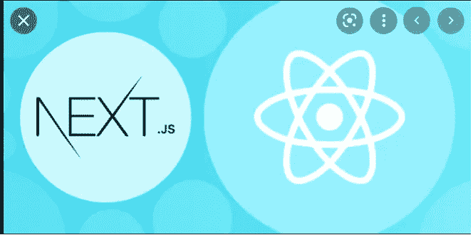
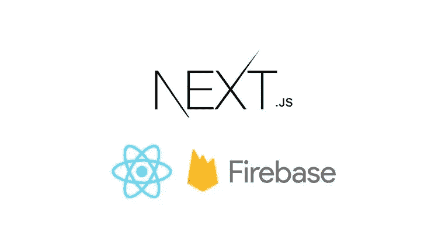
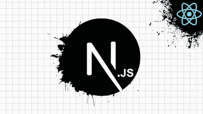

# 2023 年 React 开发人员在线学习的 8 门最佳 Next.js 课程

> 原文：<https://medium.com/javarevisited/7-best-online-courses-to-learn-next-js-for-react-developers-ced862a3864?source=collection_archive---------1----------------------->

## 我最喜欢的在线课程是从 Udemy、ZTM 学院、Pluralsight 和 Educative 为 2023 年的初学者学习 Next.js 和 React.js。

大家好，如果你想在 2023 年学习 Next.js，并寻找一些优秀的资源，如书籍、教程、课程和指南，那么你来对地方了。

前面我已经分享了学习 React.js 的 [**最佳课程和初学者的**](/@javinpaul/top-5-courses-to-learn-react-js-in-2019-best-of-lot-fa02cd96cdf0) **[**最佳 React 书籍**](/javarevisited/5-best-react-js-books-for-beginners-and-experienced-web-developers-e7b90b1ab9d2?source=---------36----------------------------) ，而在这篇文章中，我将分享一些从零开始学习 Next.js 的最佳在线培训课程。**

如果你不知道， **Next.js 是**一个流行的 React 框架，有助于服务器端渲染，可以显著改善页面加载关系的用户体验。使用服务器端渲染也让你在搜索引擎优化上有了优势，可以更容易地索引和抓取现成的网站。

Next.js 被吹捧为 web 开发领域的下一个大事件，2023 年可能是学习 Next.js 的好时机。

在本文中，我分享了来自 [Udemy](https://click.linksynergy.com/deeplink?id=CuIbQrBnhiw&mid=39197&murl=https%3A%2F%2Fwww.udemy.com%2F) 、 [Educative](https://www.educative.io/subscription?affiliate_id=5073518643380224) 和 [Pluralsight](https://pluralsight.pxf.io/c/1193463/424552/7490?u=https%3A%2F%2Fwww.pluralsight.com) 的在线课程，这些课程将教你使用 React.js 学习 Next.js，即使你没有 React . js 的背景知识，以及一些针对已经熟悉 React 并只想学习 Next.js 的开发人员的高级课程 我最喜欢的两个学习前端技术的导师像 [React](/@javinpaul/top-5-courses-to-learn-react-js-in-2019-best-of-lot-fa02cd96cdf0) 、 [Angular](/javarevisited/10-courses-to-learn-angular-for-web-development-6da1bd2856dc) 、 [Vue.js](/javarevisited/top-5-online-courses-to-learn-vue-js-in-2021-249e66b60646) ，甚至还有基础的像 [JavaScript](/javarevisited/10-best-online-courses-to-learn-javascript-in-2020-af5ed0801645) 和 [CSS](https://www.java67.com/2020/08/5-best-online-courses-to-learn-html-5.html) 。 我还选择了实践和基于项目的课程，我的意思是这些课程不仅会教你理论和解释概念，还会告诉你如何在现实世界中应用它们，同时构建重要的项目。我个人发现基于项目的学习是学习任何新技术的最佳方式，因为当你使用它时，你会学到更多。通过阅读或观看来获取信息是可以的，但除非你将这些付诸实践，否则你不会真正学到东西，这也是基于项目和实践的课程的优势所在。他们确保您与他们一起构建项目，并应用您所学的所有概念，在您的 Next.js 旅程中前进。

**Next.js 还旨在解决与单页面应用相关的首页下载问题。在现代社会，单页应用程序或 SPAs 已经成为建立互动网站的标准和最佳方式。**

不幸的是，大多数 spa 都有一个问题，叫做首页下载问题，这会导致大量的等待时间。

因为加载时间很关键，如果你的网站不能在 10 秒内加载，几乎 90%的用户会离开，所以了解更多这个问题并解决它是有意义的。

Next.js 还可以用作静态站点生成器，这就是为什么学习 Next.js 对 web 开发人员来说是一件非常棒的事情。

# 2023 年学习 Next.js 的 8 门最佳在线课程

在不浪费你更多时间的情况下，这里列出了 2023 年要学习的最好的在线课程。这些课程中的大部分也会教你 React，因为 Next 允许你创建更好的 React 应用程序，但是了解 React 基础知识会对你有所帮助。这些在线培训课程来自流行的在线学习门户网站，如 [Udemy](https://click.linksynergy.com/deeplink?id=CuIbQrBnhiw&mid=39197&murl=https%3A%2F%2Fwww.udemy.com%2F) 、 [Pluralsight](https://pluralsight.pxf.io/c/1193463/424552/7490?u=https%3A%2F%2Fwww.pluralsight.com) 、 [Educative](https://www.educative.io/subscription?affiliate_id=5073518643380224) 和 [Coursera](https://javarevisited.blogspot.com/2020/08/top-10-coursera-courses-specilizations-and-certifications.html) ，对今年愿意学习 Next.js 的初学者和有经验的 web 开发人员都很有用。

## 1. [Universal React with Next.js —终极指南](https://click.linksynergy.com/deeplink?id=JVFxdTr9V80&mid=39197&murl=https%3A%2F%2Fwww.udemy.com%2Fcourse%2Funiversal-react-with-nextjs-the-ultimate-guide%2F)

如果你一直在寻找一个实践和基于项目的课程来学习 Next.js 和服务器端渲染，那么你会喜欢这个课程。在本课程中，您将制作 4 个完整的 React / Next.js 项目，每个项目从项目开始到在 web 上部署。这是你将在指导下完成的项目列表

*   一个全栈的社交媒体应用，用 React.js / Next 构建，一个完整的 Express API，mongose/MongoDB，Passport 认证，和 Material UI
*   一个黑客新闻渐进式网络应用程序，可以离线运行，并有一个完美的(100/100)灯塔评分
*   使用签名的安全 cookies 的用户认证系统
*   作为静态站点构建的投资组合应用程序

在这个过程中，您将从前端、后端、安全性、样式中学到一些有用的概念，这些概念对于全栈开发人员来说非常重要。如果你想学习如何使用 [Next.js](https://nextjs.org/) 创建一个更好更有性能的 React 应用程序，那么我强烈推荐你学习这门课程。

**这里是加入本课程的链接**——[环球反应与下一步. js——终极指南](https://click.linksynergy.com/deeplink?id=JVFxdTr9V80&mid=39197&murl=https%3A%2F%2Fwww.udemy.com%2Fcourse%2Funiversal-react-with-nextjs-the-ultimate-guide%2F)

## 2.[为初学者构建服务器端渲染的 React 应用](https://pluralsight.pxf.io/c/1193463/424552/7490?u=https%3A%2F%2Fwww.pluralsight.com%2Fcourses%2Fbuilding-server-side-rendered-react-apps-beginners)

这是 Next.js 在线学习的另一个很好的课程，但来自 Pluralsight，这是一个流行的在线学习网站，有超过 7000 个关于编程和技术技能的在线培训课程。

在本课程中，您将学习**如何使用 React 解决单页应用程序(spa)存在的首页下载问题**。您将看到如何使用 Next.js 框架轻松构建在每个登录页面上实现服务器端呈现的高性能 web 应用程序。

讲师 Petter Kellner 是硅谷代码营的创始人，也是一名长期专注于移动和 web 技术的软件专家。

课程从 [React 基础知识](https://javarevisited.blogspot.com/2019/04/10-free-angular-and-react-courses-for.html)开始，然后将教你如何构建 React 应用程序，该应用程序在每个登录页面上呈现来自服务器的完整 HTML，然后运行 100%的客户端。

之后，您将了解在服务器端呈现的 [HTML](/javarevisited/5-free-html-and-css-courses-to-learn-front-end-web-development-online-8b04517c6ecb?source=collection_home---4------0-----------------------) 中包含 REST 数据的更复杂的情况。最后，你将学习如何使用 [Docker](/javarevisited/top-15-online-courses-to-learn-docker-kubernetes-and-aws-for-fullstack-developers-and-devops-d8cc4f16e773) 将你的应用程序部署到数字海洋，这是互联网上顶级的网络主机之一，可以将你的应用程序从低扩展到高。

**这是加入本课程的链接** — [为初学者构建服务器端渲染的 React 应用](https://pluralsight.pxf.io/c/1193463/424552/7490?u=https%3A%2F%2Fwww.pluralsight.com%2Fcourses%2Fbuilding-server-side-rendered-react-apps-beginners)

顺便说一下，你需要一个 Pluralsight 会员才能参加这个课程，费用大约是每月 29 美元或每年 299 美元(14%的折扣)。我向所有程序员强烈推荐这个订阅，因为它提供了超过 7000 个在线课程的即时访问，以学习任何技术技能。或者，你也可以使用他们的 [**10 天免费通行证**](https://pluralsight.pxf.io/c/1193463/424552/7490?u=https%3A%2F%2Fwww.pluralsight.com%2Flearn) 免费观看这个课程。

<https://pluralsight.pxf.io/c/1193463/424552/7490?u=https%3A%2F%2Fwww.pluralsight.com%2Flearn>  

## 3.[next . js——构建 React 应用的终极方式](https://www.educative.io/courses/next-js-build-react-apps?affiliate_id=5073518643380224)

这是一个非常棒的基于项目的交互式课程，可以学习 Next.js 来构建更强大的 React 应用程序。在本课程中，您将使用 Giphy API 构建一个 Giphy 搜索应用程序。您将了解使用 Next.js 框架构建现代 web 应用程序的最佳实践。

您将首先学习如何静态优化 Next.js 页面，并为用户创建超快的加载体验。之后，您将深入了解创建 Giphy 搜索应用程序的内部工作原理。

在 Next.js 课程的后半部分，您将学习如何优化 SEO，以及如何部署您的应用程序。完成这个互动课程后，你将有一个伟大的新框架添加到您的简历和一个新的闪亮的应用程序添加到您的投资组合。

**这是加入本课程的链接** — [Next.js —构建 React 应用的终极方式](https://www.educative.io/courses/next-js-build-react-apps?affiliate_id=5073518643380224)

如果你喜欢基于项目的互动学习，那么你可以花 35 美元购买这门课程，或者每月花 14.99 美元购买 [**Educative 订阅**](https://www.educative.io/subscription?affiliate_id=5073518643380224) ，以获得 Educative 的 100 多门课程，学习 React 和 Next 等最新技术技能，并准备好编码面试。

<https://www.educative.io/subscription?affiliate_id=5073518643380224>  

## 4.[2023 年完成 Next.js 开发者:零到精通](https://academy.zerotomastery.io/p/learn-next-js?affcode=441520_zytgk2dn)

这是在 2023 年从零开始学习的另一个很棒的 ZTM 学院课程。本课程由 Next.js 专家 Andrei Negaoie 和 Anita Kulkarni 教授，仅面向 ZTM 学院成员。

在这个基于项目的 Next.js 课程中，您将学习 Next JS，从头开始构建企业级 React 应用程序，并在 2023 年被聘为 Next.js 开发人员。

这个 36.5 小时以上的全高清课程将教你 NextJS 生态系统中的最新功能和工具，包括 SWR (React Hooks)、Hasura、无服务器功能、Vercel、Framer Motion +等等

在这个过程中，您将使用 React Hooks、Hasura (GraphQL)、Context API、Airtable、无服务器函数、Framer Motion、Vercel +等等构建一个大规模的网飞克隆应用程序。这是一个全栈应用程序，不同于大多数 Next.js 在线教程！

您还将学习不同的渲染技术:静态站点生成、服务器端渲染、增量静态再生、水合等。简而言之，一门很棒的基于项目的课程会教你 Next.js，并向你介绍 2023 年一个 Next.js 开发者的现代工具链。

**这里是加入本次 Next.js 课程的链接**——[2023 年完成 Next.js 开发者:零到精通](https://academy.zerotomastery.io/p/learn-next-js?affcode=441520_zytgk2dn)

顺便说一句，你需要一个 [**ZTM 会员**](https://academy.zerotomastery.io/a/aff_c0gnlvf7/external?affcode=441520_zytgk2dn) 来观看这个课程，这个课程每月花费大约 39 美元，但也提供了许多超级有趣和有用的课程，如他的 Python 课程。您还可以使用我的代码 **FRIENDS10** 获得您选择的任何套餐的 10%折扣。

<https://academy.zerotomastery.io/a/aff_c0gnlvf7/external?affcode=441520_zytgk2dn>  

## 5.[next . js Dev to Deployment by Brad Traversy](https://click.linksynergy.com/deeplink?id=CuIbQrBnhiw&mid=39197&murl=https%3A%2F%2Fwww.udemy.com%2Fcourse%2Fnextjs-dev-to-deployment%2F)【Udemy 课程】

这是另一个在 Udemy 上从头开始学习 Next.js 的很棒的课程。这个课程是由 Brad Traversy 创建的，他是学习 web 开发的顶级讲师之一。

这是用于学习 Next.js 的基于项目的课程。在本课程中，您将构建一个 music events 应用程序，该应用程序将为您提供创建自己的应用程序所需的基础知识。您还将使用 Strapi(一个无头 CMS)作为我们的后端，但是您也可以使用任何东西。

以下是您将在本课程中学到的内容:

1.  页面和传送
2.  数据提取方法— getServerSideProps、getStaticProps、getStaticPaths
3.  自定义 API 路线
4.  静态生成和 CSS 样式
5.  图像优化
6.  使用 JWT 进行身份验证(JSON Web 令牌)
7.  Strapi CMS
8.  通过云集成上传图像
9.  部署到维塞尔和赫罗库

总的来说，这是一门非常棒的基于项目的实践课程，可以在线学习 Next.js。它也很实惠，你可以在 Udemy 上只花 9.9 美元就能买到。

**以下是加入本课程的链接**—[next . js Dev to Deployment](https://click.linksynergy.com/deeplink?id=CuIbQrBnhiw&mid=39197&murl=https%3A%2F%2Fwww.udemy.com%2Fcourse%2Fnextjs-dev-to-deployment%2F)

<https://click.linksynergy.com/deeplink?id=CuIbQrBnhiw&mid=39197&murl=https%3A%2F%2Fwww.udemy.com%2Fcourse%2Fnextjs-dev-to-deployment%2F>  

## 6. [React —完整指南(包括钩子、React 路由器、Redux)](https://click.linksynergy.com/deeplink?id=JVFxdTr9V80&mid=39197&murl=https%3A%2F%2Fwww.udemy.com%2Fcourse%2Freact-the-complete-guide-incl-redux%2F)

Max 在这本 React JS 畅销书中为 Next.js 增加了一整个模块。如果您已经注册了这门课程，那么您可以免费学习 Next.js，但是如果您想学习 Next.js，那么您也可以加入这门课程，免费学习[反应](/javarevisited/10-free-angular-and-react-js-courses-from-udemy-and-coursera-best-of-lot-e67f7d811e6b)。

除了 Next.js，这是一门很棒的课程，学习像 React.js 本身、React Hooks、Redux、React Router 等与 React 相关的一切，Max 独特风格的讲解让一切都很容易理解。

谈到社会证明，这门课程是我最畅销的课程之一，已经有超过 180，000 名学生注册了这门课程，近 55，000 名参与者的平均评分为 4.7，这简直令人惊叹。

那么你还在等什么？开始学习 React.js，包括钩子、Redux、React Routing、动画、Next.js 等等！

**这里是加入本课程的链接** — [React —完整指南](https://click.linksynergy.com/deeplink?id=JVFxdTr9V80&mid=39197&murl=https%3A%2F%2Fwww.udemy.com%2Fcourse%2Freact-the-complete-guide-incl-redux%2F)

## 7.[带有 React &节点的完整 Next.js 精美作品集 App](https://click.linksynergy.com/deeplink?id=JVFxdTr9V80&mid=39197&murl=https%3A%2F%2Fwww.udemy.com%2Fcourse%2Fawesome-nextjs-with-react-and-node-amazing-portfolio-app%2F)

这是与 React 和 Node 一起学习 Next.js 的另一门基于项目的实践课程。如果你喜欢基于项目的学习，我也喜欢，因为这真的很有趣，你可以通过实际动手来学习有价值的技能。

本课程由菲利普·杰尔加(Filip Jerga)打造，将教你 Next.js(下 9)、 [React](/@javinpaul/top-5-react-native-courses-for-mobile-application-developers-b82febdf8a46?source=---------112------------------) (React 16+) & [节点](/javarevisited/top-10-online-courses-to-learn-node-js-in-depth-8ef0e31ca139)。了解如何建立一个同构的网站，包括搜索引擎优化，博客，部署。您还将在指导下构建几个项目。本课程适合对 React.js 和 Next.js 一无所知的任何人，因为讲师会向您解释整个过程中的每个工作流程。如果你想在 Next 领域立足，并对 [web 开发](/better-programming/my-5-favorite-courses-to-learn-web-development-in-2019-a5e74167f8b2)做出反应，那么这个课程可以给你很大帮助。

**这里是加入本课程的链接** — [完整的 Next.js 与 React &节点](https://click.linksynergy.com/deeplink?id=JVFxdTr9V80&mid=39197&murl=https%3A%2F%2Fwww.udemy.com%2Fcourse%2Fawesome-nextjs-with-react-and-node-amazing-portfolio-app%2F)

## 8. [Next.js —使用 Redux](https://click.linksynergy.com/deeplink?id=CuIbQrBnhiw&mid=39197&murl=https%3A%2F%2Fwww.udemy.com%2Fcourse%2Fnextjs-build-full-stack-apps-with-nextjs-using-redux%2F) [Udemy]使用 Next.js 构建全栈应用

这是 Udemy 通过构建项目来学习 Next.js 的又一个令人惊叹的课程。本课程将教您如何使用 Next.js，使用 Redux、next-auth、Stripe & Vercel 构建全栈、生产就绪且功能强大的应用。

在这个长达 15 个小时的实践 Next.js 课程中，您将学到以下关键内容:

*   Next JS 的所有重要特性
*   使用 Next 进行服务器端渲染
*   下一步如何进行基于文件的路由工作
*   如何使用不同的方式预取数据
*   如何在下一个 JS 中构建完整的 React 堆栈应用程序
*   如何构建生产就绪的 React 应用
*   如何使用 next-auth 实现身份验证
*   如何在 Next 中为状态管理正确实现 Redux
*   如何整合像 Stripe 这样的现代支付网关
*   如何集成像 Cloudinary 这样的第三方图像托管服务器
*   如何正确处理错误
*   如何在 Vercel 上部署全栈 app

我真的很喜欢这个项目，因为它有很多范围，你会学到很多现实世界中需要的有用的东西。我向任何喜欢通过构建项目来学习东西的人强烈推荐这门课程。

**这是加入本课程的链接** — [Next.js —使用 Redux 使用 Next.js 构建全栈应用](https://click.linksynergy.com/deeplink?id=CuIbQrBnhiw&mid=39197&murl=https%3A%2F%2Fwww.udemy.com%2Fcourse%2Fnextjs-build-full-stack-apps-with-nextjs-using-redux%2F)

<https://click.linksynergy.com/deeplink?id=CuIbQrBnhiw&mid=39197&murl=https%3A%2F%2Fwww.udemy.com%2Fcourse%2Fnextjs-build-full-stack-apps-with-nextjs-using-redux%2F>  

以上是 2023 年 T4 最好的在线课程 Next.js。如果你想用 React 创建你的前端，可以考虑用 Next.js，它不仅能提高你的生产力，还能让你的项目更容易维护和扩展。

感谢阅读本文至今。如果你喜欢这些 Next.js 课程，请与你的朋友和同事分享。如果您有任何问题或反馈，请留言。

其他**网页设计与开发文章**你可能喜欢

*   [2023 react . js 开发者路线图](https://javarevisited.blogspot.com/2018/10/the-2018-react-developer-roadmap.html)
*   [2023 年前端开发者路线图](https://javarevisited.blogspot.com/2019/02/the-2019-web-developer-roadmap.html)
*   [2023 年学习 JavaScript 的 12 门免费课程](/javarevisited/12-free-courses-to-learn-javascript-and-es6-for-beginners-and-experienced-developers-aa35874c9a32)
*   [Web 开发人员学习 Angular 的 10 门免费课程](https://javarevisited.blogspot.com/2019/04/10-free-angular-and-react-courses-for.html)
*   [学习 Node.js 和 Express.js 框架的前 5 门课程](http://javarevisited.blogspot.sg/2018/01/top-5-nodejs-and-express-js-online-courses-for-web-developers.html)
*   [2023 年学习 React Native 的五大课程](/@javinpaul/top-5-react-native-courses-for-mobile-application-developers-b82febdf8a46?source=---------112------------------)
*   [成为全栈式 Web 开发人员的 10 大在线课程](/@javinpaul/top-10-online-courses-to-become-a-fullstack-web-developer-in-2020-d608a6b63232)
*   [2023 年我最喜欢学的书 react . js](/javarevisited/5-best-react-js-books-for-beginners-and-experienced-web-developers-e7b90b1ab9d2)
*   [10 JavaScript 教程 Web 开发者应该查看](https://javarevisited.blogspot.com/2018/06/top-10-courses-to-learn-javascript-in.html)
*   [学习 React 钩子和上下文 API 的 10 门免费课程](/javarevisited/top-10-free-courses-to-learn-react-js-c14edbd3b35f)
*   [我最喜欢的免费课程学棱角反应](/javarevisited/10-free-angular-and-react-js-courses-from-udemy-and-coursera-best-of-lot-e67f7d811e6b)
*   [学习网页开发打字稿的 10 门免费课程](/javarevisited/top-10-free-typescript-courses-to-learn-online-best-of-lot-44bce9da41d1)

感谢您阅读本文。如果你喜欢这些 *best Next.js 和 React.js 在线培训课程，*那么请分享给你的朋友和同事。如果您有任何问题或反馈，请留言。

**P.S.** —如果您热衷于学习 Next.js 或 Nuxt.js，但正在寻找一些免费的在线课程，那么您也可以使用 React Hooks 查看本 [**Next JS 课程，以使用 JavaScript 构建服务器端呈现的应用程序。这是一个完全免费的在线课程，你只需要一个 Udemy 帐户就可以参加。**](https://click.linksynergy.com/deeplink?id=JVFxdTr9V80&mid=39197&murl=https%3A%2F%2Fwww.udemy.com%2Fcourse%2Fnext-js-react-hooks%2F)

<https://click.linksynergy.com/deeplink?id=JVFxdTr9V80&mid=39197&murl=https%3A%2F%2Fwww.udemy.com%2Fcourse%2Fnext-js-react-hooks%2F> 