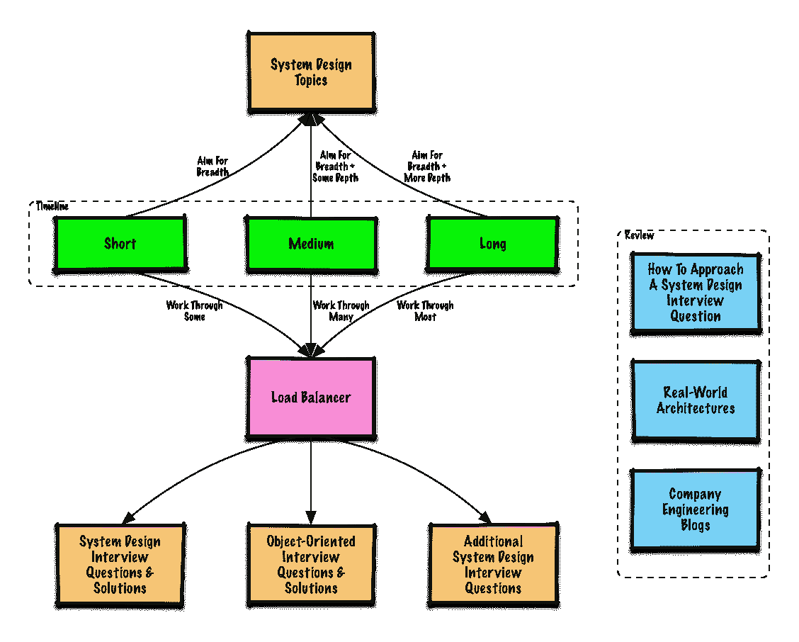

# 2023 年学习 Java 面向对象设计模式的 7 门最佳在线课程

> 原文：<https://medium.com/javarevisited/7-best-online-courses-to-learn-object-oriented-design-pattern-in-java-749b6399af59?source=collection_archive---------0----------------------->

## 每个程序员都应该学习设计模式来编写干净的代码，并成为更好的开发人员。

image_credit — [从 0 到 Java 中的设计模式— 24 种重要模式](https://click.linksynergy.com/fs-bin/click?id=JVFxdTr9V80&subid=0&offerid=323058.1&type=10&tmpid=14538&RD_PARM1=https%3A%2F%2Fwww.udemy.com%2Ffrom-0-to-1-design-patterns%2F)

H ello 伙计们，上周我已经分享了关于学习 Java 设计模式的 [**最佳书籍**](/javarevisited/7-best-books-to-learn-design-patterns-for-java-programmers-5627b93eefdb) ，今天，我们将谈论设计模式和一些学习 Java 设计模式的最佳在线课程。如果你想知道什么是设计模式，为什么 Java 开发人员应该学习它们？那我给你简单概述一下。

> 设计模式只不过是常见编程问题的一种经过试验和测试的解决方案，例如，创造性的设计模式处理对象创建的问题。

它们存在了很长一段时间，但是由著名的四人组 Erich Gamma、John Vlissides、Ralph Johnson 和 Richard Helm 在他们 1994 年的经典著作[Design Patterns:Elements of Reusable Object-Oriented Software](http://www.amazon.com/Design-Patterns-Object-Oriented-Professional-Computing/dp/0201634988?tag=javamysqlanta-20)中流行起来，也称为 g of 设计模式。这本书记录了 **24 种设计模式**，它们可以被重用来解决常见的编程问题。

原书是以 [C++](/@javinpaul/top-10-courses-to-learn-c-for-beginners-best-and-free-4afc262a544e) 和 Smalltalk 为例编写的，但从那以后，设计模式几乎被每一种编程语言采用，像 [Java](/javarevisited/top-5-java-online-courses-for-beginners-best-of-lot-1e1e240a758) 、 [C#](/javarevisited/9-free-c-c-sharp-courses-and-tutorials-for-beginners-and-intermediate-programmers-best-of-lot-dc8c793aab31) 、 [PHP](/javarevisited/top-10-free-courses-to-learn-php-and-mysql-for-web-development-e96e69982675) ，甚至像 [JavaScript](http://javarevisited.blogspot.sg/2017/02/top-5-javascript-books-to-learn-best-of-lot-must-read.html) 这种非严格面向对象的编程语言。设计模式的好处是不朽的，你会在许多框架、库和内置的 int eh 编程语言中发现它们。你可能每天都在使用它们，即使你没有意识到它们的存在。例如，JDK 使用了几个 GOF 设计模式，比如在 IO 类中使用 Decorator，在 Comparable 和 Comparator 中使用 Strategy 等等。

OOP 设计原则和 GOF 设计模式的知识对于 Java 开发者来说非常重要，因为这能让他们写出更好的代码。从面试的角度来看，这一点也很重要，面试官通常会用他们对设计模式的了解来评判有经验的 Java 开发人员。

# 学习 Java 面向对象设计模式的 7 门顶级课程

我最近分享了很多编程资源，例如关于 [Java](http://javarevisited.blogspot.sg/2017/11/top-5-free-java-courses-for-beginners.html#axzz4zuIICRs9) 、 [Python](http://www.java67.com/2018/02/5-free-python-online-courses-for-beginners.html) 、 [Git](http://javarevisited.blogspot.sg/2018/01/5-free-git-courses-for-programmers-to-learn-online.html) 、 [Eclipse](http://www.java67.com/2018/02/5-free-eclipse-and-junit-online-courses-java-developers.html) 和 [DevOps 工具](/hackernoon/the-2018-devops-roadmap-31588d8670cb)的免费书籍和课程，比如 [Jenkins](http://www.java67.com/2018/02/6-free-maven-and-jenkins-online-courses-for-java-developers.html) 和 [Maven](http://javarevisited.blogspot.sg/2016/08/top-10-maven-plugins-every-java-developer-know.html#axzz56wuF4csb) 。如果你是这里的新用户，你可以通过使用页面右上角的谷歌自定义搜索框快速搜索来找到它们。

今天，我将分享一些从零开始学习设计模式的最佳在线课程。这些课程不是免费的，但也不是很贵。你可以在 Udemy 的闪购中买到它们，价格仅为 10.99 美元，有时甚至更低，仅为 9.99 美元。

我已经在 Udemy 上一次特卖的[Node JS](http://javarevisited.blogspot.sg/2018/01/top-5-nodejs-and-express-js-online-courses-for-web-developers.html)[Spring](http://javarevisited.blogspot.sg/2016/12/top-5-spring-and-hibernate-training-courses-java-jee-programmers.html#axzz56WXxxAC0)[Kotlin](http://javarevisited.blogspot.sg/2018/02/5-courses-to-learn-kotlin-programming-java-android.html#axzz56R4AatoQ)[devo PS](http://www.java67.com/2018/02/5-free-docker-courses-for-java-and-DevOps-engineers.html)[BigData](http://javarevisited.blogspot.sg/2017/12/top-5-courses-to-learn-big-data-and.html)[Java 9](http://javarevisited.blogspot.sg/2018/02/top-5-java-9-courses-to-learn-online.html#axzz56u14w2sC)[Android](http://javarevisited.blogspot.sg/2017/12/top-5-android-online-training-courses-for-Java-developers.html#axzz55vFINezf)上买了 50 多门课程。大多数课程不仅会向你解释这些设计模式是如何工作的，它们解决了什么问题，还会告诉你如何在现实世界中使用它们。

例如，我非常喜欢在保罗·迪琼的 [Java 设计模式大师班](https://click.linksynergy.com/fs-bin/click?id=JVFxdTr9V80&subid=0&offerid=323058.1&type=10&tmpid=14538&RD_PARM1=https%3A%2F%2Fwww.udemy.com%2Fjava-design-patterns-the-complete-masterclass%2F)课程中使用策略模式设计支付系统的例子。

一些课程还解释了基本的 OOP 设计原则，这些原则是设计模式的基本组成部分，如[固体原则](https://dev.to/javinpaul/top-10-object-oriented-design-principles-for-writing-clean-code-4pe1)，如单一责任原则、开闭设计原则、Liskov 替换、控制反转和依赖注入等。除了这些，它们还涵盖了一些不太流行但仍然有用的原则，比如德米特定律和授权原则。

## [**1。Java 设计模式**](https://click.linksynergy.com/fs-bin/click?id=JVFxdTr9V80&subid=0&offerid=323058.1&type=10&tmpid=14538&RD_PARM1=https%3A%2F%2Fwww.udemy.com%2Fdesign-patterns-java%2F)

这是学习 Java 设计模式最好的课程之一。它不仅涵盖了 GOF 模式，如[命令](http://javarevisited.blogspot.sg/2016/05/command-design-pattern-in-java-example-code.html#axzz56wuF4csb)、[装饰器](http://javarevisited.blogspot.sg/2011/11/decorator-design-pattern-java-example.html)、[适配器](http://javarevisited.blogspot.sg/2016/08/adapter-design-pattern-in-java-example.html)、[策略](http://javarevisited.blogspot.sg/2014/04/difference-between-state-and-strategy-design-pattern-java.html)、[代理](http://javarevisited.blogspot.sg/2015/01/adapter-vs-decorator-vs-facade-vs-proxy-pattern-java.html)、责任链、解释器端，还涵盖了构成设计模式基础的著名的固体设计原则。

这也是一门实践性很强的课程，作者将向您展示如何在 [IntelliJ IDEA](/javarevisited/7-best-courses-to-learn-intellij-idea-for-beginners-and-experienced-java-programmers-2e9aa9bb0c05) 上实现特定的设计模式。大多数演示也是一个单独的文件，所以你也可以下载课程附带的文件，并在 Intelli IDEA、Eclipse、NetBeans 或你选择的其他 IDE 中运行它。

总的来说，这是一个完整的课程，学习所有 24 个 GOF 模式和坚实的设计原则，以编写更好的代码。

**这里是加入本课程的链接—**[Java 中的设计模式](https://click.linksynergy.com/fs-bin/click?id=JVFxdTr9V80&subid=0&offerid=323058.1&type=10&tmpid=14538&RD_PARM1=https%3A%2F%2Fwww.udemy.com%2Fdesign-patterns-java%2F)

## 2.[Coursera 上王信明的设计模式](https://click.linksynergy.com/deeplink?id=JVFxdTr9V80&mid=40328&murl=https%3A%2F%2Fwww.coursera.org%2Flearn%2Fdesign-patterns)

这是一个在 Coursera 上学习设计模式的非常棒的在线课程。它由阿尔伯塔大学提供，由 Coursera 的专家培训师之一王信明教授。

本课程将教你如何通过结合设计模式来扩展面向对象的分析和设计，以创建健壮的、可扩展的应用程序，这些应用程序能够经受生产时间的考验。

本课程是 Coursera 上 [**软件设计和架构专业化**](https://click.linksynergy.com/deeplink?id=JVFxdTr9V80&mid=40328&murl=https%3A%2F%2Fwww.coursera.org%2Fspecializations%2Fsoftware-design-architecture) 的一部分，Coursera 提供了一系列教授软件架构和设计的课程。

您还将了解已建立的设计模式，如何以及何时使用它们来解决常见问题，这些问题是用 Java 和其他面向对象编程语言(如 JavaScript、C++或 Python)设计复杂软件应用程序的关键。

最后，您将开发代码意识，通过引用代码气味目录来识别有问题的软件设计。

本课程最精彩的部分是顶点项目，在这个项目中，你将重新设计一个现有的基于 Java 的 Android 应用程序，以实现设计模式的组合。您还将检查给定的 Java 代码库的代码味道。

所有这些都使得这门课程对于想在 2023 年建立自己的编码、设计和软件技能的 Java 开发人员来说非常有趣。我向中级和有经验的 Java 开发人员强烈推荐这门课程

**这里是加入王信明设计模式** — [课程的链接](https://click.linksynergy.com/deeplink?id=JVFxdTr9V80&mid=40328&murl=https%3A%2F%2Fwww.coursera.org%2Flearn%2Fdesign-patterns)

顺便说一下，除了单独加入这些课程和专业，你还可以加入 [**Coursera Plus**](https://click.linksynergy.com/deeplink?id=JVFxdTr9V80&mid=40328&murl=https%3A%2F%2Fwww.coursera.org%2Fcourseraplus) ，这是 Coursera 的一个订阅计划，让你可以无限制地访问他们最受欢迎的课程、专业、专业证书和指导项目。

 [## Coursera Plus |无限制访问 7，000 多门在线课程

### 用 Coursera Plus 投资你的职业目标。无限制地访问 90%以上的课程、指导项目…

coursera.com](https://click.linksynergy.com/deeplink?id=JVFxdTr9V80&mid=40328&murl=https%3A%2F%2Fwww.coursera.org%2Fcourseraplus) 

## 3.[软件设计模式:软件开发人员的最佳实践](https://www.educative.io/courses/software-design-patterns-best-practices?affiliate_id=5073518643380224)

这是在[教育性](https://www.educative.io?affiliate_id=5073518643380224)上学习软件设计模式的交互式编码课程。本课程将教你如何使用设计模式来编写更好的代码。

该课程涵盖了所有三种类型的设计模式，如创造模式、结构模式和行为模式。最好的事情是，您可以在浏览器中使用这些设计模式来测试代码。

如果你想掌握所有的 GOF 设计模式，并希望看到这些模式的使用代码，以及它们如何产生影响，那么这是你的完美课程。

**这是加入本课程的链接** : [软件设计模式:软件开发人员的最佳实践](https://www.educative.io/courses/software-design-patterns-best-practices?affiliate_id=5073518643380224)

此外，如果你觉得教育平台和他们的互动课程很有用，那么你还可以获得 [**教育订阅**](https://www.educative.io/subscription?affiliate_id=5073518643380224) ，每月只需 14.9 美元，不仅可以访问这门课程，还可以访问他们的 210 多门课程。它非常划算，非常适合获得一些实践学习经验。

 [## 教育无限:保持领先

### 我们听到了您的反馈。你现在只需支付一次费用，就可以获得 Educative 上的所有课程。

www.educative.io](https://www.educative.io/subscription?affiliate_id=5073518643380224) 

## 4.[体验 Java 中的设计模式](https://click.linksynergy.com/fs-bin/click?id=JVFxdTr9V80&subid=0&offerid=323058.1&type=10&tmpid=14538&RD_PARM1=https%3A%2F%2Fwww.udemy.com%2Fexperience-design-patterns%2F)

这是学习 Java 设计模式的另一个很棒的课程。它将教你如何通过理解常见问题和应用设计模式来获得更好的解决方案，从而写出更好的软件。

本课程将从经典的[四人组](http://www.amazon.com/Design-Patterns-Object-Oriented-Professional-Computing/dp/0201634988?tag=javamysqlanta-20)的《设计模式》一书中教你 20 多个设计模式，该书被认为是这方面的圣经。

对于每种模式，都给出了一个清晰的例子来理解该模式将要解决的问题，以及它的优缺点。您将能够实际理解该模式如何与详细的 Java 课程一起工作。完成本课程后，你应该能够识别代码中的常见问题，应用正确的设计模式，并实现一个更好的面向对象的解决方案，该解决方案更易于维护和阅读。

**这里是加入本课程的链接—** [体验 Java 中的设计模式](https://click.linksynergy.com/fs-bin/click?id=JVFxdTr9V80&subid=0&offerid=323058.1&type=10&tmpid=14538&RD_PARM1=https%3A%2F%2Fwww.udemy.com%2Fexperience-design-patterns%2F)

## [**5。Java 中的软件架构基础&设计模式**](https://click.linksynergy.com/fs-bin/click?id=JVFxdTr9V80&subid=0&offerid=323058.1&type=10&tmpid=14538&RD_PARM1=https%3A%2F%2Fwww.udemy.com%2Fbasics-of-software-architecture-design-in-java%2F)

本课程指导你用坚实的原理和设计模式用 Java 创建智能的、可重用的软件。

课程分为两部分，在第一部分，作者讲述了[稳固设计原则](/javarevisited/10-oop-design-principles-you-can-learn-in-2020-f7370cccdd31)如单一责任、[开-闭](http://javarevisited.blogspot.sg/2015/07/strategy-design-pattern-and-open-closed-principle-java-example.html)、Liskov 替换等，以及它们如何帮助你写出更好的代码。在第二部分，他谈到了设计模式以及它们如何解决常见问题。为了使用设计模式，你应该能够识别问题并理解哪种模式可以帮助你，这也是本课程擅长的地方。

简而言之，这是一门很好的课程，涵盖了软件设计、架构和 Java 设计模式的基础知识，有助于编写更好的代码。

**这里是加入本课程的链接—** [软件架构基础&Java 中的设计模式](https://click.linksynergy.com/fs-bin/click?id=JVFxdTr9V80&subid=0&offerid=323058.1&type=10&tmpid=14538&RD_PARM1=https%3A%2F%2Fwww.udemy.com%2Fbasics-of-software-architecture-design-in-java%2F)

## [**6。Java 设计模式—完整的大师级**](https://click.linksynergy.com/fs-bin/click?id=JVFxdTr9V80&subid=0&offerid=323058.1&type=10&tmpid=14538&RD_PARM1=https%3A%2F%2Fwww.udemy.com%2Fjava-design-patterns-the-complete-masterclass%2F)

这是 Paulo Dichone 的一门相当新的课程，他写了几本最畅销的 Java 和 Android 课程，如 [Java Masterclass 初学者到专家指南](https://click.linksynergy.com/deeplink?id=JVFxdTr9V80&mid=39197&murl=https%3A%2F%2Fwww.udemy.com%2Fcourse%2Fthe-complete-java-9-masterclass-beginner-to-expert%2F)，我最近浏览了一下，以了解 Java 的新特性。

在这个课程中，他探讨了 GOF 设计模式的主题，他很好地解释了每个模式是如何工作的，以及如何在你的代码中使用它们。

他的例子来自现实世界，非常贴切，有助于概念的把握。例如，使用[策略模式](http://javarevisited.blogspot.sg/2014/11/strategy-design-pattern-in-java-using-Enum-Example.html)来实现支付处理引擎是一个好主意，因为你需要处理不同形式的支付，比如现金、信用卡、优惠券、比特币，或者其他。

简而言之，这是一门非常棒的课程，面向有经验的 Java 开发人员和任何想学习 GOF 设计模式的人，如访问者、适配器、装饰者等。

**这里是加入本课程的链接—** [Java 设计模式—完全大师班](https://click.linksynergy.com/fs-bin/click?id=JVFxdTr9V80&subid=0&offerid=323058.1&type=10&tmpid=14538&RD_PARM1=https%3A%2F%2Fwww.udemy.com%2Fjava-design-patterns-the-complete-masterclass%2F)

## [**7。从 0 到 Java 中的设计模式——24 种重要模式**](https://click.linksynergy.com/fs-bin/click?id=JVFxdTr9V80&subid=0&offerid=323058.1&type=10&tmpid=14538&RD_PARM1=https%3A%2F%2Fwww.udemy.com%2Ffrom-0-to-1-design-patterns%2F)

这是从著名的 GOF 书中学习 24 种面向对象设计模式的又一门综合课程。

授课老师知识面很广，有谷歌和投行工作经验。他们明白设计模式乍看之下并不是无足轻重的，并努力以一种容易理解的方式将事情分解。像前两个课程一样，这个课程也涵盖了 OOP 设计原则和设计模式。

简而言之，从 Java 设计模式开始学习所有 24 种模式以编写更好的代码的伟大课程。

**这是加入本课程的链接—** [从 0 到 Java 中的设计模式— 24 个关键点](https://click.linksynergy.com/fs-bin/click?id=JVFxdTr9V80&subid=0&offerid=323058.1&type=10&tmpid=14538&RD_PARM1=https%3A%2F%2Fwww.udemy.com%2Ffrom-0-to-1-design-patterns%2F)

## 8.[钻研面向对象设计面试](https://www.educative.io/collection/5668639101419520/5692201761767424?affiliate_id=5073518643380224)

虽然本课程与设计模式没有直接关系，但面向对象的基础知识和设计是理解和在代码中使用设计模式的关键。

面向对象的设计一直是软件工程面试过程中的一个关键部分，许多程序员都在努力回答这些问题。

即使是在构建这种系统方面有一定经验的工程师也不喜欢这些面试。这主要是因为没有标准答案的设计问题的开放性。这门课程是掌握[面向对象设计](/swlh/5-free-object-oriented-programming-online-courses-for-programmers-156afd0a3a73)的完整指南。

本课程由谷歌、脸书、微软和亚马逊的招聘经理设计。它不仅有一套精心挑选的案例研究，这些案例在顶级科技公司被反复询问，而且还提供了处理不同面向对象设计场景的全面体验。

如果你正在准备一个编码面试或者只是想掌握 OOAD，这个课程是一个很好的起点。

**这里是加入本课程的链接** : [参加面向对象设计面试](https://www.educative.io/collection/5668639101419520/5692201761767424?affiliate_id=5073518643380224)

以上是关于学习 Java 设计模式的一些最好的在线培训课程。这些课程是提高你对面向对象设计和久经考验的 g of 模式的理解的好方法。完成这些课程后，你就知道这些模式意味着什么，以及什么时候可以使用它们来创建更好的代码。这也有助于你向你的团队和同事传达你的想法。

其他 **Java 和编程资源**你可能喜欢的
[5 门免费为 Java 开发者提供的 Spring 框架课程](http://www.java67.com/2017/11/top-5-free-core-spring-mvc-courses-learn-online.html)
[5 门免费学习 Linux 中 Shell 脚本的课程](http://javarevisited.blogspot.sg/2018/02/5-courses-to-learn-shell-scripting-in-linux.html)
[5 门免费学习核心 Java 的在线课程](http://javarevisited.blogspot.sg/2017/11/top-5-free-java-courses-for-beginners.html#axzz4zuIICRs9)
[5 门免费学习 Angular 的在线培训课程](http://www.java67.com/2018/01/top-5-free-angular-js-online-courses-for-web-developers.html)
[5 门免费学习数据结构和算法的课程](http://javarevisited.blogspot.sg/2018/01/top-5-free-data-structure-and-algorithm-courses-java--c-programmers.html#axzz55lOcYrUM)
[10 本书和课程学习 Angular in](/javarevisited/top-10-angular-books-and-courses-for-beginners-and-experienced-web-developers-best-of-lot-9a2dae87f04c)
[Java 开发者 10 门高级 Spring Boot 课程](/javarevisited/10-advanced-spring-boot-courses-for-experienced-java-developers-5e57606816bd)
[2023 年 10 门免费课程学习 Spring Boot](/javarevisited/10-free-spring-boot-tutorials-and-courses-for-java-developers-53dfe084587e)
[7 门课程学习 Java 中的微服务与 Spring Boot](/javarevisited/top-5-courses-to-learn-microservices-in-java-and-spring-framework-e9fed1ba804d)
[我最喜欢的课程学习 Spring Boot](/javarevisited/top-10-courses-to-learn-spring-boot-in-2020-best-of-lot-6ffce88a1b6e)
[我最喜欢的免费 JavaScript 教程初学者](/javarevisited/my-favorite-free-tutorials-and-courses-to-learn-javascript-8f4d0a71faf2)
[7 门最好的课程学习网页设计与开发](/javarevisited/7-free-online-courses-to-become-a-web-designer-and-frontend-developer-in-2020-dca73bc7fdc4)
[7](/javarevisited/7-free-courses-to-learn-bootstrap-for-web-designers-and-developers-5135215648f1) [2023 年学习人工智能的 7 门最佳课程](/javarevisited/7-best-courses-to-learn-artificial-intelligence-in-2020-26d59d62f6fe)
[面向 Java 程序员的 25 道软件设计面试题](/javarevisited/25-software-design-interview-questions-to-crack-any-programming-and-technical-interviews-4b8237942db0)

感谢您阅读本文。如果你喜欢这些 Java 设计模式课程，请与你的朋友和同事分享。如果您有任何问题或反馈，请留言。

**p . s .**——如果你对提升你的设计模式技能感兴趣，但正在寻找免费的在线培训课程，那么你也可以在 Udemy 上查看 [**Java 设计模式和架构**](http://bit.ly/java-design-patterns-tutorial) 课程。这是完全免费的，你只需要一个 Udemy 帐户就可以注册这门课程。

 [## 免费 Java 教程——Java 设计模式和架构

### 在作为软件开发人员和承包商为包括 CSC 在内的许多公司工作了 14 年后…

bit.ly](http://bit.ly/java-design-patterns-tutorial) 

**P. P. S —** 快速更新，[**Pluralsight 免费周末 2023**](https://pluralsight.pxf.io/c/1193463/871467/7490) 就在这里，你可以在这个周末免费访问所有 7000+ Pluralsight 课程和项目。好好利用这一点，学习一项新技能或提升现有技能。不要错过这个，这只是这个周末。这又是一个链接:

 [## Pluralsight |免费周末

### 注册以获得免费周末开始时的通知，这样你就不会错过了。免费周末从 8 月 14 日星期五上午 9 点开始…

pluralsight.pxf.io](https://pluralsight.pxf.io/c/1193463/871467/7490)