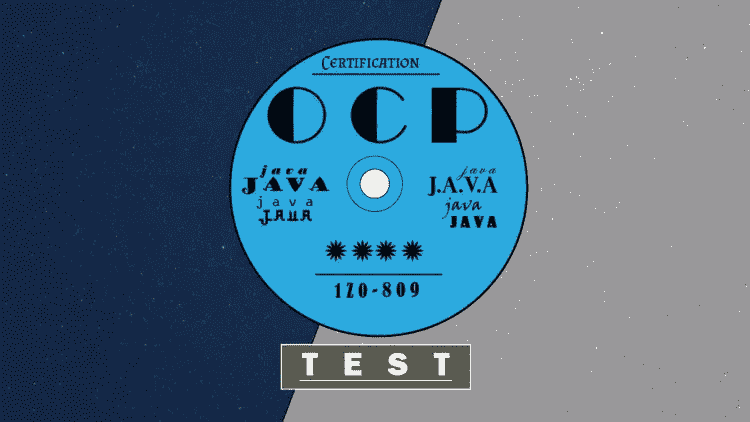
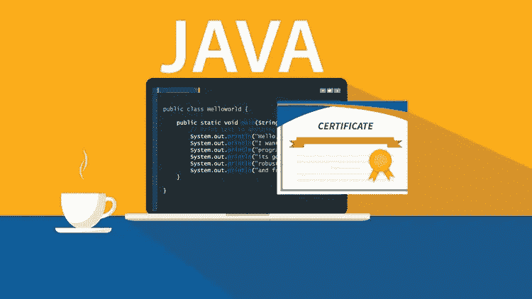
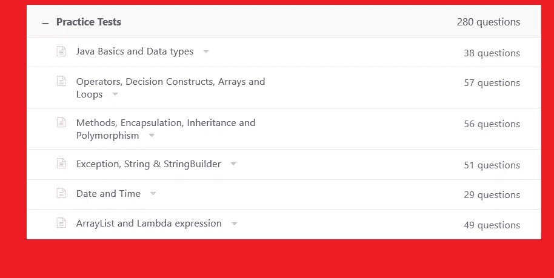

# 2023 年破解甲骨文 OCAJP 8 和 OCPJP 8 考试的 7 门最佳 Java SE 8 认证课程

> 原文：<https://medium.com/javarevisited/7-best-online-courses-to-prepare-for-oracles-java-se-8-certification-ocajp-8-and-ocpjp-8-2fd0d6779a9e?source=collection_archive---------0----------------------->

## 通过在线课程和练习测试的链接，可以更好地准备模拟考试。

如果您正在准备 Oracle Certified Java SE 8 Associate 考试，也称为 [OCAJP 8](http://javarevisited.blogspot.sg/2017/07/ocajp-8-faq-oracle-certified-associate-certification-1z0-808-exam.html) 和 [OCPJP 8](http://javarevisited.blogspot.sg/2017/05/which-java-8-certification-should-you-take-1Z0-808-809-810-813-OCAJP-OCPJP.html) ，考试代码为 1z 0–808，并且正在寻找一个不错的在线课程来开始您的准备工作，那么您来对地方了。

在这篇文章中，我将分享一些为 Java SE 8 认证做准备的**最佳在线课程。Btw，首先，配置要做出正确的决定。如果你是一名 Java 开发人员，那么对你的技能进行认证不仅会使你从数百万其他未经认证的 Java 程序员中脱颖而出，还会提高你对 Java SE 8 的知识和理解。**

如果你正在找工作，那么这可以帮助你得到一份更好的工作，如果你正在寻找职业发展，比如成为一名高级 Java 开发人员，这些认证可以帮助你获得晋升。

**Oracle Certified Associate 考试(所有 Oracle 认证都需要的)可能很难通过，即使对于经验丰富的 Java 开发人员来说也是如此。**

我见过许多有 2 到 4 年 Java 经验的 Java 开发人员在没有准备的情况下参加考试，回来时要么分数很低，要么最差，只是没有通过考试。

原因之一是考试的知识层次相当深。它专注于许多 Java 开发人员不知道的细节，即使他们已经用 Java 工作了很多年。这就是为什么准备是非常重要的。有人说得对，**“不准备就是准备失败”**。

所以你应该花些时间去了解准备 Java 认证的最佳方式。正确的准备不仅能帮助你通过考试，还能让你在求职或晋升讨论中获得超过 90%的优势。

我为准备 [OCAJP](http://javarevisited.blogspot.sg/2017/01/difference-between-ocpjp-8-upgrade-exams-1Z0-813-1Z0-810.html) 和 [OCPJP](http://javarevisited.blogspot.sg/2016/11/top-5-java-8-practice-test-and-exam-simulators-best-OCAJP-OCAPJP.html) 的 Java 开发人员分享了我的经验、建议和资源，如书籍、免费考试、模拟器和回答问题。您也可以在这里搜索，找到更多关于这些认证的资源和常见问题。

# OCAJP 8 和 OCPJP 8 的 7 大 Java 认证课程

话不多说，下面是我列出的一些最好的在线 Java 认证课程，你可以开始准备了。

由于 OCAJP 和 OCPJP 都要求对考试主题有深刻的理解，所以从培训课程开始，然后通过马拉·古普塔的 [OCA Java SE 8 程序员 I 认证指南](https://www.amazon.com/OCA-Java-Programmer-Certification-Guide/dp/1617293253?tag=javamysqlanta-20)这样的认证指南进行跟进是一个好主意。

通过这种方式，您不仅可以学得更好，还可以更好地记忆，因为考试认证指南以与真实考试相同的格式呈现问题。

## 1.[完整的 Java Masterclass](https://click.linksynergy.com/fs-bin/click?id=JVFxdTr9V80&subid=0&offerid=323058.1&type=10&tmpid=14538&RD_PARM1=https%3A%2F%2Fwww.udemy.com%2Fjava-the-complete-java-developer-course%2F)

一般来说，这是学习 Java 的最佳课程，但它也能帮助你准备 OCAJP 8 的主题。我向任何正在学习 Java 并希望通过 1z 0–808 认证考试的人推荐这个在线课程。本培训课程不仅与 OCAJP 主题相关，而且你需要在修改这些主题之前了解 Java，这也是本课程的优势所在。

学完这门课程后，你对 Java 有了一个不错的了解，你可以通过阅读像[这本](https://javarevisited.blogspot.com/2017/08/java-se-8-certification-books-ocajp8-ocpjp8.html)这样的 OCAJP 认证指南来填补你的知识和考试题目之间的空白。

**这里是加入本课程** — [完整 Java 大师班](https://click.linksynergy.com/fs-bin/click?id=JVFxdTr9V80&subid=0&offerid=323058.1&type=10&tmpid=14538&RD_PARM1=https%3A%2F%2Fwww.udemy.com%2Fjava-the-complete-java-developer-course%2F)的链接

## 2.[完整的 Java SE 8 开发者训练营—包括 OCA 准备](https://click.linksynergy.com/fs-bin/click?id=JVFxdTr9V80&subid=0&offerid=323058.1&type=10&tmpid=14538&RD_PARM1=https%3A%2F%2Fwww.udemy.com%2Flearn-java-se-8-and-prepare-for-the-java-associate-exam%2F)

这是一个理想的在线培训课程，适合正在学习 Java SE 8 并希望成为认证开发人员的初学者，例如希望开始软件开发职业生涯的应届毕业生，或者希望通过学习 Java 的基本知识来提高其市场竞争力的开发人员

本课程以训练营的方式教授您 [Java SE 8](/javarevisited/my-favorite-books-and-courses-to-pass-java-se-8-certification-ocajp-8-and-ocpjp-8-b657a195aa07) ，重点是实践知识。

在此过程中，您将对考试中涵盖的主题有一个扎实的理解，从而成为甲骨文认证助理 Java SE 8 程序员(Java SE 8 程序员 I 1z 0–808)

**以下是参加本课程的链接** — [完整的 Java SE 8 开发者训练营—包括 OCA 预备课程](https://click.linksynergy.com/fs-bin/click?id=JVFxdTr9V80&subid=0&offerid=323058.1&type=10&tmpid=14538&RD_PARM1=https%3A%2F%2Fwww.udemy.com%2Flearn-java-se-8-and-prepare-for-the-java-associate-exam%2F)

## 3. [Oracle Java 认证—通过助理 1z 0–808 考试！](https://click.linksynergy.com/fs-bin/click?id=JVFxdTr9V80&subid=0&offerid=323058.1&type=10&tmpid=14538&RD_PARM1=https%3A%2F%2Fwww.udemy.com%2Foracle-java-associate-certification-exam-course-1z0-808%2F)

这是为准备 OCAJP 8 考试的 Java 开发人员准备的另一个很好的在线课程。

它将教会你成为 Oracle 认证 Java 8 程序员所需要知道的一切。讲师 Goran Lochert 是一名认证的 Java 开发人员和专家，拥有多年的 Java 编程经验。戈兰直接知道通过考试需要什么，因为他自己做过。他将带您一步一步地了解您需要掌握的每一个主题，以便能够通过考试并获得 Oracle 官方认证。

**这里是参加本课程的链接** — [甲骨文 Java 认证—通过 1z 0–808 准会员考试！](https://click.linksynergy.com/fs-bin/click?id=JVFxdTr9V80&subid=0&offerid=323058.1&type=10&tmpid=14538&RD_PARM1=https%3A%2F%2Fwww.udemy.com%2Foracle-java-associate-certification-exam-course-1z0-808%2F)

## 4.[甲骨文 Java 认证:破解 OCA 1z 0–808 的最短途径](https://click.linksynergy.com/deeplink?id=JVFxdTr9V80&mid=39197&murl=https%3A%2F%2Fwww.udemy.com%2Fcourse%2Foracle-java-certification-shortest-way-to-crack-oca-1z0-808%2F)

如果你是一个想学习 Java 的初学者，或者是一个有经验的程序员，正在寻找一个在线培训课程来准备甲骨文的 Java 认证，如 [OCAJP 8](/javarevisited/top-7-practice-tests-and-mock-exams-to-prepare-for-oracles-java-certifications-ocajp-and-ocpjp-36502d4ca061) 或[1z 0–808](https://www.freecodecamp.org/news/how-to-pass-oracles-java-certifications-a-practical-guide-for-developers-e9b607ba6173/)考试，那么这是一个适合你的课程。

本课程还涵盖了所有考试主题，学完本课程后，学生将能够通过 [Oracle 认证助理、Java SE 8 程序员](/javarevisited/java-certifications-how-to-crack-it-practical-tips-to-prepare-ocajp-and-ocpjp-exams-538f6fe36b37)(1z 0–808)考试。

它还包括针对 Java SE 8 程序员 I 考试的主题式测试和清晰的解释

**以下是参加本课程的链接** — [甲骨文 Java 认证:破解 OCA 1z 0–808 的最短途径](https://click.linksynergy.com/deeplink?id=JVFxdTr9V80&mid=39197&murl=https%3A%2F%2Fwww.udemy.com%2Fcourse%2Foracle-java-certification-shortest-way-to-crack-oca-1z0-808%2F)

## 5. [Java 认证:OCA(1z 0–808)模拟测试](https://click.linksynergy.com/fs-bin/click?id=JVFxdTr9V80&subid=0&offerid=323058.1&type=10&tmpid=14538&RD_PARM1=https%3A%2F%2Fwww.udemy.com%2Fjava-oca%2F)

该在线课程涵盖了所有 OCAJP 8 主题，还包含由 260 多道选择题组成的模拟测试，用于评估 Oracle Certified Associate，Java SE 8 程序员 I 准备。

这些是精心挑选的问题，模拟实际的认证考试，有时间限制，有助于您为主要的考试环境做好准备。

以下是加入本课程的链接— [Java 认证:OCA(1z 0–808)模拟考试](https://click.linksynergy.com/fs-bin/click?id=JVFxdTr9V80&subid=0&offerid=323058.1&type=10&tmpid=14538&RD_PARM1=https%3A%2F%2Fwww.udemy.com%2Fjava-oca%2F)

## 6. [Java 认证—OCA(1z 0–808)主题式测试【2023】](https://click.linksynergy.com/deeplink?id=JVFxdTr9V80&mid=39197&murl=https%3A%2F%2Fwww.udemy.com%2Fcourse%2Fjava-ocajp%2F)

这是为 OCAJP 8 或 Java SE 8 程序员 1 认证做准备的另一个模拟测试。本模拟测试的独特之处在于它提供了针对主题的问题。

您可以将本模拟测试暨在线课程与之前的测试一起使用，以便更好地准备考试。问题具有挑战性，符合考试主题和难度。

我建议你只有在能够轻松解决主题明智的问题，并且在之前的课程中获得 80+的全程模拟考试分数时，才能参加真正的考试。

本模拟考试包含 280 个独特的问题，涵盖了官方考试指南中提到的所有考试主题。

**以下是参加本课程的链接** — [Java 认证—OCA(1z 0–808)主题式考试【2023】](https://click.linksynergy.com/deeplink?id=JVFxdTr9V80&mid=39197&murl=https%3A%2F%2Fwww.udemy.com%2Fcourse%2Fjava-ocajp%2F)

## 7. [Java 认证:OCP(1z 0–809)考试模拟【2023】](https://click.linksynergy.com/deeplink?id=JVFxdTr9V80&mid=39197&murl=https%3A%2F%2Fwww.udemy.com%2Fcourse%2Fjava-ocp%2F)

这是@Udyan Khatri 通过 OCPJP 8 或 1z 0–809 考试的另一个很好的模拟测试。这比 OCAJP 8 或 1z 0–808 更难，但在这些模拟测试的帮助下，你可以准备得更好。

这个模拟测试对你的准备是必不可少的，因为你可以在真正考试之前用它来评估你的速度和准确性。你也可以找到自己的强项和弱项，并努力改进。

本模拟测试包含 540 个独特的问题，分为 6 个模拟测试，每个测试包含 90 个问题。超过 5000 名学生在 Udemy 上选修了这门课程，为他们的 OCP 考试做准备，这充分说明了这门课程的实用性。

**这里是加入本课程的链接**——[Java 认证:OCP(1z 0–809)考试模拟【2023】](https://click.linksynergy.com/deeplink?id=JVFxdTr9V80&mid=39197&murl=https%3A%2F%2Fwww.udemy.com%2Fcourse%2Fjava-ocp%2F)

以上是为甲骨文 Java 助理和专业认证准备的一些**最佳在线课程。如果您已经注册了 1z 0–808 或 1z 0–809 考试，那么您可以参加这些课程，开始您的认证之旅。如果你正在寻找更多有用的资源，如书籍和考试模拟器，那么你可以看看我下面的文章。

其他 **Java 认证文章**你可能喜欢
[前 5 名免费 OCAJP 和 OCPJP 8 门模拟考试](http://javarevisited.blogspot.sg/2015/11/5-free-ocajp8-ocpjp8-mock-exams-and-practice-questions.html)
[如何破解 2023 年 Java SE 11 认证](https://javarevisited.blogspot.com/2019/12/how-to-crack-java-se-11-certification.html)
[面向开发者的前 10 名 Java SE 8 考试模拟器](http://www.java67.com/2017/03/top-10-ocajp-and-ocpjp-exam-simulators.html)
[如何通过 2023 年 Java SE 11 认证](https://javarevisited.blogspot.com/2019/12/how-to-crack-java-se-11-certification.html)
[前 5 名 OCAJP 8 本面向 Java 程序员的书](http://javarevisited.blogspot.sg/2016/10/best-books-for-ocajp8-exam-1z0-808-java8.html)
[顶](http://www.java67.com/2017/05/top-5-books-for-ocajp8-and-ocpjp8-Java-8-certification-exam.html) [如何破解甲骨文 2023 年 Java 认证](/javarevisited/java-certifications-how-to-crack-it-practical-tips-to-prepare-ocajp-and-ocpjp-exams-538f6fe36b37)
[做好 Java 认证的 5 个小技巧](http://javarevisited.blogspot.sg/2016/12/5-tips-to-prepare-for-oracle-java-certifications-OCAJP-OCPJP-exams.html#axzz54xsZZYgH)
[Top 5 书籍和课程破解 OCAJP 11 认证](https://javarevisited.blogspot.com/2019/10/top-5-books-courses-to-crack-oracles-java-se-11-certification-OCAJP11.html)
[OCAJP 和 OCPJP 考试的区别](http://www.java67.com/2017/10/difference-between-ocajp-and-ocpjp-certification-exam.html)？
[Whizlabs 还是 Enthuware？哪个考试模拟器对 OCAJP 比较好？](http://javarevisited.blogspot.sg/2017/07/entuware-or-whizlabs-which-exam-simulator-best-for-java-certification.html)

感谢阅读本文。如果您发现这些 Java 认证在线培训课程很有用，请与您的朋友和同事分享。如果您有任何问题或疑问，请留言。**

**P.S.** — Whizlabs 现在在 OCAJP8 上也有一个 [**的培训课程，如果你是 Whizlabs 考试模拟器的粉丝，那么你也应该结合他们的考试模拟器来获得最好的成绩。**](http://shareasale.com/r.cfm?b=1130601&u=880419&m=43514&urllink=&afftrack=)

 [## Oracle Java SE 8 认证- OCAJP 预备课程

### 课程评级是根据单个学生的评级和各种其他信号计算的，如评级年龄和…

udemy.com](https://click.linksynergy.com/deeplink?id=JVFxdTr9V80&mid=39197&murl=https%3A%2F%2Fwww.udemy.com%2Fcourse%2Fwhizlabs_ocajp8%2F) 

**P. S. S.** —如果您正在准备 Java SE 11 认证，并且正在寻找一个在线课程来做好准备，那么我强烈推荐 [**Oracle Java 认证—通过由 Tim Buchalaka 及其团队在 Udemy 上开设的 Java 11 SE 1z 0–815 考试**](https://click.linksynergy.com/deeplink?id=JVFxdTr9V80&mid=39197&murl=https%3A%2F%2Fwww.udemy.com%2Fcourse%2Foracle-java-11-programmer-exam-1z0815%2F) 课程。这是一个很好的课程，准备所有的主题，包括从考试角度来看很难但非常重要的模块。

 [## Oracle Java 认证-通过 Java 11 SE 1Z0-815 考试

### 结果出来了！真正的学生，就像您一样，正在利用本课程通过 Oracle Java 认证考试。这里…

udemy.com](https://click.linksynergy.com/deeplink?id=JVFxdTr9V80&mid=39197&murl=https%3A%2F%2Fwww.udemy.com%2Fcourse%2Foracle-java-11-programmer-exam-1z0815%2F)