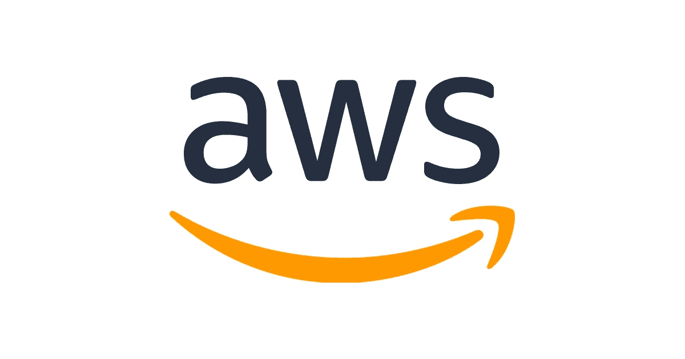
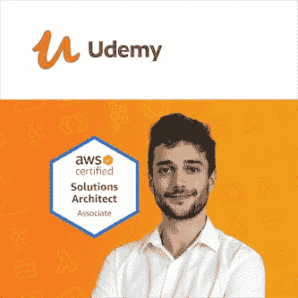
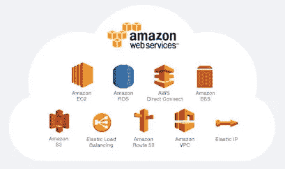
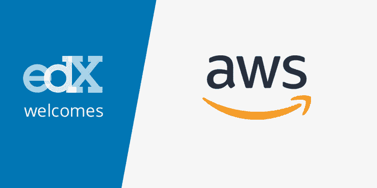
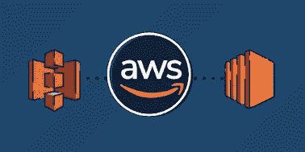

# 2023 年学习 AWS[亚马逊网络服务]云计算的 7 个最佳地点

> 原文：<https://medium.com/javarevisited/7-best-places-to-learn-aws-amazon-web-services-bdcf8dab3c0e?source=collection_archive---------0----------------------->

## 我最喜欢的学习亚马逊网络服务或 AWS 的网站和平台

你好，伙计们，如果你想学习 AWS 并寻找 AWS 学习材料的最佳网站平台，那么你来对地方了。之前我已经分享了 [**最好的 AWS 课程**](https://www.java67.com/2018/05/top-5-amazon-web-services-or-aws-courses-to-learn-online.html) 和通过各种 [**AWS 认证的指南**](https://www.java67.com/2020/09/top-10-cloud-certification-you-can-aim.html) 今天我要分享的是在线学习 AWS 的最好平台。

亚马逊 AWS 是亚马逊在云上提供的一系列服务，通过提供一些服务来开发和部署您的应用程序，如 EC2 服务，以及将数据存储在此数据库中，如 S3 服务，来帮助您增强您的业务和您的 web 应用程序，您可以在一个仪表板中处理您的应用程序的整个基础架构，这是 AWS CloudFormation 服务等等。

亚马逊网络服务(简称 AWS)将只对你使用的存储和电源(如 CPUs Ram 带宽等)收费。当您创建一个帐户时，您将选择一个实例来授权主机并运行您的应用程序，它只是一台大型计算机中的一台小型计算机，您可以根据您的需要以一定的价格购买。

在简单介绍了 [Amazon AWS](/javarevisited/5-best-aws-courses-for-beginners-and-experienced-developers-to-learn-in-2021-563212409fbd) 之后，你现在可能想要了解更多关于这项服务的信息，或者如果你已经有了一个这样的服务，或许可以考虑使用它来部署你的分配，本文将推荐帮助你实现这一目标的最佳在线平台和网站。

我很小心地选择了一个网站，在那里你不仅可以通过阅读或观看来学习，还可以做一些像 AWS Free tier 这样的练习，它允许你创建一个免费的 AWS 帐户，然后玩不同的 AWS 服务。

同样，一些课程也提供在线实验室或互动环境，在那里你可以[在线学习和练习 AWS](/javarevisited/5-best-aws-courses-for-beginners-and-experienced-developers-to-learn-in-2021-563212409fbd)。永远记住，学习任何东西的最佳方式是实践，如果你尝试不同的 AWS 服务，做测验、练习和作业，那么**你会更快更好地学习 AWS**。

# 免费学习亚马逊网络服务(AWS)的 7 个最佳地点

这里有几个流行的网站和地方，你可以免费在线学习 AWS。从我的经验来看，这些也是最好的在线平台，不仅可以学习 AWS 和云计算，还可以学习 Python、Java、Golang 等其他热门技术技能。

## 1.乌德米

Udemy 是一个领先的平台，可以从技术、设计和营销业务中学习任何东西，Udemy 更是如此，因为这个奇妙的电子学习平台包含数千名教师，教授不同类别的数万门课程。

Udemy 也是以可承受的价格学习新技术的最佳网站。这是唯一一个花 10 美元就能买到 200 美元课程的地方，这也是我喜欢 Udemy 的原因。它让学习变得真正负担得起，尤其是对所有在低 GDP 国家学习的人来说，那里甚至 10 美元的课程都不便宜。Udemy 有 5000 多门学习 AWS 的课程，但并不是所有课程都很棒。这门名为 [**AWS 认证解决方案架构师—助理 2023**](https://click.linksynergy.com/deeplink?id=CuIbQrBnhiw&mid=39197&murl=https%3A%2F%2Fwww.udemy.com%2Fcourse%2Faws-certified-solutions-architect-associate-saa-c02%2F) 的课程是最畅销的课程，它将帮助您成为这一领域的专家，并在课程结束时通过两次考试教会您许多 AWS 服务。

Udemy 也有免费的课程，所以如果你需要的话，这里还有另外一门免费有趣的课程叫做 [**云计算与亚马逊 Web 服务(AWS)**](https://click.linksynergy.com/deeplink?id=JVFxdTr9V80&mid=39197&murl=https%3A%2F%2Fwww.udemy.com%2Fcourse%2Faws-certified-solutions-architect-associate-training%2F) 教你云计算与 AWS 服务(如 EC2 S3)的基础知识，以及如何在你的项目或应用中使用它们。

## 2.Coursera

如果有人在亚马逊 AWS 或任何主题中寻找职业生涯，并且他想要世界顶级大学和组织提供的大量课程，那么他可以注册 Coursera 专业，并享受在领先的电子学习平台之一学习的乐趣。

顺便说一句，如果你发现 Coursera 的课程很有用，因为它们是由世界各地的知名公司和大学创建的，我建议你加入 Coursera Plus 的[课程，这是 Coursera 的一个订阅计划，让你可以无限制地访问他们最受欢迎的课程、专业、专业证书和指导项目。](https://coursera.pxf.io/c/3294490/1164545/14726?u=https%3A%2F%2Fwww.coursera.org%2Fcourseraplus)

## 3.多元视觉

另一个很棒的电子学习平台是 Pluralsight，我建议你去看看它的课程，这是一个基于订阅的收费平台，不像之前的课程，它的课程比 Udemy 的课程短，但对在短时间内学习某个主题很有效。

如果你想要一份 DevOps 工程师的工作或职业生涯，我强烈推荐 Pluralsight 的最佳课程来学习这一点，它叫做[**AWS 认证 DevOps 工程师**](https://pluralsight.pxf.io/c/1193463/424552/7490?u=https%3A%2F%2Fwww.pluralsight.com%2Fcourses%2Fsecurity-governance-validation-aws-certified-devops-engineer) ，面向高级人员，涵盖的主题包括安全治理以及如何使用 IAM 和 EC2 实例 web 身份保护您在 S3 数据库中的数据。

顺便说一下，你需要一个 Pluralsight 会员才能参加这个课程，费用大约是每月 29 美元或每年 299 美元(14%的折扣)。我向所有程序员强烈推荐这个订阅，因为它提供了超过 7000 个在线课程的即时访问，以学习任何技术技能。或者，你也可以使用他们的 [**10 天免费通行证**](http://pluralsight.pxf.io/c/1193463/424552/7490?u=https%3A%2F%2Fwww.pluralsight.com%2Flearn) 免费观看这门课程。

## 4.edX

另一个电子学习平台提供顶级大学和组织提供的专业课程，涵盖从技术和云计算到商业和营销等不同主题，但本文主要关注亚马逊 AWS，您将看到一些帮助您学习的课程。

假设您有一个项目或一个 web 应用程序，您决定将其部署在 Amazon AWS 上，但您不知道如何去做。

嗯，这是你案例中最好的课程叫做 [**AWS 开发者:在 AWS**](https://www.awin1.com/cread.php?awinmid=6798&awinaffid=631878&clickref=&p=%5B%5Bhttps%3A%2F%2Fwww.edx.org%2Fcourse%2Faws-developer-deploying-on-aws) 上部署将向你展示如何实现你的目标，以及如何使用一些工具来监控和管理你的应用。

## 5.[AWS 官方门户](https://aws.amazon.com/getting-started/)

官方的 AWS 门户网站也有许多有用的资料，可以帮助您了解 AWS 的基础知识、概念和服务。虽然很难在 AWS 门户这样的海洋中找到有用的材料，在那里您可以找到与 AWS 认证和其他付费培训项目有关的一切，但仍然有许多有用的 AWS 页面，您可以在那里学习关键技能。

AWS 官方门户网站最棒的一点是，所有的学习材料都是最新的，他们还提供视频和文本格式的材料，这意味着你可以观看视频来学习概念，也可以通读。比起看视频，我更喜欢阅读，所以我更喜欢阅读教程和文档来深入了解 AWS。

他们也有 AWS 白皮书，如果你正在准备 AWS 认证，如[云从业者](https://javarevisited.blogspot.com/2020/02/top-5-courses-to-crack-aws-certified-cloud-practitioner-exam-certification-clf-c01.html)、 [AWS 开发者](/javarevisited/5-best-aws-courses-for-beginners-and-experienced-developers-to-learn-in-2021-563212409fbd?source=rss-bb36d8439904------2&utm_source=dlvr.it&utm_medium=linkedin)和 [AWS 解决方案架构师](https://javarevisited.blogspot.com/2019/08/how-to-crack-aws-certified-solution-architect-exam.html)，它们真的很有用，我通过阅读这些白皮书学到了很多，如果你渴望在 AWS 认证上取得好成绩，我强烈建议你阅读它们。

## 6.ACloudGuru

这是另一个网站，你可以在那里找到许多高质量的培训课程和材料，不仅可以学习 AWS，还可以学习微软 Azure 和谷歌云平台。他们也有很多免费的课程来学习必要的工具和技术，如 [Docker](/javarevisited/5-best-docker-courses-for-java-and-spring-boot-developers-bbf01c5e6542) 、 [Kubernetes](/javarevisited/10-best-kubernetes-courses-for-developers-and-devops-engineers-94c35cd3a2fd) 、 [Terraform](/javarevisited/7-best-terraform-online-courses-for-devops-engineers-5e4dab297785) 等。

由 Ryan Kroonenberg 创建，他是我最喜欢的学习 AWS 的作者之一，它拥有 Ryan 和他的老师们创建的所有课程。

现在，ACloudGuru 是一家 Pluralsight 公司，你需要会员资格才能观看所有课程，但我认为一些免费课程仍然是免费的，你可以不需要任何会员资格就可以观看。

## 7.教育的

最后，交互式培训课程的最佳平台之一是 Educaitve.io，它提供许多技术领域的课程，如编程、web 开发、云计算等等。Educative 的伟大之处在于，他们提供基于文本的交互式课程，允许你在浏览器上练习。

如果你是云计算领域的新手，你想作为初学者学习如何使用亚马逊 AWS，可以考虑看看这个名为 [**的培训课程，它将向你介绍 AWS 的基础知识，比如部署等等。**](https://www.educative.io/courses/good-parts-of-aws?affiliate_id=5073518643380224)

而且，如果你觉得教育平台和他们的互动课程很有用，那么考虑购买 [**教育订阅**](https://www.educative.io/subscription?affiliate_id=5073518643380224) ，每月只需 14.9 美元就能获得他们的 200 多门课程。非常划算，非常适合准备编码面试。

<https://www.educative.io/subscription?affiliate_id=5073518643380224>  

以上是关于**免费在线学习 AWS 的最佳网站和平台**。亚马逊网络服务正在为 Twitch LinkedIn、BBC、百度等许多知名公司提供支持，你可以认为这是一种在全球范围内为你的企业提供支持的方式，而不用担心服务器或云的成本。

您可以加入这些网站中的任何一个，从头开始学习 AWS，或者您也可以学习高级 AWS 概念和服务，并提升您的技能。

您可能喜欢的其他 **IT 和云认证文章**:

*   [破解 AWS 解决方案架构师专业考试的前 5 门课程](https://javarevisited.blogspot.com/2020/04/top-5-course-to-crack-aws-solution-architect-professional-sap-c01-certification-exam.html)
*   [如何破解 Azure Fundamentals (AZ-900)认证](https://javarevisited.blogspot.com/2020/04/how-to-crack-microsoft-azure-fundamentals-certification-az-900-exam.html)
*   [破解 Azure 云架构师(AZ-300)考试的前 5 门课程](https://javarevisited.blogspot.com/2019/07/top-5-courses-to-crack-azure-architecture-technologies-certification-az-300-exam.html#axzz6E6VuRMsx)
*   [学习 Docker 和 Kubernetes 的十大课程](https://dev.to/javinpaul/top-10-courses-to-learn-docker-and-kubernetes-for-programmers-4lg0)
*   [程序员终极 5 AZ-900 模拟测试](https://javarevisited.blogspot.com/2020/02/top-5-AZ-900-exam-Azure-Fundamentals-certification-practice-tests-and-mock-exams-to.html)
*   [2023 年 IT 专业人员可以瞄准的 10 项云认证](https://www.java67.com/2020/09/top-10-cloud-certification-you-can-aim.html)
*   [破解 AWS DevOps 工程师考试的前 5 门课程](https://javarevisited.blogspot.com/2020/04/top-5-course-to-crack-aws-certified-devops-engineer-professional-exam-certification.html)
*   [如何成为 DevOps 工程师？](https://hackernoon.com/the-2018-devops-roadmap-31588d8670cb?gi=8829080e6d7d)
*   [云专业人员的 10 大最佳 AWS 认证](https://javarevisited.blogspot.com/2020/09/top-10-aws-certifications-for-cloud-professionals.html)
*   [如何破解 Azure 基础认证](/javarevisited/how-to-prepare-for-microsoft-azure-fundamentals-certification-az-900-exam-in-2021-4a258b3006a)
*   [通过谷歌助理云工程师认证的前 5 门课程](https://javarevisited.blogspot.com/2019/07/top-5-google-cloud-platform-gcp-courses-certifications-online.html)
*   [2023 年 AWS 云从业者 10 大最佳课程](https://javarevisited.blogspot.com/2020/02/top-5-courses-to-crack-aws-certified-cloud-practitioner-exam-certification-clf-c01.html)
*   学习 AWS、Azure 和 GCP 的 10 个最佳 Coursera 课程
*   [我最喜欢的初学者云计算课程](/javarevisited/5-best-cloud-computing-courses-to-learn-in-2020-f5f091159401)
*   [如何破解 Azure 管理员助理认证(AZ-103)](https://javarevisited.blogspot.com/2020/04/how-to-crack-microsoft-az-103-azure-administrator-associate-exam-certification.html)
*   [破解 AWS 解决方案架构师职业认证的 5 大课程](https://javarevisited.blogspot.com/2020/04/top-5-course-to-crack-aws-solution-architect-professional-sap-c01-certification-exam.html)

感谢您阅读本文。如果你觉得这些*最好的免费学习 AWS 的网站和平台*有用，请分享给你的朋友和同事。如果您有任何问题或反馈，请留言。

**附言——**如果你喜欢 AWS，想学习 AWS 服务，但正在寻找一些免费课程，不要担心。首先，你也可以查看这份免费 AWS 课程清单<https://www.java67.com/2018/05/top-5-amazon-web-services-or-aws-courses-to-learn-online.html>**。它们不像这些课程那样全面，但对初学者来说，它们给人的印象相当深刻。**

**</javarevisited/top-10-courses-to-learn-amazon-web-services-aws-cloud-in-2020-best-and-free-317f10d7c21d> **