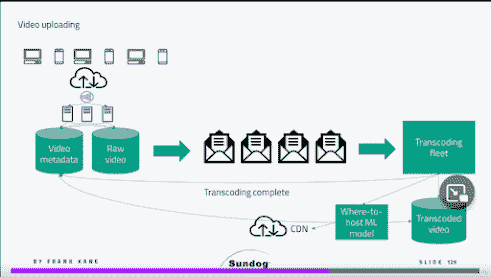
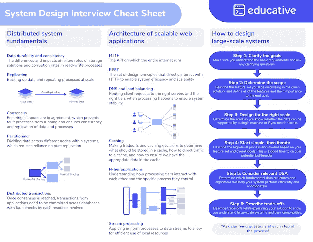
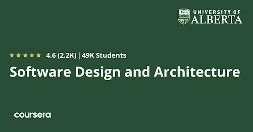
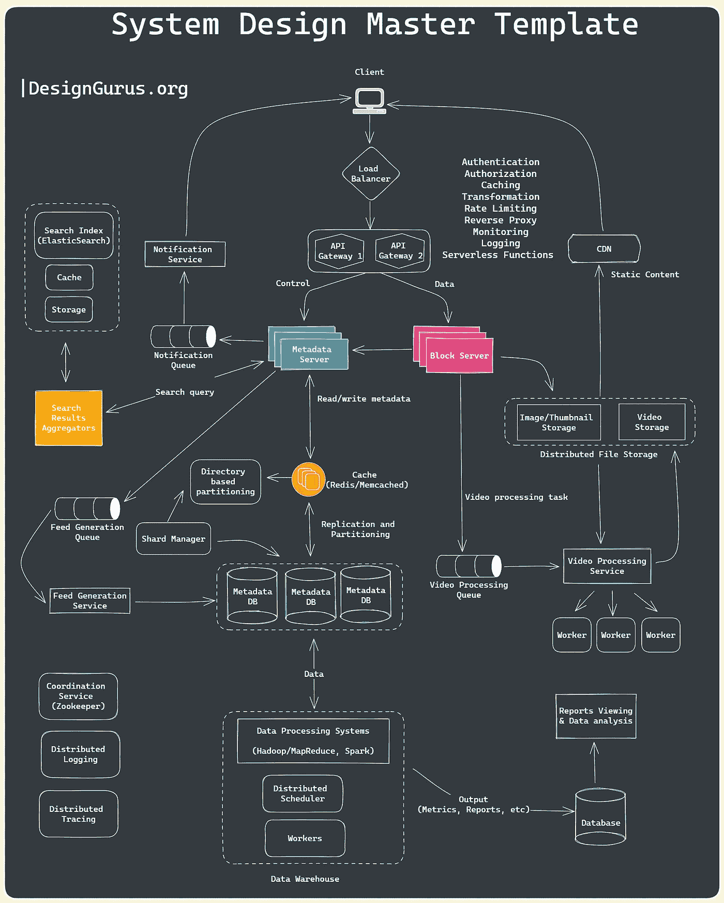

# 2023 年学习系统设计的 10 个最佳地点

> 原文：<https://medium.com/javarevisited/7-best-places-to-learn-system-design-79e2d261f343?source=collection_archive---------1----------------------->

## 这些都是在线学习软件设计和系统设计，为 2023 年的系统设计面试做好准备的最好地方

image_credit — educative.io

你好伙计们，如果你正在准备系统设计面试，并寻找掌握软件设计和系统设计的最佳资源，那么你来对地方了。

之前我已经撕碎了 [**最好的系统课程**](/javarevisited/10-best-system-design-courses-for-coding-interviews-949fd029ce65)[**书籍**](https://javarevisited.blogspot.com/2022/06/best-system-design-and-analysis-books.html)[**系统面试问题**](https://www.java67.com/2018/05/top-20-system-design-interview-questions-answers-programming.html) 在这篇文章中，我将分享 2023 年学习系统设计的最佳地点。

在我们去最好的网站教你所有你需要知道的关于系统设计的知识之前，让我告诉你一点关于它到底是什么。系统设计基本上是定义系统元素的过程，包括基于一组特定需求的系统模块、[架构](https://javarevisited.blogspot.com/2019/03/5-courses-programmers-can-join-to-learn.html)、组件、接口和数据。

它也可以指定义、开发和设计系统的过程。这些设计必须满足公司或组织的特定需求。

# 2023 年软件设计和系统设计面试准备的 7 个最佳网站

作为一个系统设计师，你必须利用所有不同的建模语言来表达系统结构中的信息和知识。这个系统必须由一套一致的规则和定义来定义。它也可以用文本或图形建模语言来定义。

有不同种类的图形建模语言，如统一建模语言、 [UML](/javarevisited/5-best-uml-books-and-courses-for-java-programmers-13c551a9235d) 、流程图、业务流程建模符号和系统建模语言。

还有不同类型的设计方法可供您使用。它们包括架构设计、逻辑设计和物理设计。

这里我们整理了一份学习系统设计的最佳网站列表。请继续阅读，了解更多信息。

## 1.udemy[系统设计课程最佳平台]

这是一个很棒的网站，它会教你所有你需要知道的关于系统设计的知识，同时从零开始摸索。这样的话，对于完全的初学者来说绝对是完美的。Udemy 对于希望进入系统设计的奇妙世界的初学者来说是一个完美的入门指南。

通过这个神奇的网站，你将了解到高级系统设计的所有核心特性。你也会成为一名非常高级的系统设计师。你将能够掌握系统设计和搜索。

以下是 Udemy 的**最佳系统设计课程，值得一看:**

*   [掌握系统设计面试](https://click.linksynergy.com/deeplink?id=JVFxdTr9V80&mid=39197&murl=https%3A%2F%2Fwww.udemy.com%2Fcourse%2Fsystem-design-interview-prep%2F)
*   [务实的制度设计](https://click.linksynergy.com/deeplink?id=JVFxdTr9V80&mid=39197&murl=https%3A%2F%2Fwww.udemy.com%2Fcourse%2Fpragmatic-system-design%2F)
*   [Sandeep Kaul(脸书技术主管)的系统设计访谈指南](https://click.linksynergy.com/deeplink?id=JVFxdTr9V80&mid=39197&murl=https%3A%2F%2Fwww.udemy.com%2Fcourse%2Fsystem-design-a-comprehensive-guide%2F)

当你完成 Udemy 上的所有课程时，你将成为一名专家系统设计师，并准备好解决那些复杂的系统设计问题，如如何设计 YouTube、Instagram、WhatsApp 或消息队列。

## 2.教育性[系统设计互动课程]

Educative 是我现在在网上学习系统设计的最爱之一。它基本上是一个为你准备系统设计面试而创建的网站。通过这个网站，你也将了解如何进行系统设计。

它也是仅有的几个网站之一，可以教你大规模分布式系统设计问题的细节。即使你是这个领域的专家也没关系。我很肯定你会发现这个网站是一次宝贵的学习经历。

创建这个网站的聪明人也付出了额外的努力，给你一份设计选择清单。这个列表将使你理解需求，比较不同的方法，并最终为你所面临的复杂问题提出一个合适的解决方案。

以下是 Educative.io 的**最佳系统设计课程**:

*   [系统设计面试](https://www.educative.io/collection/5668639101419520/5649050225344512?affiliate_id=5073518643380224)
*   [钻研高级系统设计面试](https://www.educative.io/courses/grokking-adv-system-design-intvw?affiliate_id=5073518643380224)
*   [为软件工程师&经理](https://www.educative.io/courses/grokking-modern-system-design-software-engineers-managers?affiliate_id=5073518643380224)钻研现代系统设计

使教育性真正有趣的还有这样一个事实，即教师不会填鸭式地教你任何东西。你需要解决这个问题，自己想出创新的解决方案。如果你只是在寻找一个能让你为系统设计面试做好充分准备的网站，你不需要再找了。

这里有一份来自 Educative 的不错的**系统设计备忘单**，可以快速修改:

Educative 的讲师还将与您分享他们如何解决复杂系统设计问题的第一手经验。您将了解到解决一般系统设计问题的所有不同的提示、技巧、概念和方法。

你也将有机会练习很多经典的系统设计问题，比如网络爬虫、[URL shorter](https://www.educative.io/courses/grokking-the-system-design-interview/m2ygV4E81AR?affiliate_id=5073518643380224)，以及设计一个餐馆预订系统。

这些教育性的系统设计课程将教你不同的技术，这些技术对于扩展分布式系统是有用的。您将获得数据库技术和 NoSQL 解决方案的概述。此外，您还将学习如何使用缓存来提高可伸缩性和性能。

顺便说一句，你可以单独参加这个课程，也可以参加 [**教育无限订阅**](https://www.educative.io/subscription?affiliate_id=5073518643380224) ，每月只需 14.9 美元的年度计划(推荐)，就可以访问他们的 350 多个高质量、基于文本的交互式课程，学习编码面试、软件开发和技术的关键技能。

 [## 教育无限:保持领先

### 我想表达我的无限感激，让您的多功能教育平台可用和访问。我…

www.educative.io](https://www.educative.io/subscription?affiliate_id=5073518643380224) 

## 3. [ByteByteGo 作者亚历克斯·于](https://bytebytego.com?fpr=javarevisited)

这是另一个学习系统设计概念和准备系统设计面试的平台。这个网站是由 Alex Yu 创建的，他是最受欢迎的 [**系统设计面试——内部人员指南**](https://www.amazon.com/System-Design-Interview-insiders-Second/dp/B08CMF2CQF/?tag=javamysqlanta-20) 书籍的作者，是系统设计面试最值得推荐的书籍之一。这个网站也是他的书的电子版，但它提供的远不止这些。'

Alex 分享了详细的一步一步的框架来解决采访中的系统设计问题，如如何设计 YouTube 和如何设计聊天系统。他还经常分享关于系统设计有趣内容，这些内容对于学习基本的系统设计概念非常有用，比如伸缩、缓存和分布式消息传递。

如果你正在准备系统设计面试，那么我强烈推荐你去看看这个网站，加入他的课程。

以下是参加本课程的链接— [**字节跳动**](https://bytebytego.com?fpr=javarevisited) 九折优惠

您还可以使用代码 **JALJAD 获得 10%的折扣，**专门为 Javarevisited reader 提供。

## 4.[指数](https://www.tryexponent.com/?ref=javinpaul2)

这是另一个学习系统设计和准备系统设计面试的好网站，特别是对于 FAANG 公司。那里的[系统设计面试课程](https://www.tryexponent.com/courses/system-design-interview?ref=javinpaul2)有 36 节课，它提供系统设计问题的解决方案，如设计 Twitter、Instagram、停车场、设计网络爬虫，以及许多其他流行的软件设计问题。

他们还为不同的 FAANG 公司提供专门的课程，例如，他们为亚马逊 SDE 面试提供专门的课程，不仅让你为技术回合做准备，还进行模拟面试来检查你的实际准备水平。他们也有类似的谷歌面试课程。

我最喜欢 Exponent 的一点是他们的模拟面试，就像真正的训练一样，以及对谷歌、脸书、微软和亚马逊热门面试问题的一对一辅导和互动讨论。

如果你正在准备 FAANG 公司的系统设计面试，那么我强烈推荐这个课程和网站，你现在每月只需 12 美元(70%折扣)就可以加入。

以下是加入指数的链接— [**现在尝试指数**](https://www.tryexponent.com/courses/system-design-interview?ref=javinpaul2)

## 5.Coursera

Coursera 是另一个在线学习热门技术技能的好地方。Coursera 最好的一点是，他们的课程材料是由世界一流大学和顶级科技公司如谷歌、AWS 和 IBM 设计和提供的。

说到软件设计，我非常喜欢阿尔伯塔大学的 [**软件设计和架构专业**](https://coursera.pxf.io/c/3294490/1164545/14726?u=https%3A%2F%2Fwww.coursera.org%2Fspecializations%2Fsoftware-design-architecture) ，其中包含了一些与软件设计相关的不错的课程。

Coursera 上的精彩课程将是对现代系统设计这个神奇世界的一个很好的简要介绍。它非常适合初学者，因为你将从零开始学习系统设计。你将确切地了解什么是系统设计以及为什么要使用它。

Coursera 也是一个很好的选择，它将帮助你把面向对象设计的技能提升到另一个层次。通过使用面向对象的系统设计，而不是传统的系统设计技术，你将能够做到这一点。

这个网站上的课程也会教你如何通过你的系统设计面试。你还将学习如何在谷歌找到工作。脸书、微软和亚马逊。

**这里是加入本课程** — [**软件设计与架构专业化**](https://coursera.pxf.io/c/3294490/1164545/14726?u=https%3A%2F%2Fwww.coursera.org%2Fspecializations%2Fsoftware-design-architecture) 的链接

顺便说一句，如果你计划参加多个 Coursera 课程或专业，那么考虑参加 [**Coursera Plus 订阅**](https://coursera.pxf.io/c/3294490/1164545/14726?u=https%3A%2F%2Fwww.coursera.org%2Fcourseraplus) ，它可以让你无限制地访问他们最受欢迎的课程、专业、专业证书和指导项目。它每月花费大约 59 美元，但很值得，因为你可以访问 7000 多门课程和项目，还可以获得无限的证书。

 [## Coursera Plus |无限制访问 7，000 多门在线课程

### 在 Coursera 上可以无限制地访问 90%以上的课程、项目、专业和专业证书

coursera.pxf.io](https://coursera.pxf.io/c/3294490/1164545/14726?u=https%3A%2F%2Fwww.coursera.org%2Fcourseraplus) 

## 6.LinkedIn 学习

LinkedIn Learning 是一个令人兴奋的网站，有很多课程，将在最短的时间内教你所有你需要知道的关于机器学习系统设计的基础知识。网站还会教你所有你需要知道的关于机器学习和系统设计的知识。

在这个奇妙的网站上，你将了解到你需要知道的关于被主要 IT 公司雇用的系统设计的不同组成部分的一切。你将从学习系统设计的基础开始。然后你会继续理解什么是系统设计。

以下是 LinkedIn Learning 最好的系统设计课程

*   [软件架构模式](http://linkedin-learning.pxf.io/c/1193463/449670/8005?u=https%3A%2F%2Fwww.linkedin.com%2Flearning%2Fsoftware-architecture-foundations)

当你完成这个网站上的所有课程时，你将能够在主要的科技公司找到一份非常好的工作。

顺便说一下，你需要一个 [*LinkedIn Learning 会员*](http://linkedin-learning.pxf.io/c/1193463/449670/8005?u=https%3A%2F%2Fwww.linkedin.com%2Flearning%2Fsubscription%2Fproducts) 来观看这个课程，这个课程每月花费大约 19.99 美元，但是你也可以通过参加他们的 1 个月免费试用来免费观看这个课程，这是一个探索他们 17500+最新技术在线课程的好方法。

 [## LinkedIn Learning 免费试用和订阅价格

### 从初级到高级的 18，000 多门专家指导课程的个性化、高质量内容。基于社区的…

linkedin-learning.pxf.io](http://linkedin-learning.pxf.io/c/1193463/449670/8005?u=https%3A%2F%2Fwww.linkedin.com%2Flearning%2Fsubscription%2Fproducts) 

## 7.系统设计入门 [GitHub](https://medium.com/u/8df3bf3c40ae?source=post_page-----79e2d261f343--------------------------------)

这是另一个很棒的资源，你可以在这里找到 otpics、文章、教程的集合，为系统设计面试做准备。还有常见系统设计问题解决方案。如果你想深入学习系统设计，我强烈推荐你去这个地方看看。它是完全免费的工具

 [## GitHub-donne Martin/system-design-primer:学习如何设计大型系统。准备…

### 学习如何设计大型系统。准备系统设计面试。学习如何设计可扩展的系统…

github.com](https://github.com/donnemartin/system-design-primer) 

## 8.多元视觉

Pluralsight 是一个非常棒的网站，可以帮助你提高机器学习和系统设计技能。你将能够通过努力获得一份非常好的机器学习工作来做到这一点。使用这个网站上令人兴奋的课程，你也将能够学习用 Java 设计的基础知识。

你也可以利用这些神奇的课程开始你的神奇之旅。说到系统设计，我真的很喜欢他们的 [**模式，为企业**](https://pluralsight.pxf.io/c/1193463/424552/7490?u=https%3A%2F%2Fwww.pluralsight.com%2Fcqrs-theory-practice) 课程构建分布式系统，这是 Pluralsight 上最好的软件设计课程之一。

它非常适合有经验的开发人员。在 Pluralsight 的精彩课程中，您将了解到域驱动系统设计的所有核心特性，CAP 定理，CQRS 等。你也会成为一名非常高级的系统设计师。你将能够掌握领域驱动的系统设计。

顺便说一下，你需要一个 Pluralsight 会员才能参加这个课程，费用大约是每月 29 美元或每年 299 美元(14%的折扣)。我向所有程序员强烈推荐这个订阅，因为它提供了超过 7000 个在线课程的即时访问，以学习任何技术技能。或者，你也可以使用他们的 [10 天免费通行证](https://pluralsight.pxf.io/c/1193463/424552/7490?u=https%3A%2F%2Fwww.pluralsight.com%2Fpricing%2Ffree-trial)免费观看这个课程。

 [## Pluralsight |个人免费试用

### 立即开始免费试用 Pluralsight！查看我们为个人和团队提供的服务，如果您不确定…

pluralsight.pxf.io](https://pluralsight.pxf.io/c/1193463/424552/7490?u=https%3A%2F%2Fwww.pluralsight.com%2Fpricing%2Ffree-trial) 

## 9.[设计大师](https://bit.ly/3pMiO8g)

DesignGuru 是另一个很棒的网站，有很多系统设计教程和课程，特别是面试。它也是软件工程师准备编码面试的一个流行的在线平台。

如果你上过网上课程，那么你可能会遇到像 [*搜索系统设计课程*](https://designgurus.org/link/84Y9hP?url=https%3A%2F%2Fdesigngurus.org%2Fcourse%3Fcourseid%3Dgrokking-the-system-design-interview) 或搜索编码面试课程这样的课程，这些都是由设计大师创建的课程。

我一直在学习他们在 Educative.io 上的课程，但现在他们已经离开了那个平台，并创建了自己的在线平台，加入他们的面试课程是有意义的。

但是，他们没有止步于此，他们正在创建更多更好的课程，以帮助软件工程师破解 FAANG 和其他技术公司的编码面试。

如果你也在准备编码面试，那么你可以加入 DesignGuru，不仅可以参加他们的 [**系统设计课程**](https://designgurus.org/link/84Y9hP?url=https%3A%2F%2Fdesigngurus.org%2Fbundles%3Fbundle_id%3Dbuy-both-system-design-courses) ，还可以参加许多其他的编码面试课程

**这里是加入设计大师**——[加入设计大师](https://designgurus.org/link/84Y9hP)的链接

您还可以使用折扣代码和优惠券大师 30%的折扣，只适用于 Javarevisited 追随者。

## 10.油管（国外视频网站）

许多人已经知道 YouTube 可能是学习任何东西的最好地方，包括系统设计。虽然在 YouTube 上不容易找到关于系统设计的最佳视频，但有很多很棒的系统设计教程和资源，如 YouTube Channel by[**ByteByteGo**](https://bytebytego.com?fpr=javarevisited)和 [**Exponent**](https://www.tryexponent.com/?ref=javinpaul2) 。

YouTube 上也有许多免费的系统设计课程，最新最全面的课程来自 FreeCodeCamp，我强烈建议你去看看。

顺便说一句，如果你需要更多的免费资源，你也可以查看这份为初学者和有经验的开发者提供的 [**最佳免费软件设计课程**](https://dev.to/javinpaul/my-favorite-free-system-design-courses-and-tutorials-52af) 列表。

# 系统设计常见问题

现在，我们来看看程序员和开发人员对学习系统设计和软件设计的常见疑惑和疑问。

**1。到底什么是系统设计？**
[系统设计](https://javarevisited.blogspot.com/2022/06/system-design-interview-question-answer.html)基本上是根据一组特定的需求为系统定义系统元素的过程，包括模块、架构、组件、接口和数据。它也可以指定义、开发和设计系统的过程。

**2。我能成为系统设计师吗？作为一名系统设计师，你必须利用所有不同的建模语言来表达系统结构中的信息和知识。这个系统必须由一套一致的规则和定义来定义。它也可以用文本或图形建模语言来定义。**

**3。作为一名系统设计师应该学些什么？有不同种类的图形建模语言，如统一建模语言、UML、流程图、业务流程建模符号和系统建模语言。还有不同类型的设计方法可供您使用。它们包括架构设计、逻辑设计和物理设计。**

**4。常见的系统设计面试问题有哪些？**

许多问题，如如何设计 YouTube、Instagram、WhatsApp 和分布式消息队列，都是常见的系统问题，你可以在面试前练习。我在这里分享了 [25 个系统设计问题](/javarevisited/25-software-design-interview-questions-to-crack-any-programming-and-technical-interviews-4b8237942db0)，你可以查看

以上就是 2023 年 **10 个最好的学习软件设计和系统设计的地方**。这些网站不仅是准备系统设计面试的好资源，也是改进你正在设计的软件和应用的设计的好资源。如果你喜欢这个学习系统设计的最佳网站列表，请随意与你的朋友和家人分享。

如果您对系统设计有任何疑问，您也可以发表评论，我们将立即回复您。我毫不怀疑这个列表中的网站会在几周或几个月内把你从一个完全的初学者变成一个系统设计专家。

你可能喜欢的其他**编程文章和教程**

*   [如何准备 2023 年系统设计面试](https://javarevisited.blogspot.com/2022/03/how-to-prepare-for-system-design.html)
*   [5 个免费学习 Python 的网站](https://javarevisited.blogspot.com/2019/09/5-websites-to-learn-python-for-free.html)
*   [完整的 Java 开发者路线图](https://javarevisited.blogspot.com/2019/10/the-java-developer-roadmap.html)
*   [免费学习 Java 编码的五大网站](https://javarevisited.blogspot.com/2018/07/top-5-websites-to-learn-coding-in-java.html)
*   [2023 年 Java 程序员应该学会的 10 件事](https://javarevisited.blogspot.com/2017/12/10-things-java-programmers-should-learn.html#axzz5atl0BngO)
*   [深入学习 React.js 的五大网站](https://javarevisited.blogspot.com/2020/10/top-5-websites-to-learn-react-for-free.html)
*   [2023 年学习 Linux 的五大网站](https://javarevisited.blogspot.com/2021/06/5-websites-to-learn-linux-command-line.html)
*   每个 Java 开发人员都应该知道的 10 个工具
*   [2023 年你可以学习的 10 种编程语言](http://www.java67.com/2017/12/10-programming-languages-to-learn-in.html)
*   [10 个免费学习 Git 和 Github 的网站](https://javarevisited.blogspot.com/2019/05/10-free-websites-to-learn-git-online.html)
*   [深入学习 Python 的 10 个理由](https://javarevisited.blogspot.com/2018/05/10-reasons-to-learn-python-programming.html)
*   [5 个免费学习数据结构和算法的网站](https://javarevisited.blogspot.com/2017/02/5-websites-for-practicing-data-structure-algorithms-for-coding-interviews.html)
*   Java 和 Web 开发人员应该学习的 10 个框架
*   [学习 Java 编程语言的 10 个理由](http://javarevisited.blogspot.sg/2013/04/10-reasons-to-learn-java-programming.html)
*   [5 个免费在线学习 SQL 的网站](https://javarevisited.blogspot.com/2015/06/5-websites-to-learn-sql-online-for-free.html)
*   [2023 年需要学习的 5 大 Java 框架](http://javarevisited.blogspot.sg/2018/04/top-5-java-frameworks-to-learn-in-2018_27.html)
*   [21 个免费在线学习编码的网站](https://www.java67.com/2018/06/21-websites-to-learn-how-to-code-for.html)
*   [完整的 DevOps 工程师路线图](/hackernoon/the-2018-devops-roadmap-31588d8670cb)
*   [程序员 50+数据结构面试问题](/hackernoon/50-data-structure-and-algorithms-interview-questions-for-programmers-b4b1ac61f5b0)

感谢您阅读本文。如果你知道有什么优秀的在线资源像网站或者编程平台来**学习系统设计和软件设计**，特别是对于初学者，你认为是这两个网站的补充，那就随意分享吧。每个人都喜欢伟大的资源和快乐的学习系统设计。

如果你正在寻找一门免费的在线课程来学习系统设计和软件设计，那么我也建议你去看看艾尔丹姆在 Udemy 上的免费课程。这个 2 小时的免费课程是准备 2023 年系统设计面试的绝佳资源。

 [## 2023 年学习系统设计和软件设计的 10 门免费课程-最佳选择

### 你好伙计们，如果你正在准备系统设计面试或只是想提高你的软件设计技能和…

javarevisited.blogspot.com](https://javarevisited.blogspot.com/2022/08/free-courses-to-learn-system-design-and.html)