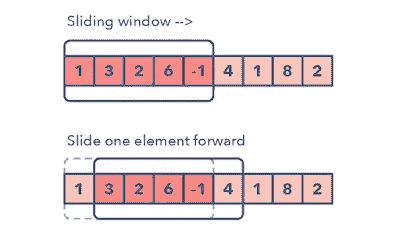
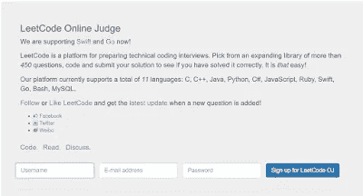
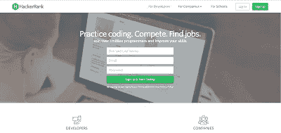
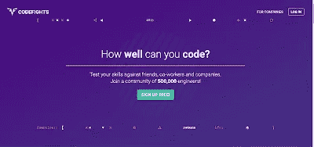
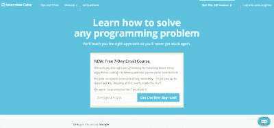
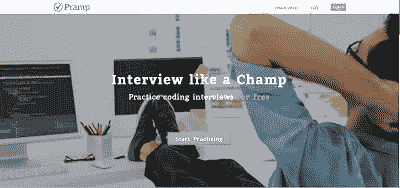

# 练习编码问题和学习面试数据结构和算法的 7 个最佳地点

> 原文：<https://medium.com/javarevisited/7-best-places-to-practice-coding-problems-and-learn-data-structures-and-algorithms-for-interviews-646f7fe41350?source=collection_archive---------0----------------------->

## 这些是最好的在线平台、网站和最好的地方，你可以在那里学习数据结构和算法，练习面试的编码问题。

形象信用——教育

你好伙计们，如果你正在准备编码面试，并寻找最好的网站和在线平台来练习编码问题，学习数据结构和算法，那么你来对地方了。

早些时候，我已经分享了[**最佳书籍**](/javarevisited/5-coding-interview-books-to-prepare-for-programming-job-interviews-d8f63348afaf) 和 [**编码面试准备在线课程**](/javarevisited/10-data-structure-algorithms-and-programming-courses-to-crack-any-coding-interview-e1c50b30b927) ，在这篇文章中，我将分享最佳在线平台、网站和地方来磨练你的面试编码技能。

如果你做过研究，那么你可能知道有许多免费的在线资源来练习编码面试的重要主题，如[数据结构和算法](https://javinpaul.medium.com/6-best-data-structure-and-algorithms-courses-for-javascript-developers-c35e23236165)、[数据库和 SQL](/javarevisited/top-5-sql-and-database-courses-to-learn-online-48424533ac61) 等等。

这些网站对刚开始学习基础知识的新程序员和正在为面试复习编码技能的有经验的程序员来说同样有用。我在这本书里分享了很长时间编程和技术面试的有用资源。

以前分享过一些推荐的[线上课程](https://javarevisited.blogspot.com/2018/02/10-courses-to-prepare-for-programming-job-interviews.html#axzz5oeVu3CYQ)和[书籍](https://javarevisited.blogspot.com/2016/06/top-5-books-for-programming-coding-interviews-best.html)进行编码面试，以及一些科技公司常见的编程面试问题(这里见[)。但是，我的读者一直在询问一些关于练习编程挑战和编写面试问题的推荐网站。

因此，在这篇文章中，我将分享一些最好的网站，它们将免费帮助你](http://javarevisited.blogspot.sg/2011/06/top-programming-interview-questions.html) [*练习编写面试问题*](https://codeburst.io/100-coding-interview-questions-for-programmers-b1cf74885fb7) 。他们中的一些也有付费版本，一些也被公司用来筛选候选人，所以你将获得真实编码面试的第一手经验。

这些网站不仅对任何准备编码面试的人有用，对任何认真想提高编码技能的程序员也有用，而编码技能是一个程序员最重要的技能。这些网站将帮助你提高编码意识和解决问题的能力。或者，如果你喜欢书和课程，你也可以看看这个[书单](http://www.java67.com/2016/02/5-books-to-improve-coding-skills-of.html)和[课程](https://hackernoon.com/10-data-structure-algorithms-and-programming-courses-to-crack-any-coding-interview-e1c50b30b927)来提高你的编码技能。

编程面试总是因其理论性而受到批评，我的意思是，任何懂一点编程的人都可以通过参加一些常见的编程面试来找到工作，比如[字谜](http://javarevisited.blogspot.sg/2013/03/Anagram-how-to-check-if-two-string-are-anagrams-example-tutorial.html)、[字符串排列](http://javarevisited.blogspot.sg/2015/08/how-to-find-all-permutations-of-string-java-example.html)或[链表问题](http://javarevisited.blogspot.sg/2012/12/how-to-find-middle-element-of-linked-list-one-pass.html)，但那已经是过去的事情了。就像获得驾驶执照一样，你需要通过理论考试和实际驾驶，许多公司现在正在转向类似的模式，在他们给你提供工作之前，他们将测试你的理论知识和实际编程技能。这种增长趋势使得这些资源更受追捧。我是我在这里分享的所有网站的成员，解决了几个问题，并且仍然会在我有空的时候去那里，特别是 LeetCode 和 HackerRank

  

# 准备数据结构、算法和编码面试问题的 7 个最佳网站

这里是我列出的一些最好的网站，可以帮助你准备编码面试。它们是免费的，包含许多问题，并提供不同种类的体验。还有很多其他的，但是我觉得这五个已经足够了。如果你甚至能解决第一个网站上的所有问题，你就有很大的机会在任何编码面试中表现出色。

## 1.乌德米

这是找到价格实惠的编程面试准备课程的最佳网站之一。Udemy 实际上是最好的在线学习网站，因为他们独特的定价选项，允许你花 10 美元就能买到 200 美元的优质课程，这也是为什么它是我第一个去获取编程或编码面试资源的网站。

Udemy 有最好的编程面试在线课程，涵盖各种各样的主题，如数据结构和算法、系统设计、SQL 和数据库设计、Python 等编程语言等等。

他们也有专门的课程来准备 FAANG 面试，我的意思是准备像脸书、苹果、亚马逊、网飞和谷歌这样的大型科技公司的面试。如果你正在寻找最好的编码面试课程，我建议你在 Udemy 上查看以下课程。

*   [务实的制度设计](https://click.linksynergy.com/deeplink?id=CuIbQrBnhiw&mid=39197&murl=https%3A%2F%2Fwww.udemy.com%2Fcourse%2Fpragmatic-system-design%2F)
*   [掌握编码面试:大科技(FAANG)面试](https://click.linksynergy.com/deeplink?id=CuIbQrBnhiw&mid=39197&murl=https%3A%2F%2Fwww.udemy.com%2Fcourse%2Fmaster-the-coding-interview-big-tech-faang-interviews%2F)
*   [数据结构和算法:使用 Java 的深度探索](https://click.linksynergy.com/deeplink?id=CuIbQrBnhiw&mid=39197&murl=https%3A%2F%2Fwww.udemy.com%2Fcourse%2Fdata-structures-and-algorithms-deep-dive-using-java%2F)

这是 Udemy 的几门顶级课程，你可以参加，开始为编码和编程面试做准备。

## 2.教育的

当涉及到准备编码面试或像前端和后端开发这样的编程工作面试时，Educative 是最好的平台之一。

它有许多基于文本的交互式课程，为不同主题的编码面试做准备，如系统设计、动态编程、面向对象编程、多线程和并发性、数据结构和算法等等。

以下是我从 Educative.io 平台为准备编码面试的人推荐的一些课程:

1.  [**系统设计面试**](https://www.educative.io/collection/5668639101419520/5649050225344512?affiliate_id=5073518643380224)
2.  [**寻找编码面试:编码问题的模式**](https://www.educative.io/collection/5668639101419520/5671464854355968?affiliate_id=5073518643380224)
3.  [**探寻面向对象设计面试**](https://www.educative.io/collection/5668639101419520/5692201761767424?affiliate_id=5073518643380224)
4.  [**探索动态编程模式进行编码面试**](https://www.educative.io/collection/5668639101419520/5633779737559040?affiliate_id=5073518643380224)
5.  [**Java 多线程高级工程面试**](https://www.educative.io/courses/java-multithreading-for-senior-engineering-interviews?affiliate_id=5073518643380224)
6.  [**Java 中的数据结构:面试复习**](https://www.educative.io/collection/5642554087309312/5724822843686912?affiliate_id=5073518643380224)

你可以单独购买这些课程来准备一个特定的主题，或者购买 [**教育订阅**](https://www.educative.io/subscription?affiliate_id=5073518643380224) ，每月花费大约 18 美元，可以访问他们所有的 100 多门软件工程课程。我个人推荐教育性会员，因为它既划算又是一种在平台上学习的简单方式。

## 3. [LeetCode](https://leetcode.com/)

LeetCode 是一个准备技术编码面试的平台。从一个超过 450 个问题的扩展库中选择，编码，并提交您的解决方案，看看您是否正确地解决了它。就是这么简单！

该平台目前共支持 11 种语言: [C](https://javarevisited.blogspot.com/2019/11/top-5-courses-to-learn-c-programming-in.html) 、 [C++](/javarevisited/top-10-courses-to-learn-c-for-beginners-best-and-free-4afc262a544e) 、 [Java](/javarevisited/top-5-java-online-courses-for-beginners-best-of-lot-1e1e240a758) 、 [Python](/better-programming/top-5-courses-to-learn-python-in-2018-best-of-lot-26644a99e7ec) 、 [C#](/@javinpaul?source=follow_footer--------------------------follow_footer-) 、 [JavaScript](/javarevisited/10-best-online-courses-to-learn-javascript-in-2020-af5ed0801645) 、 [Ruby](/@javinpaul/top-5-free-courses-to-learn-ruby-and-rails-for-beginners-best-of-lot-e149fe03c964) 、 [Swift](/javarevisited/top-5-online-courses-to-learn-ios-12-swift-in-2019-a35ae1be7b2b?source=---------22------------------) 、 [Go](/javarevisited/7-online-courses-to-learn-golang-or-go-programming-languages-in-2020-f599a25cf14a) 、 [Bash](/javarevisited/6-free-courses-to-learn-bash-shell-scripting-in-linux-and-unix-a50461ecd4fe) 、 [MySQL](/javarevisited/top-5-courses-to-learn-mysql-in-2020-4ffada70656f) 因此，无论您是 C++开发人员还是 Java 程序员，您都可以从中受益。

你会发现各种不同的面试问题像算法、数据库、Shell 脚本等分为四大类。算法包含[数组](http://javarevisited.blogspot.sg/2015/06/top-20-array-interview-questions-and-answers.html)、[链表](http://www.java67.com/2016/07/how-to-reverse-singly-linked-list-in-java-example.html)、[字符串](http://javarevisited.blogspot.sg/2015/01/top-20-string-coding-interview-question-programming-interview.html)、[二叉树](http://javarevisited.blogspot.sg/2016/10/post-order-binary-tree-traversal-in-java-iteration-recursion.html)、图等面试问题。

数据库部分包含基于 SQL 查询的问题，如编写 SQL 查询来查找第二高的薪水[或第 n 高的薪水](http://javarevisited.blogspot.sg/2015/11/2nd-highest-salary-in-oracle-using-rownumber-rank-example.html)[等。](http://javarevisited.blogspot.sg/2016/01/4-ways-to-find-nth-highest-salary-in.html)

## 4.[黑客排名](https://www.hackerrank.com/)

HackerRank 社区是程序员最大的学习和竞赛社区之一。HackerRank for Work 是领先的端到端技术招聘平台，用于招聘工程师。HackerRank 也非常容易上瘾，一旦开始，你可能会花数小时解决编码问题。超过 100 万的程序员是 HackerRank 的一部分，这充分说明了它为想要准备编码面试并提高其编码和解决问题技能的程序员提供的价值。许多科技公司也使用 HackerRank 为候选人安排筛选和笔试。

Btw，如果你是一个爱书的人，想提高自己的算法和数据结构技能，那么你也可以从这个[列表](http://www.java67.com/2015/09/top-10-algorithm-books-every-programmer-read-learn.html)中选择一本好的算法书

## 5.[格斗赛](https://codefights.com/home)

CodeFighting 是通过挑战朋友和其他程序员来进行面对面的战斗来磨练编程技能的最佳方式。当你创建你的帐号时，你将选择你想在代码大战中使用的编程语言，然后你将和一个机器人进行你的第一次战斗，很有趣，不是吗？CodeFights 网站测试你的编码水平如何？它测试你对朋友、同事和公司的技能。一些科技公司也使用该网站的服务，根据编码技能筛选候选人。

## 6.[面试蛋糕](https://www.interviewcake.com/)

面试蛋糕声称会教你正确的思维方式，打破你从未见过的棘手的算法编码面试问题，这是微软、亚马逊和谷歌等科技巨头可能会问的问题。不需要事先的计算机科学培训——我会让你快速上手，跳过所有过于学术性的东西。

这个网站还提供一些公司的面试问题，比如你会发现[谷歌](http://javarevisited.blogspot.sg/2012/01/google-interview-questions-answers-top.html)、[微软](http://javarevisited.blogspot.sg/2015/12/30-microsoft-interview-questions-for-software-development-engineers.html)、脸书[亚马逊](https://javarevisited.blogspot.com/2016/01/top-20-amazon-and-google-programming-interview-questions.html)提出的问题。它还提供了针对不同编程语言(如 Java、Python、SQL、Ruby、JavaScript)的问题，以及测试和 QA 面试问题。

## 7. [Pramp](https://www.pramp.com/)

Pramp 是另一个不错的网站，可以让你免费练习编码面试。加入成千上万已经使用 Pramp 的开发人员的行列，在编码面试中脱颖而出。我真的很喜欢他们独特的风格，可以让你两人一组练习编码面试。只要告诉你想练习的时间和内容，他们就会给你找一个最佳搭档。他们提供了面试问题(和答案),你们双方都将使用这些问题来面试对方。

编码访谈是与协作代码编辑器的现场视频会议。你和你的同事每人面试 30 分钟。面试结束后，你们双方对对方的表现进行评价。这真的很好，因为它给你机会从同事的反馈中学习，获得自信，并掌握面试的艺术。坚持练习，直到面试像摇滚明星一样。给招聘人员留下深刻印象，获得好工作机会。

## 编码面试的 5 本最佳书籍和课程

如果你喜欢书，这里有一些最好的书，可以帮助你在编码面试中做得更好:

1.  [破解盖尔·麦克道尔的编码访谈](http://www.amazon.com/dp/098478280X/?tag=javamysqlanta-20)
2.  弗兰克·凯恩(前亚马逊招聘经理)采访掌握系统设计
3.  [**数据结构和算法:使用 Java** 深度挖掘](https://click.linksynergy.com/fs-bin/click?id=JVFxdTr9V80&subid=0&offerid=323058.1&type=10&tmpid=14538&RD_PARM1=https%3A%2F%2Fwww.udemy.com%2Fdata-structures-and-algorithms-deep-dive-using-java%2F)
4.  [Wrox 曝光的编程面试](http://www.amazon.com/dp/1118261364/?tag=javamysqlanta-20)
5.  [解码 Java 中的编码访谈:真实世界的例子](https://www.educative.io/courses/decode-coding-interview-java?affiliate_id=5073518643380224)

这是一些关于编程工作面试的经过测试的书籍和在线课程，我强烈推荐给所有的程序员，无论是初学者还是中级开发人员。

这就是为开发和支持工作准备编码、编程或技术面试的一些最佳网站。CodeFights 类似于 HackerRank，也被一些公司用于在面对面面试前筛选候选人。

面试蛋糕是一个通过自学练习数据结构和算法的免费增值服务。它会每天给你发邮件，挑战你编码、解决和提交解决方案。Pramp 是一项免费的技术面试服务，通过将在线面试的工程师配对来实现。这些网站不仅会帮助你在真正的面试中表现得更好，还会通过提高你的编码技能和思考能力来帮助你成为一名更好的程序员。即使你没有准备编码面试，你也可以使用这些网站来检查你的编码技能并加以改进。

你可能喜欢的其他**编程和采访文章**

*   [学习面试系统设计的前 5 门课程](https://www.java67.com/2019/09/top-5-courses-to-learn-system-design.html)
*   [学习编码面试动态编程的前 5 门课程](https://javarevisited.blogspot.com/2019/12/top-5-courses-to-learn-dynamic-programming-for-interivews.html)
*   [5 门学习数据结构和算法的免费课程](http://javarevisited.blogspot.sg/2018/01/top-5-free-data-structure-and-algorithm-courses-java--c-programmers.html#axzz55lOcYrUM)
*   [20+字符串算法面试题](https://hackernoon.com/20-string-coding-interview-questions-for-programmers-6b6735b6d31c)
*   [准备技术编程/编码工作面试的 10 本书](http://www.java67.com/2017/06/10-books-to-prepare-technical-coding-job-interviews.html)
*   [准备编程工作面试的 10 门课程](http://javarevisited.blogspot.sg/2018/02/10-courses-to-prepare-for-programming-job-interviews.html)
*   [面向 Java 开发人员的五大数据结构和算法书籍](http://javarevisited.blogspot.sg/2016/05/5-free-data-structure-and-algorithm-books-in-java.html#axzz4uXETWjmV)
*   [回顾一下这些面向程序员的 Java 面试问题](https://www.freecodecamp.org/news/review-these-50-questions-to-crack-your-java-programming-interview-69d03d746b7f/)
*   [20 多个基于数组的面试问题](/javarevisited/20-array-coding-problems-and-questions-from-programming-interviews-869b475b9121)
*   [初级开发人员应参加的 10 门算法课程](http://www.java67.com/2019/02/top-10-free-algorithms-and-data.html)
*   [30 大面向对象编程问题](http://www.java67.com/2015/12/top-30-oops-concept-interview-questions-answers-java.html)
*   [学习面试动态编程的前 5 门课程](https://javarevisited.blogspot.com/2019/12/top-5-courses-to-learn-dynamic-programming-for-interivews.html)
*   [学习面试系统设计的 10 门最佳课程](/javarevisited/10-best-system-design-courses-for-coding-interviews-949fd029ce65)
*   [学习数据结构和算法的 7 门最佳课程](/javarevisited/7-best-courses-to-learn-data-structure-and-algorithms-d5379ae2588)
*   [程序员的 25 个软件设计面试问题](/javarevisited/25-software-design-interview-questions-to-crack-any-programming-and-technical-interviews-4b8237942db0)
*   [50 个 SQL 和数据库面试问题及答案](https://javarevisited.blogspot.com/2021/05/sql-and-database-phone-interview-questions.html)
*   [Java 开发人员学习 Kotlin 编程的 5 门课程](http://javarevisited.blogspot.sg/2018/02/5-courses-to-learn-kotlin-programming-java-android.html#axzz56R4AatoQ)
*   [100+编码难题破解你的编码面试](https://codeburst.io/100-coding-interview-questions-for-programmers-b1cf74885fb7)

感谢您阅读本文。如果你喜欢这些网站、网络平台和课程，为编程工作面试做好准备，那么请分享给你的朋友和同事。如果您有任何问题或反馈，请留言。

如果你真的想进入 FAANG 公司，并且想尽一切办法，那么我也建议你加入[**Master the Coding Interview:Big Tech(FAANG)Interview**](https://academy.zerotomastery.io/a/aff_rml6679s/external?affcode=441520_zytgk2dn)on ZTM 学院，作者 Andrei Negaoie，这是准备 FAANG 面试的最佳资源之一。还可以用码友 10 打九折。

<https://academy.zerotomastery.io/a/aff_rml6679s/external?affcode=441520_zytgk2dn> 