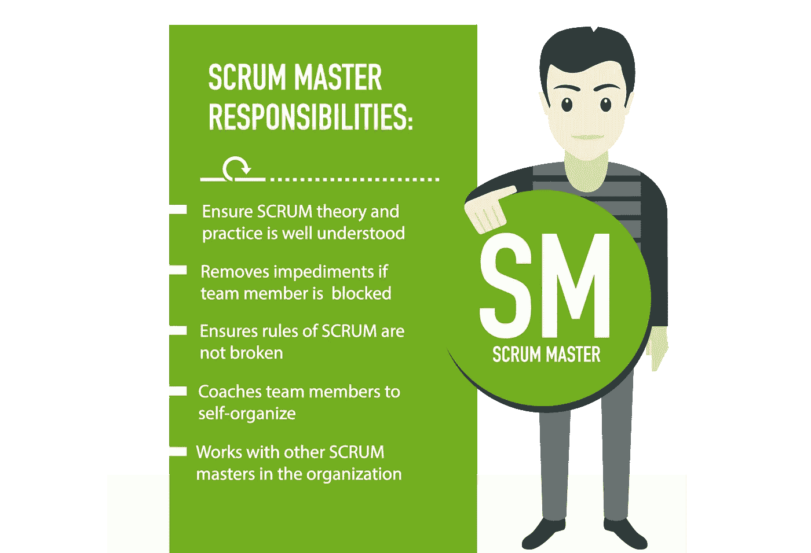
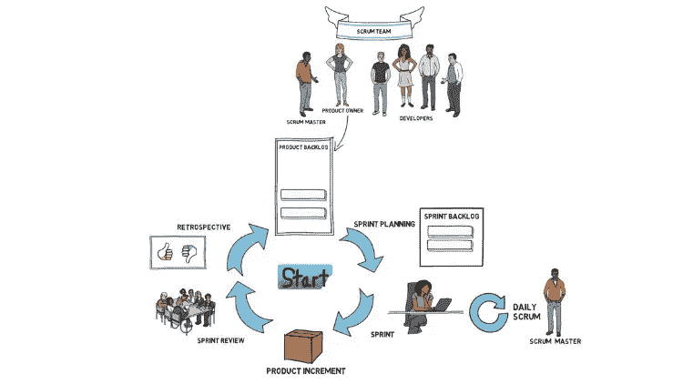
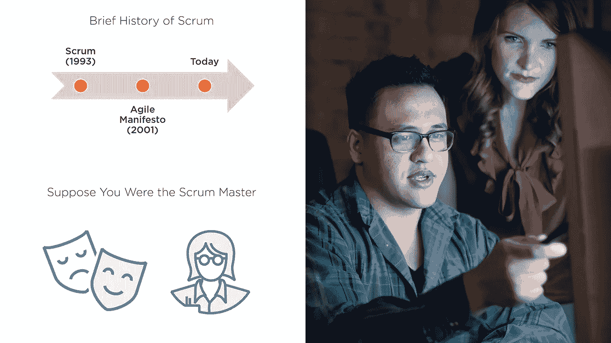
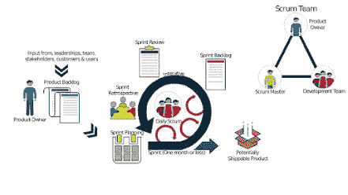

# 2023 年 7 门最佳专业 Scrum Master (PSM)认证培训课程和实践测试

> 原文：<https://medium.com/javarevisited/7-best-professional-scrum-master-psm-certification-training-courses-and-practice-tests-47f5bb4ef62e?source=collection_archive---------0----------------------->

## 准备专业 Scrum Master 认证？以下是准备这一著名认证考试的最佳资源、在线课程和模拟测试

image_credit —灰色校园

大家好，如果你想成为一名认证的 Scrum 大师并发展你的职业生涯，或者准备参加 2023 年的 Scrum 大师认证(PSM)并寻找最好的 Scrum 课程、课程、书籍和教程，那么你来对地方了。

*披露——顺便说一句，这些链接是附属链接，如果你使用我的链接加入这些课程，我可能会得到报酬。*

之前，我已经分享了 [**最佳敏捷& Scrum 课程**](/javarevisited/7-best-agile-and-scrum-online-training-courses-3b191e9b65eb) 和[书籍](https://www.java67.com/2020/06/top-5-books-to-become-scrum-master-in.html)，今天，我将分享 2023 年你可以参加的 Scrum Master 认证的最佳在线课程。

这些课程是从流行的学习网站中挑选出来的，如 [Udemy](https://click.linksynergy.com/deeplink?id=CuIbQrBnhiw&mid=39197&murl=https%3A%2F%2Fwww.udemy.com%2F) 、 [Pluralsight](https://click.linksynergy.com/deeplink?id=CuIbQrBnhiw&mid=39197&murl=https%3A%2F%2Fwww.udemy.com%2F) 和 [Edureka](https://click.linksynergy.com/deeplink?id=JVFxdTr9V80&mid=42536&murl=https%3A%2F%2Fwww.edureka.co%2F&LSNSUBSITE=LSNSUBSITE) ，它们是由也经历过同样的道路并已经获得 Scrum Master 认证的专家创建的。我还加入了 PSM 模拟测试，这对建立基于时间的考试所需的速度和准确性非常重要。

现代项目开发已经变得非常复杂。期望值高，交付时间少。这就是为什么从开始到结束仔细处理项目的每个方面是非常重要的。

敏捷在软件开发公司非常流行，Scrum 是一种管理项目的方法。它在财富 500 强公司和创业公司中被广泛用于管理产品开发，因为它让我们能够简单轻松地处理复杂的项目。

scrum master**是每个敏捷 scrum 模型项目的重要组成部分。scrum 大师是一种领导者，他确保项目正常进行，scrum 团队按预期执行。**

**检查团队和项目的进展是 scrum 主管的职责。这是一份非常吸引人的工作。一个人只有理解了责任，才能成为 scrum 大师。**

**Scrum 认证向雇主和客户展示了你的知识和能力，并证明你可以被信任来完成重要的商业目标，这就是为什么认证 Scrum Masters 非常受欢迎。**

**在这篇文章中，我分享了最好的在线培训课程，它将帮助你理解 scrum 大师的职责。这些课程也将帮助你清除 Scrum master 认证(PSM)。**

**2009 年，肯·施瓦布在推出[scrum.org](https://www.scrum.org)后，推出了专业 Scrum Master 或 PSM 考试。PSM 考试有三个级别。一级、二级和三级。**

**专业 Scrum Master Level One 测试被认为等同于认证 Scrum Master 测试，一旦你获得任何 PSM 证书，就不需要更新。**

**PSM I 考试难度适中，而 PSM II 和 PSM III 考试难度较高。对于 PSM One，您有 60 分钟时间回答 80 个问题，您需要答对 85%，即 68 个问题。考试费是 150 美元。**

**该列表还包括几个练习测试，以提高第一次尝试通过 PSM 认证考试所需的速度和准确性。**

# **2023 年 7 个最佳 Scrum Master 认证在线课程和练习测试**

**在不浪费你更多时间的情况下，这里列出了 Scrum Master Certification (PSM)的最佳在线课程，让你在第一次尝试时就能通过这个著名的考试。我还包括了 Scrum Master 认证的实践测试，因为它们对构建和第一次通过任何认证所需的速度和准确性至关重要。**

## **1. [Scrum 认证准备+Scrum 大师+敏捷 Scrum 培训](https://click.linksynergy.com/deeplink?id=CuIbQrBnhiw&mid=39197&murl=https%3A%2F%2Fwww.udemy.com%2Fcourse%2Fscrum-certification%2F)**

**注册学生超过 176000 人，这个在线 scrum 认证课程是 Udemy 上最受欢迎也是最畅销的 Scrum 大师课程。**

**在本课程中，讲师[保罗·阿顺](https://click.linksynergy.com/deeplink?id=CuIbQrBnhiw&mid=39197&murl=https%3A%2F%2Fwww.udemy.com%2Fuser%2Fpaulvii2%2F)涵盖了与 scrum、scrum master、敏捷和 scrum master 认证准备相关的所有重要概念。**

**这是一个初级课程，这意味着你不需要任何先决条件加入本课程，你可以从零开始学习两个小时的精彩视频内容。**

**我向任何想成为 Scrum 大师或准备 Scrum 认证考试的人强烈推荐这门课程。课程结构良好，讲师 Paul Ashun 在解释什么是 scrum 以及为什么它对于及时交付最复杂的项目如此强大方面做了出色的工作。**

****这里是加入本课程的链接**——[Scrum 认证预备+Scrum 大师+敏捷 Scrum 培训](https://click.linksynergy.com/deeplink?id=CuIbQrBnhiw&mid=39197&murl=https%3A%2F%2Fwww.udemy.com%2Fcourse%2Fscrum-certification%2F)**

****

## **2. [Scrum 初学者+ Scrum 大师认证准备](https://click.linksynergy.com/deeplink?id=CuIbQrBnhiw&mid=39197&murl=https%3A%2F%2Fwww.udemy.com%2Fcourse%2Fscrum-master-certification-preparation-mock-exam-questions-psm-i%2F)**

**这是 2023 年又一个畅销的 scrum master 认证备考 Udemy 课程。对于那些想要深入学习 scrum master 认证准备的人来说，这是一个理想的选择。**

**本课程不仅包含讲座，还包含超过 240 个练习题、提示、问答部分、scrum 网络研讨会等等，它也基于 Scrum Guide v 2020。**

**这个课程的创始人不是别人，正是 [**瓦伦丁·德斯帕**](https://click.linksynergy.com/deeplink?id=CuIbQrBnhiw&mid=39197&murl=https%3A%2F%2Fwww.udemy.com%2Fuser%2Fvalentin-despa%2F) ，广受欢迎的 Udemy 导师和邮递员大师之一。**

**我参加过他的 API 测试的 [Postman 课程](https://click.linksynergy.com/deeplink?id=CuIbQrBnhiw&mid=39197&murl=https%3A%2F%2Fwww.udemy.com%2Fcourse%2Fpostman-the-complete-guide%2F)，当时我不知道他也是一个认证的 Scrum 大师，有一个很棒的 Udemy 课程要准备 Scrum 认证。**

**同样，这是一个初级课程，没有任何先决条件要求加入本课程的总视频内容近七个小时。对于那些想准备 PSM 的人来说，这是一门极好的课程。**

****这里是加入本课程的链接** — [Scrum 初学者+ Scrum Master 认证准备](https://click.linksynergy.com/deeplink?id=CuIbQrBnhiw&mid=39197&murl=https%3A%2F%2Fwww.udemy.com%2Fcourse%2Fscrum-master-certification-preparation-mock-exam-questions-psm-i%2F)**

****

## **3. [Scrum Essentials 考试准备](https://pluralsight.pxf.io/c/1193463/424552/7490?u=https%3A%2F%2Fwww.pluralsight.com%2Fcourses%2Fscrum-essentials-exam-prep)【plural sight 最佳课程】**

**这是 Pluralsight 最受欢迎的 scrum master 认证准备课程之一。如果你不知道， [Pluralsight](https://pluralsight.pxf.io/c/1193463/424552/7490?u=https%3A%2F%2Fwww.pluralsight.com%2Flearn) 是另一个受欢迎的在线学习平台，提供专家和社区领袖的技术课程。**

**在本课程中，讲师 [William Davis](https://pluralsight.pxf.io/c/1193463/424552/7490?u=https%3A%2F%2Fwww.pluralsight.com%2Fauthors%2Fwilliam-davis) ，一位经验丰富的 scrum master、敏捷实践者和项目经理，他通过培训、辅导和指导软件开发团队来创造积极的转变，专注于 Scrum Master 要点，如果你想通过认证，理解这些要点是很重要的。**

**要求**

*   **敏捷知识。**
*   **scrum 和 scrum master 的基础知识。**

**是中级课程，视频内容总计三个小时。在本课程中，你将学习 Scrum 的基本知识，并为参加 Scrum.org 的专业 Scrum 大师一级考试做更好的准备。**

****这里是加入本课程的链接** — [Scrum Essentials 考试准备](https://pluralsight.pxf.io/c/1193463/424552/7490?u=https%3A%2F%2Fwww.pluralsight.com%2Fcourses%2Fscrum-essentials-exam-prep)**

****

**顺便说一下，你需要一个 [Pluralsight 会员](https://pluralsight.pxf.io/c/1193463/424552/7490?u=https%3A%2F%2Fwww.pluralsight.com%2Flearn)才能加入这个课程，费用大约是每月 29 美元或每年 299 美元(14%的折扣)。我向所有程序员强烈推荐这个订阅，因为它提供了超过 7000 个在线课程的即时访问，以学习任何技术技能。或者，你也可以使用他们的 [**10 天免费通行证**](https://pluralsight.pxf.io/c/1193463/424552/7490?u=https%3A%2F%2Fwww.pluralsight.com%2Flearn) 免费观看本课程。**

** [## 对个人来说

### Pluralsight 的使命一直是公平的技术竞争环境。不管你想学什么，或者…

pluralsight.pxf.io](https://pluralsight.pxf.io/c/1193463/424552/7490?u=https%3A%2F%2Fwww.pluralsight.com%2Flearn)** 

## **4. [Scrum Master 认证—练习试题](https://click.linksynergy.com/deeplink?id=JVFxdTr9V80&mid=39197&murl=https%3A%2F%2Fwww.udemy.com%2Fcourse%2Fscrum-master-certification-practice-test-questions%2F)**

**这是 2023 年专业 Scrum Master 认证(PSM)的最佳实践测试之一。这包含了 120 多个问题，分为六个不同的部分。如果你是去认证，那么这是一个极好的地方来测试你的知识。**

**这些问题与实际的认证非常相似，它一定会帮助你理解真正的考试。请记住，像 PSM1 和 CSM 考试这样的考试并不容易通过。**

**即使是一个人，目前处于 Scrum Master 的角色，也需要准备和学习，这就是这些在线课程和练习测试的帮助。**

**它有六个练习测试，你可以在真正考试之前用它们来测试你对 Scrum、敏捷和 scrum master 角色的知识。你也可以使用它们来找到你的强项和弱项，并提高第一次通过考试所需的速度和准确度。**

****这里是加入本练习测试** — [Scrum Master 认证—练习试题](https://click.linksynergy.com/deeplink?id=JVFxdTr9V80&mid=39197&murl=https%3A%2F%2Fwww.udemy.com%2Fcourse%2Fscrum-master-certification-practice-test-questions%2F)的链接**

****

## **5.[敏捷 Scrum 大师认证培训](http://shrsl.com/2y5vy)**

**这是来自 GreyCampus 的另一个讲师指导的培训项目，你可以用它来准备在线 Scrum Master 认证培训。**

**在项目管理领域，敏捷脱颖而出，成为快速迭代交付成果的最佳方法之一，尤其是对于软件产品。**

**Scrum 是一个敏捷框架，它将所涉及的工作分解成称为 sprint 的有时限的迭代，每个 sprint 专注于实现一个特定的目标，这个目标构成了产品增量的一部分**

**你可以参加这个敏捷 Scrum Master 培训课程，向我们的行业专家导师学习，并获得 EXIN 敏捷 Scrum Master 证书，考试券包含在课程中。**

**通过这个在线实时培训项目，你将掌握在敏捷(和 scrum)环境中工作所必需的知识和技能。**

****这里是参加在线培训的链接—** [敏捷 Scrum 大师认证培训](http://shrsl.com/2y5vy)**

****

## **6.[专业 Scrum Master (PSM)认证培训](https://click.linksynergy.com/deeplink?id=JVFxdTr9V80&mid=42536&murl=https%3A%2F%2Fwww.edureka.co%2Fprofessional-scrum-master-psm-certification-training&LSNSUBSITE=LSNSUBSITE)【edu reka】**

**这是 Edureka 最受欢迎的专业 Scrum Master (PSM)认证准备课程。这是一门现场课堂讲师指导课程。在这个课程中，讲师会解释什么是敏捷和 scrum，以及 scrum 大师的职责是什么。**

**对于那些想通过 PSM 考试的人来说，这是一门极好的课程。同样，这是初级课程，没有参加本课程的先决条件。 [Edureka](https://click.linksynergy.com/deeplink?id=JVFxdTr9V80&mid=42536&murl=https%3A%2F%2Fwww.edureka.co%2F&LSNSUBSITE=LSNSUBSITE) 的 USP 是你可以在网上参加的由合格讲师指导的现场培训课程。**

**这个为期两天的专业 Scrum Master(PSM)在线培训课程涵盖了指导 Scrum 框架的原则和过程理论。本课程结合了指导和基于团队的练习，教授 Scrum 和敏捷运动的核心内容。**

****这里是参加本次培训课程** — [专业 Scrum Master (PSM)认证培训](https://click.linksynergy.com/deeplink?id=JVFxdTr9V80&mid=42536&murl=https%3A%2F%2Fwww.edureka.co%2Fprofessional-scrum-master-psm-certification-training&LSNSUBSITE=LSNSUBSITE)的链接**

****

## **7.[证书准备:Scrum Master](http://linkedin-learning.pxf.io/c/1193463/449670/8005?u=https%3A%2F%2Fwww.linkedin.com%2Flearning%2Fcert-prep-scrum-master)【LinkedIn Learning】**

**这是另一个流行的在线学习平台 [LinkedIn Learning](http://linkedin-learning.pxf.io/c/1193463/449670/8005) 的高级课程之一，为 Scrum Master 认证做好准备。**

**由敏捷培训师和教练 Kelly O'Connel 创建，这个课程将教你通过几个领先的 scrum master 考试所需要学习的基础知识。**

**您还将了解 scrum 团队的角色和职责，不同类型的 scrum 事件，以及 scrum 生命周期中产生的工件。另外，学习 scrum masters 如何使用燃尽图和其他报告来跟踪他们项目的进展。**

**课程结束时，你将了解 scrum 的基础，并准备好参加考试，享受认证带来的好处和更多的职业机会。**

****以下是加入本课程的链接—** [证书准备:Scrum Master](http://linkedin-learning.pxf.io/c/1193463/449670/8005?u=https%3A%2F%2Fwww.linkedin.com%2Flearning%2Fcert-prep-scrum-master)**

****

**顺便说一下，你需要 LinkedIn Learning 会员才能观看这门课程，每月费用约为 19.99 美元，但你也可以通过参加他们的 [**1 个月免费试用**](http://linkedin-learning.pxf.io/c/1193463/449670/8005?u=https%3A%2F%2Fwww.linkedin.com%2Flearning%2Fsubscription%2Fproducts) 来免费观看这门课程，这是探索他们 16000 多门最新技术在线课程的好方法。**

 **[## LinkedIn Learning 免费试用和订阅价格

### 从初级到高级的 20，000 多门由专家指导的个性化优质内容课程。基于社区的…

linkedin-learning.pxf.io](http://linkedin-learning.pxf.io/c/1193463/449670/8005?u=https%3A%2F%2Fwww.linkedin.com%2Flearning%2Fsubscription%2Fproducts)** 

**以上就是 2023 年通过 Scrum Master 认证考试的**最佳课程**。老实说，通过专业 Scrum Master 认证是一项艰巨的任务，但是如果你有适当的知识，你可以毫无问题地通过。**

**到目前为止，我已经向您展示了 PSM 的最佳在线培训课程和实践测试。这些课程选自著名的教育网站，如 [Udemy](/javarevisited/15-best-udemy-courses-programmers-can-buy-on-black-friday-and-cyber-monday-2020-a803874f41d9) 、 [Pluralsight](http://pluralsight.pxf.io/c/1193463/424552/7490?u=https%3A%2F%2Fwww.pluralsight.com%2Flearn) 、GreyCampus 和 Edureka。所以，仔细阅读这些课程，并做出相应的选择。**

**你可能喜欢的其他软件开发文章**

*   **[深入了解 JIRA 的 5 门最佳课程](/javarevisited/6-best-online-courses-to-learn-jira-for-beginners-and-experienced-it-professionals-4a21fb014520)**
*   **[面向 Java 和 DevOps 专业人员的 10 门免费 Docker 课程](https://javarevisited.blogspot.sg/2018/02/10-free-docker-container-courses-for-Java-Developers.html)**
*   **[2023 年学习 Kubernetes 的 7 门免费在线课程](/javarevisited/7-free-online-courses-to-learn-kubernetes-in-2020-3b8a68ec7abc)**
*   **[2023 年 DevOps 开发者路线图](/hackernoon/the-2018-devops-roadmap-31588d8670cb)**
*   **[学习亚马逊网络服务我最喜欢的课程](/javarevisited/top-10-courses-to-learn-amazon-web-services-aws-cloud-in-2020-best-and-free-317f10d7c21d)**
*   **[学习 Docker、Kubernetes 和 Jenkins 的 10 门免费课程](/javarevisited/top-10-free-courses-to-learn-jenkins-docker-and-kubernetes-for-devops-in-2020-best-of-lot-62a0541ffeb3)**
*   **[我最喜欢的为有经验的人学习 DevOps 的课程](https://javarevisited.blogspot.com/2018/09/10-devops-courses-for-experienced-java-developers.html)**
*   **[5 个免费弹簧框架和 Spring Boot 课程](http://www.java67.com/2017/11/top-5-free-core-spring-mvc-courses-learn-online.html)**
*   **[初学者学习 Azure 平台的 10 门最佳课程](/javarevisited/10-best-microsoft-azure-courses-for-beginners-and-experienced-developers-d41a454834c0)**
*   **[面向程序员的 10 门 Docker 和 Kubernetes 课程](https://dev.to/javinpaul/top-10-courses-to-learn-docker-and-kubernetes-for-programmers-4lg0)**
*   **[程序员学习 AWS 和云的 10 门免费课程](/javarevisited/top-10-courses-to-learn-amazon-web-services-aws-cloud-in-2020-best-and-free-317f10d7c21d)**

**感谢阅读到目前为止。如果你喜欢这些在 2023 年*破解 Scrum Master 认证的最佳在线课程*，那么请与你的朋友和同事分享。如果您有任何问题或反馈，请留言。

**p . s .**——如果你热衷于学习敏捷和 Scrum 方法论，但正在寻找免费的在线课程，那么你也可以看看 Udemy 上的这个[**Scrum:1 小时学会 Scrum 基础知识【Scrum Guide】**](https://click.linksynergy.com/deeplink?id=CuIbQrBnhiw&mid=39197&murl=https%3A%2F%2Fwww.udemy.com%2Fcourse%2Fscrum-learn-the-scrum-basics-in-1-hour-agile-scrum%2F)课程。在这些免费的在线课程中，你将学到敏捷和 Scrum 的基础知识。**

** [## 免费的 Scrum 教程- Scrum:在 1 小时内学习 Scrum 基础知识[Scrum 指南]

### 在我告诉你为什么之前，让我先自我介绍一下...嗨，我叫弗拉基米尔·雷科夫，我是一名认证的 Scrum…

udemy.com](https://click.linksynergy.com/deeplink?id=CuIbQrBnhiw&mid=39197&murl=https%3A%2F%2Fwww.udemy.com%2Fcourse%2Fscrum-learn-the-scrum-basics-in-1-hour-agile-scrum%2F)**