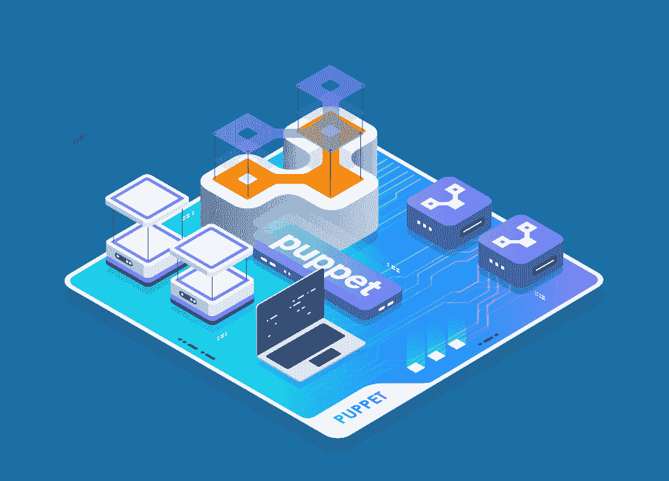
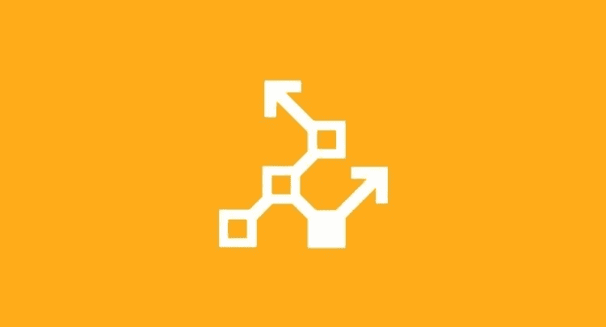

# 2022 年学习 Puppet for infra structure Automation 和 DevOps 的 7 门最佳课程

> 原文：<https://medium.com/javarevisited/7-best-puppet-online-courses-for-system-administrators-and-devops-engineers-889b5ab8aeca?source=collection_archive---------1----------------------->

## 我最喜欢的在线课程是从 Udemy、Pluralsight、Coursera 和 LinkedIn Learning 学习 Puppet for infra structure automation 和 DevOps。

image_credit — Udemy

大家好，如果你对 DevOps 感兴趣，那么你可能听说过 Puppet，它是最流行的基础设施自动化工具之一。如果你想学习木偶和寻找最好的木偶课程，那么你来对地方了。

之前我已经分享了 [**最佳 DevOps 课程**](/javarevisited/13-best-courses-to-learn-devops-for-senior-developers-in-2020-a2997ff7c33c) 和 [**最佳 Ansible 课程**](/javarevisited/5-best-ansible-courses-for-devops-engineers-cc87692fdf52) ，今天我要分享的是*最佳木偶课程*你可以加入学习这个有用的 DevOps 和配置管理工具。

毫不奇怪，自动化和流程编排使生活变得非常简单，无论是小型组织还是拥有数百台服务器的大型行业，而 *Puppet 在基础架构自动化中扮演着重要角色，如创建和配置应用服务器*。

Puppet 是 [DevOps](https://javarevisited.blogspot.com/2020/04/top-5-books-to-learn-devops-for-developers.html) 中最受欢迎的配置管理和 IT 自动化工具之一，用于管理 IT 基础架构生命周期的各个阶段，包括跨企业数据中心和云基础架构的操作系统和应用程序组件的供应、修补、配置和管理。

正如我所说的，如果你对学习木偶感兴趣，并寻找一些很棒的资源，如书籍、课程和教程，那么你来对地方了。在这篇文章中，我将分享一些学习木偶的最好的在线课程。

[木偶](https://puppet.com/)是一个革命性的工具，允许你以编程的方式创建你的环境。这意味着你可以将你的基础设施视为代码，你可以将它们存储在 [GitHub](https://www.java67.com/2019/04/top-5-courses-to-learn-git-and-github.html) 上，你可以对它们进行版本化，你可以使用部署工具对它们进行部署。您可以设置您的服务器，安装所需的软件，并使用 Puppet 保持对它的访问。它非常类似于 [Ansible](https://javarevisited.blogspot.com/2019/11/top-5-course-to-learn-ansible-for-devops.html) 这样的工具，也是一个重要的 DevOps 工具。

Puppet 使设置新服务器变得非常容易，因为您不需要手动进入每台服务器并下载和安装所需的软件。您还可以为 web 服务器和数据库服务器创建不同的配置，Puppet 将负责安装不同的软件，创建必要的目录，并相应地设置环境。

Puppet 还有助于简化服务器管理工作，允许管理员标准化基础设施并使其保持所需状态。

在 Puppet 的帮助下，人们可以轻松地管理成百上千的服务器，所有的服务器都有相同的设置。对于面向 DevOps 的组织来说，这是必须的。

# 2022 年面向初学者和经验丰富的工程师的 7 门 Puppet 在线课程

在不浪费你更多时间的情况下，这里列出了开发者和 DevOps 工程师学习 Puppet 的最佳课程。这包括来自 [Udemy](https://click.linksynergy.com/deeplink?id=CuIbQrBnhiw&mid=39197&murl=https%3A%2F%2Fwww.udemy.com%2F) 、 [Pluralsight](https://pluralsight.pxf.io/c/1193463/424552/7490?u=https%3A%2F%2Fwww.pluralsight.com) 、 [Coursera](https://click.linksynergy.com/deeplink?id=JVFxdTr9V80&mid=40328&murl=https%3A%2F%2Fwww.coursera.org%2F) 和其他流行的在线学习平台的初级和中级木偶课程。

## 1.绝对初学者的木偶——动手

这是我向任何想学木偶的人建议的第一个课程。这是一门实践课程，向初学者介绍了 Puppet 的基本原理，通过简单的实践练习，您可以直接在浏览器中练习。

该课程由[kode cloud Training](https://click.linksynergy.com/deeplink?id=CuIbQrBnhiw&mid=39197&murl=https%3A%2F%2Fwww.udemy.com%2Fuser%2Fkodekloud%2F)和 Yogesh Raheja 创建，它介绍了 Puppet 的基本用例，随后介绍了 Puppet 设置、架构、Puppet 资源、类、清单、配置文件、事实等。

这个课程最好的一点是，每个讲座都伴随着一套编码练习，让用户在开发 Puppet Manifest 文件方面有一个实践经验。

这门课程的另一个好处是，大部分讲座都有动画幻灯片支持，这使得它简单易懂。这是唯一提供编码练习的课程，您可以在浏览器中练习 Puppet 清单文件。

**这里是加入这个课程的链接** — [木偶绝对初学者](https://click.linksynergy.com/deeplink?id=JVFxdTr9V80&mid=39197&murl=https%3A%2F%2Fwww.udemy.com%2Fcourse%2Flearn-puppet%2F)

如果你是一名[软件开发人员](https://javarevisited.blogspot.com/2019/01/10-things-every-programmer-and-software-engineer-should-know.html)或 [DevOps enginee](https://javarevisited.blogspot.com/2018/09/the-2018-devops-roadmap-your-guide-to-become-DevOps-Engineer.html) r，我向任何想快速学习 Puppet 的人强烈推荐这门课程。

## 2.[系统管理员的傀儡基础](https://pluralsight.pxf.io/c/1193463/424552/7490?u=https%3A%2F%2Fwww.pluralsight.com%2Fcourses%2Fpuppet-system-administrators-fundamentals)【plural sight】

这是另一个从零开始学习木偶工具的最好的在线课程。您将学习如何部署和使用 Puppet 来自动化 Windows 和 [Linux](/javarevisited/top-10-courses-to-learn-linux-command-line-in-2020-best-and-free-f3ee4a78d0c0?source=collection_home---4------0-----------------------) 的配置管理和软件部署。

这个课程的好处是不需要编程经验，这使得它非常适合需要处理 Puppet 清单的系统管理员和支持专业人员。

本课程涵盖了基本的木偶概念，如清单、模块、模板、Hiera、角色、配置文件和使用 [Git](/javarevisited/7-best-courses-to-master-git-and-github-for-programmers-d671859a68b2?source=---------9------------------) 的版本控制。我强烈推荐这个课程给想和 Puppet 一起学习一点编程的支持和 IT 专业人员。

**这里是加入本课程的链接** - [面向系统管理员的木偶基础](https://pluralsight.pxf.io/c/1193463/424552/7490?u=https%3A%2F%2Fwww.pluralsight.com%2Fcourses%2Fpuppet-system-administrators-fundamentals)

或者，你也可以加入 Pluralsight，它费用不高，并提供超过 5000 多门关于最新技术的在线课程。

年度会员折扣为 299 美元(14%)，高级会员为 499 美元，其中还包括测验、练习和评估。你也可以使用他们的 [1 **0 天免费试用**](https://pluralsight.pxf.io/c/1193463/424552/7490?u=https%3A%2F%2Fwww.pluralsight.com%2Flearn) 来免费访问本课程。

 [## Pluralsight |个人免费试用

### 刚刚通过#思科 DEVASC 200-901 考试！考试很难，但这是一次很棒的经历。我很高兴能成为……

pluralsight.pxf.io](https://pluralsight.pxf.io/c/1193463/424552/7490?u=https%3A%2F%2Fwww.pluralsight.com%2Fpricing%2Ffree-trial) 

## 3.[木偶入门](https://click.linksynergy.com/deeplink?id=JVFxdTr9V80&mid=39197&murl=https%3A%2F%2Fwww.udemy.com%2Fcourse%2Fgetting-started-with-puppet%2F)【我的课程】

如果由于某种原因，您可能无法联系以前课程的讲师并寻找更多替代课程，那么您可以在 [Udemy](/javarevisited/10-best-udemy-online-courses-for-java-developers-4c9ab70cd01f) 上查看该课程。这类似于以前的课程，但讲师的风格不同，您可能会发现它更有吸引力。

在 [Udemy](https://click.linksynergy.com/deeplink?id=CuIbQrBnhiw&mid=39197&murl=https%3A%2F%2Fwww.udemy.com%2F) 上的这个最好的 Puppet 课程中，你将学习如何使用 Puppet 自动化 IT 配置管理。您将了解自动化如何发挥作用，以及为什么基础设施自动化在当今快速变化的数字世界中必不可少。

这个课程也是动手性很强，充满了实际的场景和例子。完成课程后，你有足够的知识、技能和信心开始实施 Puppet 项目和 IT 基础设施。

Udemy 课程也非常有助于了解 Puppet 的基础知识，这将有助于每个个体开始了解这个工具的威力，并开始使用它。由于大部分概念都是用实时的例子来解释的，所以对每个人来说，非常清楚地理解这些概念将是非常有帮助的。

**以下是加入本课程** — [木偶入门](https://click.linksynergy.com/deeplink?id=JVFxdTr9V80&mid=39197&murl=https%3A%2F%2Fwww.udemy.com%2Fcourse%2Fgetting-started-with-puppet%2F)的链接

## 4.[学习路径:Ansible、Puppet 和 Salt 的自动化](https://click.linksynergy.com/deeplink?id=JVFxdTr9V80&mid=39197&murl=https%3A%2F%2Fwww.udemy.com%2Fcourse%2Flearning-path-automation-with-ansible-puppet-and-salt%2F)

本课程与之前专注于 Puppet 的课程略有不同，相反，本课程涵盖了所有流行的基础架构自动化工具，如 [Ansible](/javarevisited/5-best-ansible-courses-for-devops-engineers-cc87692fdf52) 、Puppet 和 Salt，它们可以帮助您创建可扩展、可靠且安全的 it 环境。

本课程的目的是向您介绍 Ansible、Puppet 和 Salt 的基础设施自动化，解释它们的优势，以及您如何使用这些工具有效地自动化您的 IT 基础设施。

本课程以循序渐进的方式讲述了[易变](https://javarevisited.blogspot.com/2019/11/top-5-course-to-learn-ansible-for-devops.html)、[傀儡](https://javarevisited.blogspot.com/2020/05/top-5-puppet-courses-for-programmers-and-devops-engineers.html)和[盐](https://javarevisited.blogspot.com/2021/11/top-5-online-courses-to-learn-chef-and-salt.html)的原因和方式。最初，您将关注 Ansible。您将学习如何在 Ansible 中管理环境和实施策略，并了解 Ansible Galaxy 和 Tower，这是 Ansible 用于支持大规模基础设施的企业工具。

之后，你将获得 about Puppet，这是一款配置管理工具，可以让你自动化所有的 IT 配置。使用 Puppet 你可以控制网络中的每一个傀儡代理。

**以下是加入本课程的链接** — [学习路径:Ansible、Puppet 和 Salt 的自动化](https://click.linksynergy.com/deeplink?id=JVFxdTr9V80&mid=39197&murl=https%3A%2F%2Fwww.udemy.com%2Fcourse%2Flearning-path-automation-with-ansible-puppet-and-salt%2F)

本课程非常适合有经验的开发人员和开发人员工程师，他们希望在专注于任何特定产品之前分析 Puppet、Ansible 和 Salt。

## 5.木偶 5——完全初学者指南

这是 Udemy 上学习木偶最好最全面的课程之一。无论你是初学者还是有一些使用 Puppet 的经验，本课程都将让你开始使用 Puppet 5

的最新功能。本课程对开发人员和 [DevOps 工程师](https://javarevisited.blogspot.com/2018/09/10-devops-courses-for-experienced-java-developers.html)都很有用，因为你将学习如何安装包和配置文件、创建用户、设置计划作业、提供云实例、构建容器等等。

本课程最棒的地方在于，本课程中的每一个例子都涉及到一些你在工作中可能需要的真实而实用的东西，你会看到让它发生的完整的木偶代码，以及你将看到的关于键入什么和输出什么的逐步说明。

总之，从零开始学习木偶最好的课程之一。

**以下是加入本课程的链接** — [木偶 5 —完全初学者指南](https://click.linksynergy.com/deeplink?id=JVFxdTr9V80&mid=39197&murl=https%3A%2F%2Fwww.udemy.com%2Fcourse%2Fpuppet-5-the-complete-beginners-guide%2F)

## 6.[木偶基础训练](http://linkedin-learning.pxf.io/c/1193463/449670/8005?u=https%3A%2F%2Fwww.linkedin.com%2Flearning%2Fpuppet-essential-training)【领英学习】

这是 2022 年学习基础设施和服务器自动化木偶工具的又一个很棒的课程。这是一门中级课程，可在 LinkedIn Learning 的热门网站 LinkedIn Learning 上找到。

在本课程中，与讲师 Josh Samuelson 一起深入探讨这一 IT 自动化平台，涵盖核心概念和高级主题。Josh 解释了如何使用 Hiera 安全地将数据从代码中分离出来，使用 RSpec-puppet 进行测试，使用 Travis CI 进行自动化测试，创建一个模块，等等。

在整个课程中，您还会发现一些实用的练习，可以帮助您快速掌握这套强大的工具。完成本课程后，您还将获得结业证书。

**这里是加入本课程**——[木偶基础训练](http://linkedin-learning.pxf.io/c/1193463/449670/8005?u=https%3A%2F%2Fwww.linkedin.com%2Flearning%2Fpuppet-essential-training)的链接

顺便说一下，你需要 LinkedIn Learning 会员才能观看这门课程，每月费用约为 19.99 美元，但你也可以通过参加他们的 [**1 个月免费试用**](http://linkedin-learning.pxf.io/c/1193463/449670/8005?u=https%3A%2F%2Fwww.linkedin.com%2Flearning%2Fsubscription%2Fproducts) 来免费观看这门课程，这是探索他们 16000 多门最新技术在线课程的好方法。

 [## LinkedIn Learning 免费试用和订阅价格

### 从初级到高级的 17，000 多门专家指导课程的个性化、高质量内容。基于社区的…

linkedin-learning.pxf.io](http://linkedin-learning.pxf.io/c/1193463/449670/8005?u=https%3A%2F%2Fwww.linkedin.com%2Flearning%2Fsubscription%2Fproducts) 

## 7.[配置管理与云](https://coursera.pxf.io/c/3294490/1164545/14726?u=https%3A%2F%2Fwww.coursera.org%2Flearn%2Fconfiguration-management-cloud)【Coursera 最佳课程】

这是一个有点不同的实用课程，在这里你将学习如何使用 Puppet 来管理 Google 云平台上的计算机群。这门课程是由谷歌提供的，它是拥有 Python 专业证书的谷歌 it 自动化的一部分。

这个 Coursera 课程将教你如何自动化部署新计算机的过程，保持这些机器的更新，管理大规模的变化等等。您将学习管理在本地运行的物理机和在云中运行的虚拟机。

您还将学习一种叫做配置管理的自动化技术，它可以让您大规模地管理我们计算机的配置。您将学习如何使用 Puppet，它是当前配置管理的行业标准。您还将看到学习基本概念以及如何将它们应用于复杂场景的示例。

**这是参加本课程** — [配置管理和云](https://click.linksynergy.com/deeplink?id=JVFxdTr9V80&mid=40328&murl=https%3A%2F%2Fwww.coursera.org%2Flearn%2Fconfiguration-management-cloud)的链接

顺便说一句，如果你觉得 Coursera 的课程有用，因为它们是由世界各地知名的公司和大学创建的，我建议你加入 Coursera Plu**s**的订阅计划，这是 Coursera 的一个订阅计划，让你可以无限制地访问他们最受欢迎的课程、专业、专业证书和指导项目。

 [## Coursera Plus |无限制访问 7，000 多门在线课程

### 用 Coursera Plus 投资你的职业目标。无限制访问 90%以上的课程、项目…

coursera.pxf.io](https://coursera.pxf.io/c/3294490/1164545/14726?u=https%3A%2F%2Fwww.coursera.org%2Fcourseraplus) 

这就是在软件开发世界中学习 Puppet for infrastructure 和 deployment automatio 的一些最好的课程。这是 DevOps 工程师实现基础设施自动化的最佳工具之一。

Puppet 使得为您的应用程序设置所需软件的服务器变得非常容易，它还确保了服务器中始终存在具有正确版本的必要软件，这样您就不会因为补丁或安全更新而感到意外。

你可能喜欢的其他**开发运维、云计算和编程课程**

*   [完整的 DevOps 开发者路线图](/hackernoon/the-2018-devops-roadmap-31588d8670cb)
*   [面向 Java 和 DevOps 专业人员的 10 门免费 Docker 课程](https://javarevisited.blogspot.sg/2018/02/10-free-docker-container-courses-for-Java-Developers.html)
*   [学习 Jenkins 自动化和开发运维的 5 大课程](https://javarevisited.blogspot.com/2018/09/top-5-jenkins-courses-for-java-and-DevOps-Programmers.html)
*   [面向程序员的 10 门 Docker 和 Kubernetes 课程](https://dev.to/javinpaul/top-10-courses-to-learn-docker-and-kubernetes-for-programmers-4lg0)
*   [学习云计算的 10 门 Coursera 课程](https://javarevisited.blogspot.com/2020/08/top-10-coursera-certifications-to-learn-cloud-computing-aws.html#axzz6Whc3u9tL)
*   [2022 年学习 Kubernetes 的 7 门免费在线课程](/javarevisited/7-free-online-courses-to-learn-kubernetes-in-2020-3b8a68ec7abc)
*   [通过 Azure 基础考试的 5 门最佳课程](/javarevisited/5-best-azure-fundamentals-courses-to-pass-az-900-certification-exam-in-2020-9e602aea035d)
*   [10 个面向开发者的 DevOps 培训课程](https://dev.to/javinpaul/top-10-devops-training-courses-for-programmers-and-software-developers-195n)
*   [程序员学习 Docker 和 AWS 的 15 门最佳课程](/javarevisited/top-15-online-courses-to-learn-docker-kubernetes-and-aws-for-fullstack-developers-and-devops-d8cc4f16e773?source=collection_home---4------1-----------------------)
*   [2022 年 Java 开发人员应该学习的 10 种工具](http://www.java67.com/2018/04/10-tools-java-developers-should-learn.html)
*   [初学者学习 DevOps 的 5 大课程](https://www.java67.com/2020/06/top-5-courses-to-learn-devops-in-2020.html)
*   [程序员学习 AWS 和云的 10 门免费课程](/javarevisited/top-10-courses-to-learn-amazon-web-services-aws-cloud-in-2020-best-and-free-317f10d7c21d)

感谢您阅读本文。如果您发现这些*最佳 Puppet 和配置管理课程*在学习 Puppet 概念和自动化您的服务器配置方面很有用，那么请与您的朋友和同事分享。如果您有任何问题或反馈，请留言。

**P. S.** —如果您是 DevOps 和配置管理的新手，并且需要一些免费的在线课程来学习 Puppet 和配置管理，那么您也可以查看 Udemy 上的这个[**Puppet Fundamentals[FREE]**](https://click.linksynergy.com/deeplink?id=CuIbQrBnhiw&mid=39197&murl=https%3A%2F%2Fwww.udemy.com%2Fcourse%2Fscm_puppet%2F)，免费学习基本的 Puppet 概念。

 [## 免费木偶软件教程-木偶基础

### 在软件工程中，软件配置管理(SCM 或 S/W CM)是跟踪和控制

udemy.com](https://click.linksynergy.com/deeplink?id=CuIbQrBnhiw&mid=39197&murl=https%3A%2F%2Fwww.udemy.com%2Fcourse%2Fscm_puppet%2F)