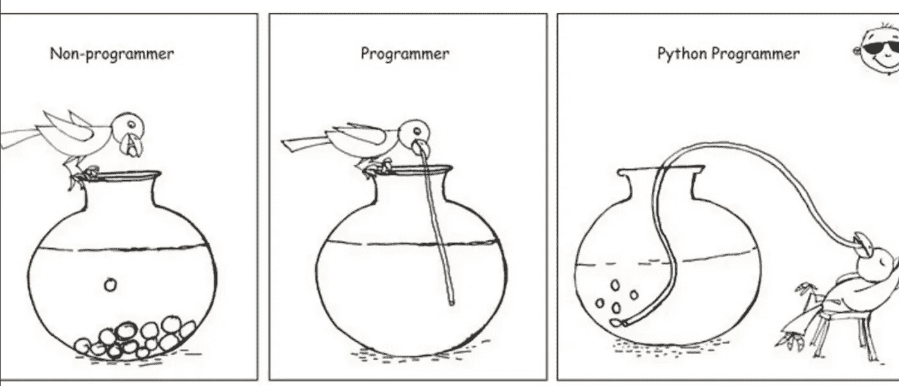
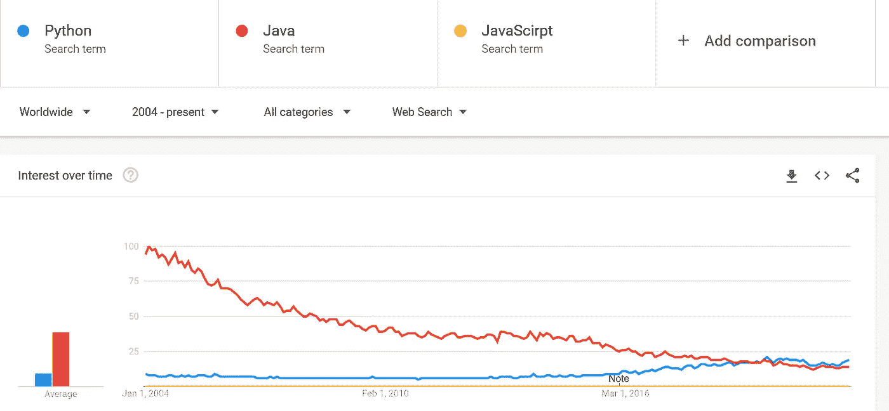
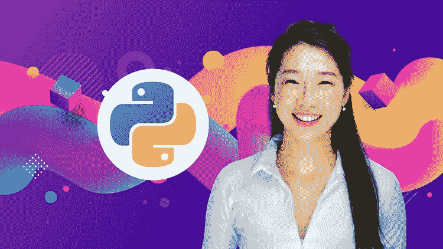
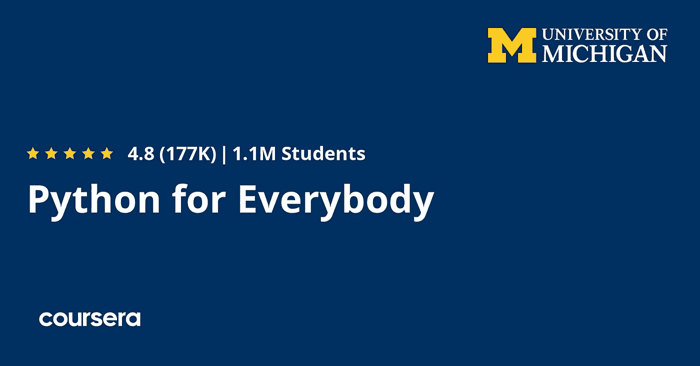
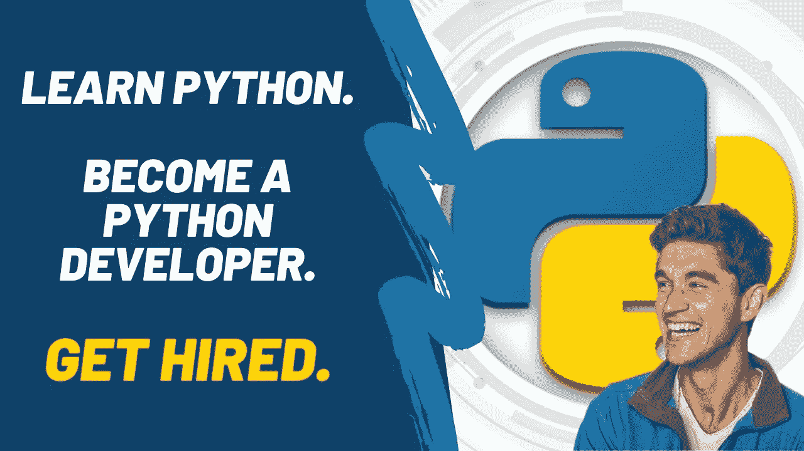
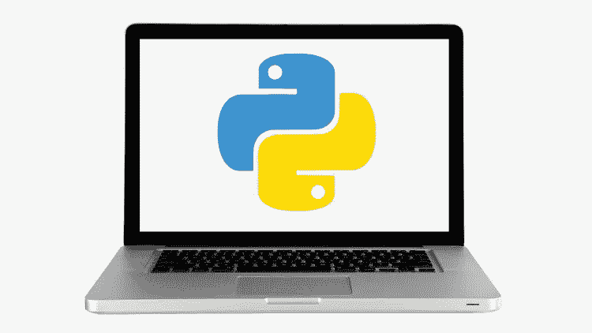
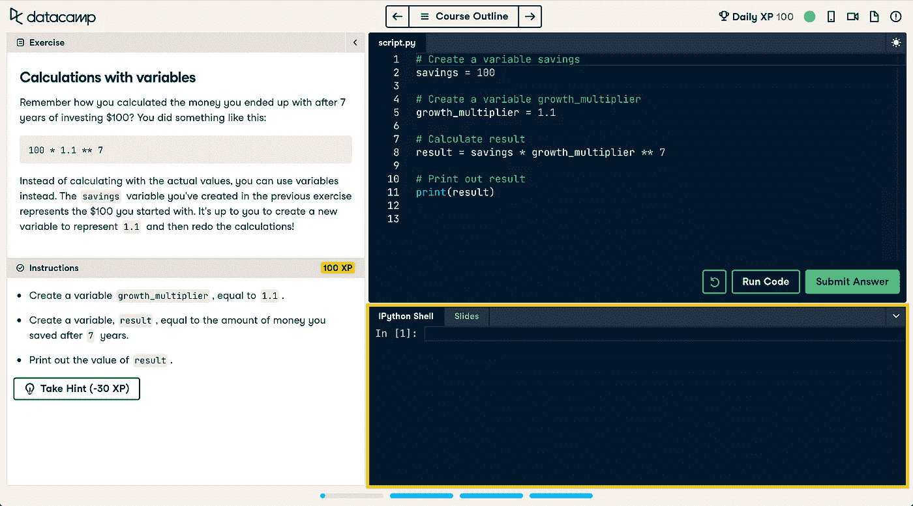
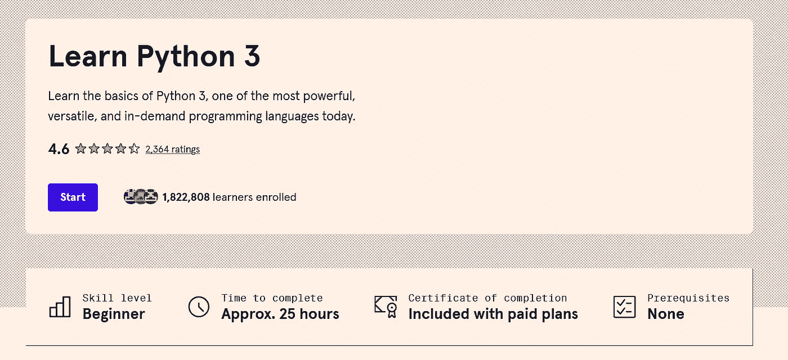
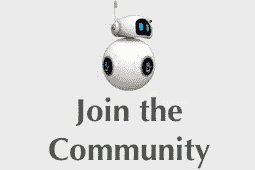

# 2023 年面向初学者和有经验开发者的 11 门最佳 Python 在线课程。

> 原文：<https://medium.com/javarevisited/7-best-python-online-courses-for-beginners-to-learn-programming-abe12cecb1ad?source=collection_archive---------0----------------------->

## Udemy、Coursera、edX、Pluralsight 和 ZTM 学院为 2023 年学习在线编程的初学者精心策划的最佳 Python 课程列表

大家好，Python 是科技界最好的编程语言之一，如果你想成为软件开发人员、数据科学家、Web 开发人员或机器学习工程师，它是一个很好的工具。

由于其日益增长的受欢迎程度，越来越多的人正在学习 Python，但与此同时，他们也在努力寻找最好的资源来以有指导和结构化的方式学习 Python 。

作为一个技术博客的作者，我经常收到类似这样的问题:我如何学习 Python，*学习 Python 的最好方法是什么？*你能推荐一下[学习 Python 的最佳资源](https://javarevisited.blogspot.com/2019/09/5-websites-to-learn-python-for-free.html)吗，或者我是否应该参加 Udemy 或 Coursera 的在线课程来学习 Python 等等？

在逐一回答后，我发现在线课程是学习 Python 的最佳方式，如果你想在 2023 年学习 Python 编程语言并寻找最好的 Python 课程，那么你来对地方了。

以前我也分享过很多类似这些[免费 Python 书籍](https://www.java67.com/2017/05/top-7-free-python-programming-books-pdf-online-download.html)、[教程](https://dev.to/javinpaul/top-5-places-to-learn-python-programming-for-free-m4c)、[课程](https://javarevisited.blogspot.com/2018/12/10-free-python-courses-for-programmers.html)、[专精](https://javarevisited.blogspot.com/2020/02/10-best-coursera-courses--for-python.html)、[认证](/javarevisited/10-best-python-certification-courses-from-coursera-4576890eb6b3)、 [Python 项目](/javarevisited/8-projects-you-can-buil-to-learn-python-in-2020-251dd5350d56?source=---------6------------------)等免费资源，但是你们很多人要求在 2023 年掌握这个关键编程技能需要更全面更高级的 Python 课程。

在互联网上有很多学习 Python 的资源，比如这些最好的 Python 书籍</javarevisited/best-python-books-a93d1a0d842d>*、教程、[平台](https://javarevisited.blogspot.com/2019/09/5-websites-to-learn-python-for-free.html)、[网站](/javarevisited/10-free-python-tutorials-and-courses-from-google-microsoft-and-coursera-for-beginners-96b9ad20b4e6)，包括免费和付费的在线课程，唯一的问题是找到合适的课程，因为很容易陷入过时的资源中。*

*这就是为什么我们从像 [Udemy](https://javarevisited.blogspot.com/2019/08/top-10-udemy-courses-and-certifications-for-programmers.html) 、 [Coursera](/javarevisited/pluralsight-or-udemy-d9a94d2e8ee) 、 [edX](/javarevisited/10-free-best-edx-certifications-and-courses-to-learn-online-3473d466f968) 和 [Pluralsight](https://javarevisited.blogspot.com/2017/12/top-10-pluralsight-courses-java-and-web-developers.html) 这样的平台中挑选了**几门高级 Python 在线培训课程**，帮助你从最好的资源中学习 Python。*

*如果你是从零开始学习 python，或者你有一些 Python 编程语言的知识，但是想把你的 [Python 技能](/javarevisited/10-best-and-free-datacamp-courses-to-learn-python-and-data-skills-in-2021-39e42682fd76)提升到一个新的水平，这些在线培训课程可以帮助你。*

*这些课程由 Python 专家打造，受到全球超过 100 万 [*Python 开发者*](/javarevisited/top-10-courses-to-learn-python-for-web-development-in-2020-best-of-lot-efe11fb6d212) 的信赖。这些只是深入学习 Python 的最佳课程中的最佳课程。它们对于初学者和有经验的 Python 开发人员同样适用。*

*根据 StackOverflow 等各种网站，survey[**Python**](/swlh/5-free-python-courses-for-beginners-to-learn-online-e1ca90687caf)是过去几年最成功的编码语言之一。由于 Python 编程语言的通用性，对 Python 开发人员或各种经验的要求很高。*

*例如，同时作为一种高级编程语言，也用于一般用途，如 [AI](https://www.java67.com/2019/11/top-5-artificial-intelligence-courses.html) 和[数据可视化](https://javarevisited.blogspot.com/2019/09/top-5-courses-to-learn-d3js-best.html)以及构建 web 应用程序。Python 也是一种面向对象的语言和开源语言，因此它有一个庞大的社区来共同开发一种漂亮的编程语言。*

*现在世界上许多开发人员都开始使用 [Python](https://www.java67.com/2017/05/top-7-free-python-programming-books-pdf-online-download.html) ，因为它简单，就像创建 GUI 应用程序、网站和移动应用程序一样。*

*我还选择了**动手**和**基于项目的课程**，在这些课程中，您将 [**通过创建真实的工作项目**](https://dev.to/javinpaul/9-projects-you-can-do-to-become-a-python-master-in-2020-1om) 来学习 Python。这可能是学习包括 Python 3 在内的任何新技术的最佳方法，而且效果非常好。你不会意识到你在开发那些项目的时候学到了这么多 Python 概念。*

# *初学者和有经验的开发人员的 11 门最佳 Python 编程课程*

*在这篇文章中，我们将看到 10 个从初级到高级的 python 课程，带你从初学者到专家，并让你成为专业的程序员，无论是在创建 GUI 应用程序时，是数据可视化专家，还是人工智能专家。*

## *1. [100 天代码—2023 年完整的 Python Pro 训练营](https://click.linksynergy.com/deeplink?id=JVFxdTr9V80&mid=39197&murl=https%3A%2F%2Fwww.udemy.com%2Fcourse%2F100-days-of-code%2F)*

*如果你想在 2023 年学习 Python，并寻找一个基于项目的课程，那么这是你可以在 Udemy 上加入的最佳课程。由 [**iOS 训练营课程**](https://click.linksynergy.com/deeplink?id=JVFxdTr9V80&mid=39197&murl=https%3A%2F%2Fwww.udemy.com%2Fcourse%2Fios-13-app-development-bootcamp%2F) 的讲师 Angela Yu 创建，这个在线课程将通过在 100 天内构建 100 个项目来教你 Python。

你将学习构建网站、游戏、app，加上抓取和数据科学，成为一名 Python 专业人士。完成本课程后，你还将有一个 100 个 Python 项目的组合来申请开发人员的工作，这将使你成为一个突出的候选人。

此外，这是一门包含 60 多个小时内容和 229 篇文章的大型课程，但你只需花 9.9 美元就可以在 Udemy sales 上购买，这种情况时有发生。如果你想在 2023 年学习 Python，我强烈推荐你在 Udemy 上加入这个课程。*

***这里是加入这个最好的 Python 课程** — [100 天的代码—2023 年完整的 Python Pro 训练营](https://click.linksynergy.com/deeplink?id=JVFxdTr9V80&mid=39197&murl=https%3A%2F%2Fwww.udemy.com%2Fcourse%2F100-days-of-code%2F)的链接*

**

## *2. [Python 人人专精](https://coursera.pxf.io/c/3294490/1164545/14726?u=https%3A%2F%2Fwww.coursera.org%2Fspecializations%2Fpython)【最佳 Coursera 课程】*

*许多学习平台已经认识到这种美丽的编程语言的力量和未来，他们已经创建了如何使用它并成为专业程序员的课程，Coursera 就是这些平台中的一个。*

*[*Python for Everybody*](https://coursera.pxf.io/c/3294490/1164545/14726?u=https%3A%2F%2Fwww.coursera.org%2Fspecializations%2Fpython)是一个由最好的大学之一密歇根大学提供的专业，讲师是这个平台上最好的老师之一。*

*本课程将向您展示如何从零开始，通过许多项目成为一名高级 python 程序员，如 web crawler 和使用 SQL 数据库与 Python 和[数据可视化](https://www.java67.com/2020/07/top-5-data-visualization-tools-every.html)。*

*这里是加入 Coursera 上最好的 Python 课程的链接— [Python for Everybody](https://coursera.pxf.io/c/3294490/1164545/14726?u=https%3A%2F%2Fwww.coursera.org%2Fspecializations%2Fpython)*

**

*而且，如果你觉得 Coursera 课程有用，你应该考虑加入 Coursera Plus 课程，这是 Coursera 的一个订阅计划，让你无限制地访问他们最受欢迎的课程、专业、专业证书和指导项目。它每年花费大约 399 美元，但是它完全值得你的钱，因为你得到了**无限证书。***

*<https://coursera.pxf.io/c/3294490/1164545/14726?u=https%3A%2F%2Fwww.coursera.org%2Fcourseraplus> * 

## *3.[2023 年完成 Python 开发者:零到精通](https://academy.zerotomastery.io/p/complete-python-developer-zero-to-mastery?affcode=441520_zytgk2dn)*

*毫无疑问，Udemy 是最好的学习平台之一，并且可能是想要学习许多不同领域技能的学生中最有名的，例如编程、设计和许多其他领域。该平台有数十门关于 python 编程语言的课程，其中一些课程会带你从初学者到高级水平，但许多 Udemy 讲师也开设了自己的学院，其中一位是 Andrei Negaoie，他也是我最喜欢的讲师之一。*

*安德烈经营着他自己的 [ZTM 学院](https://academy.zerotomastery.io/a/aff_fvgz1fnn/external?affcode=441520_zytgk2dn)在线学习门户，在那里你可以找到他所有最畅销的课程以及其他一些课程，每月仅需 39 美元。如果你喜欢他的课程，那么很可能值得成为他的会员。无论如何，让我们回到课程上来。

[*完整的 Python 课程:初级到高级课程*](https://academy.zerotomastery.io/p/complete-python-developer-zero-to-mastery?affcode=441520_zytgk2dn) 有超过 30.5 小时的视频内容，向您展示如何创建程序，如 web scraper、使用 Django 框架的 web 应用程序、GUI 应用程序、数据可视化、机器学习等等。*

*本课程最精彩的部分是它从零开始，从最开始就像什么是变量，为什么你需要变量，以及如何在 Python 中使用变量等等，然后它还教你如何构建 12 个以上的真实世界的 Python 项目，给你所有你需要的接触。我强烈推荐这个课程给任何想从头开始学习 Python 的人。*

*以下是加入本 Python 课程的链接—[**2023 年完成 Python 开发者:零到精通**](https://academy.zerotomastery.io/p/complete-python-developer-zero-to-mastery?affcode=441520_zytgk2dn)*

**

*这显然是 Udemy 上最好的 Python 课程。我在 Udemy 上参加了很多 Python 课程，比如 Jose Portal 的 [**完整的 Python 3 Bootcamp**](http://bit.ly/2ysqzDa) ，这真的很棒，但是这个课程更好，有很多练习、测验和动手项目。*

*如果你喜欢 Andrei 的课程，并在互联网上寻找最好的 Python 课程，请加入本课程，如果你喜欢 Andrei 的教学风格，那么你可能会考虑加入他的 [**零到精通学院**](https://academy.zerotomastery.io/p/complete-python-developer-zero-to-mastery?affcode=441520_zytgk2dn) ，在那里他可以无限制地访问他的所有课程，包括本课程。如果你这样做，使用代码 **FRIENDS10** 获得专属于你的 10%折扣。*

*<https://academy.zerotomastery.io/p/complete-python-developer-zero-to-mastery?affcode=441520_zytgk2dn> * 

## *4.[Python 大型课程](https://click.linksynergy.com/deeplink?id=JVFxdTr9V80&mid=39197&murl=https%3A%2F%2Fwww.udemy.com%2Fcourse%2Fthe-python-mega-course%2F)【最佳项目课程】*

*Python 有许多库，你可以用它们来创建有用的东西，比如人工智能应用程序、可视化数据或创建 web 应用程序。*

*如果你不想仅仅学习 python 和如何创建一个基本程序，你可以参加*Python 大型课程:构建 10 个真实世界应用程序课程*。

本课程将带您了解 python 编程语言的基本语法，如数据类型和 for 循环，然后将向您展示如何使用这些库来创建 GUI 应用程序、可视化数据、创建 web 应用程序、在地图上可视化数据、使用 [OpenCV](https://www.java67.com/2020/07/top-5-courses-to-learn-computer-vision-opencv-python.html) 处理图像和视频，以及更多令人兴奋的项目。*

**这里是加入这个基于项目的 Python 课程*—[Python 大型课程](https://click.linksynergy.com/deeplink?id=JVFxdTr9V80&mid=39197&murl=https%3A%2F%2Fwww.udemy.com%2Fcourse%2Fthe-python-mega-course%2F)的链接*

**

## *5.[Python 编程入门](https://www.awin1.com/cread.php?awinmid=6798&awinaffid=631878&clickref=&p=%5B%5Bhttps%3A%2F%2Fwww.edx.org%2Fprofessional-certificate%2Fintroduction-to-python-programming)【最佳 edX 课程】*

*如果你想从专业大学或大学院学习 python 编程，你可以看看 Coursera 的另一个替代品 Edx。该平台提供许多由大学和许多大公司如微软和佐治亚理工学院创建的 python 课程。

你所要做的就是去 edx.org搜索数十个 python 课程，但为了节省你的时间，我将给你一个最好的 python 课程。

Python 编程入门是佐治亚理工学院在这个奇妙的平台上开设的课程。讲师 David Joyner 是计算学院的高级研究助理，在这门课程中，你将从初级到高级，以及如何在你的 python 程序中使用面向对象的编程方法( [OOP](/swlh/5-free-object-oriented-programming-online-courses-for-programmers-156afd0a3a73) ),如果你想在这个领域找到一份工作，这是一项必不可少的技能，因为它向你展示了如何团队合作。*

*这里是加入这个最好的 edX Python 课程的链接—[Python 编程简介](https://www.awin1.com/cread.php?awinmid=6798&awinaffid=631878&clickref=&p=%5B%5Bhttps%3A%2F%2Fwww.edx.org%2Fprofessional-certificate%2Fintroduction-to-python-programming)*

**

## *6.[用 Python&Flask](https://pluralsight.pxf.io/c/1193463/424552/7490?u=https%3A%2F%2Fwww.pluralsight.com%2Fprojects%2Fbuild-a-job-board-with-python-flask)【plural sight 最佳教程】搭建作业板*

*许多程序员和学习者不知道 Pluralsight 也有项目，您可以加入这些项目来构建真实世界的项目，并应用您所学的所有知识。这个项目是由汤姆·贝尔创建的，它将向你展示如何使用 [Python](/javarevisited/10-free-python-tutorials-and-courses-from-google-microsoft-and-coursera-for-beginners-96b9ad20b4e6) & [Flask](https://javarevisited.blogspot.com/2020/01/top-5-courses-to-learn-flask-for-web-development-with-python.html) 建立一个简单的网站。在这个项目中，你将使用它们来构建一个简单的工作板。该网站的主页将显示所有的工作，每个工作和雇主将有专门的网页。用户还可以查看每个雇主。

本[基于项目的课程](/javarevisited/10-best-coursera-projects-for-java-and-python-developers-623ba816939f)将首先教您如何设置项目的本地环境，然后带您了解您需要了解的一切，包括如何安装和配置您的环境以完成所有任务。

这一步一步的指导真的可以帮助你快速前进，创造出你可以引以为豪的产品。你获得的成就感将会进一步提高你的学习兴趣，也有助于你成为一名更好的 Python 开发者。*

*这个基于项目的 Pluralsight 课程对初学者和中级 Python 程序员都有好处。*

**这里是加入这个动手 Python 课程的链接*——[用 Python & Flask](https://pluralsight.pxf.io/c/1193463/424552/7490?u=https%3A%2F%2Fwww.pluralsight.com%2Fprojects%2Fbuild-a-job-board-with-python-flask) 搭建一个工作板*

**

*顺便说一句，你需要一个 Pluralsight 会员才能参加这个课程，费用大约是每月 29 美元或每年 299 美元(14%的折扣)。我强烈推荐这个订阅计划，因为您不仅可以访问这个项目，还可以访问 40 多个这样的项目、7000 多个在线课程和互动练习。或者，您也可以使用他们的 [**10 天免费试用**](https://pluralsight.pxf.io/c/1193463/424552/7490?u=https%3A%2F%2Fwww.pluralsight.com%2Flearn) 免费访问该课程。*

*<https://pluralsight.pxf.io/c/1193463/424552/7490?u=https%3A%2F%2Fwww.pluralsight.com%2Flearn> * 

## *7.4 小时学会 Python(FreeCodeCamp)*

*如果你正在寻找一个免费的 YouTube 课程来学习 Python 编程语言，那么你应该看看 freeCodeCamp YouTube 频道上的免费 Python 课程。*

*这可能也是 YouTube 上最受欢迎的 Python 课程，浏览量高达 3900 万。本课程将向您全面介绍 python 中的所有核心概念。跟随视频，你很快就会成为一名 python 程序员！*

*以下是本免费 Python 课程涵盖的所有主题的列表:*

*⭐️内容⭐
⌨️ (0:00)简介
⌨️ (1:45)安装 Python & PyCharm
⌨️ (6:40)设置& Hello World
⌨️ (10:23)绘制形状
⌨️ (15:06)变量&数据类型
⌨️ (27:03)处理字符串
⌮38:18)处理数字
⌮ 元组
⌨️ (1:24:15)函数
⌨️ (1:34:11)返回语句
⌨️ (1:40:06) If 语句
⌨️ (1:54:07) If 语句&比较
⌨️ (2:00:37)构建一个更好的计算器
⌨️ (2:07:17)字典
⌨️ (2:14:13) While 循环
⌨️(2:37) 除外
⌨️ (3:12:41)读文件
⌨️ (3:21:26)写文件
⌨️ (3:28:13)模块& Pip
⌨️ (3:43:56)类&对象
⌨️ (3:57:37)构建选择题
⌨️ (4:08:28)对象函数
⌨️ (4:12:37)继承【t35*

*你可以看到它涵盖了许多主题，它不仅是学习 Python 的好课程，也是 2023 年在线编程和编码的好课程。你可以在这里或者 YouTube 上观看这个课程，但是请确保你已经完成了这个课程，并且也在练习，以便更好更快地学习 Python。*

## *[**8。Python 101 由教育性**](https://www.educative.io/courses/python-101-interactively-learn-how-to-program-with-python-3?affiliate_id=5073518643380224) ，*

*如果你喜欢从互动课程中学习，那么 Educative.io 是一个很好的平台，这是在 Educative 上学习 Python 3 的最令人惊叹的互动课程之一。*

*本课程将分为五个部分:*

1.  *第 1 部分涵盖了 Python 的基础知识。*
2.  *第二部分是 Python 标准库的一小部分。*
3.  *第三部分是中间材料。*
4.  *第四部分是一系列小教程。*
5.  *第五部分讨论 Python 的打包和分发。*

*它适合没有编程经验的初学者，也适合来自 Java 和 C++的编程。有了互动操场帮助你马上学习，你不仅可以快速掌握基础知识，还可以向你展示如何创建有用的程序。*

*<https://www.educative.io/courses/python-101-interactively-learn-how-to-program-with-python-3?affiliate_id=5073518643380224> * 

## *[**9。Datacamp**](https://datacamp.pxf.io/c/1193463/1012793/13294?u=https%3A%2F%2Fwww.datacamp.com%2Fcourses%2Fintro-to-python-for-data-science) **【免费】**Python 入门*

*如果你正在寻找学习 Python 的免费课程，那么你会喜欢这个来自 Datacamp 的[免费 Python 初学者课程](/javarevisited/10-best-and-free-datacamp-courses-to-learn-python-and-data-skills-in-2021-39e42682fd76)。如果你不知道，Datacamp 是学习数据技能的最佳场所之一，这个免费的 python 课程会告诉你为什么。*

*在本课程中，您将在短短四个小时内掌握 Python 数据分析的基础知识。这个在线课程将介绍 Python 接口并探索流行的包。*

*您将学习 Python 的基础知识，了解常见的日常函数和应用，包括如何将 Python 用作计算器、理解变量和类型以及构建 Python 列表。*

*本课程的前半部分将帮助您以交互方式使用 Python，并教您如何使用世界上最流行的编程语言之一来存储、访问和操作数据。*

*课程的后半部分从如何使用函数、方法和包来使用其他 Python 开发人员编写的代码开始。作为一种开源语言，Python 有大量现有的包和库，您可以使用它们来解决您的问题，并且您将像 NumPy 一样学习其中的许多内容。*

***这里是加入本课程**—[data camp 的 Python 简介](https://datacamp.pxf.io/c/1193463/1012793/13294?u=https%3A%2F%2Fwww.datacamp.com%2Fcourses%2Fintro-to-python-for-data-science)的链接*

**

*此外，如果你需要更多的数据营课程，你也可以查看我之前关于 2023 年程序员和开发人员最佳免费数据营课程的帖子。*

*<https://javarevisited.blogspot.com/2021/09/7-free-datacamp-courses-for-beginners.html> * 

## *[**10。通过 CodeCademy** 学习 Python 3](https://bit.ly/learnpython3codecademy)*

*CodeCademy 是学习 Python 的另一个好地方，这是一门已经教了超过一百万人学习 Python 并在 2023 年成为 Python 开发者的课程。这是一个面向初学者的交互式 Python 课程。*

*以下是您将在本课程中学到的内容:*

*   *编写 Python 3 程序*
*   *简化你写的代码*
*   *将你的技能带离平台*

***这里是加入本课程的链接**——[学习 Python 3](https://bit.ly/learnpython3codecademy)*

**

*如果你需要更多的选择，还可以查看我的 [*最佳免费 CodeCademy 课程清单*](/javarevisited/10-best-free-codecademy-courses-for-beginners-to-learn-programming-and-software-development-in-2022-a354e9a2c43e?source=user_profile---------17----------------------------)2023 年学习编程与软件开发。*

*<https://javarevisited.blogspot.com/2021/10/top-10-free-codecademy-courses-for.html> * 

## *11.[学习 Python 编程大师班— Udemy](https://click.linksynergy.com/deeplink?id=JVFxdTr9V80&mid=39197&murl=https%3A%2F%2Fwww.udemy.com%2Fcourse%2Fpython-the-complete-python-developer-course%2F)*

*这是另一个从 Udemy 深入学习 Python 的很棒的课程。虽然第一门课程对初学者来说很棒，但这门课程涵盖了一些高级概念，对有经验的 Python 开发人员来说很有用。在 Udemy 中，你可以绕过一个简短的测试获得适合你的 Python 课程，但我将向你推荐一个最好的 Python 课程</better-programming/top-5-courses-to-learn-python-in-2018-best-of-lot-26644a99e7ec>**你可以加入 Udemy。*** 

****这里是加入这个 Python 编码课程*——[学习 Python 编程大师班](https://click.linksynergy.com/deeplink?id=JVFxdTr9V80&mid=39197&murl=https%3A%2F%2Fwww.udemy.com%2Fcourse%2Fpython-the-complete-python-developer-course%2F)的链接***

******

***以上就是 2023 年为初学者和有经验的开发者提供的学习 Python 的一些**最佳在线课程。**如果你是新手，你也可以加入这些课程，学习 Python，在 2023 年成为一名 Python 开发者。正如我所说的，Python 技能需求很大，并且总是缺少真正了解 Python 的人。***

***作为一名有经验的 Python 开发人员，你不仅要熟悉 Python 的基本概念，还要有良好的实践知识，这样你才能在正确的地方使用正确的工具，更快地交付更好的软件。

其他 **Python** **编程文章**你可能喜欢***

*   ***[2023 年学习 Python 编程语言的 10 个理由](https://javarevisited.blogspot.com/2018/05/10-reasons-to-learn-python-programming.html)***
*   ***[面向初学者和中级开发人员的 8 个 Python 项目](/@javinpaul/8-projects-you-can-buil-to-learn-python-in-2020-251dd5350d56)***
*   ***[来自谷歌和微软的免费 Python 教程](/javarevisited/10-free-python-tutorials-and-courses-from-google-microsoft-and-coursera-for-beginners-96b9ad20b4e6)***
*   ***[2023 年学习 Python 的前 5 本书](https://www.java67.com/2019/08/top-5-books-to-learn-python-for-beginners.html)***
*   ***[初学者学习 Python 的 15 门免费课程](/swlh/5-free-python-courses-for-beginners-to-learn-online-e1ca90687caf)***
*   ***[我最喜欢的初学者学习 Django 的课程](/@javinpaul/my-favorite-courses-to-learn-django-for-beginners-2020-ac172e2ab920?source=rss------web_development-5)***
*   ***[哈佛和 IBM 的 9 门数据科学课程](https://becominghuman.ai/9-data-science-and-machine-learning-courses-by-harvard-ibm-udemy-and-others-12a0c7c23ec1)***
*   ***[Python vs Java——从哪个开始比较好](/javarevisited/python-or-java-which-programming-language-beginners-should-learn-in-2020-de992b2650ec)***
*   ***[学习 Web 开发 Python 的 10 门课程](/javarevisited/top-10-courses-to-learn-python-for-web-development-in-2020-best-of-lot-efe11fb6d212)***
*   ***[学习数据科学 Python 的 5 本书](https://javarevisited.blogspot.com/2019/08/top-5-python-books-for-data-science-and-machine-learning.html)***
*   ***[Coursera 颁发的 10 个最佳 Python 专业和证书](https://javarevisited.blogspot.com/2020/02/10-best-coursera-courses--for-python.html)***
*   ***[2023 年学习 Flask 进行 Web 开发的前 5 门课程](https://javarevisited.blogspot.com/2020/01/top-5-courses-to-learn-flask-for-web-development-with-python.html)***
*   ***[8 个用于机器学习的 Python 库](https://javarevisited.blogspot.com/2018/10/top-8-python-libraries-for-data-science-machine-learning.html)***
*   ***[每个 Java 开发者都应该知道的 10 个测试库](https://javarevisited.blogspot.sg/2018/01/10-unit-testing-and-integration-tools-for-java-programmers.html)***
*   ***[Web 开发可以学习的 5 个 Python 框架](https://javarevisited.blogspot.com/2019/04/top-5-python-web-development-frameworks.html)***

***感谢您阅读本文。如果你发现这些*最好的 Python 编码课程在 2023 年有用*，那么请与你的朋友和同事分享。如果您有任何问题或反馈，请留言。***

*****P. S. —** 如果你想学习 Python 编程，但负担不起这些在线培训课程或寻找免费资源来开始 Python 编程，那么我也建议你看看 Udemy 的[**Python 编程简介**](http://bit.ly/2D5vvnV) 。这是完全免费的，你需要的只是一个免费的 Udemy 帐户来注册这门课程。已经有超过 100 万的学生通过这门课程学习了 Python。***

***<https://www.java67.com/2018/02/5-free-python-online-courses-for-beginners.html>  

# 别忘了给我们你的👏！

***