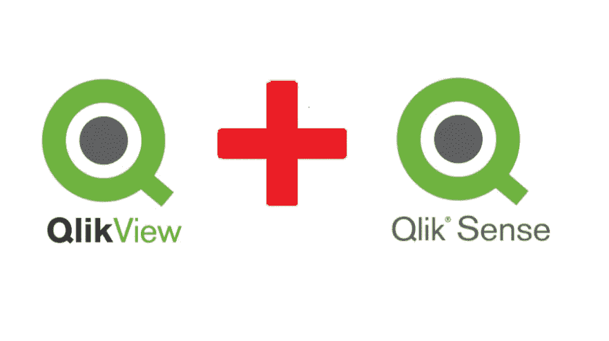
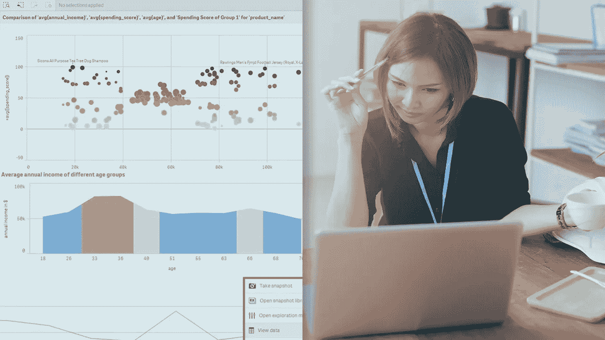
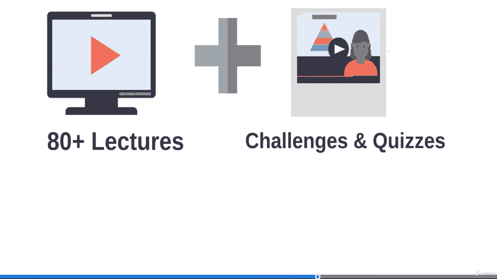

# 2023 年 7 门适合初学者在线学习的最佳 QlikView 和 QlikSense 课程

> 原文：<https://medium.com/javarevisited/7-best-qlikview-and-qliksense-courses-for-beginners-7c356354b3e8?source=collection_archive---------1----------------------->

## 收集 2023 年学习数据科学和商业智能的 Qlik View 和 Qlik Sense 的最佳在线课程。

如果您正在学习 QlikView 和 QlikSense for Data Science and Business Intelligence 2023，并且正在寻找最佳的 QlikView 和 QlikSense 课程来开始您的学习之旅，那么您来对地方了。以前分享过学习 Tableau[**D3 . js**](/javarevisited/7-best-online-courses-to-learn-d3-js-for-data-visualization-in-2020-1a8c79add4e4)[Power BI](/javarevisited/10-free-microsoft-power-bi-courses-for-beginners-19ee524008e1)[**微软 Exce** l](/javarevisited/5-advanced-courses-to-learn-microsoft-excel-in-depth-b556aaee5f6c) 进行数据可视化的最佳课程，今天分享的是 2023 年同时学习 QlikView 和 QlikSense 的最佳课程。

如果你在商业分析和情报领域，那么你一定听说过 **QlikView** 和**QlikView**，这是两种最现代的商业情报和数据分析工具。这两种产品都由 Qlik 公司提供，并广泛用于 BI 和数据可视化性能。

QlikView 是一个强大的数据可视化工具，如果您正在学习[数据可视化](https://javarevisited.blogspot.com/2019/09/top-5-courses-to-learn-microsoft-excel-macros-vba-and-data-visualization.html)，您可以在 2023 年学习它。QlikView 将自己标榜为引导式分析工具，有助于从大型数据集中提取见解。

它在交互性和健壮性之间取得了恰当的平衡，不负众望。QlikView 将严肃数据库的数据管理功能与灵活、响应迅速的用户界面相结合，使钻取数据变得非常简单

Qlik Sense 是 QlikView 的下一代产品，构建于其改变游戏规则的关联引擎之上，并利用[增强智能](https://javarevisited.blogspot.com/2019/10/top-5-courses-to-learn-artificial-intelligence-AI.html#axzz68qW5AVIh)和[云计算](https://javarevisited.blogspot.com/2019/07/top-5-online-courses-to-learn-cloud-computing-aws.html)功能提供最佳的数据分析和可视化体验。它很快成为一种流行的选择，为管理层的观众构建复杂数据的复杂可视化。

Qlik Sense 的一个非常强大的特性是支持不同类型的选择、应用状态和搜索。在这些最好的在线课程中，您将学习关键技能，如使用 [Qlik Sense](https://javarevisited.blogspot.com/2020/07/top-5-courses-to-learn-qlikview-and-qlik-sense.html) 分析数据，您将能够正确选择合适的选择模型来查看数据，并利用智能搜索和 Qlik Sense 认知引擎在您的应用中处理这些数据。

学习 QlikView 和 Qlicksense 可以为你丰富多彩的简历增加一项有用的技能，特别是如果你正在 [BI](/javarevisited/tableau-vs-qlik-sense-vs-power-bi-choose-best-bi-tool-for-big-data-visualization-533976324c47) 和[数据分析](https://javarevisited.blogspot.com/2020/08/top-10-coursera-certifications-to-learn-Data-Science-Visualization-and-Data-Analysis.html)世界找工作的话。

# 2023 年初学者学习 Qlikview 和 Qliksense 的 7 门最佳在线课程

现在，您已经了解了什么是 QlikView 和 Qlikesense，以及它们如何帮助进行[数据分析](https://becominghuman.ai/5-best-courses-to-learn-pythons-pandas-libary-for-data-analysis-and-data-science-34b62abb0e96)，发现和商业洞察，是时候深入了解如何学习 QlikView 和 Qlikesense 了。

以下是来自 [Udemy](/javarevisited/15-best-udemy-courses-programmers-can-buy-on-black-friday-and-cyber-monday-2020-a803874f41d9) 和 [Pluralsight](/javarevisited/top-10-pluralsight-courses-to-learn-programming-and-software-development-during-covid-19-stay-at-30b7d8a4f88f) 的最佳在线培训课程，适用于任何希望学习 QlikView 和 QlikSense 并在 2023 年成为专业设计师和开发人员的人。

## 1.[完整的 QlikView 训练营](https://click.linksynergy.com/deeplink?id=JVFxdTr9V80&mid=39197&murl=https%3A%2F%2Fwww.udemy.com%2Fcourse%2Fthe-complete-qlikview-boot-camp%2F)【最佳 QlikView 课程】

这是在 Udemy 上了解 QlikView online 的最佳课程之一。本课程由经验丰富的 QlikView 讲师 Paul Scotchford 创建，将向您传授求职所需的 QlikView 知识。

这门课程与其他课程的区别在于它是二合一的课程。您将从开发人员和设计人员的角度学习 QlikView。

在这个课程中你会学到以下的东西:
1。如何安装和使用 QlikView 12 和 SQL Server Express
2。关联数据模型如何在内部存储
3。如何编写连接代码并理解它们如何工作
4。如何创建 ETL 数据处理的脚本
5。如何创建图表，如仪表图、饼图、条形图、组合图、折线图、龙卷风图、热图、散点图
6。如何向图表和其他对象添加动作和条件
7。如何使用`Aggr()`、`Rank()`、`IntervalMatch()`、
等高级计算功能 6。如何针对图表和脚本进行性能调优

该课程还有 150 多个测验和面试问题，用于复习和检查您的进度。你也将参与 14 个作业项目来获得一些实践机会。完成本课程后，您还将获得一份基于测试结果的 a 级证书，以便向世界展示您的技能水平。

**此处是加入此最佳 QlikView 课程的链接** — [完整的 QlikView 训练营](https://click.linksynergy.com/deeplink?id=JVFxdTr9V80&mid=39197&murl=https%3A%2F%2Fwww.udemy.com%2Fcourse%2Fthe-complete-qlikview-boot-camp%2F)

谈到社交证明，这是 Udemy 中学习 QlikView 的最佳课程之一，已有超过 14，748 名学生注册并表示了他们的信任。它也是 Udemy 上*评分最高的 QlikView 课程之一，近 3，321 名参与者的平均评分为 4.5。总体来说，2023 年学习 QlikView 最好的在线课程之一。*

## 2.[Qlik Sense Analytics 开发证书](https://click.linksynergy.com/deeplink?id=JVFxdTr9V80&mid=39197&murl=https%3A%2F%2Fwww.udemy.com%2Fcourse%2Fis-my-startup-doing-ok%2F)【Udemy】

到目前为止，我们已经看到了几个在线培训课程来了解 QlikView，现在是了解 Qlik sense 的时候了，我们将与 Paul Scotchford 大师重新开始，他是我们在此列表中的第一门课程的讲师，也是最受欢迎和最有经验的 QlikView/Qliksense 讲师和专家之一。以下是你将在本课程中学到的东西:
1。Qliksense 关联数据模型的工作原理以及如何将数据加载到其中。
2。如何设计和构建[数据可视化](/javarevisited/top-10-machine-learning-and-data-science-certifications-and-training-courses-for-beginners-and-a6308497b764)并用扩展增强它们。
3。如何解决数据完整性和建模问题
4。如何在[云中开发和分享应用](https://javarevisited.blogspot.com/2020/08/top-10-coursera-certifications-to-learn-cloud-computing-aws.html)(免费)
5。如何为度量和维度编写表达式

本课程专为希望从头开始学习 QlikSense 并快速提高工作效率的人设计。它将使您的技能转变为对 Qlik Sense 应用程序开发的深入理解。此外，您将在本课程中学到的技能 *100%可转移到 QlikSense Enterprise 和 Qlik Sense Cloud。*

**以下是参加本课程的链接**—[Qlik Sense Analytics 开发证书](https://click.linksynergy.com/deeplink?id=JVFxdTr9V80&mid=39197&murl=https%3A%2F%2Fwww.udemy.com%2Fcourse%2Fis-my-startup-doing-ok%2F)

正如我之前说过的，Qlik Sense 是 QlikView 的下一代产品，它正在超越许多同类产品，因为它的基础“关联数据模型”技术和绝对易于发现的洞察力决策和故事，本课程将教你成为 QlikView 开发人员所需的一切。

## 3.[从零开始成为 QlikView 开发人员](https://click.linksynergy.com/deeplink?id=JVFxdTr9V80&mid=39197&murl=https%3A%2F%2Fwww.udemy.com%2Fcourse%2Fqlikview-developer-course%2F)

这是 Udemy 提供的另一个很好的课程，可以帮助您了解 QlikView，并成为一名没有任何经验和知识的 QlikView 开发人员。本课程由 Shilpan Patel 创建，面向希望了解如何连接到各种数据源、转换数据以及从头开始创建 QlikView 数据模型以实现数据可视化和业务发现的任何人。

以下是你将在本课程中学到的东西:
1 .如何安装 QlikView 并连接到各种数据源。
2。如何为 ETL(提取、转换、加载)写脚本
3。如何从零开始创建数据模型
4？您将从头开始开发一个示例应用程序，教师会解释脚本的每一行。
5。Qlikview 脚本编写技巧和诀窍

本课程包含许多有用的信息，这些信息在任何其他 Qlikview 教程和课程中都找不到。讲师还对 QlikView 及其在现实世界中的使用有深入的了解，并会详细讲解。

**这是加入本在线课程**的链接。[从零开始成为 QlikView 开发人员](https://click.linksynergy.com/deeplink?id=JVFxdTr9V80&mid=39197&murl=https%3A%2F%2Fwww.udemy.com%2Fcourse%2Fqlikview-developer-course%2F)

有些讲座的音频质量存在一些问题，但总的来说，从实用的角度来看，这是一门很好的课程。

谈到社会证明，这门课程已经得到了 6000 多名学生的信任，并且有近 1300 名学员给出了平均 4.0 的评分，这简直令人惊叹，显示了这门课程的质量。

## 4.[从零开始成为 QlikView 设计师](https://click.linksynergy.com/deeplink?id=JVFxdTr9V80&mid=39197&murl=https%3A%2F%2Fwww.udemy.com%2Fcourse%2Fbecome-qlikview-designer-from-scratch%2F)

到目前为止，您已经看到了成为 QlikView 设计师和开发人员的二合一课程，以及成为 QlikView 开发人员的课程，现在本课程面向任何想要从头开始成为 QlikView 设计师的人。

本课程也是由前一课程的 Shilpan Patel 讲师创建的，它将教您成为专业 QlikView 设计师所需了解的一切。

以下是你将在本课程中学到的东西:
1。如何从头开始构建 QlikView 应用程序
2。如何使用 QlikView 11.2
3 的不同功能？如何使用简约方法设计 QlikView 应用程序
4。如何使用高级功能，如集合分析和用于比较分析的替代状态

完成本课程后，您将对不同的 QlikView 图表有一个很好的了解，并据此使用它们来创建一个有效传达趋势和异常值的应用程序。您还将了解 QlikView 应用程序设计和可视化最佳实践的高级提示和技巧。

**以下是参加本课程的链接** — [从头开始成为 QlikView 设计师](https://click.linksynergy.com/deeplink?id=JVFxdTr9V80&mid=39197&murl=https%3A%2F%2Fwww.udemy.com%2Fcourse%2Fbecome-qlikview-designer-from-scratch%2F)

谈到社会证明，这门课程平均得到近 636 名参与者的 4.2 分，超过 4200 名学生从这门课程中受益。这使得它成为任何想要从头开始学习 QlikView 并成为专业 QlikView 设计师的人的理想课程。

## 5.[Janani Ravi 利用 Qlik Sense 分析数据](https://pluralsight.pxf.io/c/1193463/424552/7490?u=https%3A%2F%2Fwww.pluralsight.com%2Fcourses%2Fanalyzing-data-qlik-sense)

这是学习 Qlik 中不同选择模型的极好课程，包括单击、图例和套索选择和关联选择模型，以及智能搜索、Qlik Sense 认知引擎以及默认和备用状态的作用。以下是你将在本课程中学到的东西:
1。不同的 Qlik 可视化支持不同的选择模型，包括单击、套索、范围和图例选择。
2。如何使用交替状态允许用户对同一尺寸进行不同的选择
3。如何使用智能搜索和洞察顾问工具

学完本课程后，您将掌握使用选择模型、智能搜索和认知引擎以复杂和令人信服的方式从 Qlik 数据中获取洞察所需的所有技能和知识。

**以下是参加 Qliksense 课程**——[用 Qlik Sense 分析数据](https://pluralsight.pxf.io/c/1193463/424552/7490?u=https%3A%2F%2Fwww.pluralsight.com%2Fcourses%2Fanalyzing-data-qlik-sense)的链接

顺便说一下，你需要一个 [Pluralsight 会员](https://pluralsight.pxf.io/c/1193463/424552/7490?u=https%3A%2F%2Fwww.pluralsight.com%2Flearn)才能加入这个课程，月费大约 29 美元，年费 299 美元(14%的折扣)。

我强烈建议你去注册一个，因为你不仅可以参加这个课程，还可以参加 7000 多个最新的在线技术课程，学习新的技能和技术。或者，你也可以使用他们的 [**10 天免费试玩**](https://pluralsight.pxf.io/c/1193463/424552/7490?u=https%3A%2F%2Fwww.pluralsight.com%2Flearn) 免费观看这个课程。

 [## 个人技术技能|多视角

### 借助 Pluralsight，在开发运维、机器学习、云、安全基础设施等领域构建所需技能…

pluralsight.pxf.io](https://pluralsight.pxf.io/c/1193463/424552/7490?u=https%3A%2F%2Fwww.pluralsight.com%2Flearn) 

## 6. [QlikSense 数据架构师大师班](https://click.linksynergy.com/deeplink?id=JVFxdTr9V80&mid=39197&murl=https%3A%2F%2Fwww.udemy.com%2Fcourse%2Fqliksense-data-architect-masterclass%2F)

这是在 Udemy 上学习 QlikSense 的另一个很好的课程。本课程由 Shilpan Patel 及其团队创建，将向您传授有关 QlikSense 的一切知识，帮助您清理、转换和统一来自多个不同来源的数据。

本课程旨在让任何人都能学习如何在 Qlik 意义上开发数据模型。您将使用强大的 ETL 脚本构建一个优化的关联数据模型，并学习如何处理复杂的数据集成挑战。

以下是您将在本课程中学到的内容:

1.  数据连接
2.  清理和转换源数据
3.  解决数据模型问题
4.  性能优化
5.  如何使用 QlikView 数据文件(QVD)文件和数据模型安全性。

本课程还提供了大量实践示例和挑战，将帮助您掌握 QlikSense 开发人员构建数据模型的技能，业务分析师可以使用该模型为您的企业构建洞察驱动的自助式应用程序。

**以下是参加 QlikSense 课程** — [QlikSense 数据架构师大师班](https://click.linksynergy.com/deeplink?id=JVFxdTr9V80&mid=39197&murl=https%3A%2F%2Fwww.udemy.com%2Fcourse%2Fqliksense-data-architect-masterclass%2F)的链接

## 7. [Qlik Sense for Data Science 和 BI](https://click.linksynergy.com/deeplink?id=JVFxdTr9V80&mid=39197&murl=https%3A%2F%2Fwww.udemy.com%2Fcourse%2Fqlik-sense%2F)

这是 2023 年学习数据科学和商业智能 Qlik Sense 的又一个伟大的 Udemy 课程。在本课程中，您将通过解决现实世界的挑战来逐步学习 QlikSense。

由 JP Labuschane 创建，这是一个 100%的实践课程，将教你一些日常工作中设计的实践 Qlik Sense 技能。例如，您将了解

1.  如何导航 Qlik Sense 界面，
2.  如何连接到数据源并构建您的第一个图表
3.  如何使用复杂数据文件的高级可视化技术？

在此过程中，您将学到一些有价值的提示和技巧，使使用 Qlik Sense 变得轻而易举。

学完本 Udemy 课程后，您将完全具备在个人和专业项目中使用 Qlik Sense 的能力，并且您将更加轻松地创建自己的图表、仪表板和分析故事。

**这是参加本课程的链接**——[Qlik Sense for Data Science 和 BI](https://click.linksynergy.com/deeplink?id=JVFxdTr9V80&mid=39197&murl=https%3A%2F%2Fwww.udemy.com%2Fcourse%2Fqlik-sense%2F)

以上是关于 2023 年学习 Qlikview 的一些**最佳在线课程**。如果您在商业智能和数据分析领域工作，或者希望在该领域开始您的职业生涯，那么学习 QlikView 和 Qliksense 可以提升您的职业前景。这些是行业标准工具，许多公司，无论大小，都使用这些工具。

QlikView 和 Qliksense 也在快速发展，对熟练的 QlikView/Qliksense 开发人员的需求比以往任何时候都高！它只会增长，因为 QlikView 是唯一一个带有 ETL(提取、转换、加载)引擎的内存工具，可以转换来自各种数据源的数据。

此外，不要忘记用 Qlikview 和 Qliksense 技能更新你的简历或 LinkedIn 个人资料，以开始接收招聘人员的请求。

其他**编程文章和资源**您可能喜欢:

*   [2023 年学习电力 BI 的前 5 门课程](https://www.java67.com/2020/06/top-5-courses-to-learn-microsoft-power-BI.html)
*   [初学者学习数据科学的 10 门课程](https://hackernoon.com/10-machine-learning-data-science-and-deep-learning-courses-for-programmers-7edc56078cde)
*   [2023 年学习 Python 的 5 大课程](https://hackernoon.com/top-5-courses-to-learn-python-in-2018-best-of-lot-26644a99e7ec)
*   [五大基本机器学习算法](https://www.java67.com/2020/07/top-5-machine-learning-algorithms-for-beginners.html)
*   [你可以在线获得 5 个数据科学学位](https://www.java67.com/2020/06/top-5-data-science-degree-you-can-earn-online-coursera-edx.html)
*   [面向数据科学家的 10 大 TensorFlow 课程](https://dev.to/javinpaul/10-of-the-best-tensorflow-courses-to-learn-machine-learning-from-coursera-and-udemy-37bf)
*   [学习机器学习的 5 大免费课程](https://www.java67.com/2019/01/5-free-courses-to-learn-machine-and-deep-learning-in-2019.html)
*   [面向程序员的 10 门机器学习和深度学习课程](https://hackernoon.com/top-5-courses-to-learn-python-in-2018-best-of-lot-26644a99e7ec)
*   [2023 年学习 Python 的 10 个理由](https://hackernoon.com/10-reasons-to-learn-python-in-2018-f473dc35e2ee)
*   [初学者学习 Python 的 10 门免费课程](https://hackernoon.com/10-free-python-programming-courses-for-beginners-to-learn-online-38312f3b9912)
*   [学习数据科学 Python 的 5 本书](https://javarevisited.blogspot.com/2019/08/top-5-python-books-for-data-science-and-machine-learning.html)
*   [学习数据科学表格的前 5 门课程](https://javarevisited.blogspot.com/2019/07/top-5-tableau-online-courses-and-certifications-for-data-science-engineers.html)
*   [面向数据科学和机器学习的 8 大 Python 库](https://javarevisited.blogspot.com/2018/10/top-8-python-libraries-for-data-science-machine-learning.html)
*   [学习高级数据科学的前 5 门课程](https://hackernoon.com/top-5-data-science-and-machine-learning-course-for-programmers-e724cfb9940a)
*   [初学者学习 TensorFlow 的 5 大课程](https://hackernoon.com/top-5-tensorflow-and-ml-courses-for-programmers-8b30111cad2c)

感谢您阅读本文。如果您喜欢 QlikView 和 Qliksense 在线培训课程，请与您的朋友和同事分享。如果您有任何问题或反馈，请留言。

**——**如果您有兴趣了解更多关于数据可视化的信息，并寻找免费的在线课程来开始您的数据可视化之旅，那么您也可以查看 Udemy 上的 [**使用 Oracle 分析云的现代数据可视化**](https://click.linksynergy.com/deeplink?id=JVFxdTr9V80&mid=39197&murl=https%3A%2F%2Fwww.udemy.com%2Fcourse%2Faugmented-analytics%2F) 课程。这是完全免费的，你只需要一个免费的 Udemy 帐户就可以参加这个课程。

 [## 免费数据可视化教程——使用 Oracle 分析云实现现代数据可视化

### 嗨，很高兴你来了。我是一名经验丰富的技术营销专家，专注于大数据分析、数据…

udemy.com](https://click.linksynergy.com/deeplink?id=JVFxdTr9V80&mid=39197&murl=https%3A%2F%2Fwww.udemy.com%2Fcourse%2Faugmented-analytics%2F)