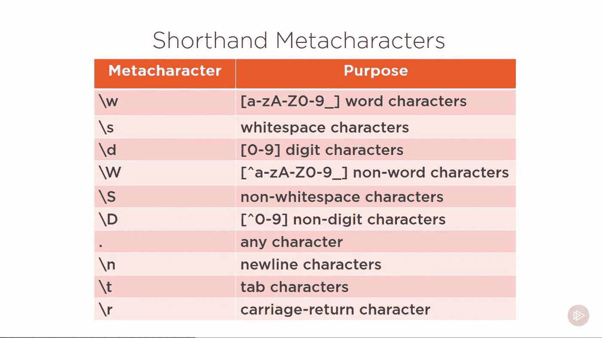
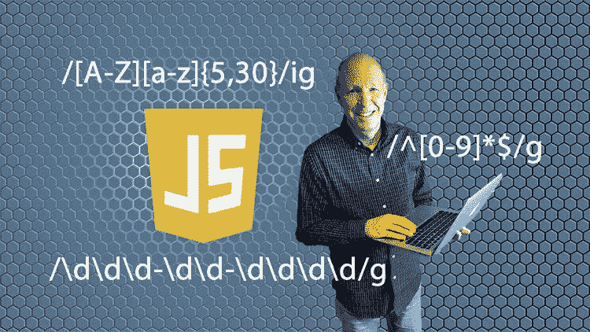
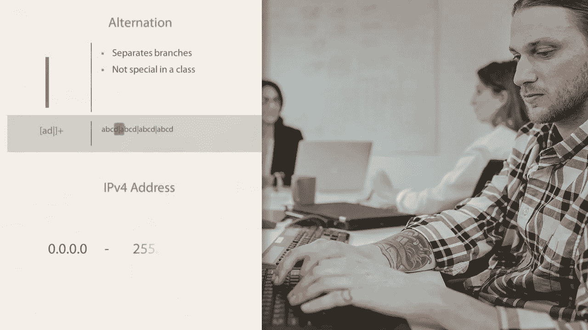

# 2023 年开发者学习的 7 门最佳正则表达式课程

> 原文：<https://medium.com/javarevisited/7-best-regular-expression-courses-for-developers-to-learn-in-2021-9b8cb37bb3a5?source=collection_archive---------0----------------------->

## 这些是学习 Java、Python 和 JavaScript 编程语言正则表达式的最佳在线课程。

image_credit — Pluralsight

大家好，如果你想学习正则表达式或正则表达式，并寻找最好的在线课程，那么你来对地方了。从今天开始，我要分享给开发者们的最佳正则表达式课程。

如果你一直在做软件开发，那么你可能知道正则表达式是模式匹配和搜索文本的强大工具。

作为一名程序员，您经常需要搜索日志文件中的错误消息或特定信息。对正则表达式的深入了解可以帮助您更有效地完成工作。

几乎所有的编程语言都支持正则表达式。你会在 [Java](http://top%205%20courses%20to%20learn%20spring%20in%20depth%205%20online%20courses%20to%20learn%20core%20java%20for%20free%20top%205%20java%20design%20patterns%20courses%20for%20experienced%20java%20devs/) 、 [Python](https://javarevisited.blogspot.com/2018/03/top-5-courses-to-learn-python-in-2018.html) 、 [Perl](https://www.java67.com/2020/05/perl-interview-questions-and-answers.html) 、 [JavaScript](https://javarevisited.blogspot.com/2020/01/top-10-free-interactive-online-courses.html) 、 [C++](https://www.java67.com/2018/02/5-free-cpp-courses-to-learn-programming.html) 等中找到创建和应用 regex 的 API。类似地，Linux 中的许多工具和命令像 [grep](https://www.java67.com/2017/07/how-to-find-all-files-containing-matching-text-grep-command-example.html) 、awk 和 [sed](http://javarevisited.blogspot.sg/2013/05/sed-command-examples-in-unix-and-linux.html#axzz56KhwFZ4z) 也支持 regex。

这在分析文本文件中的数据时非常有用。对正则表达式的了解也常常是初学者和有经验的程序员之间的区别。通过扩展你的知识，给你一个强大的搜索和故障排除工具，它肯定会让你成为一个更好的程序员。

不管你是不是系统管理员，都在[发展。NET](https://javarevisited.blogspot.com/2019/10/top-5-courses-to-learn-asp-net-in-2019.html) 、 [C](https://javarevisited.blogspot.com/2019/11/top-5-courses-to-learn-c-programming-in.html) 、 [PHP](/javarevisited/top-10-free-courses-to-learn-php-and-mysql-for-web-development-e96e69982675) 、 [Javascript](/javarevisited/my-favorite-free-tutorials-and-courses-to-learn-javascript-8f4d0a71faf2) 、 [Ruby](https://www.java67.com/2018/02/5-free-ruby-and-rails-courses-to-learn-online.html) 、 [Python](https://javarevisited.blogspot.com/2018/12/10-free-python-courses-for-programmers.html) ，甚至 [HTML5](https://www.java67.com/2020/08/5-best-online-courses-to-learn-html-5.html) ，或者以查询数据库为生，知道如何读写正则表达式是任何 IT 专业人士的必备技能。虽然很多人认为正则表达式是一种魔法，但如果使用得当，它们是您工具箱中一个令人敬畏的强大工具。

正则表达式几乎存在于每一种编程语言中。本课程教授使用正则表达式的基础知识，包括初级和高级语法、元字符、如何创建复杂的匹配表达式等等。

随着 GUI 工具越来越多地转向自动化，学习正则表达式的需求也在增加。随着系统管理员、工程师和开发人员跨应用程序和企业实现自动化。

从数据集中验证、提取、匹配和获取值的需求也变得越来越重要。

几乎每一种编程语言中都有正则表达式。无论您的背景如何，如果您处理任何类型的数据，正则表达式都将使您更高效地处理您管理的数据。

# 2023 年学习正则表达式的 7 大课程

如果你想学习一般的正则表达式，或者试图用你喜欢的编程语言来学习它们，比如 [Java](/javarevisited/top-5-java-online-courses-for-beginners-best-of-lot-1e1e240a758) 、 [Python](/swlh/5-free-python-courses-for-beginners-to-learn-online-e1ca90687caf) 、 [JavaScript](https://www.java67.com/2018/07/top-5-free-javascript-books-download-pdf-read-online.html) 、Perl 等。和寻找资源，那么你来对地方了。在本文中，我将分享从一开始就学习正则表达式的最佳在线课程。你可以加入这些课程来掌握 regex，成为更好的开发者。为了不再浪费你的时间，这里是我为 Java 程序员和开发人员列出的最佳正则表达式课程。

## 1.[初学者完全正则表达式教程](https://click.linksynergy.com/deeplink?id=JVFxdTr9V80&mid=39197&murl=https%3A%2F%2Fwww.udemy.com%2Fcourse%2Fregular-expressions-mastery%2F)

这是 Udemy 上学习正则表达式最好的课程之一。这是一门实践性很强的课程，您将学习如何在 Java、Linux、JavaScript、Python 或其他语言中使用正则表达式(Regex ),其中包含近 30 个图解练习/示例。

说到社交证明，这门课程已经得到了超过 10325 名学生的信任，平均而言，它拥有来自近 1650 名参与者的 4.6 分的评分，这真是令人惊叹。讲师 Sujith George 在用简单的语言解释复杂的正则表达式主题方面做得非常出色。学完本课程后，你不仅能够理解现有的正则表达式模式，而且知道如何根据自己的要求编写你的模式。

总之是程序员和开发者学习正则表达式最好的课程之一。

**这里是加入这个最佳正则表达式课程的链接** — [初学者的完整正则表达式课程](https://click.linksynergy.com/deeplink?id=JVFxdTr9V80&mid=39197&murl=https%3A%2F%2Fwww.udemy.com%2Fcourse%2Fregular-expressions-mastery%2F)

## 2.[完整的正则表达式课程及练习 2023](https://click.linksynergy.com/deeplink?id=JVFxdTr9V80&mid=39197&murl=https%3A%2F%2Fwww.udemy.com%2Fcourse%2Fthe-complete-regular-expressions-course-with-exercises-for-beginners%2F)

这是 Udemy 上的又一个正则表达式课程，值得一看。这与之前的课程非常相似，但是如果您无法连接到讲师，那么您可以看一下本课程。

这也是一门实践课程，你将学习如何在不同的编程语言中使用 regex，如 [PHP](https://www.java67.com/2018/02/5-free-php-and-mysql-courses-for-web-developers.html) 、 [JavaScript](https://www.java67.com/2019/01/top-10-javascript-frameworks-and-libraries-for-web-developers.html) 、 [Python](https://hackernoon.com/top-5-courses-to-learn-python-in-2020-best-of-lot-bdq3y42) 、 [Java](/javarevisited/10-free-courses-to-learn-java-in-2019-22d1f33a3915) 、Ruby、Perl，以及平台如 [Linux](/javarevisited/top-10-courses-to-learn-linux-command-line-in-2020-best-and-free-f3ee4a78d0c0) 和 UNIX 系统。

它有实践练习，涵盖了大多数需要编写正则表达式的常见场景。和前面的课程一样，这门课也将教你如何轻松地读写正则表达式。

谈到社交证明，这门课程受到了 8300 多名学生的信任，平均有近 550 名参与者给它打了 4.4 分，这太棒了。

**这里是加入这个正则表达式课程的链接**——[带练习 2023 的完整正则表达式课程](https://click.linksynergy.com/deeplink?id=JVFxdTr9V80&mid=39197&murl=https%3A%2F%2Fwww.udemy.com%2Fcourse%2Fthe-complete-regular-expressions-course-with-exercises-for-beginners%2F)

## 3.乔希·杜夫尼的正则表达式介绍(Regex)

本课程“正则表达式(Regex)简介”面向那些寻求更好地理解数据以及如何更有效地使用数据的人。首先，您将学习使用速记元字符。

接下来，你会学到所有关于锚点和单词边界的知识。本课程结束时，你将掌握阅读网上找到的正则表达式所需的知识，以及如何编写自己的优雅短语。

这是你在这门课中学到的主要东西-

1.  速记元字符
2.  锚
3.  单词边界
4.  四处看看

简而言之，这是学习正则表达式的最好的 Pluralsight 课程之一，我强烈建议每个高级开发人员使用这个课程学习正则表达式。

链接参加本课程— [正则表达式(Regex)简介](https://pluralsight.pxf.io/c/1193463/424552/7490?u=https%3A%2F%2Fwww.pluralsight.com%2Fcourses%2Fregular-expression-introduction)

顺便说一下，你需要 Pluralsight 会员资格才能参加这个课程。它每月花费大约 29 美元，但是如果你想尝试，你也可以利用他们的 [**10 天免费试用**](https://pluralsight.pxf.io/c/1193463/424552/7490?u=https%3A%2F%2Fwww.pluralsight.com%2Flearn) 来免费访问这个课程。

 [## 个人技术技能|多视角

### 借助 Pluralsight，在开发运维、机器学习、云、安全基础设施等领域构建所需技能…

pluralsight.pxf.io](https://pluralsight.pxf.io/c/1193463/424552/7490?u=https%3A%2F%2Fwww.pluralsight.com%2Flearn) 

## 4.[掌握 JavaScript 中的正则表达式](https://click.linksynergy.com/deeplink?id=JVFxdTr9V80&mid=39197&murl=https%3A%2F%2Fwww.udemy.com%2Fcourse%2Fmastering-regular-expressions-in-javascript%2F)

这是一门学习 JavaScript 正则表达式的极好课程。我向所有以 Javascript 为主要语言的 web 开发人员强烈推荐它。在本课程中，您将学到 web 开发人员应该知道的关于正则表达式的所有知识。你不仅要学习基础知识，还要学习在 JavaScript 中使用它们的不同方法。您将学习如何阅读正则表达式，并通过使用原生 JavaScript 特性来创建优雅的正则表达式。

您将了解元字符、字符序列、重复、搜索、锚定表达式、前瞻断言和一些常用的正则表达式。

简而言之，为 [Web 开发者](https://javarevisited.blogspot.com/2019/02/the-2019-web-developer-roadmap.html)和所有 JavaScript 程序员学习正则表达式的坚实课程之一。本课程的目标是让你精通用 JavaScript 阅读和编写强大的正则表达式，这一点做得很好。

**这里是加入本课程** — [掌握 JavaScript 中的正则表达式](https://click.linksynergy.com/deeplink?id=JVFxdTr9V80&mid=39197&murl=https%3A%2F%2Fwww.udemy.com%2Fcourse%2Fmastering-regular-expressions-in-javascript%2F)的链接

## 5.[Juliette Reinders Folmer 的正则表达式基础](https://pluralsight.pxf.io/c/1193463/424552/7490?u=https%3A%2F%2Fwww.pluralsight.com%2Fcourses%2Fregular-expressions-fundamentals)

这是 Pluralsight 从零开始学习正则表达式的又一门优秀课程。

本课程将教你正则表达式如何解决常见问题，以及正则表达式的强大功能。它还将向您展示如何构建优秀的高性能正则表达式，同时避免所有的陷阱。本课程将带你从什么是正则表达式以及为什么它们有用的基础开始，通过正则表达式的语法，引导你越过常见的陷阱，并教你如何优化你的正则表达式的有效性、性能和可维护性。

**这里是加入本课程的链接**——[正则表达式基础](https://pluralsight.pxf.io/c/1193463/424552/7490?u=https%3A%2F%2Fwww.pluralsight.com%2Fcourses%2Fregular-expressions-fundamentals)

## 6.[精通 Python 正则表达式](https://click.linksynergy.com/deeplink?id=JVFxdTr9V80&mid=39197&murl=https%3A%2F%2Fwww.udemy.com%2Fcourse%2Fcsxfunda-master-regular-expressions-in-python-through-examples%2F)

这是用 Python 学习正则表达式最好的 Udemy 课程。在本课程中，您将从头开始学习 Python 正则表达式。

以下是你将在本课程中学到的关键内容-

*   清楚地理解正则表达式中的所有概念
*   如何编写正则表达式来匹配 URL
*   如何编写正则表达式来匹配日期
*   如何编写正则表达式来匹配数字
*   如何构建一个简单的密码检查应用程序

本课程通过简单和多个例子解释了 Python 中正则表达式的所有概念，以便于你理解。每个案例研究都由练习组成。

通过完成这些练习，你将能够为不同种类的文本数据编写正则表达式。总的来说，这是 2023 年学习 Python 正则表达式的完美实践课程。

以下是加入本课程的链接— [掌握 Python 正则表达式](https://click.linksynergy.com/deeplink?id=JVFxdTr9V80&mid=39197&murl=https%3A%2F%2Fwww.udemy.com%2Fcourse%2Fcsxfunda-master-regular-expressions-in-python-through-examples%2F)

## 7. [Python 正则表达式与数据抓取项目](https://www.educative.io/courses/python-regular-expressions-with-data-scraping-projects?affiliate_id=5073518643380224)

这是 2023 年学习 Python 正则表达式的又一个动手互动课程。本课程最大的好处是，你可以通过构建数据清理项目在浏览器中练习正则表达式。

用 Pythion 学习正则表达式并不容易，但是这个课程会让你的生活变得简单。以下是我喜欢这门课程的关键之处

1.  如何通过运行交互实例使用 Python 正则表达式(re)模块及相关函数；
2.  用真实世界的数据例子来教育你如何处理项目
3.  用编码练习和测验来挑战你；
4.  这是初学者友好的视频讲座，解释基本的正则表达式的概念。

顺便说一句，这是一个短期课程，应该很快很容易完成。但是，它假设您已经掌握了基本的 Python 技能。本课程将在不到 30 分钟的时间内让您熟悉 Python 正则表达式

**这里是加入本课程的链接**——[Python 正则表达式与数据抓取项目](https://www.educative.io/courses/python-regular-expressions-with-data-scraping-projects?affiliate_id=5073518643380224)

而且，如果你发现教育编码平台和他们的探索课程，像[探索系统设计面试](https://www.educative.io/collection/5668639101419520/5649050225344512?affiliate_id=5073518643380224)，那么考虑获得 [**教育订阅**](https://www.educative.io/subscription?affiliate_id=5073518643380224) ，提供每月 18 美元的 100 多门课程(包括这一门)。非常划算，非常适合准备编码面试。

 [## 介绍:教育性订阅。获得无限制的访问权限！

### 技术领域永远不会停滞不前，我们也一样。我们定期更新课程，并不断增加新的课程…

www.educative.io](https://www.educative.io/subscription?affiliate_id=5073518643380224) 

以上是学习 Java、Python、JavaScript、Linux 和其他编程语言正则表达式的**最佳课程。我有目的地选择了实践课程，因为你不能仅仅通过阅读来学习正则表达式。**

您需要尽可能多地练习它，这些课程为您提供了学习如何根据您自己的定制需求编写正则表达式的练习。作为一名开发人员，你应该对正则表达式有很好的了解，这也会使你成为一名更好的开发人员。

您可能想探索的其他**编程资源文章**

*   [面向 Java 开发者的 5 门免费 Spring 框架课程](http://www.java67.com/2017/11/top-5-free-core-spring-mvc-courses-learn-online.html)
*   [与 Spring Boot 一起学习微服务的 5 大课程](https://javarevisited.blogspot.com/2018/02/top-5-spring-microservices-courses-with-spring-boot-and-spring-cloud.html#axzz6JJFPbsyP)
*   [2023 年学习 Web 开发的 5 门课程](http://javarevisited.blogspot.sg/2018/02/top-5-online-courses-to-learn-web-development.html#axzz57wed1PWd)
*   [学习 Java 微服务的 7 大课程](/javarevisited/top-5-courses-to-learn-microservices-in-java-and-spring-framework-e9fed1ba804d)
*   [10 门编程/编码面试课程](http://javarevisited.blogspot.sg/2018/02/10-courses-to-prepare-for-programming-job-interviews.html)
*   [深度学习春季五大课程](https://javarevisited.blogspot.com/2018/06/top-6-spring-framework-online-courses-Java-programmers.html)
*   [5 门免费学习核心 Java 的在线课程](http://javarevisited.blogspot.sg/2017/11/top-5-free-java-courses-for-beginners.html#axzz4zuIICRs9)
*   [针对经验丰富的 Java 开发者的 5 大 Java 设计模式课程](http://javarevisited.blogspot.sg/2018/02/top-5-java-design-pattern-courses-for-developers.html)
*   [面向 Java 开发人员的 10 门 Spring Boot 高级课程](/javarevisited/10-advanced-spring-boot-courses-for-experienced-java-developers-5e57606816bd)
*   [初学者学习春云的前 5 门课程](https://javarevisited.blogspot.com/2018/04/top-5-spring-cloud-courses-for-java.html)
*   [5 门学习 learn Shell 脚本的课程](http://javarevisited.blogspot.sg/2018/02/5-courses-to-learn-shell-scripting-in-linux.html)
*   [10 面向 Java 开发人员的免费 Spring Boot 教程和课程](/javarevisited/10-free-spring-boot-tutorials-and-courses-for-java-developers-53dfe084587e)

感谢您到目前为止阅读本文。如果您认为这些最好的 regex 教程和课程有用，请与您的朋友和同事分享。如果您有任何问题或反馈，请留言。

**P. S. —** 如果您热衷于学习正则表达式并在寻找学习正则表达式的免费课程，您也可以在我的正则表达式学习课程中查看此 [**免费 Python 正则表达式示例**](https://click.linksynergy.com/deeplink?id=JVFxdTr9V80&mid=39197&murl=https%3A%2F%2Fwww.udemy.com%2Fcourse%2Fpython-regular-expressions-with-examples%2F) 。这是绝对免费的，您只需要一个 Udemy 账户就可以加入这门课程。

 [## 免费正则表达式教程- Python 正则表达式示例

### 我是一名高级软件开发分析师，在一流的计算机和金融公司工作了 30 多年…

udemy.com](https://click.linksynergy.com/deeplink?id=JVFxdTr9V80&mid=39197&murl=https%3A%2F%2Fwww.udemy.com%2Fcourse%2Fpython-regular-expressions-with-examples%2F)