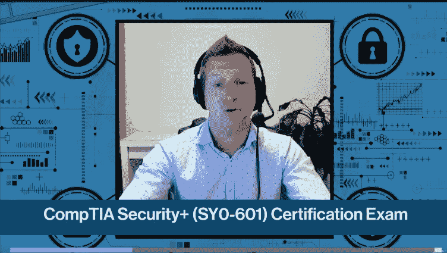
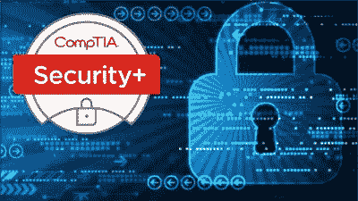
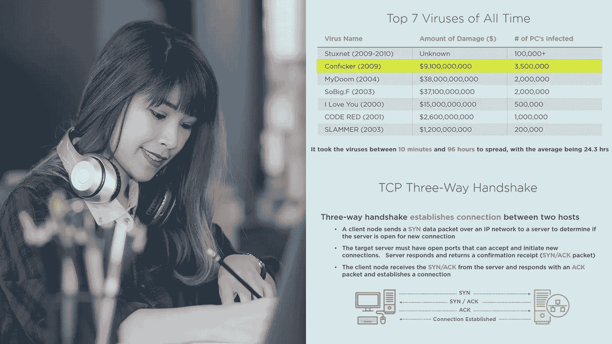
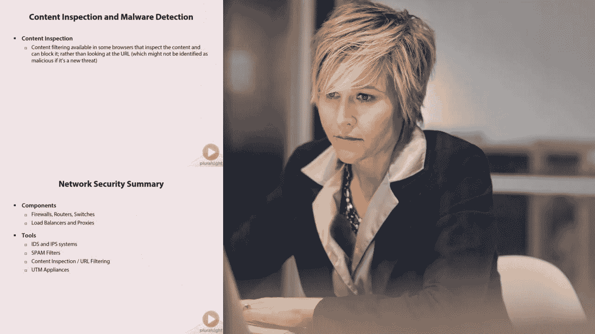
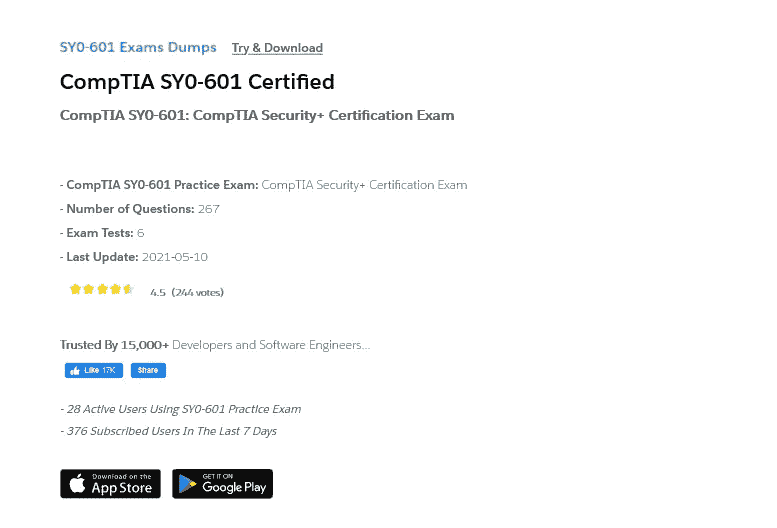
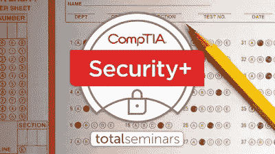
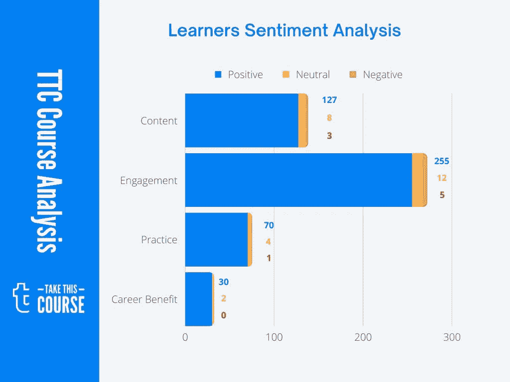

# 2023 年破解 CompTIA Security+认证(SY0–601)的 7 门最佳课程[带模拟测试]

> 原文：<https://medium.com/javarevisited/7-best-resources-to-crack-comptia-security-certification-sy0-501-courses-and-practice-tests-b9d786ae753e?source=collection_archive---------0----------------------->

## 我最喜欢的资源、在线课程和模拟测试，为 2023 年代码为 SY0–601 的 CompTIA Security+认证做准备

大家好，如果你正在准备 CompTIA Security +认证，并且正在寻找最好的在线培训课程和练习测试来帮助你做好准备，那么你来对地方了。

过去，我曾分享过通过 CompTIA 认证的最佳在线课程，如 [**CompTIA A+**](/javarevisited/6-best-comptia-a-220-1001-and-220-1002-online-training-courses-practice-tests-and-dumps-cfc25759b808) 、 [**CompTIA Linux+**](/javarevisited/6-best-comptia-linux-plus-certification-exam-xk0-004-courses-and-practice-tests-in-2021-a244c98eda4d) 、[**CompTIA Pentest+**](/javarevisited/7-best-comptia-pentest-certification-courses-and-practice-tests-46d827689cdc)、 [**Cloud+**](/javarevisited/7-best-online-courses-and-mock-tests-for-comptia-cloud-cv0-002-certification-exam-b97f4679a8c5) 和 [**Server Plus**](/javarevisited/7-best-comptia-server-certification-resources-courses-practice-tests-7e5e07dcda30?source=grid_home---------0---------------------acdb588e_9f54_4021_987b_a9bfc63d896a-------12) ，在这篇文章中，我将分享最佳课程、练习测试和考试模拟器以供准备

CompTIA Security+certification 的目标是面向安全初学者，但至少有一些基本知识，你会学到一些网络安全的基本知识，如 SQL 注入、恶意软件、零日漏洞等等。

这些课程和模拟测试是由专家准备的，受到了数千名准备参加这一著名考试的考生的信任。

如果你想成为网络安全专家，那么这个认证可以帮助你。在你的简历上有一个像 *CompTIA Security+* 这样的证书是一个优势，因为如果你想在 IT 领域找一份工作。

CompTIA Security+认证将提升你的简历，并对你的简历和职业生涯产生良好影响，或者如果你想获得一份安全工程师的工作，它肯定会有所帮助，CompTIA Security+的平均年薪约为 69，441 美元。

正如我所说，我已经分享了几个最好的在线培训课程和计划，它们将帮助您为 **CompTIA Security+** 的正式考试做好准备，您将在参加真正的考试并获得认证之前对安全基础知识有一个坚实的理解。

# 2023 年面向初学者的 7 门最佳 CompTIA 安全+认证(SY0–601)课程和实践测试

如果你正在准备 CompTIA Security+认证(SY0–601)，这是网络安全方面最著名的认证之一，那么这些在线培训课程可以极大地帮助你做好准备。它们也很实惠，你只需花 10 美元就能在时常发生的优购上买到大部分。

## 1. [CompTIA 安全+认证(SY0–601)](https://click.linksynergy.com/deeplink?id=CuIbQrBnhiw&mid=39197&murl=https%3A%2F%2Fwww.udemy.com%2Fcourse%2Ftotal-comptia-security-certification-sy0-601%2F)

假设您对 IT 基础有一些基本的了解，并且您想在安全主题方面提升您的职业生涯，那么您可能想参加关于 CompTIA Security+认证的 Udemy 课程。

在本课程中，您将学到:

*   基本的安全知识。
*   黑客攻击中使用的工具。
*   网络。

作为安全领域的初学者，您将学习许多安全基础知识，如密码学、风险管理、入侵检测、漏洞评估，以及更多有趣的主题，因此您可以将本课程视为安全领域的入门课程。

**这里是加入本课程的链接**—[—*CompTIA Security+认证(SY0–601)*](https://click.linksynergy.com/deeplink?id=CuIbQrBnhiw&mid=39197&murl=https%3A%2F%2Fwww.udemy.com%2Fcourse%2Ftotal-comptia-security-certification-sy0-601%2F)

## 2.[CompTIA Security+(SY0–601)完整课程](https://click.linksynergy.com/deeplink?id=JVFxdTr9V80&mid=39197&murl=https%3A%2F%2Fwww.udemy.com%2Fcourse%2Fsecurityplus%2F)

这是一门全面的 CompTIA Security+课程，涵盖了成为专业安全工程师所需的几乎所有安全主题，课程结束时有 75 个问题，帮助您准备正式考试。

您将在本课程中学到:

*   黑客实践课程。
*   关于安全的话题。
*   关于正式考试的一些问题。

通过实践课程，您将看到各种主题，如恶意软件和恶意软件感染、移动设备安全、密码学、网络安全、社会工程，以及更多您将在本课程中发现的内容。

**这里是加入本课程的链接**——[CompTIA Security+(SY0–601)完整课程](https://click.linksynergy.com/deeplink?id=JVFxdTr9V80&mid=39197&murl=https%3A%2F%2Fwww.udemy.com%2Fcourse%2Fsecurityplus%2F)

## 3.[CompTIA Security+](https://pluralsight.pxf.io/c/1193463/424552/7490?u=https%3A%2F%2Fwww.pluralsight.com%2Fcourses%2Fcomptia-security-plus-threats-attacks-vulnerabilities)的威胁、攻击和漏洞

如果您想了解什么是 CompTIA Security+以及该认证包含哪些主题，并且您是安全领域的初学者，那么您可能应该参加 [Pluralsight](https://javarevisited.blogspot.com/2019/10/udemy-vs-pluralsight-review-which-is-better-to-learn-code.html) 上的这门课程，作为您职业生涯的入门。

这个免费的在线培训课程主要关注 CompTIA Security+的三大主题，即威胁、攻击和漏洞。

您将从恶意软件、勒索软件和特洛伊木马的工作原理开始，然后转向 DDoS 攻击及其工作原理，最后是如何使用真正的渗透测试来评估您设备的安全性。

在本课程中，您将学到:

*   了解一下这个认证的一些有趣话题。
*   了解恶意软件、特洛伊木马和 DDoS 攻击。
*   了解渗透测试是如何运行的。

这门 CompTIA Security+课程在 Pluralsight 上是完全免费的，您只需要一个 Pluralsight 帐户就可以访问这门课程。

**以下是加入本课程的链接**—[CompTIA Security+](https://pluralsight.pxf.io/c/1193463/424552/7490?u=https%3A%2F%2Fwww.pluralsight.com%2Fcourses%2Fcomptia-security-plus-threats-attacks-vulnerabilities)的威胁、攻击和漏洞

## 4.[CompTIA Security+的技术和工具](https://pluralsight.pxf.io/c/1193463/424552/7490?u=https%3A%2F%2Fwww.pluralsight.com%2Fcourses%2Fcomptia-security-plus-technologies-tools)【plural sight】

您可能对安全性及其工作原理有一些基本的了解，但您从未实践过真实世界的渗透测试以及基础设施安全性的工作原理，因此我建议您参加 [Pluralsight](https://pluralsight.pxf.io/c/1193463/424552/7490?u=https%3A%2F%2Fwww.pluralsight.com%2Flearn) 的课程。

您将学习许多与安全相关的工具，以支持和监控公司的安全基础设施和其他主题，如入侵防御和一些网络基础知识以及如何保护它们等。

你将在本课程中学到:

*   公司安全基础设施。
*   用于安全的工具。
*   保护移动设备。

**这是参加本课程**—[CompTIA Security+](https://pluralsight.pxf.io/c/1193463/424552/7490?u=https%3A%2F%2Fwww.pluralsight.com%2Fcourses%2Fcomptia-security-plus-technologies-tools)的技术和工具的链接

Pluralsight 也有一些关于准备 CompTIA Security+考试不同主题的课程，您只需一个 Pluralsight 会员资格就可以获得所有这些课程。

大约每月 29 美元或每年 299 美元，打了 14%的折扣。或者，您也可以通过使用他们的 [**10 天免费试用**](https://pluralsight.pxf.io/c/1193463/424552/7490?u=https%3A%2F%2Fwww.pluralsight.com%2Flearn) 来访问该课程，该课程提供 200 分钟的时间来访问他们所有的 7000 多门在线课程。

 [## 对个人来说

### Pluralsight 的使命一直是公平的技术竞争环境。不管你想学什么，或者…

pluralsight.pxf.io](https://pluralsight.pxf.io/c/1193463/424552/7490?u=https%3A%2F%2Fwww.pluralsight.com%2Flearn) 

## 5.[CompTIA Security+(SY0–601)(400+问题)](https://click.linksynergy.com/deeplink?id=CuIbQrBnhiw&mid=39197&murl=https%3A%2F%2Fwww.udemy.com%2Fcourse%2Fsecurity-601-exams%2F)

这个三个小时的小课程将通过学习认证和安全性的一些基础知识来为 CompTIA Security+做准备，它将涵盖通过正式考试所需学习的内容。

在本课程中，您将学到:

*   CompTIA 安全+概念。
*   基本网络和安全。
*   身份和访问管理。

你会学到一些东西，比如中情局的贸易保密性、完整性和可用性以及风险管理概念、虚拟化、[云](/javarevisited/5-best-cloud-computing-courses-to-learn-in-2020-f5f091159401)，以及更多其他概念和主题。

**以下是加入本课程的链接**—[—T3【CompTIA Security+(SY0–601)—](https://click.linksynergy.com/deeplink?id=CuIbQrBnhiw&mid=39197&murl=https%3A%2F%2Fwww.udemy.com%2Fcourse%2Fsecurity-601-exams%2F)

## 6.[CompTIA SY0–601:CompTIA 安全+认证考试](https://www.certification-questions.com/practice-exam/comptia/sy0-601?affiliateCode=fcff36fd-557a-4713-abf6-973e9924770f&utm_source=Javin&utm_medium=affiliate&utm_campaign=affiliate)

这是准备 CompTIA Security+认证的另一个有用资源。这个网站有一些真正的安全+认证的考试转储，这些只是以前考试的问题，由参与者根据自己的记忆贡献出来。

你可以检查这些问题，以评估问题的难度、类型，以及哪些主题是最受欢迎的。我强烈推荐将这些资源添加到您的准备工具包中。

以下是您将在本次测试中获得的内容:

-CompTIA SY0–601 模拟考试:CompTIA 安全+认证考试

-问题数量:267

-考试测试:6

总的来说，这是一个很好的资源，让你熟悉以前的考试问题，难度水平和类型，以及问题的格式。

**以下是参加他的考试**——[CompTIA SY0–601:CompTIA 安全+认证考试](https://www.certification-questions.com/practice-exam/comptia/sy0-601?affiliateCode=fcff36fd-557a-4713-abf6-973e9924770f&utm_source=Javin&utm_medium=affiliate&utm_campaign=affiliate)的链接

他们还有 10 个免费问题，你可以在这里查看一下，感受一下这些垃圾场是什么样子的。

## 7.[总计:CompTIA 安全+认证。(SY0–601)模拟测试](https://click.linksynergy.com/deeplink?id=CuIbQrBnhiw&mid=39197&murl=https%3A%2F%2Fwww.udemy.com%2Fcourse%2Ftotal-comptia-security-cert-sy0-601-practice-tests%2F)

由 TOTAL 研讨会创建，这是 Udemy 的最佳 CompTIA Security+认证模拟测试之一。模拟测试是任何认证的重要组成部分，CompTIA Security+也不例外。

你可以在真正考试之前用这些练习题来测试你的速度和准确度。这些模拟测试是由 TOTAL 研讨会准备的，它们模拟了真正的 CompTIA 考试。完成上述任一课程后，您可以参加这些模拟测试来检查您的准备情况。理想情况下，您还可以加入他们的在线课程以及本模拟测试，以便更好地准备。

本课程包含以下内容:

*   CompTIA Security+SY0–601 考试的 267 个独特问题
*   **3 个全程模拟测试**，每个测试 89 个问题
*   测试是模拟真实的考试，你会得到一个个人分数

您可以使用这些模拟测试来找到您的强项和弱项并加以改进，因为这些测试包含所有考试主题，如威胁、攻击和漏洞、技术和工具、体系结构和设计、身份和访问管理、风险管理、密码学和 PKI 等。

**以下是参加本课程的链接** — [总计:CompTIA Security+ Cert。(SY0–601)模拟测试](https://click.linksynergy.com/deeplink?id=CuIbQrBnhiw&mid=39197&murl=https%3A%2F%2Fwww.udemy.com%2Fcourse%2Ftotal-comptia-security-cert-sy0-601-practice-tests%2F)

## 8.CompTIA 安全+实验课程

此外，如果您需要一个基于实验室的课程进行实践，您也可以查看[**CompTIA Security+SY0–601 实验室课程的模拟/PBQ**](https://click.linksynergy.com/deeplink?id=CuIbQrBnhiw&mid=39197&murl=https%3A%2F%2Fwww.udemy.com%2Fcourse%2Fcomptia_security_sy0-601_certification_training_class%2F) 帮助您首次通过基于实验室的学习方法的 Security+SY0–601 考试。大量的实验室。

以上就是 2023 年破解 CompTIA Security+认证考试的**最佳在线培训课程。这些是最好的在线课程，由安全专家创建，受到许多过去通过 SY0–601 考试的考生的信任。你也可以加入他们，开始网上准备。

这个 [CompTIA Security+](https://javarevisited.blogspot.com/2020/06/top-5-courses-to-crack-comptia-security-certification-exam-sy0-501.html) 被认为是任何对它有一些基本了解并想在安全领域发展的人的大门，现在你是实现成为安全工程师梦想的最后一步。

其他 **IT 认证文章**您可能喜欢:**

*   [程序员前 5 名 AZ-900 模拟测试](https://javarevisited.blogspot.com/2020/02/top-5-AZ-900-exam-Azure-Fundamentals-certification-practice-tests-and-mock-exams-to.html)
*   [破解 Salesforce App Builder 认证的 5 门课程](https://javarevisited.blogspot.com/2020/06/top-5-courses-to-crack-salesforce-platform-app-builder-certification-exam.html)
*   [学习 Docker 和 Kubernetes 的十大课程](https://dev.to/javinpaul/top-10-courses-to-learn-docker-and-kubernetes-for-programmers-4lg0)
*   [破解 AWS DevOps 工程师考试的前 5 门课程](https://javarevisited.blogspot.com/2020/04/top-5-course-to-crack-aws-certified-devops-engineer-professional-exam-certification.html)
*   [学习 Docker 和 Kubernetes 的 10 大课程](https://dev.to/javinpaul/top-10-courses-to-learn-docker-and-kubernetes-for-programmers-4lg0)
*   [破解 Azure 云架构师(AZ-300)考试的前 5 门课程](https://javarevisited.blogspot.com/2019/07/top-5-courses-to-crack-azure-architecture-technologies-certification-az-300-exam.html#axzz6E6VuRMsx)
*   [通过谷歌助理云工程师认证的前 5 门课程](https://javarevisited.blogspot.com/2019/07/top-5-google-cloud-platform-gcp-courses-certifications-online.html)
*   [破解 AWS 解决方案架构师认证的 5 大课程](https://javarevisited.blogspot.com/2019/05/top-5-courses-to-crack-aws-solutions-architect-associate-certification-exam-SAA-C01.html#axzz5rHwAwycj)
*   [通过谷歌助理云工程师认证的前 5 门课程](https://javarevisited.blogspot.com/2019/07/top-5-google-cloud-platform-gcp-courses-certifications-online.html)
*   [通过 AWS 云从业者认证的前 5 门课程](https://javarevisited.blogspot.com/2020/02/top-5-courses-to-crack-aws-certified-cloud-practitioner-exam-certification-clf-c01.html)

感谢您阅读本文。如果你喜欢这些*best CompTIA Security+(SY0–601)免费和付费的在线培训课程和模拟测试*,请与你的朋友和同事分享。这确实有所不同，然后你提前分享。我真的很感激。

**P. S. —** 如果您正在准备 CompTIA Security+认证(SY0–601)考试，并且需要一个免费的在线培训课程，那么您也可以在 Udemy 上查看 [**CompTIA Security+课程**](https://click.linksynergy.com/deeplink?id=JVFxdTr9V80&mid=39197&murl=https%3A%2F%2Fwww.udemy.com%2Fcourse%2Fcomptia-security-virusesthreats-and-compromise-indicators%2F) 。这是免费的，它没有涵盖所有的主题，但这是一个开始准备的好课程。

 [## CompTIA Security+:病毒、威胁和危害指标

### Anand Rao 是一名高级技术讲师和云顾问。他在大型企业工作了大约 15 年…

udemy.com](https://click.linksynergy.com/deeplink?id=JVFxdTr9V80&mid=39197&murl=https%3A%2F%2Fwww.udemy.com%2Fcourse%2Fcomptia-security-virusesthreats-and-compromise-indicators%2F)