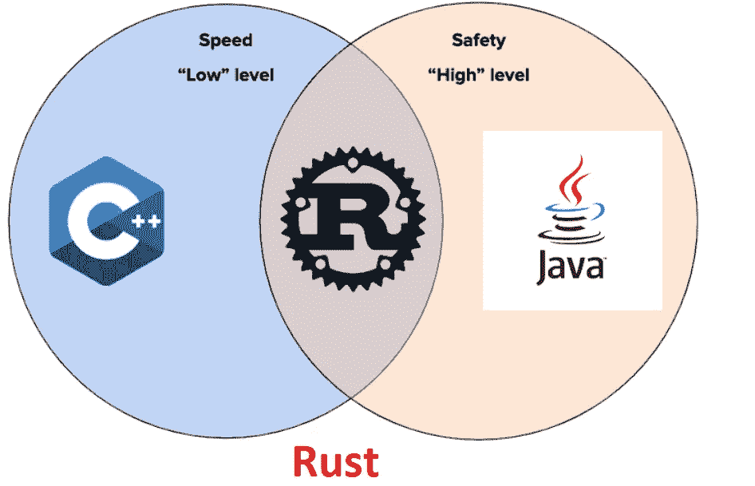
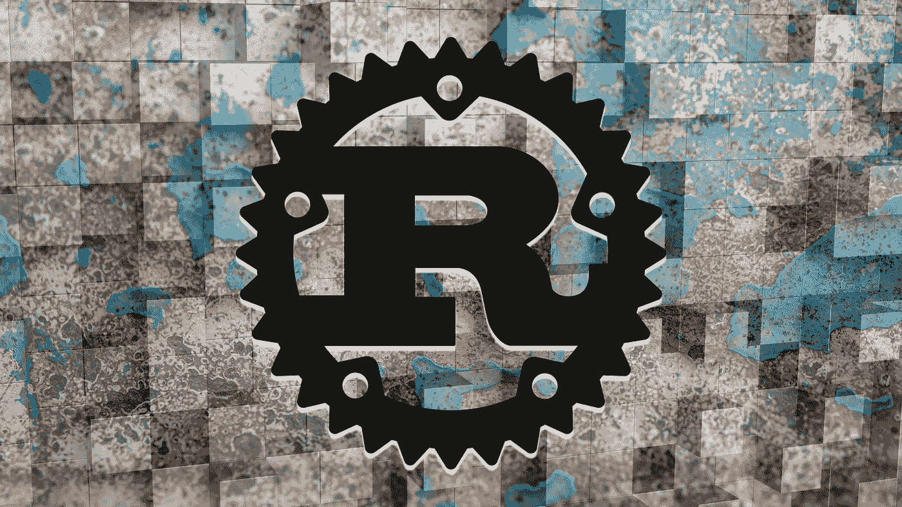
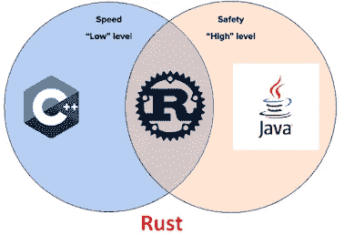
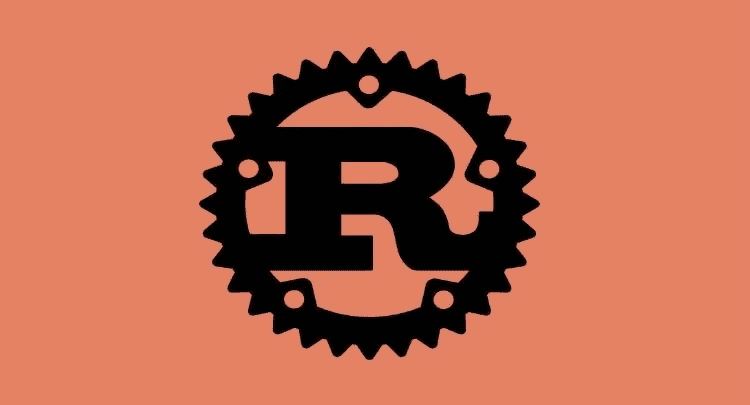
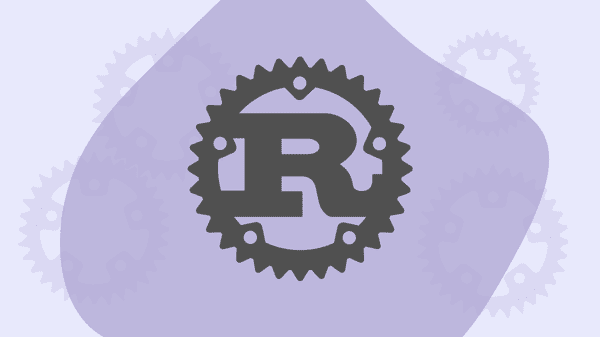
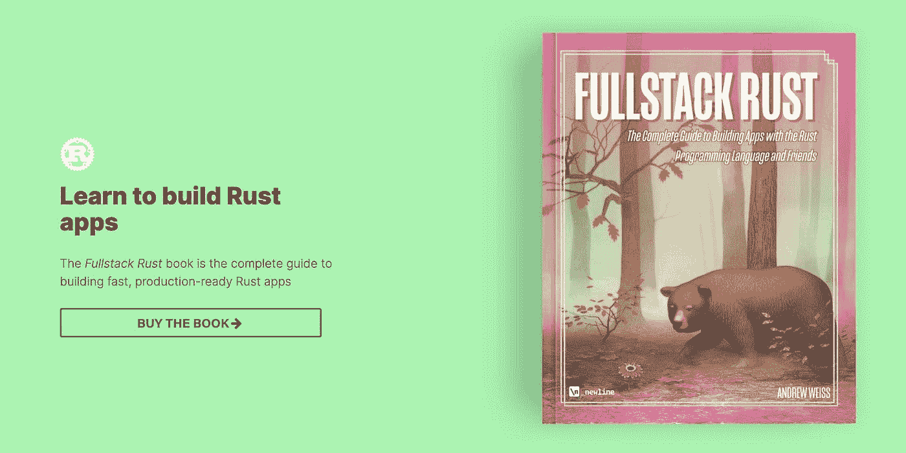
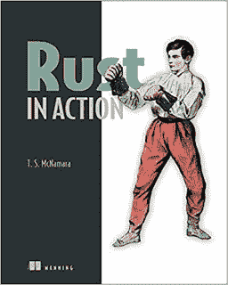

# 2023 年 9 本最佳 Rust 编程初学者课程和书籍

> 原文：<https://medium.com/javarevisited/7-best-rust-programming-courses-and-books-for-beginners-in-2021-2ed2311af46c?source=collection_archive---------0----------------------->

## 2023 年想学 Rust？以下是你可以从头开始学习 Rust 的最佳在线课程和书籍。

你好，伙计们，如果你想在 2023 年学习 Rust 编程语言，并寻找有用的资源，如书籍、教程和在线课程，那么你来对地方了。前面我已经分享了 [**最好的 Golang 课程**](/javarevisited/7-online-courses-to-learn-golang-or-go-programming-languages-in-2020-f599a25cf14a) ，而在这篇文章中，我准备分享一些最好的书籍和课程给 2023 年的*从零开始学 Rust。*

Rust 是相对较新(诞生于 2015 年)且功能强大的编程语言之一，它结合了 [C++](https://www.java67.com/2018/02/5-free-cpp-courses-to-learn-programming.html) 的强大功能和 [Java](https://www.java67.com/2018/08/top-10-free-java-courses-for-beginners-experienced-developers.html) 及其他解释型语言的安全性。

当一种编程语言被设计出来时，它要么是为像 [C/C++](/javarevisited/10-best-c-programming-courses-for-beginners-2c2c1f6bcb12) 这样的强大而设计的，要么是为像 [Java](/javarevisited/10-free-courses-to-learn-java-in-2019-22d1f33a3915) 、 [Python](/better-programming/top-5-courses-to-learn-python-in-2018-best-of-lot-26644a99e7ec) 等这样的安全而设计的。但是我们没有两者兼得。

有很多尝试将 C/C++的强大功能和 Java 提供的安全性结合起来，看起来只有 Rust 做到了。自 2015 年首次亮相以来，Rust 获得了世界和开发者社区的关注。

一个重要的证据是，在过去四年的 StackOverflow 调查中，它被选为最受欢迎的编程语言。其受欢迎程度也与日俱增。根据 GitHub Octoverse 的数据，Rust 是前一年增长第二快的语言，仅次于 [Dart](/javarevisited/my-favorite-flutter-and-dart-programming-courses-for-beginners-9e8355710d78) ，并且在 Google trends 中也在增长。

Rust 的显著优势是它提供的**性能**，这使得它适合系统编程。长期以来，系统编程和嵌入式编程领域一直被像 C/c++这样的语言所主宰。虽然它们提供了对程序和硬件的完全控制，但它们缺乏内存安全性。

使用 [C++](/javarevisited/top-10-courses-to-learn-c-for-beginners-best-and-free-4afc262a544e) 也很难编写并发代码，而 [Java](https://javarevisited.blogspot.com/2017/12/10-things-java-programmers-should-learn.html#axzz5atl0BngO) 解决了 C++在安全性和并发性方面的一些问题；这是以牺牲性能为代价的。它提供了安全性，但需要一个庞大的运行时，称为 Java 虚拟机或 JVM。因为它们的运行时间很长，像 Java 这样的语言并不适合系统编程，也从来没有真正进入过这个领域。

Rust 似乎提供了中间地带，同时它提供了极快的速度，这只有用 [C/C++](https://hackernoon.com/top-5-free-c-courses-to-learn-programming-in-2019-d27352277da0) 代码才有可能；它还提供了像 [Java](/javarevisited/top-5-java-online-courses-for-beginners-best-of-lot-1e1e240a758) 、 [Haskel](/javarevisited/5-best-haskell-programming-courses-to-learn-online-d9849335a5c) 、 [Python](https://hackernoon.com/10-free-python-programming-courses-for-beginners-to-learn-online-38312f3b9912) 这样的解释语言的安全性。

这是 Rust 在系统编程领域和[大数据](/javarevisited/top-10-courses-to-learn-big-data-and-hadoop-best-of-lot-23ef8691633f)领域崛起的主要原因。它为系统编程提供了 C/C++、D 和 [Golang](https://www.java67.com/2019/12/top-5-courses-to-learn-go-or-golang.html) 等语言的可靠替代品。

> 如果你想在 2023 年学习一种新的编程语言来提高你的整体编程技能和实践，那么 [Rust 编程语言](https://www.rust-lang.org/)是最好的编程语言。

# 我最喜欢的在线课程 2023 学 Rust 编程语言

当谈到学习一门新的编程语言时，我通常遵循**我的 3 点公式**，从在线课程开始，到个人项目结束。

在使用在线课程学习了基础和核心部分之后，我通常会一边看书，一边使用新的编程语言开发自己的项目。

想学[锈](https://javarevisited.blogspot.com/2020/01/top-5-courses-and-books-to-learn-rust-programming-language.html#axzz6grO2U4Lp)，也可以按照这个 3 点公式。无论如何，在不浪费你更多时间的情况下，这里是我列出的 2023 年学习 Rust 的一些最佳课程。

## 1.[通过构建真实应用来学习 Rust](https://click.linksynergy.com/deeplink?id=JVFxdTr9V80&mid=39197&murl=https%3A%2F%2Fwww.udemy.com%2Fcourse%2Frust-fundamentals%2F)

我喜欢边做边学，这就是为什么当我在 Udemy 上看到这个课程时，我无法抗拒。这是 2023 年初学者学习 Rust 最好的在线课程之一。

由 Lyubomir Gavadinov 创建的这个实用的 Rust 编程课程将教你 Rust 的基础知识。这种形式与大多数其他课程略有不同。

你将完全通过实践来学习，而不是在每个视频中跳跃于不相关的概念之间，并展示与该语言的真实世界应用无关的例子。

以下是您将在这个 Rust 课程中学到的关键内容:

*   Rust 编程语言的基础
*   低级内存管理
*   Rust 独特的内存安全方法
*   如何解决常见的编译器错误

您将构建真正的 Rust 应用程序，并在我们需要它们来解决实际问题时引入新概念。例如，您将通过构建一个命令行应用程序来学习 Rust 基础知识，然后继续使用 Rust 编程语言创建一个完整的工作 HTTP 服务器。

**以下是加入 Rust 课程的链接**——[通过构建真实应用来学习 Rust](https://click.linksynergy.com/deeplink?id=JVFxdTr9V80&mid=39197&murl=https%3A%2F%2Fwww.udemy.com%2Fcourse%2Frust-fundamentals%2F)

## 2. [Rust 编程:完全开发者指南](https://academy.zerotomastery.io/a/aff_jv545jzd/external?affcode=441520_zytgk2dn)【ZTM】

这是又一门学习 Rust 的牛逼课程，Rust 是 2023 年最受喜爱的编程语言。如果你不知道，Rust 在过去 5 年的 StackOverFlow 调查中被选为最受欢迎的编程语言，为什么不呢，Rust 是 [C](/javarevisited/10-best-c-programming-courses-for-beginners-2c2c1f6bcb12) / [C++](https://becominghuman.ai/10-best-c-courses-for-beginners-and-experienced-developers-fd2401c07f50) 的下一个演变。

这个课程是由 ZTM 的 Rust 专家 Jayson Lennon 创建的，它将从零开始教你 Rust 编程语言！不需要以前的经验。

这个 20 多个小时的全高清课程将教你如何使用 Rust 编写和构建真实世界的应用程序，这样你就可以被录用并被认可为顶级程序员。

简而言之，2023 年学习 Rust 最好的在线课程之一。从完全的初学者到被聘为 Rust 开发人员，它拥有你需要的一切

**这里是加入本课程的链接** — [*Rust 编程:完整的开发人员指南*](https://academy.zerotomastery.io/a/aff_jv545jzd/external?affcode=441520_zytgk2dn)

顺便说一句，你需要一个 [**ZTM 会员**](https://academy.zerotomastery.io/a/aff_c0gnlvf7/external?affcode=441520_zytgk2dn) 才能观看这个课程，这个课程每月花费大约 39 美元，但也提供了许多超级吸引人和有用的 30+课程，这些课程是由像他这样的专家创建的。你也可以使用我的代码**朋友 10** 来获得你选择的任何套餐的 10%的折扣。

 [## 学习编码。被录用。加入零至掌握学院。|零到精通

### 不要在无聊、过时的教程上浪费时间。加入 500，000 多名学生的行列，学习编程，获得聘用并在以下领域取得成功…

academy.zerotomastery.io](https://academy.zerotomastery.io/a/aff_c0gnlvf7/external?affcode=441520_zytgk2dn) 

## 3.[铁锈基础知识【多视觉课程](https://pluralsight.pxf.io/c/1193463/424552/7490?u=https%3A%2F%2Fwww.pluralsight.com%2Fcourses%2Frust-fundamentals)

这是在 Pluralsight 上学习 Rust 的最佳课程。它与我们的第一门课程来自同一个讲师，但这门课程是在 plur sight 上，这意味着如果你是会员，你可以在[plur sight](https://javarevisited.blogspot.com/2017/12/top-10-pluralsight-courses-java-and-web-developers.html)上访问这门课程，而无需在 [Udemy](https://javarevisited.blogspot.com/2019/10/udemy-vs-pluralsight-review-which-is-better-to-learn-code.html) 上购买另一门课程。在本课程中，你将首先学习 Rust 编程语言的所有语法和细节。接下来，将向您介绍基本的 Rust 数据类型及其在变量声明中的使用。本课程结束时，您将对 Rust 及其内存安全思想的具体方法、可变性的显式实现、生存期以及共享/借用数据的概念有一个透彻的了解。

**以下是加入初级防锈课程** — [防锈基础知识](https://pluralsight.pxf.io/c/1193463/424552/7490?u=https%3A%2F%2Fwww.pluralsight.com%2Fcourses%2Frust-fundamentals)的链接

正如我所说，你需要一个 Pluralsight 会员资格才能进入本课程，如果你没有，那么你可以利用他们的 [**10 天免费试用**](http://pluralsight.pxf.io/c/1193463/424552/7490?u=https%3A%2F%2Fwww.pluralsight.com%2Flearn) 来免费进入本课程。提供 200 分钟的免费观看时间，足够完成这门课程。

 [## 个人技术技能|多视角

### 借助 Pluralsight，在开发运维、机器学习、云、安全基础设施等领域构建所需技能…

pluralsight.pxf.io](http://pluralsight.pxf.io/c/1193463/424552/7490?u=https%3A%2F%2Fwww.pluralsight.com%2Flearn) 

## 4.[Rust 编程语言](https://click.linksynergy.com/deeplink?id=JVFxdTr9V80&mid=39197&murl=https%3A%2F%2Fwww.udemy.com%2Fcourse%2Frust-lang%2F)【Udemy 最佳课程】

这是在线学习 Rust 编程语言最好的课程之一。它是由 Dmitri Nesteruk 开发的，他是 Udemy 上的 Java 设计模式和 C++设计模式课程的讲师。

这个在线课程提供了 Rust 的优秀概述和一些你需要的编码经验。最棒的是，Dmitri 活着就是为了把他教的所有东西都编码，这样就很容易在学习的时候跟着他。

本课程结构良好，将教你 Rust 的基础知识，从下载安装 Rust 到兼容程序，到使用 IDE ( [IntelliJIDEA](https://javarevisited.blogspot.com/2018/09/top-5-courses-to-learn-intellij-idea-java-and-android-development.html) )开始。

你将学习 Rust 中的基本数据类型以及如何在你的程序中使用它们。您还将了解 Rust 中的数据结构，如数组、向量和字符串，以及切片的概念。

**这里是加入这个在线课程**—[Rust 编程语言](https://click.linksynergy.com/deeplink?id=JVFxdTr9V80&mid=39197&murl=https%3A%2F%2Fwww.udemy.com%2Fcourse%2Frust-lang%2F)的链接

您还将学习函数、方法、闭包、高阶函数和特征。本课程还解释了 Rust 对拥有权、借用、生命周期说明符、生命周期省略等生命周期概念的明确理解。总的来说，初学者学习 Rust 最好的课程之一。

## 5. [Rust 编程语言:完整教程](https://click.linksynergy.com/deeplink?id=JVFxdTr9V80&mid=39197&murl=https%3A%2F%2Fwww.udemy.com%2Fcourse%2Frust-programming-language-complete-tutorial%2F)

这是另一门值得从头开始学习 Rust 编程语言的课程。本课程教你如何安装 Rust，然后熟悉变量、数据类型、方法语法、枚举等基本概念。

还解释了 Rust 特有的所有权原则是如何影响语言和安全的。它还涵盖了数据处理、模式匹配和错误处理。本课程最棒的地方在于，你将构建一个 Rust 项目示例，在这个示例中，你可以使用你在课堂上学到的各种 Rust 概念。

唯一需要的是你需要一点编程经验；从这门课程中获得最大收益。教员没有解释已经提到的基本的东西。如果你已经知道了 C/c++(T19)或 Java(T21 ),并且想学习 Rust 作为第二编程语言，那么这个课程是最适合你的。

**这里是加入这个 Rust 课程的链接**——[Rust 编程语言:完整课程](https://click.linksynergy.com/deeplink?id=JVFxdTr9V80&mid=39197&murl=https%3A%2F%2Fwww.udemy.com%2Fcourse%2Frust-programming-language-complete-tutorial%2F)

## 6. [Rust 编程语言初学者](https://click.linksynergy.com/deeplink?id=JVFxdTr9V80&mid=39197&murl=https%3A%2F%2Fwww.udemy.com%2Fcourse%2Fthe-rust-programming-language-for-beginners%2F)【Udemy 课程】

这是 Udemy 上又一门学习 Rust 编程的优秀课程。它是由 Tim Buchalka 的 Learn Programming Academy 创建的，该学院的 [Java 编程课程](https://click.linksynergy.com/fs-bin/click?id=JVFxdTr9V80&subid=0&offerid=323058.1&type=10&tmpid=14538&RD_PARM1=https%3A%2F%2Fwww.udemy.com%2Fjava-the-complete-java-developer-course%2F)是我的最爱。这一次，他与迪韦克·辛格合作，创建了这个关于铁锈的优秀课程。

这是一门非常全面的课程，内容超过 19.5 个小时，几乎涵盖了关于铁锈的一切。即使你没有任何编程经验，也可以通过学习这门课程及其课程设置来学习。

这门课程适合初学者和中间用户，他们希望成为使用 Rust 编程语言的专家，如果你想在 2023 年学到一些有用的东西，学习 Rust，给你的职业生涯一个推动。

**这里是加入这个 Rust 课程的链接**——[Rust 编程语言初学者](https://click.linksynergy.com/deeplink?id=JVFxdTr9V80&mid=39197&murl=https%3A%2F%2Fwww.udemy.com%2Fcourse%2Fthe-rust-programming-language-for-beginners%2F)

## 7.[从零开始学铁锈【教育性免费课程](https://www.educative.io/courses/learn-rust-from-scratch?affiliate_id=5073518643380224)

这是一个由 Educative 在 2023 年推出的免费、交互式、基于文本的 Rust 编程学习课程。如果你不知道， [Educative](https://www.educative.io?affiliate_id=5073518643380224) 是一个新的在线学习平台，它允许你在同一个窗口中通过基于文本和图像的教程和代码进行学习。

虽然 Educative 也有最好的 Rust 课程之一——[Rust 编程终极指南](https://www.educative.io/courses/ultimate-guide-to-rust-programming?affiliate_id=5073518643380224)，但你可以先从这个免费课程开始，尤其是如果你喜欢从免费教程和资源中学习的话。

这个免费课程的目的是用一种实用的方法来教生锈。它从一个简单的“Hello world”程序开始，并继续涵盖常见的概念，如数组、字符串、向量、枚举、结构、特征、泛型、函数和逻辑。最后，它深入到更高级的概念，如生存期和内存管理，这是 Rust 的优势。当你完成的时候，你会很好的掌握铁锈的基本知识；并将准备学习更高级的概念。

**这里是加入这个互动 Rust 课程的链接**——[从零开始学 Rust](https://www.educative.io/courses/learn-rust-from-scratch?affiliate_id=5073518643380224)

这个课程最大的好处是它是完全免费的，你需要做的就是创建一个教育账号来访问这个课程，顺便说一句，他们也有很多有用的课程，比如系统设计面试课程。如果你喜欢这个平台，我建议你购买一个[教育订阅](https://www.educative.io/subscription?affiliate_id=5073518643380224)，只需 18 美元就可以获得 100 多门课程

 [## 探索系统设计面试——互动学习

### 系统设计问题已经成为软件工程面试过程的标准部分。在这些方面的表现…

www.educative.io](https://www.educative.io/collection/5668639101419520/5649050225344512?affiliate_id=5073518643380224) 

# 2023 年学习 Rust 编程的 2 本最佳书籍

现在我们已经看到了最好的 Rust 课程，是时候看看一些你可以在 2023 年学习 Rust 编程语言的书籍了。书籍往往比课程更深入，是课程的补充。如果你真的想掌握 Rust 编程语言，我建议你在学习过程中把书本和在线课程结合起来。

## 1.[全栈锈](https://gumroad.com/a/942568563)

《全栈 Rust:用 Rust 编程语言和朋友构建应用的完整指南》是我在 2023 年学习 Rust 最喜欢的书籍之一。

这本书是由 Nate 和他的团队创作的，他们已经撰写了[Ng 书](https://gumroad.com/a/221148275)和 [Fullstack React 书](https://gumroad.com/a/934179955)，这是两本最受欢迎的学习 Angular 和 React 的书。这本书的作者是谷歌的软件工程师安迪·维斯。

《Rust》这本书是构建快速、可投入生产的 Rust 应用程序的完整指南。虽然有一些关于如何自学 Rust 编程语言的好资源，但这些其他的书**没有**教的是如何用 Rust 构建*应用*。

全栈锈解决了这个问题。在本书中，我们将向您展示如何使用 Rust 构建**速度惊人的 web 服务器**，**构建命令行工具**，以及使用 **Web Assembly (WASM)** 编译在浏览器中运行的应用程序。

这本书最好的一点是它的结构，这本书以一种易于理解的方式来教授 Rust 编程语言的内容、方式和原因。

**这里是购买这本 Rust book**——[full stack Rust](https://gumroad.com/a/942568563)的链接

## 2.[锈在行动(书)](https://www.amazon.com/Rust-Action-TS-McNamara/dp/1617294551?tag=javamysqlanta-20)

前面说过，我爱看书，一门课和一本书结合起来学的最多。如果你也喜欢书，并且正在寻找一本关于 Rust 的好书，那么你应该看看 Manning publication 出版的《Rust in Action》。

这本书通过探索众多的系统编程概念和技术来介绍 Rust 编程语言。你将通过钻研计算机内部工作原理来学习 Rust。像上面所有的课程一样，这本书也教你 Rust 的所有语法，基本的编程概念，像数组、向量和数据结构，但是更深入。您还将了解 Rut 的安全特性和更高级的概念，如生命周期和内存管理。

这是在亚马逊上购买这本书的链接— [Rust in Action](https://www.amazon.com/Rust-Action-TS-McNamara/dp/1617294551?tag=javamysqlanta-20)

以上就是关于 2023 年学习 Rust 的一些**最好的在线课程和书籍。如果你正在为系统编程和[大数据](/javarevisited/top-10-courses-to-learn-big-data-and-hadoop-best-of-lot-23ef8691633f)寻找一种健壮的语言，你应该学习 Rust。它的需求也在增长，眼下，对懂 Rust 的程序员需求很大。

如果你想成为 Rust 开发者的 n *iche 的一员，你应该加入其中一个课程来学习 Rust。我还附上了一本名为《Rust in Action》的书，以防你更喜欢从书本上学习而不是在线课程。***

# 2023 年的 Rust 值得学吗？为什么要在 2023 年学 Rust

为什么要学铁锈？ [ZTM 学院的 Rust 专家 Jayson](https://academy.zerotomastery.io/p/learn-rust?affcode=441520_zytgk2dn) 给出了你应该在 22023 年及以后学习 Rust 的五大理由:

1.  Rust 把开发者放在第一位，这也是它成为最受欢迎的编程语言的原因之一。
2.  可靠代码
3.  [WebAssembly](/javarevisited/7-best-webassembly-and-blazor-courses-for-beginners-to-learn-online-8e0cdd61be28) (Wasm)
4.  行业支持(它不是白“最爱”的编程语言！)
5.  证实跟踪记录

我对学铁锈有什么看法？我个人认为，Rust 不同于任何其他编程语言，学习 Rust 可能是你在 2023 年可以做出的最佳决定之一。

Rust 正迅速成为系统和嵌入式程序员中最受欢迎的语言之一，对 Rust 开发人员的需求也在大幅增长。

即使你对嵌入式和系统编程不感兴趣，Rust 也能通过教你几个主流编程语言没有的新概念，显著提高你的编程技能。

其他**编程文章**你可能喜欢:

*   [2023 年 Java 开发者路线图](https://javarevisited.blogspot.com/2019/10/the-java-developer-roadmap.html)
*   [2023 年学习 Python 的十大课程](/better-programming/top-5-courses-to-learn-python-in-2018-best-of-lot-26644a99e7ec)
*   学习 Kubernetes 的 7 门免费在线培训课程
*   [2023 年要学的 10 种编程语言](http://www.java67.com/2017/12/10-programming-languages-to-learn-in.html)
*   [面向 Java 和 DevOps 工程师的 5 门免费 Docker 课程](http://www.java67.com/2018/02/5-free-docker-courses-for-java-and-DevOps-engineers.html)
*   [学习 Ruby 编程的 5 大课程](https://www.java67.com/2018/02/5-free-ruby-and-rails-courses-to-learn-online.html)
*   [2023 年学习 Swift 编程的前 5 门课程](https://javarevisited.blogspot.com/2019/01/top-5-ios-developer-course-to-learn-ios.html)
*   [2023 年学习 Spring Boot 的 10 门课程](/javarevisited/top-10-courses-to-learn-spring-boot-in-2020-best-of-lot-6ffce88a1b6e)
*   [学习 Jenkins、Docker 和 Maven 的 10 门免费课程](/javarevisited/top-10-free-courses-to-learn-maven-jenkins-and-docker-for-java-developers-51fa7a1e66f6)
*   [面向网络开发者的 5 门免费 JavaScript 课程](http://www.java67.com/2018/04/top-5-free-javascript-courses-to-learn.html)
*   [学习 Java 编程的 5 门免费课程](https://javarevisited.blogspot.com/2018/05/top-5-java-courses-for-beginners-to-learn-online.html)
*   [2023 年学习 JavaScript 的十大课程](https://javarevisited.blogspot.com/2018/06/top-10-courses-to-learn-javascript-in.html)
*   [2023 年学习 C 编程的前 5 门课程](https://javarevisited.blogspot.com/2019/11/top-5-courses-to-learn-c-programming-in.html)

感谢您阅读本文。如果你喜欢这篇文章，那么请分享给你的朋友，如果你有任何问题或反馈，那么请留言。

**P. S.** —如果你对学习 Rust 编程语言感兴趣，但正在寻找一个免费的在线培训课程来开始你的 Rust 之旅，那么你也可以在 Udemy 上查看[**Rust for undergents**](https://click.linksynergy.com/deeplink?id=JVFxdTr9V80&mid=39197&murl=https%3A%2F%2Fwww.udemy.com%2Fcourse%2Frust-for-undergrads%2F)—一个免费课程。这是一门学习 Rust 编程语言基础的很棒的课程，而且完全免费。

 [## 免费 Rust 编程语言教程-Rust For understand

### Jayesh Katta Ramalingaiah 是一名网站开发人员。他很有创新精神，对技术和产品有着艺术感

udemy.com](https://click.linksynergy.com/deeplink?id=JVFxdTr9V80&mid=39197&murl=https%3A%2F%2Fwww.udemy.com%2Fcourse%2Frust-for-undergrads%2F)