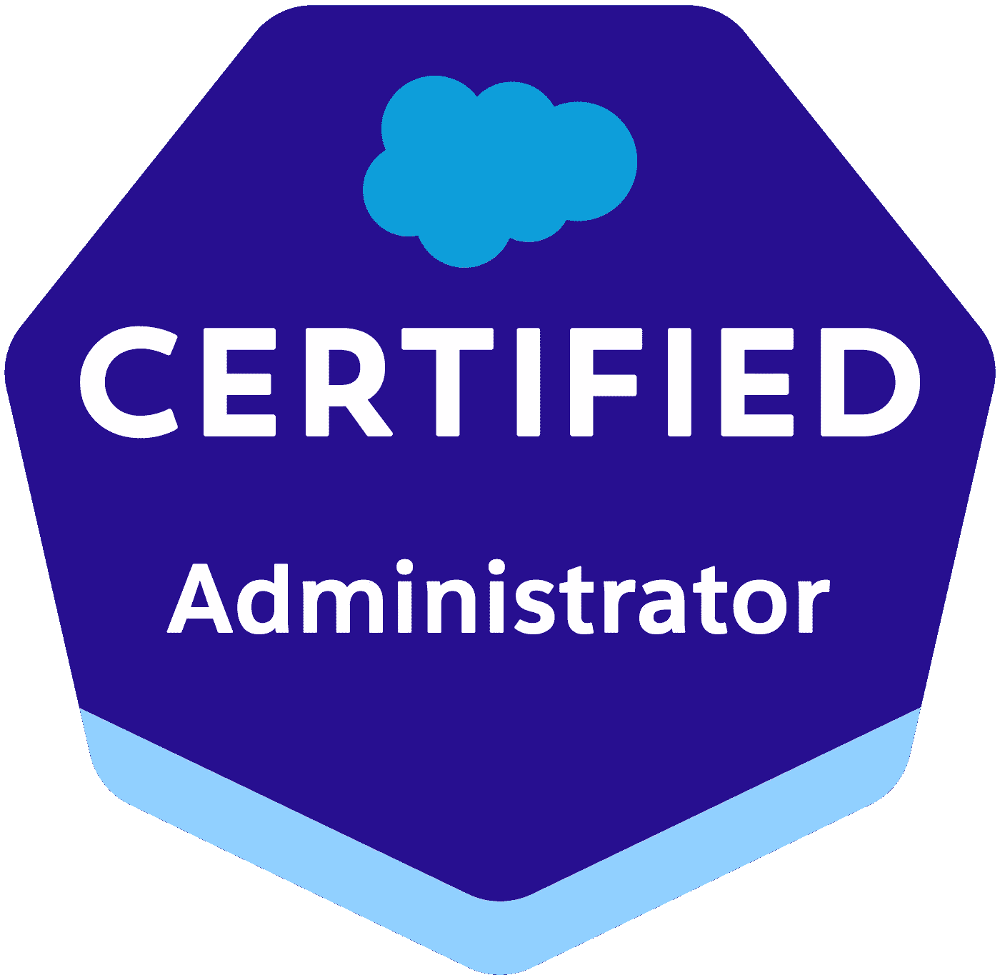
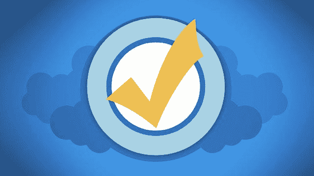
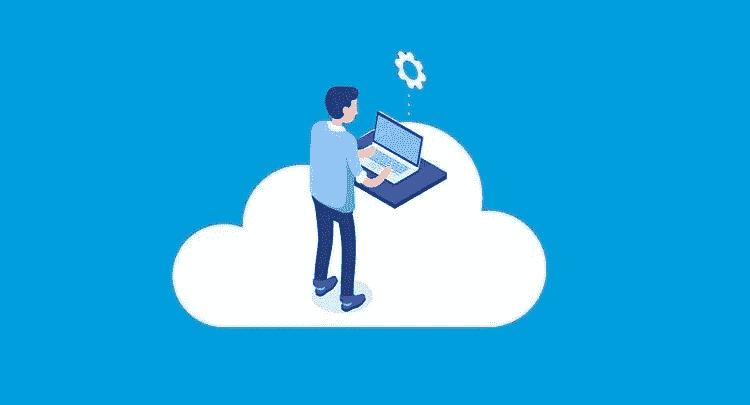
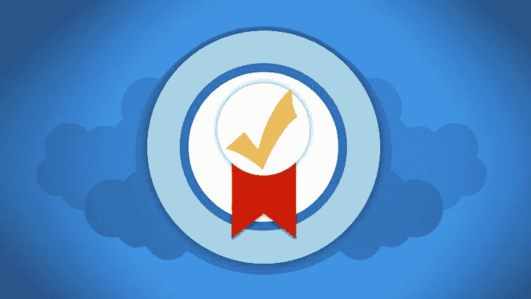
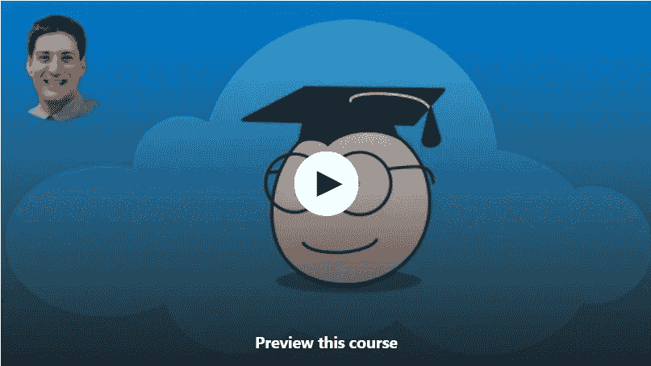

# 2023 年 7 门最佳 Salesforce 管理员认证考试[CRT -101]课程和实践测试

> 原文：<https://medium.com/javarevisited/7-best-salesforce-administrator-certification-exam-crt-101-courses-and-practice-tests-e8feeea4cc67?source=collection_archive---------0----------------------->

## 我最喜欢的准备 2023 年 Salesforce 管理员认证考试【CRT 101】的线上课程和练习题来自 Udemy，Pluralsight，Trailhead 等。

大家好，如果您正在准备 sales force Administrator(CRT-101)认证并寻找最好的在线课程，那么您来对地方了。早些时候，我已经分享了 [**最佳 Salesforce 开发人员**](/javarevisited/7-best-courses-to-learn-salesforce-development-in-2021-1f861a0c2fff) 和 [**App Builder 课程**](/javarevisited/7-best-online-courses-for-salesforce-platform-app-builder-certification-in-2021-8e15a08693cf) ，在本文中，我将分享您可以参加的最佳 Salesforce 管理员课程，以在 2023 年破解这一按需认证。

如果您关注云计算趋势，那么您很有可能听说过流行的 Salesforce 认证，如 **Salesforce 认证管理员计划(CRT-101)** 。由于 Salesforce 在基于云的 CRM 中非常受欢迎，因此对认证 Salesforce 管理员的需求很大。

[Salesforce](https://www.salesforce.com) 是一款 Saas 云业务 CRM(客户关系管理),可帮助公司组织工作，提高工作效率，与客户和合作伙伴保持联系，使他们能够保持业务活力。

这是一个巨大的[云平台](https://javarevisited.blogspot.com/2020/05/top-5-course-to-crack-google-cloud-associate-cloud-engineer-certification-exam.html)，包含许多部分，如营销云、销售云、服务云、社区云、分析云等等。因此，salesforce 创建了一个认证计划，将教您如何作为管理员使用 Salesforce，并在您通过他们的考试时获得认证。

获得[**sales force administrator 认证(CRT-101)**](https://javarevisited.blogspot.com/2020/06/top-5-courses-to-crack-salesforce-administrator-certification.html) 取决于你在你工作的公司的职位，比如你想成为商业用户、销售团队、内部业务流程、营销团队等等。

您的工作几乎就像添加字段、创建流程构建器、执行流程等等。一名 [salesforce 管理员](https://javarevisited.blogspot.com/2020/06/top-5-salesforce-development-certification-training-courses.html#axzz6jnfFhmxc)的平均年薪大约在**7 万美元**左右，它被认为是促进你营销职业生涯的最佳云认证之一。

在本文中，我们将看到您可以用来准备 2023 年代码为 CRT 101 的正式 Salesforce 管理员认证考试的最佳在线培训课程和实践测试。

你可以先参加这些课程，准备官方学习指南中给出的所有主题，然后参加实践考试，进一步测试你的知识。这是第一次尝试就通过任何 IT 认证的最佳策略。

# 7 门最佳 Salesforce 管理员认证在线课程

在不浪费您更多时间的情况下，这里有 7 个最好的在线培训课程和模拟测试，为代码为 CRT-101 的 Salesforce 管理员认证做准备。这些是由已经通过这一有用认证的专家和人员创建的，并且很好地涵盖了考试主题。它们也很实惠，你在 Udemy 上只需花 10 美元就能买到大多数课程，还有一门课程是完全免费的。以防万一，如果你正在寻找一个*免费的 Salesforce 管理员考试*课程，以便你可以继续你的认证。

## 1.[完整的 Salesforce Classic 管理员认证](https://click.linksynergy.com/deeplink?id=JVFxdTr9V80&mid=39197&murl=https%3A%2F%2Fwww.udemy.com%2Fcourse%2Fsalesforce-administrator%2F)

此在线计划是一个完整的 salesforce 管理员认证培训，将解释获得 salesforce 管理员工作所需的一切，如 salesforce 安全、角色和简档之间的差异、salesforce 照明体验，以及您将在本课程中学到的更多内容。

以下是本课程将学到的主要内容:

*   使用 Salesforce 平台。
*   Salesforce security。
*   Salesforce 移动应用程序。

您还将获得关于如何使用该平台的实践经验，以及您应该了解的每一个细节，以便成为一名专业的 salesforce 管理员，并自信地通过考试并获得正式证书。

总之，从零开始准备 Salesforce 管理员认证考试最好的 Udemy 课程之一。

**这是参加本课程的链接** — [完整的 Salesforce Classic 管理员认证](https://click.linksynergy.com/deeplink?id=JVFxdTr9V80&mid=39197&murl=https%3A%2F%2Fwww.udemy.com%2Fcourse%2Fsalesforce-administrator%2F)

## 2. [Salesforce 认证管理员—完整指南](https://click.linksynergy.com/deeplink?id=JVFxdTr9V80&mid=39197&murl=https%3A%2F%2Fwww.udemy.com%2Fcourse%2Fsalesforce-certified-administrator-201-2017%2F)【Udemy】

这个 7-17 小时的课程是为认真参加并通过 salesforce 管理员考试的人定义的。它将向您展示您需要知道的一切，如果您是初学者，不需要任何经验或编码技能。

以下是您在本课程中将学到的主要内容:

*   销售力量生态系统介绍。
*   如何使用 salesforce？
*   在[云中创建应用](https://javarevisited.blogspot.com/2020/05/top-5-cloud-courses-for-java-and-spring-boot-developers.html#axzz6UV11QHE1)。

您将学习安全性和访问、salesforce 导航、销售和营销应用程序、支持应用程序、数据管理、报告仪表板，以及您将通过本课程探索的更多内容。

**以下是参加本课程的链接** — [Salesforce 认证管理员](https://click.linksynergy.com/deeplink?id=JVFxdTr9V80&mid=39197&murl=https%3A%2F%2Fwww.udemy.com%2Fcourse%2Fsalesforce-certified-administrator-201-2017%2F)

## 3. [Salesforce 管理:全局](https://pluralsight.pxf.io/c/1193463/424552/7490?u=https%3A%2F%2Fwww.pluralsight.com%2Fcourses%2Fsalesforce-administration-big-picture) [Pluralsight]

本课程将深入探讨 salesforce 生态系统的工作方式，并向您展示 salesforce 不仅仅是一个 CRM，还可以用于创建应用程序和对象等一般用途。简而言之，准备 Salesforce 管理考试的[最佳 Pluralsight 课程](https://pluralsight.pxf.io/c/1193463/424552/7490?u=https%3A%2F%2Fwww.pluralsight.com%2Fcourses%2Fsalesforce-administration-big-picture)。

你将在这门课中学到:

*   salesforce 的工作方式。
*   开发 salesforce 应用。
*   制作更复杂的报告。

您还将学习报告、数据、批量加载、与用户合作、如何通过自定义扩展 salesforce、创建自定义对象和记录等内容。

**以下是参加本课程的链接** — [销售团队管理:大图](https://pluralsight.pxf.io/c/1193463/424552/7490?u=https%3A%2F%2Fwww.pluralsight.com%2Fcourses%2Fsalesforce-administration-big-picture)

顺便说一句，你需要一个 [Pluralsight 会员](https://pluralsight.pxf.io/c/1193463/424552/7490?u=https%3A%2F%2Fwww.pluralsight.com%2Flearn)来观看这个课程，费用大约为每月 29 美元或每年 299 美元，虽然这完全值得你的钱，但你也可以通过使用他们的 [**10 天免费试用**](https://pluralsight.pxf.io/c/1193463/424552/7490?u=https%3A%2F%2Fwww.pluralsight.com%2Flearn) 来免费观看这个课程，这允许 200 分钟免费访问他们关于最新技术和认证的所有 7000 个在线课程。

<https://pluralsight.pxf.io/c/1193463/424552/7490?u=https%3A%2F%2Fwww.pluralsight.com%2Flearn>  

## 4.[完整的 Salesforce 高级管理员认证](https://click.linksynergy.com/deeplink?id=JVFxdTr9V80&mid=39197&murl=https%3A%2F%2Fwww.udemy.com%2Fcourse%2Fthe-complete-salesforce-advanced-administrator-certification%2F)

此在线 Salesforce 课程是最大规模和最高级的课程之一，提供 28 小时的视频内容，因此它将使您做好准备，轻松并自信地通过考试，成为 salesforce 管理员认证。

以下是您将在本课程中学到的关键技能:

*   salesforce 平台中安全访问的所有方面。
*   自动化的过程。
*   销售云应用程序。

本课程将从创建自定义对象和应用程序、关系类型、记录级访问或一般安全性、自动化工具、数据维护等开始，您可以在整个课程中学习更多内容。

**以下是参加本课程的链接** — [完整的 Salesforce 高级管理员认证](https://click.linksynergy.com/deeplink?id=JVFxdTr9V80&mid=39197&murl=https%3A%2F%2Fwww.udemy.com%2Fcourse%2Fthe-complete-salesforce-advanced-administrator-certification%2F)

## 5. [Salesforce 管理员认证课程](https://click.linksynergy.com/deeplink?id=CuIbQrBnhiw&mid=39197&murl=https%3A%2F%2Fwww.udemy.com%2Fcourse%2Fbuild-your-app-using-salesforce%2F) e [Udemy]

这是为 2023 年的 Salesforce 管理员认证考试做准备的又一个牛逼课程。它以引人入胜的方式涵盖了学习指南中列出的所有主题。

在每一部分之后，你会发现作业和测验。本课程不是一个 power-point 演示，而是一个完整的实践课程，因此您可以在实践中学习。

以下是您将在本课程中学到的重要内容:

1.  使用 Salesforce 构建您自己的自定义应用程序
2.  了解高级需求，并将其转化为 Salesforce 上的应用程序
3.  使用工作流和批准流程构建业务逻辑。
4.  创建简档和权限集以控制用户访问级别
5.  创建用户并将他们分配到适当的简档和权限集。管理许可证
6.  如何使用数据加载器工具导入、更新、删除和导出记录

总的来说，这是一个很好的课程，可以从管理的角度获得一些 Salesforce 的基础知识。它有点过时，最后一次更新是在 2019 年，但大多数材料仍然有用。

**这是参加本课程的链接** — [销售人员管理认证课程](https://click.linksynergy.com/deeplink?id=CuIbQrBnhiw&mid=39197&murl=https%3A%2F%2Fwww.udemy.com%2Fcourse%2Fbuild-your-app-using-salesforce%2F) e

## 6.[2011 年夏季销售人员管理认证模拟测试](https://click.linksynergy.com/deeplink?id=CuIbQrBnhiw&mid=39197&murl=https%3A%2F%2Fwww.udemy.com%2Fcourse%2Fsalesforce-administrator-practice-tests%2F)

这是为 Salesforce 管理员认证考试做最后准备的模拟测试。您可以通过这个模拟测试来评估您的知识和准备水平，以及找到您的强项和弱项。

本课程包含 3 个完整的模拟测试，旨在记住学习指南中的所有主题。

讲师遵循了 Salesforce 的官方考试指南，以及 12 个知识领域和每个领域的相应权重，因此您可以真正衡量自己的准备水平。

我强烈建议你在完成学习指南中所有主题的学习后，仔细阅读这些练习测试。如果你想通过第一次考试，你应该在真正考试前持续获得 80%或以上的分数。

**这是本次模拟测试** — [销售人员管理认证实践测试](https://click.linksynergy.com/deeplink?id=CuIbQrBnhiw&mid=39197&murl=https%3A%2F%2Fwww.udemy.com%2Fcourse%2Fsalesforce-administrator-practice-tests%2F)的链接

## 7.[免费的 Salesforce 管理员认证实践课程](https://click.linksynergy.com/deeplink?id=JVFxdTr9V80&mid=39197&murl=https%3A%2F%2Fwww.udemy.com%2Fcourse%2Ffree-salesforce-admin-certification-course-introduction%2F)

当我分享这些与认证相关的课程时，你们中的一些人要求我也分享免费的在线培训课程，因此，在这里，你们可以参加一个关于 Salesforce admin 认证的免费课程。

这一[免费课程](https://click.linksynergy.com/deeplink?id=JVFxdTr9V80&mid=39197&murl=https%3A%2F%2Fwww.udemy.com%2Fcourse%2Ffree-salesforce-admin-certification-course-introduction%2F)将为您提供通过考试问题所需的技能，并将您作为 salesforce 管理员的知识应用到工作领域以及用户和组织的设置中。

您将看到什么是标准和自定义对象以及它们之间的区别、联系人对象、客户以及如何添加一个、salesforce 报表、分析和仪表板等等。当你在课堂上学习这些课程时，你会通过一个小测验。

**此处是加入本课程** — [免费 Salesforce 管理员认证实践课程](https://click.linksynergy.com/deeplink?id=JVFxdTr9V80&mid=39197&murl=https%3A%2F%2Fwww.udemy.com%2Fcourse%2Ffree-salesforce-admin-certification-course-introduction%2F)的链接

以上是为 Salesforce 管理员在线认证做准备的最佳在线课程。我们为您列出了许多**sales force admin certifications(CRT-101)课程**，您可以立即参加这些课程，并成为当今最受欢迎的[10 大云计算技能](/javarevisited/10-best-aws-google-cloud-and-azure-courses-and-certification-from-coursera-to-join-in-2021-5c5e2029a8e7)之一的高薪专业人员。

如果您已经在 Salesforce implementation 工作，那么获得认证可以进一步促进您的职业发展，并可能获得加薪或更好的机会。

其他**认证资源**针对 **IT 专业人员**和 Java 程序员

*   如何成为 Azure 认证管理员助理？
*   [如何破解 Azure Fundamentals (AZ-900)认证](https://javarevisited.blogspot.com/2020/04/how-to-crack-microsoft-azure-fundamentals-certification-az-900-exam.html)
*   [官方 Salesforce 管理员考试指南](https://trailhead.salesforce.com/credentials/administrator)
*   [通过谷歌助理云工程师认证的前 5 门课程](https://javarevisited.blogspot.com/2019/07/top-5-google-cloud-platform-gcp-courses-certifications-online.html)
*   [破解 AWS 解决方案架构师认证的 5 大课程](https://javarevisited.blogspot.com/2019/05/top-5-courses-to-crack-aws-solutions-architect-associate-certification-exam-SAA-C01.html#axzz5rHwAwycj)
*   [程序员前 5 名 AZ-900 模拟测试](https://javarevisited.blogspot.com/2020/02/top-5-AZ-900-exam-Azure-Fundamentals-certification-practice-tests-and-mock-exams-to.html)
*   [学习 Docker 和 Kubernetes 的 10 大课程](https://dev.to/javinpaul/top-10-courses-to-learn-docker-and-kubernetes-for-programmers-4lg0)
*   [准备 AWS 系统运营管理员认证的前 5 门课程](https://javarevisited.blogspot.com/2020/06/top-5-aws-certified-sysops-admin-associate-certification-exam.html)
*   [成为 GCP 云工程师助理的前 5 名课程](https://javarevisited.blogspot.com/2020/05/top-5-course-to-crack-google-cloud-associate-cloud-engineer-certification-exam.html) r
*   [如何通过 AZ-300 Azure 解决方案架构师考试？](https://javarevisited.blogspot.com/2020/04/how-to-crack-microsoft-azure-solution-architect-exam-az-300.html)
*   [5 次免费的 AWS 解决方案架构师实践测试](https://javarevisited.blogspot.com/2019/08/top-5-free-aws-solution-architect-Associate-certification-dumps-practice-questions.html)
*   [通过谷歌助理云工程师认证的前 5 门课程](https://javarevisited.blogspot.com/2019/07/top-5-google-cloud-platform-gcp-courses-certifications-online.html)
*   [通过 AWS 云从业者认证的前 5 门课程](https://javarevisited.blogspot.com/2020/02/top-5-courses-to-crack-aws-certified-cloud-practitioner-exam-certification-clf-c01.html)

感谢您阅读本文。如果您喜欢这些免费和付费的 alesforce 管理员在线培训课程，请与您的朋友和同事分享。这确实有所不同，然后你提前分享。我真的很感激。

**P. S.** —如果您是 Salesforce 世界的新手，并且正在寻找一个免费的课程来首先学习 Salesforce，那么我建议您加入这个免费的 Udemy 课程— [**以简单的步骤学习 SalesForce 并获得 Parikshith Red 和 Samata Chag 的认证**](https://click.linksynergy.com/deeplink?id=JVFxdTr9V80&mid=39197&murl=https%3A%2F%2Fwww.udemy.com%2Fcourse%2Flearn-salesforce-in-easy-steps-and-get-certified%2F) 。您将从这个 3.5 小时的资源中获得良好的 Salesforce 知识，而且它是完全免费的。你只需要一个免费的 Udemy 帐户就可以在线学习这门课程。

<https://click.linksynergy.com/deeplink?id=JVFxdTr9V80&mid=39197&murl=https%3A%2F%2Fwww.udemy.com%2Fcourse%2Flearn-salesforce-in-easy-steps-and-get-certified%2F> 