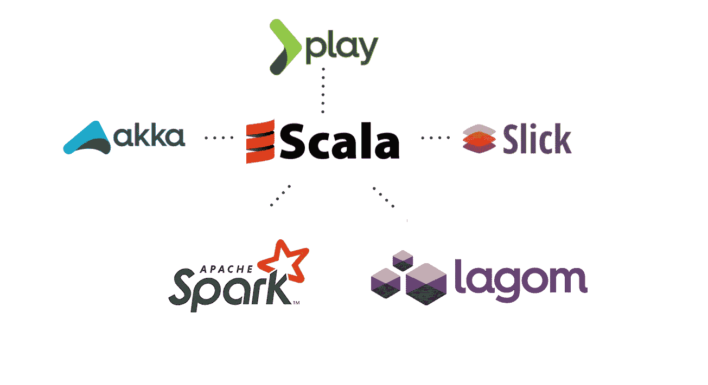
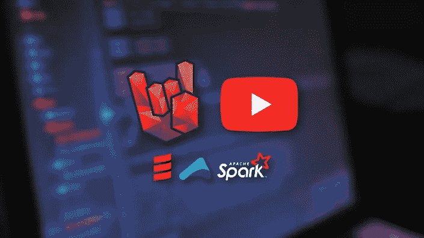
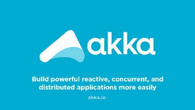
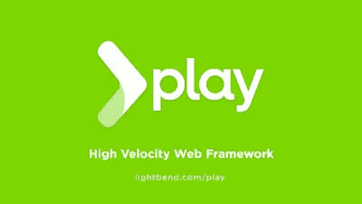
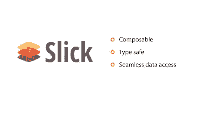
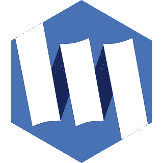
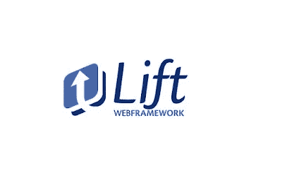
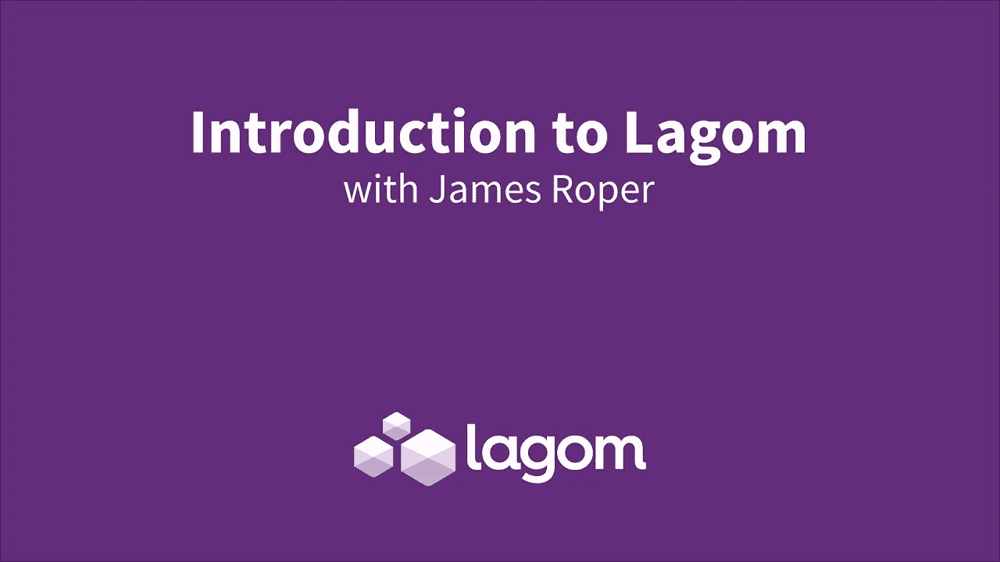

# 2023 年要学习的 7 个关于并发、Web 开发和大数据的最佳 Scala 框架和库

> 原文：<https://medium.com/javarevisited/7-best-scala-frameworks-for-concurrency-web-development-and-big-data-to-learn-fbd52dbe0a9a?source=collection_archive---------0----------------------->

## 对于并发、web 开发、数据库访问、微服务等等，这些都是最好的 Scala 框架。

大家好，Scala 已经存在一段时间了，有一些有用的 Scala 框架可以帮助 Java 开发人员创建更好的应用和产品，如[微服务](/javarevisited/top-5-frameworks-java-developers-can-learn-for-microservices-development-in-2022-848da66d6651)等等。

如果你对学习最好的 Scala 框架感兴趣，那么你来对地方了。在过去，我已经分享了学习 Scala 和 [Groovy](/javarevisited/6-best-resources-to-learn-groovy-and-grails-for-java-developers-18c04e88fa8a) 的 [**最佳课程，在本文中，我们将看看 2023 年你可以学习的一些最佳 Scala 框架。**](/javarevisited/10-best-scala-and-functional-programming-online-courses-for-beginners-b6461b27bf)

这些是在 Java 开发中有用的流行 Scala 框架，如 Akka、Lagom、Play 等。我还会分享一些有用课程的链接，你可以学习这些 u 框架。

这些框架还将为您提供一些选择和知识，帮助您决定哪种技术和框架更适合您的需求。

之后，在下一篇文章中，我们将看到有用的 Groovy 框架，如用于 web 开发的 [Grails](/javarevisited/6-best-resources-to-learn-groovy-and-grails-for-java-developers-18c04e88fa8a) ，用于构建和依赖管理的 [Gradle](/javarevisited/5-best-gradle-courses-and-books-to-learn-in-2021-93f49ce8ff8e) ，以及用于自动化和单元测试的 [Spock 框架](/javarevisited/10-test-automation-libraries-for-java-developers-e40cb61dcd49)。

但是，故事并没有就此结束，我们将再次看到一些更先进的新 Scala 框架，如用于创建[微服务的 Lagom】，用于创建 web 应用的 Lift，以及高性能 Scala/Scala Monix。js 库，用于编写异步的、基于事件的 Scala 应用程序。

顺便说一句，如果你是 Scala 新手，那么我强烈推荐你首先阅读 Udemy 上 Daniel 的](/javarevisited/10-best-java-microservices-courses-with-spring-boot-and-spring-cloud-6d04556bdfed?source=rss-bb36d8439904------2&utm_source=dlvr.it&utm_medium=linkedin) [**Scala 和面向初学者的函数式编程|摇滚 JVM**](https://click.linksynergy.com/deeplink?id=JVFxdTr9V80&mid=39197&murl=https%3A%2F%2Fwww.udemy.com%2Fcourse%2Frock-the-jvm-scala-for-beginners%2F) 课程。

这个 15 小时 30 分钟的在线课程是在线学习 Scala 的最佳课程，它会教你使用这些框架所需的所有基本 Scala 概念。

# 2023 年你可以学习的 7 大 Scala 框架和库

不要再浪费你的时间了，这里有一个最好的 Scala 和 Groovy 框架的列表，Java 开发者可以学习使用 [Java](/javarevisited/top-5-java-online-courses-for-beginners-best-of-lot-1e1e240a758) 、 [Groovy](https://javarevisited.blogspot.com/2017/08/top-5-books-to-learn-groovy-for-java.html) 和 [Scala](https://javarevisited.blogspot.com/2019/01/5-free-scala-programming-courses-for-java-programmers-learn-online.html) 来编写更好的应用。

除了这些框架是什么以及它们提供了什么好处之外，我还提到了您可以用来学习这些框架、工具和库的相关课程。

## 1.Akka 并发框架

毫无疑问，在 [Java](/javarevisited/top-5-java-online-courses-for-beginners-best-of-lot-1e1e240a758) 中编写正确的分布式、并发、容错、可伸缩的应用是困难的。Akka 的目标是通过引入正确的抽象层次和使用最好的工具和实践来解决这个问题。

Akka 引入了 Actor modern，并提供了一个更好的平台来构建可伸缩的、有弹性的、响应迅速的应用程序。它还提供了一个完整的工具包，用于在 Java 和 Scala 中构建高度并发、分布式和弹性的消息驱动应用程序。I

如果你想提高你的并发技能，那么学习 Akka 可能是一个很好的主意，如果你需要资源，那么你可以使用 Udemy 的 Daniel CioCirlan 的这个[**Akka Essentials with Scala**](https://click.linksynergy.com/deeplink?id=JVFxdTr9V80&mid=39197&murl=https%3A%2F%2Fwww.udemy.com%2Fcourse%2Fakka-essentials%2F)课程。用 Scala 学习 Akka actor 模型，编写并行、并发、容错系统，是最好的课程之一。

## 2.阿帕奇火花

Apache Spark 是另一个用 Scala[编写的流行框架。它在大数据领域非常受欢迎，可用于在短时间内分析大量数据。](/javarevisited/7-free-scala-and-functional-programming-courses-for-beginners-370f3cd41a4e)

[Apache Spark](https://spark.apache.org/) 是一个开源的集群计算平台。它提供了一个接口，用于通过隐式数据并行性和容错对整个集群进行编程。

如果您正在考虑转向大数据或开展一些大数据项目，那么学习 Spark 可能是个好主意。如果你想学习 Spark，我强烈推荐你在 Udemy 上看看 Frank Kane 的这个 [**Apache Spark 与 Scala**](https://click.linksynergy.com/deeplink?id=JVFxdTr9V80&mid=39197&murl=https%3A%2F%2Fwww.udemy.com%2Fcourse%2Fapache-spark-with-scala-hands-on-with-big-data%2F) 课程。自学在线学习 Spark，这是一门既实用又实用的课程。

## 3.游戏框架

就像 Akka 让用 Java 和 Scala 编写并发应用变得容易一样，Play Framework 让用 [Java](/javarevisited/10-best-places-to-learn-java-online-for-free-ce5e713ab5b2) 和 [Scala](https://javarevisited.blogspot.com/2017/03/top-30-scala-and-functional-programming.html) 构建 web 应用变得容易。

Play 基于一个轻量级、无状态、web 友好的架构，利用高度并发和可伸缩的 Akka 框架来编写高度可伸缩的 web 应用程序。

Play 为高可伸缩应用提供可预测的最小资源消耗(CPU、内存、线程)。

和 Akka 一样，Play 是两个最流行的 Scala 框架，如果你想学习 Play，你可以从 Udemy 上的这个 [**Play 大师级课程**](https://click.linksynergy.com/deeplink?id=JVFxdTr9V80&mid=39197&murl=https%3A%2F%2Fwww.udemy.com%2Fcourse%2Fplay-framework-for-web-application-development%2F) **e** 开始。

## 4. [Scala Slick](https://scala-slick.org/)

Slick 是 Scala 的一个现代数据库查询和访问库。它允许您像使用 Scala 集合一样处理存储的数据，同时让您完全控制何时进行数据库访问以及传输哪些数据。

你可以用 Scala 而不是 [SQL](/javarevisited/top-5-sql-and-database-courses-to-learn-online-48424533ac61) 编写数据库查询，从而从 Scala 的静态检查、编译时安全性和组合性中获益。Slick 具有一个可扩展的查询编译器，可以为不同的后端生成代码。

如果你想在 2023 年学习 Slick 并寻找好的资源，那么你也可以在 Udemy 上查看这个[**Kickstart SCALA——UItimate SCALA 初学者训练营**](https://click.linksynergy.com/deeplink?id=JVFxdTr9V80&mid=39197&murl=https%3A%2F%2Fwww.udemy.com%2Fcourse%2Fkickstart-scala-the-uitimate-scala-beginner-bootcamp-4-u%2F) 课程。它触及了所有重要的 Scala 框架，包括数据库的 Slick。

## 5.[莫尼克斯](https://monix.io/)

Monix 是另一个高性能 Scala / Scala.js 库，用于编写异步的、基于事件的应用程序。

它最初是 ReactiveX 的一个正确实现，具有更强的函数式编程影响，是为反压而从头设计的，并与 Scala 的标准库进行了干净的交互，开箱即用，与 Reactive Streams 协议兼容。

在线学习 Monix 的资源不多，我没有找到任何书籍或课程，但他们的文档很好，你可以利用它们自己学习 Monix。

## 6.电梯

Lift 是当今最强大、最安全的 web 框架之一。这是一个为 Scala 编程语言设计的免费开源 web 框架。

它最初是由 David Pollak 创建的，他对 Ruby on Rails 框架的某些方面不满意。

由于 Lift 应用是用兼容 Java 的 Scala 编写的，所以你仍然可以使用你喜欢的 Java 库，并把它们部署到你喜欢的 Servlet 容器和应用服务器上。

Scala 允许你使用你已经写好的代码，并把它部署到你已经配置好的容器中！如果你想在 2023 年学习电梯，并寻找一个很好的资源，那么你也可以在 Udemy 查看这个**电梯大师班**。

## 7.拉戈姆

这是另一个使用 Scala 工具和框架构建微服务的 Scala 框架。它实际上是一个平台，为您提供构建、管理和监控高性能、无阻塞微服务的完整工具集。

该框架面向 Java 开发人员，但使用了 Scala 强大的工具和技术，如:

*   **SBT** (Scala 的构建系统，项目定义)，
*   **播放** (REST 端点，Guice 依赖注入)
*   **Akka** (加工)
*   **卡珊德拉**(默认数据存储)

大多数技术都隐藏在界面后面，所以你不需要担心。它还是相当新的，但是它也为在 Java 世界中构建微服务提供了一种选择，可以替代 Spring Boot、T21 和夸库。

这就是你能在 2023 年学到并在他们的项目中使用的一些最好的 Scala 框架。值得记住的是，Grails 和 Play 可以用来开发 web 应用程序，而 [Gradle](https://javarevisited.blogspot.com/2020/05/top-5-courses-and-books-to-learn-gradle.html#axzz6fk6WjYD0) 可以像 Maven 一样帮助你构建应用程序。Akka 是并发框架， [Spark](/javarevisited/5-best-apache-spark-courses-for-java-and-python-developers-bbd9d63eb76c) 是大数据框架，Spock 用于数据驱动的单元测试。

其他**编程课程**和**文章**你可能喜欢

*   [2023 年 Java 开发者路线图](https://javarevisited.blogspot.com/2019/10/the-java-developer-roadmap.html)
*   [Java 开发者可以学习的 3 种编程语言](https://javarevisited.blogspot.com/2018/02/top-3-jvm-languages-java-programmer-learn.html)
*   [学习 Scala 编程的免费书籍](https://javarevisited.blogspot.com/2014/01/top-5-free-books-to-learn-scala-programming-PDF.html)
*   [学习 Scala 编程的 10 个理由](https://javarevisited.blogspot.com/2018/01/10-reasons-to-learn-scala-programming.html)
*   [用 Scala 学习 Apache Spark 的 5 门免费课程](https://www.java67.com/2018/04/5-free-apache-spark-course-for-java-scala-python-developers.html)
*   [我最喜欢的学习软件架构的课程](/javarevisited/top-5-courses-to-learn-software-architecture-in-2020-best-of-lot-5d34ebc52e9)
*   [2023 年 Java 开发人员应该学会的 10 件事](https://javarevisited.blogspot.com/2017/12/10-things-java-programmers-should-learn.html#axzz5atl0BngO)
*   [深入学习 Spring 框架的 5 门课程](https://javarevisited.blogspot.com/2018/06/top-6-spring-framework-online-courses-Java-programmers.html)
*   [2023 年学习 Spring 框架的前 6 门课程](https://javarevisited.blogspot.com/2018/06/top-6-spring-framework-online-courses-Java-programmers.html)
*   [学习机器学习和数据科学的 10 门课程](https://javarevisited.blogspot.com/2018/10/data-science-and-machine-learning-courses-using-python-and-R-programming.html)
*   [面向程序员的 2023 年 DevOps 路线图](https://javarevisited.blogspot.com/2018/09/the-2018-devops-roadmap-your-guide-to-become-DevOps-Engineer.html)
*   [深入了解 Spring Boot 的十大课程](/javarevisited/top-10-courses-to-learn-spring-boot-in-2020-best-of-lot-6ffce88a1b6e)
*   [面向程序员和工程师的 10 门 DevOps 课程](https://javarevisited.blogspot.com/2018/09/10-devops-courses-for-experienced-java-developers.html)
*   [面向 Java 开发人员的 30 大 Scala 面试问题](https://javarevisited.blogspot.com/2017/03/top-30-scala-and-functional-programming.html)
*   【Java 和 Web 开发人员应该学习的 10 个框架
*   [面向程序员的 5 大 Java 设计模式课程](https://javarevisited.blogspot.com/2018/02/top-5-java-design-pattern-courses-for-developers.html)
*   [5 门免费课程学习芯泉和 Spring Boot](http://www.java67.com/2017/11/top-5-free-core-spring-mvc-courses-learn-online.html)

感谢您阅读本文。如果你喜欢这些*最好的 Groovy 和 Scala 框架*，那么请与你的朋友和同事分享。如果您有任何问题或反馈，请留言。

**P. S. —** 如果你真的想学习 Scala 编程语言和框架，比如 Akka，并且正在寻找最好的 Scala 课程，那么你也可以看看 Udemy 上 Daniel 的 [**Scala 和面向初学者的函数式编程|摇滚 JVM**](https://click.linksynergy.com/deeplink?id=JVFxdTr9V80&mid=39197&murl=https%3A%2F%2Fwww.udemy.com%2Fcourse%2Frock-the-jvm-scala-for-beginners%2F) 课程。这个 15 小时 30 分钟的在线课程是在线学习 Scala 的最佳课程。

 [## 2023 年在线学习 Scala 编程的前 5 门课程——最好的

### 大家好，如果你想学习 Scala 编程语言并寻找最好的在线课程来开始你的…

javarevisited.blogspot.com](https://javarevisited.blogspot.com/2020/09/top-5-courses-to-learn-scala.html)