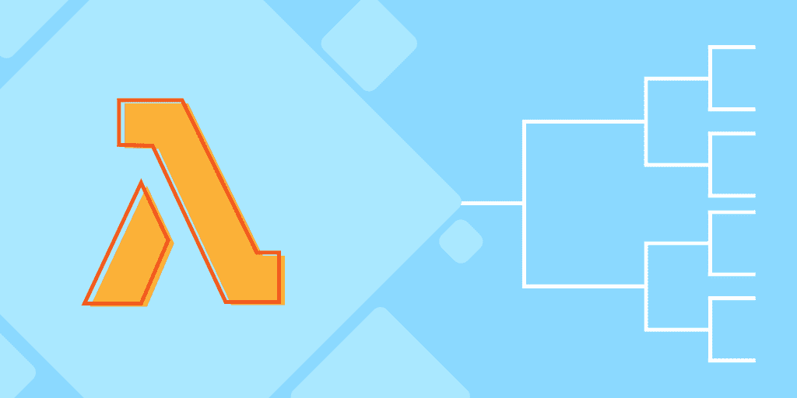
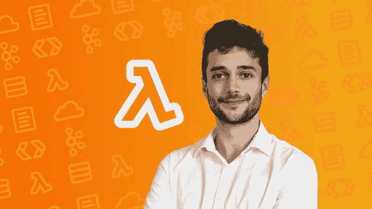
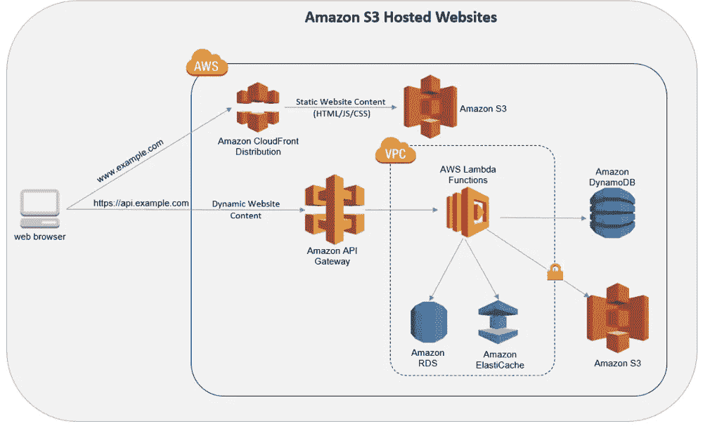
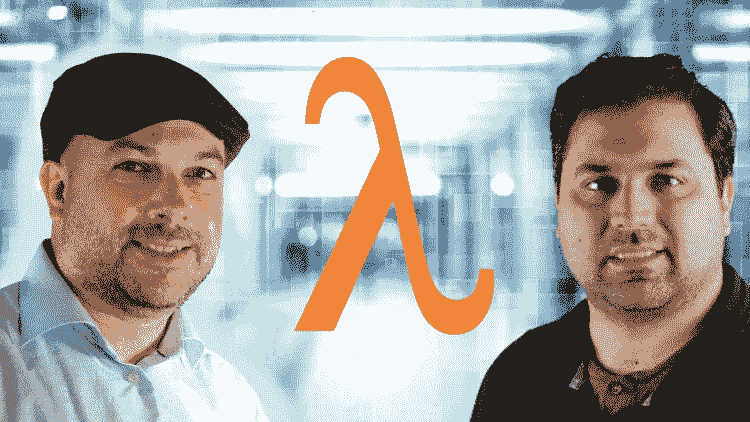
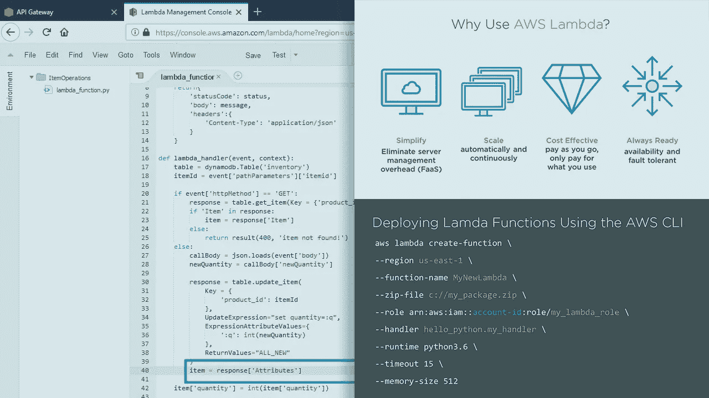
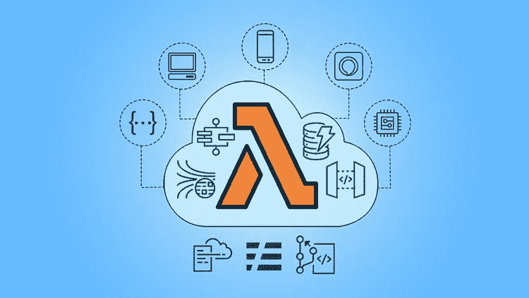

# 2023 年要学习的 7 门最佳无服务器和 AWS Lambda 课程

> 原文：<https://medium.com/javarevisited/7-best-serverless-and-aws-lambda-courses-to-learn-in-2021-de1820111c85?source=collection_archive---------1----------------------->

## 2023 年想学 AWS Lambda 和 Serverless？这些是 Udemy、Pluralsight、Coursera 和 Educative 为初学者提供的学习无服务器和 AWS Lambda 的最佳在线课程

image_credit —教育性

大家好，如果你想在 2023 年学习无服务器架构和 AWS Lambda，那么你来对地方了。之前我已经分享了 [**最好的 AWS 课程**](/javarevisited/top-10-courses-to-learn-amazon-web-services-aws-cloud-in-2020-best-and-free-317f10d7c21d) 今天我要分享的是 2023 年学习 AWS Lambda 和 Server less 的最好课程。

如果你关注科技和云计算新闻，那么你可能听说过越来越多的软件开发者谈论的无服务器架构和 **AWS Lambda function** 。

> AWS Lambda 是一个事件驱动的无服务器计算平台，由 Amazon 作为 Amazon Web Services 的一部分提供。

还有其他无服务器的计算平台，如[微软 Azure](https://javarevisited.blogspot.com/2020/04/how-to-crack-microsoft-azure-fundamentals-certification-az-900-exam.html) 有 **Azure 功能**和 [GCP](https://javarevisited.blogspot.com/2019/07/top-5-google-cloud-platform-gcp-courses-certifications-online.html) 也有**云功能**。借助 AWS Lambda 或 Azure Functions 等无服务器框架，开发人员可以编写可扩展的容错代码，这些代码可以在云中运行，而无需配置或管理服务器。

我的意思是，你不需要得到一个 [EC2 实例](https://javarevisited.blogspot.com/2020/08/top-5-courses-to-learn-amazon-aws-ec-2.html)或者一个虚拟机来运行你的应用。这也意味着即使你的应用没有运行，你也不会按小时计费。 [AWS Lambda](https://javarevisited.blogspot.com/2020/07/top-6-courses-to-learn-aws-lambda-and-serverless.html) 只会在需要处理 HTTP 请求这样的触发器时启动容器。

由于你的应用程序不是在一个持续运行的服务器上运行，这种架构被称为无服务器，现在每个云提供商都支持它。

比如 [AWS](https://javarevisited.blogspot.com/2020/02/top-5-courses-to-crack-aws-certified-cloud-practitioner-exam-certification-clf-c01.html) 支持使用 Lambdas 的无服务器开发，Azure 有 *Azure 函数*Google Cloud 有 *Google Cloud 函数*。如果你有兴趣了解无服务器计算平台，特别是 AWS Lambda，那么你来对地方了。

在本文中，我将分享一些最好的在线课程，学习如何使用 AWS Lambda 创建、部署和管理事件驱动的无服务器应用程序。

无服务器计算是当今报酬最高的云技能之一。无服务器也是 AWS 认证考试的一个重点领域，无论是在[助理](https://www.java67.com/2020/04/how-to-paas-aws-certified-solution-architect-exam-in-2020.html)还是在[专业](/javarevisited/6-best-courses-for-aws-certified-solution-architect-professional-exam-in-2020-df5850a9279a)级别。这些在线课程将帮助您掌握无服务器难题的所有不同部分。

 [## AWS Lambda 和无服务器框架培训

### AWS Lambda 和无服务器框架是无服务器世界中最快的入门方式，部署 AWS…

udemy.com](https://click.linksynergy.com/deeplink?id=JVFxdTr9V80&mid=39197&murl=https%3A%2F%2Fwww.udemy.com%2Fcourse%2Faws-lambda-serverless%2F) 

# 2023 年为什么要学无服务器架构？

无服务器计算将塑造 web 开发的未来，因为它允许您摆脱“传统”web 托管带来的许多问题。现在是时候投入这项激动人心的新技术了！

与传统的虚拟主机不同，在传统的虚拟主机中，您需要启动服务器，配置它们，然后部署您的代码，而在无服务器应用中，您不需要管理任何服务器！相反，您只需提供您的代码并定义它何时应该被执行。搞定了。

无需管理任何服务器，您通常支付的费用更少(因为您没有开销容量)，可以更好地应对传入的流量高峰，并且不必担心服务器安全性！由于这些原因，无怪乎无服务器计算正在兴起，越来越多的公司采用它！现在就学习它，以获得优势，并将其用于自己的项目或申请高薪工作！

那么，我们还在等什么？让我们深入到 2023 年学习 Serverless 和 AWS Lambda 的最佳在线课程中。

 [## AWS Lambda 和无服务器框架培训

### AWS Lambda 和无服务器框架是无服务器世界中最快的入门方式，部署 AWS…

udemy.com](https://click.linksynergy.com/deeplink?id=JVFxdTr9V80&mid=39197&murl=https%3A%2F%2Fwww.udemy.com%2Fcourse%2Faws-lambda-serverless%2F) 

# 2023 年无服务器架构和 AWS Lambda 的 7 门最佳课程

AWS Lambda 允许您在 AWS 上创建无服务器应用程序。是的，还有其他方法来创建一个无服务器的应用程序，比如你可以在微软 Azure 云上使用 Azure 功能，T2 和 GCP 也有类似的服务。

虽然我已经在本文中包含了 AWS Lambda 的课程，我可能会写其他文章来介绍 Azure 函数和 GCP 云函数。

无论如何，不要再浪费你的时间了，这里列出了学习无服务器架构和 AWS lambda 的最佳课程

## 1. [AWS Lambda 和无服务器框架学习！](https://click.linksynergy.com/deeplink?id=JVFxdTr9V80&mid=39197&murl=https%3A%2F%2Fwww.udemy.com%2Fcourse%2Faws-lambda-serverless%2F)【Udemy】

这可能是学习 AWS Lambda 函数和无服务器的最佳 Udemy 课程,在这个 7 小时的课程中，您将学习使用 Lambda 创建无服务器应用程序并在云中部署它们所需的一切。

以下是您将在本课程中学到的关键技能:

*   AWS Lambda 函数和无服务器框架
*   YAML 编写和管理代码
*   AWS S3、API 网关、DynamoDB、EC2 和 CloudWatch
*   如何正确部署 AWS Lambda 函数

在此过程中，您还将在 AWS lambda 上部署几个现实世界的应用程序，如使用 [Python](/javarevisited/10-free-python-tutorials-and-courses-from-google-microsoft-and-coursera-for-beginners-96b9ad20b4e6) 在 S3 上部署自动缩略图生成服务，使用 [Nodejs](/javarevisited/top-10-online-courses-to-learn-node-js-in-depth-8ef0e31ca139) 使用 AWS API 网关& Lambda 部署 REST API，以及使用 Python 按计划启动和停止实例的 EC2 自动化。

**这里是加入本 AWS 课程** — [AWS Lambda 和无服务器框架](https://click.linksynergy.com/deeplink?id=JVFxdTr9V80&mid=39197&murl=https%3A%2F%2Fwww.udemy.com%2Fcourse%2Faws-lambda-serverless%2F)的链接

没有不包括任何 [**夏羽·马雷克的**](https://click.linksynergy.com/deeplink?id=JVFxdTr9V80&mid=39197&murl=https%3A%2F%2Fwww.udemy.com%2Fuser%2Fstephane-maarek%2F) 课程的 AWS 相关课程列表是完整的。这家伙已经创建了 AWS 概念，认证和服务的可怕的课程，这一个也不例外。

我向已经在使用 Lambdas 但没有深入了解的人，或者想从 [AWS Lambda 函数和无服务器](https://javarevisited.blogspot.com/2020/08/top-10-coursera-certifications-to-learn-cloud-computing-aws.html)开始的完全初学者强烈推荐这门课程，参加这门课程肯定不会让你失望。

它已经得到了超过 25000 名学生的信任，并且是 Udemy 的畅销书之一。

## 2. [AWS 无服务器 API 和应用——完整介绍](https://click.linksynergy.com/deeplink?id=JVFxdTr9V80&mid=39197&murl=https%3A%2F%2Fwww.udemy.com%2Fcourse%2Faws-serverless-a-complete-introduction%2F)

这是我加入的第一批学习 AWS Lambda 和 Serverless 的课程之一。它是由[马克西米利安·施瓦兹米勒](https://click.linksynergy.com/deeplink?id=JVFxdTr9V80&mid=39197&murl=https%3A%2F%2Fwww.udemy.com%2Fuser%2Fmaximilian-schwarzmuller%2F)创建的，他是我最喜欢的 Udemy 讲师之一，他将教你关于无服务器架构、API 和应用程序的所有知识。您将学习如何使用 AWS API Gateway 和 Lambda 构建、保护和运行 API，而无需管理任何服务器。您还将学习如何向无服务器应用程序添加用户身份验证，在云中按需运行代码，以及在不管理任何服务器的情况下托管单页面应用程序(spa)。

如果你是一名 [web 开发人员](/javarevisited/10-things-aspiring-web-developers-should-learn-in-2021-6747bfbfc12e)，那么我向你强烈推荐本课程，因为无服务器计算将塑造 web 开发的未来，因为它可以让你摆脱许多“传统”web 托管带来的问题。

以下是加入本无服务器课程的链接— [AWS 无服务器 API 和应用](https://click.linksynergy.com/deeplink?id=JVFxdTr9V80&mid=39197&murl=https%3A%2F%2Fwww.udemy.com%2Fcourse%2Faws-serverless-a-complete-introduction%2F)

谈到社交证明，这是 AWS lambda 上的 [Udemy 畅销书之一，受到了超过 47，440 名学生的信任，7，740 名学习者的平均评分为 4.6，这充分说明了课程的质量。](/javarevisited/top-10-best-udemy-courses-for-web-development-in-2020-9263f13ee4be)

## 3.[使用 AWS Lambda 构建一个无服务器应用程序—动手操作！](https://click.linksynergy.com/deeplink?id=JVFxdTr9V80&mid=39197&murl=https%3A%2F%2Fwww.udemy.com%2Fcourse%2Fbuild-a-serverless-app-with-aws-lambda-hands-on%2F)【乌迪米】

如果你正在寻找一个基于项目的、动手操作的在线课程来学习 AWS Lambda 和无服务器概念，那么这个 Udemy 课程非常适合你。

由 Frank Kane 和 Brian Tajuddin 创建的这个 7.5 小时的在线课程将教你如何使用 Amazon web Services 创建一个聊天 Web 应用程序——Lambda、DynamoDB、API Gateway、S3、Cognito、CloudFront 等等。

在这个过程中，你还会学到以下关键技能

*   如何构建和设计无服务器应用程序
*   如何使用 AWS 的 S3(简单存储服务)向浏览器提供静态资源
*   如何使用 Javascript 动态修改网页
*   如何使用 IAM(身份和访问管理)管理权限和访问策略
*   如何使用 AWS Lambda 在云中操作和销售数据
*   如何在无服务器应用中使用 CORS 管理客户端安全性
*   如何用 [DynamoDB](https://www.java67.com/2020/08/top-5-courses-to-learn-aws-s3-and-dynamoDB-in-depth.html) 存储和检索数据
*   如何用 API 网关建模 API 和创建 SDK
*   如何用 Cognito 创建用户登录系统
*   最重要的是，如何使用 CloudFront CDN 加速您的 web 应用

谈到社交证明，超过 11，000 名学生参加了这门课程，1300 多名参与者对它的平均评分为 4.5，这太令人惊讶了。如果你喜欢建造东西来学习新技能，那么你会真的喜欢这门课程。

**这里是加入这个令人敬畏的课程的链接** — [用 AWS Lambda 构建一个无服务器应用](https://click.linksynergy.com/deeplink?id=JVFxdTr9V80&mid=39197&murl=https%3A%2F%2Fwww.udemy.com%2Fcourse%2Fbuild-a-serverless-app-with-aws-lambda-hands-on%2F)

## 4.AWS 基础:构建无服务器应用程序

这可能是在线学习亚马逊网络服务(AWS)和无服务器架构的最佳 Coursera 课程。

在这个关于构建无服务器应用程序的在线课程中，讲师 Rick Hurst 将教你无服务器架构和应用程序的基础知识。

这门课程不是别人提供的，而是 [AWS](https://aws.amazon.com/) 本身就很能说明这门课程的质量和真实性。这也是一门完整的实践课程，您将通过演示和动手练习学习构建和部署无服务器应用程序，

这门课程也是 Coursera 最受欢迎的 [**AWS 基础专业**](https://coursera.pxf.io/c/3294490/1164545/14726?u=https%3A%2F%2Fwww.coursera.org%2Fspecializations%2Faws-fundamentals) 的一部分，它是建立你的 AWS 技能的一个很好的资源，受到超过 42，000 名程序员和开发人员的信任。

以下是您将在本课程中学到的关键技能:

*   AWS Lambda 服务
*   亚马逊 Lex
*   亚马逊 API 网关
*   无服务器架构
*   亚马逊 DynamoDB

你可以看到课程的结构很好，你将在这门课程中学到很多关键技术。

**这里是加入这个在线课程的链接** — [AWS 基础:构建无服务器应用](https://coursera.pxf.io/c/3294490/1164545/14726?u=https%3A%2F%2Fwww.coursera.org%2Flearn%2Faws-fundamentals-building-serverless-applications)

你既可以单独学习这门课程，也可以加入 [**Coursera Plus**](https://coursera.pxf.io/c/3294490/1164545/14726?u=https%3A%2F%2Fwww.coursera.org%2Fcourseraplus) ，获得 3000 多门热门的 Coursera 课程、认证、专业和指导项目，以学习任何技术技能。

 [## Coursera Plus |无限制访问 7，000 多门在线课程

### 用 Coursera Plus 投资你的职业目标。无限制访问 90%以上的课程、项目…

coursera.pxf.io](https://coursera.pxf.io/c/3294490/1164545/14726?u=https%3A%2F%2Fwww.coursera.org%2Fcourseraplus) 

## 5. [AWS 开发者:Lambda 深潜](https://pluralsight.pxf.io/c/1193463/424552/7490?u=https%3A%2F%2Fwww.pluralsight.com%2Fcourses%2Faws-developer-lambda-deep-dive)【plural sight】

这是在 Pluralsight 上学习 AWS Lambda 的另一个很棒的课程。该课程由 Dror Helper 创建，他是一名软件开发人员、架构师和顾问，喜欢帮助软件开发人员编写更好的代码，该课程将教您如何编写可扩展的、容错的代码，这些代码在云中运行，无需配置或管理服务器。

在本课程中，您将学习如何利用事件驱动、经济高效的功能，按需扩展以执行任务，而无需配置或管理服务器。

您将从如何使用 AWS Lambda 函数创建无服务器应用程序开始。之后，您将学习如何使用阶跃函数来协调复杂的流程。最后，您将学习如何在生产中管理和部署 Lambda 函数，甚至在本地机器上运行它们。

以下是你将在 AWS Lambda 课程中学到的主要内容:

*   如何创建 Lambda 函数
*   如何使用 AWS 服务
*   如何使用阶跃函数
*   如何使用无服务器应用程序模型？

完成本课程后，您将对 AWS Lambda 函数有一个很好的理解，这将帮助您创建事件驱动的无服务器应用程序。

以下是加入 AWS Lambda 课程的链接— [AWS 开发者:Lambda 深度探索](https://pluralsight.pxf.io/c/1193463/424552/7490?u=https%3A%2F%2Fwww.pluralsight.com%2Fcourses%2Faws-developer-lambda-deep-dive)

顺便说一句，你需要一个 ***Pluralsight 会员*** 来观看这门课程，费用大约是每月 29 美元或每年 299 美元(14%的折扣)，但也提供超过 7000 个关于最新主题的在线课程。或者，你也可以免费使用他们的 [**10 天免费通行证**](https://pluralsight.pxf.io/c/1193463/424552/7490?u=https%3A%2F%2Fwww.pluralsight.com%2Flearn) 。

 [## 个人技术技能|多视角

### 借助 Pluralsight，在开发运维、机器学习、云、安全基础设施等领域构建所需技能…

pluralsight.pxf.io](https://pluralsight.pxf.io/c/1193463/424552/7490?u=https%3A%2F%2Fwww.pluralsight.com%2Flearn) 

## 6. [AWS Lambda 和无服务器架构训练营](https://click.linksynergy.com/deeplink?id=JVFxdTr9V80&mid=39197&murl=https%3A%2F%2Fwww.udemy.com%2Fcourse%2Faws-lambda-serverless-architecture%2F)【Udemy】

这是在 Udemy 上学习 AWS Lambda 和无服务器架构的又一个精彩课程。该课程由 AWS 专家 Riyaz Sayyad 创建，将向您传授关于 AWS 无服务器架构、Lambda、API 网关、DynamoDB、阶跃函数、SAM、无服务器框架& [CI/CD](/javarevisited/7-best-courses-to-learn-jenkins-and-ci-cd-for-devops-engineers-and-software-developers-df2de8fe38f3?source=---------15------------------) 的所有基本知识。在本课程中，您将从零开始学习无服务器计算。您将从零开始，然后我们将深入了解它的所有核心特性以及许多高级特性。我们将学习它是如何工作的，我们为什么使用它，以及如何使用它。

无需事先了解无服务器计算！

谈到社会证明，这门课程是 Udemy 上评分最高的 AWS Lambda 课程之一，受到超过 13704 名学员的信任。该课程还有来自近 1760 名学员的平均 4.6 分的评分，这令人惊讶。

**这是加入 lambda 课程的链接** — [AWS Lambda 和无服务器架构训练营【构建 5 个应用】](https://click.linksynergy.com/deeplink?id=JVFxdTr9V80&mid=39197&murl=https%3A%2F%2Fwww.udemy.com%2Fcourse%2Faws-lambda-serverless-architecture%2F)

## 7.[使用 AWS Lambda 运行无服务器应用](https://www.educative.io/courses/running-serverless-applications-aws-lambda?affiliate_id=5073518643380224)【教育性】

这是学习 AWS Lambda 和无服务器架构的又一个非常棒的交互式文本课程。该课程由 Gojko Adzic 创建，来自[教育平台](/javarevisited/top-10-free-interactive-programming-courses-from-educative-for-beginners-to-learn-in-2021-713cbf96d4eb)，这是一个基于文本的在线学习平台，允许您在浏览器中运行代码和练习，而无需设置任何环境。

在本课程中，您将学习如何使用 AWS Lambda 运行无服务器应用程序。您将从基础开始，比如创建 web 服务，在这里您将学习部署 AWS 无服务器应用程序模型(SAM)的步骤。

然后，您将继续学习更高级的主题，如处理 HTTP 请求、使用外部存储以及管理会话和用户工作流。

本课程结束时，你将准备好在专业环境中使用 AWS Lambda，并且你将拥有一项雇主乐于见到的伟大的、可转移的技能

**这里是加入 AWS lambda 课程的链接**——[使用 AWS Lambda 运行无服务器应用](https://www.educative.io/courses/running-serverless-applications-aws-lambda?affiliate_id=5073518643380224)

而且，如果你找到了教育平台和他们的搜索课程，比如搜索系统设计面试，搜索面向对象编程面试，那么考虑获得 [**教育订阅**](https://www.educative.io/subscription?affiliate_id=5073518643380224) ，每月只需 18 美元就可以访问他们的 100 多门课程。非常划算，非常适合准备编码面试。

 [## 介绍:教育性订阅。获得无限制的访问权限！

### 我们使用 cookies 来确保您在我们的网站上获得最佳体验。请查看我们的隐私政策以了解更多信息…

www.educative.io](https://www.educative.io/subscription?affiliate_id=5073518643380224) 

以上是关于学习 AWS Lambda 和无服务器架构的一些**最佳课程。无服务器计算有很大的潜力，因为它解决了传统开发模式中存在的任何基础设施相关问题，并且非常经济高效。特别是 AWS Lambda 是一项令人惊叹的服务，它还可以让您轻松扩展，并帮助您以自己选择的语言执行功能。**

它具有很大的灵活性，通常已经成为无状态操作(如文件处理和图像处理)的选择，这些操作很容易扩展。Lambda 中的 free 层有一百万个免费请求，这使得您的代码在大多数情况下都可以自由执行。

您可能想了解的其他 **AWS 认证资源**

*   [初学者学习 AWS 的 5 大课程](https://javarevisited.blogspot.com/2020/05/top-5-amazon-web-services-aws-courses-for-beginners-and-experienced-programmers.html)
*   [如何通过 AWS 解决方案架构师助理考试](https://www.java67.com/2020/04/how-to-paas-aws-certified-solution-architect-exam-in-2020.html)
*   [面向 Java 开发人员的五大 AWS 和云课程](https://javarevisited.blogspot.com/2020/05/top-5-cloud-courses-for-java-and-spring-boot-developers.html)
*   [破解 AWS 解决方案架构师专业考试的前 5 门课程](https://javarevisited.blogspot.com/2020/04/top-5-course-to-crack-aws-solution-architect-professional-sap-c01-certification-exam.html)
*   [破解 AWS 解决方案架构师助理认证的 5 大课程](/javarevisited/top-5-aws-training-courses-to-crack-amazon-web-service-solutions-architect-associate-certification-3f4affa8f660?source=collection_home---4------0-----------------------)
*   [成为 AWS 开发人员助理的前 5 名模拟测试](https://javarevisited.blogspot.com/2020/07/top-5-aws-certified-developer-associate-practice-tests-mock-exams.html)
*   [学习 GCP 云认证的前 5 门课程](https://javarevisited.blogspot.com/2019/07/top-5-google-cloud-platform-gcp-courses-certifications-online.html)
*   [成为 AWS 解决方案架构师专家的前 5 门课程](https://javarevisited.blogspot.com/2020/04/top-5-course-to-crack-aws-solution-architect-professional-sap-c01-certification-exam.html)
*   [AWS 云从业者五大模拟测试和考试转储(CLF-C01](https://javarevisited.blogspot.com/2020/03/top-5-aws-certified-cloud-practitioner-mock-test-practice-questions.html) )
*   [如何通过 Azure 基础知识考试(AZ-900)](https://javarevisited.blogspot.com/2020/04/how-to-crack-microsoft-azure-fundamentals-certification-az-900-exam.html)
*   [破解 AWS 认证开发人员助理考试的前 5 门课程](https://javarevisited.blogspot.com/2020/05/top-5-courses-to-crack-aws-certified-developer-associate-certification-exam.html)
*   [学习亚马逊网络服务的 5 门免费课程](https://www.java67.com/2018/05/top-5-amazon-web-services-or-aws-courses-to-learn-online.html)
*   [破解 AWS DevOps 工程师考试的前 5 门课程](https://javarevisited.blogspot.com/2020/04/top-5-course-to-crack-aws-certified-devops-engineer-professional-exam-certification.html)
*   [初学者和有经验的开发者学习 AWS 的 5 大课程](https://javarevisited.blogspot.com/2020/05/top-5-amazon-web-services-aws-courses-for-beginners-and-experienced-programmers.html)
*   [我最喜欢的深入学习 AWS 的课程](/javarevisited/top-10-courses-to-learn-amazon-web-services-aws-cloud-in-2020-best-and-free-317f10d7c21d)
*   [5 次免费的 AWS 解决方案架构师助理实践测试、转储和模拟考试](https://javarevisited.blogspot.com/2019/08/top-5-free-aws-solution-architect-Associate-certification-dumps-practice-questions.html)
*   [成为 AWS DevOps 工程师专家的 5 门课程](https://javarevisited.blogspot.com/2020/04/top-5-course-to-crack-aws-certified-devops-engineer-professional-exam-certification.html)
*   [通过 AWS 云从业者考试的 5 门最佳课程](https://javarevisited.blogspot.com/2020/02/top-5-courses-to-crack-aws-certified-cloud-practitioner-exam-certification-clf-c01.html)
*   [如何准备 AWS 解决方案架构师认证](/javarevisited/top-10-courses-to-learn-amazon-web-services-aws-cloud-in-2020-best-and-free-317f10d7c21d)

感谢您阅读本文。如果你喜欢这些*最好的 AWS Lambda 和无服务器框架课程*，那么请与你的朋友和同事分享。如果您有任何问题或反馈，请留言

**p . s .**——如果您热衷于学习 AWS Lambda 函数并希望构建一个无服务器应用程序，但正在寻找一个免费的在线培训课程，那么您也可以在 Udemy 上查看 LinuxAcademy 的这个 [**无服务器概念**](https://click.linksynergy.com/deeplink?id=JVFxdTr9V80&mid=39197&murl=https%3A%2F%2Fwww.udemy.com%2Fcourse%2Fserverless-concepts%2F) 课程。这是一个非常适合初学者的课程，而且完全免费，你只需要一个免费的 Udemy 帐户就可以加入这个课程。

 [## 免费云计算教程-无服务器概念

### 无服务器概念将为下一波云计算技术提供坚实的基础。知道何时…

udemy.com](https://click.linksynergy.com/deeplink?id=JVFxdTr9V80&mid=39197&murl=https%3A%2F%2Fwww.udemy.com%2Fcourse%2Fserverless-concepts%2F)