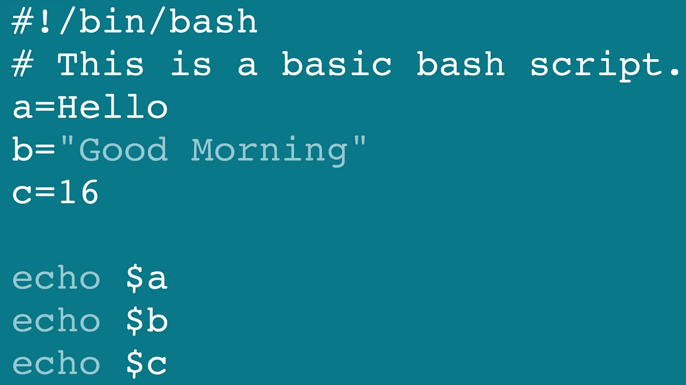
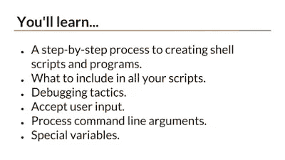
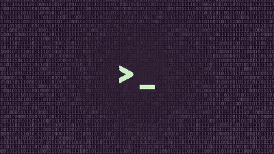
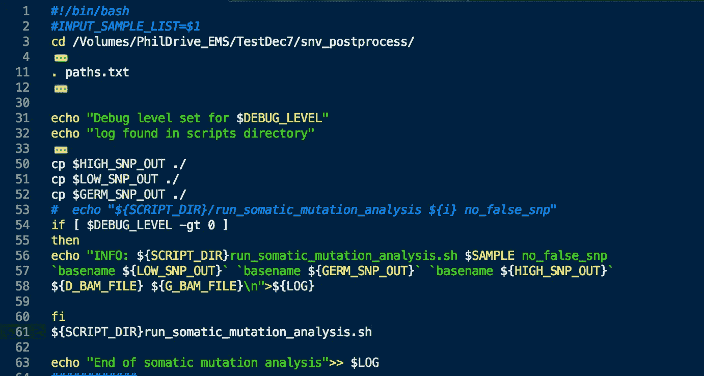

# 2022 年程序员学习的 7 门最佳 Linux shell 脚本课程

> 原文：<https://medium.com/javarevisited/7-best-shell-scripting-courses-for-programmers-and-it-professionals-d1f1486accc9?source=collection_archive---------0----------------------->

## 这些是学习 bash、sh、csh、ksh 和其他 Linux shells 中的 shell 脚本的最佳在线课程。

image_credit —领英的 Bash Learning

大家好，如果你一直想学习 bash 脚本并成为一名 rockstar 开发人员，并且正在寻找最好的 shell 脚本课程，那么你来对地方了。在上一篇中，我已经分享了 [**最佳 Linux 课程**](/javarevisited/top-10-courses-to-learn-linux-command-line-in-2020-best-and-free-f3ee4a78d0c0?source=collection_home---4------0-----------------------) 、 [**学习 Linux 的最佳网站**](/javarevisited/6-best-websites-to-learn-linux-4861ac21bfdf) 、 [**最佳 Linux 书籍**](/javarevisited/10-best-linux-unix-and-system-programming-books-for-beginners-2fe750951c9f) ，今天，我将分享学习 bash shell 的最佳课程。

*披露—顺便说一句，其中一些链接是附属链接，如果你使用我的链接加入这些课程，我可能会得到报酬。*

您可能知道，开发人员的大量时间都浪费在尝试重复任务和命令上，特别是当涉及到使用大量 UNIX 或 Linux 机器时，对 shell 脚本的良好了解可以将您从这种平凡的任务中解放出来，并腾出时间来做一些有趣的事情。

如果你不知道什么是 shell 脚本，那么让我告诉你，它只不过是一个使用 shell 内置程序编写的程序，Linux 命令自动化一些事情，比如检查主机是否可达，或者查找并删除超过特定日期的大文件，或者将它们归档到另一台机器。

基本上，它是一个工具，可以让你自动化枯燥重复的任务，这才是程序员应该的工作方式。他们不应该重复的东西；相反，他们应该花时间创建一个脚本或程序来自动完成这项任务。

# 为什么要学 Linux 的 Bash 之类的 Shell 脚本？

我总是要求程序员、开发人员和系统管理员学习并掌握 shell 脚本，因为这是一种不仅能节省时间和提高生产率，还能让你与那些对自动化没有热情并且不擅长使用工具的普通程序员区分开来的技能。

我给你举一个我职业生涯中的真实例子。有一次，我在一个项目中工作，该项目有大约 40 台 Linux 主机，在这些主机上安装了我们的 Java 应用程序。

在一次大的发布之后，我们意识到有一个配置更改被遗漏了，没有足够的时间以适当的方式完成它，即创建另一个构建并加载到部署工具中(那次我们使用 Opsware)并再次发布。因此，我们决定在所有 40 台主机上手动进行更改。我开始做更改，10 分钟后，我的技术主管过来问我，都完成了吗？我说，嗯，我刚开始；现在只做了两个服务器。他好奇的看着我，问我是怎么改变的？。

我告诉他，我将打开每个框，在 [VI 编辑器](http://javarevisited.blogspot.sg/2011/06/vi-editor-in-unix-example-tutorial-and.html)中打开配置文件，然后进行更改。他从我手中接过控制权，在配置文件中进行更改，并编写脚本将该文件复制到所有 40 台服务器，这对他来说只需要 2 分钟，再运行 1 分钟，所有工作就完成了。我很惊讶为什么我没有想到这一点，但是我对 Linux 知识和 shell 脚本的缺乏阻止了我。

那天我意识到，如果你想提高自己的生产力，给同事留下深刻印象，那么你必须擅长你的[工具，](http://javarevisited.blogspot.sg/2018/01/10-tools-every-software-developer-know.html)而 shell 脚本就是其中之一。

# 2022 年面向程序员的 7 门最佳 Linux 命令和 Shell 脚本课程

现在你已经知道了什么是 shell 脚本，为什么一个程序员要学习 shell 脚本，是时候进入下一个层次了，如何学习 shell 脚本？或者如何在 [Linux](/javarevisited/top-10-courses-to-learn-linux-command-line-in-2020-best-and-free-f3ee4a78d0c0?source=collection_home---4------0-----------------------) 中提高自己的 shell 脚本技能？

嗯，在线培训课程是一个很好的起点，接下来是更全面的学习。早些时候，我已经分享了一些基本的 UNIX 编程书籍和课程，今天，我将分享一些学习 learn Shell 脚本的最好的在线课程。

## 1. [Shell 脚本:探索如何自动化命令行任务](https://click.linksynergy.com/fs-bin/click?id=JVFxdTr9V80&subid=0&offerid=562016.1&type=10&tmpid=14538&RD_PARM1=https%3A%2F%2Fwww.udemy.com%2Fshell-scripting-linux%2F)

这是从头开始学习 shell 脚本的最佳课程之一，尤其是如果您在 shell 脚本和自动化方面没有太多经验的话。课程安排得很好，既不太长也不太短，这意味着您将在很短的时间内学到必要的知识，并立即开始创建脚本。本课程结束后，您将能够轻松创建 shell 脚本。您将学习如何在 Linux、Unix 或 MAC 系统上，将乏味且重复的任务转化为节省时间并简化生活的程序。

该课程教授基本的 shell 脚本技术，如
—检查程序和命令的退出状态，以及如何在 shell 脚本中有效地使用它们。
—如何接受用户的输入
—如何在 shell 脚本中编写条件语句和循环
—他收集的 shell 脚本的真实例子。
—练习和测验。

简而言之，学习 Linux、Unix、Mac shell 编程的最佳课程之一。

以下是加入本课程的链接: [**Shell 脚本:了解如何自动化命令行任务**](https://click.linksynergy.com/fs-bin/click?id=JVFxdTr9V80&subid=0&offerid=562016.1&type=10&tmpid=14538&RD_PARM1=https%3A%2F%2Fwww.udemy.com%2Fshell-scripting-linux%2F)

## 2.[初学 Linux Shell 编程](https://click.linksynergy.com/fs-bin/click?id=JVFxdTr9V80&subid=0&offerid=562016.1&type=10&tmpid=14538&RD_PARM1=https%3A%2F%2Fwww.udemy.com%2Flinux-shell-programming-for-beginners%2F)

这是使用 bash shell 学习 Linux 中的 shell 脚本的最完整的课程之一。在本课程中，讲师不仅解释了什么是 shell 或什么是 bash 等基础知识，以及它与仅在命令行中键入命令有何不同，而且还继续向您展示如何使用 shell 脚本来自动化您的日常任务。

该课程将教您如何编写 bash 脚本，解释命令历史、回显命令和变量在 bash 中的工作方式，以及您编写复杂 shell 脚本以自动化重复任务所需的操作符、循环、语句和所有其他概念。

*以下是加入本课程的链接:* [***Linux shell 编程初学者***](https://click.linksynergy.com/fs-bin/click?id=JVFxdTr9V80&subid=0&offerid=562016.1&type=10&tmpid=14538&RD_PARM1=https%3A%2F%2Fwww.udemy.com%2Flinux-shell-programming-for-beginners%2F)

除了为您提供所有关于 BASH 和 Shell 脚本的理论信息，本课程还在每一步提供了许多示例，让您熟悉 Shell 脚本的工作原理以及当您执行特定的 Shell 脚本时会发生什么。

## 3. [Linux Shell 脚本:基于项目的学习方法](https://click.linksynergy.com/fs-bin/click?id=JVFxdTr9V80&subid=0&offerid=562016.1&type=10&tmpid=14538&RD_PARM1=https%3A%2F%2Fwww.udemy.com%2Flinux-shell-scripting-projects%2F)

这是学习 Linux 中的 shell 脚本或 shell 编程，尤其是 bash 脚本的综合课程之一。

在本课程中，您将学习创建和使用变量、shell 内置命令和操作符、条件、循环、检查退出状态以及接受用户输入等基础知识，还将学习执行文本和字符串操作、处理多个命令行参数以及错误处理等高级概念。

*以下是加入本课程的链接:* [***Linux Shell 脚本:基于项目的学习方法***](https://click.linksynergy.com/fs-bin/click?id=JVFxdTr9V80&subid=0&offerid=562016.1&type=10&tmpid=14538&RD_PARM1=https%3A%2F%2Fwww.udemy.com%2Flinux-shell-scripting-projects%2F)

本课程最棒的地方在于它是基于项目的，这意味着您将编写可以在现实世界中使用的实际 Shell 脚本，而不是学习零碎的信息。你有机会立即把你学到的东西用上，这样你就能完全理解并记住它。

## 4. [Bash Shell 脚本](https://click.linksynergy.com/fs-bin/click?id=JVFxdTr9V80&subid=0&offerid=562016.1&type=10&tmpid=14538&RD_PARM1=https%3A%2F%2Fwww.udemy.com%2Fcomplete-bash-shell-scripting%2F)

关于 Linux Bash 脚本和命令行的最佳完整课程

Shell 脚本允许我们使用 Shell 的功能，并自动执行许多原本需要大量命令的任务。

*这里是加入课程的链接:* [***Bash Shell 脚本***](https://click.linksynergy.com/fs-bin/click?id=JVFxdTr9V80&subid=0&offerid=562016.1&type=10&tmpid=14538&RD_PARM1=https%3A%2F%2Fwww.udemy.com%2Fcomplete-bash-shell-scripting%2F)

Bash 脚本将帮助您自动化日常任务并节省宝贵的时间，无论您是系统管理员、Linux 用户还是软件开发人员。shell 脚本比用任何其他语言编程都要快得多。

## 5.[学习 Bash 脚本](http://linkedin-learning.pxf.io/c/1193463/449670/8005?u=https%3A%2F%2Fwww.linkedin.com%2Flearning%2Fpaths%2Flearning-bash-scripting)

这是从头开始学习 Bash 脚本的另一个很好的课程。本课程由 LinkedInLearning 提供，非常适合 bash 初学者。

本课程由 Scott Simpson 创建，他将教你从语法到变量、数字和控制结构的所有内容，这样你就可以立即开始编写脚本。

他还将向您展示如何将多行操作包装在一个文件中，实现流控制，并与用户交互以获取输入。此外，他在前进的道路上提供了挑战，让你把你所学到的东西付诸实践。

总的来说，这是一门在 1.5 小时内学习 IT 自动化和 bash 脚本的好课程。

**这里是加入本课程的链接** — [学习 Bash 脚本](http://linkedin-learning.pxf.io/c/1193463/449670/8005?u=https%3A%2F%2Fwww.linkedin.com%2Flearning%2Fpaths%2Flearning-bash-scripting)

image_credit —领英的 Bash Learning

顺便说一下，你需要一个[**LinkedIn Learning subscription**](http://linkedin-learning.pxf.io/c/1193463/449670/8005?u=https%3A%2F%2Fwww.linkedin.com%2Flearning%2Fsubscription%2Fproducts)来观看这个课程，这个课程每月花费大约 29.99 美元，但是你也可以通过参加他们的 1 个月免费试用来免费观看这个课程，这是一个探索他们 16000+最新技术在线课程的好方法。

## 6.[掌握 Bash Shell](https://www.educative.io/courses/master-the-bash-shell?affiliate_id=5073518643380224)

这是一个从[教育性](https://medium.com/u/85b9909ed1cf?source=post_page-----d1f1486accc9--------------------------------)学习 Bash shell 的基于文本的互动课程。如果您是 bash 初学者或学习一些 bash 命令，本课程可以帮助您学习和掌握 bash shell，这是一个对开发人员有用的工具。

在本课程中，您将学习核心概念，如 globbing 和 quoting，如何创建函数，以及您自己的脚本。然后，您将学习一些更高级的主题，如作业控制和调试，这些是任何开发人员的基本概念。

这里是加入本课程的链接— [掌握 Bash Shell](https://www.educative.io/courses/master-the-bash-shell?affiliate_id=5073518643380224)

此外，如果您发现教育平台和他们的互动课程很有用，那么您还可以获得 [**教育订阅**](https://www.educative.io/subscription?affiliate_id=5073518643380224) ，每月只需 18 美元(47%的折扣)即可访问他们的 100 多门课程。非常划算，非常适合准备编码面试。

<https://www.educative.io/subscription?affiliate_id=5073518643380224>  

## 7. [Bash Shell 脚本初学者教程](https://click.linksynergy.com/fs-bin/click?id=JVFxdTr9V80&subid=0&offerid=562016.1&type=10&tmpid=14538&RD_PARM1=https%3A%2F%2Fwww.udemy.com%2Fbash-shell-scripting-tutorial-for-beginners%2F)

Linux 有许多 shell，如 Bourne shell (sh)、C shell (cash)、Korn shell (ksh)和 Bourne Again shell(俗称 bash)。

它融合了 ksh 和 csh shell 的有用特性。Bash 不仅是一个优秀的命令行 shell，它本身也是一种脚本语言，本课程帮助您实现 bash 和 Linux 命令的全部潜力。

*这里是加入课程的链接:* [***Bash Shell 脚本初学者教程***](https://click.linksynergy.com/fs-bin/click?id=JVFxdTr9V80&subid=0&offerid=562016.1&type=10&tmpid=14538&RD_PARM1=https%3A%2F%2Fwww.udemy.com%2Fbash-shell-scripting-tutorial-for-beginners%2F)

在本课程中，您不仅将学习如何使用 Bash 编写 Shell 脚本，还将快速学习几个有用的 Linux 命令。一般来说，任何人在没有任何指导的情况下都需要花费很长时间来发现这些命令，但是本课程会在几个小时内教会你。

以上是针对程序员和 Linux 用户的一些最好的 shell 脚本课程。自动化是一项非常重要的技能，随着你的经验和责任的增长，你会更加欣赏自动化。

在 Linux 中使用 bash 或者使用 [Python](/swlh/5-free-python-courses-for-beginners-to-learn-online-e1ca90687caf) 或 Perl 或任何其他脚本语言编写 shell 脚本的良好知识对于提高您作为 IT 专业人员的工作效率大有帮助。

其他**你可能喜欢的程序员和开发者的在线资源**

*   [2022 年学习 Python 的十大课程](/better-programming/top-5-courses-to-learn-python-in-2018-best-of-lot-26644a99e7ec)
*   [学习 Git 和 Github 的 5 门免费课程](http://javarevisited.blogspot.sg/2018/01/5-free-git-courses-for-programmers-to-learn-online.html#axzz568Oo1Jao)
*   [5 门免费学习核心 Java 的在线课程](http://javarevisited.blogspot.sg/2017/11/top-5-free-java-courses-for-beginners.html#axzz4zuIICRs9)
*   [5 门免费学习 Angular 的在线培训课程](http://www.java67.com/2018/01/top-5-free-angular-js-online-courses-for-web-developers.html)
*   [2022 年学习 AWS 的 10 门课程](/javarevisited/top-10-courses-to-learn-amazon-web-services-aws-cloud-in-2020-best-and-free-317f10d7c21d)
*   [面向 Java 和 Web 开发人员的 5 个节点 JS 课程](http://javarevisited.blogspot.sg/2018/01/top-5-nodejs-and-express-js-online-courses-for-web-developers.html)
*   [学习大数据和 Apache Spark 的 5 门课程](http://javarevisited.blogspot.com/2017/12/top-5-courses-to-learn-big-data-and.html)
*   [学习云计算的 5 大课程](https://javarevisited.blogspot.com/2019/07/top-5-online-courses-to-learn-cloud-computing-aws.html)
*   [5 门免费学习数据结构和算法的课程](http://javarevisited.blogspot.sg/2018/01/top-5-free-data-structure-and-algorithm-courses-java--c-programmers.html#axzz55lOcYrUM)
*   【Java 开发者学习 Android 的 5 门课程
*   [10 门免费的 Maven、Jenkins 和 Docker 课程](/javarevisited/top-10-free-courses-to-learn-maven-jenkins-and-docker-for-java-developers-51fa7a1e66f6)
*   [前 5 名 Selenium 与 Java Web 驱动程序课程](http://javarevisited.blogspot.sg/2018/02/top-5-selenium-webdriver-with-java-courses-for-testers.html)
*   [Java 开发人员学习 Kotlin 编程的 5 门课程](http://javarevisited.blogspot.sg/2018/02/5-courses-to-learn-kotlin-programming-java-android.html#axzz56R4AatoQ)

感谢您阅读本文。如果你喜欢这些*最好的 shell 脚本课程*，那么请分享给你的朋友和同事。如果您有任何问题或反馈，请留言。

**附言——**如果你正在寻找一些免费的在线课程来开始你的 Linux shell 脚本之旅，那么不要难过。我之前也分享了一些 [**学习 Linux**](https://www.java67.com/2019/04/top-5-free-course-to-learn-bash-shell-scripting-linux.html)bash 脚本的最佳免费课程，你也可以去看看。底线是，学习 shell 脚本来成为一个更有价值的程序员。

</javarevisited/6-free-courses-to-learn-bash-shell-scripting-in-linux-and-unix-a50461ecd4fe> 