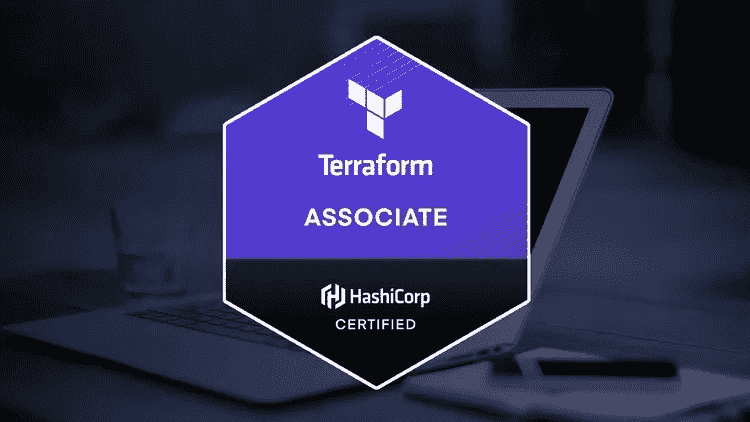
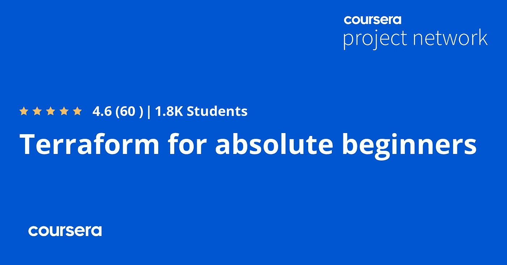
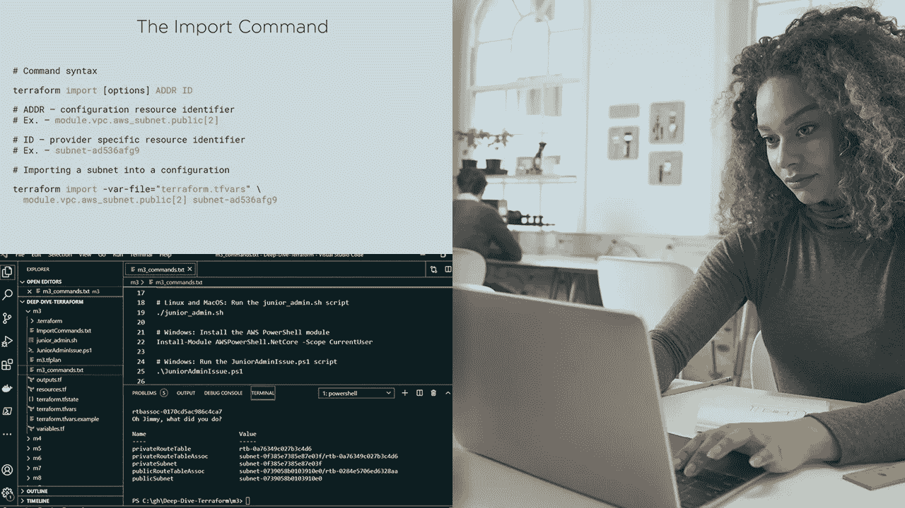
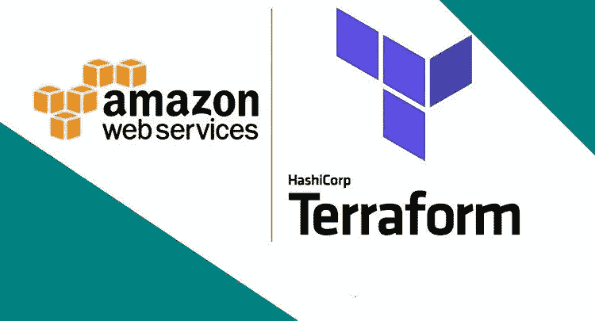
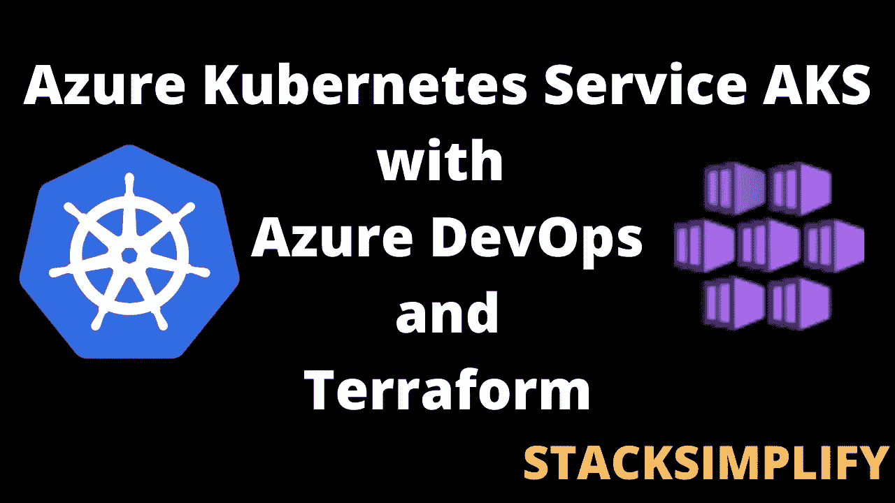
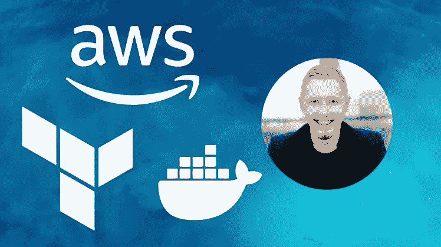

# 2023 年 DevOps 工程师学习的 10 门最佳 Terraform 在线课程

> 原文：<https://medium.com/javarevisited/7-best-terraform-online-courses-for-devops-engineers-5e4dab297785?source=collection_archive---------1----------------------->

## Udemy、Pluralsight 和 Coursera 为初学者和 DevOps 工程师收集了 2023 年学习 Terraform 的最佳在线课程。

大家好，如果你想在 2023 年学习 Terraform 并寻找最好的在线课程和教程，那么你来对地方了。以前我分享过[**最好的 DevOps 课程**](/javarevisited/13-best-courses-to-learn-devops-for-senior-developers-in-2020-a2997ff7c33c) **s** 以及类似 [Docker](/javarevisited/top-15-online-courses-to-learn-docker-kubernetes-and-aws-for-fullstack-developers-and-devops-d8cc4f16e773) 、 [Jenkins](/javarevisited/7-best-courses-to-learn-jenkins-and-ci-cd-for-devops-engineers-and-software-developers-df2de8fe38f3?source=---------15------------------) 、 [Kubernetes](https://javarevisited.blogspot.com/2020/06/top-5-courses-to-learn-kubernetes-for-devops-and-certification.html) 这样的工具，今天我要分享的是 2023 年学习 Terraform 最好的在线课程。该列表包含面向初学者和有经验的工程师的在线课程。

如果您做过基础设施部署，如创建服务器、安装应用程序和创建生产环境，那么您会知道部署和维护传统基础设施是一项充满重复任务、不一致的配置和总是过期的文档的手动任务， [Terraform](https://www.terraform.io/) 旨在解决这一问题。

TerraForm 是一个重要的 DevOps 工具，用于将基础设施版本化为代码。作为市场上可用的代码工具，它也是最受欢迎的基础设施之一，其受欢迎的原因之一是因为它广泛支持多个提供商，如 [AWS](/javarevisited/5-best-aws-courses-for-beginners-and-experienced-developers-to-learn-in-2021-563212409fbd?source=rss-bb36d8439904------2&utm_source=dlvr.it&utm_medium=linkedin) 、 [Azure](/javarevisited/5-best-azure-fundamentals-courses-to-pass-az-900-certification-exam-in-2020-9e602aea035d) 、 [GCP](/javarevisited/5-best-courses-to-learn-google-cloud-platform-gcp-in-2021-169093a3771a) 等等。这使得它成为 [DevOps 工程师](/javarevisited/top-5-online-courses-to-become-a-devops-engineer-in-2020-764f5e60c2b)需要动手操作的非常重要的工具之一。Terraform 最近越来越受欢迎，如果你正在或即将进入 DevOps 工程师角色，它是你需要掌握的工具。你通常使用像 [Ansible](https://javarevisited.blogspot.com/2019/11/top-5-course-to-learn-ansible-for-devops.html#axzz6OglQbBaX) 、 [Chef](/hackernoon/the-2018-devops-roadmap-31588d8670cb) 或 [Puppet](https://javarevisited.blogspot.com/2020/05/top-5-puppet-courses-for-programmers-and-devops-engineers.html) 这样的技术来自动化软件的供应。

Terraform 从同样的原理出发，基础设施即代码，但侧重于基础设施本身的自动化。您的整个云基础架构(实例、卷、网络、IPs)都可以用 terraform 来描述。

Terraform 是一个了不起的工具集，用于公共云和私有云基础设施的自动化。这些来自 [Udemy](https://click.linksynergy.com/fs-bin/click?id=JVFxdTr9V80&offerid=323058.9410&type=3&subid=0) 、 [Coursera](https://coursera.pxf.io/c/3294490/1164545/14726?u=https%3A%2F%2Fwww.coursera.org%2F) 和 [Pluralsight](https://pluralsight.pxf.io/c/1193463/424552/7490?u=https%3A%2F%2Fwww.pluralsight.com%2Flearn) 的 Terraform 在线课程将教你将技能提升到下一个水平所需的高级 Terraform 概念和功能。

# 2023 年学习 Terraform 的 10 门最佳在线课程

在不浪费你更多时间的情况下，这里列出了 2023 年学习 Terraform 的最佳在线课程。这份名单包括社区专家推荐的来自 [Udemy](https://click.linksynergy.com/fs-bin/click?id=JVFxdTr9V80&offerid=323058.9410&type=3&subid=0) 、 [Pluralsight](https://pluralsight.pxf.io/c/1193463/424552/7490?u=https%3A%2F%2Fwww.pluralsight.com%2Flearn) 和 [Coursera](https://click.linksynergy.com/deeplink?id=JVFxdTr9V80&mid=40328&murl=https%3A%2F%2Fwww.coursera.org%2F) 的最佳地形球场。它们也被世界各地成千上万的开发人员和 DevOps 工程师用来学习 Terraform。

## 1. [Hashicorp 认证— Terraform 助理](https://click.linksynergy.com/deeplink?id=JVFxdTr9V80&mid=39197&murl=https%3A%2F%2Fwww.udemy.com%2Fcourse%2Fterraform-beginner-to-advanced%2F)

这是学习 Terraform 和准备 Terraform 助理认证的最佳 Udemy 课程。由 Zeal Vora 创建，将帮助您在短时间内掌握 Terraform，并让您准备好成为 Hashcorp 认证的 Terraform 助理。

本课程面向计划在其组织中实施 Terraform 并希望深入了解各种 terraform 模块和最佳实践的个人。本课程由 Zeal 教授，Zeal 被认为是世界上最好的 DevOps 讲师之一。

对于对掌握 Terraform 感兴趣的个人和愿意**以代码方式学习基础设施的人来说，这是一门理想的课程**。

谈到社交证明，这门课程受到了 6000 多名 DevOps 工程师和开发人员的信任，在近 1200 名参与者中平均得分为 4.4，令人印象深刻。

**以下是加入这一最佳 Terraform 课程的链接** — [Hashicorp 认证— Terraform 助理](https://click.linksynergy.com/deeplink?id=JVFxdTr9V80&mid=39197&murl=https%3A%2F%2Fwww.udemy.com%2Fcourse%2Fterraform-beginner-to-advanced%2F)

## 2.绝对初学者的平台【Coursera 项目】

这是在 Coursera 上学习 Terraform 的最好的 1 小时项目课程之一。本课程是为完全的初学者设计的，他们甚至没有听说过 Terraform 这个名字，也不熟悉基础设施作为代码的概念。

以下是你将在 Coursera 上这个 1 小时的基于项目的 Terraform 课程中学到的关键内容:

1.  作为代码概念和思想的基础设施
2.  地形基础及其执行流程
3.  HCL 语言(Harshicorp 语言系统)语法
4.  使用 Terraform 创建基础设施在 Terraform 中定义变量

在此过程中，您将发展关键技能，如代码、平台、开发运维以及 IT 自动化等基础设施。谈到评分，这是 Coursera 上评分最高的 Terraform 课程之一，平均评分为 4.6 分，满分为 5 分。

Coursera 项目最好的一点是，你不需要在你的机器上下载或设置任何东西。

Coursera 提供了一个云桌面，你可以在这里和老师一起练习。学习不可能比这更有趣和简单。如果你是初学者，想学习 Terraform，我强烈推荐这个 Terraform 课程。

**这是加入本课程的链接**——[绝对初学者的平台](https://coursera.pxf.io/c/3294490/1164545/14726?u=https%3A%2F%2Fwww.coursera.org%2Fprojects%2Fterraform-for-absolute-beginners)

顺便说一句，如果你计划参加多个 Coursera 课程或专业，那么考虑参加 [**Coursera Plus 订阅**](https://coursera.pxf.io/c/3294490/1164545/14726?u=https%3A%2F%2Fwww.coursera.org%2Fcourseraplus) ，它为你提供无限制的访问他们最受欢迎的课程、专业、专业证书和指导项目的机会。它每年花费大约 399 美元，但它完全值得你的钱，因为你可以获得无限的证书。

 [## Coursera Plus |无限制访问 7，000 多门在线课程

### 用 Coursera Plus 投资你的职业目标。无限制访问 90%以上的课程、项目…

coursera.pxf.io](https://coursera.pxf.io/c/3294490/1164545/14726?u=https%3A%2F%2Fwww.coursera.org%2Fcourseraplus) 

## 3. [Terraform:从初学者到大师，AWS 中的示例](https://www.educative.io/courses/terraform-beginner-master-aws?affiliate_id=5073518643380224)【教育性】

这是学习 Terraform 的另一个极好的资源，特别是对于那些想在 AWS 上使用 Terraform 的人。本课程与列表中的其他课程不同，因为它是一门基于文本的交互式课程，你可以在浏览器上练习。

在这个交互式 Terraform 初级课程中，您将从头开始学习，从什么是 Terraform、为什么应该使用它以及它解决的问题开始。

然后，您将了解 Terraform 的不同关键特性。你也将建立在你的知识上，你的最终目标是舒适地使用 Terraform 构建项目。

如果你通过练习和做练习来学习，那么这是最适合你的 Terraform 课程，因为你不需要设置任何东西，你可以从 word go 的浏览器上开始练习。

**这是加入本课程的链接**——[地形:从初学者到大师，并附有 AWS 中的示例](https://www.educative.io/courses/terraform-beginner-master-aws?affiliate_id=5073518643380224)

顺便说一下，你可以单独参加这个课程，或者你可以参加 [**教育订阅**](https://www.educative.io/subscription?affiliate_id=5073518643380224) (推荐)来获得他们的 250 多个高质量、基于文本的交互式课程，以学习编码面试、软件开发和技术的关键技能。他们现在还提供很大的折扣，每月只需 14.9 美元就可以成为会员。

 [## 教育无限:保持领先

### 我们听到了您的反馈。你现在只需支付一次费用，就可以获得 Educative 上的所有课程。

www.educative.io](https://www.educative.io/subscription?affiliate_id=5073518643380224) 

## 4.[深潜 Ned Bellavance 的 terra form](https://pluralsight.pxf.io/c/1193463/424552/7490?u=https%3A%2F%2Fwww.pluralsight.com%2Fcourses%2Fdeep-dive-terraform)【plural sight】

在本课程“深度探索— Terraform”中，您将了解 Terraform 在基础设施自动化方面的一些更高级的用途。首先，您将了解如何导入现有的基础设施。

接下来，您将探索远程状态和数据源。最后，您将了解如何将 Terraform 与一个 [CI/CD 管道](https://javarevisited.blogspot.com/2018/09/top-5-jenkins-courses-for-java-and-DevOps-Programmers.html#axzz6cRYpiwdu)和配置管理软件集成。以下是您将在本课程中学到的关键概念

*   导入现有基础设施
*   远程状态和工作区
*   数据源和模板
*   CI/CD 管道集成
*   结构管理

学完本课程后，您将知道如何将这些技术融入您现有的技能组合中，使您能够将 Terraform 集成到您的其余运营中，并扩展到更大的企业中。

**以下是加入本课程的链接** — [深潜 Ned Bellavance 的 terra form](https://pluralsight.pxf.io/c/1193463/424552/7490?u=https%3A%2F%2Fwww.pluralsight.com%2Fcourses%2Fdeep-dive-terraform)

顺便说一下，你需要一个 [Pluralsight 会员](https://pluralsight.pxf.io/c/1193463/424552/7490?u=https%3A%2F%2Fwww.pluralsight.com%2Flearn)才能加入这个课程，费用大约是每月 29 美元或每年 299 美元(14%的折扣)。我向所有程序员强烈推荐这个订阅，因为它提供了超过 7000 个在线课程的即时访问，以学习任何技术技能。或者，你也可以使用他们的 [**10 天免费通行证**](https://pluralsight.pxf.io/c/1193463/424552/7490?u=https%3A%2F%2Fwww.pluralsight.com%2Flearn) 免费观看这个课程。

 [## 个人技术技能|多视角

### 借助 Pluralsight，在开发运维、机器学习、云、安全基础设施等领域构建所需技能…

pluralsight.pxf.io](https://pluralsight.pxf.io/c/1193463/424552/7490?u=https%3A%2F%2Fwww.pluralsight.com%2Flearn) 

## 5.[了解 DevOps:使用 Terraform 实现基础设施自动化](https://click.linksynergy.com/deeplink?id=JVFxdTr9V80&mid=39197&murl=https%3A%2F%2Fwww.udemy.com%2Fcourse%2Flearn-devops-infrastructure-automation-with-terraform%2F)

这是另一门顶级的 Udemy 课程，旨在学习如何使用 Terraform 实现基础设施的自动化，涵盖了使用 [AWS](https://javarevisited.blogspot.com/2020/05/top-5-amazon-web-services-aws-courses-for-beginners-and-experienced-programmers.html) 、Packer、 [Docker](/javarevisited/top-15-online-courses-to-learn-docker-kubernetes-and-aws-for-fullstack-developers-and-devops-d8cc4f16e773) 、ECS、EKS、 [Jenkins](/javarevisited/7-best-courses-to-learn-jenkins-and-ci-cd-for-devops-engineers-and-software-developers-df2de8fe38f3) 和其他 DevOps 工具的 Terraform。由 Edward Viaene 创建，这是评分最高的 Terraform 课程，超过 32K 名学生的平均评分为 4.4 分。在本课程中，您将学习如何使用 Terraform 来自动化您的基础设施。我将首先向您展示 Terraform 的基础知识，然后解释如何使用 terraform 在 [AWS](/javarevisited/top-10-courses-to-learn-amazon-web-services-aws-cloud-in-2020-best-and-free-317f10d7c21d) 上自动化基础设施。

你可以免费开一个 AWS 账户来做实验。我还提供了许多代码示例，您可以立即使用它们来自动化您自己的基础设施。

如果你处于 Ops 或 DevOps 职位，并且想学习使用 terraform 实现自动化，那么这个课程非常棒。它还更新了 Terraform-0.12 更新和 terraform-0.12 版本中的新变量方法。

**这是参加在线课程的链接**——[学习 DevOps:使用 Terraform 实现基础设施自动化](https://click.linksynergy.com/deeplink?id=JVFxdTr9V80&mid=39197&murl=https%3A%2F%2Fwww.udemy.com%2Fcourse%2Flearn-devops-infrastructure-automation-with-terraform%2F)

## 6.[在微软 Azure 上学习地形](https://click.linksynergy.com/deeplink?id=JVFxdTr9V80&mid=39197&murl=https%3A%2F%2Fwww.udemy.com%2Fcourse%2Flearning-terraform-on-microsoft-azure%2F)【Udemy】

这是在微软 Azure 平台上学习 Terraform 的又一个值得看的 Udemy 课程。该课程将带您从初始设置到部署多位置 web 服务，并涵盖 Terraform v11 的所有方面，从初始设置到 Azure 中的真实部署示例。

课程从设置培训环境、安装 Terraform、配置 [Azure](https://javarevisited.blogspot.com/2020/02/top-5-courses-to-crack-az-900-microsoft-azure-fundamentals-certification-exam.html) 开始。随着课程的发展，我们将着眼于 Terraform 的各个方面，以及如何使用这些来构建我们的部署。此外，我们将使用 Azure 中的各种资源，我将解释这些资源是什么，它们是如何工作的，然后我们将使用 Terraform 部署这些资源。设定期望这个课程不是 Azure 课程，所以虽然我不会对每个 Azure 资源进行深入探讨，但我会对最显著的特性进行概述。本课程尽可能实用，大部分课程都是自然进行的。提供 **Terraform 和 Azure Resources** 的重点领域概述以供参考。

**这里是加入本课程的链接** — [在微软 Azure 上学习平台](https://click.linksynergy.com/deeplink?id=JVFxdTr9V80&mid=39197&murl=https%3A%2F%2Fwww.udemy.com%2Fcourse%2Flearning-terraform-on-microsoft-azure%2F)

## 7.[适用于 AWS 的 Terraform 初级到高级快速通道(+ 0.12)](https://click.linksynergy.com/deeplink?id=JVFxdTr9V80&mid=39197&murl=https%3A%2F%2Fwww.udemy.com%2Fcourse%2Fterraform-fast-track%2F)

这是另一个最好的 Udemy Terraform 课程，适合初学者和有经验的程序员和 DevOps 工程师。本课程是实践性的，我们关注的是与如何在工业中使用相关的地形。

这意味着你将通过 Terraform 为你的预期目标做好充分准备，无论是从 [DevOps](/javarevisited/top-5-online-courses-to-become-a-devops-engineer-in-2020-764f5e60c2b) 开始的面试，还是为工作中的项目学习 terra form——你都将跟上速度并准备投入其中。

这是一个不错的球场，而且很多任务都很中肯，你需要在地形上解决。我还想看一些例子(如 ECR、ECS、SSM 等)，但这足以提供学习这些其他主题的基础知识。这是 DevOps 工程师、IT 专业人员、系统管理员、系统管理员和开发人员的理想课程。

**以下是参加本课程的链接** — [适用于 AWS 的 Terraform 初级到高级快速通道](https://click.linksynergy.com/deeplink?id=JVFxdTr9V80&mid=39197&murl=https%3A%2F%2Fwww.udemy.com%2Fcourse%2Fterraform-fast-track%2F)

## 8.[使用 Azure DevOps 和 Terraform 的 Azure Kubernetes 服务](https://click.linksynergy.com/deeplink?id=JVFxdTr9V80&mid=39197&murl=https%3A%2F%2Fwww.udemy.com%2Fcourse%2Fazure-kubernetes-service-with-azure-devops-and-terraform%2F)

这是另一个从 DevOps 角度学习 Terraform 的令人惊叹的课程。在这个课程中，你会学到很多不同的东西，包括 AKS 或 Azure Kubernetes 服务，以及 Azure 中的 [Terraform](https://javarevisited.blogspot.com/2020/08/top-5-courses-to-learn-terraform-in.html) 。

以下是您将在本课程中学到的内容:

1.  如何使用 Azure AKS CLI 构建 Azure AKS 生产级集群
2.  从基础开始创建 Terraform，并创建 terraform 清单以供应 Azure AKS 生产级群集
3.  DevOps 概念与 Azure DevOps 持续集成管道和持续交付管道(也称为发布管道)

本课程适合打算掌握 Azure Kubernetes 服务(AKS)以在 Kubernetes 上运行应用程序的 Azure 架构师、系统管理员或开发人员

**以下是参加本课程的链接**—[Azure Kubernetes Service with Azure devo PS and Terraform](https://click.linksynergy.com/deeplink?id=JVFxdTr9V80&mid=39197&murl=https%3A%2F%2Fwww.udemy.com%2Fcourse%2Fazure-kubernetes-service-with-azure-devops-and-terraform%2F)

## 9.[通过 Terraform、AWS 和 Docker 实现 DevOps 部署自动化](https://click.linksynergy.com/deeplink?id=JVFxdTr9V80&mid=39197&murl=https%3A%2F%2Fwww.udemy.com%2Fcourse%2Fdevops-deployment-automation-terraform-aws-docker%2F)

这是 Udemy 上的另一个令人惊叹的课程，学习用于 DevOps 部署和自动化的 Terraform。您将了解如何使用 GitLab、 [EC2](https://javarevisited.blogspot.com/2020/08/top-5-courses-to-learn-amazon-aws-ec-2.html) 、ALB、ECS、ECR、VPC、 [S3](https://www.java67.com/2020/08/top-5-courses-to-learn-aws-s3-and-dynamoDB-in-depth.html) 和基础设施即代码(IaC)创建生产级可扩展部署。

在本课程中，您将使用 Terraform、GitLab、Docker 和一套 AWS 技术将一个示例 Django REST API 部署到 AWS，包括:

*   弹性容器注册
*   关系数据库服务
*   弹性集装箱服务
*   应用程序负载平衡器(ALB)
*   弹性云计算(EC2)
*   虚拟私有云(VPC)、子网、网关和简单存储服务(S3)
*   Route53、身份和访问管理(IAM)和 AWS 证书管理器(ACM)

本课程旨在部署一个 [Django 应用程序](/javarevisited/my-favorite-courses-to-learn-django-for-beginners-2020-ac172e2ab920)，但是它也适用于任何运行在 [Docker](/javarevisited/10-free-courses-to-learn-docker-and-devops-for-frontend-developers-691ac7652cee?source=---------94------------------) 中的 web 应用程序。

简而言之，这是一门很棒的在线课程，通过创建自动化工作流来部署和管理可扩展的安全基础架构，学习当今市场上最受欢迎的一些技能。

**此处是加入本课程的链接** — [使用 Terraform、AWS 和 Docker 实现 DevOps 部署自动化](https://click.linksynergy.com/deeplink?id=JVFxdTr9V80&mid=39197&murl=https%3A%2F%2Fwww.udemy.com%2Fcourse%2Fdevops-deployment-automation-terraform-aws-docker%2F)

## 10. [HashiCorp 认证 Terraform 助理认证专家实验室](https://shareasale.com/r.cfm?b=413930&u=880419&m=43514&urllink=https%3A%2F%2Fwww%2Ewhizlabs%2Ecom%2Fhashicorp%2Dcertified%2Dterraform%2Dassociate%2F&afftrack=)

如果您正在准备 HashiCorp Terramform 助理认证并寻找最佳课程和实践测试，那么来自 Whizlabs 的 HashiCorp Certified Terraform 助理认证包是开始的最佳资源之一。

Whizlabs 为 Terraform 认证考试提供了非常优质的培训材料。本课程不仅可用于认证准备，还可用于学习 terraform 概念。本课程内容使用最新的 terraform 版本创建。

本课程包括以下资源:
71 个视频
305 个练习题
6 个动手实验

该课程有超过 4000 名学习者，在 Whizlabs 网站上的评分为 4.5+。如果您之前已经使用过 Whizlabs 进行认证准备，那么您会希望尝试这些课程，因为 Whizlabs 的课程内容质量非常高。

**这是参加本课程的链接**——[哈希公司认证 Terraform 助理认证专家实验室](https://shareasale.com/r.cfm?b=413930&u=880419&m=43514&urllink=https%3A%2F%2Fwww%2Ewhizlabs%2Ecom%2Fhashicorp%2Dcertified%2Dterraform%2Dassociate%2F&afftrack=)

本课程的另一个额外收获是，您将获得 **6 个动手实验室，在真实环境中尝试和学习 terra form**。这里有一个关于 [*的实验链接，使用 Terraform*](https://shareasale.com/r.cfm?b=413930&u=880419&m=43514&urllink=https%3A%2F%2Fwww%2Ewhizlabs%2Ecom%2Flabs%2Flaunch%2Dan%2Dec2%2Dinstance%2Das%2Da%2Dweb%2Dserver%2Dusing%2Dterraform&afftrack=) 启动一个 EC2 实例作为 web 服务器。

我也建议你去参加这个认证，Terraform 是目前市场上最需要的 DevOps 技能。这是最受欢迎的基础设施代码(IaC)工具之一。

顺便说一句，如果你正在准备认证，考虑参加 [**Whizlabs 订阅**](https://shareasale.com/r.cfm?b=413930&u=880419&m=43514&urllink=https%3A%2F%2Fwww%2Ewhizlabs%2Ecom%2Fpricing%2F&afftrack=) ，它提供对他们所有在线培训课程和不同认证(如 AWS、Cloud、Docker 和 Kubernetes)的完整访问，每月只需**25.95 美元**的高级会员资格。(现在五折)。

Whizlabs 提供非常优质的培训材料，我强烈推荐这个订阅计划，因为 Whizlabs 有最好的材料来准备 IT 认证。

以上就是 2023 年 DevOps 工程师学习 Terraform 的**最佳课程。这是一个将基础设施自动化为代码的伟大工具，每个 DevOps 工程师都应该学习它。这些在线课程不仅可以帮助您学习 Terraform 基础知识，还可以帮助您在项目中使用它们来自动创建和部署基础架构。**

你可能喜欢的其他开发工具和课程

*   [2023 年 DevOps 开发者路线图](/hackernoon/the-2018-devops-roadmap-31588d8670cb)
*   [面向 Java 和 DevOps 专业人员的 10 门免费 Docker 课程](https://javarevisited.blogspot.sg/2018/02/10-free-docker-container-courses-for-Java-Developers.html)
*   [学习 Jenkins 自动化和开发运维的 5 大课程](https://javarevisited.blogspot.com/2018/09/top-5-jenkins-courses-for-java-and-DevOps-Programmers.html)
*   [2023 年学习 Kubernetes 的 7 门免费在线课程](/javarevisited/7-free-online-courses-to-learn-kubernetes-in-2020-3b8a68ec7abc)
*   [学习亚马逊网络服务我最喜欢的课程](https://javarevisited.blogspot.com/2020/05/top-5-amazon-web-services-aws-courses-for-beginners-and-experienced-programmers.html)
*   [面向高级开发人员的 10 门最佳 DevOps 课程](https://javarevisited.blogspot.com/2018/09/10-devops-courses-for-experienced-java-developers.html#axzz6hB6A1qlY)
*   [5 门免费 Selenium 课程学习自动化测试](https://javarevisited.blogspot.sg/2018/02/top-5-selenium-webdriver-with-java-courses-for-testers.html)
*   [10 Docker 和 Kubernetes 程序员课程](https://dev.to/javinpaul/top-10-courses-to-learn-docker-and-kubernetes-for-programmers-4lg0)
*   [面向 Java 开发人员的 6 门 Maven 课程](http://www.java67.com/2018/02/6-free-maven-and-jenkins-online-courses-for-java-developers.html)
*   [2023 年 Java 开发人员应该学会的 10 件事](http://javarevisited.blogspot.sg/2017/12/10-things-java-programmers-should-learn.html#axzz53ENLS1RB)
*   [我最喜欢的课程为有经验的人学习 devo PS](/javarevisited/top-10-courses-to-learn-devops-for-experienced-programmers-d93b666db151)
*   [程序员学习 AWS 和云的 10 门免费课程](/javarevisited/top-10-courses-to-learn-amazon-web-services-aws-cloud-in-2020-best-and-free-317f10d7c21d)
*   [7 门免费课程为 DevOps 学习硒](/javarevisited/top-7-courses-to-learn-selenium-for-java-and-c-developers-to-learn-automation-testing-free-and-e91637cd9622)
*   [2023 年学习 DevOps 的前 5 本书](https://javarevisited.blogspot.com/2020/04/top-5-books-to-learn-devops-for-developers.html)
*   [学习 Docker、Kubernetes 和 AWS 的 15 门在线课程](/javarevisited/top-15-online-courses-to-learn-docker-kubernetes-and-aws-for-fullstack-developers-and-devops-d8cc4f16e773)

感谢您阅读本文。如果你觉得这些最好的 Terraform 在线课程有用，那么请与你的朋友和同事分享。如果您有任何问题或反馈，请留言。

**附言——**如果你热衷于学习 Terraform，但负担不起加入这些付费课程的费用，并寻找免费的 Terraform 在线课程，那么你也可以在 Udemy 上查看这个 [**免费的 Terraform 速成班**](https://click.linksynergy.com/deeplink?id=JVFxdTr9V80&mid=39197&murl=https%3A%2F%2Fwww.udemy.com%2Fcourse%2Fterraform-lightning-course%2F) ，在 60 分钟内学习你需要了解的关于 Terraform 的一切。这是完全免费的，你只需要一个免费的 Udemy 帐户就可以参加这个课程。

 [## 免费 Terraform 教程- Terraform 闪电课程

### mkdev 是 IT 专家的合作项目。我们聚在一起，帮助个人和企业变得更聪明，并做…

udemy.com](https://click.linksynergy.com/deeplink?id=JVFxdTr9V80&mid=39197&murl=https%3A%2F%2Fwww.udemy.com%2Fcourse%2Fterraform-lightning-course%2F)