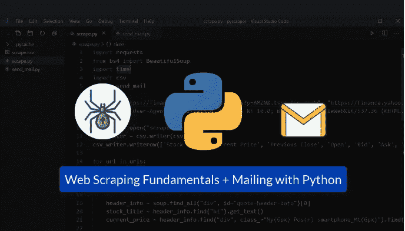
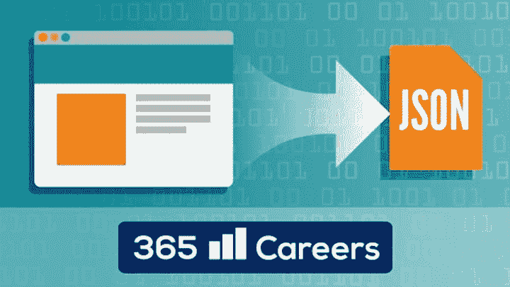
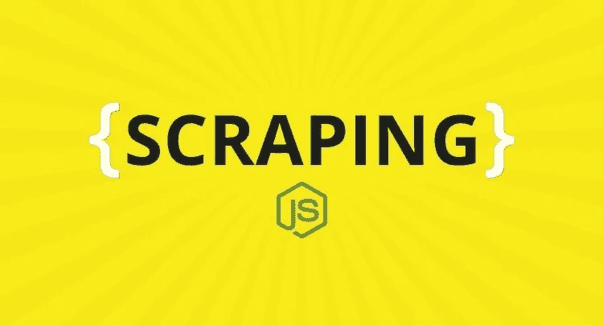
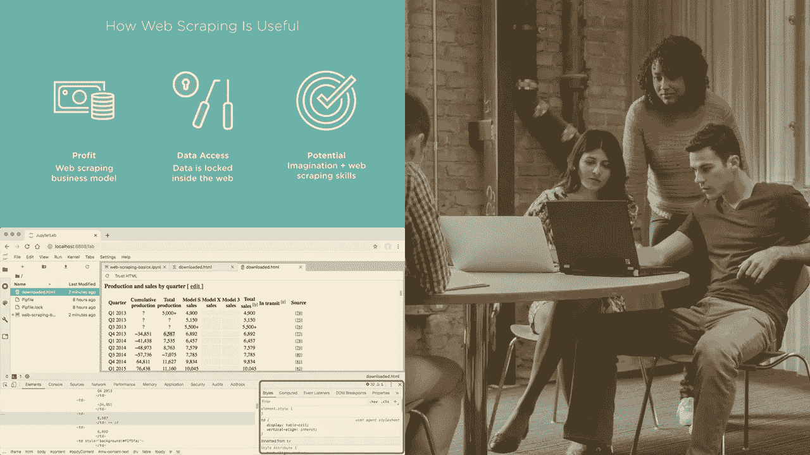
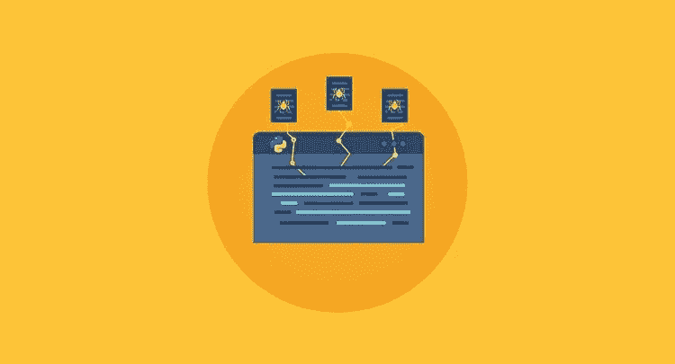
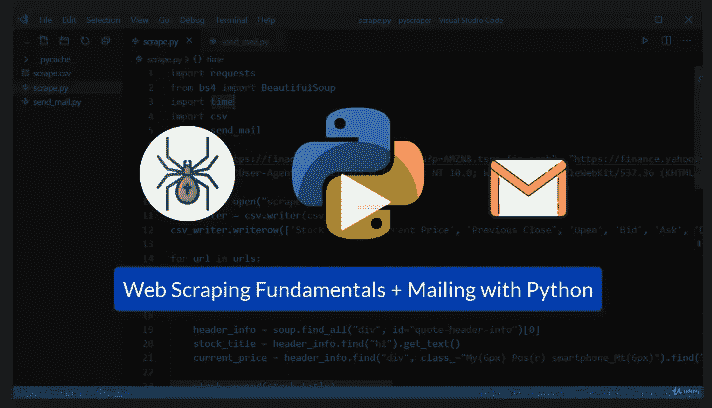
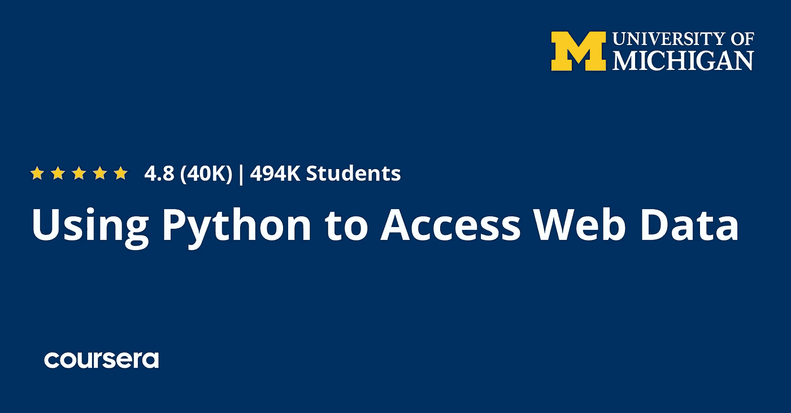

# 2023 年 7 个最好的带 Python 和 JavaScript 的网页抓取初学者学习课程

> 原文：<https://medium.com/javarevisited/7-best-web-scraping-with-python-and-javascript-courses-for-beginners-4ee470cb2978?source=collection_archive---------1----------------------->

## 我最喜欢的在线课程，使用 Scrappy，Beautifulsoup 等从 Udemy，Pluralsight 和 Coursera 学习 Python 和 JavaScript 的网络抓取。

image_credit — Udemy

你好，伙计们，如果你想在 2023 年学习**网页抓取，并寻找使用 Python、JavaScript 和其他编程语言学习网页抓取的最佳在线课程，那么你来对地方了。**

之前，我已经分享了 [**最佳 scrappy 课程**](/javarevisited/5-best-scrappy-online-courses-for-python-developers-df8873563441) 和 [**最佳 web 抓取工具**](https://javarevisited.blogspot.com/2020/06/top-5-web-scrapping-tools-best-of-lot.html) ，在这篇文章中，我将分享使用 [NodeJS](https://www.java67.com/2019/07/top-5-free-nodejs-courses-for-web-development.html) 、 [JavaScript](https://javarevisited.blogspot.com/2018/06/top-10-courses-to-learn-javascript-in.html) 、 [Python](https://www.java67.com/2020/05/top-5-courses-to-learn-python-in-depth.html) 和 BeautifulSoup 学习 Web 抓取的最佳在线培训课程。

这些是像 Udemy 和 Pluralsight 这样的网站上最好的课程，这些网站是在线学习的最好地方。那么**什么是网页抓取？** Web scraping，也称为 web harvesting，是一种用于从网站中提取大量数据的技术。

网络抓取允许我们用几行代码从成百上千的页面中收集数据。

这是如何工作的？

数据通过软件提取，并以本地文件或电子表格格式保存在您的计算机上。

您只能使用网络浏览器查看网站上的数据，因为大多数网站都没有保存这些数据供您个人使用的功能；你必须把数据复制粘贴到你想要的地方。这可能被证明是乏味的，尤其是如果涉及到联系人和电子表格。网页抓取会自动完成这个过程，所以你可以在很短的时间内获得数据。

网页抓取主要用于提取在线数据，如:

*   来自亚马逊等电子商务网站的产品细节，如价格、图片、规格等，用于填充其他网站。这些数据也有助于监控电子商务的竞争。
*   业务联系详情，如地址、电子邮件、电话号码等。从商业网站或谷歌地图。这对市场营销和潜在客户开发非常有用。
*   房地产网站上的物业详细信息和代理联系方式，供商业或个人使用。
*   用于分析的数据，如市场分析、使用分析、流量分析、搜索引擎优化、综合新闻分析等。
*   用于学校论文、科学研究、市场调查等研究的数据。

现在，让我们进入最好的在线课程，使用 [Python](https://javarevisited.blogspot.com/2020/02/10-best-coursera-courses--for-python.html) 和 [JavaScript](/javarevisited/10-best-online-courses-to-learn-javascript-in-2020-af5ed0801645) 以及像 [Scrapy](https://www.java67.com/2020/07/top-5-courses-to-learn-scrapy-with-python.html) 、Beautiful Soup 和 Request 这样的库来学习网页抓取。

# 2023 年要学的 7 门最好的 Python 和 JavaScript Web 报废课程

你可以从像 [**Udemy**](https://click.linksynergy.com/deeplink?id=CuIbQrBnhiw&mid=39197&murl=https%3A%2F%2Fwww.udemy.com%2F) ， [**Coursera**](https://click.linksynergy.com/deeplink?id=CuIbQrBnhiw&mid=40328&murl=https%3A%2F%2Fwww.coursera.org%2F) ， [**Pluralsight**](https://pluralsight.pxf.io/c/1193463/424552/7490?u=https%3A%2F%2Fwww.pluralsight.com) 这样的网站在线学习网络抓取。从免费教程到认证培训，网上有各种各样的课程可供选择。以下是我最喜欢的在线课程、班级和认证，你可以在 2023 年加入学习 Python 和 JavaScript 的 web scrapping。

## 1.[Python 2023 中的网络抓取和 API 基础](https://click.linksynergy.com/deeplink?id=CuIbQrBnhiw&mid=39197&murl=https%3A%2F%2Fwww.udemy.com%2Fcourse%2Fweb-scraping-and-api-fundamentals-in-python%2F)

这是在 Udemy 上学习网络抓取基础知识和 API 基础知识的最佳课程之一。本课程由 [**365 事业**](https://click.linksynergy.com/deeplink?id=CuIbQrBnhiw&mid=39197&murl=https%3A%2F%2Fwww.udemy.com%2Fuser%2F365careers%2F) 打造，是我最喜欢的 Python 相关课程团队之一，也是评价最高的 Udemy 导师之一。

以下是您将在本课程中学到的重要内容:

*   网页抓取的基础
*   如何在应用程序中实现 API
*   与 Beautifulsoup 一起工作的大师
*   开始使用请求-HTML
*   创建功能性刮刀
*   抓取 JavaScript
*   熟悉 HTML
*   掌握 CSS 选择器的窍门
*   发出 HTTP 请求
*   了解网站 cookies
*   探索在登录系统后锁定的抓取内容

总的来说，这是一个很好的课程，适合任何想从 web 上抓取数据并构建数据抓取应用程序的人。

**这里是加入本课程的链接**——[网络抓取和 Python 2023 中的 API 基础](https://click.linksynergy.com/deeplink?id=CuIbQrBnhiw&mid=39197&murl=https%3A%2F%2Fwww.udemy.com%2Fcourse%2Fweb-scraping-and-api-fundamentals-in-python%2F)

## 2.[Nodejs 中的网页抓取& JavaScript](https://click.linksynergy.com/deeplink?id=JVFxdTr9V80&mid=39197&murl=https%3A%2F%2Fwww.udemy.com%2Fcourse%2Fweb-scraping-in-nodejs%2F)

这门课程在 Udemy 上开设。本课程的先决条件是 HTML、JQuery 和 Nodejs 的基础知识。这个课程教你如何抓取一个网站，在真实的网站上有一些有用的例子，使用最新的 JavaScript ES7 语法和 async/await。

你会学到什么

*   如何使用请求、噩梦和木偶师
*   抓取没有可识别类别或 id 的项目
*   如何将抓取数据保存到 CSV 和 [MongoDB](https://javarevisited.blogspot.com/2019/01/top-5-mongodb-online-training-courses.html)
*   抓取脸书数据
*   逆向工程网站
*   用于抓取网站的不同技术
*   使用身份验证抓取网站

课程时间:10.5 小时
评分:4.5 分(满分 5 分)

总的来说，这是一个在 Udemy 上学习 Python 的很好的课程，你只需要花 9.9 美元就可以买到。它还可以终身访问，完成后可以获得认证，并可以在手机和电视上访问。

**这里是加入本课程**—[Nodejs&JavaScript](https://click.linksynergy.com/deeplink?id=JVFxdTr9V80&mid=39197&murl=https%3A%2F%2Fwww.udemy.com%2Fcourse%2Fweb-scraping-in-nodejs%2F)的链接

我强烈推荐这门课使用 [JavaScript](/javarevisited/12-free-courses-to-learn-javascript-and-es6-for-beginners-and-experienced-developers-aa35874c9a32?source=collection_home---4------0-----------------------) 和 [Node.js](/javarevisited/top-10-online-courses-to-learn-node-js-in-depth-8ef0e31ca139?source=---------32------------------) 来学习 web scraping，而 [Python](https://javarevisited.blogspot.com/2019/09/5-websites-to-learn-python-for-free.html) 有一些最好的 Web scraping 库，JavaScript 也紧随其后，如果你想学习如何使用 JavaScript 进行 Web scraping，那么这门课对你来说是完美的。

## 3.[用 Python 探索网页抓取](https://pluralsight.pxf.io/c/1193463/424552/7490?u=https%3A%2F%2Fwww.pluralsight.com%2Fcourses%2Fexploring-web-scraping-python)【plural sight 课程】

如果你想在 Pluralsight 上学习网络报废，那么你会喜欢这个课程。这是在线学习网络报废的最佳课程之一，你将通过实践的方式学习这一关键技能。

该课程由 [Clarke Bishop](https://pluralsight.pxf.io/c/1193463/424552/7490?u=https%3A%2F%2Fwww.pluralsight.com%2Fauthors%2Fclarke-bishop) 创建，向数据专业人员和 Python 开发者介绍使用 Python 进行 Web 抓取。您将学习如何为您的数据科学项目收集 web 数据。

以下是你将在本课程中学到的东西

*   安装 Python Web 抓取库、BeautifulSoup 和请求。
*   从网页中提取 URL。
*   从不同的网页抓取文本数据。
*   从多个网页抓取和抓取数据。
*   处理导航链接和移动到下一页。
*   如何用 Scrapy 用大约 20 行代码构建一个蜘蛛

总的来说，这是一个学习如何使用 Python 在线抓取 web 数据的好课程。在开始本课程之前，您需要具备 Python 编程的基础知识。

**这里是加入本课程的链接** — [用 Python 探索网页抓取](https://pluralsight.pxf.io/c/1193463/424552/7490?u=https%3A%2F%2Fwww.pluralsight.com%2Fcourses%2Fexploring-web-scraping-python)

顺便说一下，你需要一个 Pluralsight 会员资格才能参加这个课程，费用大约是每月 29 美元或每年 299 美元。或者，您可以参加他们的 [**10 天免费试用**](https://pluralsight.pxf.io/c/1193463/424552/7490?u=https%3A%2F%2Fwww.pluralsight.com%2Flearn) 来免费学习这门课程。

 [## Pluralsight |个人免费试用

### 建立你的职业生涯，一次一项技能。

pluralsight.pxf.io](https://pluralsight.pxf.io/c/1193463/424552/7490?u=https%3A%2F%2Fwww.pluralsight.com%2Fpricing%2Ffree-trial) 

## 4.[Python 中的网页抓取](https://click.linksynergy.com/deeplink?id=JVFxdTr9V80&mid=39197&murl=https%3A%2F%2Fwww.udemy.com%2Fcourse%2Fscraping-with-python%2F)【Udemy 教程】

Udemy 提供了坚实的基础和构造良好的类。这些课程讨论了网络抓取的基础知识、选择器、CSS 定位器和响应。有趣的是，在本课程结束时，你会得到一个项目，创建一个网络爬虫，并从 StackOverflow、ICC 和 YTS 网站等网站收集数据

课程时间:4 小时
评分:4.4 分(满分 5 分)

以下是你将在本课程中学到的关键技能:

*   应用于 Web 报废和其他 [Python 库](https://javarevisited.blogspot.com/2018/10/top-8-python-libraries-for-data-science-machine-learning.html)的技术。
*   创建用于解析 [HTML](https://www.java67.com/2020/08/5-best-online-courses-to-learn-html-5.html) 代码的工具。
*   获得刮削的基本知识，以建立和获得更高的认证。

如果你正在寻找一个基于项目的实践课程来学习 Python 的 Web scrapping，那么这是一个适合你的课程。它也非常实惠，你可以在 Udemy sales 上以 10 美元的价格购买，这种情况时有发生。

**这里是加入本课程的链接**—[Python 中的网页抓取](https://click.linksynergy.com/deeplink?id=JVFxdTr9V80&mid=39197&murl=https%3A%2F%2Fwww.udemy.com%2Fcourse%2Fscraping-with-python%2F)

## 5.[用美汤学网刮](https://click.linksynergy.com/deeplink?id=JVFxdTr9V80&mid=39197&murl=https%3A%2F%2Fwww.udemy.com%2Fcourse%2Fweb-scraping-with-python-beautifulsoup%2F)

这是一个很好的课程，学习如何使用漂亮的 soup library 进行 Web 报废。前提是 python 3 和 pandas 的数据分析，这两个课程也在网站上提供。本课程的重点是使用现实生活中的例子来解析 XML 和 HTML 页面和文件，使之更简单、更实用。

课程时间:1 小时
评分:4.4 分满分 5 分

你将学到什么:

*   解析 HTML 和 XML 文件以获取各种信息。
*   利用 BeautifulSoup 库将网站上显示的数据放入 Python

如果你正在寻找一个使用漂亮的汤库和 Python 学习网络抓取的在线课程，那么你应该加入这个课程。

**以下是加入本课程的链接**——[用美汤学习网络刮痧](https://click.linksynergy.com/deeplink?id=JVFxdTr9V80&mid=39197&murl=https%3A%2F%2Fwww.udemy.com%2Fcourse%2Fweb-scraping-with-python-beautifulsoup%2F)

## 6.[用 Python 构建网页抓取机器人——绝对初学者](https://click.linksynergy.com/deeplink?id=CuIbQrBnhiw&mid=39197&murl=https%3A%2F%2Fwww.udemy.com%2Fcourse%2Fweb-scraping-python%2F)

这是 2023 年用 Python 学习 Web 报废的又一门初级课程。在本 Udemy 课程中，您将通过使用 python、美汤和电子邮件模块(一个面向初学者的有趣的 Python 项目)构建 Web Scraping Bot 来学习自动化。

以下是您将在本课程中学到的内容:

1.  网页抓取的基础
2.  使用静态文件(CSV，XLS) **—存储数据**
3.  使用**电子邮件自动化**(通过 python 脚本发送自动生成的邮件)
4.  通过网络抓取从财经网站中提取股票数据
5.  学习**抓取网页时应该遵循的道德方式**

学完本课程后，您将对如何使用 Python 从网页中抓取数据进行分析有一个很好的了解。

**这里是加入本课程的链接** — [用 Python 构建网页抓取机器人——绝对初学者](https://click.linksynergy.com/deeplink?id=CuIbQrBnhiw&mid=39197&murl=https%3A%2F%2Fwww.udemy.com%2Fcourse%2Fweb-scraping-python%2F)

## 6.[使用 Python 访问 Web 数据](https://coursera.pxf.io/c/3294490/1164545/14726?u=https%3A%2F%2Fwww.coursera.org%2Flearn%2Fpython-network-data)【Coursera 教程】

如果你正在 Coursera 上寻找一个关于 Python 的网页抓取课程，那么这个课程就是为你准备的。该课程由密歇根大学在 Coursera 上提供。

本课程将教你如何抓取、解析和读取 web 数据，以及如何使用 web APIs 访问数据。您将开始使用 Python 中的 HTML、XML 和 JSON 数据格式。

本课程也是 Coursera 中[**Python for Everybody specialization**](https://coursera.pxf.io/c/3294490/1164545/14726?u=https%3A%2F%2Fwww.coursera.org%2Fspecializations%2Fpython)的一部分，是学习 Python 最好、最受欢迎的专业之一。超过 597，000 人注册了这一专业，这是了不起的。

课程时间:18 小时
评分:4.8 分满分 5 分

以下是你将在本课程中学到的东西。

*   使用正则表达式从字符串中提取数据
*   web 浏览器使用什么协议来检索文档和 web 应用程序
*   使用 Python 从网站和 API 检索数据
*   使用 XML 数据

简而言之，这是一门学习 Python 访问 Coursera 和密歇根大学网站数据的好课程。

**这是加入本课程** — [使用 Python 访问 Web 数据](https://coursera.pxf.io/c/3294490/1164545/14726?u=https%3A%2F%2Fwww.coursera.org%2Flearn%2Fpython-network-data)的链接

顺便说一句，参加这个课程，你有两个选择，你可以单独参加这个课程，每个月花费大约 39 美元进行专业化，你也可以 [**参加 Coursera Plus**](https://coursera.pxf.io/c/3294490/1164545/14726?u=https%3A%2F%2Fwww.coursera.org%2Fcourseraplus) ，每年花费 399 美元，这是 Coursera 的一个订阅计划，让你无限制地访问他们最受欢迎的课程、专业化、专业证书和指导项目。

 [## Coursera Plus |无限制访问 7，000 多门在线课程

### 用 Coursera Plus 投资你的职业目标。无限制访问 90%以上的课程、项目…

coursera.pxf.io](https://coursera.pxf.io/c/3294490/1164545/14726?u=https%3A%2F%2Fwww.coursera.org%2Fcourseraplus) 

以上是关于 2023 年学习 Python 和 JavaScript 的**最佳在线课程。毫无疑问，Web Scrapping 是一项有用的技能，Python 中有很多库可以用来从网站上删除数据，比如 Scrappy、Beautiful soup 和 JavaScript/node.js。**

这些课程将帮助您学习这些库，并教您一些重要的技术和最佳实践，以便为您的项目安全地收集 web 数据。

其他有用的 **Python 编程**资源您可能想探索一下

*   [哈佛和 IBM 的 9 门数据科学课程](https://becominghuman.ai/9-data-science-and-machine-learning-courses-by-harvard-ibm-udemy-and-others-12a0c7c23ec1)
*   [使用 Python 学习自然语言处理的 5 门最佳课程](https://www.java67.com/2020/07/top-5-courses-to-learn-natural-language-processing-NLP.html)
*   [在线学习 PyTorch 和 Keras 的前 5 门课程](https://www.java67.com/2020/06/top-5-courses-to-learn-pytorch-and-keras.html)
*   [学习熊猫数据分析的 5 门最佳课程](https://becominghuman.ai/5-best-courses-to-learn-pythons-pandas-libary-for-data-analysis-and-data-science-34b62abb0e96)
*   [为了更好地学习，你可以做的 8 个 Python 项目](/@javinpaul/8-projects-you-can-buil-to-learn-python-in-2020-251dd5350d56)
*   [排名前五的数据科学和机器学习课程](https://hackernoon.com/top-5-data-science-and-machine-learning-course-for-programmers-e724cfb9940a)
*   [学习计算机视觉和 OpenCV 的 5 门最佳课程](https://www.java67.com/2020/07/top-5-courses-to-learn-computer-vision-opencv-python.html)
*   [前 5 名张量流和机器学习课程](https://hackernoon.com/top-5-tensorflow-and-ml-courses-for-programmers-8b30111cad2c)
*   [8 大 Python 机器学习库](https://javarevisited.blogspot.com/2018/10/top-8-python-libraries-for-data-science-machine-learning.html)
*   [9 门课程学习 PyTorch、Keras、Sci-kit、MatPlotLib](https://becominghuman.ai/10-free-courses-to-learn-python-machine-learning-libraries-scikit-learn-numpy-pandas-keras-3c77ba1a6907)
*   2023 年程序员可以学习的 10 项技术
*   [2023 年学习 Python 的 5 门免费课程](http://www.java67.com/2018/02/5-free-python-online-courses-for-beginners.html)
*   [初学 Python 的 10 门 Coursera 课程](https://javarevisited.blogspot.com/2020/02/10-best-coursera-courses--for-python.html)

感谢您阅读本文。如果你觉得这些最好的*Python 和 JavaScript 网络抓取*在线课程有用，那么请与你的朋友和同事分享。如果您有任何问题或反馈，请留言。

**附言** —如果你热衷于学习使用 python 进行 Web Scraping，但是正在寻找一些免费的 Python 在线培训课程，那么你也可以在 Udemy 上查看这个 [**从头开始学习使用 Python 进行 Web Scraping(免费)**](https://click.linksynergy.com/deeplink?id=CuIbQrBnhiw&mid=39197&murl=https%3A%2F%2Fwww.udemy.com%2Fcourse%2Fweb-scraping-python-tutorial%2F) 课程。这是完全免费的，你只需要一个免费的 Udemy 帐户就可以参加这个课程。

 [## 免费网页抓取教程-从头开始学习 Python 网页抓取

### GoTrained 是一个电子学习学院，旨在创建不同语言的有用内容，它专注于…

udemy.com](https://click.linksynergy.com/deeplink?id=CuIbQrBnhiw&mid=39197&murl=https%3A%2F%2Fwww.udemy.com%2Fcourse%2Fweb-scraping-python-tutorial%2F)