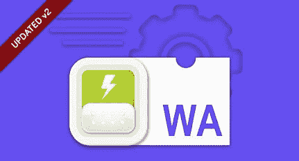
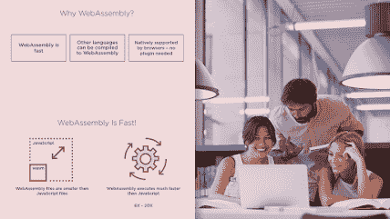

# 2023 年初学者在线学习的 7 门最佳 WebAssembly 和 Blazor 课程

> 原文：<https://medium.com/javarevisited/7-best-webassembly-and-blazor-courses-for-beginners-to-learn-online-8e0cdd61be28?source=collection_archive---------1----------------------->

## 2023 年想学 Web 汇编？以下是 Udemy、Pluralsight、YouTube 和 ZTM 学院的最佳网络组装课程，包括免费课程。

你好 gusy，如果你想学习 WebAssembly 和 Blazor tin 2023 那么你来对地方了。但是，在我告诉你作为初学者应该寻找的最佳 WebAssembly 课程之前，让我告诉你 WebAssembly 到底是什么。WebAssembly 基本上是一种全新的语言，也是对 JavaScript 的改进。

它基本上是一个开放标准，允许在 web 上执行二进制代码。关于 WebAssembly 需要理解的主要内容是，它允许用户将 C 和 C++等语言的性能带到 web 开发中。这意味着它主要用于在浏览器本身中执行要求苛刻的操作。

WebAssembly 被组织成由浏览器以二进制编译的模块。这就像 ECMAScript 模块一样，因为它们包含函数。这意味着 WebAssembly 实际上是一个堆栈机器，因为它在一个指令系统下工作。它可以用来控制循环、进行算术运算和内存访问。

您可以使用 WebAssembly Studio 开始使用 WebAssembly。这是一个 WebAssembly 的在线编辑器，允许用户用各种语言创建 WASM 项目。

# 2023 年面向初学者的 7 门 Best +免费 WebAssembly 课程

在这里，我们为初学者整理了 6 个最好的 WebAssembly 课程。请继续阅读，了解更多信息。

## 1.【WebAssembly 和 Emscripten 入门 [Udemy]

本课程是学习 WebAssembly JavaScript API 和 Emscripten 工具集的精彩而完整的指南。购买本课程后，您将终身获得超过 2 小时的点播视频讲座和 17 种可下载的教育资源。

作为初学者，您将能够理解什么是 WebAssembly，以及它将如何影响 web 开发。您还将学习如何使用本地 JavaScript 浏览器 API 加载和运行 WebAssembly 模块。

**课程时长:3 小时**

**课程评分:4.6 星(满分 5 分)**

课程讲师:雷·维尔乔恩

**课程价格:20 美元**

以下是参加本课程的链接—[web assembly 入门](https://click.linksynergy.com/deeplink?id=JVFxdTr9V80&mid=39197&murl=https%3A%2F%2Fwww.udemy.com%2Fcourse%2Fwebassembly-emscripten%2F)

## 2. [Web 组装:大图](https://pluralsight.pxf.io/c/1193463/424552/7490?u=https%3A%2F%2Fwww.pluralsight.com%2Fcourses%2Fweb-assembly-big-picture) [Pluralsight]

本课程是必不可少的，因为它将教你什么是 Web Assembly 以及它为什么重要。本课程将教你如何使用 Web Assembly 创建应用程序，以及如何使用 C#等语言创建 Web 应用程序。

您将从学习 Web Assembly 的来源开始本课程。您还将探索 Web 程序集到底是什么。然后，您将通过了解如何使用 Web Assembly 来完成本课程。

**课程时长:1 小时**

**课程评分:4.5 星(满分 5 分)**

**课程讲师:Barry Luijbregts**

**课程价格:高级计划每年 140 美元**

以下是加入本课程的链接— [网络组装:大图](https://pluralsight.pxf.io/c/1193463/424552/7490?u=https%3A%2F%2Fwww.pluralsight.com%2Fcourses%2Fweb-assembly-big-picture)

不过，你需要一个 [Pluralsight 会员](https://pluralsight.pxf.io/c/1193463/424552/7490?u=https%3A%2F%2Fwww.pluralsight.com%2Fpricing%2Fskills)才能加入这个课程，费用大约是每月 29 美元或每年 299 美元(14%的折扣)。我向所有程序员强烈推荐这个订阅，因为它提供了超过 7000 个在线课程的即时访问，以学习任何技术技能。或者，你也可以使用他们的 [**10 天免费通行证**](https://pluralsight.pxf.io/c/1193463/424552/7490?u=https%3A%2F%2Fwww.pluralsight.com%2Fpricing%2Ffree-trial) 免费观看这门课程。

<https://pluralsight.pxf.io/c/1193463/424552/7490?u=https%3A%2F%2Fwww.pluralsight.com%2Fpricing%2Ffree-trial>  

## 3.[带 JS(TS)的锈蚀和腹板装配—实用指南](https://click.linksynergy.com/deeplink?id=JVFxdTr9V80&mid=39197&murl=https%3A%2F%2Fwww.udemy.com%2Fcourse%2Frust-webassembly-with-js-ts-the-practical-guide%2F)【Udemy】

在这个精彩的课程中，你将学习如何用 Rust 编码并编译成 Web 汇编。您将学习如何准备 JS/TS 前端并创建一个基于浏览器的贪吃蛇游戏。

你将能够以一种实用而有趣的方式理解铁锈语言。你也将能够在锈菌发展的令人兴奋的领域中确立自己的地位。您可以使用从本课程中学到的知识来开发自己的应用程序。

课程时长:14 小时

**课程评分:4.6 星(满分 5 分)**

**课程讲师:菲利普·耶尔加**

**课程价格:56 美元**

以下是加入本课程的链接—[Rust and Web Assembly with JS(TS)](https://click.linksynergy.com/deeplink?id=JVFxdTr9V80&mid=39197&murl=https%3A%2F%2Fwww.udemy.com%2Fcourse%2Frust-webassembly-with-js-ts-the-practical-guide%2F)

## 4.用 Blazor WebAssembly 制作一个电子商务网站。NET 6【Udemy】

本课程与列表中的其他课程略有不同，因为这是一门高度专业化的课程，正如您可能已经从标题中猜到的那样，本课程将教您如何使用 Blazor WebAssembly、Entity Framework Core 和 SQL Server Express 构建一个电子商务网站。

在电子商务网站的帮助下，您将能够构建一个全栈 Blazor WebAssembly 应用程序。

**课程时长:17 小时**

**课程评分:4.7 星(满分 5 分)**

**课程导师:帕特里克神**

**课程价格:56 美元**

以下是加入本课程的链接— [用 Blazor WebAssembly 制作一个电子商务网站](https://click.linksynergy.com/deeplink?id=CuIbQrBnhiw&mid=39197&murl=https%3A%2F%2Fwww.udemy.com%2Fcourse%2Fblazor-ecommerce%2F)

## 5.Blazor WebAssembly & Web API on。NET 6 —完整课程(C#) — FreeCodeCamp 和 YouTube

这是一个优秀的免费在线课程，学习 WebAssembly 和 Web API，在 2023 年和。NET 6。在这赚 Blazor WebAssembly 和 Web API on。NET 6 通过使用 C#构建一个购物车应用程序。

本课程还提供了如何将支付网关集成到您的 Blazor WebAssembly 组件中的指南，以便用户能够使用借记卡、信用卡或 PayPal 帐户通过您的应用程序支付产品。

以下是本课程涵盖的主题:

⭐️课程内容⭐️

1.  使用 EF 核心代码优先数据库迁移创建数据库
2.  从数据库中检索产品数据(Web API 组件)
3.  为数据传输对象(dto)创建类
4.  创建 ProductRepository 类(存储库设计模式)
5.  创建 ProductController 类
6.  创建 DtoConversion 类(DTO 转换扩展方法
7.  向用户显示产品数据(Blazor WebAssembly 组件)
8.  向用户显示特定产品的数据(Web API 和 Blazor)
9.  将产品添加到购物车(Web API 和 Blazor)，等等。

你可以在这里观看完整的课程，并建立单页应用程序，购物车应用程序，一个不错的项目，以及如何一步一步地与支付网关集成。

## 6. [WebAssembly:实用指南](https://academy.zerotomastery.io/p/learn-webassembly?affcode=441520_zytgk2dn)【零到精通学院】

对于初学者来说，这是一个完美的课程，因为它将向你介绍 WebAssembly，解释 WebAssembly 如何工作，并教你如何使用它。学完本课程后，您将具备开始构建 WebAssembly 应用程序的必要技能。

您可以通过本课程了解 WebAssembly 如何适合您的应用程序，以及如何构建您自己的 WebAssembly 模块。您还将收到如何使用 Rust 模块的演示。

**课程时长:2.5 小时**

**课程评分:4.5 星(满分 5 分)**

**课程导师:小路易斯·拉米雷斯**

**课程价格:高级计划每年 140 美元**

以下是参加本课程的链接— [WebAssembly:实用指南](https://academy.zerotomastery.io/p/learn-webassembly?affcode=441520_zytgk2dn)

顺便说一句，你需要一个 [**ZTM 会员**](https://academy.zerotomastery.io/a/aff_c0gnlvf7/external?affcode=441520_zytgk2dn) 才能观看这个课程，这个课程每月花费大约 39 美元，但是也提供了许多超级吸引人和有用的课程，比如这个课程。您还可以使用我的代码朋友 10 获得您选择的任何订阅的 10%的折扣。

## 7.[Blazor web assembly full stack boot camp with。NET 5](https://click.linksynergy.com/deeplink?id=JVFxdTr9V80&mid=39197&murl=https%3A%2F%2Fwww.udemy.com%2Fcourse%2Fblazor-webassembly%2F)【Udemy】

在本课程中，您将学习如何构建一个完整的 web 应用程序 Blazor WebAssembly、Web API、实体框架和 SQL Server。购买本课程后，您将终身获得超过 17 小时的点播视频讲座、2 篇文章和 2 个可下载的教育资源。

您还可以利用内置的表单组件，如 InputText、InputCheckbox 和 InputSelect。

**课程时长:18 小时**

**课程评分:4.7 星(满分 5 分)**

**课程导师:帕特里克神**

课程价格:56 美元

以下是加入本课程的链接—[Blazor web assembly full stack boot camp](https://click.linksynergy.com/deeplink?id=JVFxdTr9V80&mid=39197&murl=https%3A%2F%2Fwww.udemy.com%2Fcourse%2Fblazor-webassembly%2F)

# 2023 年的 Leanring Web 组装？常见问题解答

这里是学习 Web Assembly 和 Blazor 的人的常见问题，我已经尽可能地回答了，但是如果你有问题没有得到回答，请在评论中自由提问。

**1。什么是 WebAssembly？**

WebAssembly 基本上是一种全新的语言，也是对 JavaScript 的改进。它基本上是一个开放标准，允许在 web 上执行二进制代码。关于 WebAssembly 需要理解的主要内容是，它允许用户将 C 和 C++等语言的性能带到 web 开发中。这意味着它主要用于在浏览器本身中执行要求苛刻的操作。

**2。WebAssembly 中的模块是什么？**

WebAssembly 被组织成由浏览器以二进制编译的模块。这就像 ECMAScript 模块一样，因为它们包含函数。这意味着 WebAssembly 实际上是一个堆栈机器，因为它在一个指令系统下工作。它可以用来控制循环、进行算术运算和内存访问。

**3。如何开始使用 WebAssembly？**

您可以使用 WebAssembly Studio 开始使用 WebAssembly。这是一个 WebAssembly 的在线编辑器，允许用户用各种语言创建 WASM 项目。

# 结论

以上就是 2023 年学习 Web 汇编最好的在线课程。正如你所看到的，我已经给了你一个最好的课程列表，初学者可以用它来进入 WebAssembly 这个有趣的世界。我毫不怀疑这些课程会在几周内让你从一个完全的初学者变成一个 web 组装专家。

如果你喜欢这份适合初学者的 6 门最佳 WebAssembly 课程列表，请随意与你的朋友和家人分享。