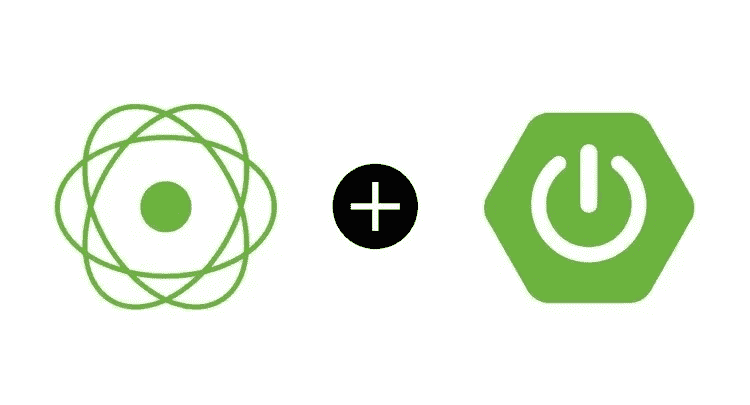
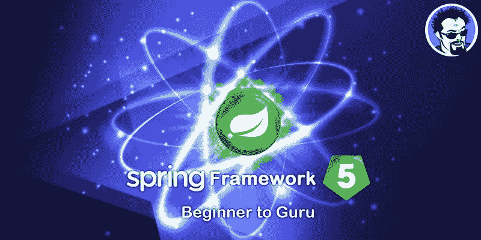
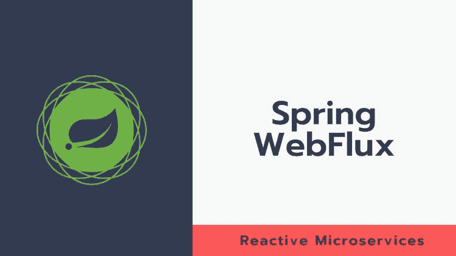

# 2023 年 Java 程序员的 7 门最佳 WebFlux 和反应式 Spring Boot 课程

> 原文：<https://medium.com/javarevisited/7-best-webflux-and-reactive-spring-boot-courses-for-java-programmers-33b7c6fa8995?source=collection_archive---------0----------------------->

## 我最喜欢的 2023 年用 Java 学习反应式编程的课程使用 Udemy、Pluralsight、Educative 的 WebFlux、RxJava、反应式 Spring Boot。

image_credit — Udemy

大家好，近年来应用程序的需求发生了巨大的变化。不久前，一个大型在线应用程序可能有几十台服务器、几秒钟的响应时间、数小时的离线维护和数千兆字节的数据。

如今，从移动设备到运行数千个多核处理器的基于云的集群，应用程序部署在各种设备上。用户期望毫秒级的响应时间和 100%的正常运行时间。数据以 Pb 为单位。昨天的软件架构根本无法满足今天的需求。

用户希望系统反应灵敏、有弹性、有弹性，并且是消息驱动的。这些被称为反应系统。

最近，反应式编程变得非常流行。它是一种编程范式，专注于异步、事件驱动、非阻塞的数据处理方法，为用 Java 编写下一代可伸缩的 web 应用程序铺平了道路。

如果你想在 2023 年通过 Spring Boot 和 WebFlux 学习反应式编程，并寻找一些在线课程，那么你来对地方了。之前我已经分享了 [**最佳春季课程**](https://javarevisited.blogspot.com/2018/06/top-6-spring-framework-online-courses-Java-programmers.html) 和 [**最佳 Spring Boot 课程**](https://javarevisited.blogspot.com/2018/06/top-6-spring-framework-online-courses-Java-programmers.html) 今天我要分享的是 Spring Boot 和 Web Flux 学习反应式编程的最佳在线课程。

这意味着对反应式编程的透彻了解是创建可伸缩的 web 应用程序的必要条件，这就是为什么 Java 开发人员学习反应式编程非常重要。

它也很好地适应了云的分布式本质，这就是为什么越来越多的开发发生在被动方面，特别是在微服务领域

反应式系统是一种高性能和可伸缩的构建应用程序的方式，可以提升 web 和移动设备的开发体验。它与传统的 [web 应用程序开发](/javarevisited/10-best-java-full-stack-web-development-courses-to-join-in-2020-6cd6cd2e5868)有很大的不同。您拥有服务器端和客户端逻辑、异步数据获取和反应式客户端呈现。

学习建立反应系统将为你打开许多新的可能性，并向雇主展示你可以适应不断变化的要求。所以今天的课程是:

Spring 是最流行的后端框架之一，它认识到了对响应式范例的需求，并引入了对创建响应式应用程序和<https://javarevisited.blogspot.com/2018/02/top-5-spring-microservices-courses-with-spring-boot-and-spring-cloud.html#axzz6qnblZnVj>**微服务的支持。它提供了 WebFlux，一个支持完全无阻塞反应流的并行 Spring MVC 框架。**

**使用 spring 进行反应式编程已经变得很流行，但同时，理解 Spring 的反应式编程并不容易。原因之一是没有适当的资源。所以在本文中，我们将列出能帮助你理解[无功弹簧](https://javarevisited.blogspot.com/2021/04/best-reactive-spring-and-webflux-courses-for-java-developers.html)的前五门课程。**

**这些反应式 Spring 在线课程是从 Udemy、Pluralsight 和 Baeldung 等网站编译而来的。它们是由专家创建的，受到了成千上万开发人员的信任。它们也很实惠，尤其是 Udemy 课程，你只需花 10 美元就可以参加，Udemy 销售时有发生。**

# **2023 年用 Spring Boot 和 WebFlux 学习 Java 反应式编程的 7 门最佳课程**

**在不浪费您更多时间的情况下，这里列出了 Java 开发人员学习 Reactive Spring 的最佳在线课程。您可以使用这些课程来学习反应式概念，以及用 Java 创建反应式应用程序的 Spring 框架支持。**

## **1.[弹簧框架 5 的反应式编程](https://click.linksynergy.com/deeplink?id=JVFxdTr9V80&mid=39197&murl=https%3A%2F%2Fwww.udemy.com%2Fcourse%2Freactive-programming-with-spring-framework-5%2F)**

**这是 udemy 上最受欢迎的课程之一，致力于用 Spring 框架进行反应式编程。如果你不知道什么是反应式编程以及如何用 Java 编写反应式代码，那么这个课程就是为你准备的。**

**在本课程中，导师[约翰·汤姆逊](https://click.linksynergy.com/deeplink?id=CuIbQrBnhiw&mid=39197&murl=https%3A%2F%2Fwww.udemy.com%2Fuser%2Fjohn-thompson-2%2F)，Udemy 最受欢迎的 Java 和 Spring 导师之一，解释了如何利用 Spring 的反应式编程、Spring data MongoDB 中的反应式类型、用 WebFlux 构建微服务、用 Java 进行函数式编程等概念。

*需求*
*Spring 框架的 Java 知识。***

**该课程相对较小，总视频内容不到四个小时。它是一门中级课程。如果你喜欢约翰·汤姆逊的教学风格，那么你会喜欢这门课，我真的很喜欢它。**

****这里是加入本课程**——[用 Spring 框架进行反应式编程 5](https://click.linksynergy.com/deeplink?id=JVFxdTr9V80&mid=39197&murl=https%3A%2F%2Fwww.udemy.com%2Fcourse%2Freactive-programming-with-spring-framework-5%2F) 的链接**

****

## **2.[使用 Spring Boot/WebFlux 构建反应式 RESTFUL APIs】](https://click.linksynergy.com/deeplink?id=JVFxdTr9V80&mid=39197&murl=https%3A%2F%2Fwww.udemy.com%2Fcourse%2Fbuild-reactive-restful-apis-using-spring-boot-webflux%2F)**

**这是 udemy 最好的弹簧课程之一。在本课程中，首先，讲师会解释关于反应式编程的一切，例如什么是反应式编程以及为什么使用它。然后，他转向反作用力弹簧。**

**这位名叫[陈爱龙·孙达拉杰](https://click.linksynergy.com/deeplink?id=CuIbQrBnhiw&mid=39197&murl=https%3A%2F%2Fwww.udemy.com%2Fuser%2Fdilipsundarraj2%2F)的讲师解释了如何使用 spring 编写反应式编程、从头开始构建反应式 API、使用 DB 编写反应式编程代码、使用 WebClient 构建非阻塞客户端等等。**

***要求*1。JDK 8 及以上。
2。需要了解 Spring Boot。

是中级课程。必须了解 Spring Boot。本课程视频内容总时长近十小时。我向任何已经了解 Spring Framework 和 Spring Bot 并对使用 Java 中的反应范式创建非阻塞客户机感兴趣的人强烈推荐本课程。**

****这是本课程的链接** — [使用 Spring Boot/WebFlux 构建反应式 RESTFUL API](https://click.linksynergy.com/deeplink?id=JVFxdTr9V80&mid=39197&murl=https%3A%2F%2Fwww.udemy.com%2Fcourse%2Fbuild-reactive-restful-apis-using-spring-boot-webflux%2F)**

****

## **3. [Spring WebFlux:入门](https://pluralsight.pxf.io/c/1193463/424552/7490?u=https%3A%2F%2Fwww.pluralsight.com%2Fcourses%2Fgetting-started-spring-webflux)**

**这是学习 Pluralsight 上 Spring WebFlux 的最佳在线课程之一。该课程由 Esteban Herrera 创建，将通过构建一个 REST API 向您传授 Spring WebFlux 和反应式编程的基础知识。在这个过程中，您还将学习如何使用 Reactor、WebClient 和 WebTestClient。**

**在本课程中，您将学到以下内容:**

1.  **反应式编程**
2.  **如何使用带注释的控制器**
3.  **如何使用功能端点**
4.  **如何执行请求**
5.  **如何设置集成测试**

**你将从学习**什么是**反应式编程以及它为什么如此有用开始。然后，您将看到如何使用 Spring WebFlux 的带注释的控制器和功能端点来处理大量数据。之后，您将使用`WebClient` 创建反应式 web 客户端，并使用`WebTestClient`设置集成测试。**

**完成本课程后，您将具备使用 Spring WebFlux 进行反应式编程的基础知识，这将有助于您构建可伸缩的 web 应用程序。**

****这里是加入本课程的链接** — [Spring WebFlux:入门](https://pluralsight.pxf.io/c/1193463/424552/7490?u=https%3A%2F%2Fwww.pluralsight.com%2Fcourses%2Fgetting-started-spring-webflux)**

****

**顺便说一下，你需要一个 [**Pluralsight 会员**](https://pluralsight.pxf.io/c/1193463/424552/7490?u=https%3A%2F%2Fwww.pluralsight.com%2Flearn) 才能加入这个课程，费用大约是每月 29 美元或每年 299 美元(14%的折扣)。**

**我向所有程序员强烈推荐这个订阅，因为它提供了超过 7000 个在线课程的即时访问，以学习任何技术技能。或者，你也可以使用他们的 [**10 天免费通行证**](https://pluralsight.pxf.io/c/1193463/424552/7490?u=https%3A%2F%2Fwww.pluralsight.com%2Flearn) 免费观看本课程。此外，这个月，所有 Pluralsight 课程都是免费的。**

**<https://pluralsight.pxf.io/c/1193463/424552/7490?u=https%3A%2F%2Fwww.pluralsight.com%2Flearn> ** 

## **4.[学春:大师课——拜尔东](https://www.baeldung.com/learn-spring-course?affcode=22136_bkwjs9xa)**

**如果你正在寻找一个完整的课程来学习 Spring、Spring Boot 和 Reactive Spring API，那么这是最适合你的在线课程。Eugen Paraschive 不需要任何介绍，他的春季课程非常深入、及时、实用。**

**这是一门初级的弹簧和 Spring Boot 课程。在每个模块中，您将编写代码，讲座将向您解释如何编写代码。**

**Baeldung 的这门课程不仅面向那些想学习反应式编程的人，也面向那些想从基础开始学习 Spring 框架的人。**

**你将从非常基础的知识中学习关于弹簧的一切，几乎涵盖了所有与弹簧相关的必要概念，包括反作用弹簧。**

**本课程还有一章专门介绍 Spring 5 中引入的新的反应范式。虽然与 Udemy 的课程相比，这个课程可能有点贵，但这是物有所值的。欧根还在限定时间内提供 30%的折扣**

****这里是加入这个课程的链接**——[学春:大师班](https://www.baeldung.com/learn-spring-course?affcode=22136_bkwjs9xa)**

****

## **5. [Spring 框架 5:初学者到大师](https://click.linksynergy.com/deeplink?id=JVFxdTr9V80&mid=39197&murl=https%3A%2F%2Fwww.udemy.com%2Fcourse%2Fspring-framework-5-beginner-to-guru%2F)**

**这是 udemy 最畅销的春季课程之一。这门课程有超过 58，000 名学生，是为那些想从一开始就掌握 Spring 框架的人开设的。我特别喜欢约翰·汤姆逊的教学风格，他会仔细解释所有相关的概念。**

**在本课程中，您将学习 spring 框架、 [Spring MVC](/javarevisited/my-favorite-spring-mvc-courses-for-java-developers-5ede7f85dd88) 、Spring Boot、 [Spring Data JPA](/javarevisited/5-best-spring-data-jpa-courses-for-java-developers-45e6438be3c9) 、Spring Mongodb、hibernate 等等。**

**除了所有必要的 spring 概念，反应式编程还有两个独立的部分。

*要求*
1。Java 知识。
2。建议具备 HTML、SQL 和数据库知识。

这是一个庞大的课程，总视频内容超过 56 个小时，如果你想了解关于 Spring 框架的一切，比如 core Spring、Spring Boot、Reactive Spring，甚至一点 Spring MVC，那么你应该加入这个课程。**

****这里是加入本课程**——[Spring Framework 5:初学者到大师](https://click.linksynergy.com/deeplink?id=JVFxdTr9V80&mid=39197&murl=https%3A%2F%2Fwww.udemy.com%2Fcourse%2Fspring-framework-5-beginner-to-guru%2F)的链接**

****

## **6.[Spring web flux 的反应式微服务](https://click.linksynergy.com/deeplink?id=JVFxdTr9V80&mid=39197&murl=https%3A%2F%2Fwww.udemy.com%2Fcourse%2Fspring-webflux%2F)【Udemy 课程】**

**这是在 Udemy 上用 Spring WebFlux 学习反应式微服务的又一个牛逼课程。本课程也适用于那些想了解 Spring core 基本知识的个人。**

**除了各种重要的概念和实时例子，本课程还非常好地涵盖了 spring 的反应式编程。

是一个比较小的课程，总视频内容八个半小时。它是一门中级课程，需要 Java 和 Spring 的基础知识。**

**要求
需要 Java 和 Spring 的知识。**

**如果你想用 Spring WebFlux / Reactive Stack 构建高可伸缩性和弹性的微服务，那么我向你强烈推荐这个课程。**

****以下是加入本课程**—[Spring web flux 反应式微服务](https://click.linksynergy.com/deeplink?id=JVFxdTr9V80&mid=39197&murl=https%3A%2F%2Fwww.udemy.com%2Fcourse%2Fspring-webflux%2F)的链接**

****

## **7.[全无功堆:Spring Boot 2 &弹簧片通量](https://www.educative.io/courses/full-reactive-stack-spring?affiliate_id=5073518643380224)**

**如果你正在寻找一个交互式课程来学习 Spring Boot 2 和 WebFlux for reactive programming，那么 Educative 的这个基于文本的课程是一个很好的开始。**

**在这里，您将学习构建一个从数据库(MongoDB reactive)到前端(Angular)的反应式 web 系统，使用 Spring WebFlux 利用的反应式编程策略和 Spring Boot 2 提供的简单性。**

**这是让自己接触多种技术、全栈开发以及从头开始构建一个反应式架构的好方法。开始使用现代系统架构。**

**本课程最大的好处是你可以在浏览器中运行代码示例，这意味着你无需任何设置就可以开始学习。**

****这里是加入本课程的链接** — [全反应堆:Spring Boot 2&Spring web flux](https://www.educative.io/courses/full-reactive-stack-spring?affiliate_id=5073518643380224)**

****

**此外，如果你找到了教育平台和他们高度互动的课程，那么你还可以获得 [**教育订阅**](https://www.educative.io/subscription?affiliate_id=5073518643380224) ，每月只需 14.9 美元即可访问他们的 100 多门课程。非常划算，非常适合准备编码面试。**

**<https://www.educative.io/subscription?affiliate_id=5073518643380224>  

以上就是 2023 年**学习反应式编程和 WebFlux 的最佳春季课程**。这些是 Java 开发人员学习 reactive spring online 的最佳在线培训课程，您应该利用这些课程来学习高级的 reactive 编程技能。

如前所述，用 spring 学习反应式编程的资源非常少。本文中列出的一些在线课程是专门针对反作用弹簧的，而另一些则有反作用弹簧作为子部分。

要学习反应式编程，必须对 Java 和 Spring 有适当的了解。清单上的大部分课程都有这些要求。所以相应选择。

您可能想探索的其他 **Spring MVC 文章**

*   [10 个最适合初学者的 Spring 框架课程](/javarevisited/10-best-online-courses-to-learn-spring-framework-in-2020-f7f73599c2fd)
*   【Java 开发人员 20+ Spring Boot 面试问题
*   [15 春季数据和 JPA 面试题](https://www.java67.com/2021/01/spring-data-jpa-interview-questions-answers-java.html)
*   [与 Spring Boot 一起学习微服务的 10 大课程](/javarevisited/10-best-java-microservices-courses-with-spring-boot-and-spring-cloud-6d04556bdfed)
*   [13 Spring Boot 致动器面试问题](https://www.java67.com/2021/02/spring-boot-actuator-interview-questions-answers-java.html)
*   [15 大微服务面试问题及答案](https://www.java67.com/2021/02/microservices-interview-questions-answers-java-spring.html)
*   [20 道 Spring Boot 测试面试问题及答案](https://javarevisited.blogspot.com/2020/05/top-20-spring-boot-interview-questions-answers.html)
*   [15 春云面试问题及答案](https://www.java67.com/2021/01/spring-cloud-interview-questions-with-answers-java.html)
*   [如何在 Spring 控制器中获取 ServletContext 对象](http://javarevisited.blogspot.sg/2012/03/how-to-get-servletcontext-in-servlet.html)
*   为有经验的开发人员开设的 10 门高级 Spring Boot 课程
*   [17 春季 AOP 面试问题及答案](https://javarevisited.blogspot.com/2021/03/spring-aop-interview-questions-answers.html#axzz6nwXUSoGH)

感谢您阅读本文。如果你觉得这些*最佳反应弹簧和 Spring Boot +网络流量在线课程*有用，那么请与你的朋友和同事分享。如果您有任何问题或反馈，请留言。

**P. S.** —如果你热衷于学习 Spring MVC 框架并成为一名全栈 Java 开发人员，但正在寻找免费的在线课程，那么你也可以在 Udemy 上查看这个 [**Angular and Spring MVC 课程**](https://click.linksynergy.com/deeplink?id=JVFxdTr9V80&mid=39197&murl=https%3A%2F%2Fwww.udemy.com%2Fcourse%2Fbuild-an-angular-and-spring-mvc-web-application%2F) 。课程已经完成，你只需要一个免费的 Udemy 帐户就可以参加这个课程。

<https://click.linksynergy.com/deeplink?id=JVFxdTr9V80&mid=39197&murl=https%3A%2F%2Fwww.udemy.com%2Fcourse%2Fbuild-an-angular-and-spring-mvc-web-application%2F> **