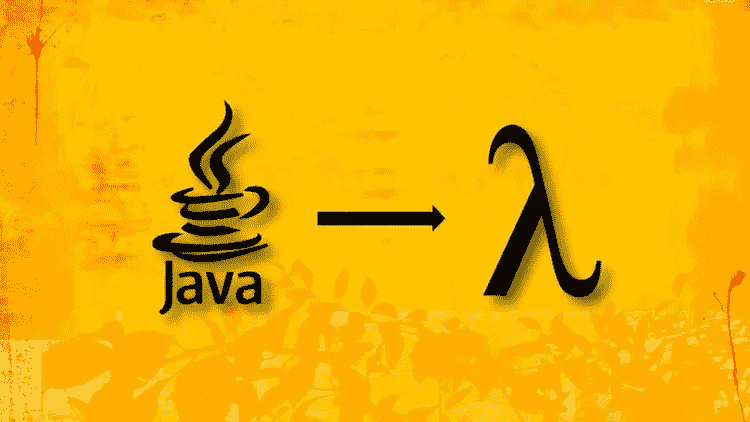
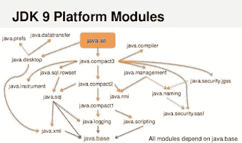
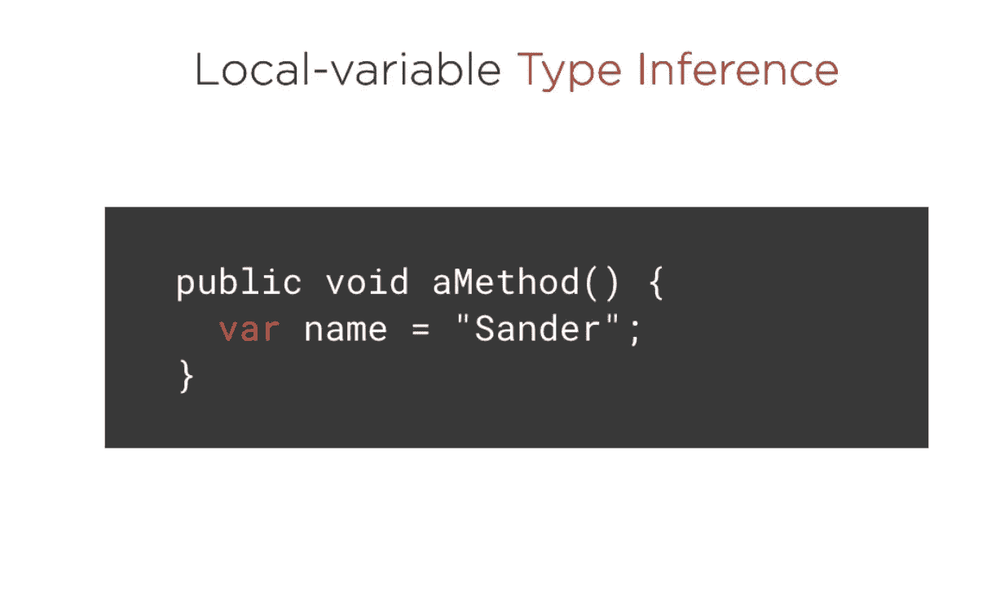
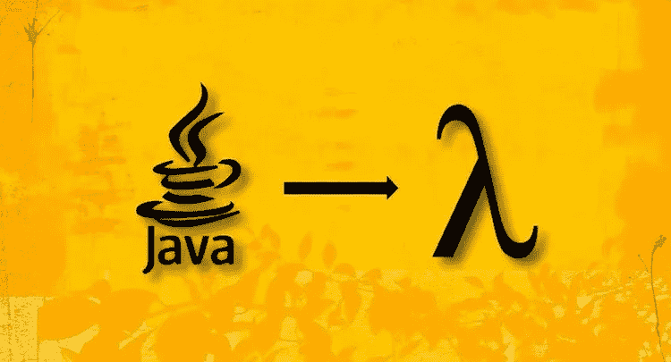

# Java 开发人员应该在 2023 年学习的 7 个 JDK 新特性

> 原文：<https://medium.com/javarevisited/7-features-java-developers-should-learn-73cc3d4e734f?source=collection_archive---------0----------------------->

## 记录、密封类、开关表达式、var、文本块、Lambda 表达式和 var 参数是 Java 程序员在 2023 年可以学习的基本 Java 特性

[](http://bit.ly/2AHuthF)

image_credit — Udemy

大家好，Java 变化很快，在过去的 2 到 3 年里发生了很大的变化。现在每六个月就有一个新版本，很难跟上新的 Java 特性。那么一个 Java 程序员应该做些什么来使自己跟上时代的步伐而不遗漏关键特性呢？

你可以专注于一些关键的 Java 特性，而不是学习全新的特性，这些特性使开发更容易，并且有可能提高代码质量。

自从 Java 10 以来，我还没有机会学习大多数 Java 特性，所以我决定坐下来记下最重要的 Java 特性，这就是我将在本文中分享的内容。

在本文中，您将了解自 Java 8 发布以来的 **7 个新的 Java 特性，这包括来自 Java 10 的 *var* ，来自 Java 9 的*模块*，来自 Java 15 的*密封类*，来自 Java 14 的*记录*，来自 Java 15 的*文本块*，以及来自 Java 12 的*开关表达式*。**

这些 Java 特性不仅会帮助你写出更好的代码，而且从 Java 访谈的角度来看也是值得了解的，这就是为什么我认为每个 Java 开发者都应该在 2023 年学习。

在详细学习这些 Java 特性之前，让我们先了解一下它们是什么，以及它们如何帮助 Java 开发人员。 [**模块**](https://javarevisited.blogspot.com/2018/02/top-5-java-9-courses-to-learn-online.html) 通过减少不需要的包，让你的 Java 应用变得更小更快。你可以包括你真正需要的东西。

然后[**var**](https://javarevisited.blogspot.com/2018/03/finally-java-10-has-var-to-declare-local-variables.html)**来了，这使得像 [Javascript](https://www.java67.com/2020/10/best-javascript-courses-for.html) 和其他编程语言一样声明局部变量变得更加容易。**

****开关表达式**使得分支更加容易，并且提高了代码的可读性。现在，您可以编写表达式，组合多个事例以产生单个结果，等等。您将在示例中看到新的 switch 语句是多么清晰和简洁。**

**Sames 转到**文本块**，结束了多行字符串转义的痛苦。现在，从 Java 程序生成多行输出变得容易多了。**

****记录**Java 14 是一个游戏规则改变者，它允许你特定的不可变的数据结构而没有任何混乱。现在，您不需要为您的 Java 类定义 equals()、hashCode()、toString()和 constructor，只需将它们声明为 Record，Java 会处理好这些。这使得声明域对象变得非常容易。**

**现在，来看一下**密封类**顾名思义，它们允许你密封你的类和接口，这样只有被允许的类才能扩展它或者哪个接口可以实现它。对于数据建模来说，这是一个很好的特性，可以提高库的安全性。**

# **2023 年每个 Java 开发人员都应该学习的 7 个 Java 新特性**

**Java 是最流行的编程语言之一。自 90 年代问世以来，它一直保持着顶级语言的地位。今天，Java 在几个领域得到了应用。它用于开发基于 web 的应用程序、移动应用程序、桌面 GUI 应用程序等等。**

**Java 是一种定期更新的编程语言。定期添加新功能，删除、替换或更新过时的功能。Java 开发人员必须跟上新的变化。

在本文中，我们将讨论 5 大 Java 新特性和两个需要学习的旧但重要的 Java 特性，如下所示:**

## **1.模块**

**Java 模块是 Java 9 增加的新特性。它是一种机制，使用这种机制，您可以将 Java 应用程序或 API 打包为 Java 模块。它以模块化 JAR 文件的形式提供。一个模块可以包含一个或多个包。**

**这个特性允许 Java 设计者将大的 JDK 分成更小的模块，这意味着现在你的应用程序占用的内存更少，你可以在内存更少的设备上运行。

在建立一个模块之前，我们需要把`“module-info.java”` 放在包的根目录下。这个文件被称为模块描述符。它拥有构建模块或在模块中使用所需的所有信息。

下面是创建模块的语法。**

```
**module** **newModule**{ 
  // functional code
}
```

**我们必须使用“模块”关键字来创建一个模块。如果你想学习更多关于 Java 中模块的知识，我建议你查看 Udemy 的 [**完整的 Java Masterclass**](http://bit.ly/2AHuthF) 课程。**

**[](http://bit.ly/2AHuthF)**

## **2.记录**

**Java 中的 Record 是一种特殊的类，它有简洁的语法。它用于定义不可变的纯数据类。此外，Java record 类对于保存从远程服务调用和数据库查询返回的记录、从 [CSV 文件](https://www.java67.com/2019/05/how-to-read-csv-file-in-java-using-jackson-library.html)读取的记录以及类似的其他用例非常有用。

下面是 Java 记录类的语法。**

```
**public** record **demo**(**int** arg1, **int** arg2) { 
   //functional code
}
```

**记录是一个非常有用的特性，它不仅节省了输入，还提供了一个健壮的机制来声明不可变的数据结构。如果您的对象只有一堆字段来管理状态，我强烈建议您使用 Record。**

**如果你想了解更多关于记录和其他新的 Java 特性，你也可以查看 Udemy 上最好的 Java 讲师之一 Ranga Karnam 的 [**完全初学者 Java 编程**](https://click.linksynergy.com/deeplink?id=CuIbQrBnhiw&mid=39197&murl=https%3A%2F%2Fwww.udemy.com%2Fcourse%2Fjava-programming-tutorial-for-beginners%2F) 课程。**

**[](https://click.linksynergy.com/deeplink?id=CuIbQrBnhiw&mid=39197&murl=https%3A%2F%2Fwww.udemy.com%2Fcourse%2Fjava-programming-tutorial-for-beginners%2F)**

## **3.var 关键字**

**Java 10 中引入的 [var 关键字](https://javarevisited.blogspot.com/2018/03/finally-java-10-has-var-to-declare-local-variables.html)是 Java 最有用的新特性之一。在 Java 的早期，当声明一个变量时，我们必须指定变量的数据类型。这样的变量只能保存那些与数据类型匹配的值。但是使用 var 关键字声明的变量可以保存任何数据类型的值。不需要指定数据类型。**

```
**class** **VarDemo** { **public** **static** **void** **main** (String[] args) throws java.lang.Exception {  // int 
 **var** x = 123;  // double 
 **var** y = 2.70;  // string 
 **var** z = 'abc';   } 
}
```

**在上面的代码中，使用 var 关键字声明了三个变量——x、y 和 z。我们可以看到没有指定数据类型。如果你想了解更多关于 var 和其他 Java 10 和 11 的特性，我推荐你去看看 Udemy 上的这个不错的小课程 [**Java 新特性(Java 12，Java 11，Java 10，Java9 & Java8)**](https://click.linksynergy.com/deeplink?id=JVFxdTr9V80&mid=39197&murl=https%3A%2F%2Fwww.udemy.com%2Fcourse%2Fjava-new-features%2F)**

**[](https://click.linksynergy.com/deeplink?id=JVFxdTr9V80&mid=39197&murl=https%3A%2F%2Fwww.udemy.com%2Fcourse%2Fjava-new-features%2F)**

## **4.正文块**

**文本块是 Java 的另一个有用的新特性。多行字符串是跨越多行的文本块。为此，我们必须使用行分隔符。

在 Java 中，“/n”是行分隔符。观察下面的代码。**

```
**class** **TextBlockDemo** { **public** **static** **void** **main** (String[] args) throws java.lang.Exception { 
    String multiLine = "This is line 1.\nThis is line 2.\nThis is line 3."; 
    System.**out**.println(multiLine); 
  } } The output will be: 
This **is** line 1\. 
This **is** line 2\. 
This **is** line 3.
```

**如果你想了解更多关于 Java 13 的特性，我推荐你去看看 Pluralsight 上的[**Java 13 的新特性**](https://pluralsight.pxf.io/c/1193463/424552/7490?u=https%3A%2F%2Fwww.pluralsight.com%2Fcourses%2Fwhats-new-in-java-13) 课程。**

**[](https://pluralsight.pxf.io/c/1193463/424552/7490?u=https%3A%2F%2Fwww.pluralsight.com%2Fcourses%2Fwhats-new-in-java-13)**

## **5.密封类**

**密封类特性将使我们对 Java 中的继承有更多的控制。简而言之，我们现在可以定义哪些类可以实现或扩展一个类或接口。

下面是 Java 中一个密封类的例子。**

```
**public** **abstract** **sealed** **class** **C** **permits** **A**, B { 
  // functional code
}
```

**上面的类是使用“sealed”关键字密封的。然后，使用“permissions”关键字来允许那些可以扩展或实现它的类。

同样，我们也可以密封一个接口。**

```
**public** **sealed** **interface** **I** **permits** **J**, K { 
   // functional code
}
```

**如果你想了解更多关于密封类、记录和文本块的知识，我建议你参加由 Sander Mak 在 Pluralsight 上开设的[**Java 15 新特性**](https://pluralsight.pxf.io/c/1193463/424552/7490?u=https%3A%2F%2Fwww.pluralsight.com%2Fcourses%2Fjava-15-whats-new) 课程。它很好地总结和演示了这些新的 Java 特性。**

**[](https://pluralsight.pxf.io/c/1193463/424552/7490?u=https%3A%2F%2Fwww.pluralsight.com%2Fcourses%2Fjava-15-whats-new)**

## **6.var-args**

**var-args 是 Java 的一个流行且常用的新特性。它是可变参数的简称。**

**varargs 方法是一种采用可变数量的参数的方法。这意味着，特定方法的参数数量没有定义。它可以有一个或多个参数。**

**以前，有两种方法可以处理带有可变参数的方法——使用重载方法和将参数放入数组中。但是 var-args 是处理变量参数的一种简单而有效的方法。

下面是 var-args 的语法:**

```
**public** **static** **void** **demo**(... x) { 
  // functional code
}
```

**这样，函数可以有零个或多个参数。“x”将被声明为 int 数据类型的数组。观察下面的代码。**

```
**public** **class** **DemoClass** {   **public** **static** **void** **demo**(**int** ...x) { 
    System.out.println("Number of arguments: " + x.length); 
  }   **public** **static** **void** **main** (String[] args) **throws** java.lang.Exception { 
   demo(1,2,3); // multiple arguments 
   demo(1); // one argument
   demo(); // no argument 
  } 

}
```

**在上面的代码中，“demo”函数有可变参数。首先，用三个参数调用它，然后用一个参数调用，最后不用参数调用。**

**如果你想了解更多关于 Java 的基本特性，我推荐你参加 Udemy 上 Ranga Karnam 的 [**Java 编程完全初学者**](https://click.linksynergy.com/deeplink?id=JVFxdTr9V80&mid=39197&murl=https%3A%2F%2Fwww.udemy.com%2Fcourse%2Fjava-programming-tutorial-for-beginners%2F) 课程。说到学习 Java 和 Spring，我在 Udemy 上最喜欢的导师之一。**

**[](https://click.linksynergy.com/deeplink?id=JVFxdTr9V80&mid=39197&murl=https%3A%2F%2Fwww.udemy.com%2Fcourse%2Fjava-programming-tutorial-for-beginners%2F)**

## **7.λ表达式**

**Lambda 表达式是一种简短的编写方法。它们与方法非常相似。它们接受参数并返回值。但是与方法不同，lambda 表达式没有名字。此外，我们不能在方法体内部实现 lambda 表达式。

以下是 Java 中 lambda 表达式的语法:**

```
(arg1, arg2) -> expression
```

**请遵守以下代码:**

**在下面的代码中， [lambda 表达式](https://javarevisited.blogspot.com/2018/08/top-5-java-8-courses-to-learn-online.html)与 [forEach()](https://www.java67.com/2016/01/how-to-use-foreach-method-in-java-8-examples.html) 函数一起使用。打印列表的所有元素。你可以看到它比传统的循环要干净得多，传统的循环需要几行代码来完成这样简单的任务。**

```
**class** **LambdaExample** {  **public** **static** void main (String[] args) throws java.lang.**Exception** {     ArrayList<Integer> **list** = **new** ArrayList<Integer>(); 
 **list**.add(1); 
 **list**.add(2); 
 **list**.add(3); 
 **list**.add(4); 
 **list**.add(5);  **list**.**forEach**( (x) -> { System.out.println(x); } ); } }The output will be: 
1\. 
2\. 
3\. 
4.
5.
```

**Lambda expression 确实是任何 Java 开发人员都必须知道的特性，如果你想深入学习 Lambda expression，我强烈推荐你查看 Udemy 上的 [**Java Lambda Expressions:学习如何使用 Lambda Expressions**](https://click.linksynergy.com/deeplink?id=JVFxdTr9V80&mid=39197&murl=https%3A%2F%2Fwww.udemy.com%2Fcourse%2Fjava-lambda%2F) 课程。**

**[](https://click.linksynergy.com/deeplink?id=JVFxdTr9V80&mid=39197&murl=https%3A%2F%2Fwww.udemy.com%2Fcourse%2Fjava-lambda%2F)**

**以上就是 2023 年每个 Java 开发者都应该学习的 **5 + 2 新特性**。Java 有几个新特性。Java 中会定期添加新的和更新的特性。在本文中，我们讨论了一些非常有用的新特性。我们讨论了 var-args、记录、var 关键字、文本块和 lambda 表达式。我们通过例子讨论了如何使用这些特性。**

**您可能喜欢的其他 **Java 和编程文章****

*   **[2023 年 Java 开发者路线图](https://javarevisited.blogspot.com/2019/10/the-java-developer-roadmap.html)**
*   **[Java 10 发布——你应该知道的 10 个新特性](http://javarevisited.blogspot.sg/2018/03/java-10-released-10-new-features-java.html)**
*   **[20 个春季 MVC 面试问题及答案](http://javarevisited.blogspot.sg/2018/02/top-20-spring-rest-interview-questions-answers-java.html#axzz57Kv4wGXe)**
*   **[2023 年 Java 开发人员应该阅读的 10 本书](http://www.java67.com/2018/02/10-books-java-developers-should-read-in.html)**
*   **给有经验的开发者的 5 本 Spring 框架书**
*   **[成为软件架构师的 5 门课程](/javarevisited/top-5-courses-to-learn-software-architecture-in-2020-best-of-lot-5d34ebc52e9)**
*   **[2023 年网络开发者路线图](https://javarevisited.blogspot.com/2019/02/the-2019-web-developer-roadmap.html)**
*   **【Java 开发人员应该知道的 10 个测试工具和库**
*   **【Java 开发人员应该知道的前 20 个库**
*   **[2023 年开发运维路线图——如何更好地学习开发运维](https://javarevisited.blogspot.com/2018/09/the-2018-devops-roadmap-your-guide-to-become-DevOps-Engineer.html)**
*   **【Java 程序员应该学习的 10 大框架**
*   **[5 Spring Boot 特性每个 Java 程序员都学](https://javarevisited.blogspot.com/2018/11/top-5-spring-boot-features-java.html#axzz6CwWzuI40)**
*   **[学习 Spring Cloud 微服务的 5 大课程](http://javarevisited.blogspot.sg/2018/02/top-5-spring-microservices-courses-with-spring-boot-and-spring-cloud.html)**

**感谢您阅读本文。如果你觉得这些*Java 新特性*很有用，值得分享，那么请在脸书、Twitter 和 LinkedIn 上与你的同事和朋友分享。如果您有任何问题或反馈，请留言。**

****P. S. —** 如果您是 Java 世界的新手，并且想在学习这些高级框架之前掌握核心 Java，那么我建议您查看这些 [**学习核心 Java 的最佳课程**](/javarevisited/top-5-java-online-courses-for-beginners-best-of-lot-1e1e240a758) 以提升您的技能并掌握基础知识。**

**<https://javarevisited.blogspot.com/2018/05/top-5-java-courses-for-beginners-to-learn-online.html> **