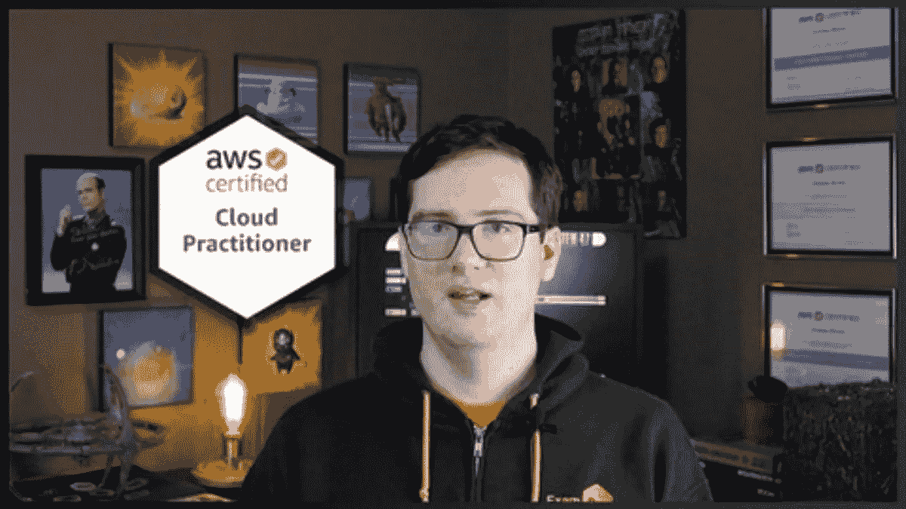
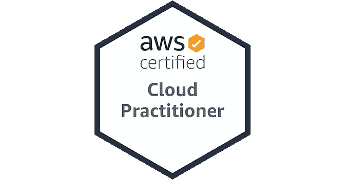
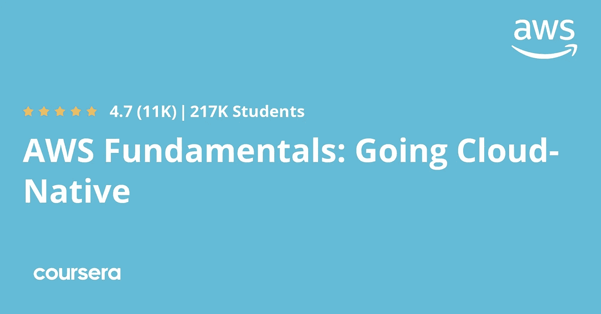

# 2023 年 7 门最佳免费 AWS 云从业者认证课程

> 原文：<https://medium.com/javarevisited/7-free-aws-cloud-practitioner-certification-courses-to-crack-exam-in-2021-f13d6a996019?source=collection_archive---------0----------------------->

## 这些是来自 Udemy、YouTube 和 Coursera 的最好的免费资源和在线培训课程，可以在 2023 年通过 AWS 云从业者认证考试

大家好，如果你的目标是在 2023 年获得 AWS 云从业者认证，并寻找免费的在线课程来帮助你做好准备，那么你来对地方了。以前我分享过 [**免费 AWS 课程**](/javarevisited/top-10-courses-to-learn-amazon-web-services-aws-cloud-in-2020-best-and-free-317f10d7c21d) 和 [**最佳云从业者课程**](/javarevisited/10-best-aws-certified-cloud-practitioner-clf-c01-online-courses-and-practice-test-to-crack-ecc0f913091e) **s** ，今天我要分享免费云从业者课程成为**认证 AWS 云从业者。**

云计算是一项新技术，有可能取代个人电脑。通过云计算，一切都可以在云上访问。你可以在云上运行一个完整的服务器，存储个人文件，使用云上的虚拟计算机安装软件。

现在，这项技术可能不会无处不在，但在未来几年，它将成为一种趋势，这个星球上的每家公司都需要云计算专家来处理他们的服务器和虚拟计算机。

虽然云计算技术在十年前就已经推出，但是很少有公司能够为这个星球提供云计算服务。亚马逊就是其中之一；他们有自己的亚马逊网络服务器云平台，通常被称为 [**AWS 云**](/javarevisited/5-best-aws-courses-for-beginners-and-experienced-developers-to-learn-in-2021-563212409fbd) 。

如果你想在云计算领域寻求成功的职业生涯，你必须学习云的每一个方面。一般每个公司都会测试你的知识来给出一个云专家的认证。

亚马逊有它的 [AWS 云从业者考试](https://javarevisited.blogspot.com/2020/02/top-5-courses-to-crack-aws-certified-cloud-practitioner-exam-certification-clf-c01.html)，你需要在线写一篇评论，根据你的分数，会给你提供一个证书。除此之外，你还需要跨越一个障碍才能获得认证。

在本指南中，您将了解通过 AWS 云从业者考试的五门免费课程。你必须注意，我们核实所有这些课程，没有一个是根据它们的受欢迎程度选择的。我们挑选了最好的 7 门免费课程来通过 AWS 云从业者考试。

顺便说一句，如果你能花几块钱学习像 AWS 这样有价值的技能，并且如果你真的想在第一次尝试中通过考试，那么我也建议你参加 Udemy 上由夏羽·马雷克举办的[**【新】终极 AWS 认证云从业者——2023**](https://click.linksynergy.com/deeplink?id=JVFxdTr9V80&mid=39197&murl=https%3A%2F%2Fwww.udemy.com%2Fcourse%2Faws-certified-cloud-practitioner-new%2F)课程。

<https://click.linksynergy.com/deeplink?id=JVFxdTr9V80&mid=39197&murl=https%3A%2F%2Fwww.udemy.com%2Fcourse%2Faws-certified-cloud-practitioner-new%2F>  

# 2023 年 AWS 云从业者认证考试的 7 门最佳免费在线课程

不要再浪费你的时间了，这里是你可以参加的*免费在线课程*的列表*准备 2023 年的 AWS 云从业者认证*。这些免费的在线课程是很好的开始，并提供体面的材料，以通过免费认证。

## 1.[免费 AWS 认证云从业者课程— Udemy](https://click.linksynergy.com/deeplink?id=JVFxdTr9V80&mid=39197&murl=https%3A%2F%2Fwww.udemy.com%2Fcourse%2Ffree-aws-certified-cloud-practitioner%2F)

这是通过 AWS 云从业者认证的最好的免费在线课程之一。与所有其他免费和付费课程相比，这是最精确和简单易学的内容。

ExamPro 的讲师 Andrew Brown 和 Andrew Bayko 将向您讲授 AWS 云概念的所有基本方面，以便您可以更彻底地了解 AWS 云。这是一个长达 4 小时的视频讲座，到目前为止，已有超过 33000 名学生注册了这门课程。这门免费课程的评分为 4.4 分(满分为 5 分)。

除了 AWS 云计算，你会学到 AWS 所有其他的服务。教练的音调非常柔和缓慢，你不会很难理解。

**这里是加入免费 AWS 课程**——[免费 AWS 认证云从业者课程](https://click.linksynergy.com/deeplink?id=JVFxdTr9V80&mid=39197&murl=https%3A%2F%2Fwww.udemy.com%2Fcourse%2Ffree-aws-certified-cloud-practitioner%2F)的链接

总的来说，这是你开始准备 [AWS 云从业者考试](https://www.java67.com/2020/07/top-5-aws-certified-cloud-practitioner-courses-and-practice-test.html)的最佳课程。

而且，如果你想准备得更好，你也可以将这个免费的 AWS 云从业者课程与 [**我的 AWS 云从业者实践测试**](https://www.udemy.com/course/aws-cloud-practitioner-clf-c01-practice-questions-test/?referralCode=AAB01559CD68D6CA87A0) 结合起来，它不是免费的，但你可以使用优惠券 JAVAREVISITED 来获得它，只需 9 美元。你也可以问我要优惠券以防过期。在第一次尝试中，它有 300 多个问题要解决。

## 2.[如何用亚马逊 AWS 开始云计算生涯](https://click.linksynergy.com/deeplink?id=JVFxdTr9V80&mid=39197&murl=https%3A%2F%2Fwww.udemy.com%2Fcourse%2Fhow-to-start-a-carrer-in-cloud-computing-with-amazon-aws%2F)

这是另一个免费的 Udemy 课程，你可以加入学习 AWS 的云计算，并为云从业者认证做准备。在本课程中，教程将在 4-5 分钟的介绍后直接跳到第一堂课。

除此之外，导师 Andrew I 从零开始教授一切，所以如果你对云计算的知识为零或有限，那么这门课程将是通过 [AWS 云从业者考试](/javarevisited/5-best-aws-cloud-practitioner-certification-clf-c01-practice-questions-mock-tests-and-exam-55330b140e58)的最佳免费选项。

在这里导师将分享他的考试经验，并会分享一些简短的技巧和战术，以节省你的时间，更有效地出现在考试中。

除了 AWS 云计算，讲师还会简单介绍一下其他云计算平台，比如 Azure，和 Google。老师说得很慢，所以理解对你来说不成问题。

这里是加入免费 AWS 课程的链接。[如何用 AWS 开始云计算生涯](https://click.linksynergy.com/deeplink?id=JVFxdTr9V80&mid=39197&murl=https%3A%2F%2Fwww.udemy.com%2Fcourse%2Fhow-to-start-a-carrer-in-cloud-computing-with-amazon-aws%2F)

在这个 35 分钟的课程中，您将学习关于 [AWS 云计算及其认证的重要概念](https://javarevisited.blogspot.com/2020/09/top-10-aws-certifications-for-cloud-professionals.html#axzz6ZRhtSJTI) s。超过 7000 名学生注册了该课程，该课程的评分为 4.2 分(满分为 5 分)。

## 3.【[免费】AWS 认证云从业者考试成功指南](https://click.linksynergy.com/deeplink?id=JVFxdTr9V80&mid=39197&murl=https%3A%2F%2Fwww.udemy.com%2Fcourse%2Faws-practitioner-guide%2F)

这是 Udemy 提供的另一个优秀的免费资源，用于准备 AWS 认证云从业者考试。本课程的目标是让您在最短的时间内准备好参加 AWS 云从业者认证考试。

本课程结构严谨，提供了所有重要考试主题的概述，然后提供了许多为考试做准备的测验问题。总共有 **150+个 AWS 模拟问题**免费提供。

因为这是一门免费课程，Udemy 的练习功能不可用，所以教师使用测验形式提供问题。鉴于该课程是完全免费的，并且提供了如此多的有用信息，我强烈推荐你加入这个免费课程。

**这是 Udemy 上本课程的链接** — [AWS 认证云从业者考试成功指南](https://click.linksynergy.com/deeplink?id=JVFxdTr9V80&mid=39197&murl=https%3A%2F%2Fwww.udemy.com%2Fcourse%2Faws-practitioner-guide%2F)

## 4. [AWS 云从业者认证准备](https://cloudacademy.com/learning-paths/cloud-academy-cloud-practitioner-certification-preparation-for-aws-180/)

最全面、教学最完善的课程之一，可以帮助您了解 AWS 云平台的方方面面。如果你对 AWS 云一无所知，但仍然想参加 AWS 云从业者考试，那么这个课程将是你的最佳选择。

除此之外，结业时，你还会得到结业证书的奖励。该课程在 cloudacademy.com 上提供，它的评级为 4.8 星。

在本课程中，您将学习 [AWS 基础](/javarevisited/top-5-aws-training-courses-to-crack-amazon-web-service-solutions-architect-associate-certification-3f4affa8f660?source=collection_home---4------0-----------------------) s、账户管理和定价模型。除此之外，云学院还特别设计了这门课程来帮助 [AWS 云从业者考试有志者](https://www.java67.com/2020/08/top-5-free-courses-to-pass-aws-cloud.html)。每个主题都有详细的介绍，还有一些作业来测试你的知识。讲课记录得很好，我们没有注意到讲课中的任何小故障。讲师在用中速说英语；因此，理解不会成为障碍。

<https://cloudacademy.com/learning-paths/cloud-academy-cloud-practitioner-certification-preparation-for-aws-180/>  

## 5. [AWS 认证云从业者考试培训](https://www.youtube.com/watch?v=foT4Pmv2JBw&list=PLzde74P_a04cyCsmZakYbUE5sWN9dZ-Ux) (YouTube)

这种免费的 AWS 认证资源在任何教育平台上都不可用。

相反，它可以在 YouTube 上找到，但讲师尼尔·戴维斯(Neal Davis)也是最畅销的 Udemy 讲师，也是受欢迎的[ [**NEW] AWS 认证云从业者考试培训 2023**](https://click.linksynergy.com/deeplink?id=JVFxdTr9V80&mid=39197&murl=https%3A%2F%2Fwww.udemy.com%2Fcourse%2Faws-certified-cloud-practitioner-training-course%2F) 课程的作者，他受过足够的培训，可以帮助你准备 AWS 云从业者考试。

在本课程中，一些图表、流程图被用来帮助学生更有效地理解概念。除此之外，本课程还提供了与 AWS 认证云从业者考试相关的每一个细节。

每个视频讲座都涵盖了 AWS 的一个特定的[概念，讲师们的知识足以让你理解那些概念。如果你在找一门简单易学的课程，那么这门课就可以了。](https://javarevisited.blogspot.com/2020/08/top-10-coursera-certifications-to-learn-cloud-computing-aws.html)

以下是观看完整 YouTube 视频的链接:

## 6.AWS 认证云从业者 Edureka 的完整课程

这是另一个免费但全面的 3 小时在线课程，为 AWS 认证云从业者考试做准备。该课程由流行的在线培训门户网站 [**Edureka**](https://click.linksynergy.com/deeplink?id=JVFxdTr9V80&mid=42536&murl=https%3A%2F%2Fwww.edureka.co%2Faws-certification-training&LSNSUBSITE=LSNSUBSITE) 创建，拥有初学者通过 AWS 云从业者认证所需的一切知识。

本 AWS 课程面向需要有效展示对 AWS 云的全面理解所需的知识和技能的个人，独立于其他 [AWS 认证](https://javarevisited.blogspot.com/2020/09/top-10-aws-certifications-for-cloud-professionals.html#axzz6ZRhtSJTI)所涉及的特定技术角色。

这是完整的 YouTube 视频供你观看

## 7. [AWS 基础专业](https://coursera.pxf.io/c/3294490/1164545/14726?u=https%3A%2F%2Fwww.coursera.org%2Fspecializations%2Faws-fundamentals) (Coursera & AWS)

如果你正在寻找一个完整的计划，可以教你与 AWS 云平台相关的一切，那么 AWS 基础知识专业化将是最适合你的计划。

这是亚马逊网络服务本身的最佳 AWS 课程集合，可以在 [Coursera](https://coursera.pxf.io/c/3294490/1164545/14726?u=https%3A%2F%2Fwww.coursera.org%2F) 上获得。这个长达 60 小时的 Coursera 专业课程涵盖了与 AWS 平台相关的所有内容。如果你有足够的时间，想从头开始学习一切，那么这门课程将是你完美的开始。

以下是属于该专业的课程，您可以免费旁听:

1.  [AWS 云技术要领](https://coursera.pxf.io/c/3294490/1164545/14726?u=https%3A%2F%2Fwww.coursera.org%2Flearn%2Faws-cloud-technical-essentials)
2.  AWS 基础:应对安全风险
3.  [AWS 基础:向云迁移](https://coursera.pxf.io/c/3294490/1164545/14726?u=https%3A%2F%2Fwww.coursera.org%2Flearn%2Faws-fundamentals-cloud-migration%3Fspecialization%3Daws-fundamentals)
4.  AWS 基础:构建无服务器应用程序

这门课程的讲师都是在 [AWS 平台](/javarevisited/10-best-aws-google-cloud-and-azure-courses-and-certification-from-coursera-to-join-in-2021-5c5e2029a8e7)和 [Coursera](/javarevisited/18-coursera-courses-you-can-join-in-2020-to-learn-from-the-worlds-top-tech-companies-google-74af46967d1e?source=collection_home---4------0-----------------------) 上的专家，他们已经教了超过 15 万名学生。超过 45，000 名学生注册了这门课程，它的评级为 4.6 星。

在追求这门课程的同时，你不会觉得自己是在参加一个基础的视频讲座。讲师会以一种让你感觉这门课程是专门为你设计的方式来教你。

**以下是加入本 AWS 课程的链接** — [AWS 基础专业](https://coursera.pxf.io/c/3294490/1164545/14726?u=https%3A%2F%2Fwww.coursera.org%2Fspecializations%2Faws-fundamentals)

顺便说一下，什么时候参加审计专业的免费课程，你将不会得到任何证书。如果你参加这个课程是为了获得 Coursera 证书，那么你需要报名参加这个专业或者参加一个订阅计划，比如 [**Coursera Plus**](https://coursera.pxf.io/c/3294490/1164545/14726?u=https%3A%2F%2Fwww.coursera.org%2Fcourseraplus) ，它可以提供 5000 多个 Coursera 课程、项目和专业证书的无限制访问。

<https://coursera.pxf.io/c/3294490/1164545/14726?u=https%3A%2F%2Fwww.coursera.org%2Fcourseraplus>  

以上是关于 2023 年通过 AWS 云从业者认证考试的**免费在线课程**。你现在可能对 AWS 云从业者考试感到困惑，但一旦你完成上述任何课程，事情就会变得容易，你将有确切的行动计划来工作并很快获得认证。

其他**认证资源**针对 **IT 专业人士**和 Java 程序员

*   [如何通过 AWS 解决方案架构师认证](https://javarevisited.blogspot.com/2020/04/how-to-crack-microsoft-azure-solution-architect-exam-az-300.html)
*   [破解 AWS 解决方案架构师专业考试的前 5 门课程](https://javarevisited.blogspot.com/2020/04/top-5-course-to-crack-aws-solution-architect-professional-sap-c01-certification-exam.html)
*   [如何通过 Spring Core Professional 5.0 认证](https://javarevisited.blogspot.com/2018/08/how-to-crack-spring-core-professional-certification-exam-java-latest.html)
*   [如何成为 Azure 认证管理员助理？](https://javarevisited.blogspot.com/2020/04/how-to-crack-microsoft-az-103-azure-administrator-associate-exam-certification.html)
*   [破解 AWS 解决方案架构师认证的 5 大课程](https://javarevisited.blogspot.com/2019/05/top-5-courses-to-crack-aws-solutions-architect-associate-certification-exam-SAA-C01.html#axzz5rHwAwycj)
*   [破解 Azure 云架构师(AZ-300)考试的前 5 门课程](https://javarevisited.blogspot.com/2019/07/top-5-courses-to-crack-azure-architecture-technologies-certification-az-300-exam.html#axzz6E6VuRMsx)
*   [破解 AWS DevOps 工程师考试的前 5 门课程](https://javarevisited.blogspot.com/2020/04/top-5-course-to-crack-aws-certified-devops-engineer-professional-exam-certification.html)
*   程序员前五名 AZ-900 模拟测试
*   [学习 Docker 和 Kubernetes 的十大课程](https://dev.to/javinpaul/top-10-courses-to-learn-docker-and-kubernetes-for-programmers-4lg0)
*   [通过谷歌助理云工程师认证的前 5 门课程](https://javarevisited.blogspot.com/2019/07/top-5-google-cloud-platform-gcp-courses-certifications-online.html)
*   [5 次免费 AWS 解决方案架构师实践测试](https://javarevisited.blogspot.com/2019/08/top-5-free-aws-solution-architect-Associate-certification-dumps-practice-questions.html)
*   [如何破解 Azure Fundamentals (AZ-900)认证](https://javarevisited.blogspot.com/2020/04/how-to-crack-microsoft-azure-fundamentals-certification-az-900-exam.html)
*   [学习 Docker 和 Kubernetes 的十大课程](https://dev.to/javinpaul/top-10-courses-to-learn-docker-and-kubernetes-for-programmers-4lg0)
*   [成为 GCP 云工程师助理的前 5 门课程](https://javarevisited.blogspot.com/2020/05/top-5-course-to-crack-google-cloud-associate-cloud-engineer-certification-exam.html) r
*   [如何通过 AZ-300 Azure 解决方案架构师考试？](https://javarevisited.blogspot.com/2020/04/how-to-crack-microsoft-azure-solution-architect-exam-az-300.html)
*   [通过谷歌助理云工程师认证的前 5 门课程](https://javarevisited.blogspot.com/2019/07/top-5-google-cloud-platform-gcp-courses-certifications-online.html)
*   [如何通过 AWS 开发者助理认证](https://javarevisited.blogspot.com/2020/09/how-to-crack-aws-certified-developer-associate-certification-exam.html)
*   [通过 AZ-900 (Azure 基础)认证的 5 门最佳课程](/javarevisited/5-best-azure-fundamentals-courses-to-pass-az-900-certification-exam-in-2020-9e602aea035d)

感谢您阅读本文。如果您喜欢这些针对云从业者考试的免费 AWS 课程，请与您的朋友和同事分享。如果这些问题帮助你通过了考试，那么请把它传播出去，让其他人也能受益。

如果你能花几块钱学习像 AWS 这样有价值的技能，如果你真的想第一次就通过考试，那么我也建议你参加 Udemy 网站上由夏羽·马瑞克举办的[**【新】终极 AWS 认证云从业者——2023**](https://click.linksynergy.com/deeplink?id=JVFxdTr9V80&mid=39197&murl=https%3A%2F%2Fwww.udemy.com%2Fcourse%2Faws-certified-cloud-practitioner-new%2F)课程。

<https://click.linksynergy.com/deeplink?id=JVFxdTr9V80&mid=39197&murl=https%3A%2F%2Fwww.udemy.com%2Fcourse%2Faws-certified-cloud-practitioner-new%2F>  

这也是我最喜欢的课程，我的许多读者都通过了这门课程的考试。这不是免费的，但你只需花 10 美元就可以进入 Udemy sales 网站，这是非常实惠的。