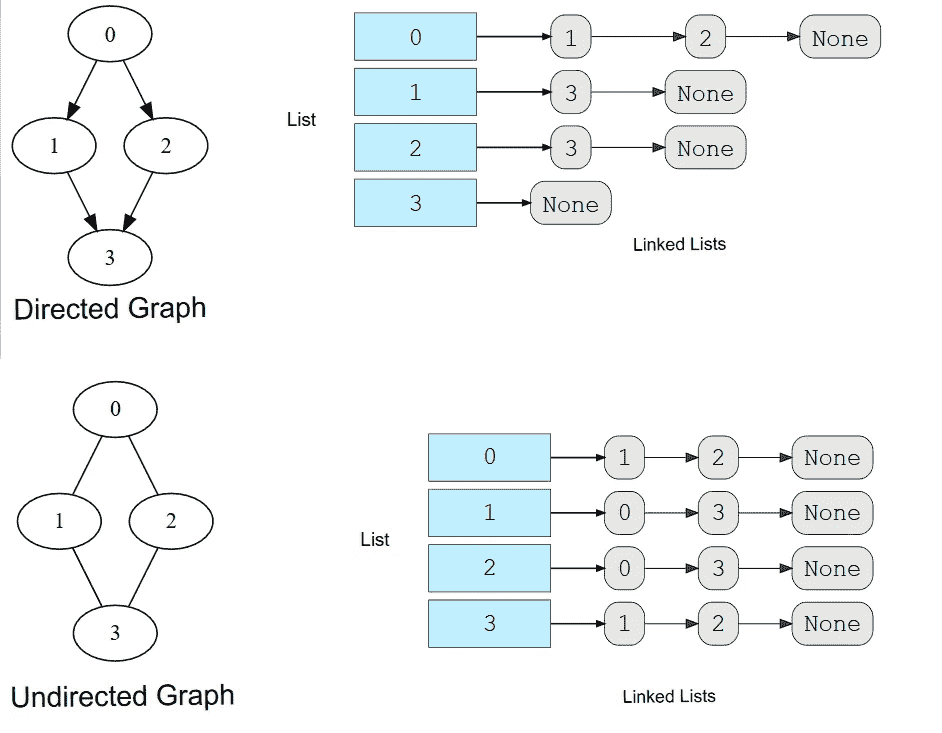
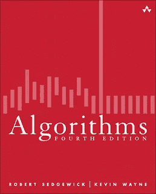
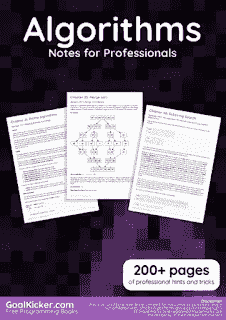
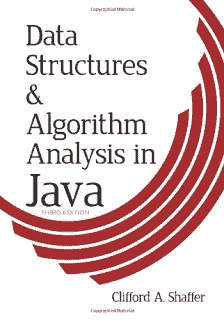
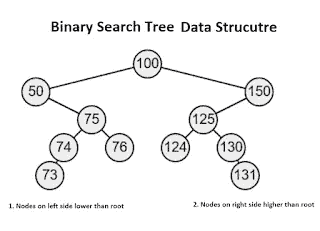
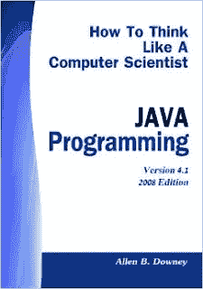

# 7 本免费书籍，学习 Java 中的数据结构和算法

> 原文：<https://medium.com/javarevisited/7-free-books-to-learn-data-structure-and-algorithms-in-java-346b2d70db10?source=collection_archive---------0----------------------->

image_credit —教育性

在[的上一篇文章](http://javarevisited.blogspot.com/2015/07/5-data-structure-and-algorithm-books-best-must-read.html)中，我已经分享了一些给程序员看的最好的数据结构和算法书籍，但这些都不是免费的。在那篇文章之后，我收到了一些反馈，关于如何分享免费的数据结构和算法书籍？很公平，每个人都喜欢免费电子书、[课程](/javarevisited/top-10-free-data-structure-and-algorithms-courses-for-beginners-best-of-lot-ad807cc55f7a)和 pdf，不是吗？

以前我分享过一个 [**免费 Java 编程书籍列表**](http://java67.blogspot.com/2013/11/10-free-java-programing-books-download-PDF-HTML.html)所以有了一些想法。我在网上做了更多的研究，也查看了我的收藏。

幸运的是，有几本很好的 [**数据结构和算法书籍**](/javarevisited/10-best-books-for-data-structure-and-algorithms-for-beginners-in-java-c-c-and-python-5e3d9b478eb1?source=collection_home---4------3-----------------------) 可以免费下载成 PDF 或者在线阅读，这就是我今天要和大家分享的内容。

在这个列表中，你会发现一些最好的数据结构和算法书籍是完全免费的，感谢它们的作者和出版媒体。

总的来说，[数据结构](/hackernoon/10-data-structure-algorithms-and-programming-courses-to-crack-any-coding-interview-e1c50b30b927)和[算法](/javarevisited/20-algorithms-coding-problems-to-crack-you-next-technical-interviews-23191f229788?source=extreme_sidebar---------0-2----------------------)对于任何程序员来说都是最重要的话题之一，不仅仅是从面试的角度，也是关于写好程序和解决问题。

一个好的数据结构选择可以降低算法的复杂度，可以显著提高你的应用程序的性能。

顺便说一句，如果你对提高你的算法技能感兴趣，你不应该只局限于免费的书籍，你也可以尝试一些[免费的算法课程](https://javarevisited.blogspot.com/2018/01/top-5-free-data-structure-and-algorithm-courses-java--c-programmers.html)，这将帮助你快速学习这个主题。在过去的几年里，我个人更喜欢从网上课程而不是书本中学习。这并不是说我放弃了书本，而是一旦我对我将要学习的技术有了一些想法，我通常会从书本开始，这很容易通过参加在线课程获得。

而且，如果你能在学习上花点钱，那么你应该总是去找最好的书或课程，比如 Udemy 上的 [**数据结构和算法:使用 Java**](https://click.linksynergy.com/fs-bin/click?id=JVFxdTr9V80&subid=0&offerid=323058.1&type=10&tmpid=14538&RD_PARM1=https%3A%2F%2Fwww.udemy.com%2Fdata-structures-and-algorithms-deep-dive-using-java%2F) 深入学习。它并不贵，因为大多数时候你只需花不到 10 美元就能买到，但无论你将学到什么，都会让你在职业生涯中受益多年。

 [## 数据结构和算法:使用 Java 进行深入研究

### 所以你已经掌握了 Java(或另一种面向对象编程语言)中数据结构和算法的基础知识，但是…

udemy.com](https://click.linksynergy.com/fs-bin/click?id=JVFxdTr9V80&subid=0&offerid=323058.1&type=10&tmpid=14538&RD_PARM1=https%3A%2F%2Fwww.udemy.com%2Fdata-structures-and-algorithms-deep-dive-using-java%2F) 

# Java 程序员的 7 本最佳免费数据结构和算法书籍

如果你在谷歌上搜索，你会发现大量与 Java 中的数据结构和算法相关的免费电子书，但并不是所有的都可以免费使用。这个列表包含作者和出版商为了社区利益而免费提供的书籍。据我所知，它们是完全合法的，但是如果你认为不是，告诉我，我会把它从列表中删除。

这里的许多数据结构和算法书籍可能不是最新的 Java 版本，但算法和数据结构是永不过时的概念。这些是基本概念，这就是为什么即使是旧的数据结构和算法书籍也是有用的。

## 1.算法，第四版

**作者**:罗伯特·塞奇威克和凯文·韦恩
**在线阅读**:[http://algs4.cs.princeton.edu/home/](http://algs4.cs.princeton.edu/home/)
**描述**:这是 Java 中最流行的数据结构和算法书籍之一。在这本书里，你会学到数据结构和算法基础、搜索、排序、图形和字符串。

这本书甚至被用于 Coursera 上的免费算法课程，如罗伯特·塞奇威克和凯文·韦恩的 [**算法第一部分**](http://bit.ly/algorithms-part1) 和 [**算法第二部分**](http://bit.ly/algorithms-part2) 。我强烈建议你在阅读这本书的同时加入这两门免费课程，从头开始学习 Java 中的数据结构和算法。

如果你发现 Coursera 的课程很有用，因为它们是由知名公司如谷歌、IBM 和世界上最好的大学创建的，我建议你加入 Coursera 的订阅计划

这种单一订阅让你可以无限制地访问他们最受欢迎的**课程**、**专业化**、**专业证书**和**指导项目**。它每年花费大约 399 美元，但是它完全值你的钱，因为你得到了无限的证书。

## 2.专业人员算法笔记

**作者**:编译自 stack overflow
下载:[https://goalkicker.com/AlgorithmsBook/](https://goalkicker.com/AlgorithmsBook/)
**描述**:这又是一本优秀的、免费的、200+页的学习数据结构和算法的电子书。

《专业人员算法笔记》一书是由 StackOverflow 文档汇编而成的，内容是由许多有经验和热情的程序员编写的，他们为 Stack Overflow 做出了贡献。

这本免费的电子书很全面，涵盖了你在一本好书里能找到的大部分内容，比如 [**【算法简介】**](http://www.amazon.com/dp/0072970545/?tag=javamysqlanta-20) 或者一门好课程，比如 [**算法和数据结构——第一部分和第二部分**](https://pluralsight.pxf.io/c/1193463/424552/7490?u=https%3A%2F%2Fwww.pluralsight.com%2Fcourses%2Fads-part1) 。

你不仅会学到数组、链表、二叉查找树、图等基本数据结构，还会学到几种搜索和排序算法，如[冒泡排序](http://www.java67.com/2012/12/bubble-sort-in-java-program-to-sort-integer-array-example.html)、[合并排序](https://www.java67.com/2018/03/mergesort-in-java-algorithm-example-and.html)、[插入排序](http://www.java67.com/2014/09/insertion-sort-in-java-with-example.html)、[桶排序](https://javarevisited.blogspot.com/2017/01/bucket-sort-in-java-with-example.html)、[快速排序](https://javarevisited.blogspot.com/2014/08/quicksort-sorting-algorithm-in-java-in-place-example.html)、[计数排序](https://www.java67.com/2017/06/counting-sort-in-java-example.html)、堆排序、循环排序、奇偶排序和选择排序。

它还涵盖了高级算法，如 Dijkstra 算法、Kruskal 算法、Prim 算法、Bellman-Ford 算法、Line 算法和 Floyd-Warshall 算法。

除此之外，你还会从访谈中了解到[动态规划](https://javarevisited.blogspot.com/2019/12/top-5-courses-to-learn-dynamic-programming-for-interivews.html)，贪婪算法，以及一些编码问题，如子串搜索，旅行商，背包问题，最长公共子序列，[变位串](http://javarevisited.blogspot.sg/2013/03/Anagram-how-to-check-if-two-string-are-anagrams-example-tutorial.html#axzz5F18OIWfY)，[帕斯卡三角形](http://www.java67.com/2016/06/how-to-print-pascal-triangle-in-java.html)等。总的来说，最好的，学习算法的免费书籍之一。

## 3.Java 结构:面向有原则的程序员的 Java 数据结构

作者:Duane A. Bailey
下载:[http://dept . cs . Williams . edu/~ Bailey/Java structures/book . html](http://dept.cs.williams.edu/~bailey/JavaStructures/Book.html)
简介:这是 Mcgraw-Hill 出版的另一本很好的 Java 数据结构和算法书籍，有 PDF 格式可供下载。这本书于 2007 年 9 月出版，所以有点过时了，但是正如我所说的，算法和数据结构是永恒的概念，所以你仍然可以用它来学习它们。它的平装本也可以在亚马逊上买到。

顺便说一句，如果你喜欢在线课程，我也建议你在 Udemy 上查看 [**轻松进阶数据结构**](http://bit.ly/introduction-to-data-structures) ，Udemy 是最好的学习数据结构和算法的免费课程之一，作者是 Google 的软件工程师、ACM-ICPC 世界决赛入围者 William Fiset。

## 4.Java 中的数据结构和算法分析

作者:Clifford A. Shaffer
下载:[http://people.cs.vt.edu/~shaffer/Book/](http://people.cs.vt.edu/~shaffer/Book/)简介:这是另一本学习数据结构和算法的免费书籍。它最后一次更新是在 2013 年，所以还是有点过时，但大多数概念仍然有效。

这本书最棒的地方在于它非常全面，涵盖了即使是最好的数据结构算法书籍也无法涵盖的主题，比如托马斯·h·科尔曼的 [**算法简介**](http://www.amazon.com/dp/0072970545/?tag=javamysqlanta-20) 。

无论如何，这本书也可以免费下载 PDF 格式，并且有 [C++](http://www.java67.com/2018/02/5-free-cpp-courses-to-learn-programming.html) 和 [Java](http://www.java67.com/2018/08/top-10-free-java-courses-for-beginners-experienced-developers.html) 两个版本。

还有，如果你更喜欢网络课程，也可以看看这个 [10 门免费算法课程的列表](http://www.java67.com/2019/02/top-10-free-algorithms-and-data.html)供程序员学习数据结构和算法。

## 5.Java 数据结构(第二版)

在线阅读:[http://www.theparticle.com/javadata2.html](http://www.theparticle.com/javadata2.html)
theparticle.com 的《Java 数据结构》是另一本免费的在线 Java 书籍。本文旨在向人们展示 Java 是多么简单，并澄清作者在之前版本中遗漏的一些东西。

本书涵盖了[数组](http://www.java67.com/2016/01/java-program-to-reverse-array-in-place.html)，向量，节点，[链表](https://javarevisited.blogspot.com/2017/07/top-10-linked-list-coding-questions-and.html)，[树](http://www.java67.com/2017/05/binary-tree-post-order-traversal-in-java-without-recursion.html)，[二分搜索法树](https://javarevisited.blogspot.com/2015/10/how-to-implement-binary-search-tree-in-java-example.html)，[树遍历](https://javarevisited.blogspot.com/2016/07/binary-tree-preorder-traversal-in-java-using-recursion-iteration-example.html)，优先级向量，以及 Java 编程语言中的其他高级数据结构。这又是一本有点过时的书，如果可以的话，我建议你像第一本书一样去找一本更新的书，或者去上免费的在线课程。你可以找到很多学习算法和数据结构的免费在线课程，这里是 Freecodecamp 上的另一个[免费数据结构课程](https://medium.freecodecamp.org/these-are-the-best-free-courses-to-learn-data-structures-and-algorithms-in-depth-4d52f0d6b35a)列表。

## 6.如何像计算机科学家一样思考 Java 版

作者:艾伦·b·唐尼
下载:[http://www.greenteapress.com/thinkapjava/](http://www.greenteapress.com/thinkapjava/)
简介:如何像计算机科学家一样思考 Java 版是一本学习编程的好书。这本书的目标是教你像计算机科学家一样思考。

如果你愿意，你也可以把这本书和哈佛著名的 [**CS50 的《计算机科学导论**](https://www.awin1.com/cread.php?awinmid=6798&awinaffid=631878&clickref=&p=%5B%5Bhttps%3A%2F%2Fwww.edx.org%2Fcourse%2Fcs50s-introduction-to-computer-science)——edX 团队提供的免费在线课程结合起来

全球超过 200 万名学习者从该课程中受益。

## 7.Java 中面向对象设计模式的数据结构和算法

作者:Bruno R. Preiss
在线阅读:[http://www.brpreiss.com/books/opus5/](http://www.brpreiss.com/books/opus5/)简介:这本书不提供 PDF 下载，但你可以免费在线阅读。这本书的 C++版也有平装本和网络版。

本书涵盖了算法分析、基本数据结构、数据类型和抽象、[栈](http://javarevisited.blogspot.com/2013/03/top-15-data-structures-algorithm-interview-questions-answers-java-programming.html)、[队列](http://javarevisited.blogspot.com/2013/10/what-is-priorityqueue-data-structure-java-example-tutorial.html)和 Deque、列表排序、树、[二叉查找树](https://javarevisited.blogspot.com/2017/04/recursive-binary-search-algorithm-in-java-example.html)、哈希、[哈希表](http://www.java67.com/2013/08/ata-structures-in-java-programming-array-linked-list-map-set-stack-queue.html)以及其他几种 Java 数据结构。

这就是 Java 中免费数据结构和算法书籍的列表。你可以看到有很多免费的电子书可以下载成 PDF 格式或者供在线读者阅读。

不幸的是，大多数书都有点旧，可能不适合每个人，尤其是初学者。对于这些，我建议坚持阅读前两本书，这两本书都是最新的，足够全面，可以教你基本的算法和数据结构。如果你感兴趣，你也可以看看下面的资源来进一步提高你的算法和编码技能。

**进一步学习**
[数据结构和算法:深度学习使用 Java](https://click.linksynergy.com/fs-bin/click?id=JVFxdTr9V80&subid=0&offerid=323058.1&type=10&tmpid=14538&RD_PARM1=https%3A%2F%2Fwww.udemy.com%2Fdata-structures-and-algorithms-deep-dive-using-java%2F)
[算法和数据结构—第一、二部分](https://pluralsight.pxf.io/c/1193463/424552/7490?u=https%3A%2F%2Fwww.pluralsight.com%2Fcourses%2Fads-part1)
[Java 中的数据结构:面试复习](https://www.educative.io/collection/5642554087309312/5724822843686912?affiliate_id=5073518643380224)

其他**数据结构和算法**文章您可能喜欢

*   来自访谈的 100+数据结构编码问题([问题](http://www.java67.com/2018/06/data-structure-and-algorithm-interview-questions-programmers.html))
*   如何用 Java 实现一个没有递归的快速排序算法？([解](https://javarevisited.blogspot.com/2016/09/iterative-quicksort-example-in-java-without-recursion.html)
*   计数排序和桶排序算法的区别？([回答](https://javarevisited.blogspot.com/2017/06/difference-between-stable-and-unstable-algorithm.html))
*   如何在 Java 中从数组中移除一个元素？([解](http://java67.blogspot.com/2012/12/how-to-remove-element-from-array-in-java-example.html))
*   深入学习数据结构的一些免费课程( [Dzone](https://dzone.com/articles/5-free-courses-to-learn-data-structure-and-algorit) )
*   每个程序员都应该阅读的 10 本算法书([书](http://www.java67.com/2015/09/top-10-algorithm-books-every-programmer-read-learn.html))
*   来自访谈的 50 多个数据结构和算法问题([问题](https://hackernoon.com/50-data-structure-and-algorithms-interview-questions-for-programmers-b4b1ac61f5b0))
*   如何找到一个数组中所有和等于 k 的对([解](http://javarevisited.blogspot.com/2014/08/how-to-find-all-pairs-in-array-of-integers-whose-sum-equal-given-number-java.html))
*   如何在 Java 中删除数组中的重复项？([解](http://javarevisited.blogspot.com/2014/01/how-to-remove-duplicates-from-array-java-without-collection-API.html))
*   如何在 Java 中原地反转数组？([解](http://www.java67.com/2016/01/java-program-to-reverse-array-in-place.html))
*   快速排序和计数排序算法的区别？([回答](https://javarevisited.blogspot.com/2017/02/difference-between-comparison-quicksort-and-non-comparison-counting-sort-algorithms.html))
*   快速排序和合并排序算法的区别？(回答)
*   如何从包含 1 到 100 的数组中找出缺失值？([解](https://javarevisited.blogspot.com/2018/04/how-to-find-k-missing-numbers-in-array-java.html))
*   Java 中如何统计给定二叉树的叶节点数？([解](https://javarevisited.blogspot.com/2016/12/how-to-count-number-of-leaf-nodes-in-java-recursive-iterative-algorithm.html)
*   如何在 Java 中从一个未排序的数组中找到重复项？([解](http://java67.blogspot.com/2015/10/2-ways-to-find-duplicate-elements-in-java-array.html)
*   递归有序遍历算法([解](http://www.java67.com/2016/09/inorder-traversal-of-binary-tree-java-example.html))
*   面试 10 门数据结构与算法课程([课程](https://hackernoon.com/10-data-structure-algorithms-and-programming-courses-to-crack-any-coding-interview-e1c50b30b927))

感谢您阅读本文。如果你喜欢这些学习数据结构和算法的免费书籍，请分享给你的朋友和同事。如果您有任何问题或反馈，请留言。

**附言——**如果你更喜欢在线课程而不是书籍，或者你想将这些书籍与一些免费的在线课程结合起来，那么你也可以查看一下[**Java 数据结构 for Noobs**](http://bit.ly/2hhloDL)——一门免费的 Udemy 课程。你只需要一个免费的 Udemy 帐户就可以参加这个课程。

 [## 免费数据结构教程——面向 Noobs 的 Java 数据结构(精简版)

### 本课程将向您介绍以下数据结构单链表双链表，那么为什么还要…

bit.ly](http://bit.ly/2hhloDL) 

**P. P. S —** 快速更新，[**Pluralsight 免费周末**](/javarevisited/pluralsight-free-weekend-2020-3e0ff26e7a31) 就在这里，你可以在这个周末免费访问所有 7000+ Pluralsight 课程和项目。好好利用这一点，学习一项新技能或提升现有技能。不要错过这个，这只是这个周末。这又是一个链接:

 [## Pluralsight |免费周末

### 注册以获得免费周末开始时的通知，这样你就不会错过了。免费周末从 8 月 14 日星期五上午 9 点开始…

pluralsight.pxf.io](https://pluralsight.pxf.io/c/1193463/871467/7490)