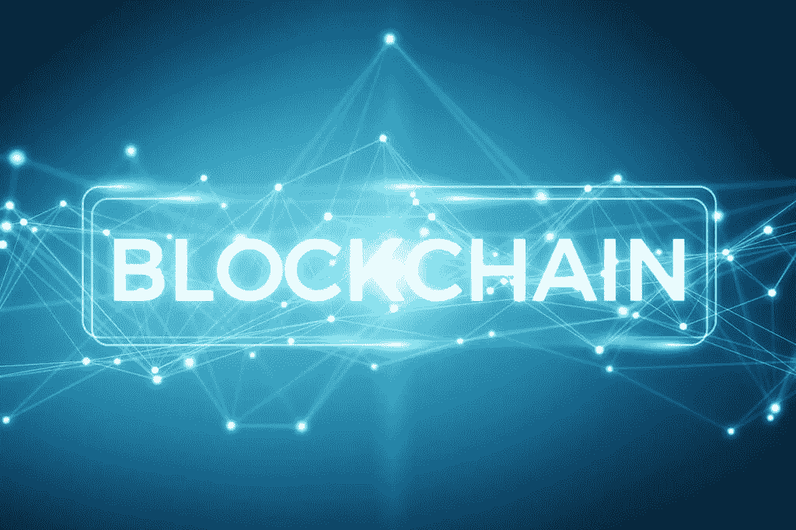
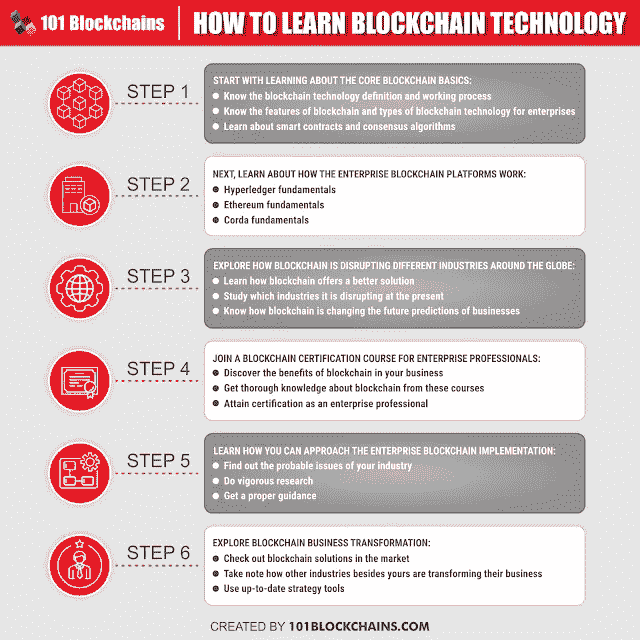
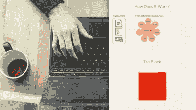
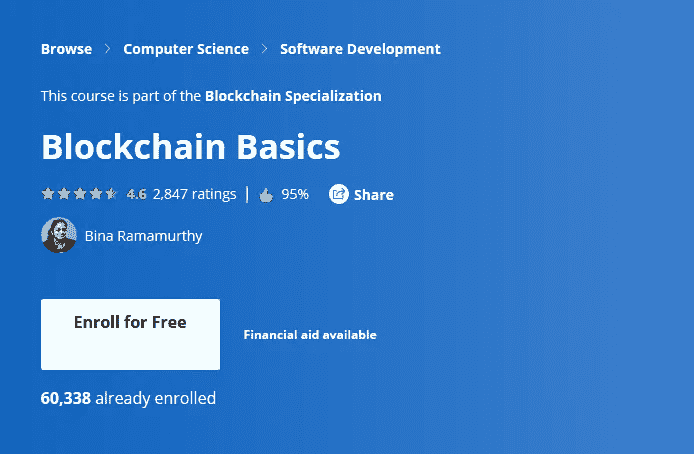
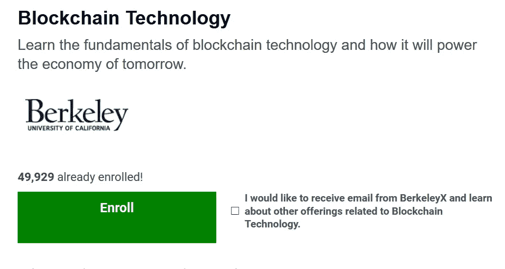
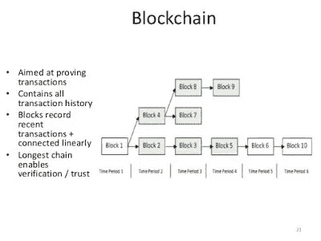

# 2023 年学习区块链开发的 8 门最佳免费课程

> 原文：<https://medium.com/javarevisited/7-free-courses-to-learn-blockchain-in-2020-764e66b47ebe?source=collection_archive---------0----------------------->

## 从 edX、Coursera、Udemy 和 Pluralsight 学习区块链技术的免费在线课程

伙计们，你们好吗？希望你们都过得愉快，并朝着今年的目标努力。如果你想学习区块链和以太坊开发，并寻找最好的资源，如在线培训课程和认证，那么你来对地方了。

此前，我已经分享了 [**最佳区块链开发课程**](/javarevisited/best-blockchain-courses-and-certification-in-2020-63729f8f04d0) ，在这篇文章中，我将分享从零开始学习区块链开发的最佳免费课程。

这些免费课程对你开始区块链职业生涯很有帮助，它们是由 Udemy、Pluralsight、Coursera 和 101 区块链(一个专门的区块链学习平台)等网站策划的。

我一直在这个博客里分享很多关于今年该学什么的课程和教程，从[工具](http://javarevisited.blogspot.sg/2018/01/10-unit-testing-and-integration-tools-for-java-programmers.html)开始到[框架](http://www.java67.com/2018/01/top-10-web-mobile-and-big-data-framework-libraries-technologies-programmers-should-learn-in-2018.html)，从[库](http://javarevisited.blogspot.sg/2018/01/top-20-libraries-and-apis-for-java-programmers.html)到[编程语言](http://www.java67.com/2017/12/10-programming-languages-to-learn-in.html)，但是最重要的一项技术，你今年可以学的就是**区块链技术**。

这是目前谈论最多的技术之一，被认为是继互联网发明之后的下一件大事，因为它们提供了一种在互联网上获得数字信任的方法。

尽管如此，我必须说，加密货币的疯狂反弹在区块链流行方面发挥了巨大作用。我很早就知道比特币，但从未投资过，区块链也是如此。

即使我知道它，我也从未想过学习区块链开发并撰写相关教程，直到我意识到这可能是学习区块链的时候了。

人们非常重视区块链的发展，因为来自金融、房地产、医疗保健和其他行业的公司都非常渴望了解区块链并采用它们。

风险投资家目前正在将大量投资转向资助基于区块链的公司，这意味着今年是学习区块链的最佳时机，也是从 [**免费在线课程**](http://www.java67.com/search/label/free%20resources?&max-results=3) **开始的最佳方式。**

在这篇文章中，我将分享 5 门免费的区块链技术课程，这些课程将教你区块链的基础知识，它是如何工作的，以及它可以有多大的颠覆性。如果你想成为区块链开发者，那么这些课程将帮助你快速入门。

# 2023 年学习区块链开发的 8 门最佳免费在线课程

这里是我列出的一些学习区块链技术以及如何使用它们的免费课程。

这些课程不仅会教你什么是区块链及其工作原理等基础知识，还会向你展示如何创建智能合同和你自己的私人网络。

该列表还包括一门使用以太网编写 HelloWorld 程序的课程。

## [**1。区块链理论 101**](https://click.linksynergy.com/fs-bin/click?id=JVFxdTr9V80&subid=0&offerid=323058.1&type=10&tmpid=14538&RD_PARM1=https%3A%2F%2Fwww.udemy.com%2Fblockchain-theory-101%2F)

这是一门关于区块链的非常棒的入门课程，任何想了解区块链技术的人都可以免费参加这门课程。

在本课程中，您将了解区块链技术(包括采矿、共识算法、智能财产和智能合同)。

讲师 Melanie Swan 还是一本已出版书籍[区块链:新经济蓝图](https://www.amazon.com/Blockchain-Blueprint-Economy-Melanie-Swan/dp/1491920491?tag=javamysqlanta-20) 的作者，这意味着她对区块链有很好的了解。

区块链技术的现状，在金融服务、物流、医疗保健、能源和物联网领域的潜在应用，以及在贵组织中部署的下一步措施。

**这里是免费报名的链接—** [**区块链理论 101**](https://click.linksynergy.com/fs-bin/click?id=JVFxdTr9V80&subid=0&offerid=323058.1&type=10&tmpid=14538&RD_PARM1=https%3A%2F%2Fwww.udemy.com%2Fblockchain-theory-101%2F)

## 2.[企业区块链基础](http://shrsl.com/34mvm)【免费区块链速成班】

这是另一个从商业和真实世界使用角度学习区块链的免费课程。在这个关于企业区块链的免费课程中，您将了解区块链如何影响商业，以及来自企业从业者采访和研究的几个真实例子。

这个免费的区块链速成班结构非常好，就像每天一节课，连续 5 天，每天 15 分钟。区块链 101 课程也受到 IBM、凯捷、思科、Cognizant 和 Wipro 等雇主的推崇。

如果你想加入区块链革命并获得有价值的知识，帮助你推进你的职业生涯，那么这门课程是重要的第一步，你应该毫不犹豫地加入它。无论如何，这是免费的，所以你不会有任何损失，但你会学到一项需求技能，以促进你的职业发展。

**这里是免费报名的链接—** [企业区块链基础](http://shrsl.com/34mvm)

顺便说一句，如果你正在寻找一个受欢迎的区块链认证，以启动你在分布式平台技术方面的职业生涯，那么我强烈推荐 [**【企业区块链专业认证(CEBP)**](https://www.shareasale.com/r.cfm?b=1713885&u=880419&m=105464&urllink=&afftrack=) **by 101 区块链**。

它受到 IBM、凯捷、思科、Cognizant 和 Wipro 等公司的信任。它有点贵，大约 357 美元，但很值得，由于目前的全球形势，他们现在也提供折扣。您可以使用我的代码 **BCHAIN30** 获得 **30%的折扣**。

## [3。区块链基础知识](http://pluralsight.pxf.io/c/1193463/424552/7490?u=https%3A%2F%2Fwww.pluralsight.com%2Fcourses%2Fblockchain-fundamentals)

这是一门非常棒的课程，可以从 Pluralsight 了解区块链基础知识和智能合同开发

在本课程中，您将首先学习以太坊区块链、智能合同开发以及如何创建私人区块链。

本课程也非常实用，因为您将学习如何从一个干净的 Microsoft Windows 映像设置开发环境和所有先决条件，这也使得学习本课程变得很容易。

**这里是免费报名的链接—** [区块链基础](http://pluralsight.pxf.io/c/1193463/424552/7490?u=https%3A%2F%2Fwww.pluralsight.com%2Fcourses%2Fblockchain-fundamentals)

学习完基础知识后，您将创建一个功能齐全的示例应用程序。您的示例应用程序是一个分布式应用程序，它使用区块链技术确保批量食品的安全可靠的产品生命周期跟踪。

学完本课程后，您应该能够使用功能开发环境创建自己的区块链合同和分布式应用程序，这将使您在未来的几年中保持高效。

## 4.[Coursera 区块链基础知识](https://coursera.pxf.io/c/3294490/1164545/14726?u=https%3A%2F%2Fwww.coursera.org%2Flearn%2Fblockchain-basics)【免费课程】

这是 Coursera 上最受欢迎的学习区块链基础知识的课程之一。它实际上是 [*区块链专业化*](https://coursera.pxf.io/c/3294490/1164545/14726?u=https%3A%2F%2Fwww.coursera.org%2Fspecializations%2Fblockchain) 的第一门课程，提供了区块链技术基本概念的广泛概述。

在水牛城大学和纽约州立大学提供的免费区块链课程中，您将了解去中心化的点对点网络、不可变的分布式账本以及定义区块链的信任模型。

本课程将向您介绍区块链的基本组件(事务、块、块头和链)及其操作(验证、确认和共识模型)、底层算法和信任要素(硬分叉和软分叉)。

内容包括区块链编程不可或缺的散列和加密基础，这是两个后续专业课程智能合同和分散应用程序(Dapps)的重点。

**这里是免费注册的链接—**[Coursera 的区块链基础知识](https://coursera.pxf.io/c/3294490/1164545/14726?u=https%3A%2F%2Fwww.coursera.org%2Flearn%2Fblockchain-basics)

顺便说一句，如果你觉得 Coursera 的课程有用，因为它们是由知名公司如**谷歌**、 **IBM** 、**亚马逊**和世界上最好的大学创建的，我建议你加入 Coursera 的年度订阅计划 [**Coursera Plus**](https://coursera.pxf.io/c/3294490/1164545/14726?u=https%3A%2F%2Fwww.coursera.org%2Fcourseraplus) 。

这种单次订阅可以让你无限制地访问他们最受欢迎的**课程**、**专业**、**专业证书**和**指导项目**。它每年花费大约 399 美元，但是它完全物有所值，因为你可以获得无限证书。

## 5.[以太坊开发课程——伯克利区块链](https://click.linksynergy.com/deeplink?id=JVFxdTr9V80&mid=39197&murl=https%3A%2F%2Fwww.udemy.com%2Fcourse%2Fethereum-development-course-blockchain-at-berkeley%2F)

这是一门很好的实用课程，以以太坊区块链开发开始您的旅程，在这里您将学习如何立即创建一个 Hello World 区块链应用程序。

本课程是为程序员设计的，他们开始了以太坊区块链开发之旅，并希望在继续学习涵盖更多内容的更高级以太坊开发课程之前，通过一个基本的实际项目来测试他们的技能。

**这里是免费报名的链接—** [以太坊开发课程—伯克利区块链](https://click.linksynergy.com/deeplink?id=JVFxdTr9V80&mid=39197&murl=https%3A%2F%2Fwww.udemy.com%2Fcourse%2Fethereum-development-course-blockchain-at-berkeley%2F)

如果你想了解更多关于 Etherium 的知识，你还可以参加一个更全面的课程，如来自 101 区块链的 [**以太坊开发基础**](http://shrsl.com/349rf) ，这是一个专门的培训门户，提供与区块链相关的一切。这个课程非常详细地讲授以太坊的发展。

这有点贵，你需要支付 199 美元才能进入课程，但你也可以使用我的代码 BCHAIN30 获得 30%的折扣。

无论你是工程师、开发人员还是建筑师，如果你想打开区块链职业发展道路的大门，本课程将帮助你掌握基本知识。

如果你对以太坊网络开发更感兴趣，那么我强烈建议你去看看这个很棒的[以太坊开发课程](https://javarevisited.blogspot.com/2021/11/top-5-courses-to-learn-ethereum-for.html)。

## 6。 [**区块链—原理与实践**](http://pluralsight.pxf.io/c/1193463/424552/7490?u=https%3A%2F%2Fwww.pluralsight.com%2Fcourses%2Fblockchain-principles-practices)

这是 Pluralsight 的另一个关于区块链的精彩课程，概述了这项技术如何与比特币和以太坊或其他提供商合作。

在本课程中，您将从用于构建典型区块链的基本数据结构和算法开始，并在课程中构建一个工作示例。

首先，您将学习如何在一个块中存储单个事务，稍后，您将发现如何使用 Merkle 树在一个块中存储多个事务。

**这里是免费报名的链接—** [区块链—原理与实践](http://pluralsight.pxf.io/c/1193463/424552/7490?u=https%3A%2F%2Fwww.pluralsight.com%2Fcourses%2Fblockchain-principles-practices)

之后会教你如何使用挖掘和工作证明让区块链防篡改。最后，您将了解区块链上的节点如何保持共识。

完成本课程后，您将拥有构建自己的区块链所必需的知识和工具。

顺便说一句，这些[的观光课程](http://javarevisited.blogspot.sg/2017/12/top-10-pluralsight-courses-java-and-web-developers.html#axzz53viuJDer)并不完全免费。你将需要一个 [**Pluralsight 会员资格** p](https://pluralsight.pxf.io/c/1193463/424552/7490?u=https%3A%2F%2Fwww.pluralsight.com%2Flearn) 才能进入这门课程，费用约为每月 29 美元，一年 299 美元(14%的折扣)。

如果你能负担得起，那么这是一个伟大的投资，因为你可以获得 5000 多门最新技术的课程，但如果你不能，不要失望。你仍然可以通过报名参加为期 10 天的免费试听来免费学习这门课程。

<https://pluralsight.pxf.io/c/1193463/424552/7490?u=https%3A%2F%2Fwww.pluralsight.com%2Fpricing>  

## [7。edX 的区块链技术](https://www.awin1.com/cread.php?awinmid=6798&awinaffid=631878&clickref=&p=%5B%5Bhttps%3A%2F%2Fwww.edx.org%2Fcourse%2Fblockchain-technology)

这是一个在 [edX](https://www.awin1.com/cread.php?awinmid=6798&awinaffid=631878&ued=https%3A%2F%2Fwww.edx.org%2F) 上学习区块链技术的很棒的免费课程。它是由伯克利的区块链和加州大学伯克利分校首要计算机科学系的教师开发的，该课程提供了与比特币和区块链技术基础相关的许多主题的广泛概述。

你将学习分布式共识的正式定义和基本主题，如 CAP 定理和拜占庭将军问题。

您还将探索各种企业级区块链实现，如 JP Morgan 的 Quorum、Ripple、Tendermint 和 [HyperLedger](https://javarevisited.blogspot.com/2022/02/top-5-courses-to-learn-hyperledger-blockchain.html) ，包括区块链、ico 的行业用例，以及围绕区块链的日益增多的法规。

**这里是免费报名的链接—**[edX 的区块链技术](https://www.awin1.com/cread.php?awinmid=6798&awinaffid=631878&clickref=&p=%5B%5Bhttps%3A%2F%2Fwww.edx.org%2Fcourse%2Fblockchain-technology)

与其他 Coursera 和 edX 课程一样，本课程也是免费学习，如果需要认证证书，则需要付费。

## [**8。加密货币和区块链简介**](https://click.linksynergy.com/fs-bin/click?id=JVFxdTr9V80&subid=0&offerid=323058.1&type=10&tmpid=14538&RD_PARM1=https%3A%2F%2Fwww.udemy.com%2Fintroduction-to-cryptocurrencies%2F)

对于那些对比特币和其他加密货币的名字感到兴奋的人来说，这门课程更有趣。这没什么不对的。我们大多数人只是因为那些[加密货币](https://javarevisited.blogspot.com/2022/01/5-best-courses-to-learn-cryptocurrency.html)及其惊人的崛起才开始了解区块链。

本课程将通过首先解释加密货币来教你区块链，这将帮助你更好地理解区块链本身的工作原理以及它与交易的传统模式有何不同。

**这里是免费报名的链接—** [加密货币和区块链介绍](https://click.linksynergy.com/fs-bin/click?id=JVFxdTr9V80&subid=0&offerid=323058.1&type=10&tmpid=14538&RD_PARM1=https%3A%2F%2Fwww.udemy.com%2Fintroduction-to-cryptocurrencies%2F)

以上就是学习区块链技术的一些**免费课程。正如我告诉你的，区块链开发正受到很多关注，因为它具有颠覆性的潜力。**

它还没有产生很多就业机会，但你现在可以通过学习区块链来保持领先地位。

除了程序员和开发人员，这些课程对于任何想知道什么是区块链以及它如何工作的人来说也很棒，比如商业分析师、技术极客、项目经理和 QA。

您可能想探索的其他免费在线课程

*   面向 Web 开发人员的 15 门 Docker、Kubernetes 和 AWS 课程
*   [网络开发者可以学习的 10 个 JavaScript 框架](/javarevisited/10-of-the-most-popular-javascript-frameworks-libraries-for-web-development-in-2019-a2c8cea68094)
*   [学习网页开发的五大课程](/better-programming/my-5-favorite-courses-to-learn-web-development-in-2019-a5e74167f8b2)
*   [我最喜欢的学习 HTML 和 CSS 的免费课程](/javarevisited/5-free-html-and-css-courses-to-learn-front-end-web-development-online-8b04517c6ecb?source=collection_home---4------0-----------------------)
*   [面向前端开发者的 5 门免费 Docker 课程](/javarevisited/top-5-free-courses-to-learn-docker-for-beginners-best-of-lot-b2b1ad2b98ad)
*   [初学者学习 SQL 和数据库的 7 门免费课程](/javarevisited/7-free-courses-to-learn-database-and-sql-for-programmers-and-data-scientist-e7ae19514ed2)
*   [完整的 React.js 开发者路线图](/javarevisited/the-2019-react-js-developer-roadmap-9a8e290b8a56)
*   [2023 年学习角的 10 本书和课程](/javarevisited/top-10-angular-books-and-courses-for-beginners-and-experienced-web-developers-best-of-lot-9a2dae87f04c)
*   [面向 Java 开发人员的 10 门高级 Spring Boot 课程](/javarevisited/10-advanced-spring-boot-courses-for-experienced-java-developers-5e57606816bd)
*   [2023 年学习 Spring Boot 的 10 门免费课程](/javarevisited/10-free-spring-boot-tutorials-and-courses-for-java-developers-53dfe084587e)
*   [跟 Spring Boot 学 Java 微服务的 7 门课程](/javarevisited/top-5-courses-to-learn-microservices-in-java-and-spring-framework-e9fed1ba804d?source=collection_home---4------2-----------------------)
*   [我最喜欢学习 Spring Boot 的课程](/javarevisited/top-10-courses-to-learn-spring-boot-in-2020-best-of-lot-6ffce88a1b6e)
*   [我最喜欢的免费 JavaScript 初学者教程](/javarevisited/my-favorite-free-tutorials-and-courses-to-learn-javascript-8f4d0a71faf2)

感谢您阅读本文。如果你喜欢这些免费的区块链课程，请与你的朋友和同事分享。如果您有任何问题或反馈，请留言。

**p . s .**——如果你只是想追求一门课程，那么你也可以看看更全面的 [**区块链 A-Z:学习如何建立你的第一个区块链**](http://bit.ly/2F70NeE) 是最好的开始课程。

<http://bit.ly/2F70NeE>  

**P.P.S.** —如果你正在寻找一个区块链认证来启动你在分布式平台技术方面的职业生涯，那么我强烈推荐 [**企业区块链专业认证**](https://www.shareasale.com/r.cfm?b=1713885&u=880419&m=105464&urllink=&afftrack=) 。他们现在也在打折。您可以使用代码 **BCHAIN20** 获得 **30%的折扣**。