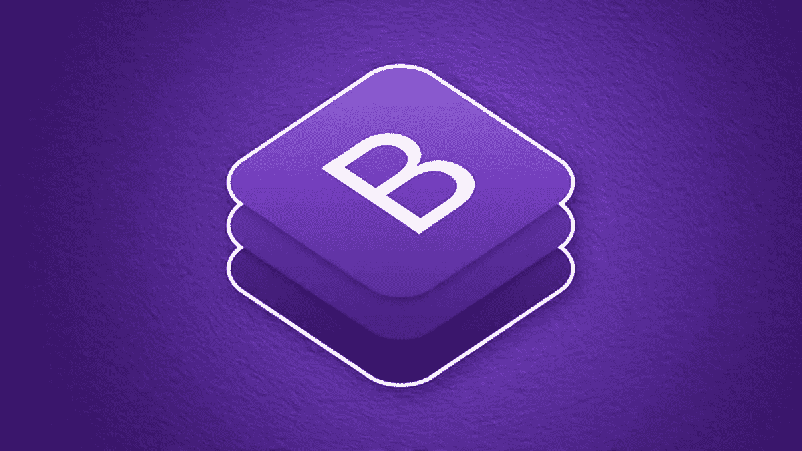
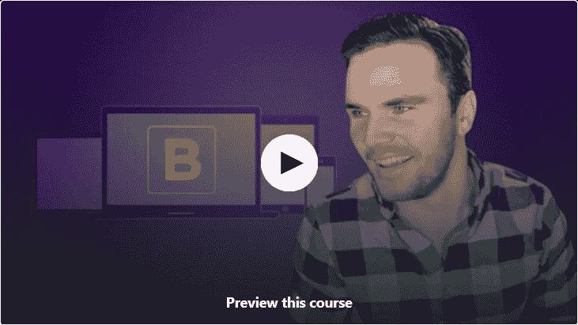
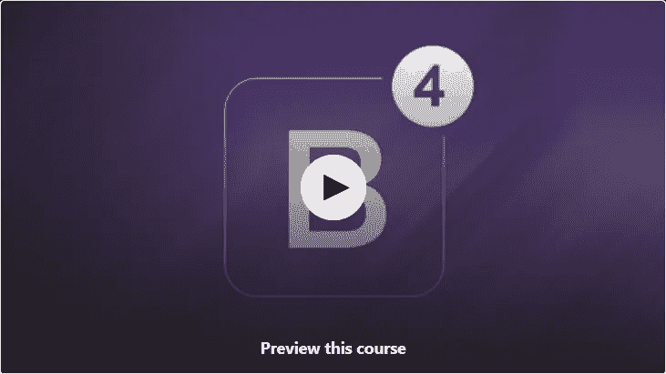
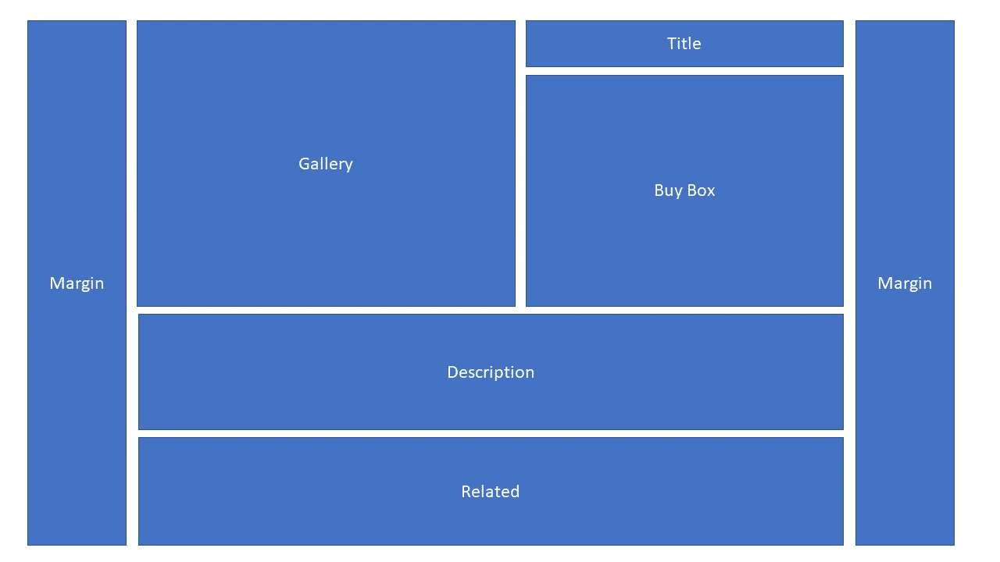
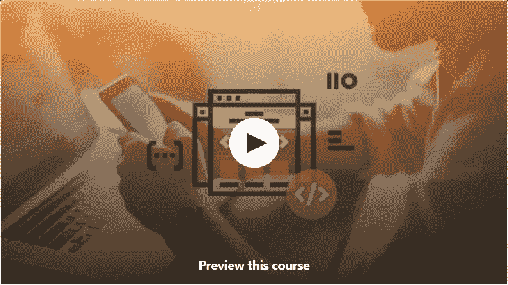
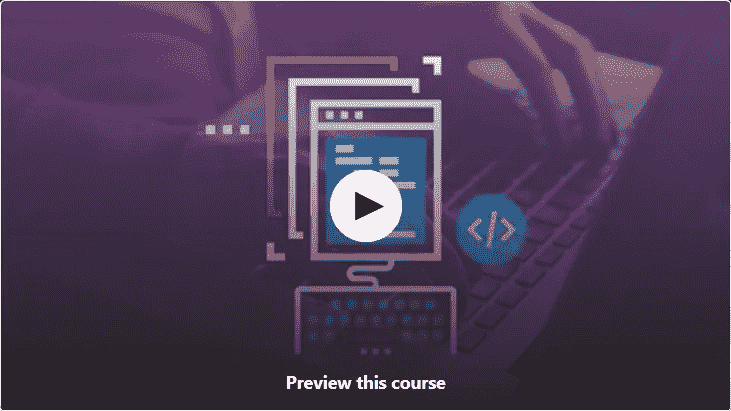

# 2023 年为网页设计师和开发者提供 7 门免费学习 Bootstrap 的课程

> 原文：<https://medium.com/javarevisited/7-free-courses-to-learn-bootstrap-for-web-designers-and-developers-5135215648f1?source=collection_archive---------0----------------------->

## 使用这些免费课程学习引导 CSS 框架，为你的简历添加一项受欢迎的技能

大家好，你可能知道 Bootstrap 是最受欢迎的前端库之一，它提供了一个可定制的模板 [HTML](http://www.java67.com/2018/02/5-free-html-and-css-courses-to-learn-web-development.html) 、 [CSS](https://javarevisited.blogspot.com/2018/02/top-5-online-courses-to-learn-web-development.html) 和 [JS](http://www.java67.com/2018/04/top-5-free-javascript-courses-to-learn.html) ，用于创建一个现代化的、响应迅速的网站。

这些天你看到的所有漂亮的网站都是使用 [Bootstrap](https://getbootstrap.com/) 构建的，有大字体和光滑的表单域。如果你想学习 Bootstrap 并寻找一些优秀的在线课程，那么你来对地方了。

在这篇文章中，我将分享一些优秀的**免费 Bootstrap 课程**，它们也完全在线，你可以使用它们来启动你的 Bootstrap 框架之旅。如果你对[现代网络开发](https://dev.to/javinpaul/top-6-courses-to-learn-web-development-best-of-lot-2fae)感兴趣，这是你今年必须学习的框架。

我之前说过，web 开发是一门重要的技能，前端开发是 web 开发不可或缺的一部分。传统上，程序员与后端一起工作，创建驱动前端的服务器，GUI 设计师负责创建[前端 GUI，](https://javarevisited.blogspot.com/2020/06/top-5-courses-to-learn-ux-design-in.html)但是事情已经发生了很大的变化。

如今，每个人都需要一个能够同时处理前端和后端的[全栈工程师](/javarevisited/top-10-frameworks-full-stack-java-developers-can-learn-in-2020-5995021401e5)，这意味着你不仅需要学习后端框架，如 [Spring](http://www.java67.com/2017/11/top-5-free-core-spring-mvc-courses-learn-online.html) 和 [Spring Boot](https://javarevisited.blogspot.com/2018/11/top-5-spring-boot-features-java.html#axzz5YFjHrt5j) (针对 Java 开发人员)，还需要学习前端框架，如 Bootstrap。

在我们开始学习 Bootstrap 的这些在线课程之前，我先给大家讲一点 Bootstrap 框架的历史。它来自流行的社交媒体网站之一 Twitter。Twitter 的马克·奥托和雅各布·桑顿最初将其命名为 Twitter 蓝图和开发，作为鼓励内部工具一致性的框架。但是，在成功之后，它从 Twitter Blueprint 更名为 Bootstrap，并于 2011 年 8 月 19 日作为开源项目发布。如果你不介意花几块钱学习一些有用的技能，比如引导程序和网站设计，那么我也建议你在 Udemy 上查看一下由 Brad Traversy[主持的包含 5 个项目的](https://medium.com/u/861216ad5921?source=post_page-----5135215648f1--------------------------------) 的 [**引导程序 4。对于任何想要学习 Bootstrap 的初学者来说，这是一个极好的资源，因为您将通过创建实际的项目来学习。**](https://click.linksynergy.com/deeplink?id=JVFxdTr9V80&mid=39197&murl=https%3A%2F%2Fwww.udemy.com%2Fcourse%2Fbootstrap-4-from-scratch-with-5-projects%2F)

 [## 成为 Bootstrap 4 Boss:现代前端开发

### 本课程将带您从对 Bootstrap 3 或 Bootstrap 4 一无所知到了解所有实用程序…

udemy.com](https://click.linksynergy.com/deeplink?id=JVFxdTr9V80&mid=39197&murl=https%3A%2F%2Fwww.udemy.com%2Fcourse%2Fbootstrap-4-from-scratch-with-5-projects%2F) 

# 2023 年学习 Bootstrap 框架的 7 门最佳免费课程

下面是我列出的一些从头开始学习 Twitter Bootstrap 框架的最佳课程。*这些课程是* [*免费*](/javarevisited/top-20-sites-to-learn-coding-in-2020-f57ff63d9cb3) ，但不代表质量差。事实上，有些课程比其他付费课程更好。他们只是出于宣传和教育的原因，由他们的导师免费提供。

## 1. [Bootstrap 4 快速入门:编写现代响应网站](https://click.linksynergy.com/fs-bin/click?id=JVFxdTr9V80&subid=0&offerid=634352.1&type=10&tmpid=14538&RD_PARM1=https%3A%2F%2Fwww.udemy.com%2Fbootstrap-4%2F)

这是 2023 年学习 Bootstrap 4 最好的免费课程之一。它既全面又实用，观看起来也很刺激。讲师 Brad Hussey 很好地解释了如何在 Bootstrap 4 中创建响应式网站。您将首先从下载和安装 Bootstrap 开始，然后建立一个高效的网站工作流程。

之后，你将学习如何创建一个必不可少的、响应式的网站，如何使用 Bootstrap 模板，如何创建一个新的启动登陆页面，以及在你的项目中使用 Saas。简而言之，这是一个免费的快速学习 Bootstrap 的完美课程。

**这是加入本课程的链接** — [Bootstrap 4 快速入门:编写现代响应网站](https://click.linksynergy.com/fs-bin/click?id=JVFxdTr9V80&subid=0&offerid=634352.1&type=10&tmpid=14538&RD_PARM1=https%3A%2F%2Fwww.udemy.com%2Fbootstrap-4%2F)

## 2.[完成 Bootstrap 4 课程—构建 3 个项目](https://click.linksynergy.com/fs-bin/click?id=JVFxdTr9V80&subid=0&offerid=634352.1&type=10&tmpid=14538&RD_PARM1=https%3A%2F%2Fwww.udemy.com%2Fbootstrap-4-tutorials%2F)

这是学习 Bootstrap 框架的综合课程之一。它包含 5 个小时的内容，分为 36 节课。

你将首先从 Bootstrap 基础开始，慢慢地，你将开始*构建项目以应用你在课程中所学的*知识。您将构建不止一个而是三个项目。您不仅将学习如何安装 Bootstrap 和设置您的开发环境，还将学习 Bootstrap 导航、Flexbox 网格、容器和其他重要概念。

这个 **5 个小时的课程**得到了超过**67037 名学生**的信任，这充分说明了它的质量。如果你需要一个实践课程来学习 Bootstrap，这可能是最好的开始课程。简而言之，这是一门免费学习和掌握 Bootstrap 的完美课程。

**这里是加入本课程的链接** — [完成引导 4 课程—构建 3 个项目](https://click.linksynergy.com/fs-bin/click?id=JVFxdTr9V80&subid=0&offerid=634352.1&type=10&tmpid=14538&RD_PARM1=https%3A%2F%2Fwww.udemy.com%2Fbootstrap-4-tutorials%2F)

## 3.[通过示例学习 Bootstrap 4](https://click.linksynergy.com/fs-bin/click?id=JVFxdTr9V80&subid=0&offerid=634352.1&type=10&tmpid=14538&RD_PARM1=https%3A%2F%2Fwww.udemy.com%2Flearn-bootstrap-4-by-example%2F)

顾名思义，这是一门学习 Bootstrap 框架的经典动手课程。

在本课程中，讲师 [Gary Simon](https://medium.com/u/7942afe3d7d3?source=post_page-----5135215648f1--------------------------------) 将教你如何使用节点包管理器( [npm](http://javarevisited.blogspot.sg/2018/01/top-5-nodejs-and-express-js-online-courses-for-web-developers.html) )下载并安装 Bootstrap。他还会告诉你如何使用 Gulp 来设置你的开发环境。

之后，您将学习如何使用 Bootstrap 4 构建响应式布局。它还涵盖了高级主题，如在 Saas 中定制引导。

总的来说，这是一个有用的 1 小时实践课程，您将通过实际操作来学习 Bootstrap。所以，跳过那些充满幻灯片的单调课程，边做边学 Bootstrap 4 吧！

**这是加入本课程** — [了解引导网格和列](https://click.linksynergy.com/fs-bin/click?id=JVFxdTr9V80&subid=0&offerid=634352.1&type=10&tmpid=14538&RD_PARM1=https%3A%2F%2Fwww.udemy.com%2Funderstanding-bootstrap-grids-and-columns%2F)的链接

## [4。了解引导网格和列](https://click.linksynergy.com/fs-bin/click?id=JVFxdTr9V80&subid=0&offerid=634352.1&type=10&tmpid=14538&RD_PARM1=https%3A%2F%2Fwww.udemy.com%2Funderstanding-bootstrap-grids-and-columns%2F)

网格和柱是现代 Web GUI 必不可少的一部分，这个短期课程最适合学习引导网格和柱。这只是一个 40 分钟的课程，但是教你如何用引导网格系统构建内容布局。

一旦你掌握了 Bootstrap 中的网格和列，将会节省你大量的 web 开发时间。

**这是加入本课程** — [了解引导网格和列](https://click.linksynergy.com/fs-bin/click?id=JVFxdTr9V80&subid=0&offerid=634352.1&type=10&tmpid=14538&RD_PARM1=https%3A%2F%2Fwww.udemy.com%2Funderstanding-bootstrap-grids-and-columns%2F)的链接

## 5.[引导程序介绍](https://pluralsight.pxf.io/c/1193463/424552/7490?u=https%3A%2F%2Fwww.pluralsight.com%2Fcourses%2Fbootstrap-introduction/)

这是学习 Scott Allen 的 Bootstrap 的另一个很好的课程。正如我之前所说，Bootstrap 是一个圆滑、直观、强大的前端框架，用于更快、更容易的 web 开发，本课程网站也使用 Bootstrap。

在本课程中，您将学习如何使用 Bootstrap 的 CSS 和 [JavaScript](https://javarevisited.blogspot.com/2018/06/top-10-courses-to-learn-javascript-in.html) 将普通的 [HTML](/javarevisited/top-10-free-courses-to-learn-html-5-css-3-and-web-development-872d62d97a97) 转换成导航菜单、图片传送带、分割按钮、提醒、模态对话框、价格表，以及您在日常使用的网站上看到的许多更现代的 GUI 组件。作为 Twitter 开发者的开源免费礼物，Bootstrap 是一个纯粹的 CSS 和 JavaScript 框架，你可以使用任何编辑器或服务器技术。

**这里是加入本课程的链接** — [引导程序介绍](https://pluralsight.pxf.io/c/1193463/424552/7490?u=https%3A%2F%2Fwww.pluralsight.com%2Fcourses%2Fbootstrap-introduction/)

这并不完全是一门免费课程，因为你需要 Pluralsight 会员资格才能参加这门课程，但是不要担心。如果您没有 Pluralsight 会员资格，您仍然可以通过注册一个 [**10 天免费试用**](http://pluralsight.pxf.io/c/1193463/424552/7490?u=https%3A%2F%2Fwww.pluralsight.com%2Flearn) 来访问本课程，这对完成本课程来说绰绰有余。

## 6.[入门自举如何从零开始制作网站](https://click.linksynergy.com/deeplink?id=JVFxdTr9V80&mid=39197&murl=https%3A%2F%2Fwww.udemy.com%2Fcourse%2Fget-started-with-bootstrap-how-to-make-websites-from-scratch%2F)

这是另一个很棒的免费在线课程，学习 Bootstrap 以及如何使用 Bootstrap 快速创建网站，Bootstrap 是最受网页设计师欢迎的 CSS 框架。

在本课程中，您将学习以下内容:

*   如何用 Bootstrap 创建网站
*   如何理解自举网格系统
*   如何使用引导程序创建导航栏

完成本课程后，你将具备使用 Bootstrap 创建网站的必要技能。简而言之，这是一门对网页设计者和网页开发者都很棒的课程，受到了超过 25，489 名学生的信任

**这是免费加入本课程的链接**——[从零开始学习如何制作网站](https://click.linksynergy.com/deeplink?id=JVFxdTr9V80&mid=39197&murl=https%3A%2F%2Fwww.udemy.com%2Fcourse%2Fget-started-with-bootstrap-how-to-make-websites-from-scratch%2F)

## 7.[用 Bootstrap 快速设计网站](https://click.linksynergy.com/deeplink?id=JVFxdTr9V80&mid=39197&murl=https%3A%2F%2Fwww.udemy.com%2Fcourse%2Fresponsive-website-design%2F)

这是另一个在 Udemy 上学习 Bootstrap 的免费课程。本课程旨在向您展示如何使用 Bootstrap 作为框架，从头开始构建您自己的定制网站。

Bootstrap 可以让您从 web 设计项目中去掉重复的样式工作，将您的时间集中在用户体验上，这简直太棒了，尤其是如果您知道在没有 Bootstrap 的情况下使用普通 CSS 类和选择器来设计 web 页面的痛苦。

以下是您将在本课程中学到的内容

*   如何使用 Bootstrap 将类应用于 HTML 页面进行样式化？
*   如何快速从零开始制作响应式网站
*   如何创建一个引导网站

总的来说，这是一门很好的课程，学习如何应用 Bootstrap 类进行快速 web 开发，并使用 Bootstrap 作为 web 设计和开发的框架。谈到社会证明，已经有超过 37016 名学生注册了这门课程。

**这里是免费加入本课程的链接**——[用引导程序快速设计网站](https://click.linksynergy.com/deeplink?id=JVFxdTr9V80&mid=39197&murl=https%3A%2F%2Fwww.udemy.com%2Fcourse%2Fresponsive-website-design%2F)

以上是关于一些**最好的免费引导课程**的全部内容，你可以在网上自学这项有用的技能。Bootstrap 是一个健壮的前端框架，对于懂 Bootstrap 的 web 开发者和 web 设计者有大量的需求。

如果你正在寻找网页设计或前端开发领域的工作，或者想要开始自己的网页开发项目，良好的 Bootstrap 知识将对你的目标有很大的帮助。

如果你想学习更多关于 CSS 的知识，我建议你加入 [**高级 CSS 和 Sass: Flexbox、Grid、Animations 等等！**](https://click.linksynergy.com/deeplink?id=JVFxdTr9V80&mid=39197&murl=https%3A%2F%2Fwww.udemy.com%2Fcourse%2Fadvanced-css-and-sass%2F) 课程由 Jonas Schmedtmann 在 Udemy 上开设。我刚刚在 Udemy 闪购上花了 12 美元买了这个课程，它简直太棒了。

 [## 高级 CSS 和 Sass: Flexbox、网格、动画等等

### 你是否已经编写 CSS 代码有一段时间了，但是想让你的游戏更上一层楼？你对 CSS 感到困惑吗…

udemy.com](https://click.linksynergy.com/deeplink?id=JVFxdTr9V80&mid=39197&murl=https%3A%2F%2Fwww.udemy.com%2Fcourse%2Fadvanced-css-and-sass%2F) 

这是互联网上最先进、最现代的 CSS 课程之一:flexbox 大师、CSS 网格、响应式设计等等。

您可能喜欢的其他 **Web 开发文章**

1.  [我最喜欢的免费 JavaScript 初学者教程](/javarevisited/my-favorite-free-tutorials-and-courses-to-learn-javascript-8f4d0a71faf2)
2.  [完整的 Web 开发者路线图](/hackernoon/the-2019-web-developer-roadmap-ab89ac3c380e)
3.  [15 面向 Web 开发人员的 Docker、Kubernetes 和 AWS 课程](/javarevisited/top-15-online-courses-to-learn-docker-kubernetes-and-aws-for-fullstack-developers-and-devops-d8cc4f16e773)
4.  [Web 开发者可以学习的 10 个 JavaScript 框架](/javarevisited/10-of-the-most-popular-javascript-frameworks-libraries-for-web-development-in-2019-a2c8cea68094)
5.  [学习 Web 开发的前 5 门课程](/better-programming/my-5-favorite-courses-to-learn-web-development-in-2019-a5e74167f8b2)
6.  [我最喜欢的学习 HTML 和 CSS 的免费课程](/javarevisited/5-free-html-and-css-courses-to-learn-front-end-web-development-online-8b04517c6ecb?source=collection_home---4------0-----------------------)
7.  [初学者学习打字稿的 10 门免费课程](/javarevisited/top-10-free-typescript-courses-to-learn-online-best-of-lot-44bce9da41d1)
8.  [初学者学习 JavaScript 的 12 门免费课程](/javarevisited/12-free-courses-to-learn-javascript-and-es6-for-beginners-and-experienced-developers-aa35874c9a32)
9.  [完整的 React.js 开发者路线图](/javarevisited/the-2019-react-js-developer-roadmap-9a8e290b8a56)
10.  [初学者学习棱角的 10 本书和课程](/javarevisited/top-10-angular-books-and-courses-for-beginners-and-experienced-web-developers-best-of-lot-9a2dae87f04c)

感谢您阅读本文。如果你喜欢这些免费的自举课程，那么请分享给你的朋友和同事。如果你有任何问题，请留言。

**p . s .**——如果你是 web 开发世界的新手，想要学习一切，Web 开发人员应该知道没有比 Colt_Steele 的 Web 开发人员训练营**更好的课程了。它不仅会教你 Bootstrap，还会教你 HTML、JavaScript、jQuery、Node JS 和其他 web 开发人员需要了解的现代技术。**

** [## Web 开发人员训练营:学习 HTML、CSS、Node 等等！

### 嗨！欢迎来到 web 开发者训练营，这是学习 Web 开发的唯一课程。有很多…

udemy.com](https://click.linksynergy.com/fs-bin/click?id=JVFxdTr9V80&subid=0&offerid=634352.1&type=10&tmpid=14538&RD_PARM1=https%3A%2F%2Fwww.udemy.com%2Fthe-web-developer-bootcamp%2F)**