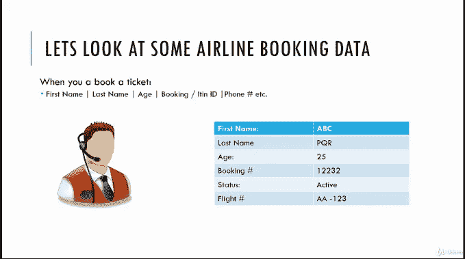
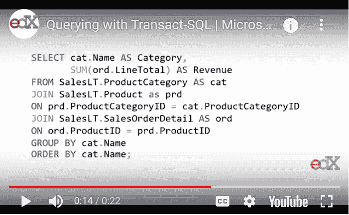
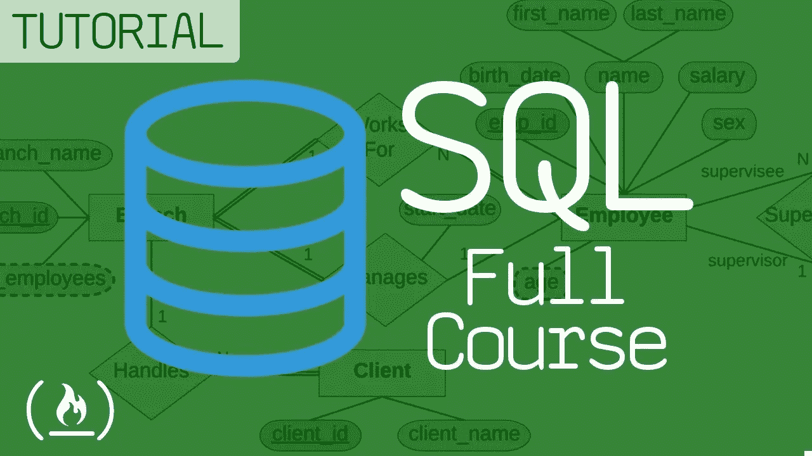
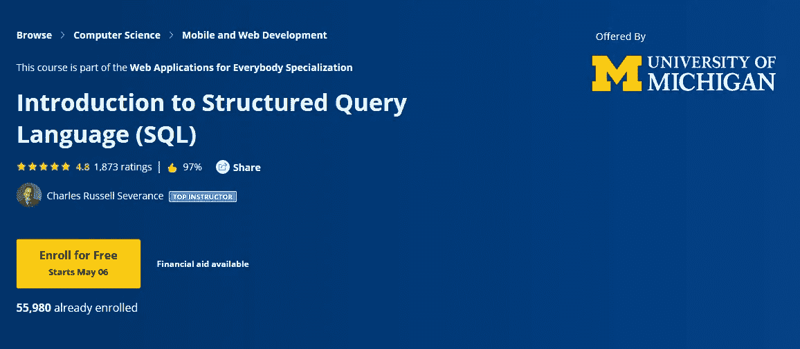

# 程序员和数据科学家学习数据库和 SQL 的 10 门免费课程

> 原文：<https://medium.com/javarevisited/7-free-courses-to-learn-database-and-sql-for-programmers-and-data-scientist-e7ae19514ed2?source=collection_archive---------0----------------------->

## 免费课程为初学者学习 SQL 和数据库概念，使用来自 edX、Udemy 和 Coursera 的 Microsoft SQL Server、Oracle 和 MySQL。

大家好，我已经在这个博客上分享了一些免费的编程资源，如[书籍](https://javarevisited.blogspot.com/2018/07/top-5-advanced-sql-books-for.html)和[课程](https://javarevisited.blogspot.com/2018/05/top-5-sql-and-database-courses-to-learn-online.html)。之前我已经分享了关于 [Java](http://javarevisited.blogspot.sg/2017/11/top-5-free-java-courses-for-beginners.html) 、 [Maven](http://www.java67.com/2018/02/6-free-maven-and-jenkins-online-courses-for-java-developers.html) 、 [Spring](http://www.java67.com/2017/11/top-5-free-core-spring-mvc-courses-learn-online.html) 和[数据结构和算法](http://javarevisited.blogspot.sg/2018/01/top-5-free-data-structure-and-algorithm-courses-java--c-programmers.html)的免费课程，今天我将分享一些学习 SQL 和数据库的**免费在线培训课程。**

你为什么要学习 SQL？嗯，这是程序员、应用程序开发人员和 it 专业人员的[必备技能之一。像](/swlh/10-things-every-programmer-should-know-26ba37cfcaf4) [Linux](http://www.java67.com/2018/02/5-free-linux-unix-courses-for-programmers-learn-online.html) 一样，这是一项比任何其他编程语言、框架或库都更能为你服务的技能。

SQL 用于与数据库系统交互，如 [Oracle](http://www.java67.com/2018/02/5-free-oracle-and-microsoft-sql-server-online-courses.html) 、 [MySQL](http://www.java67.com/2018/02/5-free-php-and-mysql-courses-for-web-developers.html) 、 [PostgreSQL](https://javarevisited.blogspot.com/2020/02/top-5-courses-to-learn-postgresql-in.html) 和[微软 SQL Server](https://javarevisited.blogspot.com/2020/02/top-5-courses-to-learn-microsoft-sql-server-mssql.html) 。根据 ANSI(美国国家标准协会)，SQL 代表关系数据库管理系统的标准查询语言。

SQL 是几十年来与各种数据库系统交互的重要编程语言之一。虽然二十年前存在的许多语言现在已经灭绝了，但 SQL 一直保持着它在 RDBMS 世界中的霸主地位。随着时间的推移，它只随着新的特性和标准而发展。而且这种情况似乎会持续很多年。大多数现实世界的应用程序都以这样或那样的方式使用关系数据，而 SQL 是处理这些数据的查询语言。它允许你查询数据，找到你感兴趣的东西。

> SQL 帮助您理解数据，这是应用程序以及故障排除过程中的一个重要部分。

例如，如果你为亚马逊这样的电子商务巨头工作，那么你可以通过编写一个 [SQL 查询](http://javarevisited.blogspot.sg/2017/02/top-6-sql-query-interview-questions-and-answers.html#axzz578IJK8NK)来找出最畅销的商品。良好的 SQL 知识需要有效地完成您的工作。

# 使用 Oracle、MySQL 和 SQL Server 学习 SQL 和数据库的 10 门免费课程

在本文中，我将分享一些课程，帮助您学习 SQL 和数据库的基础知识。您将学习如何编写 SQL 查询，包括基本的和高级的，如使用[连接](https://javarevisited.blogspot.com/2020/04/combine-two-tables-using-left-join-in-SQL.html)和[聚合函数](https://javarevisited.blogspot.com/2020/04/sql-group-by-and-having-example-write.html)等。我还加入了一门关于 Oracle 和 SQL Server 的课程，这是当今世界最流行的两种数据库，它们用一些专有特性增强了 SQL。

## 1. [**数据库与 SQL 查询入门**](https://click.linksynergy.com/fs-bin/click?id=JVFxdTr9V80&subid=0&offerid=323058.1&type=10&tmpid=14538&RD_PARM1=https%3A%2F%2Fwww.udemy.com%2Fintroduction-to-databases-and-sql-querying%2F) **(Udemy 最佳课程)**

这是一门介绍数据库和 SQL 查询的 Udemy 在线课程。本课程没有先决条件。如果你想在下一次作为分析师的面试中熟悉数据库和查询的概念，这是一门适合你的课程。在本课程中，您将学习如何编写简单的查询，包括与日期、字符串操作、聚合等相关的查询。像连接多个表这样的高级概念并没有被涵盖，但是您会对 SQL 有一个很好的了解，以便自己进一步探索。

简而言之，绝对没有数据库或编程经验的初学者的好 SQL 课程。除了 DBA 和应用开发人员，BA、QA 以及其他想学习 SQL 的人都可以使用这门课程。

**这里是免费报名的链接—** [**数据库和 SQL 查询介绍**](https://click.linksynergy.com/fs-bin/click?id=JVFxdTr9V80&subid=0&offerid=323058.1&type=10&tmpid=14538&RD_PARM1=https%3A%2F%2Fwww.udemy.com%2Fintroduction-to-databases-and-sql-querying%2F)

## 2.用于数据科学的 SQL(学习 SQL 的最佳课程)

SQL 是数据科学家最重要的技能之一，可能比任何程序员都重要，因为他们比任何人都要处理数据。

虽然 [Pandas](https://javarevisited.blogspot.com/2019/10/top-5-courses-to-learn-pandas-for-data-analysis-python.html) 很棒， [Microsoft Excel](https://javarevisited.blogspot.com/2019/09/top-5-courses-to-learn-microsoft-excel-macros-vba-and-data-visualization.html) 对任何数据科学家来说也是一个有用的工具，但 SQL 是无可替代的，如果你真的想从精英中的精英那里学习 SQL，那么这个来自 [Coursera](https://click.linksynergy.com/deeplink?id=JVFxdTr9V80&mid=40328&murl=https%3A%2F%2Fwww.coursera.org%2F) 的免费 SQL 课程是最好的开始方式。

在这个由加州大学戴维斯分校和 Coursera 提供的免费 SQL 课程中，萨德勒·圣劳伦斯将从头开始教你 SQL。

本课程的目的是介绍关系数据库的概念，并帮助您学习和应用 SQL 语言的基础知识。它还旨在帮助您开始在数据科学环境中执行 SQL 访问。

**这里是免费注册的链接—** [SQL for Data Science](https://coursera.pxf.io/c/3294490/1164545/14726?u=https%3A%2F%2Fwww.coursera.org%2Flearn%2Fsql-for-data-science)

如果你觉得 Coursera 的课程有用，因为它们是由知名公司如谷歌、IBM、亚马逊和世界上最好的大学创建的，我建议你加入 Coursera 的订阅计划 [**Coursera Plus**](https://coursera.pxf.io/c/3294490/1164545/14726?u=https%3A%2F%2Fwww.coursera.org%2Fcourseraplus)

这种单次订阅可以让你无限制地访问他们最受欢迎的**课程**、**专业**、**专业证书**和**指导项目**。它每年花费大约 399 美元，但是它完全物有所值，因为你可以获得无限的证书。

## [**3。SQL:编写 SQL 查询的搭车者指南**](https://click.linksynergy.com/fs-bin/click?id=JVFxdTr9V80&subid=0&offerid=323058.1&type=10&tmpid=14538&RD_PARM1=https%3A%2F%2Fwww.udemy.com%2Fsql-the-hitch-hikers-guide-to-writing-sql-queries%2F) **(Udemy)**

这是从 Udemy 学习 SQL 基础知识的另一个很好的课程，特别是如何在 Microsoft SQL Server 上编写 SQL 查询。作者是一名来自澳大利亚的数据分析师和 SQL 开发人员，他在向初学者解释像连接这样棘手的概念方面做得很好。

在本课程中，您不仅将了解 [SQL 连接](http://javarevisited.blogspot.sg/2013/05/difference-between-left-and-right-outer-join-sql-mysql.html)，还将了解如何编写基于聚合的查询以及如何进行备份和恢复。本课程使用 SQLServer 2014 express，课程中使用的所有脚本也可以下载，以便更好地学习。

简而言之，适合初次接触 SQL 和数据库的学生和程序员的 SQL 概述课程。

**这里是免费注册的链接—** [SQL:编写 SQL 查询的搭便车者指南](https://click.linksynergy.com/fs-bin/click?id=JVFxdTr9V80&subid=0&offerid=323058.1&type=10&tmpid=14538&RD_PARM1=https%3A%2F%2Fwww.udemy.com%2Fsql-the-hitch-hikers-guide-to-writing-sql-queries%2F)

## 4. [Oracle SQL:最流行数据库简介](https://click.linksynergy.com/deeplink?id=JVFxdTr9V80&mid=39197&murl=https%3A%2F%2Fwww.udemy.com%2Fcourse%2Foracle-sql-an-introduction-to-the-most-popular-database%2F)

如果您在实际项目中使用过数据库，那么您会知道每个供应商都是不同的。每个供应商都为在其系统上运行的 SQL 提供了一些附加功能或操作符。在 Oracle 上运行的 SQL 查询可能无法在 Microsoft SQL 或 MySQL 上运行，除非您使用 ANSI SQL。

Oracle SQL 与 ANSI SQL 略有不同，它用于 Oracle RDBMS，这是世界上领先的关系数据库之一

这是一门初级课程，即使你是第一次使用 [SQL](http://www.java67.com/2017/08/5-free-sql-books-for-beginners-and-experienced-pdf-download.html) 和[数据库](http://www.java67.com/2016/09/sql-5-best-books-to-learn-and-master.html)，你也可以参加这门课程。如果您正在考虑学习 Oracle 数据库的 SQL，那么这是适合您的课程。

**这里是免费注册的链接—** [Oracle SQL:最流行数据库简介](https://click.linksynergy.com/deeplink?id=JVFxdTr9V80&mid=39197&murl=https%3A%2F%2Fwww.udemy.com%2Fcourse%2Foracle-sql-an-introduction-to-the-most-popular-database%2F)

## [5。用 Transact-SQL](https://www.awin1.com/cread.php?awinmid=6798&awinaffid=631878&clickref=&p=%5B%5Bhttps%3A%2F%2Fwww.edx.org%2Fcourse%2Fquerying-data-with-transact-sql-2) 查询数据(edX 免费课程)

除了 Oracle，Microsoft SQL Server 是另一种流行的关系数据库，它有自己的 SQL 方言 T-SQL。它为标准 SQL 提供了一些有用的函数和操作符。

如果你想学习微软 SQL Server 中的 SQL，那么这是适合你的课程。在这个来自 [edX](https://www.awin1.com/cread.php?awinmid=6798&awinaffid=631878&clickref=&p=%5B%5Bhttps%3A%2F%2Fwww.edx.org%2Fcourse%2Fcs50s-introduction-to-computer-science) 的免费在线培训课程中，您将学习如何免费安装 SQL Server Express，感谢 [edX 团队](https://medium.com/u/6e8411791314?source=post_page-----e7ae19514ed2--------------------------------)

您还将学习如何创建表格和向表格添加数据。一旦准备好数据库，就可以开始练习 SQL 查询了。这使得本课程非常适合初级 DBA 以及使用 MSSQL 的程序员和应用程序开发人员。

**这里是免费注册的链接—** [用 Transact-SQL 查询数据](https://www.awin1.com/cread.php?awinmid=6798&awinaffid=631878&clickref=&p=%5B%5Bhttps%3A%2F%2Fwww.edx.org%2Fcourse%2Fquerying-data-with-transact-sql-2)

## 6.freeCodeCamp 的 SQL 和数据库课程

FreeCodeCamp Youtube 频道也有不错的 SQL 和数据库课程来学习这一重要技能。在本课程中，Mike Dane 将教您数据库管理基础知识和 SQL。

在本课程中，Mike 将帮助您在 Windows 或 Mac 上安装 MySQL。然后，他探讨了模式设计、创建-读取-更新-删除操作(CRUD)和其他数据库基础知识等主题。

如果您以前从未学习过数据库或 SQL，这是一个很好的起点，因为本课程涵盖了诸如什么是数据库、什么是 SQL、创建表和插入数据等内容。你可以在 Youtube 上观看完整的课程。

## 7.[结构化查询语言(SQL)简介](https://coursera.pxf.io/c/3294490/1164545/14726?u=https%3A%2F%2Fwww.coursera.org%2Flearn%2Fintro-sql) (Coursera)

这是 Coursera 的另一个学习 SQL 和数据库的免费课程。该课程由密歇根大学提供，并由 Coursera 顶级讲师之一查尔斯·拉塞尔·塞弗伦(Charles Russel Severance)主讲。

本课程也是面向每个人的 [**网络应用专业化认证**](https://coursera.pxf.io/c/3294490/1164545/14726?u=https%3A%2F%2Fwww.coursera.org%2Fspecializations%2Fweb-applications)**的一部分，完成本课程将被计入认证。**

**在本课程中，您将学习如何执行 CRUD 操作(创建、读取、更新、删除)，还将学习一些高级 SQL 查询技术，如 SQL 连接和存储过程。**

**您还将学习单表查询和 SQL 语言的基本语法，以及多表、外键和连接操作的数据库设计。最后，您将学习对多对多的关系进行建模，比如表示用户、角色和课程所需的关系。**

****这里是免费注册的链接—** [结构化查询语言(SQL)介绍](https://coursera.pxf.io/c/3294490/1164545/14726?u=https%3A%2F%2Fwww.coursera.org%2Flearn%2Fintro-sql)**

****

## **[8。高级数据库和 SQL 查询](https://click.linksynergy.com/fs-bin/click?id=JVFxdTr9V80&subid=0&offerid=323058.1&type=10&tmpid=14538&RD_PARM1=https%3A%2F%2Fwww.udemy.com%2Fadvanced-tsql-querying-using-sql-2014%2F) (Udemy)**

**本课程是一门高级 T-SQL 查询课程，面向对 SQL 和 Microsoft SQL Server 有基本了解的程序员。

它期望你已经了解基本的数据库概念，并且能够自如地编写基本的 T-SQL 查询，如 SELECT、JOINS 等。本课程涵盖高级主题，如视图、触发器、动态查询、透视等。

如果您正在寻找下一份数据库工作，或者试图提高您现有的 SQL Server 和 T-SQL 知识并将其应用到您的项目中，这是适合您的课程。**

****这里是免费注册的链接—** [高级数据库和 SQL 查询](https://click.linksynergy.com/fs-bin/click?id=JVFxdTr9V80&subid=0&offerid=323058.1&type=10&tmpid=14538&RD_PARM1=https%3A%2F%2Fwww.udemy.com%2Fadvanced-tsql-querying-using-sql-2014%2F)**

****

## **9.[学习 PostgreSQL 教程——初学者完全教程](https://www.youtube.com/watch?v=qw--VYLpxG4)**

**如果你想使用 PostgreSQL 数据库学习 SQL，那么你会喜欢 freeCodeCamp 的这个免费课程。**

**在这个 4 个半小时的在线 SQL 培训课程中，您将在整个课程中学习如何使用 PostgreSQL。PostgreSQL 是一个通用的对象关系数据库管理系统。它是最先进的开源数据库系统，广泛用于构建后端系统。**

**你可以在 Youtube 的 freeCodecamp 频道免费观看这个课程，链接如下:**

## **10.[免费学习 SQL](https://www.pntrs.com/t/TUJGR0lLR0JHRklJSkhCR0ZISk1N?url=https%3A%2F%2Fwww.codecademy.com%2Flearn%2Flearn-sql)(CodeCademy 最佳课程)**

**这是在 [CodeCademy](https://bit.ly/codecademypro) 上在线学习 SQL 和数据库基础知识的另一个很好的资源。如果你喜欢短时间的，互动的，结构化的学习，那么你会真的喜欢这门课程。**

**在本课程中，您将学习如何通过 SQL 与关系数据库进行通信。您将学习——并通过 4 个项目进行实践——如何操作数据和构建与多个表通信的查询。**

**您将了解基本的 SQL 命令、操作、查询和聚合函数，如计数、求和、最大值、最小值等。你还将通过测验对你的知识进行压力测试，以帮助记忆语法**

****这是加入免费 SQL 课程**——[学习 SQL](https://www.pntrs.com/t/TUJGR0lLR0JHRklJSkhCR0ZISk1N?url=https%3A%2F%2Fwww.codecademy.com%2Flearn%2Flearn-sql) 的链接**

****

**以上就是关于学习数据库和如何编写 SQL 查询的一些**免费课程**。正如我所说，SQL 是一项重要的技能，每个程序员都应该知道。如果您不了解 SQL，那么您应该花一些时间学习基本的 SQL 命令和高级概念，如连接、聚合和窗口函数。花在学习 SQL 上的时间和金钱将在你的 IT 职业生涯中很好地为你服务。**

> **如果你有任何其他的课程，我们可以添加到这个列表中，请随时建议。**

**其他**免费在线课程**你可能喜欢探索
[5 门免费课程学习 Docker 适合初学者](/javarevisited/top-5-free-courses-to-learn-docker-for-beginners-best-of-lot-b2b1ad2b98ad)
[10 门免费课程学习 AWS 适合初学者](/javarevisited/top-10-courses-to-learn-amazon-web-services-aws-cloud-in-2020-best-and-free-317f10d7c21d)
[5 门免费课程学习 R 适合数据科学](/javarevisited/top-5-free-courses-to-learn-r-programming-for-data-science-and-statistics-in-2020-305bf1c6f24e)
[15 门免费课程学习 Python 编程适合初学者](/swlh/5-free-python-courses-for-beginners-to-learn-online-e1ca90687caf)
[10 门免费课程学习 Java 编程](/javarevisited/10-free-courses-to-learn-java-in-2019-22d1f33a3915)
[10 本书籍和课程学习 Angular 适合 Web 开发](/javarevisited/top-10-angular-books-and-courses-for-beginners-and-experienced-web-developers-best-of-lot-9a2dae87f04c) [我最喜欢的免费课程学习数据结构与算法](/free-code-camp/these-are-the-best-free-courses-to-learn-data-structures-and-algorithms-in-depth-4d52f0d6b35a)
[我最喜欢的免费 JavaScript 初学者教程](/javarevisited/my-favorite-free-tutorials-and-courses-to-learn-javascript-8f4d0a71faf2)
[10 个免费 Python 教程表单微软和谷歌](/swlh/5-free-python-courses-for-beginners-to-learn-online-e1ca90687caf)
[100+ Udemy 免费课程学习编程](/javarevisited/100-free-programming-and-web-development-courses-on-udemy-free-resource-center-3f8415eb5e6f)
[我最喜欢的免费课程学习 Jenkins、Maven 和 Docker](/javarevisited/top-10-free-courses-to-learn-maven-jenkins-and-docker-for-java-developers-51fa7a1e66f6?source=collection_home---4------3-----------------------)**

**感谢您阅读本文。如果你喜欢这些数据库和 SQL 课程，请与你的朋友和同事分享。如果您有任何问题或反馈，请留言。**

**如果你不介意在学习上投资一些钱，那么我也建议你去看看 Udemy 网站上何塞·马西亚尔·波尔蒂利亚的 SQL 训练营课程。这是一门实践性很强的综合性课程，而且价格也很实惠。我在优购特卖时只花了 10 美元就买到了它。**

** [## 用于数据操作和分析的完整 SQL 训练营

### 您将学习如何使用最受欢迎的技能之一- PostgreSQL 来读写复杂的数据库查询

udemy.com](https://click.linksynergy.com/deeplink?id=JVFxdTr9V80&mid=39197&murl=https%3A%2F%2Fwww.udemy.com%2Fthe-complete-sql-bootcamp%2F)** 

## **你可能喜欢的其他媒体文章**

** [## 破解任何编程和技术面试的 25 个软件设计面试问题

### 常见系统设计问题和有用资源的链接

medium.com](/javarevisited/25-software-design-interview-questions-to-crack-any-programming-and-technical-interviews-4b8237942db0)  [## 技术访谈中的 20 大链表编码问题

### 大家好，我已经分享了很多给正在积极找工作的程序员的编码面试问题…

medium.com](/javarevisited/top-20-linked-list-coding-problems-from-technical-interviews-90b64d2df093)  [## 面向初学者和有经验的开发人员的 21 个字符串编程面试问题

### 除了数组、二叉树和链表数据结构，字符串是编程工作中的另一个热门话题…

medium.com](/javarevisited/top-21-string-programming-interview-questions-for-beginners-and-experienced-developers-56037048de45)**