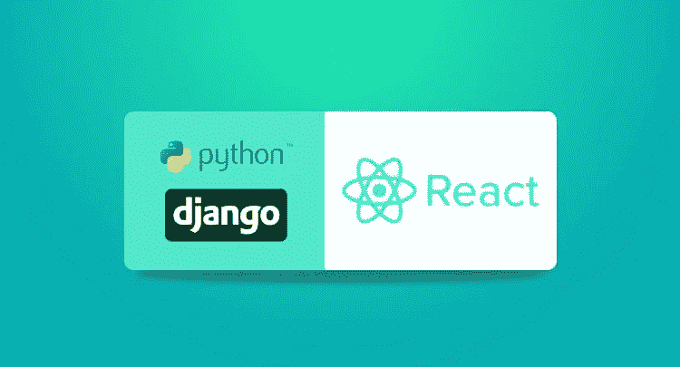
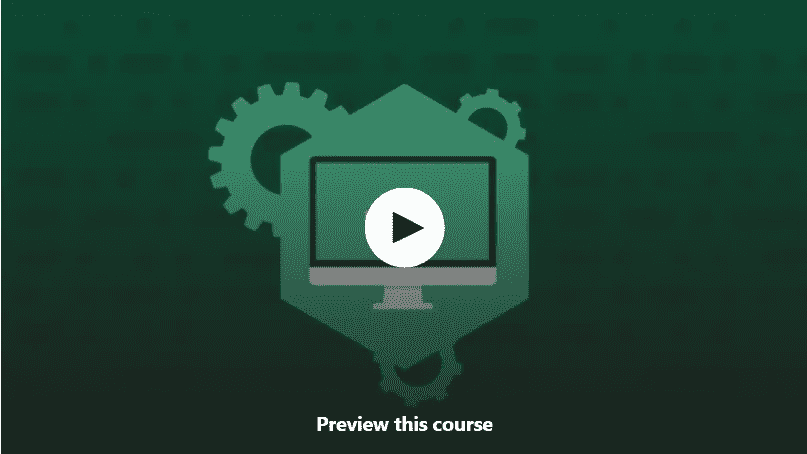
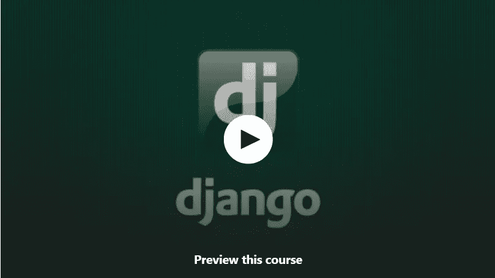
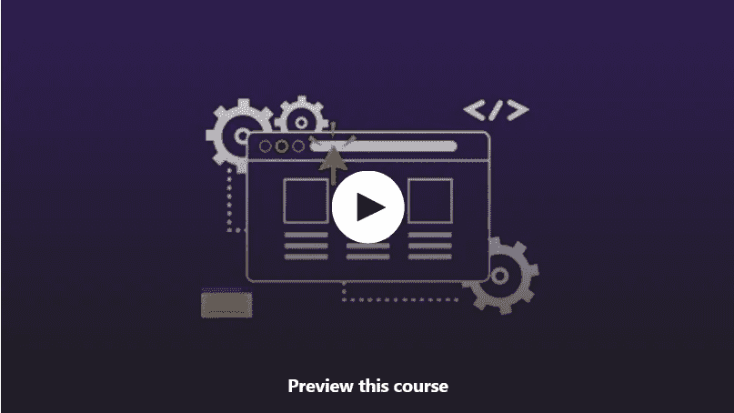

# 2023 年学习 Python 中 Django 框架的 7 门最佳免费课程

> 原文：<https://medium.com/javarevisited/7-free-courses-to-learn-django-framework-in-python-bd50acc8484?source=collection_archive---------0----------------------->

## Udemy、Coursera 和其他网站上为初级和中级 Python 开发人员提供的学习 Django 的免费在线课程列表。

大家好，如果你想在 2023 年学习 Django Web 框架并寻找一些免费的 Django 在线课程，那么你来对地方了。

在过去，我已经分享了 [**最佳 Python 在线课程**](/better-programming/top-5-courses-to-learn-python-in-2018-best-of-lot-26644a99e7ec) 和 [**最佳 Django 课程**](/javarevisited/my-favorite-courses-to-learn-django-for-beginners-2020-ac172e2ab920) ，今天，我将分享免费的 Django 课程，您可以在线加入学习这个有用的全栈 Python 框架。

毫无疑问，Python 是目前的编程语言之王，一个主要原因是它拥有大量强大的框架和库，用于不同的目的，如自动化、[数据科学、](https://www.java67.com/2018/10/top-10-data-science-and-machine-learning-courses.html)、[机器学习、](https://www.java67.com/2019/01/5-free-courses-to-learn-machine-and-deep-learning-in-2019.html)、脚本、数据分析、 [Web 开发](/better-programming/my-5-favorite-courses-to-learn-web-development-in-2019-a5e74167f8b2)也不例外。

Python 有一些创建 Web 应用程序的最佳框架，如 Django 和 Flask。如果你不知道，Django 是使用 Python 编程语言创建现代 web 应用程序的流行 web 开发框架之一，对于全栈开发人员来说是必不可少的。

Django 是一个非常流行的、功能齐全的服务器端 web 框架，用 Python 编写。Django 允许你快速创建 web 应用，这就是为什么对拥有 Django 技能的 Python 开发者的需求非常高。

如果你想学习 Django 并寻找免费的在线课程，那么你来对地方了。过去我曾分享过[最佳 Django 在线课程](https://www.java67.com/2020/06/top-5-courses-to-learn-django-and-python-for-web-development.html)，今天，我将分享**最佳免费 Django 课程**给喜欢免费培训课程的人。

Django 是目前最流行、最成熟的 Python web 开发框架。这使得用更少的代码更快地构建更好的 Web 应用程序变得更加容易。用 Django 建立网站不仅聪明高效，而且有趣！python 是最受欢迎的现代编程语言，Django 是基于 Python 的开源 web 框架之一。难怪你会看到很多应用程序和网站都致力于此。

我们知道学习 Django 对你来说有多重要，我们挑选了最好的免费在线课程来帮助你。顺便说一句，如果你可以花几块钱学习像 Django 这样有价值的技能，那么我强烈推荐你去看看何塞·波尔蒂利亚的 [**Python 和 Django 全栈 Web 开发人员训练营**](https://click.linksynergy.com/deeplink?id=CuIbQrBnhiw&mid=39197&murl=https%3A%2F%2Fwww.udemy.com%2Fcourse%2Fpython-and-django-full-stack-web-developer-bootcamp%2F) ，这是学习 Django 的最好课程之一，你只需在 Udemy sales 上花 10 美元就可以得到。

 [## Python 和 Django 全栈 Web 开发人员训练营

### 欢迎来到 Python 和 Django 全栈 Web 开发人员训练营！在本课程中，我们涵盖了您需要知道的一切…

udemy.com](https://click.linksynergy.com/deeplink?id=CuIbQrBnhiw&mid=39197&murl=https%3A%2F%2Fwww.udemy.com%2Fcourse%2Fpython-and-django-full-stack-web-developer-bootcamp%2F) 

# 2023 年 Python 程序员学习 Django 的 7 个最佳免费在线课程

这里是我列出的学习 Django 开发框架的一些最好的免费在线课程。这些课程是绝对免费的，选自热门的在线学习网站，如 [Udemy](/javarevisited/top-15-java-and-spring-framework-courses-from-udemy-best-of-lot-d7b965b62a9f) 、 [Coursera](https://javarevisited.blogspot.com/2020/08/top-10-coursera-certifications-to-learn-web-development.html) 、 [edX](/javarevisited/10-free-best-edx-certifications-and-courses-to-learn-online-3473d466f968) 、 [Pluralsight](https://javarevisited.blogspot.com/2020/08/top-10-pluralsight-courses-to-learn-React.js.html) 、freeCodecamp 等。你可以用这些免费的 Django 课程在 2 到 4 个小时内学会 Django。该列表包含 Django 速成班以及深入学习 Django 的详细课程。

这些课程是由一大群学习者和开发者在审阅后精心挑选的。其中一些课程在各自网站上的特定类别中被评为最佳。阅读描述，了解它们如何能让你受益于[学习 Django](https://javarevisited.blogspot.com/2020/07/top-5-courses-to-learn-django-in-2020.html) 的事业。

为了不浪费你的时间，这里列出了 2023 年学习 Django 的最好的免费在线培训课程。

## 1.[试试 Django — Python Web 开发](https://click.linksynergy.com/deeplink?id=JVFxdTr9V80&mid=39197&murl=https%3A%2F%2Fwww.udemy.com%2Fcourse%2Ftry-django-2-2-python-web-development%2F)【免费在线课程】

这是学习 Django 进行 Web 开发的最好的免费在线课程之一，尤其适合初学者。

这个 4 小时以上的免费在线课程被分成小视频，分布在各个章节。如果你准备在学习中更进一步，它将为你提供可扩展的、基于项目的学习。此外，Instagram 也使用 Django，您可以很容易地学会使用它并获得想要的结果。

课程内容:

*   Django 和 HTML
*   处理用户和关注者
*   表单，视图
*   模型
*   应用

这也是 Udemy 上评分最高的免费 Django 课程之一，已经有超过 44K 名学生加入了该课程。该课程是为初学者设计的，他们可以很容易地实现他们雄心勃勃的应用程序开发或编码技能开发的目标。

**这里是加入这个免费课程的链接**——[试试 Django——Python Web 开发](https://click.linksynergy.com/deeplink?id=JVFxdTr9V80&mid=39197&murl=https%3A%2F%2Fwww.udemy.com%2Fcourse%2Ftry-django-2-2-python-web-development%2F)

## 2.[Django 入门指南](https://click.linksynergy.com/deeplink?id=JVFxdTr9V80&mid=39197&murl=https%3A%2F%2Fwww.udemy.com%2Fcourse%2Fintrodjango%2F)【免费 Udemy 课程】

本课程中应用的学习过程是通过将事物应用到您的应用中来逐步学习。虽然你不需要预先掌握 HTML/CSS 的知识，但是你仍然需要了解 python 的基础知识来开始这个课程。这个课程可以为那些希望从基础开始建立编码技能的人创造奇迹。

本课程分为讲座和实施两部分。你可以通过边学边实现来轻松学习。

课程内容:

*   使用数据库
*   通过表单等访问和存储数据。
*   URL 和模板的使用
*   [CSS](https://www.java67.com/2020/08/5-best-online-courses-to-learn-html-5.html)+[bootstrap](https://javarevisited.blogspot.com/2020/07/top-5-courses-to-learn-bootstrap-in.html)用于您的应用

虽然这增加了学习时间，但它将为你提供详细的学习和 Django 的个人经验。

**这是加入本课程的链接**——[Django 初学者指南](https://click.linksynergy.com/deeplink?id=JVFxdTr9V80&mid=39197&murl=https%3A%2F%2Fwww.udemy.com%2Fcourse%2Fintrodjango%2F)

## 3.[穿越 Django 官方教程](https://click.linksynergy.com/deeplink?id=JVFxdTr9V80&mid=39197&murl=https%3A%2F%2Fwww.udemy.com%2Fcourse%2Fdjango-official-tutorial-2-2%2F)【Udemy 免费课程】

这门课是我们名单上最通用的课程。HTML/CSS 和 Django 的基础知识有助于加强学习和正确看待事物。要求用户了解 python 和面向对象的 python。

课程分为较短的讲座和应用思路。通过本课程，您可以学习如何在旅途中实现目标。本课程的重点是结构及其在网页开发中的正确使用。

课程内容:

*   姜戈 2.2
*   模型和应用
*   结构
*   数据库迁移
*   视图

此外，你还可以在 Django 学习数据库管理和数据迁移，这对网络开发和数据存储很有帮助。

**这里是加入这个免费课程的链接**——[穿越 Django 的官方教程](https://click.linksynergy.com/deeplink?id=JVFxdTr9V80&mid=39197&murl=https%3A%2F%2Fwww.udemy.com%2Fcourse%2Fdjango-official-tutorial-2-2%2F)

## 4.在 Django 中构建 Web 应用【免费 Coursera 课程】

这是一个免费的在线学习 Django 的 Coursera 课程，它帮助你开发 Django 的编码技能。本课程主要侧重于开发 web 编程概念。Django 就像是 python 在 web 开发中的扩展，在课程结束时，你将能够获得两套编程的所有技能。这些技能在开发基于 Django 的应用程序时会派上用场。

因为我们知道 python 可以说是最简单的语言，Django 被认为是 python 最流行的 web 框架；他们的组合值得学习，因为这是最致命的组合。

该课程由密歇根大学提供，也是 Coursera 上的[**Django for Everybody Specialization**](https://coursera.pxf.io/c/3294490/1164545/14726?u=https%3A%2F%2Fwww.coursera.org%2Fspecializations%2Fdjango)的一部分，这意味着完成该课程将计入该认证。

您将在本课程中学到以下内容:

*   Django 框架基础
*   如何在 Django 中构建数据模型
*   如何在 Django 中创建类、实例、方法
*   应用 Django 模型查询和 Django 模板语言的模板标签/代码(DTL)
*   在 HTML 中构建表单
*   Django 模板语言
*   使用 Django 的面向对象编程

这门课程对初学者和专业人士一视同仁，给他们一个编码的视角。所有讲座分为短视频讲座分讲座。

**这里是加入这个免费课程的链接** — [在姜戈](https://coursera.pxf.io/c/3294490/1164545/14726?u=https%3A%2F%2Fwww.coursera.org%2Flearn%2Fdjango-build-web-apps)构建网络应用

但是当参加审计专业的免费课程时，你将不会得到任何证书。如果你参加这个课程是为了获得 Coursera 证书，那么你需要注册专业化或者参加一个订阅计划，比如 [**Coursera Plus**](https://coursera.pxf.io/c/3294490/1164545/14726?u=https%3A%2F%2Fwww.coursera.org%2Fcourseraplus) ，它提供 5000 多个 Coursera 课程、项目和专业证书的无限制访问。

 [## Coursera Plus |无限制访问 7，000 多门在线课程

### 用 Coursera Plus 投资你的职业目标。无限制访问 90%以上的课程、项目…

coursera.pxf.io](https://coursera.pxf.io/c/3294490/1164545/14726?u=https%3A%2F%2Fwww.coursera.org%2Fcourseraplus) 

## 5.Python Django Web 框架—初学者完整课程[FreeCodeCamp]

这是另一个从 freeCodeCamp.org 学习 Django 的很棒的免费在线课程，这是我最喜欢的免费学习有用的热门技能的网站之一。

Django 是一个非常流行、功能齐全的服务器端 web 框架，用 Python 编写。Django 允许你快速创建网络应用程序，这个免费课程对学习 Django 来说超级棒。

老师在解释方面很有天赋，他一遍又一遍地重复这个概念，让你一直删除/改变目录，让这个概念深入你的大脑。

该课程也很庞大，内容超过 3.45 小时，涵盖了 Django 的大部分概念和主题。以下是本课程涵盖的主要主题列表

1.  为 Django 设置虚拟环境
2.  创建一个空白的 Django 项目
3.  内置组件
4.  在 Python Shell 中创建产品对象
5.  默认主页到自定义主页
6.  URL 路由和请求
7.  Django 模板和模板引擎基础
8.  在模板中呈现上下文
9.  模板标签和过滤器
10.  Django 模型形式和纯 Django 形式
11.  基于类的视图— ListView、DetailedView、DeleteView
12.  Post 方法的表单验证
13.  URL 的动态链接，等等

总的来说，对于初学者来说，这是一个学习 Django 的极好的免费资源，你可以在 Youtube 或这里观看这个课程:

## 6. [Django 特色和库](https://coursera.pxf.io/c/3294490/1164545/14726?u=https%3A%2F%2Fwww.coursera.org%2Flearn%2Fdjango-features-libraries)【Coursera 免费课程】

这是另一个从 Coursera 学习 Django 的免费课程，也是每个人专精的 Django 的一部分。事实上，这是单子上的下一门课程，还有几门免费的 Django 课程。

在本课程中，您将学习如何构建适合最终用户使用的基于 Django 的 web 应用程序。您将了解 Django 中的 cookies、会话和认证过程。

您将在应用程序中构建导航，并探索如何轻松改进 Django 应用程序的外观。您还将学习如何将应用程序从开发阶段转移到生产阶段。

以下是您将会学到的关键概念和技能:

1.  用户认证
2.  会话和 Cookies
3.  一对多模型
4.  数据有效性
5.  Django(网络框架)

本课程也由密歇根大学提供，完成本课程大约需要 16 个小时。

**这是加入本课程的链接**——[Django 特性和库](https://coursera.pxf.io/c/3294490/1164545/14726?u=https%3A%2F%2Fwww.coursera.org%2Flearn%2Fdjango-features-libraries)

顺便说一下，如果你觉得 Coursera 的课程很有用，因为它们是由世界各地的知名公司和大学创建的，我建议你加入 Coursera 的 [**Coursera Plus**](https://click.linksynergy.com/deeplink?id=JVFxdTr9V80&mid=40328&murl=https%3A%2F%2Fwww.coursera.org%2Fcourseraplus) ，这是 Coursera 的一个订阅计划，让你可以无限制地访问他们最受欢迎的课程、专业、专业证书和指导项目。

 [## Coursera Plus |无限制访问 3000 多门在线课程

### 用 Coursera Plus 投资你的职业目标。无限制地访问 90%以上的课程、指导项目…

udemy.com](https://click.linksynergy.com/deeplink?id=JVFxdTr9V80&mid=40328&murl=https%3A%2F%2Fwww.coursera.org%2Fcourseraplus) 

## 7.[通过创建 URL 缩短服务学习 Django](https://click.linksynergy.com/deeplink?id=JVFxdTr9V80&mid=39197&murl=https%3A%2F%2Fwww.udemy.com%2Fcourse%2Ftry-django-1-10%2F)

本课程旨在让你第一次体验 Django，如果你有 HTML/CSS 和 python 编程的基础知识，学习起来会更容易。

本课程是基于项目的学习，也就是说，你将把概念应用到实时构建项目中。有了这个强大的方法，你将对事物如何工作有一个透视，你可以获得项目开发的经验，这将派上用场。由于项目开发是一个严酷的过程，这些课程不需要多少勇气和毅力。你将了解所有的基本知识，如框架、[引导程序](/javarevisited/7-free-courses-to-learn-bootstrap-for-web-designers-and-developers-5135215648f1)等。但是你需要保持耐心，因为这个课程比其他课程要长一些。

课程内容:

*   姜戈基础
*   框架和引导工作
*   项目创建和实施等

从长远来看，所有这些努力都会对你有所帮助，此外，你还可以看到来自世界各地的学习者的所有问题和想法。

这是加入这个免费课程的链接— [通过创建 URL 缩短服务学习 Django](https://click.linksynergy.com/deeplink?id=JVFxdTr9V80&mid=39197&murl=https%3A%2F%2Fwww.udemy.com%2Fcourse%2Ftry-django-1-10%2F)

以上是关于**免费学习 Django 的最佳在线课程**。正如我所说，Python 是编程语言之王，当涉及到 web 开发时，Django 说了算。它真的使创建 web 应用程序变得更加容易和快捷。如果你渴望为创业公司工作，或者想要创建自己的 web 应用程序，那么对 Django 有一个很好的了解将会大有帮助。

Python 是学习者和专业人士的首选；Django 是基于 python 的编程，它将为您提供开发 web 应用程序的简单概念。

本文中的所有课程都是经过许多编码爱好者的讨论挑选出来的，包括学习者和专业人士。你将在学习方式上经历许多变化，所以我们要求你同样检查上述所有课程。这些免费课程是 Udemy 和 Pluralsight 等网站提供的合法免费课程。它们是由教师出于营销和教育目的而制作的。

其他**有用的免费编程课程**你可能喜欢探索

*   [2023 年学习 Angular 的 5 门免费课程](http://www.java67.com/2018/01/top-5-free-angular-js-online-courses-for-web-developers.html)
*   [学习大数据、Hadoop 和 Spark 的 5 门免费课程](http://www.java67.com/2018/05/top-5-free-big-data-courses-to-learn-Hadoop-Apache-Spark.html)
*   [2023 年网络开发者路线图](https://hackernoon.com/the-2019-web-developer-roadmap-ab89ac3c380e)
*   [2023 年学习区块链的五大免费课程](http://www.java67.com/2018/02/5-free-blockchain-technology-courses.html)
*   [我最喜欢的免费 JavaScript 学习课程](/javarevisited/12-free-courses-to-learn-javascript-and-es6-for-beginners-and-experienced-developers-aa35874c9a32)
*   [2023 年 7 门免费课程学习 Nodejs](/javarevisited/7-free-courses-to-learn-node-js-in-2020-2f1dd6722b49)
*   [面向开发者的 10 门免费 Docker 课程](https://hackernoon.com/10-free-courses-to-learn-docker-for-programmers-and-devops-engineers-7ff2781fd6e0)
*   [初学者学习颤振的五大免费课程](https://www.java67.com/2020/06/5-free-courses-to-learn-flutter-in-2020.html)
*   [初学者学习 Vuejs 的 5 门免费课程](https://www.java67.com/2020/07/5-free-courses-to-learn-vuejs-in-2020.html)
*   [学习数据科学和数据分析的 5 门免费课程](https://www.java67.com/2020/08/top-5-free-courses-to-learn-data-science-and-analysis.html)
*   [我最喜欢的免费课程学习打字稿](/javarevisited/top-10-free-typescript-courses-to-learn-online-best-of-lot-44bce9da41d1)
*   [初学 Photoshop 的 5 门免费课程](https://www.java67.com/2020/08/top-5-free-courses-to-learn-photoshop.html)
*   [5 门针对初学者的免费 React 本地课程](https://www.java67.com/2020/07/5-free-courses-to-learn-react-native-in.html)
*   [这些是学习 C 编程的免费课程](https://www.java67.com/2020/07/5-free-courses-to-learn-c-programming.html)
*   [我最喜欢的学习 AWS 的免费课程](/javarevisited/top-10-courses-to-learn-amazon-web-services-aws-cloud-in-2020-best-and-free-317f10d7c21d)
*   [学习微软 Azure 云的 5 门免费课程](https://www.java67.com/2020/07/5-free-courses-to-learn-microsoft-azure-cloud.html)
*   [初学者学习 Docker 我最喜欢的免费课程](/javarevisited/top-5-free-courses-to-learn-docker-for-beginners-best-of-lot-b2b1ad2b98ad?source=collection_home---4------2-----------------------)

感谢您阅读本文。如果你发现这些最好的*免费 Django 课程很有用*，那么请与你的朋友和同事分享。如果您有任何问题或反馈，请留言。

**P. S.** —如果你真的想学习 Django，并且不介意花几个钱来提升自己的技能，那么你也可以在 Udemy 上查看这个 [**Python 和 Django 全栈 Web 开发人员训练营课程**](https://click.linksynergy.com/deeplink?id=JVFxdTr9V80&mid=39197&murl=https%3A%2F%2Fwww.udemy.com%2Fcourse%2Fpython-and-django-full-stack-web-developer-bootcamp%2F) 。它不是免费的，但你可以在 Udemy 上花 10 美元买到，而且它的价值远不止这些。

 [## Python 和 Django 全栈 Web 开发人员训练营

### 欢迎来到 Python 和 Django 全栈 Web 开发人员训练营！在本课程中，我们涵盖了您需要知道的一切…

udemy.com](https://click.linksynergy.com/deeplink?id=JVFxdTr9V80&mid=39197&murl=https%3A%2F%2Fwww.udemy.com%2Fcourse%2Fpython-and-django-full-stack-web-developer-bootcamp%2F)