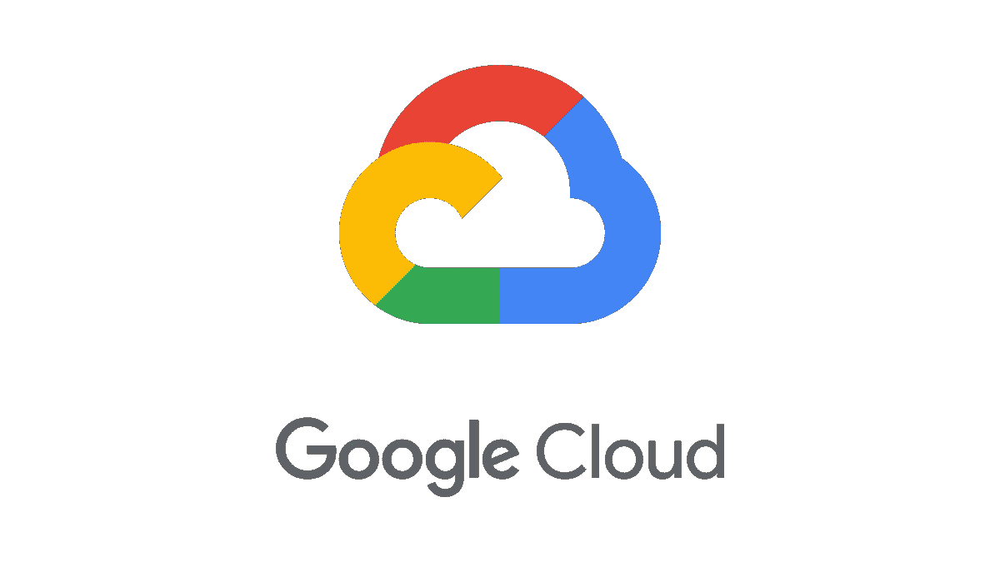
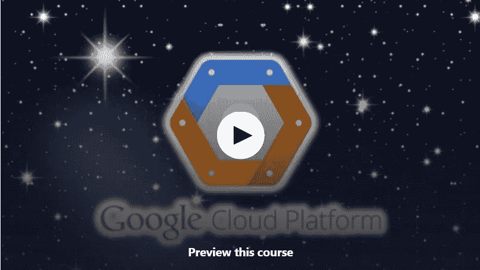
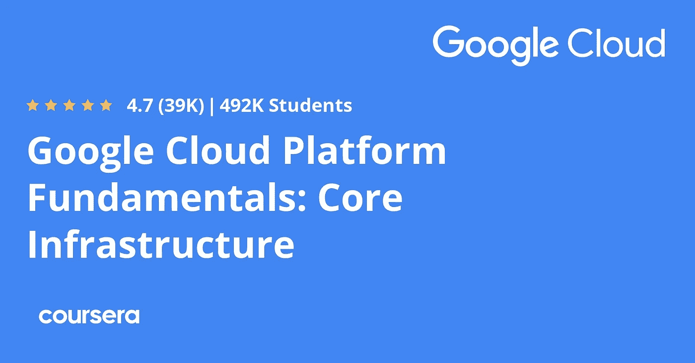
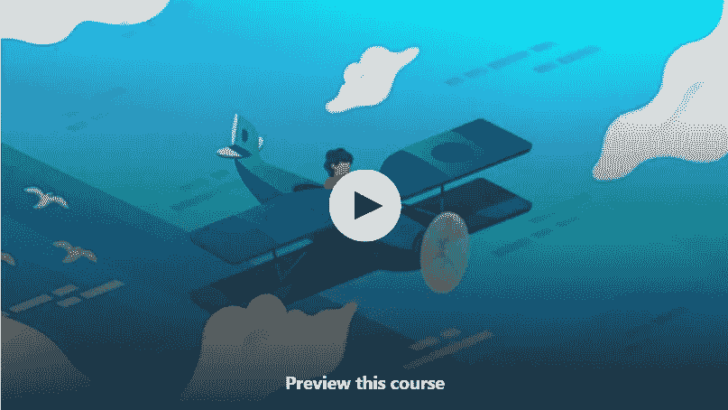

# 2023 年初学者学习谷歌云平台的 7 门最佳免费课程

> 原文：<https://medium.com/javarevisited/7-free-courses-to-learn-google-cloud-platform-for-beginners-cbb260fbd8e4?source=collection_archive---------0----------------------->

## 我最喜欢的免费云计算课程从 Udemy、Coursera 和 YouTube 学习 Google 云平台

大家好，如果你想在 2023 年学习谷歌云平台，并正在寻找一些免费的在线谷歌云培训课程、教程和学习材料，以开始你的 GCP 之旅，你来对地方了。

前面我已经分享了 [**最佳谷歌云平台课程**](/javarevisited/5-best-courses-to-learn-google-cloud-platform-gcp-in-2021-169093a3771a) ，今天我要分享的是 Udemy YouTube 和 Coursera 的免费在线课程，大家可以加入学习谷歌云平台。

如果你不知道，谷歌云平台是谷歌的大规模云平台，是与 [AWS](https://www.java67.com/2018/05/top-5-amazon-web-services-or-aws-courses-to-learn-online.html) 和[微软 Azure](https://javarevisited.blogspot.com/2020/04/how-to-crack-microsoft-azure-fundamentals-certification-az-900-exam.html) 并列的三大公共云平台之一。

对谷歌云专业人员的需求巨大，但市场上熟练的专业人员并不多。因此，越来越多的人开始了解谷歌云并获得认证。

这篇文章包含免费的谷歌云课程，这些课程来自类似于[***Udemy***](https://click.linksynergy.com/deeplink?id=JVFxdTr9V80&mid=39197&murl=https%3A%2F%2Fwww.udemy.com%2F)，[***Coursera***](https://coursera.pxf.io/c/3294490/1164545/14726?u=https%3A%2F%2Fwww.coursera.org%2F)和[***plural sight***](https://pluralsight.pxf.io/c/1193463/424552/7490?u=https%3A%2F%2Fwww.pluralsight.com)的网站，你可以使用它们从头开始学习谷歌云。这些云服务为技术世界提供了巨大的帮助，简化了任务、远程访问和安全功能。人们开始在网上做生意，市场正以稳定的速度增长。

我们必须跟上潮流，如果你是一个商业爱好者，你知道我们的话有多重要。为了向您提供关于云的知识以及如何使用它们，我们挑选了一些课程，您可以免费学习，并利用新技术进入市场。

我们努力为您提供所有的**免费谷歌云课程**，无论您是开发人员还是只是想获得一些 [**云计算技能**](/javarevisited/5-best-cloud-computing-courses-to-learn-in-2020-f5f091159401) ，都能满足您的好奇心，帮助您实现目标。

我们特别关注为您提供最佳教学的部分，它不会浪费您太多的时间，并且可以让您轻松学习。

顺便说一句，如果你不介意花几块钱学习像谷歌云这样有价值的技能，并寻找更全面的在线培训课程，那么我强烈推荐你查看 Udemy 上的 [**谷歌云平台(GCP)初学者基础**](https://click.linksynergy.com/deeplink?id=CuIbQrBnhiw&mid=39197&murl=https%3A%2F%2Fwww.udemy.com%2Fcourse%2Fgoogle-cloud-platform-gcp-fundamentals-for-beginners%2F) 课程。从零开始学习 GCP 概念的最佳在线课程之一。

 [## 谷歌云平台(GCP)初学者基础

### Janakiram 是一名执业架构师、分析师和顾问，专注于新兴基础设施技术。他…

udemy.com](https://click.linksynergy.com/deeplink?id=CuIbQrBnhiw&mid=39197&murl=https%3A%2F%2Fwww.udemy.com%2Fcourse%2Fgoogle-cloud-platform-gcp-fundamentals-for-beginners%2F) 

# 2023 年 7 门最佳免费谷歌云平台(GCP)初学者课程

以下是你可以在线获取的了解谷歌云平台或 GCP 的最佳免费课程列表。这些课程涵盖平台的详细信息，让您熟悉基本的 GCP 服务和功能。

## 1.[谷歌云平台概念(GCP)](https://click.linksynergy.com/deeplink?id=JVFxdTr9V80&mid=39197&murl=https%3A%2F%2Fwww.udemy.com%2Fcourse%2Fgcp-google-cloud-platform-concepts%2F) 【免费】

这是 Udemy 上最好的课程之一。要开始这门课程，你需要对它有一点了解。由于谷歌云平台是全球增长最快的云服务，人们开始在网上开展业务，并通过云提供的服务来增强业务。如果你想成为这个行业的开发者，这个课程会给你很大的帮助。还有，[**大数据概念**](/swlh/5-free-online-courses-to-learn-big-data-hadoop-and-spark-in-2019-a553e6ccfe30) 和[机器学习](/@javinpaul/9-data-science-and-machine-learning-courses-by-harvard-ibm-udemy-and-others-12a0c7c23ec1)概念也是最近才推出的。

以下是您将在本课程中学到的内容:

*   网络和平台接口
*   电脑服务
*   存储和数据库服务
*   大数据解决方案
*   人工智能云平台

本课程旨在让您深入了解谷歌云的概念和工作方式。你会学到很多关于它在不同课程中的应用。

**这里是加入这个免费 GCP 课程的链接**——[谷歌云平台概念](https://click.linksynergy.com/deeplink?id=JVFxdTr9V80&mid=39197&murl=https%3A%2F%2Fwww.udemy.com%2Fcourse%2Fgcp-google-cloud-platform-concepts%2F)

## 2.[谷歌云平台基础:核心基础设施](https://coursera.pxf.io/c/3294490/1164545/14726?u=https%3A%2F%2Fwww.coursera.org%2Flearn%2Fgcp-fundamentals)【免费】

这是学习谷歌云平台最好的免费课程之一，由 Coursera 上的谷歌云提供。您可以从他们的官方网站上访问该课程以了解全部内容。他们真诚地分类并提供了基于概念的学习，分布在各个主题中。

如果你有一个学习者 id，所有的新技术及其功能都可以在官方网站上访问。本课程也是多个 Coursera 专业的一部分，如

*   [使用谷歌计算引擎专业化进行架构设计](https://coursera.pxf.io/c/3294490/1164545/14726?u=https%3A%2F%2Fwww.coursera.org%2Fprofessional-certificates%2Fsre-devops-engineer-google-cloud)
*   [使用 Google Cloud Specialization 开发应用](https://coursera.pxf.io/c/3294490/1164545/14726?u=https%3A%2F%2Fwww.coursera.org%2Fprofessional-certificates%2Fgcp-cloud-architect)

完成这些课程是获得认证的前提。以下是你将在本课程中学到的内容:

*   谷歌云平台和云计算基础知识
*   基础设施
*   应用开发
*   数据和机器学习。
*   恢复、安全性和备份

所有的主题都有例子。这是一种理论上的教学方式，所以你在学习和应用概念的时候必须要有耐心。疑问可以很容易地在查询部分解决。

还有，实时实践会让你对云服务和功能有一个详细的了解。您也可以与遵循相同课程的其他用户进行互动。谷歌还推荐了其他高级课程。

**这是参加 Coursera 课程的链接**——[谷歌云平台基础:核心基础设施](https://coursera.pxf.io/c/3294490/1164545/14726?u=https%3A%2F%2Fwww.coursera.org%2Flearn%2Fgcp-fundamentals)

总的来说，这是一个非常棒的免费 Coursera 课程，学习关键的 GCP 概念和服务，如谷歌应用引擎、谷歌计算引擎、谷歌云存储、[谷歌 Kubernetes 引擎](https://javarevisited.blogspot.com/2020/06/top-5-courses-to-learn-kubernetes-for-devops-and-certification.html)、谷歌云 SQL、大查询等。

但是为什么当参加 Coursera 专业化认证的免费课程时，你不会得到任何证书。如果您参加本课程是为了获得证书，那么您需要注册专业化或参加订阅计划，如 [**Coursera Plu**](https://coursera.pxf.io/c/3294490/1164545/14726?u=https%3A%2F%2Fwww.coursera.org%2Fcourseraplus) s，它提供对 7000 多个 Coursera 课程、项目和专业证书的无限制访问。

 [## Coursera Plus |无限制访问 7，000 多门在线课程

### 用 Coursera Plus 投资你的职业目标。无限制访问 90%以上的课程、项目…

coursera.pxf.io](https://coursera.pxf.io/c/3294490/1164545/14726?u=https%3A%2F%2Fwww.coursera.org%2Fcourseraplus) 

## 3.[谷歌云基础 101:学习 GCP 的快速指南](https://click.linksynergy.com/deeplink?id=CuIbQrBnhiw&mid=39197&murl=https%3A%2F%2Fwww.udemy.com%2Fcourse%2Fgoogle-cloud-fundamentals-101-a-quick-guide-to-learn-gcp%2F)

这是另一个非常棒的免费 Udemy 课程，从头开始了解 Google 云平台。要开始这门课程，你应该有一点编码或软件开发的经验。

本入门课程旨在从谷歌云平台(GCP)开始。在本课程中，您将了解什么是云计算，什么是不同的云计算模型，重要的 GCP 服务，以及

您还可以利用这一免费课程准备高价值的谷歌认证，如 [**【谷歌助理云工程师】**](/javarevisited/5-best-gcp-associate-cloud-engineer-certification-courses-in-2021-c93d7e35228a)**[【专业云架构师】](/javarevisited/10-best-free-google-cloud-professional-architect-certification-courses-practice-tests-943e75f03929)等。

在免费的谷歌云课程中，你将学到以下内容:**

*   **云计算基础知识**
*   **创建云原生应用**
*   **测试应用程序**
*   **整合谷歌云平台**
*   **调整应用程序性能监控系统**

**所有希望在本课程中获得 [**应用程序开发技能**](https://dev.to/javinpaul/11-essential-skills-software-developers-should-learn-in-2020-1bio) 的人也关注这一点。**

**此外，云的基础知识会让您更好地理解。你将获得大量的理论和实践，为更大的平台做准备。**

****这里是加入这个免费课程的链接**——[谷歌云基础 101](https://click.linksynergy.com/deeplink?id=CuIbQrBnhiw&mid=39197&murl=https%3A%2F%2Fwww.udemy.com%2Fcourse%2Fgoogle-cloud-fundamentals-101-a-quick-guide-to-learn-gcp%2F)**

****

## **4.[面向 AWS 专业人员的谷歌云基础知识](https://pluralsight.pxf.io/c/1193463/424552/7490?u=https%3A%2F%2Fwww.pluralsight.com%2Fcourses%2Fgoogle-cloud-aws-professionals)【免费试用】**

**谷歌云在 Pluralsight 上有很多课程，这是其中之一。Pluralsight 使用有效的教程学习来提供关键的云技能。甚至他们会教你如何在混合云计算和多云计算上操作。**

**你将能够安排和理解数字信息在云中的工作方式。Pluralsight 已经与谷歌合作，为您提供在云计算领域发展事业的基本技能。

本课程专为 AWS 专业人员设计，如 [AWS 开发人员](https://javarevisited.blogspot.com/2020/07/top-5-aws-certified-developer-associate-practice-tests-mock-exams.html)、[解决方案架构师](https://javarevisited.blogspot.com/2019/08/top-5-free-aws-solution-architect-Associate-certification-dumps-practice-questions.html)和 [sysops 管理员](https://javarevisited.blogspot.com/2020/06/top-5-aws-certified-sysops-admin-associate-certification-exam.html#axzz6RqypSccz)，他们已经熟悉基本的云计算概念，并有过 AWS 经验。

本课程包括以下内容:**

*   **谷歌推荐这个课程，它将带你从基础到最新的服务更新**
*   **你将在实时学习中处理云的最新服务。**

**他们从基础开始，课程会带你了解所有需要学习的重要主题。**

****以下是参加本课程的链接—** [面向 AWS 专业人员的谷歌云基础知识](https://pluralsight.pxf.io/c/1193463/424552/7490?u=https%3A%2F%2Fwww.pluralsight.com%2Fcourses%2Fgoogle-cloud-aws-professionals)**

****

**谷歌在其官方网站上也提到了云计算的 Pluralsight 课程。本课程是谷歌个人推荐的，由于该网站长期不支持免费访问，请确保您尽快开始学习。或者，您也可以使用 Pluralsight [**10 天免费试用**](https://pluralsight.pxf.io/c/1193463/424552/7490?u=https%3A%2F%2Fwww.pluralsight.com%2Flearn) 来免费访问本课程。**

** [## Pluralsight |个人免费试用

### 刚刚通过#思科 DEVASC 200-901 考试！考试很难，但这是一次很棒的经历。我很高兴能成为……

pluralsight.pxf.io](https://pluralsight.pxf.io/c/1193463/424552/7490?u=https%3A%2F%2Fwww.pluralsight.com%2Fpricing%2Ffree-trial)** 

## **5.欢迎来到谷歌云平台——GCP 的精华**

**这是一个 YouTube 播放列表中的小型在线教程列表，用于从谷歌技术本身了解谷歌云平台。学习谷歌云平台！GCP 一开始会让人不知所措，但是这些小教程会帮助你开始。**

**您将观看一个简短的视频，了解谷歌云平台(GCP)免费层和免费试用之间的区别，并了解它们如何帮助您测试 GCP 或以零成本或低成本将其用于开发目的。**

**有许多短视频可以了解基本服务和谷歌云平台概念，如计算、存储、网络、安全、定价等。**

**如果你喜欢从短视频中学习，那么我强烈推荐这个来自谷歌科技的免费 Youtube 播放列表。你可以在这里或者 Youtube 上观看。**

## **6.[谷歌云平台基础](https://pluralsight.pxf.io/c/1193463/424552/7490?u=https%3A%2F%2Fwww.pluralsight.com%2Fcourses%2Fgoogle-cloud-platform-fundamentals)【plural sight】**

**这是另一个学习谷歌云平台的很棒的课程，可以在 Pluralsight 上找到。本课程将概述该平台，并为更深的潜水提供一个框架。**

**虽然谷歌云平台是一个比其竞争对手更新的产品，但它借鉴了多年来运行谷歌大规模内部基础设施的经验，并展示了一套简化的以解决方案为中心的功能，以帮助您构建出色的系统。**

**由 [Howard Dierking](https://pluralsight.pxf.io/c/1193463/424552/7490?u=https%3A%2F%2Fwww.pluralsight.com%2Fauthors%2Fhoward-dierking) 创建的该课程将首先讲授该平台的核心构建模块。接下来，您将探索 Google 产品与其他云平台的区别特征。**

**最后，您将学习常见的应用程序架构模式。本课程结束时，您将能够理解这些领域是如何结合在一起的，并为更深入的探索提供起点。**

****这里是加入本课程的链接** — [谷歌云平台基础](https://pluralsight.pxf.io/c/1193463/424552/7490?u=https%3A%2F%2Fwww.pluralsight.com%2Fcourses%2Fgoogle-cloud-platform-fundamentals)**

****

**顺便说一下，这个课程不是完全免费的，因为你需要一个 Pluralsight 会员资格，费用大约是每月 29 美元或每年 299 美元。或者，你可以使用他们的 [**10 天免费试用**](https://pluralsight.pxf.io/c/1193463/424552/7490?u=https%3A%2F%2Fwww.pluralsight.com%2Fpricing%2Ffree-trial) 免费观看本课程。**

** [## Pluralsight |个人免费试用

### 刚刚通过#思科 DEVASC 200-901 考试！考试很难，但这是一次很棒的经历。我很高兴能成为……

pluralsight.pxf.io](https://pluralsight.pxf.io/c/1193463/424552/7490?u=https%3A%2F%2Fwww.pluralsight.com%2Fpricing%2Ffree-trial)** 

## **7.[谷歌云概念](https://click.linksynergy.com/deeplink?id=JVFxdTr9V80&mid=39197&murl=https%3A%2F%2Fwww.udemy.com%2Fcourse%2Flinux-academy-google-cloud-concepts%2F)【免费 Udemy 课程】**

**这是在线学习谷歌云平台概念的最好的免费 Udemy 课程之一，加上学习者已经为它提供了近乎完美的评级来学习。一件有益的事情是，你不需要学习任何东西来开始这个课程，你甚至可以现在就开始。

如果你愿意学习谷歌云和 [**云计算**](https://javarevisited.blogspot.com/2019/07/top-5-online-courses-to-learn-cloud-computing-aws.html) 的基础知识，这是为你准备的课程。

本课程包括以下内容:**

*   **云简介**
*   **云服务**
*   **谷歌云的全球基础设施**

**本课程的目标是向您提供云服务和计算的简单概念介绍。没有太多需要记忆的技术信息；如果你从零开始，这个课程将帮助你有一个远景。另外，如果你选择学习本课程，你将得到 Linux 学院的动手实验室，也许还会得到抽认卡。**

****这是加入本课程的链接** — [谷歌云概念](https://click.linksynergy.com/deeplink?id=JVFxdTr9V80&mid=39197&murl=https%3A%2F%2Fwww.udemy.com%2Fcourse%2Flinux-academy-google-cloud-concepts%2F)**

****

**以上就是 2023 年学习谷歌云平台或 GCP 的**最佳免费课程。**谷歌云是世界上发展最快的云服务。希望这些课程对您学习新技术和实施有所帮助。我们建议您亲自参观每门课程，以便更好地了解。**

**你可能喜欢的其他**云计算文章****

*   **[排名前五的谷歌云课程和认证](https://javarevisited.blogspot.com/2019/07/top-5-google-cloud-platform-gcp-courses-certifications-online.html)**
*   **[如何破解 AWS 解决方案架构师助理考试](https://javarevisited.blogspot.com/2019/08/how-to-crack-aws-certified-solution-architect-exam.html)**
*   **[成为谷歌云平台助理云工程师的 5 门课程](https://javarevisited.blogspot.com/2020/05/top-5-course-to-crack-google-cloud-associate-cloud-engineer-certification-exam.html)**
*   **[破解 AWS 解决方案架构师助理认证的前 5 门课程](https://javarevisited.blogspot.com/2019/05/top-5-courses-to-crack-aws-solutions-architect-associate-certification-exam-SAA-C01.html#axzz5rHwAwycj)**
*   **[学习亚马逊网络服务的 5 门免费课程](https://www.java67.com/2018/05/top-5-amazon-web-services-or-aws-courses-to-learn-online.html)**
*   **[成为谷歌云专业云架构师的 5 门最佳课程](https://javarevisited.blogspot.com/2020/07/top-5-courses-to-become-google-cloud-professional-architect.html)**
*   **[我最喜欢的深入学习 AWS 的课程](/javarevisited/top-10-courses-to-learn-amazon-web-services-aws-cloud-in-2020-best-and-free-317f10d7c21d)**
*   **[初学者和有经验的开发人员学习 AWS 的 5 大课程](https://javarevisited.blogspot.com/2020/05/top-5-amazon-web-services-aws-courses-for-beginners-and-experienced-programmers.html)**
*   **[通过 AWS 云从业者考试的 5 门最佳课程](https://javarevisited.blogspot.com/2020/02/top-5-courses-to-crack-aws-certified-cloud-practitioner-exam-certification-clf-c01.html)**
*   **[如何准备 AWS 解决方案架构师认证](/javarevisited/top-10-courses-to-learn-amazon-web-services-aws-cloud-in-2020-best-and-free-317f10d7c21d)**
*   **[准备谷歌云工程师考试的 7 个最佳资源](/javarevisited/5-best-gcp-associate-cloud-engineer-certification-courses-in-2021-c93d7e35228a)**

**感谢您阅读本文。如果你喜欢这些*免费的谷歌云平台初学者在线课程，请*分享给你的朋友和同事。如果您有任何问题或反馈，请留言。**

**如果你不介意花几块钱学习像谷歌云这样有价值的技能，并寻找更全面的在线培训课程，我强烈推荐你查看 Udemy 上的 [**谷歌云平台(GCP)初学者基础**](https://click.linksynergy.com/deeplink?id=CuIbQrBnhiw&mid=39197&murl=https%3A%2F%2Fwww.udemy.com%2Fcourse%2Fgoogle-cloud-platform-gcp-fundamentals-for-beginners%2F) 课程。从头开始学习 GCP 概念的较好课程之一。**

** [## 谷歌云平台(GCP)初学者基础

### Janakiram 是一名执业架构师、分析师和顾问，专注于新兴基础设施技术。他…

udemy.com](https://click.linksynergy.com/deeplink?id=CuIbQrBnhiw&mid=39197&murl=https%3A%2F%2Fwww.udemy.com%2Fcourse%2Fgoogle-cloud-platform-gcp-fundamentals-for-beginners%2F)**