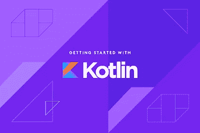
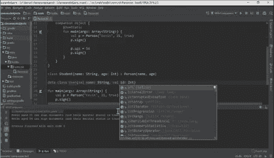
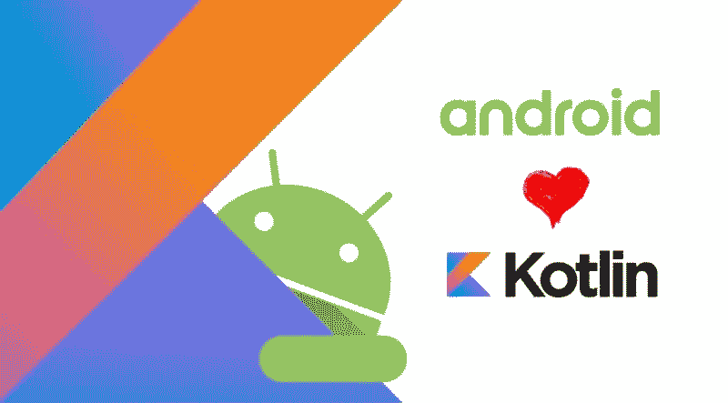
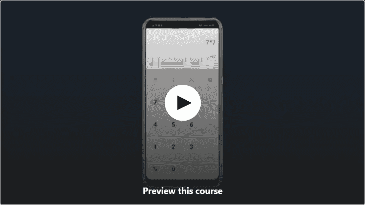
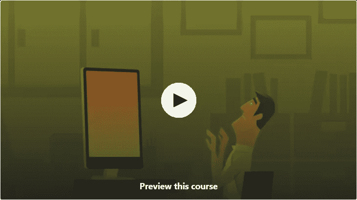
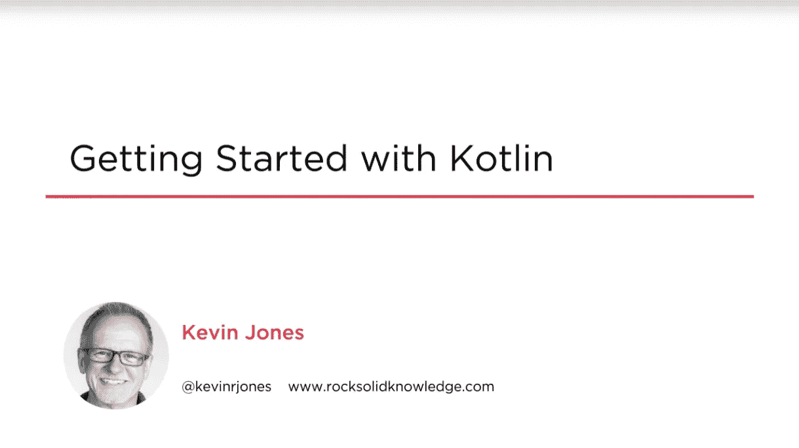

# 2023 年 7 个最适合初学者的免费 Kotlin 在线课程——最好的

> 原文：<https://medium.com/javarevisited/7-free-courses-to-learn-kotlin-in-2020-327c3872c1e1?source=collection_archive---------0----------------------->

大家好，如果你想在 2023 年学习 Kotlin 编程语言并寻找免费的 Kotlin 课程，那么你来对地方了。早些时候，我已经分享了[最好的 Kotlin 编程课程](/javarevisited/top-5-courses-to-learn-kotlin-in-2020-dfc3fa7706d8?source=---------16------------------) s，今天，我将分享 2023 年学习 Kotlin 的免费在线课程

如果你从事 Android 应用程序开发或服务器端 Java 开发，那么你可能听说过由 JetBrains 创建的 Kotlin 编程语言，JetBrains 是一家支持流行 ide 如 [IntelliJIDEA](https://itnext.io/top-5-intellijidea-and-android-studio-courses-for-java-and-android-programmers-afcc27309b60) 、PyCharm 和 WebStorm 的公司。

Kotlin 也是谷歌开发 Android 应用的官方语言。如果你不知道**什么是 Kotlin** 和**为什么你应该学习 Kotlin** ，那么让我告诉你，Kotlin 是一种成熟的编程语言，它提供了比传统编程语言如 [Java](https://www.java67.com/2018/08/top-10-free-java-courses-for-beginners-experienced-developers.html) 更多的好处，后者在过去的 25 年中经受了时间的考验。Kotlin 旨在解决 Java 编程语言的痛点，如冗长和样板文件。

Kotlin 已经存在了一段时间，但它真正腾飞是在 2017 年，当时谷歌选择它作为开发安卓应用的官方编程语言。

这引起了 Java 和 T2 Android 开发者学习 Kotlin 的浓厚兴趣，为什么不呢？它与 Java 完全兼容，在 Java 中用 20 行代码就能完成的事情，在 Kotlin 中用 5 行代码就能完成。

事实上，我一直在推荐 Java 开发人员学习 Kotlin，并分享了一些[书籍](https://javarevisited.blogspot.com/2018/02/kotlin-vs-java-which-language-android.html)和[课程](https://javarevisited.blogspot.com/2018/02/5-courses-to-learn-kotlin-programming-java-android.html#axzz6NpvpUald)来学习 Koltin，这也受到了你们许多人的喜爱，但也有人要求分享更多的[免费资源](https://www.java67.com/2020/05/5-free-courses-to-learn-kotlin-for-java-and-Android-developers.html)，如书籍、教程和课程。

这就是为什么，在这篇文章里，我要分享一些**2023 年学习科特林的最好的免费在线课程**。我从网上不同的网站上收集了这些课程，比如 Udemy、Pluralsight、Coursera 和 T21，谷歌甚至提供了一个完全免费的学习科特林的课程。你可以利用这些课程来学习 Kotlin 编程语言，包括基础和高级概念，以及服务器端 Java 开发和创建 Android 应用程序，Kotlin 在这两方面都有很大的发展。顺便说一下，如果你不介意花几块钱学习像 Kotlin 这样有价值的技能，那么我强烈推荐你去看看 Udemy 上的面向 Java 开发人员的 Kotlin 课程。您可以通过本课程学习用于服务器端 Java 开发以及 Android 平台移动应用开发的 Kotlin。

 [## 面向 Java 开发人员的 Kotlin:构建自己的 Kotlin 程序

### 您是一名 Java 开发人员，想知道是否需要学习 Kotlin 吗？也许你是一个有经验的 Java 开发人员，想要…

udemy.com](https://click.linksynergy.com/fs-bin/click?id=JVFxdTr9V80&subid=0&offerid=562016.1&type=10&tmpid=14538&RD_PARM1=https%3A%2F%2Fwww.udemy.com%2Fkotlin-for-java-developers%2F) 

# 2023 年学习 Kotlin 编程的 7 门最佳免费在线课程

不浪费你更多的时间，这里是我为 Java 和 Android 开发人员提供的学习 Kotlin 基础知识的最佳免费课程列表。这些免费课程来自于 [Udemy](https://javarevisited.blogspot.com/2019/08/top-10-udemy-courses-and-certifications-for-programmers.html) 、 [Pluralsight](/javarevisited/top-10-pluralsight-courses-to-learn-programming-and-software-development-during-covid-19-stay-at-30b7d8a4f88f) 、 [Coursera](/javarevisited/top-10-coursera-certificates-to-start-your-career-in-cloud-data-science-ai-mainframe-and-it-558690c83587) 几个最好的在线培训平台。不要以为免费就意味着质量低劣。它们是由教师出于教育和营销目的免费提供的，实际上是高质量的在线培训课程。

## 1.[面向初学者的 Kotlin:下一代 Android 平台语言](https://click.linksynergy.com/deeplink?id=JVFxdTr9V80&mid=39197&murl=https%3A%2F%2Fwww.udemy.com%2Fcourse%2Fkotlin-for-beginners-next-android-platform-language%2F)

这是在网上和 Udemy 上学习 Kotlin 的最佳免费课程。由 VJ Bambhaniya 创建的这个 3 个半小时的课程涵盖了 Kotlin 的基本和高级功能，并且**对 Android 和 Java 开发人员**或任何想在 2023 年学习 Kotlin 的人都很有用。

你将在简短但集中的科特林课程中学习到以下内容
1。如何在你的机器上安装 kot Lin
2？如何创建你的第一个 Kotlin 程序和变量。kotlin
4 中的类型。控制流程，条件
5。范围
6。循环:for，while repeat 循环
7。职能
8。完成本课程后，你将对什么是 Kotlin 以及如何在服务器开发、Android 开发以及 kotlin 支持的任何地方使用它有一个坚实的基础

**这里是报名这个免费课程的链接**——[Kotlin for 初学者:下一个 Android 平台语言](https://click.linksynergy.com/deeplink?id=JVFxdTr9V80&mid=39197&murl=https%3A%2F%2Fwww.udemy.com%2Fcourse%2Fkotlin-for-beginners-next-android-platform-language%2F)

谈到社会证明，这门课程的平均评分为 3.6，超过 12，140 名学生注册了这门课程，这充分说明了这门免费课程的质量。如果你正在寻找 2023 年学习科特林的免费课程，我强烈推荐你加入这个课程。

## 2.[科特林程序员训练营](https://codelabs.developers.google.com/codelabs/kotlin-bootcamp-welcome)

这是一个面向 Java 和 Android 开发人员的学习 Kotlin 的 bootcamp 课程。提供这门课程的不是别人，正是拥有 Android 平台的谷歌，以及 [Flutter](https://javarevisited.blogspot.com/2019/07/top-5-online-training-courses-to-learn-flutter.html) 、 [Golang](https://www.java67.com/2019/12/top-5-courses-to-learn-go-or-golang.html) 、 [Angular](https://javarevisited.blogspot.com/2018/06/5-best-courses-to-learn-angular.html) 、 [Dart](https://javarevisited.blogspot.com/2020/01/top-5-courses-to-learn-dart-programming.html) 、 [TensorFlow](/@javinpaul/top-10-courses-to-learn-tensorflow-for-machine-learning-in-2020-39a31e7cd84b) 和 [Google Cloud](https://javarevisited.blogspot.com/2019/07/top-5-google-cloud-platform-gcp-courses-certifications-online.html) 背后的公司。

在本课程中，您将学习 Kotlin 的基础知识，以及在 Java 上使用 [Kotlin 的好处](/javarevisited/kotlin-or-java-what-should-an-android-developer-learn-in-2019-e1f88c08cbad)，因为您将使用 IntelliJIDEA 编写许多小程序，intelli jidea 是 Java 和 Kotlin 开发人员的最佳 IDE 之一，也是由 Kotlin 编程语言的创造者 JetBrains 开发的。这个课程是由谷歌开发者代码实验室提供的，它提供了一个指导性的，实践性的编程体验。大多数 codelabs 会引导您完成构建小型应用程序或向现有应用程序添加新功能的过程。

**这里是注册这个免费课程的链接**——[科特林程序员训练营](https://codelabs.developers.google.com/codelabs/kotlin-bootcamp-welcome)

本课程也是 Android Kotlin Fundamentals 课程的先决条件，该课程是谷歌学习使用 Kotlin 进行 Android 应用开发的另一门免费课程。Android Kotlin 基础课程由谷歌开发人员培训团队创建。在课程中，您将学习 Android Kotlin 编程概念，并构建各种应用程序。

## 3.[掌握 Kotlin:零安全快速指南(30 分钟内)](https://click.linksynergy.com/deeplink?id=JVFxdTr9V80&mid=39197&murl=https%3A%2F%2Fwww.udemy.com%2Fcourse%2Fnull-safe-kotlin%2F)

这是一个非常短的课程，学习 Kotlin 如何提供空安全，空安全是 Java 开发人员在过去 25 年中的一个主要问题。本课程由 Skill Centric 创建，在 30 分钟内提供一些关于 Kotlin 类型系统的有用信息。

你会学到以下的东西简短但重点突出的科特林课程
1。Java 和 Kotlin 类型系统之间的差异。
2。了解 Kotlin 将如何帮助您在编译时而不是运行时处理臭名昭著的 NullPointerException。
3。可空、非空和平台类型之间的差异。
4。安全呼叫操作员
5。完成本课程后，你将会非常熟悉 Kotlin 的可空性，这是该语言的主要优势和核心特性之一。

**这里是报名参加这个免费课程的链接**——[掌握 Kotlin:零安全快速指南(30 分钟内)](https://click.linksynergy.com/deeplink?id=JVFxdTr9V80&mid=39197&murl=https%3A%2F%2Fwww.udemy.com%2Fcourse%2Fnull-safe-kotlin%2F)

您还将学习安全强制转换操作符、非空断言、let 函数，以及其他一些在 Kotlin 编程语言中处理可空类型的重要技术。总的来说，这是一个学习 Kotlin 安全特性的免费课程。

## 4.[一小时科特林初学者指南](https://click.linksynergy.com/deeplink?id=JVFxdTr9V80&mid=39197&murl=https%3A%2F%2Fwww.udemy.com%2Fcourse%2Fone-hour-kotlin-guide-for-beginners%2F)

这是 Udemy 上面向 Java 和 Android 开发人员的另一个学习 Kotlin 的免费课程。这是一本从 Kotlin basic 到 OOP 编程的简洁快速的 Kotlin 指南。

课程包含了差不多 1 个半小时的内容用 Kotlin 学习[面向对象编程](/javarevisited/my-favorite-courses-to-learn-object-oriented-programming-and-design-in-2019-197bab351733)你会在这个课程中学到以下的东西:

1 .科特林基础
2。Kotlin 文件结构&包
3。数据类型和变量
4。数组，列表，映射，迭代器
5。功能
6。循环和条件表达式
7。属性和零安全
8。lateinit，懒
9。Kotlin 面向对象编程

**这里是注册这个免费课程**的链接——一个[一小时的科特林初学者指南](https://click.linksynergy.com/deeplink?id=JVFxdTr9V80&mid=39197&murl=https%3A%2F%2Fwww.udemy.com%2Fcourse%2Fone-hour-kotlin-guide-for-beginners%2F)

完成这个免费的 Kotlin 课程后，你应该对如何用 Kotlin 写代码和使用它的[面向对象编程](/swlh/5-free-object-oriented-programming-online-courses-for-programmers-156afd0a3a73)特性有很好的了解。谈到社会证明，这门课程的平均评分为 4.2 分，超过 6000 名学生注册了这门课程，这充分说明了这门课程的实用性。

## 5.[面向初学者的 kot Lin Android 编程:计算器应用](https://click.linksynergy.com/deeplink?id=JVFxdTr9V80&mid=39197&murl=https%3A%2F%2Fwww.udemy.com%2Fcourse%2Fandroid-programming-with-kotlin-for-beginner-calculator-app%2F)

这是一个基于项目的课程，免费学习 Kotlin 编程。如果你正在学习 Kotlin 来开发 Android 应用程序，那么这是一个完美的开始课程，因为你将从头开始开发一个计算器应用程序。

本课程由 Philipp Cherubim 创建，将教你如何用 Kotlin 编写代码并使用 Android Studio，这是最流行的 Android 开发 IDE。

在这个过程中，您还将学习关于 android 框架的活动、片段和视图的基本知识。您将创建自定义视图，并在约束布局中对其进行布局。

您将了解模型-视图-演示者架构的优势，如何使用它，以及如何在我们的计算器应用程序中实现它。总的来说，这是一门学习 Kotlin 和创建 Android 应用程序的好课程。

**这里是免费加入本课程的链接—** [面向初学者的 kot Lin Android 编程:计算器应用](https://click.linksynergy.com/deeplink?id=JVFxdTr9V80&mid=39197&murl=https%3A%2F%2Fwww.udemy.com%2Fcourse%2Fandroid-programming-with-kotlin-for-beginner-calculator-app%2F)

## 6.[中级 Android:kot Lin 中的跳转惊吓应用克隆](https://click.linksynergy.com/deeplink?id=JVFxdTr9V80&mid=39197&murl=https%3A%2F%2Fwww.udemy.com%2Fcourse%2Fshock-app-clone-in-kotlin%2F)

这是另一个基于项目的免费实践课程，学习用于构建 Android 应用程序和游戏的 Kotlin。在本课程中，@Chrimson Altima 将教你如何使用 Kotlin 编程语言构建一个 Jump Scare 应用克隆。

在本课程中，您将学到以下内容:

1.  学习休克恶作剧应用程序中使用的技术
2.  如何在共享偏好设置中储存对象
3.  如何将图像下载到应用存储
4.  如何使用 TextToSpeech

总的来说，这是一个很好的课程，可以创建一个有趣的 Android 应用程序，还可以学习 Kotlin 编程语言，为你的简历增加一项有价值的技能。

**这里是免费加入本课程的链接—** [**中级安卓:跳吓 App 克隆在科特林**](https://click.linksynergy.com/deeplink?id=JVFxdTr9V80&mid=39197&murl=https%3A%2F%2Fwww.udemy.com%2Fcourse%2Fshock-app-clone-in-kotlin%2F)

## 7.[凯文·琼斯《科特林入门》](https://pluralsight.pxf.io/c/1193463/424552/7490?u=https%3A%2F%2Fwww.pluralsight.com%2Fcourses%2Fkotlin-getting-started)

本课程旨在向您介绍 Kotlin，帮助您快速开发应用程序。这也是一门非常实用的实践课程，非常适合希望使用 Kotlin 进行服务器端和 Android 应用程序开发的 Java 和 Android 开发人员。在本课程中，你将学到以下内容。如何安装 Kotlin 工具并设置 ide 以使用 Kotlin
2。如何使用 Kotlin
3 的面向对象特性？如何使用 Kotlin
4 的编程特性？如何在 Kotlin 中编写和运行测试完成本课程后，您将对 Kotlin 的基本语法和特性有一个坚实的知识基础。

**这里是报名参加这个免费课程的链接**——[凯文·琼斯的 Kotlin 入门](https://pluralsight.pxf.io/c/1193463/424552/7490?u=https%3A%2F%2Fwww.pluralsight.com%2Fcourses%2Fkotlin-getting-started)

顺便说一句，你需要一个[多重视野会员](https://pluralsight.pxf.io/c/1193463/424552/7490?u=https%3A%2F%2Fwww.pluralsight.com%2Fpricing)才能进入这个课程。如果您没有 Pluralsight 会员资格，那么您也可以利用他们的 [10 天免费试用](https://pluralsight.pxf.io/c/1193463/424552/7490?u=https%3A%2F%2Fwww.pluralsight.com%2Flearn)来免费访问该课程，因为他们的免费试用提供 200 分钟免费访问他们所有 5000 多个最新的在线培训课程，包括 Kotlin 和 Java。

 [## 个人技术技能|多视角

### 培养你在职业生涯中更快发展所需的技术技能。掌握最新的技术与数以千计的…

多元视觉](https://pluralsight.pxf.io/c/1193463/424552/7490?u=https%3A%2F%2Fwww.pluralsight.com%2Flearn) 

以上就是学习 Kotlin 编程语言的一些**免费课程。Java 已经有将近 25 年的历史了，它没有太大的变化，Kotlin 就像是 Java 的现代版，解决了它的许多缺点，比如冗长。**

它还提供了 OOP 和函数式编程的良好平衡，这使它成为一种伟大的编程语言，值得在 2023 年学习。如果你想在 2023 年学习科特林，那么这些免费的在线培训课程肯定会帮助你。

其他**免费编程课程和文章**你可能喜欢

*   [2023 年 Java 开发者路线图](https://javarevisited.blogspot.com/2019/10/the-java-developer-roadmap.html#123)
*   [5 门免费学习核心 Java 的在线课程](http://javarevisited.blogspot.sg/2017/11/top-5-free-java-courses-for-beginners.html#axzz4zuIICRs9)
*   [2023 年 Java 程序员可以学习的 10 个框架](https://javarevisited.blogspot.com/2018/04/top-5-java-frameworks-to-learn-in-2018_27.html)
*   [5 门学习数据结构和算法的免费课程](http://javarevisited.blogspot.sg/2018/01/top-5-free-data-structure-and-algorithm-courses-java--c-programmers.html#axzz55lOcYrUM)
*   [5 门免费学习 Angular 的在线培训课程](http://www.java67.com/2018/01/top-5-free-angular-js-online-courses-for-web-developers.html)
*   [面向有经验程序员的 10 门高级核心 Java 课程](https://javarevisited.blogspot.com/2020/04/top-10-advanced-core-java-courses-for-experienced-developers.html)
*   [面向 Java 和 Web 开发人员的 5 个节点 JS 课程](http://javarevisited.blogspot.sg/2018/01/top-5-nodejs-and-express-js-online-courses-for-web-developers.html)
*   [学习大数据和 Apache Spark 的 5 门课程](http://javarevisited.blogspot.com/2017/12/top-5-courses-to-learn-big-data-and.html)
*   [2023 年学习 Spring Boot 的 10 门免费课程](/javarevisited/10-free-spring-boot-tutorials-and-courses-for-java-developers-53dfe084587e)
*   [7 门免费课程学习数据库和 SQL](/javarevisited/7-free-courses-to-learn-database-and-sql-for-programmers-and-data-scientist-e7ae19514ed2)
*   [Java 开发者学习 Android 的 5 门课程](http://javarevisited.blogspot.sg/2017/12/top-5-android-online-training-courses-for-Java-developers.html)
*   [成为全栈 Java 开发人员的前 5 门课程](https://javarevisited.blogspot.com/2020/04/top-5-courses-to-become-full-stack-java-developer-with-Angular-and-Reactjs.html)
*   [学习 Git 和 Github 的 5 门免费课程](http://javarevisited.blogspot.sg/2018/01/5-free-git-courses-for-programmers-to-learn-online.html#axzz568Oo1Jao)
*   [面向 Java 开发者的 5 门免费 Spring 框架课程](http://www.java67.com/2017/11/top-5-free-core-spring-mvc-courses-learn-online.html)

感谢您阅读本文。如果你喜欢这些免费的 Kotlin 课程，并觉得它们很有用，那么请与你的朋友和同事分享。如果您有任何问题或反馈，请留言。

**附言——**如果你不介意花点钱学习像 Kotlin 这样有价值的技能，那么我强烈推荐你去看看 Udemy 上的[**kot Lin for Java Developer**](https://click.linksynergy.com/fs-bin/click?id=JVFxdTr9V80&subid=0&offerid=562016.1&type=10&tmpid=14538&RD_PARM1=https%3A%2F%2Fwww.udemy.com%2Fkotlin-for-java-developers%2F)课程，它既全面又非常吸引人。您可以通过本课程学习用于服务器端 Java 开发以及 Android 平台移动应用开发的 Kotlin。

 [## 面向 Java 开发人员的 Kotlin:构建自己的 Kotlin 程序

### 您是一名 Java 开发人员，想知道是否需要学习 Kotlin 吗？也许你是一个有经验的 Java 开发人员，想要…

udemy.com](https://click.linksynergy.com/fs-bin/click?id=JVFxdTr9V80&subid=0&offerid=562016.1&type=10&tmpid=14538&RD_PARM1=https%3A%2F%2Fwww.udemy.com%2Fkotlin-for-java-developers%2F)