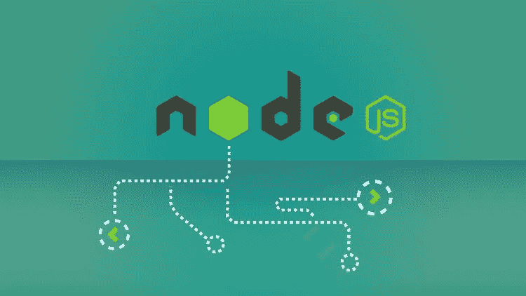
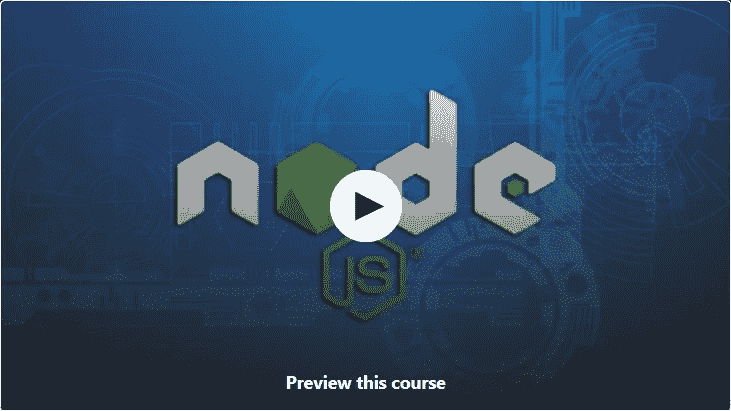
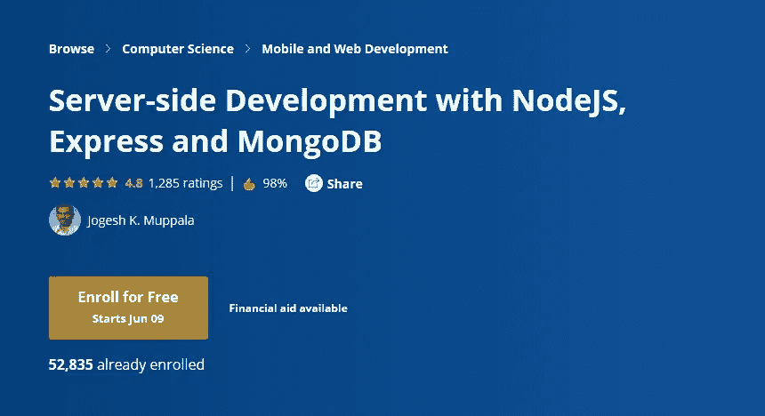
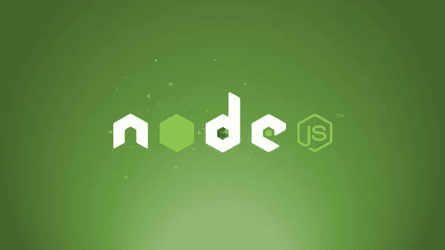
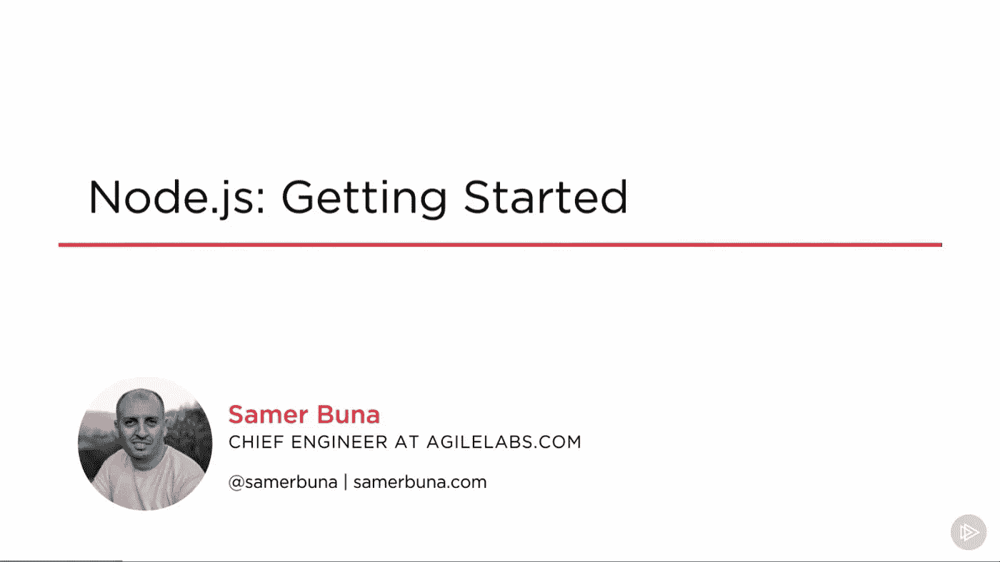
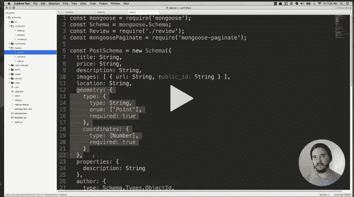
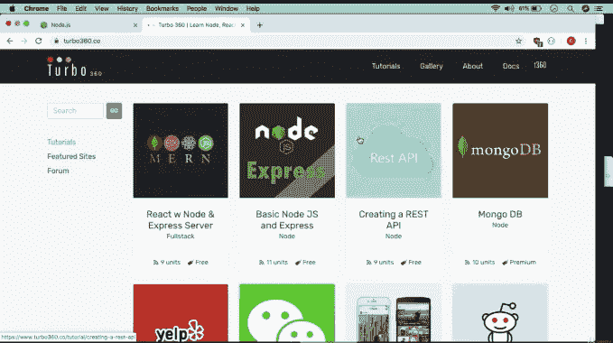

# 2023 年学习 Node.js 的 10 大免费课程——最佳选择

> 原文：<https://medium.com/javarevisited/7-free-courses-to-learn-node-js-in-2020-2f1dd6722b49?source=collection_archive---------0----------------------->

## 这些是 Udemy、Coursera、Pluralsight、edX 和 freeCodecamp 提供的 2023 年在线学习 Nodejs 的最佳免费在线课程

image_credit — NodeJS —完整指南(包括 MVC、REST APIs、GraphQL)

Node.js 完全改变了 JavaScript 用于开发的方式。早期的 JavaScript 被认为是一种客户端语言，因为它运行在浏览器上，主要用于客户端验证、动画和交互。

**Node.js** 允许 JavaScript 在服务器端运行，这意味着你现在可以编写无需浏览器就能执行的 JavaScript 应用程序。 [Node JS](https://javarevisited.blogspot.com/2018/01/top-5-nodejs-and-express-js-online-courses-for-web-developers.html#axzz5VllnxgVT) 使用谷歌 Chrome 的执行引擎和异步处理来做到这一点。

您所需要做的就是在您的应用程序中包含一个 node.js 脚本，然后您就可以用 [JavaScript](/javarevisited/12-free-courses-to-learn-javascript-and-es6-for-beginners-and-experienced-developers-aa35874c9a32) 创建服务器端应用程序了，这在几年前还是不可能的。

Node.js 在仅使用一种编程语言进行全栈开发方面也发挥了重要作用，因为现在 JavaScript 开发人员可以使用 [Node.js](https://www.java67.com/2019/07/top-5-free-nodejs-courses-for-web-development.html) 和 [React.js](/@javinpaul/top-5-courses-to-learn-react-js-in-2019-best-of-lot-fa02cd96cdf0) 或他们想要的任何栈来创建端到端的 web 应用程序。底线是他们将在客户端和服务器端都使用 JavaScript。

由于 **Node.js** 和 **JavaScript** 的巨大人气，很多程序员也在学习 JavaScript 和 Node.js 框架成为 web 开发者，主要是 [**全栈开发者**](https://javarevisited.blogspot.com/2019/01/10-web-development-frameworks-fullstack-developer-should-learn.html) ，这也是这些在线课程帮助很大的地方。

过去，我曾为 Web 开发人员分享过一些 [best Node.js 在线课程](https://javarevisited.blogspot.com/2018/01/top-5-nodejs-and-express-js-online-courses-for-web-developers.html)，我的许多读者都非常喜欢和欣赏。尽管如此，他们中的一些人还询问了那些付费课程的免费替代品，这样他们就不用投资任何钱就可以开始了。

谢天谢地，互联网上到处都是优秀的免费资源，我也鼓励你向它们学习。他们不仅能很好地了解 node.js 是什么，以及它如何帮助你用 JavaScript 创建一个服务器端应用程序，还能教会你 node.js 的所有细节，并带你创建一个端到端的应用程序。

即使我是个书呆子，读了几百本书，网络课程还是改变了我学习新技术的方式。现在我开始上课，学习一些基础知识，比如建立我的开发环境和编写我的前几个程序。一旦我掌握了技术，我会接着看一本书来进一步巩固和深入学习。

我稍后会分享 Node.js 的书籍，但现在是时候从 [Coursera](https://coursera.pxf.io/c/3294490/1164545/14726?u=https%3A%2F%2Fwww.coursera.org%2F) 、 [Udemy](https://click.linksynergy.com/fs-bin/click?id=JVFxdTr9V80&offerid=323058.9410&type=3&subid=0) 、 [Pluralsight](https://pluralsight.pxf.io/c/1193463/424552/7490?u=https%3A%2F%2Fwww.pluralsight.com%2Flearn) 和[edX.org](https://www.awin1.com/cread.php?awinmid=6798&awinaffid=631878&clickref=&p=)那里获得一些最好的免费在线 Node.js 课程，开始你的 Node.js 开发之旅。

顺便说一句，如果你不介意花几块钱学习 Node.js 这样有价值的东西，那么我也建议你去看看我最喜欢的 Udemy 导师之一马克西米利安的[**Nodejs——T2**](https://click.linksynergy.com/deeplink?id=JVFxdTr9V80&mid=39197&murl=https%3A%2F%2Fwww.udemy.com%2Fcourse%2Fnodejs-the-complete-guide%2F)完全指南。这也是，自己自学 Node.js 最好的课程之一。

 [## NodeJS -完整指南(包括 MVC、REST APIs、GraphQL)

### 加入 Udemy 上最全面的 Node.js 课程，以实践和理论相结合的方式学习 Node

udemy.com](https://click.linksynergy.com/deeplink?id=JVFxdTr9V80&mid=39197&murl=https%3A%2F%2Fwww.udemy.com%2Fcourse%2Fnodejs-the-complete-guide%2F) 

# 初学者学习 Node.js 的 10 个最佳免费在线课程

这些课程侧重于 Node.js 基础知识和基本原理以及一些动手编程。如果你已经知道 Node.js，你可能会发现它们有点重复，在这种情况下，我建议你参加一些我之前分享的[高级 Node.js 课程](https://javarevisited.blogspot.com/2018/01/top-5-nodejs-and-express-js-online-courses-for-web-developers.html)。为了不再浪费你的时间，这里是我列出的一些优秀的免费 Node.js 课程，你可以在你舒适的办公室和家里在线学习。这些 Node.js 课程是我为初学者精心挑选的。

## 1. [Node JS API 开发初学者](https://click.linksynergy.com/deeplink?id=JVFxdTr9V80&mid=39197&murl=https%3A%2F%2Fwww.udemy.com%2Fnode-js-api-tutorial%2F) (Udemy)

这是你能在网上得到的最好的 Node JS 初学者课程之一。在本课程中，您将从零开始学习 Node JS API 开发。

本课程就像一本完整的初学者入门指南，您将从什么是 node js 和为什么学习 node.js 开始，到安装 node js 开发环境，并了解 [JavaScript](https://dzone.com/articles/top-5-angular-2-courses-for-web-developers) 如何在浏览器和非浏览器背景下执行。

在本课程中，您将学习现代 JavaScript、节点 JS 事件循环、异步编程、使用节点模块、npm 模块、创建自己的模块、创建服务器、连接数据库、发送 json 响应。

它很好地结合了理论和实践，这在免费课程中是很难得到的。谈到社交证明，超过 11，605 名学生已经从中受益，近 500 名参与者平均给它打了 4.3 分。

**这里是报名本课程的链接**——[Node JS API 开发初学者](https://click.linksynergy.com/deeplink?id=JVFxdTr9V80&mid=39197&murl=https%3A%2F%2Fwww.udemy.com%2Fnode-js-api-tutorial%2F)

非常感谢讲师 Ryan Dhungel 创建了这门课程，并向学习者免费开放。

## 2.[使用 NodeJS、Express 和 MongoDB 进行服务器端开发](https://coursera.pxf.io/c/3294490/1164545/14726?u=https%3A%2F%2Fwww.coursera.org%2Flearn%2Fserver-side-nodejs)

这是 Coursera 的另一个免费 Node.js 课程，Coursera 是我最喜欢的一个知名机构的在线学习网站。此课程也由香港科技大学提供。本课程首先简要概述了 HTTP 和 HTTPS 等 web 协议，然后解释了用于构建 Web 服务器的 NodeJS 和 NodeJS 模块，如 Express。

在数据库方面，您将回顾基本的 CRUD 操作、 [NoSQL 数据库](https://javarevisited.blogspot.com/2019/03/top-5-nosql-database-web-developers-should-learn.html)，特别是 [MongoDB](https://www.java67.com/2020/06/top-5-courses-to-learn-mern-stack-for-web-development.html) 和 Mongoose，用于从 NodeJS 访问 MongoDB。

之后，您将学习基本的 REST 概念，以及如何构建一个具有认证和安全特性的 RESTful API。最后，您将了解后端即服务(BaaS)方法，包括移动 BaaS、开源和商业 BaaS 服务。

**这里是报名本课程的链接** — [使用 NodeJS、Express 和 MongoDB 进行服务器端开发](https://coursera.pxf.io/c/3294490/1164545/14726?u=https%3A%2F%2Fwww.coursera.org%2Flearn%2Fserver-side-nodejs)

本课程也是 [**用 React**](https://coursera.pxf.io/c/3294490/1164545/14726?u=https%3A%2F%2Fwww.coursera.org%2Fspecializations%2Ffull-stack-react) 进行全栈 Web 开发的一部分。如果你不知道，专业化是帮助你掌握一项技能的一系列课程。完成本课程后，您的进步将计入您在本专业的学习中。

与许多 Coursera 课程一样，这也是 T2 的免费审核课程，这意味着你可以免费学习课程，但不会获得证书或评分。如果你需要一个许可证，那么你需要为此付费并完成专业化的其他课程，其中也包含一个适合一些现实世界经验的项目。

如果你发现 Coursera 的课程很有用，因为它们是由知名公司如**谷歌**、 **IBM** 、**亚马逊**和世界上最好的大学创建的，我建议你加入 Coursera 的年度订阅计划[**Coursera Plu**](https://coursera.pxf.io/c/3294490/1164545/14726?u=https%3A%2F%2Fwww.coursera.org%2Fcourseraplus)**s**。

 [## Coursera Plus |无限制访问 7，000 多门在线课程

### 用 Coursera Plus 投资你的职业目标。无限制访问 90%以上的课程、项目…

coursera.pxf.io](https://coursera.pxf.io/c/3294490/1164545/14726?u=https%3A%2F%2Fwww.coursera.org%2Fcourseraplus) 

这种单次订阅可以让你无限制地访问他们最受欢迎的**课程**、**专业**、**专业证书**和**指导项目**。它每年花费大约 399 美元，但是它完全物有所值，因为你可以获得无限制的证书。

## 3.[NodeJS](https://www.awin1.com/cread.php?awinmid=6798&awinaffid=631878&clickref=&p=%5B%5Bhttps%3A%2F%2Fwww.edx.org%2Fcourse%2Fintroduction-to-nodejs)(edX)简介

这是另一个学习 Node 的优秀免费课程。来自微软和 edX 团队的 Js。使用 Node.js、Express 和 MongoDB 创建 web 应用程序的入门指南。

在这个免费的 Node JS 课程中，你会学到 Node.js 的基础知识及其核心模块。您还将学习如何导入额外的模块，以及如何使用 npm 配置您的项目。从那里，您将看到如何使用 Express 来建立一个 web 服务器，以及如何使用 Mongoose 与一个 [MongoDB](https://javarevisited.blogspot.com/2019/01/top-5-mongodb-online-training-courses.html) 数据库交互。

本课程结束时，您将已经使用 node.js 创建了几个现实世界的项目，如 web scraper、博客 API 和数据库迁移脚本。总的来说，这是一个*完美的 node.js 初学者课程*来启动您的旅程。

**这里是报名这个课程的链接**——[NodeJS 简介](https://www.awin1.com/cread.php?awinmid=6798&awinaffid=631878&clickref=&p=%5B%5Bhttps%3A%2F%2Fwww.edx.org%2Fcourse%2Fintroduction-to-nodejs)

## 4.[节点介绍 JS &直通车](https://click.linksynergy.com/deeplink?id=JVFxdTr9V80&mid=39197&murl=https%3A%2F%2Fwww.udemy.com%2Fintro-to-node-js-express%2F) (Udemy 免费课程)

这是针对初学者的另一个关于 Node JS 和 Express 的免费入门课程。课程内容非常丰富，采取循序渐进的方式教授 Node JS 和 Express。10 集系列包括:

*   项目结构
*   静态资产
*   模板引擎
*   动态请求
*   处理过帐数据
*   渲染动态数据
*   造型和图像
*   中间件
*   部署

到本系列结束时，您将理解 Node/Express 项目的基础，并能够部署一个全功能的 web 应用程序。如果你是 [NodeJS](https://javarevisited.blogspot.com/2018/01/top-5-nodejs-and-express-js-online-courses-for-web-developers.html) 和[全栈开发](http://www.java67.com/2019/01/top-10-javascript-frameworks-and-libraries-for-web-developers.html)的初学者，我强烈推荐这门课程。

**这里是报名本课程的链接**——[节点介绍 JS &快递](https://click.linksynergy.com/deeplink?id=JVFxdTr9V80&mid=39197&murl=https%3A%2F%2Fwww.udemy.com%2Fintro-to-node-js-express%2F)

## 5. [Node.js:入门](https://pluralsight.pxf.io/c/1193463/424552/7490?u=https%3A%2F%2Fwww.pluralsight.com%2Fcourses%2Fnode-intro) (Pluralsight)

如果你有 Pluralsight 会员资格，那么你也可以在 Node.js 上参加这个优秀的初学者入门课程。由萨梅尔·布纳创建的

课程提供了 Node.js 的优秀概述，包括用回调和流编写异步代码，以及用 NPM 和`require()`模块化你的应用。在本课程中，您将了解 Node.js 的以下内容:

1.  节点 JS 的什么、怎样、怎样。
2.  节点的 REPL、模式、全局和实用程序
3.  节点的程序包管理器
4.  工作常用模块

您还将了解如何使用内置 API 来构建和扩展 web 应用程序以及一些关键的第三方模块。

**这里是报名本课程的链接**——[node . js:入门](https://pluralsight.pxf.io/c/1193463/424552/7490?u=https%3A%2F%2Fwww.pluralsight.com%2Fcourses%2Fnode-intro)

顺便说一句，这门课程并不是完全免费的，因为你需要一个 [**Pluralsight 会员**](https://pluralsight.pxf.io/c/1193463/424552/7490?u=https%3A%2F%2Fwww.pluralsight.com%2Fpricing) 才能进入这门课程，费用约为每月 29 美元或每年 299 美元，但也提供超过 5000 门关于 Pluralsight 最新技术的高质量在线课程。

像这样的会员资格对需要不断学习以保持最新的程序员来说是有益的。即使你没有会员资格，你也可以通过注册他们的 [**10 天免费试用**](http://pluralsight.pxf.io/c/1193463/424552/7490?u=https%3A%2F%2Fwww.pluralsight.com%2Flearn) 来参加这个课程，前提是你还没有参加过。

 [## 对个人来说

### Pluralsight 帮助个人学习者获得掌握最新软件开发所需的技术技能…

pluralsight.pxf.io](http://pluralsight.pxf.io/c/1193463/424552/7490?u=https%3A%2F%2Fwww.pluralsight.com%2Flearn) 

## 6.[带节点的代码:边做边学](https://click.linksynergy.com/deeplink?id=JVFxdTr9V80&mid=39197&murl=https%3A%2F%2Fwww.udemy.com%2Fcourse%2Fcode-with-node%2F) (Udemy 免费课程)

这是另一个实践节点 js 课程，可以在 Udemy 上免费获得。对于想要通过学习如何创建和部署 REST API 而成为全栈开发人员的初学者和有经验的程序员来说，这是一门很棒的课程

不像其他一些**免费在线课程**非常短，只涵盖一两个主题，这是一个全面的 Node.js 课程，有超过 19 个小时的内容和可下载的资源。超过 22，694 名学生已经信任了这门课程。

由 Ian Schoonover 创建，这是学习使用 Node.js 和 Express.js 进行中高级 web 开发和编程的理想课程。

您将学习如何动态调试错误，以及如何构建真实世界的功能，如分页、搜索、过滤、地理定位、聚类、地理空间索引、身份验证、授权、管理仪表板、用户配置文件、图像上传、支付等！

**这里是免费报名本课程的链接**——[代码带节点:边做边学](https://click.linksynergy.com/deeplink?id=JVFxdTr9V80&mid=39197&murl=https%3A%2F%2Fwww.udemy.com%2Fcourse%2Fcode-with-node%2F)

## 7.[3 小时学会 node . js](https://www.youtube.com/watch?v=RLtyhwFtXQA)(FreeCodecamp 免费课程)

这是 FreeCodecamp Youtube 频道上又一个完全免费的学习 Node.js 的课程。

在这个 3 小时的无广告课程中，您将从头开始了解 Node.js

如果您从 [2:25:24](https://www.youtube.com/watch?v=RLtyhwFtXQA&t=8724s) 运行节点应用程序时出现“错误:无法找到模块‘ejs’”的错误，请运行“npm 安装 ejs”来修复此错误

你可以在 Youtube 上免费观看本课程，或者点击以下链接:

## 8.[作品集网站带节点 JS & Express](https://click.linksynergy.com/deeplink?id=JVFxdTr9V80&mid=39197&murl=https%3A%2F%2Fwww.udemy.com%2Fcourse%2Fportfolio-website-with-node-js-express%2F) (Udemy 免费课程)

这是我最喜欢的在线培训平台 Udemy 上学习 Node.js 的又一个牛逼的免费课程。在这个实践性的、基于项目的课程中，您将使用 Node.js 和 Express.js 创建一个功能齐全的专业作品集网站

本课程由 Daniel Kwon 创建，内容超过 3 小时，已有 8000 名学生信任本课程。虽然您很早就开始了您的 capstone 项目，一个投资组合网站，并且在这个过程中，您还将学习请求路由、模板引擎、使用数据库、 [REST API](/javarevisited/top-5-books-and-courses-to-learn-restful-web-services-in-java-using-spring-mvc-and-spring-boot-79ec4b351d12) 、图像上传以及使用 jQuery 的 AJAX 请求。

总体而言，在本课程中，您将学到以下内容:

*   项目结构
*   模板引擎
*   请求路由
*   REST API
*   CRUD 操作
*   文件上传
*   博客和项目的 CMS
*   带有 jQuery 的 AJAX

这个免费的 Node.js 课程非常适合那些希望作为全栈开发人员进入专业 web 开发的人

**这里是免费报名本课程的链接** — [作品集网站带节点 JS &快递](https://click.linksynergy.com/deeplink?id=JVFxdTr9V80&mid=39197&murl=https%3A%2F%2Fwww.udemy.com%2Fcourse%2Fportfolio-website-with-node-js-express%2F)

## 9.[2023 年完成 Node.js 开发者上 ZTM 书院](https://academy.zerotomastery.io/a/aff_dcjk8l8t/external?affcode=441520_zytgk2dn)【不免费】

这是 2023 年学习 Node.js 的又一个全面、最新的在线培训课程。拥有 48 小时的 Node.js 内容，这是在线提供的最全面和优质的培训课程之一。

它不仅涵盖了 Node.js 基础知识，还涵盖了所有相关技术，如 Express、 [GraphQL](/javarevisited/top-5-graphql-tutorials-and-courses-for-beginners-fb5543506fc2) 、 [REST](/javarevisited/6-best-rest-api-tools-for-testing-design-and-development-1c5f69ed1f22) 、 [MongoDB](/javarevisited/5-best-mongodb-courses-to-learn-nosql-for-beginners-in-2020-42df5af5496c) 、MERN +等等。

您还将了解基本 web 开发概念和工作，如集成 API、身份验证、文件 I/O、数据库(SQL、MongoDB)、Express Framework、套接字以及后端开发人员应该知道的许多其他重要主题。

本课程最棒的地方在于它是基于项目的，你将构建并部署一个 [MERN](/javarevisited/how-to-learn-mern-stack-from-scratch-1784618eaffa) (MongoDb，Express，React，Node)全栈应用并投入生产。在此过程中，您还将学习负载平衡、监控、 [CI/CD](/javarevisited/7-best-courses-to-learn-jenkins-and-ci-cd-for-devops-engineers-and-software-developers-df2de8fe38f3) 和零停机部署等关键概念。

总的来说，2023 年后端开发者最好的 Node.js 课程之一。不幸的是，这不是免费的，但它绝对值得一看，你可以观看预习课程来学习 Node.js 基础知识，并了解课程的质量。

**这里是了解更多的链接—**[2023 年完成 Node.js 开发者](https://academy.zerotomastery.io/a/aff_dcjk8l8t/external?affcode=441520_zytgk2dn)

正如我所说的，它不是免费的，你需要一个 ZTM 会员才能观看这个课程，这个课程每月花费大约 39 美元，但也提供了许多像这样的超级有趣和有用的课程。您还可以使用优惠券代码 FRIENDS10 获得本课程或您选择的任何订阅的 10%折扣。

 [## 学习需求技能。被录用。推进你的事业。|零到精通

### 最终你是唯一能控制它的人。呵呵......每个人学习的速度不同，但是学生…

academy.zerotomastery.io](https://academy.zerotomastery.io/a/aff_c0gnlvf7/external?affcode=441520_zytgk2dn) 

以上是关于 2023 年和未来几年学习 Node.js 或 Node JS 的一些**最好的免费在线课程。这些对任何初学 Node.js 的人来说都是极好的资源，包括来自像 [Udemy](https://javarevisited.blogspot.com/2019/10/udemy-vs-pluralsight-review-which-is-better-to-learn-code.html) 、 [Coursera](https://javarevisited.blogspot.com/2019/10/top-5-coursera-professional-certificates-for-programmers-IT-professionals.html) 、[edX.org](https://javarevisited.blogspot.com/2020/02/does-udemy-coursera-edx-educative-or.html)和 [Pluralsight](https://dev.to/javinpaul/pluralsight-vs-udemy-review-which-is-better-for-software-developers-276c) 这样的网站的免费课程。**

它们不是课堂培训，所以你不需要去任何地方参加。你可以在办公室和家里在线学习这些课程。

一旦你学完了这些课程，想学习 Node.js 的高级概念或者深入探索 Node.js，那么你也可以参考以下资源，它们不是免费的，但也不是很贵，完全值得你花时间和金钱。

其他 **Web 开发资源**您可能喜欢:

*   [柯尔特·斯蒂尔的网络开发者训练营](https://click.linksynergy.com/deeplink?id=JVFxdTr9V80&mid=39197&murl=https%3A%2F%2Fwww.udemy.com%2Fthe-web-developer-bootcamp%2F)
*   [学习 Web 开发的五大课程](https://javarevisited.blogspot.com/2019/01/top-5-online-courses-to-become-web-developer.html)
*   [学习 React 框架的前 5 门课程](https://javarevisited.blogspot.com/2019/04/10-free-angular-and-react-courses-for.html)
*   [如何在 2023 年成为一名网页开发者](https://hackernoon.com/the-2019-web-developer-roadmap-ab89ac3c380e)
*   [初学者学习棱角的 10 门免费课程](/javarevisited/top-10-free-courses-to-learn-angular-framework-in-2020-bb62148c73d3)
*   [2023 年 React 开发者路线图](https://javarevisited.blogspot.com/2018/10/the-2018-react-developer-roadmap.html)
*   学习 Web 开发永远不会晚。
*   [2023 年学习反应的 10 门免费课程](/javarevisited/top-10-free-courses-to-learn-react-js-c14edbd3b35f)
*   [网络开发者路线图(前端+后端)](https://dev.to/javinpaul/the-2019-web-development-frontend-backend-roadmap-4le2)
*   [为网络开发者提供 5 门免费的 HTML 和 CSS 课程](http://www.java67.com/2018/02/5-free-html-and-css-courses-to-learn-web-development.html)
*   [10 门面向程序员的 Java 和 Web 开发课程](https://javarevisited.blogspot.com/2018/01/top-10-udemy-courses-for-java-and-web-developers.html)
*   [每个软件工程师都应该学习的 10 件事](/swlh/10-things-every-programmer-should-know-26ba37cfcaf4)
*   [2023 年 Java 和 Web 开发者可以学习的 10 个框架](https://dev.to/javinpaul/10-frameworks-java-and-web-developers-can-learn-in-2019-17ke)

感谢您阅读本文。如果你喜欢这些最好的免费节点 JS 课程，那么请分享给你的朋友和同事。如果您有任何问题或反馈，请留言。

**附:——**如果你不介意花几块钱学习 Node.js 这样有价值的东西，那么我也建议你去看看[**Andrew Mead 和 Rob Percival 的《Node.js 开发人员完整教程**](https://click.linksynergy.com/deeplink?id=JVFxdTr9V80&mid=39197&murl=https%3A%2F%2Fwww.udemy.com%2Fthe-complete-nodejs-developer-course-2%2F) ，这是在线学习 Node js 最好的课程之一。

 [## 完整的 Node.js 开发人员课程(第三版)

### 这包括新内容、更新版本、新功能等。-你以前学过 Node 吗？你开始…

udemy.com](https://click.linksynergy.com/deeplink?id=JVFxdTr9V80&mid=39197&murl=https%3A%2F%2Fwww.udemy.com%2Fthe-complete-nodejs-developer-course-2%2F)