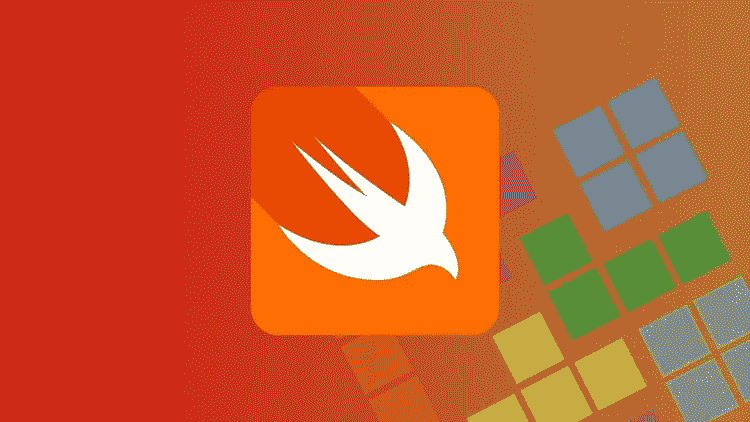
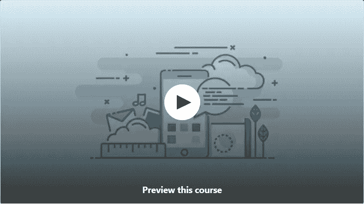
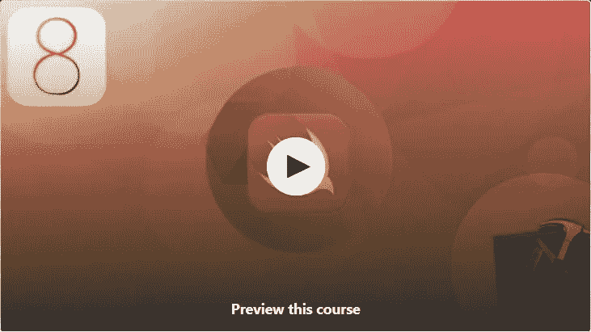
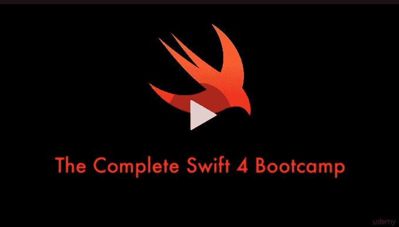
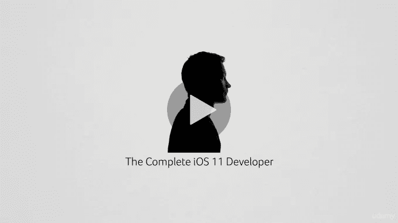
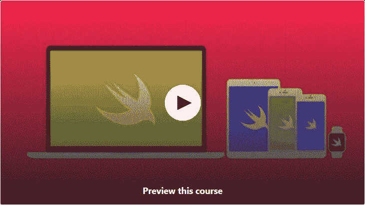

# 2023 年学习 Swift 编程语言的 7 门最佳免费在线课程

> 原文：<https://medium.com/javarevisited/7-free-courses-to-learn-swift-programming-language-in-2020-f40ac9d3ee53?source=collection_archive---------0----------------------->

## 想学 iOS 编程吗？这些免费的 Swift 编程课程可以帮助你。

image_creit- Udemy

大家好，这个慵懒的周六过得怎么样？你想学习编码和如何创建一个 iOS 应用吗？如果是的话，那么你来对地方了。在过去，我已经分享了 [**最佳 iOS 应用程序开发课程**](/javarevisited/top-5-online-courses-to-learn-ios-12-swift-in-2019-a35ae1be7b2b) 、 [**最佳 iOS 应用程序开发项目**](/javarevisited/my-favorite-ios-app-project-ideas-for-beginners-a873e7e6f88a) **、**和 [**最佳应用程序开发工具**](https://javinpaul.medium.com/10-frameworks-and-libraries-mobile-application-developers-can-learn-in-2020-e0b91391cade) ，在本文中，我将分享 7 个最佳免费在线培训课程，以学习 Swift 并开发 [iOS 应用程序](https://javarevisited.blogspot.com/2019/01/top-5-ios-developer-course-to-learn-ios.html)。

Swift 是苹果公司的官方编程语言，用于创建包括 iPad 和 iPhones 在内的 iOS 应用程序。

像苹果的其他产品一样，Swift 是苹果的一种伟大的编程语言，所以你会发现苹果产品的所有伟大之处。

只是因为苹果在创造它的时候，一直把教育放在心上。如果你有 iPad，你可能也见过 Swift Playground 应用程序，这也是一个学习 Swift 和 iOS 的很好的应用程序。

尽管如此，学习 Swift 的最重要原因是进入 iOS 应用市场，这不仅令人兴奋，而且利润丰厚。有大量的工作提供给 [iOS 开发者](/javarevisited/my-favorite-free-courses-to-learn-ios-app-development-f172e7d3ba5d)，如果你不想为别人开发应用程序，你可以自己做，利用你的技能赚取可观的收入。

如果你是从编程开始，那么 [Swift](https://developer.apple.com/swift/) 也是一个不错的入门语言。它的设计考虑到了教育和苹果的 Swift IDE，Xcode

Swift 不仅仅局限于 iOS，还可以在 Swift 中为 macOS、watchOS、tvOS 和 [Linux](http://www.java67.com/2018/02/5-free-linux-unix-courses-for-programmers-learn-online.html) 开发应用程序。这是一种通用的、多范例的、编译过的编程语言，它扩展了 Objective-C 的功能，Objective-C 早期用于为 iPhone 和 iPad 开发游戏和应用程序。

顺便说一下，如果你不介意花 10 美元购买一个优秀的资源，那么我建议你看看这个由 Angela Yu 编写的 [**iOS 和 Swift boot camp**](https://click.linksynergy.com/deeplink?id=JVFxdTr9V80&mid=39197&murl=https%3A%2F%2Fwww.udemy.com%2Fcourse%2Fios-13-app-development-bootcamp%2F)**，，这是一个真正伟大的资源，完全值得你的时间和金钱。**

**<https://click.linksynergy.com/deeplink?id=JVFxdTr9V80&mid=39197&murl=https%3A%2F%2Fwww.udemy.com%2Fcourse%2Fios-13-app-development-bootcamp%2F>  

# 2023 年供 iOS 开发人员学习的 7 大免费 Swift 在线课程

如果你对开发一个 iOS 应用感兴趣，想学习 Swift，那么你来对地方了。在本文中，我将分享一些学习 Swift 的最佳在线培训课程，这些课程也是免费提供的。

## 1.[iOS 11 开发介绍:Swift 4 和 Xcode 9](https://click.linksynergy.com/deeplink?id=JVFxdTr9V80&mid=39197&murl=https%3A%2F%2Fwww.udemy.com%2Fios11development%2F)

对于希望学习 Swift 来开发 iPhone 和 iPad 游戏等 iOS 应用程序的初学者来说，这是一门极好的课程。本课程涵盖了苹果公司最新版本的 iPhone 操作系统，如 iOS 11。

课程将以 bootcamp 的方式教你 iOS 11 和 Swift 的基础知识。您还将开发两个项目，以获得一些动手实践，并有机会应用您在本课程中学到的所有概念。

课程是**免费的，但我不确定它会免费多久，因为大多数 Udemy 的[免费课程](/javarevisited/my-favorite-free-courses-to-learn-ios-app-development-f172e7d3ba5d)一旦达到它们的营销目标，就会变成付费课程。不过，一旦你加入了这门课程，即使它变成了付费课程，它也将终身免费。**

****这里是免费加入本课程的链接**——[iOS 11 开发简介:Swift 4 和 Xcode 9](https://click.linksynergy.com/deeplink?id=JVFxdTr9V80&mid=39197&murl=https%3A%2F%2Fwww.udemy.com%2Fios11development%2F)**

******

## ****2. [Swift 从零开始——学习在 iOS 上编程](https://click.linksynergy.com/deeplink?id=JVFxdTr9V80&mid=39197&murl=https%3A%2F%2Fwww.udemy.com%2Fcourses%2Fsearch%2F%3Fprice%3Dprice-free%26q%3Dswift%26sort%3Drelevance)****

****这是程序员学习 Swift 的另一个很棒的课程。本课程既不短也不长，仅包含超过 1.5 小时的内容，这意味着您可以在一天内完成。

本课程不仅教授您 Swift 编程语言套件的基础知识，还包含一些 Swift 中的编程挑战及其解决方案，这为您提供了在 Swift 中进行一些[编码](http://javarevisited.blogspot.sg/2015/06/2-websites-to-learn-coding-in-java-online-free.html)的绝佳机会。****

****在这个 1 小时的免费 Swift 课程中，您将学到以下内容:****

1.  ****Swift 语法****
2.  ****基本编程技术和构造****
3.  ****Swift 编程语言的关键要素****
4.  ****如何在 XCode 中工作****
5.  ****如何使用 Swift 构建您的第一个应用****

****本课程是专门为没有编码经验的初学者设计的；因此，你们中的一些人可能会发现它有点慢，但对于一个绝对的初学者来说，这只是黄金。****

******这里是免费参加本课程的链接**——[Swift 从零开始——学习在 iOS 上编程](https://click.linksynergy.com/deeplink?id=JVFxdTr9V80&mid=39197&murl=https%3A%2F%2Fwww.udemy.com%2Fcourses%2Fsearch%2F%3Fprice%3Dprice-free%26q%3Dswift%26sort%3Drelevance)****

********

## ****3.[完整的 Swift 4 训练营](https://click.linksynergy.com/deeplink?id=JVFxdTr9V80&mid=39197&murl=https%3A%2F%2Fwww.udemy.com%2Flearnswift%2F)****

****这是另一门教授 Swift 编程语言基础的课程。

它涵盖了 Swift 4，你将学习基本知识，如变量和数据类型、运算符和函数、数组和循环、结构和枚举、类和对象，以及其他 [OOP 基础知识](http://www.java67.com/2018/02/5-free-object-oriented-programming-online-courses.html)。

简而言之，对于同时从 Swift 和编程开始的人来说，这是一门优秀的课程。****

******这里是免费参加本课程的链接** — [完整的 Swift 4 训练营](https://click.linksynergy.com/deeplink?id=JVFxdTr9V80&mid=39197&murl=https%3A%2F%2Fwww.udemy.com%2Flearnswift%2F)****

********

## ****4.[基础版 Swift 4 和 iOS 11 —免费预览版](https://click.linksynergy.com/deeplink?id=JVFxdTr9V80&mid=39197&murl=https%3A%2F%2Fwww.udemy.com%2Fthe-complete-ios-developer-course%2F)****

****这是同类课程中的一门，我真的很喜欢它，因为它的讲师格兰特·克利梅蒂斯的热情以及我从这门课中学到的一切。

除了教你 Swift 3 和 iOS 11 的基础知识，这是所有这些课程都要做的，格兰特在一些现实世界的背景下更进了一步。

他不仅教你如何使用 [Swift](https://dev.to/javinpaul/top-5-programming-languages-to-learn-to-get-a-job-at-google-facebook-microsoft-or-work-as-a-freelance-developer-3ma5) 还邀请你开发一个他正在构建的现实世界的 [iOS 11](/javarevisited/top-5-online-courses-to-learn-ios-12-swift-in-2019-a35ae1be7b2b) 应用程序。这是获得一些真实世界经验的好机会，否则你可能会在真实的公司工作。当你陪他旅行时，你会学到很多东西，这就是为什么我喜欢他的课程。对于想成为 app 创业者或者对[编码](http://www.java67.com/2018/05/top-75-programming-interview-questions-answers.html)有热情的程序员来说是再合适不过了。****

******这里是免费加入本课程的链接**——[初学者 Swift 编程](https://click.linksynergy.com/deeplink?id=JVFxdTr9V80&mid=39197&murl=https%3A%2F%2Fwww.udemy.com%2Fswift-programming-for-beginners-no-experience%2F)****

********

## ****[5。面向初学者的 Swift 编程](https://click.linksynergy.com/deeplink?id=JVFxdTr9V80&mid=39197&murl=https%3A%2F%2Fwww.udemy.com%2Fswift-programming-for-beginners-no-experience%2F)****

****这是学习 Swift 最好的课程之一，也是专门为初学者设计的。

不需要任何编程经验，一旦你完成这门课程，你就应该准备好开始制作 iPhone 应用了。

与前两门课程不同，这两门课程更加全面，涵盖了价值 7 个小时的内容。它将每一个 Swift 基本原理解释成有用的细节，这是初学者消化他正在学习的新概念所需要的。****

******这里是免费加入本课程的链接** — [初学者 Swift 编程](https://click.linksynergy.com/deeplink?id=JVFxdTr9V80&mid=39197&murl=https%3A%2F%2Fwww.udemy.com%2Fswift-programming-for-beginners-no-experience%2F)****

********

## ****[6。构建优秀的 IOS 应用(Swift) — Udemy](https://click.linksynergy.com/deeplink?id=JVFxdTr9V80&mid=39197&murl=https%3A%2F%2Fwww.udemy.com%2Fcourse%2Fbuild-great-ios-apps-with-swift%2F)****

****这是一门很棒的免费实践课程，学习用于 iOS 应用程序开发的 Swift 编程语言。由哈马德创建的这个近 4 小时的课程将教你以下内容:****

1.  ****如何构建优秀的 iOS 应用****
2.  ****如何用 Swift 编程语言编码****
3.  ****如何使用 UIKit 框架****
4.  ****如何使用 Swift 构建 Twitter 和 Instagram 克隆应用程序****
5.  ****如何使用推送通知和远程通知****
6.  ****如何编码登录和注册视图****
7.  ****如何实现应用内购买？****

****总的来说，这是一个学习 Swift 和制作 iOS 应用程序的免费课程，您可以向您的雇主展示。****

******这里是免费参加本课程的链接**——[构建出色的 IOS 应用(Swift)](https://click.linksynergy.com/deeplink?id=JVFxdTr9V80&mid=39197&murl=https%3A%2F%2Fwww.udemy.com%2Fcourse%2Fbuild-great-ios-apps-with-swift%2F)****

********

## ****7. [iOS & Swift 5:打造待办事项 App](https://click.linksynergy.com/deeplink?id=JVFxdTr9V80&mid=39197&murl=https%3A%2F%2Fwww.udemy.com%2Fcourse%2Fios-swift-build-a-to-do-list-app%2F)****

****如果你一直在 iOs 和 Swift 中编写代码，那么总会有新的版本需要学习，而基本的东西不会改变，即使在你学习 iOS 12 功能之前，已经有了 [iOs13 和 Swift 5](https://click.linksynergy.com/deeplink?id=JVFxdTr9V80&mid=39197&murl=https%3A%2F%2Fwww.udemy.com%2Fcourse%2Fios-13-app-development-bootcamp%2F) 编程语言。谢天谢地，我们有这个免费的课程来学习 Swift 5。****

****由@Juke Jaster 创建的这个近 2 小时的免费课程将教你以下内容:****

1.  ****如何建立一个你可以使用的功能齐全的待办事项列表****
2.  ****如何通过存档在**用户默认设置**中保存和获取自定义对象****
3.  ****如何在其他项目中应用 MVC 和依赖注入等重要的设计模式****
4.  ****如何基于设计模型设计 iOS 应用程序****

****总的来说，这是一个学习 Swift 5(Swift 编程语言的最新版本)的免费课程。****

******这里是免费加入本课程的链接** — [iOS 12 & Swift 5:构建待办事项清单 App](https://click.linksynergy.com/deeplink?id=JVFxdTr9V80&mid=39197&murl=https%3A%2F%2Fwww.udemy.com%2Fcourse%2Fios-swift-build-a-to-do-list-app%2F)****

********

****以上就是学习 iOS 开发 Swift 编程的一些**免费课程**。一旦你学会了 Swift，你就可以快速开发游戏、应用并上传到苹果应用商店，并从中赚钱。如果你想加入一家 iPhone 应用程序开发公司，你也可以这样做。市场上有很多适合优秀 Swift 开发人员的工作。

其他**编程课程**和**文章**你可能喜欢
[2023 年学习 React Native 框架的 5 门课程](https://javarevisited.blogspot.com/2018/02/5-react-native-courses-to-learn-mobile-development-using-JavaScript.html#axzz5ay3YXrVT)
[程序员可以学习的 10 项技术](http://www.java67.com/2018/01/top-10-web-mobile-and-big-data-framework-libraries-technologies-programmers-should-learn-in-2018.html)
[2023 年学习 Python 的 5 门课程](http://javarevisited.blogspot.sg/2018/03/top-5-courses-to-learn-python-in-2018.html)
[2023 年学习微服务开发的 5 门课程](https://javarevisited.blogspot.sg/2018/02/top-5-spring-microservices-courses-with-spring-boot-and-spring-cloud.html)
[学习 Java](http://www.java67.com/2018/02/5-online-courses-to-learn-java-9-better.html) [2023 年 5 门免费课程学习 Angular](http://www.java67.com/2018/01/top-5-free-angular-js-online-courses-for-web-developers.html)
[2023 年 5 门免费课程学习区块链](http://www.java67.com/2018/02/5-free-blockchain-technology-courses.html)
[5 门免费课程学习大数据、Hadoop 和 Spark](http://www.java67.com/2018/05/top-5-free-big-data-courses-to-learn-Hadoop-Apache-Spark.html)
[10 门免费 Docker 课程学习开发者](https://hackernoon.com/10-free-courses-to-learn-docker-for-programmers-and-devops-engineers-7ff2781fd6e0)
[5 门免费课程学习 iOS App 开发学习程序员](https://javarevisited.blogspot.com/2018/11/5-free-ios-app-development-courses-for.html)

感谢阅读本文。 如果您喜欢这些**最佳免费 Swift 在线培训课程**，那么请将它们分享给您的朋友和同事。如果您有任何问题或反馈，请留言。

**P.S.** —如果你不介意花 10 美元买一个有用的资源，那么我建议你看看这个 [**iOS 和 Swift 5 Bootcamp**](https://click.linksynergy.com/deeplink?id=JVFxdTr9V80&mid=39197&murl=https%3A%2F%2Fwww.udemy.com%2Fcourse%2Fios-13-app-development-bootcamp%2F) ，这是一个真正伟大的资源，完全值得你花时间和金钱。****

****<https://click.linksynergy.com/deeplink?id=JVFxdTr9V80&mid=39197&murl=https%3A%2F%2Fwww.udemy.com%2Fcourse%2Fios-13-app-development-bootcamp%2F> ****