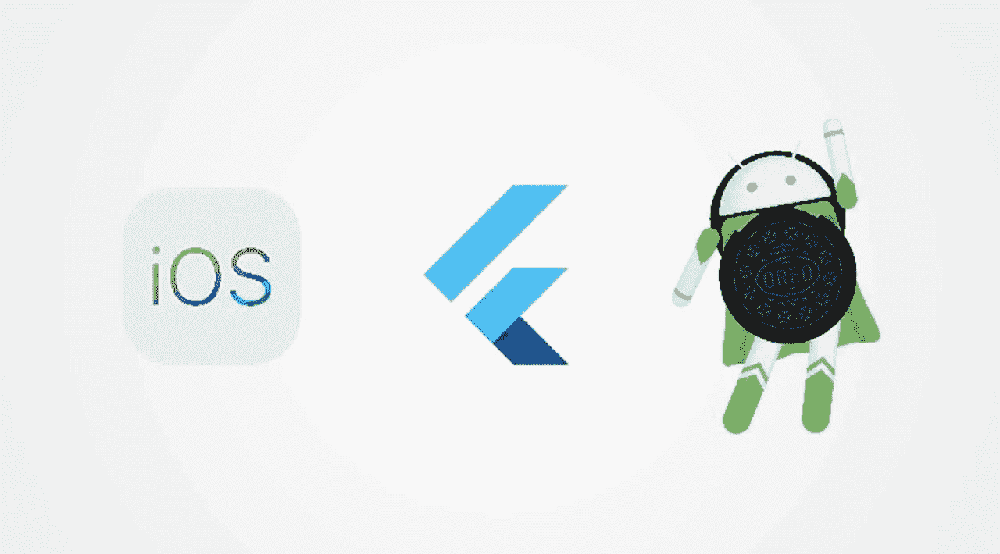
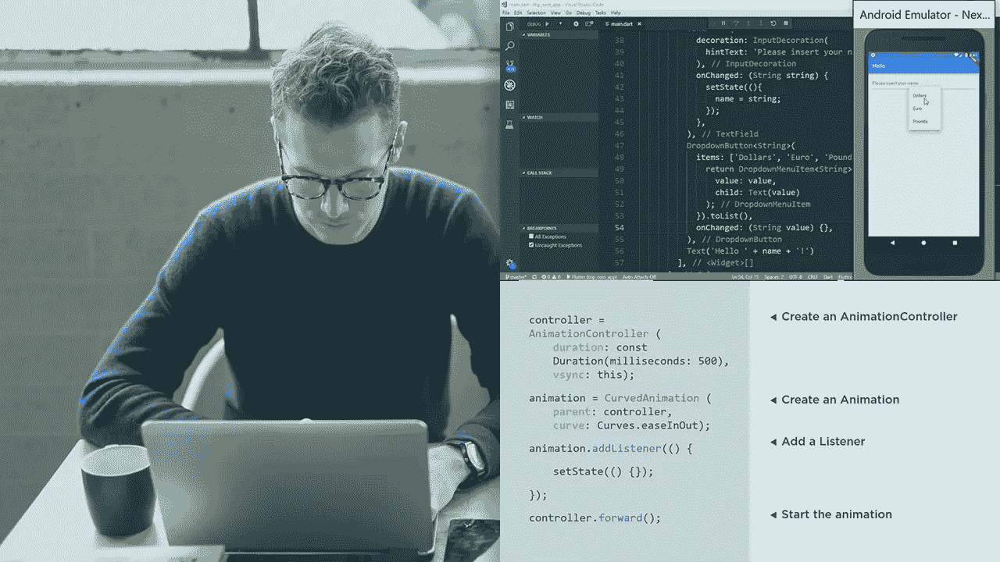

# 2023 年初学 App 开发的 7 门最佳免费颤振课程

> 原文：<https://medium.com/javarevisited/7-free-flutter-online-courses-to-build-android-and-ios-apps-in-2021-54c0c92f16f9?source=collection_archive---------0----------------------->

## 我最喜欢的免费在线课程学习 Flutter 2023 面向初学者，免费构建 Android 和 iOS 应用。

image_credit — Udemy

大家好，如果你想在 2023 年学习 Android 和 iOS 应用开发的 Flutter，并寻找免费的 Flutter 课程，那么你来对地方了。在过去，我已经分享了 [**最好的颤振课程**](/javarevisited/my-favorite-flutter-and-dart-programming-courses-for-beginners-9e8355710d78) ，但是我的许多读者要求免费的在线颤振课程开始，这就是这篇文章的诞生。

在这篇文章中，你会发现一个免费的在线课程列表，可以从互联网上最好的讲师那里学习 Flutter。这些课程涵盖了 Flutter 以及 [Dart](https://dart.dev/) ，如果你不知道的话，Dart 是一种编程语言，Flutter 是使用 [Dart](https://javarevisited.blogspot.com/2020/01/top-5-courses-to-learn-dart-programming.html) 创建移动和网络应用的框架。

App 开发是这个小时的需要， [**Flutter**](https://flutter.dev/) 是你能学到的最好的移动开发框架。因此，如果你是一个编程爱好者或软件开发人员，想要学习新的技能，并尝试在不同的领域学习 Flutter 可能是一个很好的主意。

除此之外， [App 开发](https://www.java67.com/2019/01/top-5-free-android-app-development-courses-for-programmers.html)是新兴领域；因此，步入其中会给你一个光明的未来。

本指南主要关注 Google 的 Flutter 框架，该框架可用于 Android 和 iOS 应用程序开发。除了 React Native 之外，Flutter 是目前应用程序开发人员最需要的技能，拥有良好的 Flutter 知识将对你的职业生涯大有帮助。

这里列出了总共 *7 门免费的在线颤振培训课程*，这些课程是完全免费参加的，并且这 7 门课程选自最受欢迎的在线学习平台，如 Udemy、Pluralsight、freecodecamp 和 YouTube。因此，教育质量将是一流的。

顺便说一句，如果你对 2023 年学习颤振很认真，并且正在寻找一个全面的在线培训课程，那么我也推荐你看看 Udemy 上我最喜欢的导师之一 Angela Yu 的 [**这个最好的颤振课程**](https://click.linksynergy.com/deeplink?id=JVFxdTr9V80&mid=39197&murl=https%3A%2F%2Fwww.udemy.com%2Fcourse%2Fflutter-bootcamp-with-dart%2F) 。

<https://click.linksynergy.com/deeplink?id=JVFxdTr9V80&mid=39197&murl=https%3A%2F%2Fwww.udemy.com%2Fcourse%2Fflutter-bootcamp-with-dart%2F>  

这是一门很好的课程，可以通过实践的方式学习旋进旋出。你还将建立一个漂亮的 Flutter 应用程序组合，可以添加到你的简历中，给招聘人员和潜在雇主留下深刻印象。这不是免费的，但它完全值得你的时间和金钱。你也可以在 Udemy 上花 10 美元购买。

# 2023 年 7 门最佳免费 Flutter 新手在线课程

在不浪费你更多时间的情况下，这里列出了你可以在 2023 年学习 Flutter 的最佳免费在线课程。正如我所说，这个列表包含了来自两个最好的在线学习新技能平台的免费课程。首先，我们将看看 Udemy 上提供的免费颤振课程，然后我们将从 Pluralsight 查看颤振课程。

## 1.[学习颤振—初学者课程](https://click.linksynergy.com/deeplink?id=JVFxdTr9V80&mid=39197&murl=https%3A%2F%2Fwww.udemy.com%2Fcourse%2Flearn-flutter-beginners-course%2F)

这是 Udemy 上第一个最受欢迎的学习 Flutter 的课程。本课程将帮助你创建你的第一个 flutter 应用程序。除了教学方法，教师更注重实践方法。每堂课都有单独的编码快照和适当的笔记。

该课程拥有 4.1 星评级，迄今已有超过 45，176 名学生注册。学习 Flutter——初学者课程是一个 2 小时长的点播视频课程，可以通过 Udemy 平台访问。

本课程最适合初学者，但你需要先了解以下关键技能:

1.基本的 OOps 概念
2。Dart 语言的基本信息
3。Android 工作室或美国矿脉与颤振。

总共 26 节课，因为是免费课程，所以不会给你颁发结业证书。如果你期待为移动设备创建应用程序，那么学习 Flutter——初学者课程是你最好的开始。

**这里是加入这个颤振课程** — [学习颤振—初学者课程](https://click.linksynergy.com/deeplink?id=JVFxdTr9V80&mid=39197&murl=https%3A%2F%2Fwww.udemy.com%2Fcourse%2Flearn-flutter-beginners-course%2F)的链接

## 2.[掌握扑动基础|学飞镖&扑动](https://click.linksynergy.com/deeplink?id=JVFxdTr9V80&mid=39197&murl=https%3A%2F%2Fwww.udemy.com%2Fcourse%2Fmaster-the-basics-of-flutter-learn-dart-flutter%2F)

另一个非常受欢迎且简单易学的初学者课程。通过本课程，您将学到以下内容:

*   学习使用 Flutter 创建响应迅速的移动应用程序。
*   Dart 的基础知识以及如何在移动应用程序开发中使用。

大约有 6011 名学生注册了这个仅在 [Udemy](https://javarevisited.blogspot.com/2020/05/top-10-udemy-courses-to-learn-python-programming.html) 平台上提供的 2 小时视频点播课程。这门课程是专门为学生设计的。它总共有 12 个讲座要参加，因为这是一个免费的课程，你不会得到任何额外的好处，如结业证书或与讲师直接交谈。如果你是一名学生，需要一些东西，那么首先掌握颤振课程的基础知识是你的最佳选择。

**这里是加入这个免费课程的链接**——[掌握飞镖基础|学飞镖&飞镖](https://click.linksynergy.com/deeplink?id=JVFxdTr9V80&mid=39197&murl=https%3A%2F%2Fwww.udemy.com%2Fcourse%2Fmaster-the-basics-of-flutter-learn-dart-flutter%2F)

## 3.[预扑&飞镖:出发前要知道的一切！](https://click.linksynergy.com/deeplink?id=JVFxdTr9V80&mid=39197&murl=https%3A%2F%2Fwww.udemy.com%2Fcourse%2Fpre-google-flutter-and-dart-everything-you-need-to-know%2F)

如果你是一名大学生或在职专业人士，真的很期待在移动应用程序开发领域取得成就，那么在你开始之前要知道的一切！是最适合你的课程。

本课程围绕旋舞[飞镖](/javarevisited/6-best-dart-programming-courses-for-beginners-to-learn-in-2021-2-are-free-24dc56f5ac14)的基础知识展开。这是一个 1 小时长的点播视频课程。已经有超过 19，845 名学生注册，在 Udemy 上获得了 4 星评级。

如果你正在寻找一个快速学习[扑](/javarevisited/my-favorite-flutter-and-dart-programming-courses-for-beginners-9e8355710d78?source=extreme_sidebar---------0-2----------------------)和[镖](https://javarevisited.blogspot.com/2020/01/top-5-courses-to-learn-dart-programming.html)基础的选项，那么你可以报名参加。你只需要有一台电脑就可以开始视频讲座了。本课程有 28 个视频讲座，每个讲座都涵盖了颤振或飞镖的一个特定概念。这不仅仅是一门帮助你创建第一个移动应用程序的课程，而是一门帮助你为你的移动应用程序开发生涯打下坚实基础的课程。

**这里是从 Udemy** — [预扑&镖](https://click.linksynergy.com/deeplink?id=JVFxdTr9V80&mid=39197&murl=https%3A%2F%2Fwww.udemy.com%2Fcourse%2Fpre-google-flutter-and-dart-everything-you-need-to-know%2F)加入这个免费扑扑课程的链接

## 4.[颤振入门](https://click.linksynergy.com/deeplink?id=JVFxdTr9V80&mid=39197&murl=https%3A%2F%2Fwww.udemy.com%2Fcourse%2Fintroduction-to-flutter%2F)【Udemy 免费课程】

这个课程比所有其他 udemy 课程都要长一点，特别是因为讲师要教授多个主题，但它是学习 Flutter 框架的一个很好的入门课程。

以下是您将在本文中学到的主要内容:

*   基本的用户界面设计。
*   逻辑编程
*   Flutter 中部件的基础知识
*   不同的表单元素，授权。
*   处理 JSON 数据。

根据这些概念，讲师将帮助您部署成熟的移动应用程序。具体来说，在这个 3 小时长的视频课程中，你将学习[扑镖](https://hackernoon.com/top-7-flutter-courses-and-tutorials-for-beginners-ejhf3yo4)的基础知识。

到目前为止，大约有 15，337 名学生注册了这个项目，它的评分为 3.9 分，这在某种程度上是可以接受的。如果你正在寻找可以帮助你创建一个强大的基础，可以教你如何创建应用程序的东西，那么 Flutter 入门课程就是为你准备的。

**这里是加入免费颤振课程**——[颤振入门](https://click.linksynergy.com/deeplink?id=JVFxdTr9V80&mid=39197&murl=https%3A%2F%2Fwww.udemy.com%2Fcourse%2Fintroduction-to-flutter%2F)的链接

这是在 [Udemy](/javarevisited/10-free-angular-and-react-js-courses-from-udemy-and-coursera-best-of-lot-e67f7d811e6b) 上可以找到的 4 门最好的免费在线课程，可以帮助你实现你的移动应用开发梦想。

现在，让我们看看 Pluralsight 上提供的课程。在你继续之前，让我告诉你 [PluralSight](/javarevisited/top-10-pluralsight-courses-to-learn-programming-and-software-development-during-covid-19-stay-at-30b7d8a4f88f) 是一个付费平台，但有一个选项可以创建一个 [**免费试用帐户**](https://pluralsight.pxf.io/c/1193463/424552/7490?u=https%3A%2F%2Fwww.pluralsight.com%2Fpricing%2Ffree-trial) t，因此你可以选择那个选项，并可以学习 Flutter，但试用帐户将只有 10 天。所以最好快点。

<https://pluralsight.pxf.io/c/1193463/424552/7490?u=https%3A%2F%2Fwww.pluralsight.com%2Fpricing%2Ffree-trial>  

## 5.AcadMind 免费颤振速成班[Youtube]

这是另一个从零开始学习 Flutter 的免费课程。这个免费速成课程正是由 AcadMind 和 Maximillian Schwarzmuller 创建的，他是 Udemy 上最全面的颤振课程之一— [**颤振&飞镖—完全指南【2023 版】**](https://click.linksynergy.com/deeplink?id=JVFxdTr9V80&mid=39197&murl=https%3A%2F%2Fwww.udemy.com%2Fcourse%2Flearn-flutter-dart-to-build-ios-android-apps%2F) **的作者。**

在这个面向初学者的免费 Flutter 介绍中，您将开始学习 Flutter，并学习如何使用 Flutter 构建一个 iOS 和 Android 应用程序！实际上，您将使用 Google 的 Flutter & Dart 构建一个 Flutter 应用程序

尽管它被称为 *Flutter 速成班*，但它实际上相当长，而且有超过 *5.30 小时的免费内容，*你将对 Flutter 有一个相当不错的了解，以便开始从事自己的项目。

你可以在 YouTube 或者这里免费观看这个课程

## 6.Flutter 课程—初学者完整教程[freeCodeCamp]

freeCodecamp Youtube 频道也有一个不错的 Flutter 课程，你可以免费观看，并在 2023 年开始学习 Flutter，这是谷歌开创性的多平台移动开发框架，用于为 [Android](/javarevisited/top-5-courses-to-learn-android-for-java-programmers-667e03d995b4) 和 [iOS](/javarevisited/top-5-online-courses-to-learn-ios-12-swift-in-2019-a35ae1be7b2b) 创建应用。

在这个课程中，来自 fluttercrashcourse.com 的尼克·曼宁教你如何快速有效地使用 Flutter 进行跑步。尼克自 2017 年以来一直是一名颤振工程师，并将这一现实世界的专业知识归结为一个清晰、现实、循序渐进的速成班。

Flutter 应用程序是用 [Dart 编程语言](/javarevisited/6-best-dart-programming-courses-for-beginners-to-learn-in-2021-2-are-free-24dc56f5ac14)编写的，在这个课程中你也会学到一些 Dart。

你可以在这里或者 YouTube 上免费观看这个课程

## 7.[扑:入门](https://pluralsight.pxf.io/c/1193463/424552/7490?u=https%3A%2F%2Fwww.pluralsight.com%2Fcourses%2Fflutter-getting-started)[复数视线]

本课程将带您更深入地了解移动开发领域。它旨在帮助初学者找到在移动应用开发领域发展的最佳方向。

通过本课程，您将学习 UI 设计的基础知识以及在应用中使用动画。除此之外，你将学习如何处理应用程序的数据库，它还将涵盖 [Flutter 框架](https://dev.to/javinpaul/top-5-courses-to-learn-flutter-and-dart-in-2020-3bkm)的基础知识。对于初学者来说，这是一个强大的视频课程。因此，如果你对学习 Flutter 感兴趣并达到一个不错的水平，那么《Flutter:入门》是对你来说最好的课程。

**这里是加入本颤振课程**——[颤振:入门](https://pluralsight.pxf.io/c/1193463/424552/7490?u=https%3A%2F%2Fwww.pluralsight.com%2Fcourses%2Fflutter-getting-started)的链接

顺便说一下，你需要一个 Pluralsight 会员资格才能参加这个课程，费用大约是每月 29 美元。或者，你可以带着他们的 [**10 天免费试用**](https://pluralsight.pxf.io/c/1193463/424552/7490?u=https%3A%2F%2Fwww.pluralsight.com%2Flearn) 免费进入这个课程。

<https://pluralsight.pxf.io/c/1193463/424552/7490?u=https%3A%2F%2Fwww.pluralsight.com%2Flearn>  

以上就是 2023 年学习 Flutter 的**最佳免费在线课程。如果你在做决定时感到困惑，建议逐一查看这些课程。**

在最初的几分钟内，你会发现哪个课程对你有效，哪个无效，因此，你可以选择最合适的课程。

除此之外，所有这些课程都很受欢迎，成千上万的学生都尝试过这些课程，所以你的时间很少会浪费在这些课程上。毫无疑问，你将从每门课程中学到至少一些新的东西和概念。

其他**有用的编程资源**您可能喜欢探索

*   [2023 年学习 React Native 的 5 大课程](https://javarevisited.blogspot.com/2018/02/5-react-native-courses-to-learn-mobile-development-using-JavaScript.html#axzz5gYSQ4RjO)
*   [2023 年学习 Python 的 5 大课程](http://javarevisited.blogspot.sg/2018/03/top-5-courses-to-learn-python-in-2018.html)
*   [学习 iOS 应用开发的五大课程](https://javarevisited.blogspot.com/2019/01/top-5-ios-developer-course-to-learn-ios.html)
*   [2023 年学习微服务开发的 5 门课程](https://javarevisited.blogspot.sg/2018/02/top-5-spring-microservices-courses-with-spring-boot-and-spring-cloud.html)
*   [程序员 10 门 DevOps 课程](https://javarevisited.blogspot.com/2018/09/10-devops-courses-for-experienced-java-developers.html)
*   [10 门针对初学者的免费 React 本地课程](/javarevisited/my-favorite-free-react-native-courses-for-beginners-in-2020-4629f5274eb6)
*   [2023 年从零开始学习 Java 的 5 门课程](http://www.java67.com/2018/02/5-online-courses-to-learn-java-9-better.html)
*   [2023 年学习 Angular 的 5 门免费课程](http://www.java67.com/2018/01/top-5-free-angular-js-online-courses-for-web-developers.html)
*   [2023 年 5 门机器学习和数据科学课程](http://javarevisited.blogspot.sg/2018/03/top-5-data-science-and-machine-learning-online-courses-to-learn-online.html)
*   [学习大数据、Hadoop 和 Spark 的 5 门免费课程](http://www.java67.com/2018/05/top-5-free-big-data-courses-to-learn-Hadoop-Apache-Spark.html)
*   [2023 年网络开发者路线图](https://hackernoon.com/the-2019-web-developer-roadmap-ab89ac3c380e)
*   [深度学习区块链的 5 大免费课程](http://www.java67.com/2018/02/5-free-blockchain-technology-courses.html)
*   [深度学习 Nodejs 的 7 门免费课程](/javarevisited/7-free-courses-to-learn-node-js-in-2020-2f1dd6722b49)
*   [面向开发者的 10 门免费 Docker 课程](https://hackernoon.com/10-free-courses-to-learn-docker-for-programmers-and-devops-engineers-7ff2781fd6e0)
*   [面向 Java 开发人员的 5 大 Android 在线培训课程](https://javarevisited.blogspot.com/2017/12/top-5-android-online-training-courses-for-Java-developers.html)
*   [2023 年手机开发者可以学习的 10 项技能](https://javarevisited.blogspot.com/2020/01/10-things-mobile-app-developers-can-learn.html)

感谢您阅读本文。如果你喜欢这些免费的 Flutter 在线课程，那么请分享给你的朋友和同事。如果您有任何问题或反馈，请留言。

**附言——**如果你真的想在 2023 年学习 Flutter，并寻找一个全面的在线培训课程，那么我也推荐你去看看 Udemy 上最好的讲师之一，AcadMind 的 Maximilian Scwarzmuller 的[**Flutter&Dart-The Complete Guide【2023 Edition】**](https://click.linksynergy.com/deeplink?id=JVFxdTr9V80&mid=39197&murl=https%3A%2F%2Fwww.udemy.com%2Fcourse%2Flearn-flutter-dart-to-build-ios-android-apps%2F)课程。这不是免费的，但它完全值得你的时间和金钱。你也可以在 Udemy 上花 10 美元购买。

<https://click.linksynergy.com/deeplink?id=JVFxdTr9V80&mid=39197&murl=https%3A%2F%2Fwww.udemy.com%2Fcourse%2Flearn-flutter-dart-to-build-ios-android-apps%2F> 