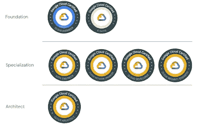
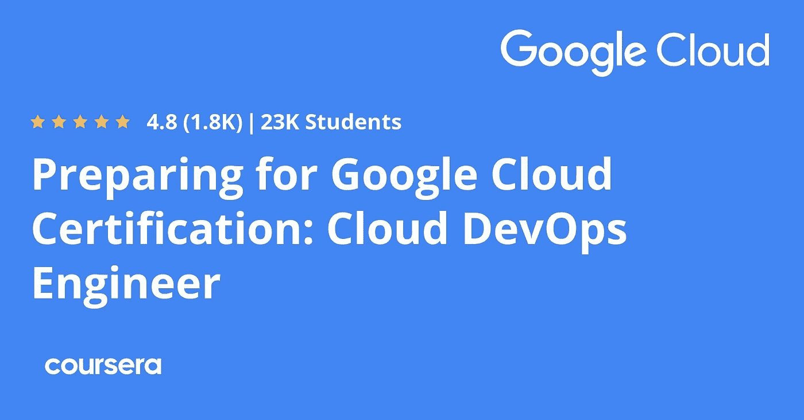
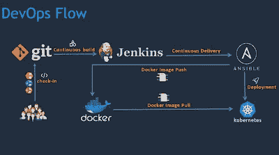
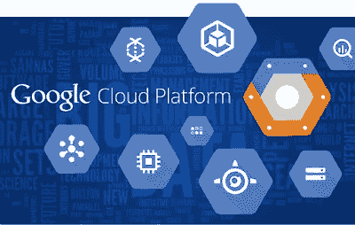
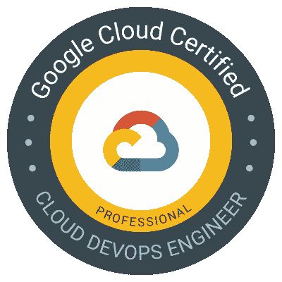
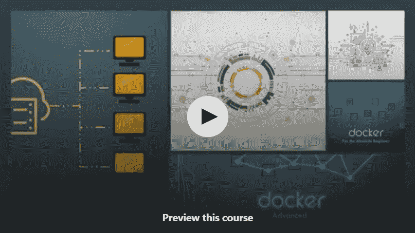

# 2023 年 7 门最佳免费 Google Cloud DevOps 工程师认证课程

> 原文：<https://medium.com/javarevisited/7-free-google-cloud-devops-engineer-certification-courses-f0046ac39f7e?source=collection_archive---------0----------------------->

## 免费 Udemy 和 Coursera 课程集合，学习云计算和 DevOps，准备 Google Cloud DevOps 工程师认证

大家好，如果你正在准备**Google Cloud Professional DevOps 工程师认证**并寻找免费的在线课程来学习 devo PS 和云计算，那么你来对地方了。

过去，我曾分享过[最佳谷歌云课程](/javarevisited/5-best-courses-to-learn-google-cloud-platform-gcp-in-2021-169093a3771a)，以及通过[云工程师](/javarevisited/5-best-gcp-associate-cloud-engineer-certification-courses-in-2021-c93d7e35228a)、[数据工程师](https://javarevisited.blogspot.com/2020/06/top-5-course-to-crack-google-cloud-professional-data-engineer-certification.html)和[云架构师](https://javarevisited.blogspot.com/2020/07/top-5-courses-to-become-google-cloud-professional-architect.html)认证的最佳在线培训课程，但我的读者一直要求免费的谷歌云在线课程，特别是 DevOps 工程师认证，今天，我将为初学者和有经验的云专业人士分享 f *ree GCP 云 DevOps 工程师认证课程*。

谷歌是领先的云服务提供商之一；除此之外，其云平台，即[谷歌云平台(GCP)](https://cloud.google.com/) 是发展最快的云平台之一。预计在未来几年，它将超过[微软 Azure](/javarevisited/5-best-azure-fundamentals-courses-to-pass-az-900-certification-exam-in-2020-9e602aea035d) 。

首先，你做出了一个优秀的决定，出现在 GCP 专业云 DevOps 工程师考试中；云计算是 IT 行业的重要组成部分。每一家公司，无论其属于哪个领域，都在某个地方使用云平台。未来几年，云产业将成为最大的产业之一。

在 GCP 获得认证会给你在云计算领域获得成功的机会。为了帮助您准备 GCP 专业云开发运维工程师考试，我列出了七门免费的在线课程，您可以使用这些课程来学习云计算和开发运维，并通过 GCP 专业云开发运维工程师考试。

顺便说一句，如果你需要一个全面的在线课程，那么我也强烈推荐你加入 Udemy 上的 [**终极谷歌云认证:全包(4)**](https://click.linksynergy.com/deeplink?id=JVFxdTr9V80&mid=39197&murl=https%3A%2F%2Fwww.udemy.com%2Fcourse%2Fgoogle-certified-architect-developer-engineer-data-devops%2F) 课程。这个在线培训课程不是免费的，而是最全面的谷歌云认证在线课程，为包括云数据工程师在内的所有四种谷歌云认证提供学习材料。

 [## 终极谷歌云认证:一切尽在一个捆绑包中(4)

### 嗨，云专家们，我们有 405，000 多名学生和 280，000 名独立学生获得了谷歌云平台认证…

udemy.com](https://click.linksynergy.com/deeplink?id=JVFxdTr9V80&mid=39197&murl=https%3A%2F%2Fwww.udemy.com%2Fcourse%2Fgoogle-certified-architect-developer-engineer-data-devops%2F) 

# 2023 年 GCP 专业云 DevOps 工程师考试 7 门最佳免费课程

不浪费你更多的时间，这里是 2023 年通过谷歌云专业云 DevOps 工程师考试的免费在线课程列表。这些免费课程是由专家创建的，成千上万的专业人士加入了这些免费的在线课程。在线学习门户网站也提供这些课程，如 Coursera、Udemy 和其他流行网站。

## 1.[云计算简介](https://click.linksynergy.com/deeplink?id=JVFxdTr9V80&mid=39197&murl=https%3A%2F%2Fwww.udemy.com%2Fcourse%2Fintroduction-to-cloud-computing%2F)【Udemy】

这将是我们准备 GCP 专业云 DevOps 考试的第一步。在本课程中，讲师 Xavier Corbett 将教您与云计算相关的每一个基础知识。

这门课程有很好的视觉效果和适当的插图，这两者使得学生的理解过程非常容易。

在这个 1 小时的视频课程中，您将了解以下内容:

*   什么是云计算？
*   它是如何工作的？
*   为什么重要？

如果你正在寻找可以帮助你为你的职业生涯打下坚实基础的东西，那么这门课程是你的最佳选择。从这里，您可以选择任何您想要的云主题。

**这里是加入这个免费课程** — [云计算简介](https://click.linksynergy.com/deeplink?id=JVFxdTr9V80&mid=39197&murl=https%3A%2F%2Fwww.udemy.com%2Fcourse%2Fintroduction-to-cloud-computing%2F)的链接

## 2.[准备 Google 云认证:云 DevOps 工程师职业证书](https://coursera.pxf.io/c/3294490/1164545/14726?u=https%3A%2F%2Fwww.coursera.org%2Fprofessional-certificates%2Fsre-devops-engineer-google-cloud)【Coursera】

如果你正在寻找一个非常详细的信息课程，这是你最好的选择。谷歌云培训团队创建了这个课程，它可以在 Coursera 上找到。

本课程包含五门不同的子课程，这五门课程中的每一门都涵盖了特定的主题，这些主题与 Google 的 Cloud DevOps 工程师考试紧密相关。你也可以免费审计它们。

1.  [谷歌云基础:核心基础设施](https://coursera.pxf.io/c/3294490/1164545/14726?u=https%3A%2F%2Fwww.coursera.org%2Flearn%2Fgcp-fundamentals)
2.  [发展谷歌 SRE 文化](https://coursera.pxf.io/c/3294490/1164545/14726?u=https%3A%2F%2Fwww.coursera.org%2Flearn%2Fdeveloping-a-google-sre-culture)
3.  [可靠的谷歌云基础设施:设计和流程](https://coursera.pxf.io/c/3294490/1164545/14726?u=https%3A%2F%2Fwww.coursera.org%2Flearn%2Fcloud-infrastructure-design-process%3Fspecialization%3Dsre-devops-engineer-google-cloud)
4.  [谷歌云中的日志记录、监控和可观察性](https://coursera.pxf.io/c/3294490/1164545/14726?u=https%3A%2F%2Fwww.coursera.org%2Flearn%2Flogging-monitoring-observability-google-cloud)
5.  [Google Kubernetes 引擎入门](https://coursera.pxf.io/c/3294490/1164545/14726?u=https%3A%2F%2Fwww.coursera.org%2Flearn%2Fgoogle-kubernetes-engine)

到目前为止，超过 37，000 名学生注册了这个 51 小时的课程。要完成这门课程，你将有四个月的时间。

因为这是一门 Coursera 课程，所以你会被分配到大量的测验，你需要提交的实时项目，一旦你的讲师对它们进行评估，你就可以进入课程的下一部分。如果不完成这些作业，你就无法完成这门课程。

**这里是加入本课程的链接**——[准备 Google 云认证:云 DevOps 工程师职业证书](https://coursera.pxf.io/c/3294490/1164545/14726?u=https%3A%2F%2Fwww.coursera.org%2Fprofessional-certificates%2Fsre-devops-engineer-google-cloud)

但是为什么当参加审计专业的免费课程时，你将不会得到任何证书。如果您参加本课程是为了获得 Coursera 证书，那么您需要注册专业化或参加订阅计划，如 [**Coursera Plus**](https://coursera.pxf.io/c/3294490/1164545/14726?u=https%3A%2F%2Fwww.coursera.org%2Fcourseraplus) ，该计划提供 5000 多个 Coursera 课程、项目和专业证书的无限制访问。

 [## Coursera Plus |无限制访问 7，000 多门在线课程

### 用 Coursera Plus 投资你的职业目标。无限制访问 90%以上的课程、项目…

coursera.pxf.io](https://coursera.pxf.io/c/3294490/1164545/14726?u=https%3A%2F%2Fwww.coursera.org%2Fcourseraplus) 

## 3. [DevOps 必备](https://click.linksynergy.com/deeplink?id=JVFxdTr9V80&mid=39197&murl=https%3A%2F%2Fwww.udemy.com%2Fcourse%2Flinux-academy-devops-essentials%2F)【Udemy】

到目前为止，您已经了解了云计算概念；现在，由于您要参加 GCP 专业云 DevOps 工程师考试，您需要了解 DevOps。

本课程将教你每一个重要的 DevOps 概念。这是一个简短的课程，直接关注开发运维及其基础。

本课程时长 2 小时，由 Linux academy 创建。到目前为止，超过 6 万名学生注册了这门课程，根据 7019 名学生的评论，这门课程的评分为 4.4 分。

如果你缺乏 DevOps 知识，那么这个课程是你最好的选择。它有很好的解释视频和插图。

**这是加入免费 DevOps 课程的链接**——[devo PS 基础](https://click.linksynergy.com/deeplink?id=JVFxdTr9V80&mid=39197&murl=https%3A%2F%2Fwww.udemy.com%2Fcourse%2Flinux-academy-devops-essentials%2F)

## 4.[GCP——谷歌云平台概念](https://click.linksynergy.com/deeplink?id=JVFxdTr9V80&mid=39197&murl=https%3A%2F%2Fwww.udemy.com%2Fcourse%2Fgcp-google-cloud-platform-concepts%2F)【免费 Udemy 课程】

到目前为止，你已经了解了云计算概念和 DevOps 概念；现在是时候走向话题的平台了。在本课程中，你将了解 GCP 的不同概念。

本课程由达纳吉·毛塞尔和谷歌云平台大师共同打造；这是一个长达 6 小时的视频课程。到目前为止，已经有超过 39，000 名学生注册了这门课程。这门课的评分是 4.2。

除了 GCP 的基本原理之外，讲师还会教你在谷歌云账户中获得 300 美元的技巧。因此，如果你正在寻找一些课程，可以给你一个现场项目和实施经验，那么这个课程是给你的。

**这里是加入这个免费课程的链接**——[GCP——谷歌云平台概念](https://click.linksynergy.com/deeplink?id=JVFxdTr9V80&mid=39197&murl=https%3A%2F%2Fwww.udemy.com%2Fcourse%2Fgcp-google-cloud-platform-concepts%2F)

## 5.[终极谷歌认证专业云开发者 2023](https://click.linksynergy.com/deeplink?id=JVFxdTr9V80&mid=39197&murl=https%3A%2F%2Fwww.udemy.com%2Fcourse%2Fgoogle-cloud-platform-professional-cloud-developer-certification%2F)

如果你有兴趣直接从一门课程开始准备，那么这门课程非常适合你。这是一个 16 小时 20 分钟长的视频课程，将教你与云计算和 GCP 相关的一切。除此之外，导师们的谷歌云平台大师们使用了一些很棒的视觉效果来流畅地传达信息。

到目前为止，已有超过 72，000 名学生注册了这门课程，根据 1，429 名学生的评论，这门课程的评分为 4.5 分。在本课程中，您将了解 GCP 的不同组件，如安全性、API、部署管理器、云存储库和其他几个开发工具。

除了这些话题，讲师还会教你如何快速有效地准备 GCP 认证考试。

**以下是参加本课程的链接**——[2023 年谷歌认证专家云开发者终极课程](https://click.linksynergy.com/deeplink?id=JVFxdTr9V80&mid=39197&murl=https%3A%2F%2Fwww.udemy.com%2Fcourse%2Fgoogle-cloud-platform-professional-cloud-developer-certification%2F)

## 6.[通过 kops 和 terraform 学习 DevOps Kubernetes 部署](https://click.linksynergy.com/deeplink?id=JVFxdTr9V80&mid=39197&murl=https%3A%2F%2Fwww.udemy.com%2Fcourse%2Flearn-devops-kubernetes-deployment-by-kops-and-terraform%2F)

这是另一个免费的 udemy 课程，你可以加入学习 DevOps，Kubernetes 和 Terraform。这与 Google Cloud 无关，但会让你了解一些基本的 DevOps 工具，比如 Kubernetes 和 Terraform。

Kubernetes 不仅作为 Docker 容器的编排平台，每天都在获得更多的动力，尤其是在 DevOps 领域。除了其他主要的编排系统之外， [Kubernetes](/javarevisited/7-free-online-courses-to-learn-kubernetes-in-2020-3b8a68ec7abc) 可以说是最受欢迎的系统之一。

所有大型云提供商，如 AWS、T2、谷歌云、T4、Azure 和 T5，都或多或少地采用了 Kubernetes 作为其产品组合和服务的一部分。

Kubernetes 和 Docker containers 共同创建了一个部署微服务的理想生态系统，这似乎是下一代应用程序的模型。要通过包括本课程在内的任何 DevOps 认证，充分了解这些基本的 DevOps 工具是必不可少的。

**这是免费 DevOps 课程的链接** — [通过 kops 和 terraform 了解 DevOps Kubernetes 部署](https://click.linksynergy.com/deeplink?id=JVFxdTr9V80&mid=39197&murl=https%3A%2F%2Fwww.udemy.com%2Fcourse%2Flearn-devops-kubernetes-deployment-by-kops-and-terraform%2F)

## 7. [DevOps —入门课程【免费 Udemy】](https://click.linksynergy.com/deeplink?id=JVFxdTr9V80&mid=39197&murl=https%3A%2F%2Fwww.udemy.com%2Fcourse%2Flearn-devops%2F)

这是另一个在 Udemy 上学习 DevOps 的免费课程。对于那些开始开发运维及云计算之旅的人来说，本课程是必不可少的。

这个课程最棒的一点是它是由[**mums had manna mbet**](https://click.linksynergy.com/deeplink?id=JVFxdTr9V80&mid=39197&murl=https%3A%2F%2Fwww.udemy.com%2Fuser%2Fmumshad-mannambeth%2F)**h 创建的，他是我在学习 DevOps 时最喜欢的导师之一，也是其他一些 Udemy 畅销书的作者，如 [Docker，适合绝对初学者——动手——devo PS](https://click.linksynergy.com/deeplink?id=JVFxdTr9V80&mid=39197&murl=https%3A%2F%2Fwww.udemy.com%2Fcourse%2Flearn-docker%2F)**

**大多数云计算和 DevOps 课程都要求一个人了解一些基本概念，比如基本的 web 应用程序、使用 VirtualBox 部署实验室环境，或者在 AWS 或 GCP 这样的云平台上。**

**大多数 DevOps 工具依赖于 JSON、XML 和 YAML T21 等语言。Ansible 等自动化工具和 Kubernetes 等容器编排工具使用 YAML 语言。**

**对于学习这些技术的初学者来说，良好的 YAML 语言知识是必不可少的。本课程通过简单易行的讲座和编码练习来介绍 YAML，帮助你在浏览器中练习 YAML。**

**本课程还提供了 DevOps 中常见技术的高级概述，如编排工具，如 **Ansible** 、 **Puppet、**和 **Chef** 。还有像 **Docker** 、 **Kubernetes、**和 **OpenShift** 这样的容器技术。**

****这里是加入这个免费课程**——[devo PS——入门课程【免费 Udemy】](https://click.linksynergy.com/deeplink?id=JVFxdTr9V80&mid=39197&murl=https%3A%2F%2Fwww.udemy.com%2Fcourse%2Flearn-devops%2F)的链接**

****

**以上就是关于**通过 Google Cloud Professional DevOps 工程师认证**的最佳免费在线课程。这是要通过的大量综合考试之一，你不能指望只学一门课程就有结果，你必须参加多门课程，这样你才能了解 GCP 的每一个特定概念。**

**建议报名参加上面列出的所有来源，一旦你完成了这些课程，我可以向你保证，你会发现 *GCP 专业云 DevOps 工程师考试*超级简单。**

**您可能喜欢的其他**云计算和 IT 认证课程**和文章**

*   **[微软 Azure 基础知识前 5 名模拟测试](https://javarevisited.blogspot.com/2020/02/top-5-AZ-900-exam-Azure-Fundamentals-certification-practice-tests-and-mock-exams-to.html)**
*   **[如何破解 2023 年 AZ-103 Azure 行政考试](https://javarevisited.blogspot.com/2020/04/how-to-crack-microsoft-az-103-azure-administrator-associate-exam-certification.html)**
*   **[学习 Docker 和 Kubernetes 的十大课程](https://dev.to/javinpaul/top-10-courses-to-learn-docker-and-kubernetes-for-programmers-4lg0)**
*   **[破解 Azure 开发人员助理考试的前 5 门课程](https://javarevisited.blogspot.com/2020/06/top-5-course-to-crack-Microsoft-Azure-Developer-Certification-Exam-AZ-203.html)**
*   **[如何破解 AWS 解决方案架构师考试](https://javarevisited.blogspot.com/2019/08/how-to-crack-aws-certified-solution-architect-exam.html)**
*   **[通过 Azure 开发人员助理认证(AZ-203)的 5 门在线课程](https://javarevisited.blogspot.com/2020/06/top-5-course-to-crack-Microsoft-Azure-Developer-Certification-Exam-AZ-203.html)**
*   **[破解 AWS 解决方案架构师认证的 5 大课程](https://javarevisited.blogspot.com/2019/05/top-5-courses-to-crack-aws-solutions-architect-associate-certification-exam-SAA-C01.html#axzz5rHwAwycj)**
*   **[通过 Azure 云架构考试的前 5 门课程](https://javarevisited.blogspot.com/2019/07/top-5-courses-to-crack-azure-architecture-technologies-certification-az-300-exam.html)**
*   **[如何通过 Spring Core Professional 5.0 认证](https://javarevisited.blogspot.com/2018/08/how-to-crack-spring-core-professional-certification-exam-java-latest.html)**
*   **[2023 年通过 AZ-900 认证的前 5 名课程](https://javarevisited.blogspot.com/2020/02/top-5-courses-to-crack-az-900-microsoft-azure-fundamentals-certification-exam.html)**
*   **[10 门免费学习数据结构和算法的课程](http://www.java67.com/2019/02/top-10-free-algorithms-and-data.html)**
*   **[程序员前 5 名 AZ-900 模拟测试](https://javarevisited.blogspot.com/2020/02/top-5-AZ-900-exam-Azure-Fundamentals-certification-practice-tests-and-mock-exams-to.html)**
*   **[Vmware Spring 认证对工作和职业生涯有帮助吗？](https://javarevisited.blogspot.com/2017/07/does-spring-certification-help-in-job-and-career.html)**
*   **[学习微软 Azure 概念的 5 门免费课程](https://www.java67.com/2020/07/5-free-courses-to-learn-microsoft-azure-cloud.html)**
*   **[如何在 2023 年成为 Azure 解决方案架构师助理](https://javarevisited.blogspot.com/2020/04/how-to-crack-microsoft-azure-solution-architect-exam-az-300.html)**
*   **[破解 Azure 云架构师(AZ-300)考试的 5 大课程](https://javarevisited.blogspot.com/2019/07/top-5-courses-to-crack-azure-architecture-technologies-certification-az-300-exam.html#axzz6E6VuRMsx)**
*   **[通过谷歌助理云工程师认证的前 5 门课程](https://javarevisited.blogspot.com/2019/07/top-5-google-cloud-platform-gcp-courses-certifications-online.html)**
*   **[如何成为 DevOps 工程师？](https://javarevisited.blogspot.com/2018/09/the-2018-devops-roadmap-your-guide-to-become-DevOps-Engineer.html)**
*   **[10 门数据科学和机器学习认证课程](https://dev.to/javinpaul/10-data-science-and-machine-learning-courses-for-programmers-looking-to-switch-career-57kd)**
*   **[如何破解 Azure Fundamentals (AZ-900)认证](https://javarevisited.blogspot.com/2020/04/how-to-crack-microsoft-azure-fundamentals-certification-az-900-exam.html)**

**感谢您阅读本文。如果你觉得这些最好的*免费谷歌云平台云 DevOps 工程师认证课程*有用，那么，请分享给你的朋友和同事。如果您有任何问题或反馈，请留言。**

****P. S.** —如果您需要更全面、更有针对性的在线认证课程，我也强烈推荐您参加 Udemy 上的 [**终极谷歌云认证:全包(4)**](https://click.linksynergy.com/deeplink?id=JVFxdTr9V80&mid=39197&murl=https%3A%2F%2Fwww.udemy.com%2Fcourse%2Fgoogle-certified-architect-developer-engineer-data-devops%2F) 课程。这不是免费的，而是最全面的谷歌云认证在线课程，为包括云数据工程师在内的所有四种谷歌云认证提供学习材料。**

** [## 终极谷歌云认证:一切尽在一个捆绑包中(4)

### 嗨，云专家们，我们有 405，000 多名学生和 280，000 名独立学生获得了谷歌云平台认证…

udemy.com](https://click.linksynergy.com/deeplink?id=JVFxdTr9V80&mid=39197&murl=https%3A%2F%2Fwww.udemy.com%2Fcourse%2Fgoogle-certified-architect-developer-engineer-data-devops%2F)**