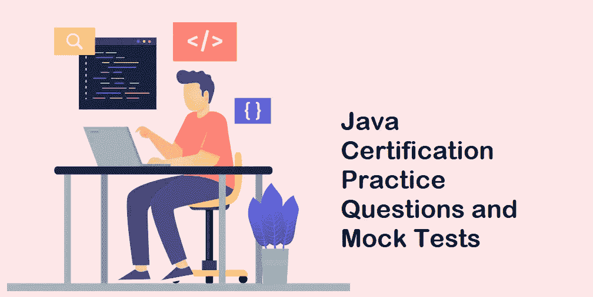
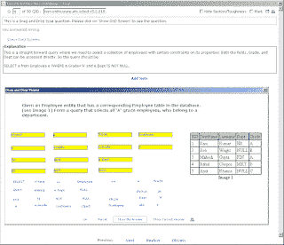
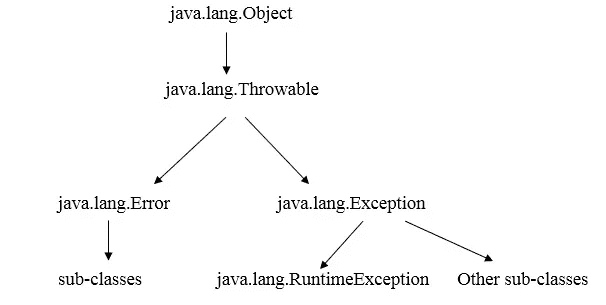
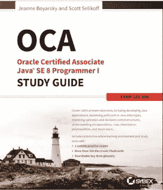

# 7 道免费的 Java 8 认证练习题和模拟测试，帮助您通过 1z 0–808 和 1z 0–809 考试

> 原文：<https://medium.com/javarevisited/7-free-java-8-certification-practice-questions-and-mock-tests-to-crack-1z0-808-and-1z0-809-exam-fa4be2c85d34?source=collection_archive---------0----------------------->

## 这些是来自 Whizlabs、MyExamCloud 和其他网站的 Java SE 8 程序员 I 和程序员 II 认证的免费实践测试和模拟考试，为 1z 0–808 和 1z 0–809 考试做准备

你好，Java 程序员，如果你正在准备 Java SE 8 认证并寻找一些免费资源，那么你来对地方了。

在过去，我已经分享了最好的 Java SE 8 认证课程 和 [**书籍**](/javarevisited/my-favorite-books-and-courses-to-pass-java-se-8-certification-ocajp-8-and-ocpjp-8-b657a195aa07?source=---------58-----------------------) ，在这篇文章中，我将分享 OCAJP 8 和 OCPJP 8 考试的免费模拟测试和练习题。

为了在 Java 认证上取得好成绩，在参加考试之前，您需要好的书籍和合理数量的练习题。[练习题](/javarevisited/top-7-practice-tests-and-mock-exams-to-prepare-for-oracles-java-certifications-ocajp-and-ocpjp-36502d4ca061)和[模拟考试](/javarevisited/6-best-java-8-certification-practice-tests-and-exam-dumps-6a2bdb735d97)将帮助你评估你的主题准备水平，并帮助你确定自己的强项和弱项。

根据模拟考试的结果，您可以专注于您缺乏专业知识的领域，例如多线程就是其中一个棘手的领域。它还会让你接触到考试模式和考试中可能遇到的不同类型的问题，如选择题、重新排列代码、填空等。

虽然我强烈推荐商业考试模拟器，如[**whiz labs**](http://shrsl.com/?g0ce)**[认证问题](https://www.certification-questions.com/practice-exam/java/1z0-808?affiliateCode=fcff36fd-557a-4713-abf6-973e9924770f&utm_source=Javin&utm_medium=affiliate&utm_campaign=affiliate)和 [Enthuware](http://enthuware.com/) ，但我也建议你利用许多免费提供的模拟问题。总的来说，*自由练习题*不如那些来自 Whizlabs 的好，它们缺乏解释，但它们仍然提供了一个机会来确定你的弱项和强项。**

**由于 Java 8 认证仍然有效并且需求量很大，我想收集并发布一些可以在线参加的**免费 Java 8 模拟考试**。**

# **7 大免费 Java 8 认证模拟考试和练习题**

**以下是 OCAJP8 和 OCPJP8 考试的一些模拟考试和练习题。它们对于准备考试代码 1z 0–808、1z 0–809 和 1z 0–810 非常有用。

**1。Whizlabs OCAJP 8 道样题** ( [25 道题](http://shrsl.com/?~abo4) )
Whizlabs 以质量著称，因为我在准备 SCJP 考试时亲自用过，所以我知道它们有多有用。**

**我强烈推荐你购买 Whizlabs 模拟器，但是如果你不能或者你想自己评估质量，你可以看看这些 Java 8 认证问题的样本。**

**此外，如果您喜欢 Whizlabs 问题和解释的质量，并发现他们的考试模拟器非常有用或有助于准备，那么您还可以从他们的网站上购买 Java SE 8 考试模拟器的完整版本<http://shrsl.com/?g0ce>*，其中包含 650 多个问题和详细的解释。***

******

*****2。Whizlabs OCPJP 8 道样题** ( [20 道题](http://shrsl.com/?~abo5) )
Whizlabs 以质量著称，因为我在准备 SCJP 考试时亲自用过它，所以我知道它们有多有用。我强烈建议你购买 Whizlabs 模拟器，但是如果你不能或者你想自己评估质量，你可以看看这些 Java 8 认证问题的样本。***

***此外，如果你喜欢 Whizlabs 问题及其解释的质量，那么你也可以在他们的网站上购买付费版本，其中包含近 650 个 OCPJP 1z 0–809 考试的问题。***

******

***顺便说一句，如果你正在准备多个 IT 认证，可以考虑参加 [**Whizlabs 订阅**](https://shareasale.com/r.cfm?b=1551042&u=880419&m=43514&urllink=&afftrack=) ，它提供对他们所有在线培训课程和不同认证的实践测试的完全访问，每年仅需 99 美元(现在有 50%的折扣)。您还可以使用我的代码 WHIZJULY20 获得 20%的折扣。***

*****3。大卫·迈耶的 1z 0–808 和 1z 0–809 转储** ( [25 个问题](https://www.certification-questions.com/practice-exam/java/1z0-808?affiliateCode=fcff36fd-557a-4713-abf6-973e9924770f&utm_source=Javin&utm_medium=affiliate&utm_campaign=affiliate) )
大卫·迈耶在开发 Java 8 Web 模拟器方面也做得非常出色，它为 1z 0–808 考试提供了 308 个独特的问题和解释。***

***这项免费测试旨在展示 java8 web simulator 的所有功能，您将能够回答 25 个完整的问题，并有 53 分钟的时间完成测试。您甚至可以从他的网站下载 1z 0–808 和 1z 0–809 PDF 转储文件。***

***即使你没有购买，你也可以评估问题的质量，并对 OCAJP8 考试有所期待。不过我建议你买全套，以便在 OCAJP8 考试中取得高分。***

***而且，如果你喜欢他们免费问题的质量，你还可以查看他们的 [**完整测试**](https://www.certification-questions.com/practice-exam/java/1z0-808?affiliateCode=fcff36fd-557a-4713-abf6-973e9924770f&utm_source=Javin&utm_medium=affiliate&utm_campaign=affiliate) ，其中包含超过 433 个 Java 8 认证转储。***

******

*****4。Entuware 的 Oracle Certified Associate—Java SE 8 程序员 I 问题** ( [参见此处](http://enthuware.com/index.php/mock-exams/oracle-certified-associate/java-oca-certification-8))
entu ware 是另一家知名的供应商，您可以信赖它来准备 Java SE 8 认证。他们和 Whizlabs 是一个级别的，因为我之前亲自使用过他们的材料，所以我知道他们值得花每一分钱。***

***你可以下载他们的试用版来试用试题库。您还需要安装 ETS Viewer。问题的确切数量可能会有所不同，但你不会发现重复的问题。我还建议你购买他们的模拟考试的完整版本，因为它包含 600 多个问题和详细的解释。***

******

*****5。免费 1z 0–809 Java SE 8 程序员 II 练习模拟考试** ( [29 个问题](http://www.myexamcloud.com/onlineexam/viewExam.html?t=pzKdkv17ouk=))
EPractizLabs 是另一个著名的 Java 认证模拟考试供应商。他们有几个付费的 Java SE 8 认证模拟考试，包括 1Zo-808(助理考试)和 1Z0–809(程序员认证)。免费的 1z 0–809 Java SE 8 程序员 II 模拟练习考试是免费的，包含 29 道练习题。***

***这是一个最新的模拟考试，要求你在 60 分钟内解决这 29 个问题，平均考试通过率为 65%，这意味着问题不是微不足道的。***

***即使你不买他们的付费模拟考试，这个自由练习题也足以快速检查你的技能和准备。***

*****6。免费 1z 0–808 Java SE 8 程序员 I 练习模拟考试** ( [30 题](http://www.myexamcloud.com/onlineexam/viewExam.html?t=Uc1TNwrGb08=))
MyExamCloud OCAJP 8(考试代码 1z 0–808)练习模拟考试是一个在线考试，涵盖 Java SE 8 程序员 I 考试(1z 0–808)，也称为 OCAJP 8 的真实考试主题。***

***这是 MyExamCloud 的 OCAJP 8(1z 0–808)考试模拟测试学习计划的一部分，但这个特殊的测试是免费的。你需要做的就是在网站上创建你的账户，你甚至可以使用谷歌、脸书或 LinkedIn 账户登录。***

***这个模拟考试是由 Java 专家创建的，旨在帮助 Oracle Certified Associate、Java SE 8 程序员学员，它是您可以免费获得的质量较好的模拟考试之一。本次模拟考试包含 30 道练习样题。***

***7 **。免费 1z 0–810 OCPJP 8 升级模拟练习考试** ( [29 道题](http://www.myexamcloud.com/onlineexam/viewExam.html?t=g9LW4ofeqIE=#) )
这是 EPractize Labs 的另一个模拟考试，专为 1ZO-810 Java SE 8 程序员 II 升级认证而设计。该测试包含 29 个问题，测试您在每个考试目标中的基本技能。***

***允许的时间是 60 分钟，可以不限时间参加考试，但我建议你尽可能在真实环境中使用。及格分数 65%。***

## ***8. [Java 认证异常处理&面试](https://click.linksynergy.com/deeplink?id=CuIbQrBnhiw&mid=39197&murl=https%3A%2F%2Fwww.udemy.com%2Fcourse%2Fjava-exception-handling-for-certification-interviews%2F)【免费】***

***这不是一个免费的实践测试，而是一个免费的课程，为 Udemy 上 Java SE 8 认证的异常处理主题做准备。本课程完全免费，内容超过 10 小时，涵盖了 Java 错误和异常处理的所有基本概念。***

***这是一门理想的课程，学习 Java 中关于异常的一切，像什么是错误和异常， [*checked vs 运行时异常*](https://javarevisited.blogspot.com/2011/12/checked-vs-unchecked-exception-in-java.html#axzz6oawwFfxd) ，try，catch，最后 block，如何抛出异常，如何捕捉异常，自动资源管理等等。***

*****这里是加入这个免费课程**——[认证 Java 异常处理&面试](https://click.linksynergy.com/deeplink?id=CuIbQrBnhiw&mid=39197&murl=https%3A%2F%2Fwww.udemy.com%2Fcourse%2Fjava-exception-handling-for-certification-interviews%2F)的链接***

******

## ***Java SE 8 考试信息***

***这里有一些你必须知道的基本的 [OCAJP 八级考试](http://javarevisited.blogspot.com/2014/09/latest-OCPJP-exam-java-8-certification-oracle-java-se-8.html)信息。我还建议你看看官方 Java 认证网站，了解更多关于考试、模式和教学大纲的信息。

认证名称:Oracle Certified Associate，Java SE 8 程序员
考试代码:1z 0–808
考试时长:150 分钟
题数:77(多项选择)
及格分数:65%(77 分中的 50 分)
先决条件:无***

## *****重要链接和资源*****

***如果你决定参加 Java 8 认证，如 OCAJP 8 或 OCPJP8，甚至升级考试 1z 0–810，那么这里有一些你需要的有用资源:***

1.  ***Udyan Khatri 在 Udemy 上提出的 OCAJP 8 号练习题[ [练习测试](https://click.linksynergy.com/deeplink?id=CuIbQrBnhiw&mid=39197&murl=https%3A%2F%2Fwww.udemy.com%2Fcourse%2Fjava-oca%2F)***
2.  ***Udyan Khatri 在 Udemy 上进行的 OCPJP 8 模拟测试[ [模拟测试](https://click.linksynergy.com/deeplink?id=CuIbQrBnhiw&mid=39197&murl=https%3A%2F%2Fwww.udemy.com%2Fcourse%2Fjava-oca%2F)***
3.  ***Java SE 8 认证(OCAJP 8)的大纲和完整细节([参见此处](http://education.oracle.com/pls/web_prod-plq-dad/db_pages.getpage?page_id=5001&get_params=p_exam_id:1Z0-808&intcmp=WWOUCERTBLOGPOST1118100214))***
4.  ***1z 0–813 和 1z 0–810 Java 8 升级考试的区别([见](http://javarevisited.blogspot.sg/2017/01/difference-between-ocpjp-8-upgrade-exams-1Z0-813-1Z0-810.html))***
5.  ***Java 8 考试报名链接([链接](http://pearsonvue.com/oracle))***
6.  ***OCA/OCP:Jeanne Boyarsky 和 Scott Selikoff 编写的 Oracle 认证 Java SE 8 程序员 I 和 II 学习指南([点击此处](http://www.amazon.com/OCA-Certified-Associate-Programmer-1Z0-808/dp/1118957407?tag=javamysqlanta-20))***
7.  ***OCA Java SE 8 程序员 I 学习指南(考试 1z 0–808)(甲骨文出版社)([查看此处](http://www.amazon.com/gp/product/1259587517?tag=javamysqlanta-20))***

******

***这些都在这个免费 Java 8 认证练习题和模拟考试的列表中。这个列表绝不是完整的，我期待你们提出任何新的资源、模拟考试或遇到的样题。我还会不断更新这个列表，以便任何准备 OCAJP8 和 OCPJP8，我是说 1z 0–808 和 1z 0–810 考试的人都可以从这些免费资源中受益。

**P.S. —** 如果您正在寻找为 Java SE 8 认证做准备的课程，那么 [**Oracle Java 认证—通过准 1z 0–808 考试**！从 Udemy 开始是个好地方。它解释了 OCAJP 8 考试所需的 Java 8 的新特性。](https://click.linksynergy.com/fs-bin/click?id=JVFxdTr9V80&subid=0&offerid=323058.1&type=10&tmpid=14538&RD_PARM1=https%3A%2F%2Fwww.udemy.com%2Foracle-java-associate-certification-exam-course-1z0-808%2F)***

***<https://click.linksynergy.com/fs-bin/click?id=JVFxdTr9V80&subid=0&offerid=323058.1&type=10&tmpid=14538&RD_PARM1=https%3A%2F%2Fwww.udemy.com%2Foracle-java-associate-certification-exam-course-1z0-808%2F> ***