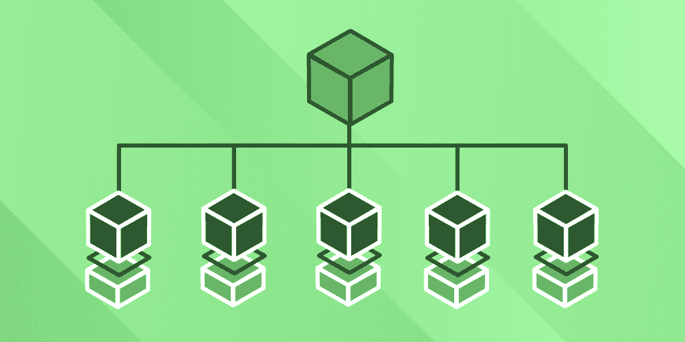
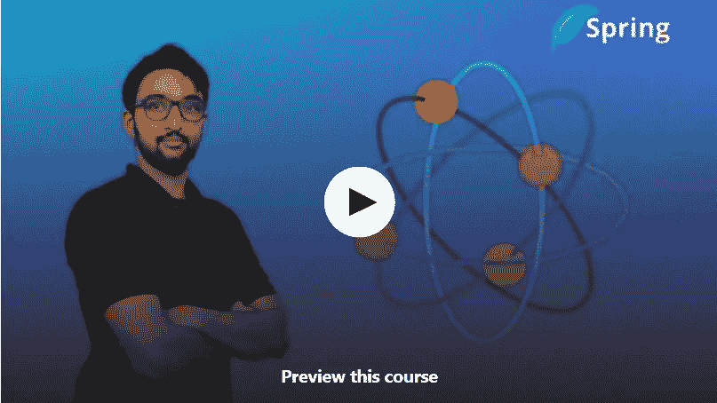
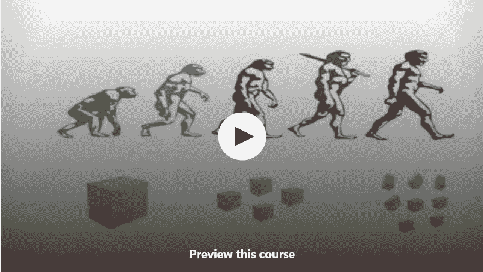
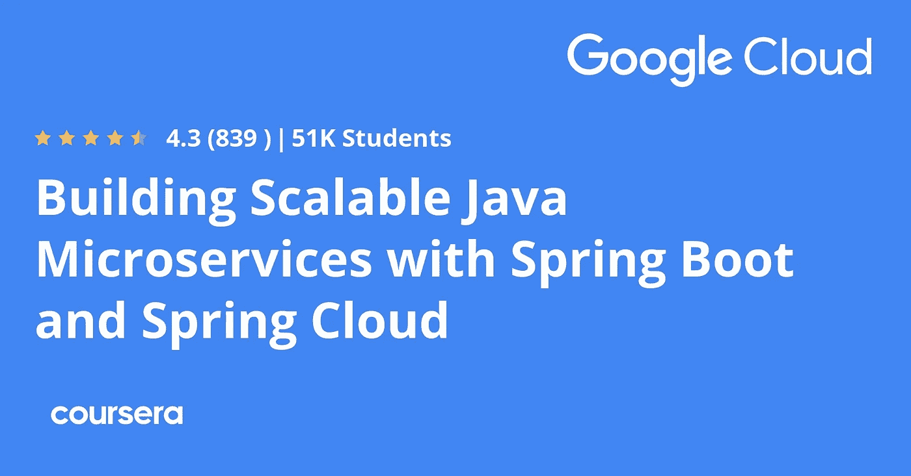
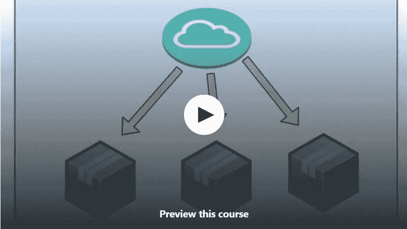

# 用 Spring Boot 和 ReactiveJ 为 Java 程序员学习微服务的 7 门最佳免费课程

> 原文：<https://medium.com/javarevisited/7-free-microservices-courses-for-java-programmers-c9b2f3a2ea7d?source=collection_archive---------0----------------------->

## 我最喜欢的免费在线课程，从 Udemy、Coursera 和其他流行的在线门户网站学习 Java 微服务。

image_credit —教育性

你好，Java 程序员，如果你想学习微服务架构并寻找免费的微服务资源，如免费的在线课程和书籍，那么你来对地方了。

前面我已经分享过 Java 程序员 使用 Java 和 Spring 框架搭建微服务的 [**最佳微服务课程，而今天我要分享一些使用**](/javarevisited/10-best-java-microservices-courses-with-spring-boot-and-spring-cloud-6d04556bdfed) **[Spring Boot](/javarevisited/top-10-courses-to-learn-spring-boot-in-2020-best-of-lot-6ffce88a1b6e) 和 [Spring 云框架](/javarevisited/5-best-courses-to-learn-spring-cloud-and-microservices-1ddea1af7012)学习 Java 微服务的免费课程。**

如果你不知道，*微服务*是一种现代架构，它与[云计算](/javarevisited/5-best-cloud-computing-courses-to-learn-in-2020-f5f091159401?source=---------32----------------------------)配合得很好，使部署、扩展甚至开发变得更加容易。

它提供了一种部署 Java 应用程序的新方法，将一个单一的 Java 应用程序分解成多个小的独立的 Java 应用程序，这些应用程序可以独立开发、部署和测试。

遵循微服务架构有几个好处，比如，*多个开发人员可以同时处理多个流程*。构建和发布过程变得更加容易，因为您只需要部署您正在更改的内容等等。

微服务的另一个伟大之处是它与云齐头并进。它们更容易扩展，通常使用像 [**Docker**](https://www.java67.com/2018/02/5-free-docker-courses-for-java-and-DevOps-engineers.html) 这样的容器来部署，这使得部署更容易，也可以使用 [Kubernetes](/javarevisited/10-best-kubernetes-courses-for-developers-and-devops-engineers-94c35cd3a2fd) 来自动进行进一步扩展。

随着越来越多的人转向基于云的架构，微服务越来越受欢迎，现在它已经成为 Java 开发人员的一项基本技能。

在用 Java 开发基于微服务的应用时， [Spring framework](https://www.java67.com/2017/11/top-5-free-core-spring-mvc-courses-learn-online.html) 提供了创建、维护和部署企业级微服务的最佳解决方案。微服务允许从许多小的协作组件构建非常大的系统。

如果你仔细观察，就会发现它遵循了基于组件开发的 Spring 模型。微服务是使用一个小流程构建的，该流程协作完成您指定的任务。

当应用程序由小型协作组件或 Java 类或 Spring beans 组成时，Spring 也做同样的事情。这种松散耦合的设计提供了许多推动现代软件开发的好处。

顺便说一句，如果你热衷于使用 Spring Boto 和 Spring Cloud 进行微服务开发，那么我强烈推荐 Udemy 上的 [**大师微服务与 Spring Boot 和 Spring Cloud 课程**](https://click.linksynergy.com/fs-bin/click?id=JVFxdTr9V80&subid=0&offerid=323058.1&type=10&tmpid=14538&RD_PARM1=https%3A%2F%2Fwww.udemy.com%2Fmicroservices-with-spring-boot-and-spring-cloud%2F) 。这不是免费的，但是很实惠，你可以在 Udemy 上花 10 美元买到。

<https://click.linksynergy.com/fs-bin/click?id=JVFxdTr9V80&subid=0&offerid=323058.1&type=10&tmpid=14538&RD_PARM1=https%3A%2F%2Fwww.udemy.com%2Fmicroservices-with-spring-boot-and-spring-cloud%2F>  

# 2023 年 Java 开发者学习的 7 门最佳免费 Spring Boot 和反应式微服务课程

为了不浪费你的时间，这里有一个免费的在线课程列表，你可以加入来学习微服务架构，并使用 [Spring Boot](https://www.java67.com/2018/06/5-best-courses-to-learn-spring-boot-in.html) 、 [Spring Cloud](https://javarevisited.blogspot.com/2018/04/top-5-spring-cloud-courses-for-java.html) 和 [RxJava](https://github.com/ReactiveX/RxJava) 框架来构建它们。

这些免费课程由类似 [Redhat training](https://click.linksynergy.com/deeplink?id=CuIbQrBnhiw&mid=39197&murl=https%3A%2F%2Fwww.udemy.com%2Fuser%2Fmike-morris-9%2F) 、[、 *Google Cloud Training* 、](https://coursera.pxf.io/c/3294490/1164545/14726?u=https%3A%2F%2Fwww.coursera.org%2Finstructor%2Fgoogle-cloud-training)的专家打造，受到成千上万开发者的信赖。

它们也由流行的在线网站提供，如 [Udemy](https://click.linksynergy.com/deeplink?id=CuIbQrBnhiw&mid=39197&murl=https%3A%2F%2Fwww.udemy.com%2F) 、 [Coursera](https://coursera.pxf.io/c/3294490/1164545/14726?u=https%3A%2F%2Fwww.coursera.org%2F) 和 [Edureka](https://click.linksynergy.com/deeplink?id=JVFxdTr9V80&mid=42536&murl=https%3A%2F%2Fwww.edureka.co%2F&LSNSUBSITE=LSNSUBSITE) ，这是一个流行的在线现场培训平台，是想要了解微服务的 Java 开发人员的理想选择。对于初学者和具有一些微服务知识和经验的开发人员来说，它们同样有用。

## 1.[使用微服务架构开发云原生应用](https://click.linksynergy.com/deeplink?id=JVFxdTr9V80&mid=39197&murl=https%3A%2F%2Fwww.udemy.com%2Fcourse%2Fdeveloping-cloud-native-applications-microservices-architectures%2F)

这是 Udemy 的另一个免费的微服务课程，可以用来寻找合适的框架和工具来用 Java 构建你的微服务架构。本课程由 JBoss 的赞助人之一、RedHat Linux 的创建者 Red Hat Inc .创建。

在这个官方的[红帽培训课程](https://click.linksynergy.com/deeplink?id=CuIbQrBnhiw&mid=39197&murl=https%3A%2F%2Fwww.udemy.com%2Fuser%2Fmike-morris-9%2F)中，红帽的首席开发者倡导者 Burr Sutter 将带你深入探究微服务架构。

以下是您将在本课程中学到的关键技能:

1.执行微服务架构的基础。

2.了解如何通过 [DevOps 管道](https://javarevisited.blogspot.com/2018/09/10-devops-courses-for-experienced-java-developers.html#axzz6hB6A1qlY)部署各种微服务框架。

本课程面向希望结合不同框架和工具为其组织构建微服务架构的程序员和开发人员。对于任何寻求理解 [OpenShift](https://javarevisited.blogspot.com/2020/07/top-5-courses-to-learn-redhat-openshift.html#axzz6cRYpiwdu) 和 [Kubernetes](https://javarevisited.blogspot.com/2020/06/top-5-courses-to-learn-kubernetes-for-devops-and-certification.html) 工具和平台的人来说，这也是很棒的。

这里是参加本课程的链接。[利用微服务架构开发云原生应用](https://click.linksynergy.com/deeplink?id=JVFxdTr9V80&mid=39197&murl=https%3A%2F%2Fwww.udemy.com%2Fcourse%2Fdeveloping-cloud-native-applications-microservices-architectures%2F)

## 2.[主春微服与 Spring Boot &春云！](https://click.linksynergy.com/deeplink?id=JVFxdTr9V80&mid=39197&murl=https%3A%2F%2Fwww.udemy.com%2Fcourse%2Fspring-microservices-with-spring-boot-spring-cloud-training%2F)

这是在 Udemy 上与 Spring Boot 和 Spring Cloud 一起学习微服务的最佳免费课程之一。这个课程是由 Karthikeyan T 创建的，他是我过去推荐过的一个全栈 Java 课程的作者。在这个免费的微服务课程中，您将了解微服务架构的基础知识。

一旦你理解了基础知识，你将使用 [Spring Boo](/javarevisited/10-advanced-spring-boot-courses-for-experienced-java-developers-5e57606816bd?source=collection_home---4------0-----------------------) t 和 [Spring cloud](https://www.java67.com/2021/01/spring-cloud-interview-questions-with-answers-java.html) 开发一个迷你微服务应用，其中你将创建几个服务，如定价服务、库存服务、货币兑换服务，以构建一个微服务架构。

这个课程可以免费获得一些开发微服务的实践经验。

如果你已经知道 Spring boot 和一点点 Spring cloud，那么你会学得很快，但即使你不知道，你仍然会免费获得许多有用的信息。我强烈推荐这个课程给任何想用 Spring 学习 Java 微服务的人。

**以下是加入本课程的链接**——[与 Spring Boot &春云一起掌握春微服务！](https://click.linksynergy.com/deeplink?id=JVFxdTr9V80&mid=39197&murl=https%3A%2F%2Fwww.udemy.com%2Fcourse%2Fspring-microservices-with-spring-boot-spring-cloud-training%2F)

## 3.[用 ReactiveJ 开发一个反应式 Java 微服务](https://click.linksynergy.com/deeplink?id=JVFxdTr9V80&mid=39197&murl=https%3A%2F%2Fwww.udemy.com%2Fcourse%2Fdevelop-a-reactive-java-microservice-with-reactivej%2F)

这是另一个用 Java 学习微服务的免费 Udemy 课程。之前的课程和本课程的不同之处在于，它使用了 *ReactiveJ* 和 *RxJava* 用 Java 构建反应式微服务，而不是 Spring Boot 和 Spring Cloud。

在本课程中，您将学习反应式编程的主要概念，我们将使用 [Java](/javarevisited/10-best-places-to-learn-java-online-for-free-ce5e713ab5b2) 、ReactiveJ 和 RxJava2 开发一个反应式微服务。这门课程适合初学者。

以下是您将在本课程中学到的主要内容

*   反应式编程
*   JSR 340 和 servlets 3.1 规范
*   反应式编程的优势
*   无阻塞嵌入式码头
*   ReactiveJ 非阻塞异步库
*   用 ReactiveJ 开发异步阻塞式应用程序
*   使用 ReactiveJ 和 RxJava2 开发一个异步和非阻塞的应用程序

如果你不知道 Spring Boot 和 Spring Cloud 并不是开发 Micrserovde 的唯一途径，你还有其他选择，比如 RxJava、 [Quarkus](/javarevisited/10-best-free-dropwizard-vert-x-micronaut-and-quarkus-online-courses-for-java-developers-9c2b4161f17) 、 [MicroNaut](https://javarevisited.blogspot.com/2020/09/top-5-courses-to-learn-dropwizard-Micronaut-Quarkus-Java-Microservices.html) 等等。这个免费课程非常适合探索用 Java 构建微服务的另一种选择。

**这是加入本课程的链接** — [用 ReactiveJ 开发一个反应式 Java 微服务](https://click.linksynergy.com/deeplink?id=JVFxdTr9V80&mid=39197&murl=https%3A%2F%2Fwww.udemy.com%2Fcourse%2Fdevelop-a-reactive-java-microservice-with-reactivej%2F)

## 4.[微服务基础](https://click.linksynergy.com/deeplink?id=CuIbQrBnhiw&mid=39197&murl=https%3A%2F%2Fwww.udemy.com%2Fcourse%2Fevolution-of-microservices%2F)【免费 Udemy 课程】

这是一门比我们迄今为止所看到的任何课程都更为基础的课程。如果你是一个完全的微服务初学者，那么我建议你应该从这个免费课程开始。

本课程非常有助于了解什么是微服务，它提供了哪些优势，为什么您应该使用[微服务](https://javarevisited.blogspot.com/2019/09/top-5-courses-to-learn-soa-service-oriented-architecture-microservices.html)，以及如何设计一个高度可用、容错、安全且可扩展的分布式系统。

在这个免费的 Udemy 课程中，您将会学到以下关键概念:

1.  什么是整体建筑？
2.  Monolith 有什么问题&更高级的模式是如何解决的？
3.  什么是面向服务的架构，为什么 SOA 出现了？
4.  微服务的发展
5.  什么是微服务？为什么选择微服务？
6.  谁应该使用微服务
7.  微服务等解决了哪些问题？

本课程还将向您介绍 Monolith、SOA 和微服务之间的区别，以便您为自己的应用选择合适的架构。

**这里是加入这个免费课程**——[微服务基础](https://click.linksynergy.com/deeplink?id=CuIbQrBnhiw&mid=39197&murl=https%3A%2F%2Fwww.udemy.com%2Fcourse%2Fevolution-of-microservices%2F)的链接

## 5.[用 Spring Boot 和 Spring Cloud 构建可扩展的 Java 微服务【免费 Coursera 课程】](https://coursera.pxf.io/c/3294490/1164545/14726?u=https%3A%2F%2Fwww.coursera.org%2Flearn%2Fgoogle-cloud-java-spring)

这是另一个用 Spring Boot 和 Spring Cloud 为 Java 开发者学习微服务的免费课程。这个课程最大的好处是它可以在 Coursera 上找到，并且是由[**Google Cloud Training**](https://coursera.pxf.io/c/3294490/1164545/14726?u=https%3A%2F%2Fwww.coursera.org%2Finstructor%2Fgoogle-cloud-training)提供的，所以你可以向这个行业中最好的人学习。

在本课程中，你将学习如何在[谷歌云平台](/javarevisited/5-best-courses-to-learn-google-cloud-platform-gcp-in-2021-169093a3771a)上使用 [Spring Boot](/javarevisited/top-10-courses-to-learn-spring-boot-in-2020-best-of-lot-6ffce88a1b6e) 和 [Spring Cloud](/javarevisited/5-best-courses-to-learn-spring-cloud-and-microservices-1ddea1af7012) 构建 Java 应用。您将使用云运行时配置和 Spring Cloud Config 来管理应用程序的配置。您将通过云发布/订阅和 Spring 集成来发送和接收消息。

您还将使用 Cloud SQL 作为 Java 应用程序的托管关系数据库，并学习如何迁移到 Cloud Spanner，这是 Google Cloud 的全球分布式强一致性数据库服务。您还将学习如何使用 Stackdriver 跟踪和调试 Spring 应用程序。

**这是加入本课程的链接**——[用 Spring Boot 和 Spring Cloud 构建可扩展的 Java 微服务](https://coursera.pxf.io/c/3294490/1164545/14726?u=https%3A%2F%2Fwww.coursera.org%2Flearn%2Fgoogle-cloud-java-spring)

为了从本课程中获得最大收益，您应该熟悉 Java 编程语言，并使用像 [Maven](/javarevisited/6-best-maven-courses-for-beginners-in-2020-23ea3cba89) 或 [Gradle](/javarevisited/5-best-gradle-courses-and-books-to-learn-in-2021-93f49ce8ff8e) 这样的工具构建 Java 应用程序。

你也应该对谷歌云平台有大致的了解，如果你是 GCP 的新手，你也可以查看这些[免费的谷歌云平台课程](/javarevisited/7-free-courses-to-learn-google-cloud-platform-for-beginners-cbb260fbd8e4)来学习 GCP 的基础知识。

</javarevisited/8-free-google-cloud-data-engineer-certification-courses-and-practice-tests-594f31643b58>  

## 6.微服务全课程—4 小时学会微服务[免费]

这是一个长达 4 小时的免费课程，学习 Edureka 的微服务，edu reka 是一家领先的在线培训公司，以其热门技术技能的实时培训课程而闻名。

这个免费的微服务视频课程将通过实例帮助你从零开始学习微服务。这份微服务教程对于初学者和想要掌握[微服务架构](https://www.java67.com/2021/02/microservices-interview-questions-answers-java-spring.html)的专业人士来说都是非常理想的。

以下是本面向初学者的微服务教程视频中涵盖的主题:

1.  微服务简介
2.  为什么选择微服务？什么是微服务？
3.  什么是微服务架构？特点、优势、挑战、工具等
4.  带有 [Spring Boot](/hackernoon/top-5-spring-boot-and-spring-cloud-books-for-java-developers-75df155dcedc?source=---------23------------------) 和[对接器](/javarevisited/5-best-docker-courses-for-java-and-spring-boot-developers-bbf01c5e6542)的微服务
5.  SOA 与微服务架构、用例、示例
6.  微服务与 API
7.  微服务设计模式，如事件源、断路器、CQRS 等
8.  无服务器、微服务最佳实践、安全实施等
9.  微服务的监控和部署。

总的来说，这是一门在微服务内外都值得学习的课程，我向有经验的 Java 开发人员和任何想学习微服务的人强烈推荐这门免费课程。你可以在 Youtube 或者这里看。

此外，如果您正在寻找现场培训课程，那么您也可以查看来自 Edureka 的<https://click.linksynergy.com/deeplink?id=JVFxdTr9V80&mid=42536&murl=https%3A%2F%2Fwww.edureka.co%2Fmicroservices-architecture-training&LSNSUBSITE=LSNSUBSITE>**微服务认证培训，这不是免费的，但却是深入学习微服务的最佳方式之一。**

**<https://click.linksynergy.com/deeplink?id=JVFxdTr9V80&mid=42536&murl=https%3A%2F%2Fwww.edureka.co%2Fmicroservices-architecture-training&LSNSUBSITE=LSNSUBSITE> ** 

## **7.[用 Spring Boot 和春云打造 Java 微服务](https://click.linksynergy.com/deeplink?id=CuIbQrBnhiw&mid=39197&murl=https%3A%2F%2Fwww.udemy.com%2Fcourse%2Fbuild-java-microservices-with-spring-boot-and-spring-cloud%2F)**

**这是另一个免费的实践课程，学习如何使用 Spring Boot 和 Spring Cloud Framework 在 Java 中开发微服务。在这个 1 小时 40 分钟的免费课程中，您将**

**这门免费课程包括以下内容:**

1.  **单片和微服务有什么区别？**
2.  **如何使用 Spring Boot 和 Spring Cloud 构建简单的微服务？**
3.  **如何使用 Spring Initializr 生成一个 [Spring Boot 应用程序](https://javarevisited.blogspot.com/2019/02/difference-between-contextconfiguration-and-springapplicationConfiguration-annotations-in-spring-boot-testing.html)**
4.  **如何建立一个尤里卡服务器**
5.  **如何在 Java 中使用 Lombok 清理代码？**
6.  **如何使用 [Spring Data JPA](https://www.java67.com/2021/01/spring-data-jpa-interview-questions-answers-java.html) 使用嵌入式 H2 数据库**
7.  **如何在 Eureka 服务器中注册 Eureka 客户端**
8.  **如何使用 FeignClient 进行微服务之间的交互**
9.  **如何构建一个简单的网关应用程序**
10.  **使用 ribbon 的客户端负载平衡**

**总的来说，这是一个非常棒的免费在线课程，可以了解微服务以及用 Java 构建微服务所需的各种库和框架。强烈推荐这个免费课程，给想学习 Java 微服务的 Java 程序员和初学者体验。**

****这里是加入本课程的链接**——[用 Spring Boot 和 Spring Cloud 构建 Java 微服务](https://click.linksynergy.com/deeplink?id=CuIbQrBnhiw&mid=39197&murl=https%3A%2F%2Fwww.udemy.com%2Fcourse%2Fbuild-java-microservices-with-spring-boot-and-spring-cloud%2F)**

****

**以上是针对 Java 和 Spring 开发者的**免费微服务课程**。如果你想了解更多关于微服务架构的知识，或者想使用 Spring Boot、Spring Cloud 和 RxJava 构建一个微服务应用，那么你可以加入这些[免费的 Udemy 和 Coursera 课程](/javarevisited/10-free-angular-and-react-js-courses-from-udemy-and-coursera-best-of-lot-e67f7d811e6b)来学习这些热门而有用的技能。**

**学习微服务架构和开发的最大好处是，微服务和云是携手并进的，而且由于云原生开发的推动，微服务也变得日益流行。**

**现在是开始学习微服务的最佳时机，这些免费的在线课程是最好的开始。**

**您可能想探索的其他**编程资源文章****

*   **[面向 Java 开发者的 10 门免费 Spring 框架课程](/javarevisited/top-10-free-courses-to-learn-spring-framework-for-java-developers-639db9348d25)**
*   **[与 Spring Boot 一起学习微服务的 5 大课程](/javarevisited/top-5-courses-to-learn-microservices-in-java-and-spring-framework-e9fed1ba804d)**
*   **[初学者学习 Spring 的 10 门免费课程](/javarevisited/top-10-free-courses-to-learn-spring-framework-for-java-developers-639db9348d25)**
*   **[初学者学习 Spring MVC 的 5 门最佳课程](https://javarevisited.blogspot.com/2020/08/top-5-courses-to-learn-spring-mvc-for.html)**
*   **[深入学习 Spring 的 10 门最佳课程](/javarevisited/10-best-online-courses-to-learn-spring-framework-in-2020-f7f73599c2fd)**
*   **[破解编码面试的 5 个必备技巧](https://javarevisited.blogspot.com/2020/04/5-essential-skills-to-crack-coding-interviews.html)**
*   **[编程/编码工作面试 10 门课程](http://javarevisited.blogspot.sg/2018/02/10-courses-to-prepare-for-programming-job-interviews.html)**
*   **免费学习核心 Java 的 10 门在线课程**
*   **[面向有经验的 Java 开发人员的 5 大 Java 设计模式课程](http://javarevisited.blogspot.sg/2018/02/top-5-java-design-pattern-courses-for-developers.html)**
*   **[学习大数据和 Apache Spark 的 5 门课程](http://javarevisited.blogspot.com/2017/12/top-5-courses-to-learn-big-data-and.html)**
*   **每个 Java 开发人员都应该学习的 5 个基本框架**
*   **[10 个面向 Java 开发者的免费 Spring Boot 教程和课程](/javarevisited/10-free-spring-boot-tutorials-and-courses-for-java-developers-53dfe084587e)**

**感谢您阅读本文。如果你觉得这些来自 Udemy 和 Coursera 的*免费微服务课程有用，那么请与你的朋友和同事分享。如果您有任何问题、反馈或任何其他收费课程要添加到此列表中，请随时提出建议。***

****P. S.** —如果你想使用 Spring Boto 和 Spring Cloud 学习微服务开发，那么我强烈推荐你在 Udemy 上查看 Ranga 的 [**Master 微服务与 Spring Boot 和 Spring Cloud 课程**](https://click.linksynergy.com/fs-bin/click?id=JVFxdTr9V80&subid=0&offerid=323058.1&type=10&tmpid=14538&RD_PARM1=https%3A%2F%2Fwww.udemy.com%2Fmicroservices-with-spring-boot-and-spring-cloud%2F) 。这不是免费的，但是很实惠，你可以在 Udemy 上花 10 美元买到。超过 9 万名 Java 程序员已经从中受益。**

**<https://click.linksynergy.com/fs-bin/click?id=JVFxdTr9V80&subid=0&offerid=323058.1&type=10&tmpid=14538&RD_PARM1=https%3A%2F%2Fwww.udemy.com%2Fmicroservices-with-spring-boot-and-spring-cloud%2F> **