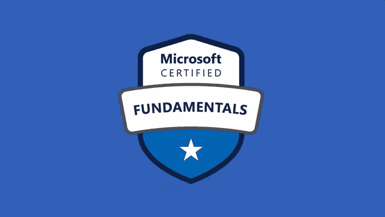
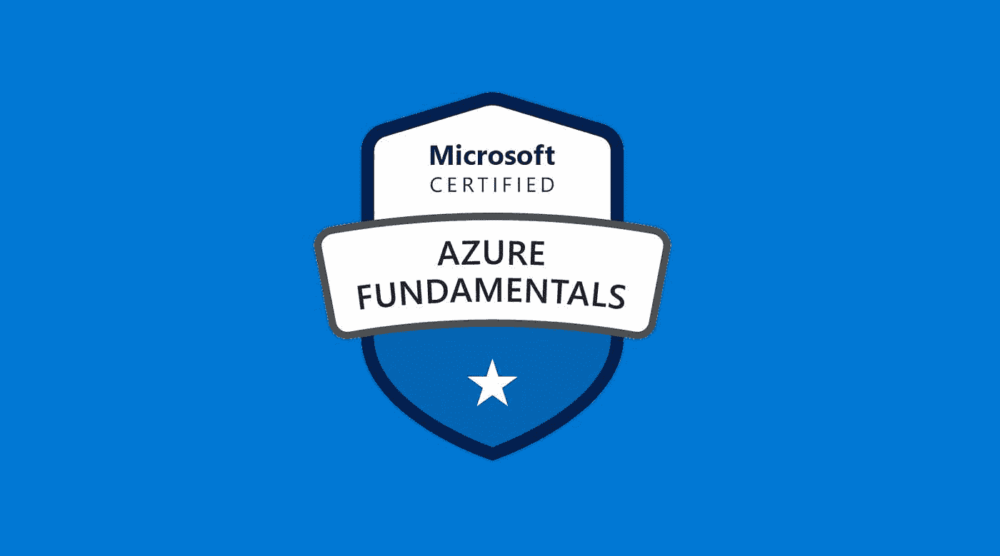
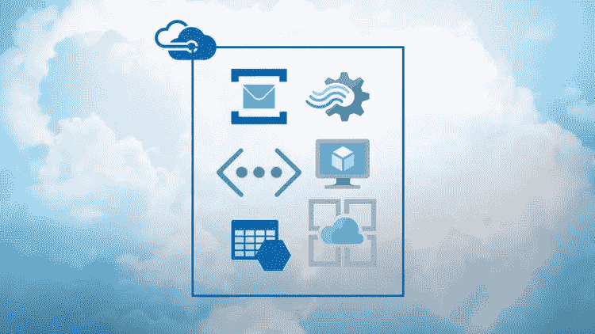
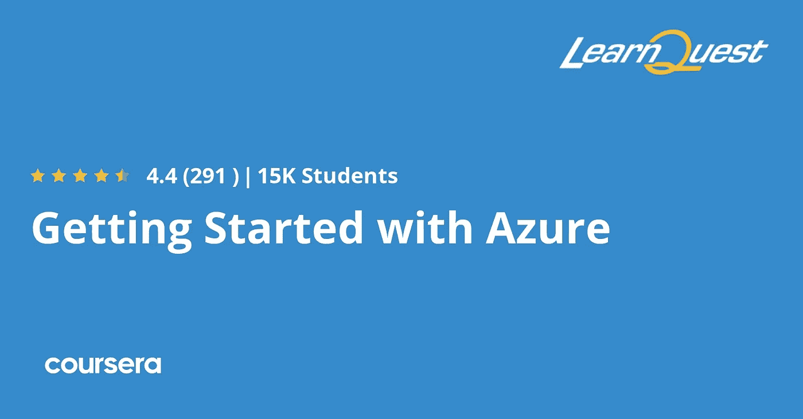
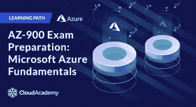
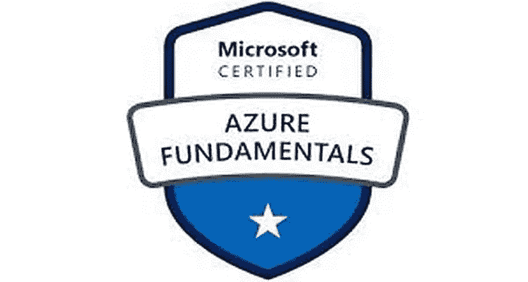

# 2023 年 7 个最佳免费微软 Azure 基础(AZ-900)初学者在线课程

> 原文：<https://medium.com/javarevisited/7-free-microsoft-azure-fundamentals-az-900-online-courses-for-beginners-in-2021-efd01d8be403?source=collection_archive---------0----------------------->

## 准备 AZ-900 或 Azure 基础认证？这里有免费的在线课程，为 2023 年的云认证做准备

大家好，如果你正在准备 AZ-900 认证或 Azure 基础考试，并寻找免费的在线课程开始准备，那么你来对地方了。

在过去，我已经分享了免费和付费课程来学习 [AWS](https://www.java67.com/2018/05/top-5-amazon-web-services-or-aws-courses-to-learn-online.html) 、 [Azure](https://javarevisited.blogspot.com/2020/09/top-5-courses-to-learn-microsoft-azure.html#axzz6XbrCHCk9) 和 [Google Cloud](https://javarevisited.blogspot.com/2019/07/top-5-google-cloud-platform-gcp-courses-certifications-online.html) 以及[最佳 AZ-900 课程](/javarevisited/5-best-azure-fundamentals-courses-to-pass-az-900-certification-exam-in-2020-9e602aea035d)和[实践测试](https://javarevisited.blogspot.com/2020/02/top-5-AZ-900-exam-Azure-Fundamentals-certification-practice-tests-and-mock-exams-to.html)，今天，我将分享通过 Azure 基础考试的*免费 AZ-900 课程*。

如果你想学习云计算和微软 Azure 平台，那么这是最好的云认证开始。

微软是顶尖的云服务提供商之一；它因其可靠性和安全性而广受欢迎。除此之外，云行业是这个时代发展最快的行业，在未来几年，它将加入顶级行业的行列。

要成为一名成功的云计算工程师，你必须拥有云计算巨头的专业认证。如果你计划参加像[**Azure Fundamentals AZ-900**](https://javarevisited.blogspot.com/2020/04/how-to-crack-microsoft-azure-fundamentals-certification-az-900-exam.html)这样的认证考试，那么恭喜你，你做了一个伟大的决定。然而，如果你仍然对证书感到疑惑，那么你必须抓紧时间，时间是有限的。

在本指南中，我将分享*七门免费课程*，帮助你顺利通过 [**蔚蓝** **基础 AZ-900 考试**](https://www.java67.com/2020/09/5-free-courses-to-crack-azure-fundamentals-AZ-900-certification-exam.html) 。下面列出的所有课程都是由行业专家创建的，每一门课程都是经过数小时的研究挑选出来的。没有一门课程会让你失望。

这种特殊的认证考试是专门用来测试考生的基础知识的。因此，即使你是一个初学者，没有任何先验知识，你也可以通过这个考试，但这里唯一的问题是，你需要彻底学习每一门课程。

此外，如果你不介意花几块钱学习 Azure 和云计算等有用的技能，并寻找更全面和深入的课程来学习 Azure 服务，那么我也建议你在 Udemy 上查看 Scott Duffy 的[**AZ-900:Microsoft Azure Fundamentals 考试准备**](https://click.linksynergy.com/deeplink?id=JVFxdTr9V80&mid=39197&murl=https%3A%2F%2Fwww.udemy.com%2Fcourse%2Faz900-azure%2F) **课程。**这是准备 2023 年 AZ-900 认证考试最好的在线课程之一。

 [## AZ-900: Microsoft Azure 基础知识考试准备

### 你好，我叫斯科特·达菲。我喜欢让复杂的技术话题变得简单易懂。这是…

udemy.com](https://click.linksynergy.com/deeplink?id=JVFxdTr9V80&mid=39197&murl=https%3A%2F%2Fwww.udemy.com%2Fcourse%2Faz900-azure%2F) 

# 2023 年通过 Azure 基础 AZ-900 考试的 7 门免费课程

以下是成为 Azure 认证从业者的最佳免费在线 AZ-900 课程列表。你可以参加这些课程，在第一次尝试时通过 Azure 基础认证考试。

这些在线课程由专家创建，受到成千上万开发者的信任。你也可以加入他们在线学习，成为一名 Azure 认证专家。记住，它们是完全免费的，你不需要支付任何费用。

## 1. [AZ-900 微软 Azure 基础](https://click.linksynergy.com/deeplink?id=JVFxdTr9V80&mid=39197&murl=https%3A%2F%2Fwww.udemy.com%2Fcourse%2Faz-900-azure-tutorial%2F)(免费 Udemy 课程)

如果你时间紧迫，需要一些东西来帮助你在有限的时间内准备 Azure 基础 AZ-900 考试，那么这个课程就是为你准备的。这是一个 2 小时长的视频课程，可以在 Udemy 上看到，由马鲁蒂·马克瓦纳创建，到目前为止，已经有超过 6，000 名学生注册了这个课程。

在本课程中，您将了解 Azure 平台的基础知识，以及如何在日常项目中使用它。除此之外，在本课程中，讲师将简要介绍其他 Azure 概念，如应用的安全性和部署。

图形与插图巧妙结合，使学生的理解过程变得简单，除此之外，讲师还会进行一些现场实施，并要求学生按照他的步骤进行。

如果你正在寻找一门课程，可以教你所有的概念和实际执行，那么这门课程是一个完美的选择。

**这里是加入这个免费 Azure 课程的链接**——[AZ-900 微软 Azure 基础](https://click.linksynergy.com/deeplink?id=JVFxdTr9V80&mid=39197&murl=https%3A%2F%2Fwww.udemy.com%2Fcourse%2Faz-900-azure-tutorial%2F)

## 2.[微软 Azure 概念](https://click.linksynergy.com/deeplink?id=JVFxdTr9V80&mid=39197&murl=https%3A%2F%2Fwww.udemy.com%2Fcourse%2Flinux-academy-microsoft-azure-concepts%2F) (Udemy 免费课程)

这是另一门免费课程，对学习基本的微软 Azure 概念很有帮助，对准备 [AZ-900 考试](https://javarevisited.blogspot.com/2020/04/how-to-crack-microsoft-azure-fundamentals-certification-az-900-exam.html)和[云计算](/javarevisited/5-best-cloud-computing-courses-to-learn-in-2020-f5f091159401)的任何人来说都是完美的。

本课程从基本概念开始，如什么是云？从这里开始，它着重于一点一点地解释你如何在 azure 等上工作。

这个课程是严格的视觉化和概念化。您将获得云及其服务的概念知识，这将有助于您进一步学习高级功能，这对于通过 [AZ-900 认证](https://javarevisited.blogspot.com/2020/02/top-5-AZ-900-exam-Azure-Fundamentals-certification-practice-tests-and-mock-exams-to.html)考试非常重要。

以下是您将在本课程中学到的重要知识:

*   云简介
*   蔚蓝色和云
*   azure 服务简介
*   应用和解释

这个免费的在线 azure 课程通过为你提供参考框架学习创造了奇迹，这对于解决高级 Azure 学习中的复杂问题非常有效。

**这里是加入免费 AZ-900 课程的链接**——[微软 Azure 概念](https://click.linksynergy.com/deeplink?id=JVFxdTr9V80&mid=39197&murl=https%3A%2F%2Fwww.udemy.com%2Fcourse%2Flinux-academy-microsoft-azure-concepts%2F)

此外，它还提供额外的功能和动手实验室的访问卡，以增强学习效果。课程会定期更新，因此您的所有疑问都会得到解答。

## 3.[微软 Azure 基础(Pluralsight 课程)](https://pluralsight.pxf.io/c/1193463/424552/7490?u=https%3A%2F%2Fwww.pluralsight.com%2Fcourses%2Fazure-fundamentals)

如果你对实用的方法感兴趣，那么这个课程就是为你准备的。它可以在 Pluralsight 网站上获得，虽然它是一个付费平台，但使用 10 天的试用选项，您可以快速完成这门课程。

它是由 Matt Milner 创建的，通过本课程，讲师将向您介绍[云计算](https://javarevisited.blogspot.com/2019/07/top-5-online-courses-to-learn-cloud-computing-aws.html)的优势、局限性和限制，在时间线的稍后部分，您将学习 Azure 安全性和 [SQL](/hackernoon/top-5-sql-and-database-courses-to-learn-online-48424533ac61) 的各个方面。

本课程的每一秒钟都是信息丰富的，教师们非常聪明地使用了图形。通过这些图形，即使具有挑战性的概念似乎也相对容易。

**这里是加入本课程的链接** — [微软 Azure 基础](https://pluralsight.pxf.io/c/1193463/424552/7490?u=https%3A%2F%2Fwww.pluralsight.com%2Fcourses%2Fazure-fundamentals)

因此，如果你正在寻找一个简单易学和实用的课程，那么这个课程是给你的。顺便说一下，你需要一个 [Pluralsight 会员](https://pluralsight.pxf.io/c/1193463/424552/7490?u=https%3A%2F%2Fwww.pluralsight.com%2Flearn)才能加入这个课程，费用大约是每月 29 美元或每年 299 美元(14%的折扣)。

我向所有程序员强烈推荐这个订阅，因为它提供了超过 7000 个在线课程的即时访问，以学习任何技术技能。或者，你也可以使用他们的 [**10 天免费试用**](https://pluralsight.pxf.io/c/1193463/424552/7490?u=https%3A%2F%2Fwww.pluralsight.com%2Flearn) 免费观看本课程。

 [## 个人技术技能|多视角

### 借助 Pluralsight，在开发运维、机器学习、云、安全基础设施等领域构建所需技能…

pluralsight.pxf.io](https://pluralsight.pxf.io/c/1193463/424552/7490?u=https%3A%2F%2Fwww.pluralsight.com%2Flearn) 

## 4.【Azure 入门(Coursera 免费课程)

如果你刚刚开始使用 Azure，并且想要详细地了解一切，那么这个 Coursera 课程是你的完美选择。该课程目前已有超过 9000 名学生注册，在 [Coursera](/javarevisited/18-coursera-courses-you-can-join-in-2020-to-learn-from-the-worlds-top-tech-companies-google-74af46967d1e?source=collection_home---4------0-----------------------) 上被评为畅销课程。

这是一个 20 小时长的视频课程，在整个课程中，讲师会给学生分配不同的任务，只有当他们按时完成这些任务时，他们才能观看下一个视频。尽管这些任务有灵活的截止日期，但你不能跳过它们。在本课程中，您将学到以下内容:

*   Azure 简介
*   在 Azure 上部署虚拟机
*   Azure 的安全性
*   Azure 网络的部署
*   防火墙和资源配置

通过本课程，你将有各种概念的实际实施，其余的将在简单而迷人的图形的帮助下教授。

**这里是加入这个 Azure 课程的链接**—[Azure 入门](https://coursera.pxf.io/c/3294490/1164545/14726?u=https%3A%2F%2Fwww.coursera.org%2Flearn%2Fcloud-azure-intro)

顺便说一下，如果你计划参加多个 Coursera 课程或专业，那么考虑参加 [**Coursera Plus 订阅**](https://coursera.pxf.io/c/3294490/1164545/14726?u=https%3A%2F%2Fwww.coursera.org%2Fcourseraplus) ，它将为你提供无限制的访问他们最受欢迎的课程、专业、专业证书和指导项目的机会。

它每年花费大约 399 美元，但它完全值得你的钱，因为你可以获得无限的证书。

 [## Coursera Plus |无限制访问 7，000 多门在线课程

### 用 Coursera Plus 投资你的职业目标。无限制访问 90%以上的课程、项目…

coursera.pxf.io](https://coursera.pxf.io/c/3294490/1164545/14726?u=https%3A%2F%2Fwww.coursera.org%2Fcourseraplus) 

## 5. [AZ-900 备考:微软 Azure 基础(免费 CloudCademy 课程)](https://cloudacademy.com/learning-paths/az-900-exam-preparation-microsoft-azure-fundamentals-524/)

如果你有足够的时间，并能参加深入的解释性视频，那么这个 cloudacademy.com 课程是给你的。在这个 **6 小时长的**视频课程中，你将了解与 Azure 平台相关的每一个元素。

这个课程是盖伊·胡梅尔创建的；他是一位蓝色专家。到目前为止，他已经创建了 60 门关于云计算的不同课程，教授了超过 54000 名学生。他有超过 25 年的教学经验，因此理解这些概念对你来说不成问题。

这个课程很吸引人的一个特点就是有其他行业专家的专题讲座，授课老师也在定期更新课程内容。因此，你将获得关于 Azure 平台的最新信息。

## 6.微软 Azure 基础认证课程(AZ-900)(免费代码营)

这是另一个准备微软 Azure 基础认证的免费资源。由领先的 AWS 和云专家 Andrew Brown 创建的这个 **3 小时课程**非常适合快速准备 Azure 基础认证。

Azure 基础知识考试是证明云概念、核心 Azure 服务、Azure 定价、SLA 和生命周期以及云安全、隐私、合规性和信任的基础知识的机会。在本课程中，您将了解所有这些内容。

**这里是免费观看本课程的 youtube 链接** :-

## 7. [AZ-900 Prep — Azure 虚拟机(VMs)大师班(免费 Udemy 课程)](https://click.linksynergy.com/deeplink?id=JVFxdTr9V80&mid=39197&murl=https%3A%2F%2Fwww.udemy.com%2Fcourse%2Fazure-virtual-machines-master-class%2F)

如果你正在寻找一门在非常有限的时间内涵盖与 Azure 基础 AZ-900 考试相关的广泛主题而又不影响信息的课程，那么这门课程就是为你准备的。

它可以在 Udemy 上找到，已经有 700 多名学生注册了这门课程。这是最新上传到 Udemy 上的课程之一，但它的讲师“Xaas Technologies”与云计算有着悠久的历史。

到目前为止，“Xaas 技术”已经通过他们的 Udemy 课程教授了超过 83000 名学生。这是一门快节奏的重点课程，涉及 Azure 的以下概念:

*   建立工作关系网
*   虚拟机
*   负载平衡
*   安全性

所有这些概念都使用适当的图形和插图进行深入讲授。如果您需要在更短的时间内获得更多的输出，您必须注册本课程。

**这里是加入这个免费课程的链接** — [AZ-900 Prep — Azure 虚拟机(VMs)大师班](https://click.linksynergy.com/deeplink?id=JVFxdTr9V80&mid=39197&murl=https%3A%2F%2Fwww.udemy.com%2Fcourse%2Fazure-virtual-machines-master-class%2F)

以上是**免费 AZ-900 课程，为 Azure 基础认证**做准备。以上列出的所有课程都是为初学者设计的，并逐渐贯穿于讲师，提升水平。

如果你刚刚开始准备 *Azure 基础 AZ-900 考试*，那么你必须报名参加所有的课程，并至少观看几个视频，然后决定哪一个对你来说更容易理解。

如果你遇到一些没有列在这里但能提供高质量信息的课程，请告诉我。

面向 IT 专业人员和 Java 程序员的其他 **Azure** **认证资源**

*   [破解 Azure 开发人员助理考试的前 5 门课程](https://javarevisited.blogspot.com/2020/06/top-5-course-to-crack-Microsoft-Azure-Developer-Certification-Exam-AZ-203.html)
*   [如何破解 AWS 解决方案架构师考试](https://javarevisited.blogspot.com/2019/08/how-to-crack-aws-certified-solution-architect-exam.html)
*   [学习微软 Azure 概念的 5 门免费课程](https://www.java67.com/2020/07/5-free-courses-to-learn-microsoft-azure-cloud.html)
*   [如何破解 2023 年 AZ-103 Azure 行政考试](https://javarevisited.blogspot.com/2020/04/how-to-crack-microsoft-az-103-azure-administrator-associate-exam-certification.html)
*   [学习 Docker 和 Kubernetes 的十大课程](https://dev.to/javinpaul/top-10-courses-to-learn-docker-and-kubernetes-for-programmers-4lg0)
*   [如何破解甲骨文 2023 年 Java 认证？](https://medium.freecodecamp.org/how-to-pass-oracles-java-certifications-a-practical-guide-for-developers-e9b607ba6173)
*   [10 门数据科学和机器学习认证课程](https://dev.to/javinpaul/10-data-science-and-machine-learning-courses-for-programmers-looking-to-switch-career-57kd)
*   [如何在 2023 年成为 Azure 解决方案架构师助理](https://javarevisited.blogspot.com/2020/04/how-to-crack-microsoft-azure-solution-architect-exam-az-300.html)
*   [通过 Azure 云架构考试的前 5 门课程](https://javarevisited.blogspot.com/2019/07/top-5-courses-to-crack-azure-architecture-technologies-certification-az-300-exam.html)
*   [2023 年通过 AZ-900 认证的 5 大球场](https://javarevisited.blogspot.com/2020/02/top-5-courses-to-crack-az-900-microsoft-azure-fundamentals-certification-exam.html)
*   [春季认证对工作和事业有帮助吗？](https://javarevisited.blogspot.com/2017/07/does-spring-certification-help-in-job-and-career.html)
*   [微软 Azure 基础知识前 5 名模拟测试](https://javarevisited.blogspot.com/2020/02/top-5-AZ-900-exam-Azure-Fundamentals-certification-practice-tests-and-mock-exams-to.html)
*   [破解 Azure 云架构师(AZ-300)考试的前 5 门课程](https://javarevisited.blogspot.com/2019/07/top-5-courses-to-crack-azure-architecture-technologies-certification-az-300-exam.html#axzz6E6VuRMsx)
*   [通过 Azure 开发人员助理认证的 5 门在线课程](https://javarevisited.blogspot.com/2020/06/top-5-course-to-crack-Microsoft-Azure-Developer-Certification-Exam-AZ-203.html)
*   [破解 AWS 解决方案架构师认证的前 5 门课程](https://javarevisited.blogspot.com/2019/05/top-5-courses-to-crack-aws-solutions-architect-associate-certification-exam-SAA-C01.html#axzz5rHwAwycj)
*   [程序员前 5 名 AZ-900 模拟测试](https://javarevisited.blogspot.com/2020/02/top-5-AZ-900-exam-Azure-Fundamentals-certification-practice-tests-and-mock-exams-to.html)
*   [通过谷歌助理云工程师认证的前 5 门课程](https://javarevisited.blogspot.com/2019/07/top-5-google-cloud-platform-gcp-courses-certifications-online.html)
*   [如何通过 Spring Core Professional 5.0 认证](https://javarevisited.blogspot.com/2018/08/how-to-crack-spring-core-professional-certification-exam-java-latest.html)
*   [10 门学习数据结构和算法的免费课程](http://www.java67.com/2019/02/top-10-free-algorithms-and-data.html)
*   [如何成为 DevOps 工程师？](https://javarevisited.blogspot.com/2018/09/the-2018-devops-roadmap-your-guide-to-become-DevOps-Engineer.html)
*   [如何破解 Azure Fundamentals (AZ-900)认证](https://javarevisited.blogspot.com/2020/04/how-to-crack-microsoft-azure-fundamentals-certification-az-900-exam.html)

感谢您阅读本文。如果你觉得这些最好的免费微软 Azure 课程有用，那么，请与你的朋友和同事分享。如果您有任何问题或反馈，请留言。

**P.S.** —如果你想在第一次尝试中通过微软 Azure 平台，并寻找更全面和深入的课程来学习 Azure 服务，那么我也建议你在 Udemy 上查看 [**AZ-900:微软 Azure 基础考试准备**](https://click.linksynergy.com/deeplink?id=JVFxdTr9V80&mid=39197&murl=https%3A%2F%2Fwww.udemy.com%2Fcourse%2Faz900-azure%2F) **课程。是准备 2023 年 AZ-900 认证考试最好的在线课程。**

 [## AZ-900: Microsoft Azure 基础知识考试准备

### 你好，我叫斯科特·达菲。我喜欢让复杂的技术话题变得简单易懂。这是…

udemy.com](https://click.linksynergy.com/deeplink?id=JVFxdTr9V80&mid=39197&murl=https%3A%2F%2Fwww.udemy.com%2Fcourse%2Faz900-azure%2F)