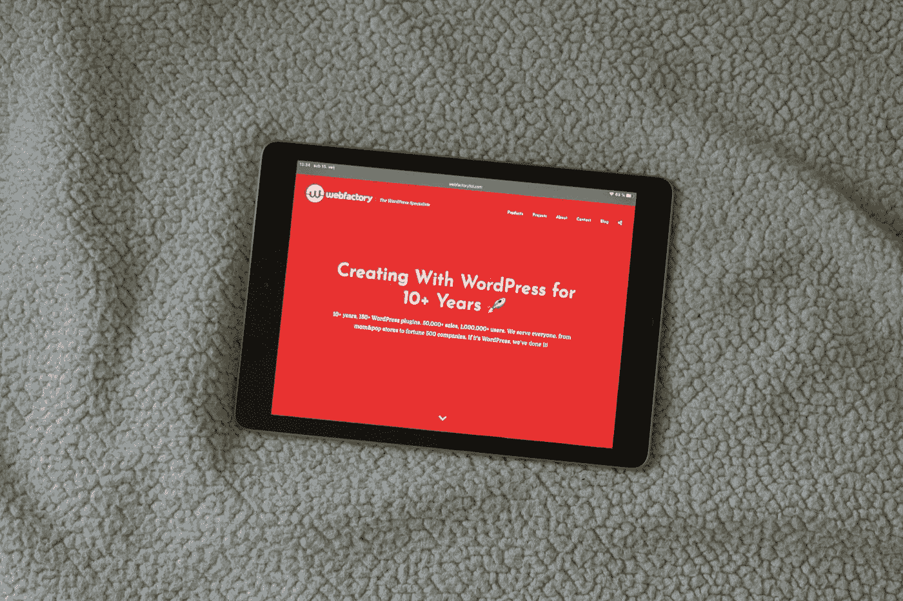
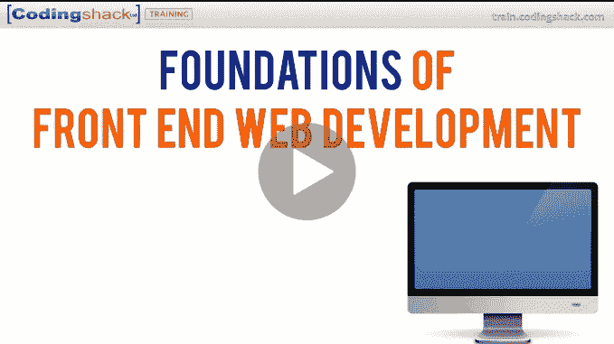
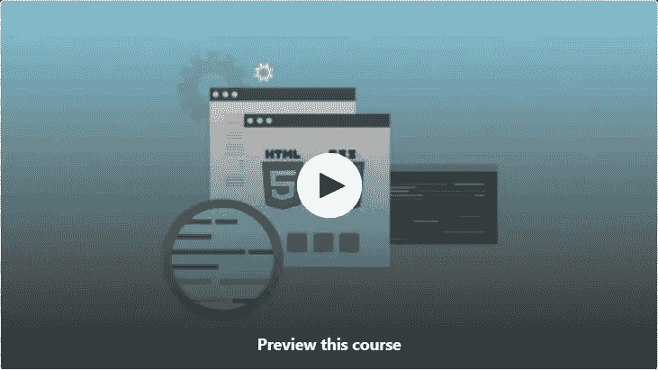
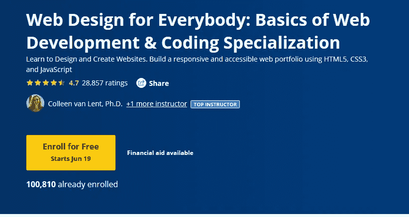

# 2023 年前端 Web 开发人员的 7 门最佳免费在线课程

> 原文：<https://medium.com/javarevisited/7-free-online-courses-to-become-a-web-designer-and-frontend-developer-in-2020-dca73bc7fdc4?source=collection_archive---------0----------------------->

## 想成为一名前端 web 开发人员？这些免费的在线课程可以帮助你。

由 [WebFactory 有限公司](https://unsplash.com/@webfactoryltd?utm_source=medium&utm_medium=referral)在 [Unsplash](https://unsplash.com?utm_source=medium&utm_medium=referral) 上拍摄的照片

大家好，我已经在这个博客上分享了很多关于各种技术和编程语言的免费在线课程和书籍，如 [Python](http://www.java67.com/2018/02/5-free-python-online-courses-for-beginners.html) ， [Java](http://javarevisited.blogspot.sg/2017/11/top-5-free-java-courses-for-beginners.html#axzz5B6EWE6M7) ， [C++](http://www.java67.com/2018/02/5-free-cpp-courses-to-learn-programming.html) ， [JavaScript](http://www.java67.com/2015/12/best-websites-to-learn-javascript-online.html) ， [PHP](http://www.java67.com/2018/02/5-free-php-and-mysql-courses-for-web-developers.html) ， [React](http://www.java67.com/2018/02/5-free-react-courses-for-web-developers.html) ， [Angular](http://www.java67.com/2018/01/top-5-free-angular-js-online-courses-for-web-developers.html) ， [Spring](http://www.java67.com/2017/11/top-5-free-core-spring-mvc-courses-learn-online.html) ，今天我带来了一些非常棒的免费课程来学习 web 基础知识

在这个创业时代，网络开发是程序员的一项基本技能。作为一个程序员或者软件开发人员，你应该知道如何创建一个网站，如何创建一个属于你自己的手机 app。

尽管这并不容易。[编码](/javarevisited/clean-code-a-must-read-coding-book-for-programmers-9dc80494d27c)如同艺术，很多人生来就有编码感；我的意思是他们热爱编码；他们喜欢创建网站、移动应用、游戏等东西。他们喜欢将事情自动化。

他们是非常好的自学者，几乎可以自学任何东西，但是如果你没有这些技能，不要气馁。有了毅力和努力，你也能收获你想要的一切。过去我曾分享过一些学习新技术的[小技巧，书籍和课程是其中不可或缺的一部分。

我个人喜欢免费课程开始学习一项新技术就像我最近不得不学习](http://www.java67.com/2017/12/10-ways-to-learn-new-technology-programming-language-or-framework.html) [Apache Spark](http://javarevisited.blogspot.sg/2017/12/top-5-courses-to-learn-big-data-and.html) 的时候一样；为了更全面的学习，我从网上课程开始，然后是书本。[在线课程](/javarevisited/7000-free-pluralsight-courses-to-build-in-demand-tech-skills-without-leaving-your-house-40edb50a8cf2)为你提供概要和必要的细节，让你不用投入太多时间就能入门。这也是一种更吸引人、更积极的学习方式。另一方面，书籍是比课程更被动的学习，这就是为什么你必须有一些背景知识来掌握书籍中给出的技术细节。在这篇文章中，我将分享一些最好的免费在线课程来学习使用 HTML 和 CSS 进行 Web 开发。如果您是 web 开发领域的新手，那么您可以使用这些课程开始您在美丽的网站世界中的旅程。

如果你能花几块钱上一门优秀的课程，那么我建议你只要看一下安德烈·内阿高伊的[**《2023 年网络开发者大全:零到精通**](https://click.linksynergy.com/deeplink?id=JVFxdTr9V80&mid=39197&murl=https%3A%2F%2Fwww.udemy.com%2Fcourse%2Fthe-complete-web-developer-zero-to-mastery%2F) 》。从零开始学习 Web 开发的最佳课程之一。

 [## 2023 年的完全网络开发者:零到精通

### 刚刚更新为 2023 年！通过学习最受欢迎的技能，在 2023 年成为 Fullstack Web 开发人员！这是其中之一…

udemy.com](https://click.linksynergy.com/deeplink?id=JVFxdTr9V80&mid=39197&murl=https%3A%2F%2Fwww.udemy.com%2Fcourse%2Fthe-complete-web-developer-zero-to-mastery%2F) 

顺便说一句，如果你喜欢 Andrei 的风格和他极具吸引力的、全面的和最新的课程，那么你也可以加入他的 [ZTM 学院](https://academy.zerotomastery.io/a/aff_c0gnlvf7/external?affcode=441520_zytgk2dn)，以每月[**39 美元的计划获得他的所有课程。**](https://academy.zerotomastery.io/a/aff_c0gnlvf7/external?affcode=441520_zytgk2dn) 您也可以使用我的代码**朋友 10 在月度和年度计划中获得 10%的优惠**。

 [## 学习编码。被录用。加入零至掌握学院。|零到精通

### 不要在无聊、过时的教程上浪费时间。加入 500，000 多名学生的行列，学习编程，获得聘用并在以下领域取得成功…

academy.zerotomastery.io](https://academy.zerotomastery.io/a/aff_c0gnlvf7/external?affcode=441520_zytgk2dn) 

# 2023 年学习使用 HTML 和 CSS 的前端 Web 开发的 7 个最佳免费在线课程

这里是我为程序员收集的一些最好的免费 web 开发课程。你可以在舒适的办公室和家里学习这些课程，也可以按照自己的节奏学习。你可以放慢速度，做一些编码，然后重新开始。

## 1. [Web 开发实践:HTML / CSS 从头开始](https://click.linksynergy.com/fs-bin/click?id=JVFxdTr9V80&subid=0&offerid=323058.1&type=10&tmpid=14538&RD_PARM1=https%3A%2F%2Fwww.udemy.com%2Fweb-development-learn-by-doing-html5-css3-from-scratch-introductory%2F)

本课程将向你介绍 web 开发的两大支柱:HTML 和 CSS。除此之外，你将学习这些支柱的基本作用，以及它们如何组合在一起形成网站。

在 HTML 部分，你将学习如何执行简单的任务，比如创建一个基本的网页，添加图片，改变颜色，构造列表，而在 CSS 部分，你将学习如何美化你的网页。

我知道现在每个人都使用 Bootstrap 来使他们的网页看起来漂亮和专业，但是要使用 [Bootstrap，](http://www.java67.com/2019/01/5-free-bootstrap-course-to-learn-online.html)一个领先的 CSS 库，CSS 概念的基础知识是必不可少的，这就是你在本课程中将学到的。

**这里是免费加入本课程的链接** — [Web 开发动手做:HTML / CSS 从头开始](https://click.linksynergy.com/fs-bin/click?id=JVFxdTr9V80&subid=0&offerid=323058.1&type=10&tmpid=14538&RD_PARM1=https%3A%2F%2Fwww.udemy.com%2Fweb-development-learn-by-doing-html5-css3-from-scratch-introductory%2F)

如果你有兴趣，也可以看看这个 2023 年成为 Web 开发者的[路线图。](https://javarevisited.blogspot.com/2019/02/the-2019-web-developer-roadmap.html)

 [## 完整的 Web 开发者路线图

### 成为网页开发者的图解指南，并提供相关课程的链接

medium.com](/hackernoon/the-2019-web-developer-roadmap-ab89ac3c380e) 

## 2.[前端 Web 开发基础](https://click.linksynergy.com/fs-bin/click?id=JVFxdTr9V80&subid=0&offerid=323058.1&type=10&tmpid=14538&RD_PARM1=https%3A%2F%2Fwww.udemy.com%2Ffoundations-of-front-end-development%2F)

这是 Udemy 上的一门极好的课程，从零开始学习前端 web 开发，因为它不仅会教你所有 Web 开发的基本技术、库和框架，还会告诉你如何通过构建真实的项目来有效地使用它们。

要成为一名优秀的[前端开发者](http://www.java67.com/2018/02/5-free-html-and-css-courses-to-learn-web-development.html)，你不仅需要了解 [HTML](http://www.java67.com/2018/02/5-free-html-and-css-courses-to-learn-web-development.html) 、 [CSS](/javarevisited/top-10-free-courses-to-learn-html-5-css-3-and-web-development-872d62d97a97) 、 [JavaScript](http://www.java67.com/2015/10/top-5-free-javascript-books-download-pdf-read-online.html) 还要了解 Angular、React、BootStrap 等领先的框架和库。这门课程将会以互动的方式全面地教你所有这些。对于一个免费的班级来说，这是一笔好交易。

**这里是免费加入本课程的链接** — [前端 Web 开发基础](https://click.linksynergy.com/fs-bin/click?id=JVFxdTr9V80&subid=0&offerid=323058.1&type=10&tmpid=14538&RD_PARM1=https%3A%2F%2Fwww.udemy.com%2Ffoundations-of-front-end-development%2F)

## 3.学习 HTML & CSS:如何开始你的网络开发生涯

这是另一个学习 HTML 和 CSS 进行 web 开发的伟大课程，非常适合初级开发人员和希望在 2023 年成为 web 开发人员的计算机科学毕业生。

本课程分为 4 个重要板块:

1 .)HTML 部分
2
。)CSS 节
3。)代码挑战决赛

4。)课程项目

可以看到课程的结构非常好。前两节将从头到尾教你 [HTML 5](https://javarevisited.blogspot.com/2019/05/top-5-html-5-and-css-3-courses-for-web-developers.html) 和 [CSS 3](https://dev.to/javinpaul/these-are-the-best-free-courses-to-learn-html-and-css-for-frontend-developers-2g8g) ，第三节和第四节将测试你在前两节学到的知识。

**这里是免费加入本课程的链接**——[学习 HTML & CSS:如何开始你的 Web 开发生涯](https://click.linksynergy.com/fs-bin/click?id=JVFxdTr9V80&subid=0&offerid=323058.1&type=10&tmpid=14538&RD_PARM1=https%3A%2F%2Fwww.udemy.com%2Fhow-i-landed-a-web-development-job-earned-5k-freelancing%2F)

## 4.从零开始学习响应式 Web 开发

如果我必须向所有想从事网页设计或前端开发的程序员、网页开发人员和计算机科学毕业生建议一件事，那就是响应主题和页面。

当今世界，响应式设计只是因为人们在使用不同的设备访问网页，像手机、智能手机、平板电脑、台式机、笔记本电脑，甚至电视。一个响应迅速的网页可以根据屏幕大小自动调整，看起来对用户有用，这就是它至关重要的原因。这门课程将教你学习响应式 web 开发所需的所有知识，如框架、技术、最佳实践等。

**这里是免费参加这个课程的链接**——[从头开始学习响应式 Web 开发](https://click.linksynergy.com/fs-bin/click?id=JVFxdTr9V80&subid=0&offerid=323058.1&type=10&tmpid=14538&RD_PARM1=https%3A%2F%2Fwww.udemy.com%2Flearn-responsive-web-development-from-scratch%2F)

## 5.[掌握 HTML5 的基础知识& CSS3:初学 Web 开发](https://click.linksynergy.com/fs-bin/click?id=JVFxdTr9V80&subid=0&offerid=323058.1&type=10&tmpid=14538&RD_PARM1=https%3A%2F%2Fwww.udemy.com%2Fmaster-the-basics-of-html5-css3-beginner-web-development%2F)

这是最新的网络开发课程之一，你可以在 Udemy 上免费获得。本课程重点介绍 HTML 和 CSS 的最新版本，像 [HTML 5](/javarevisited/5-free-html-and-css-courses-to-learn-front-end-web-development-online-8b04517c6ecb?source=collection_home---4------0-----------------------) 和 [CSS 3](/javarevisited/top-10-free-courses-to-learn-html-5-css-3-and-web-development-872d62d97a97) ，这对一个新开发者来说非常重要。

如果刚开始从零开始学习 web 开发，学习老版本是没有意义的。通过学习更新版本，你一定会获得更好的性能，并创建更好的应用程序。当你寻找一份网络开发工作时，这也会有所帮助，因为公司显然更喜欢拥有最新最棒的网络技术知识的候选人。

**这里是免费加入本课程的链接**——[掌握 HTML5 的基础知识& CSS3:初学 Web 开发](https://click.linksynergy.com/fs-bin/click?id=JVFxdTr9V80&subid=0&offerid=323058.1&type=10&tmpid=14538&RD_PARM1=https%3A%2F%2Fwww.udemy.com%2Fmaster-the-basics-of-html5-css3-beginner-web-development%2F)

## 6.Web 开发人员的 Web 设计:创建漂亮的网站！

这是在 1 小时内学习网页设计的最好的免费资源之一，包括 25 个简单易用的规则和指南以及大量惊人的网页设计资源！

由 Jonas Schmedtmann 创建，他是我最喜欢的 [JavaScript Bootcamp](https://click.linksynergy.com/deeplink?id=JVFxdTr9V80&mid=39197&murl=https%3A%2F%2Fwww.udemy.com%2Fcourse%2Fthe-complete-javascript-course%2F) 和 [HTML 5 和 CSS Bootcamp](https://click.linksynergy.com/deeplink?id=JVFxdTr9V80&mid=39197&murl=https%3A%2F%2Fwww.udemy.com%2Fcourse%2Fdesign-and-develop-a-killer-website-with-html5-and-css3%2F) 课程的作者。

 [## 学习现代 Javascript(构建和测试应用)-完整课程

### “很棒的课程。Jonas 解释了 javascript 中的核心概念，这些概念在其他课程中通常会被忽略。还有…

udemy.com](https://click.linksynergy.com/deeplink?id=JVFxdTr9V80&mid=39197&murl=https%3A%2F%2Fwww.udemy.com%2Fcourse%2Fthe-complete-javascript-course%2F)  [## 用 HTML5 和 CSS3 构建响应性网站

### “在经历了其他平台上的其他相关课程后，我可以说这个课程是最实用和最容易的…

udemy.com](https://click.linksynergy.com/deeplink?id=JVFxdTr9V80&mid=39197&murl=https%3A%2F%2Fwww.udemy.com%2Fcourse%2Fdesign-and-develop-a-killer-website-with-html5-and-css3%2F) 

在本课程中，您将学习以下内容:

如何让文本看起来专业

如何正确运用色彩的力量

如何获得和使用令人惊叹的图像、字体和图标来制作您的网站

如何使用空白和视觉层次创建布局

如何激励自己学习更多关于网页设计的知识

如何使用 8 种简单易用的技巧让你的网站转化得更好

最棒的是，Jonas Schmedtmann 还提供有用的网页设计资源，帮助您开始下一个网页设计项目！加入这个免费课程后，您还可以立即免费获得课程《HTML5 和 CSS3 Web 设计和开发的电子书最佳资源》。

**这里是免费参加这个课程的链接** — [网页开发人员的网页设计:创建漂亮的网站！](https://click.linksynergy.com/deeplink?id=JVFxdTr9V80&mid=39197&murl=https%3A%2F%2Fwww.udemy.com%2Fcourse%2Fweb-design-secrets%2F)

## 7.[面向所有人的网页设计:网页开发基础&编码专门化](https://coursera.pxf.io/c/3294490/1164545/14726?u=https%3A%2F%2Fwww.coursera.org%2Fspecializations%2Fweb-design)

这是 Coursera 提供的免费资源，用于学习 Web 开发和编码的基础知识。这个专业包括如何编写语法正确的 HTML5 和 CSS3，以及如何用 JavaScript 创建交互式 web 体验。

由@Colleen Van Let 创建，这是一个学习基本技能的很好的集合。这是由密歇根大学提供的，顺便说一句，如果你完成了课程，你将获得一个证书，该课程是免费学习的，但你需要支付认证费用。

这个专业有 5 门课程可以免费旁听

1.  [**HTML 5 简介**](https://coursera.pxf.io/c/3294490/1164545/14726?u=https%3A%2F%2Fwww.coursera.org%2Flearn%2Fhtml)
2.  [T5【CSS3】简介 ](https://coursera.pxf.io/c/3294490/1164545/14726?u=https%3A%2F%2Fwww.coursera.org%2Flearn%2Fintrocss)
3.  [**与 JavaScript 的交互性**](https://coursera.pxf.io/c/3294490/1164545/14726?u=https%3A%2F%2Fwww.coursera.org%2Flearn%2Fjavascript)
4.  [**高级造型与响应式设计**](https://coursera.pxf.io/c/3294490/1164545/14726?u=https%3A%2F%2Fwww.coursera.org%2Flearn%2Fresponsivedesign)
5.  [**网页设计为大家压轴戏**](https://coursera.pxf.io/c/3294490/1164545/14726?u=https%3A%2F%2Fwww.coursera.org%2Flearn%2Fweb-design-project)

作为 Coursera 专业化的一部分，你还将建立一个专业质量的网页作品集，展示你作为一名网页开发者的成长和你的无障碍网页设计知识。

**这是免费加入本课程的链接**——[面向所有人的网页设计:网页开发基础&编码专业](https://coursera.pxf.io/c/3294490/1164545/14726?u=https%3A%2F%2Fwww.coursera.org%2Fspecializations%2Fweb-design)

如果你觉得 Coursera 的课程有用，因为它们是由知名公司如谷歌、IBM、亚马逊和世界上最好的大学创建的，我建议你加入 Coursera 的订阅计划

**这种单一订阅让你可以无限制地访问他们最受欢迎的**课程**、**专业化**、**职业证书**和**指导项目**。它每年花费大约 399 美元，但是它完全物有所值，因为你可以获得无限的证书。**

** [## Coursera Plus |无限制访问 7，000 多门在线课程

### 用 Coursera Plus 投资你的职业目标。无限制访问 90%以上的课程、项目…

coursera.pxf.io](https://coursera.pxf.io/c/3294490/1164545/14726?u=https%3A%2F%2Fwww.coursera.org%2Fcourseraplus) 

以上是关于免费使用 HTML 和 CSS 学习 web 开发的一些最好的课程。即使你知道 HTML 和 CSS，这些免费资源也是更新知识和填补空白的好方法。Web 开发是一项重要的技能，而在创业时代，我认为每个程序员都应该知道如何自己创建一个网站或移动 app。

其他**免费编程和网页开发**课程

1.  [完整的 Web 开发者路线图](/hackernoon/the-2019-web-developer-roadmap-ab89ac3c380e)
2.  [面向 Web 开发人员的 15 门 Docker、Kubernetes 和 AWS 课程](/javarevisited/top-15-online-courses-to-learn-docker-kubernetes-and-aws-for-fullstack-developers-and-devops-d8cc4f16e773)
3.  [Web 开发人员可以学习的 10 个 JavaScript 框架](/javarevisited/10-of-the-most-popular-javascript-frameworks-libraries-for-web-development-in-2019-a2c8cea68094)
4.  [学习 Web 开发的前 5 门课程](/better-programming/my-5-favorite-courses-to-learn-web-development-in-2019-a5e74167f8b2)
5.  [我最喜欢的学习 HTML 和 CSS 的免费课程](/javarevisited/5-free-html-and-css-courses-to-learn-front-end-web-development-online-8b04517c6ecb?source=collection_home---4------0-----------------------)
6.  [2023 年学习打字稿的 10 门免费课程](/javarevisited/top-10-free-typescript-courses-to-learn-online-best-of-lot-44bce9da41d1)
7.  [2023 年学习 JavaScript 的 12 门免费课程](/javarevisited/12-free-courses-to-learn-javascript-and-es6-for-beginners-and-experienced-developers-aa35874c9a32)
8.  [完整的 React.js 开发者路线图](/javarevisited/the-2019-react-js-developer-roadmap-9a8e290b8a56)
9.  [2023 年学习棱角分明的 10 本书和课程](/javarevisited/top-10-angular-books-and-courses-for-beginners-and-experienced-web-developers-best-of-lot-9a2dae87f04c)
10.  [7 门免费课程，帮助网页设计师学习自举](/javarevisited/7-free-courses-to-learn-bootstrap-for-web-designers-and-developers-5135215648f1)

感谢阅读这篇文章。如果你喜欢这些免费的网页开发课程，那么请分享给你的朋友和同事。如果您有任何问题或反馈，请留言。

**【p . s .】**——如果你能花几块钱上一门优秀的课程，那么我建议你只要看看 Colt_Steele 的[**Web Developer boot camp**](https://click.linksynergy.com/fs-bin/click?id=JVFxdTr9V80&subid=0&offerid=323058.1&type=10&tmpid=14538&RD_PARM1=https%3A%2F%2Fwww.udemy.com%2Fthe-web-developer-bootcamp%2F)。从零开始学习 Web 开发的最佳课程之一。

 [## Web 开发人员训练营:学习 HTML、CSS、Node 等等！

### 嗨！欢迎来到 web 开发者训练营，这是学习 Web 开发的唯一课程。有很多…

udemy.com](https://click.linksynergy.com/fs-bin/click?id=JVFxdTr9V80&subid=0&offerid=323058.1&type=10&tmpid=14538&RD_PARM1=https%3A%2F%2Fwww.udemy.com%2Fthe-web-developer-bootcamp%2F)**