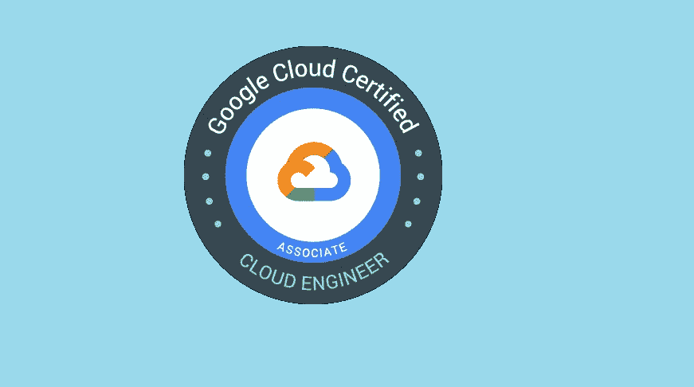
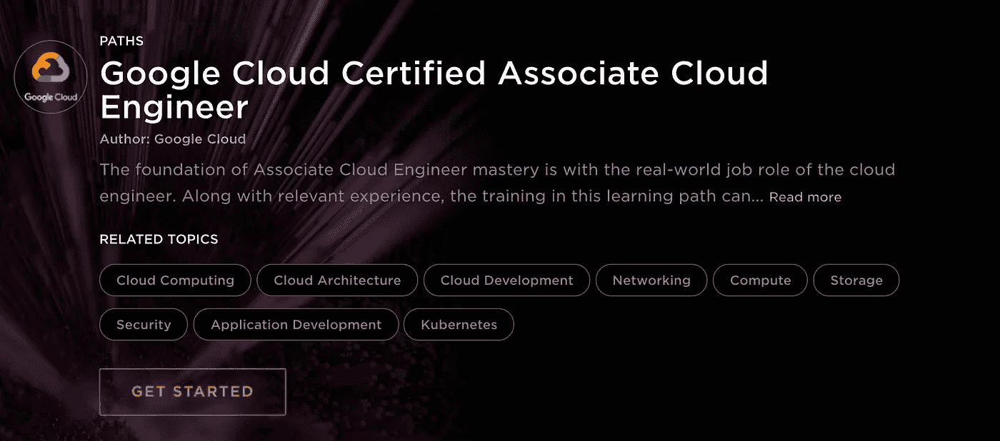
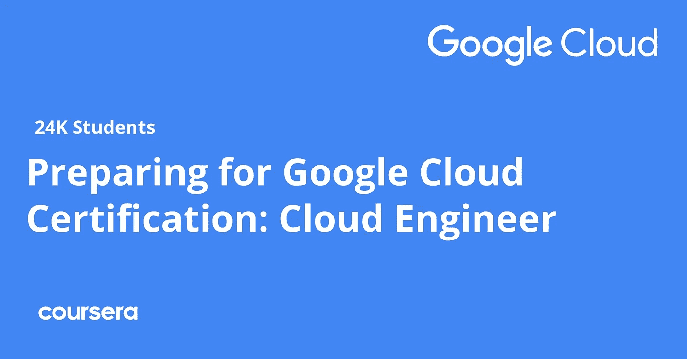
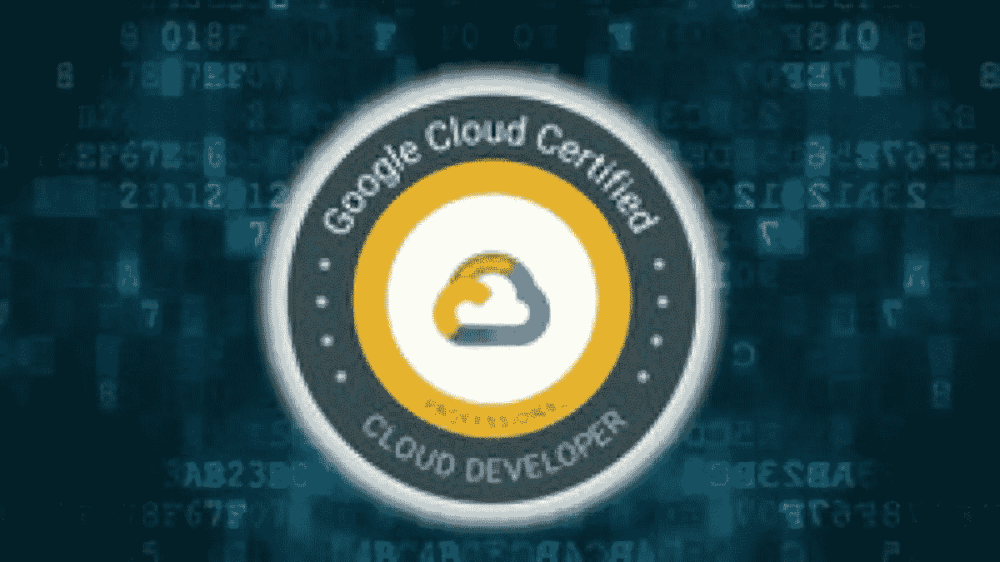
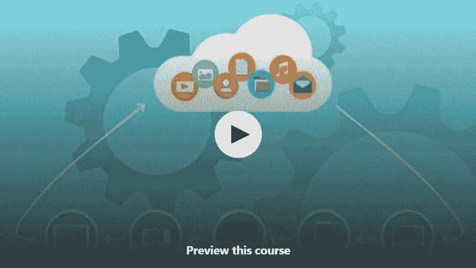
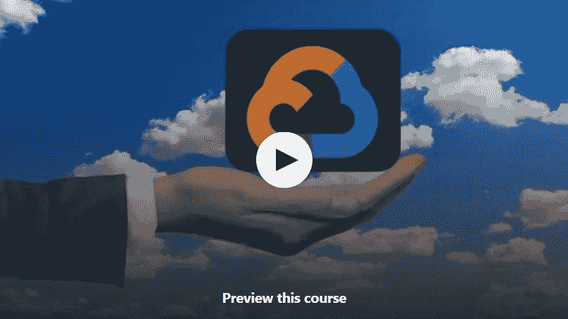

# 2023 年破解谷歌云助理云工程师(ACE)认证考试的 7 门最佳免费课程

> 原文：<https://medium.com/javarevisited/7-free-online-courses-to-crack-google-cloud-associate-cloud-engineer-ace-certification-exam-in-2cf0b297aed?source=collection_archive---------0----------------------->

## 这些是 Udemy，Pluralsight 提供的免费在线课程，用于准备 2023 年的谷歌云平台助理云工程师认证考试

大家好，如果你的目标是谷歌云平台，并准备 GCP 云工程师助理认证，这是第一个让你与谷歌云平台和寻找免费在线课程开始准备的认证，那么你来对地方了。

在过去，我已经分享了学习谷歌云 的 [**最佳课程，以及通过**](https://javarevisited.blogspot.com/2019/07/top-5-google-cloud-platform-gcp-courses-certifications-online.html)**[云工程师](https://javarevisited.blogspot.com/2020/05/top-5-course-to-crack-google-cloud-associate-cloud-engineer-certification-exam.html)、[数据工程师](https://javarevisited.blogspot.com/2020/06/top-5-course-to-crack-google-cloud-professional-data-engineer-certification.html)和[云架构师](https://javarevisited.blogspot.com/2020/07/top-5-courses-to-become-google-cloud-professional-architect.html)认证的认证课程，今天，我将为初学者和有经验的开发人员分享免费的 GCP 云工程师课程。**

这些课程是由已经通过了这项久负盛名的谷歌云认证的专家和人们创建的。

它们也是从像 Udemy、Pluralsight 和 Coursera 这样的网站中挑选出来的，这三个网站是程序员和 IT 专业人员最好的在线学习平台。您也可以参加这些课程，以便更好地准备该认证，并在第一次尝试时就通过认证。

在和大家分享这些免费课程之前，我必须祝贺你做出了一个伟大的决定，学习云计算，选择[谷歌云平台](/javarevisited/5-best-courses-to-learn-google-cloud-platform-gcp-in-2021-169093a3771a)，而说到学习 [GCP](https://cloud.google.com/) ，还有什么能比一个*谷歌认证云工程师*更好的呢？

当谈到云计算时，谷歌是三大市场领导者之一，如果你有他们的优秀认证，那么你将在你的竞争对手候选人中占上风。

在本教程中，我列出了 7 门免费在线课程，帮助你在有限的时间内准备 GCP 云工程师助理考试。除此之外，所有这些课程都是由市场领导者创造的；因此，一分一秒都不会浪费。

顺便说一下，如果你真的想在第一次尝试时就通过这项著名的谷歌云认证，那么我强烈推荐你参加 Udemy 上的 [**谷歌云工程师助理:获得认证 2023**](https://click.linksynergy.com/deeplink?id=JVFxdTr9V80&mid=39197&murl=https%3A%2F%2Fwww.udemy.com%2Fcourse%2Fgoogle-certified-associate-cloud-engineer-2019-prep-course%2F) 课程。

<https://click.linksynergy.com/deeplink?id=JVFxdTr9V80&mid=39197&murl=https%3A%2F%2Fwww.udemy.com%2Fcourse%2Fgoogle-certified-associate-cloud-engineer-2019-prep-course%2F>  

它不是免费的，但它是通过云工程师认证的最佳课程，由像[丹·沙利文](https://click.linksynergy.com/deeplink?id=JVFxdTr9V80&mid=39197&murl=https%3A%2F%2Fwww.udemy.com%2Fuser%2Fdan-sullivan-3%2F)这样的专家创建，他为谷歌编写了官方认证指南。你还可以在 Udemy 的销售中获得 10 美元，这种事情时有发生。

# 2023 年 7 个最佳免费谷歌云助理云工程师认证考试课程和实践测试

以下是准备 Google Cloud Professional Associate 云工程师认证的最佳免费在线课程列表。该认证测试您使用 Google cloud 控制台和命令行的能力。您应该能够供应资源、创建服务器、部署应用程序并监控它们。

该考试类似于 [AWS 云从业者](https://javarevisited.blogspot.com/2020/02/top-5-courses-to-crack-aws-certified-cloud-practitioner-exam-certification-clf-c01.html)和 [Azure 基础知识](https://javarevisited.blogspot.com/2020/04/how-to-crack-microsoft-azure-fundamentals-certification-az-900-exam.html)考试，应该是你获得谷歌云认证的第一步。通过该考试后，您可以准备其他高级谷歌云认证，如专业云架构师、专业数据工程师和专业 [DevOps 工程师](/javarevisited/top-5-online-courses-to-become-a-devops-engineer-in-2020-764f5e60c2b)。

无论如何，不要再浪费你的时间了，以下是谷歌云助理云工程师认证的免费课程:

## 1.[云计算简介](https://click.linksynergy.com/deeplink?id=JVFxdTr9V80&mid=39197&murl=https%3A%2F%2Fwww.udemy.com%2Fcourse%2Fintroduction-to-cloud-computing%2F)【免费】

这是学习云计算最好的免费 Udemy 课程之一。如果你刚刚开始准备，不想留下任何漏洞，那么这门课程将是你的一个基础。

它将作为你的基础。Xavier Corbett 创建了它，这是一个 1 小时长的视频课程。到目前为止，已有超过 20 万名学生注册了该课程，该课程被评为 4.4 星(满分 5 分)。

在本课程中，您将了解以下内容:

*   什么是云计算？
*   它是如何工作的？
*   云计算有哪些不同的应用？

除此之外，讲师还会简单介绍各种云平台。如果你正在寻找一个基础课程，那么这是给你的。

**这里是加入免费云计算课程** — [云计算简介](https://click.linksynergy.com/deeplink?id=JVFxdTr9V80&mid=39197&murl=https%3A%2F%2Fwww.udemy.com%2Fcourse%2Fintroduction-to-cloud-computing%2F)的链接

## 2.[GCP——谷歌云平台概念](https://click.linksynergy.com/deeplink?id=JVFxdTr9V80&mid=39197&murl=https%3A%2F%2Fwww.udemy.com%2Fcourse%2Fgcp-google-cloud-platform-concepts%2F)【免费教程】

完成基础课程后，您就可以开始了解您准备学习的平台了。本课程由 Djanaji Musale 和 Google 云平台大师共同打造！。到目前为止，已有超过 4 万名学生注册了这门课程，它是 Udemy 上关于 GCP 的顶级课程之一。

在本课程中，您将了解以下内容:

*   GCP 简介
*   技巧，以获得 300 美元的免费信贷实践对 GCP。
*   GCP 如何优于其他云平台。
*   GCP 提供哪些不同的服务？

如果您正在寻找一门课程，可以帮助您获得关于您的平台的足够信息，那么这门课程就是为您准备的。

**这是加入免费 GCP 课程的链接**——[GCP——谷歌云平台概念](https://click.linksynergy.com/deeplink?id=JVFxdTr9V80&mid=39197&murl=https%3A%2F%2Fwww.udemy.com%2Fcourse%2Fgcp-google-cloud-platform-concepts%2F)

## 3.[谷歌云认证助理云工程师](https://pluralsight.pxf.io/c/1193463/424552/7490?u=https%3A%2F%2Fwww.pluralsight.com%2Fpaths%2Fcloud-engineering-with-google-cloud) (Pluralsight)

如果你在网上寻找一门能让你在各方面都做好准备的课程，那么这门课程就是为你准备的。这是 Pluralsight.com 网站上的一个长视频课程。

尽管这是一个付费平台，但由于它提供了试用期，你可以在此期间完成本课程，而无需向平台支付任何费用。

谷歌云团队与 Pluralsight 合作创建了这个课程；因此，质量将不再是一个问题。在本课程中，您将了解以下[云计算](/javarevisited/5-best-cloud-computing-courses-to-learn-in-2020-f5f091159401)和 [GCP](/javarevisited/5-best-gcp-associate-cloud-engineer-certification-courses-in-2021-c93d7e35228a) 的概念:

*   计算引擎
*   GCP 数据存储服务公司
*   谷歌应用引擎
*   InternationalAssociationofMachinists 国际机械师协会
*   记录、监控和调试云应用程序
*   云应用的部署
*   托管实例组
*   计费和负载平衡简介

除此之外，讲师还将教您如何维护云及其应用程序的安全性。这个课程是专门为初学者设计的，这也是为什么视频中主要使用插图和图片的原因。

**以下是加入本在线课程的链接**——[谷歌云认证助理云工程师](https://pluralsight.pxf.io/c/1193463/424552/7490?u=https%3A%2F%2Fwww.pluralsight.com%2Fpaths%2Fcloud-engineering-with-google-cloud)

顺便说一下，你需要一个 [Pluralsight 会员](https://pluralsight.pxf.io/c/1193463/424552/7490?u=https%3A%2F%2Fwww.pluralsight.com%2Flearn)才能加入这个课程，费用大约是每月 29 美元或每年 299 美元(14%的折扣)。

我向所有程序员强烈推荐这个订阅，因为它提供了超过 7000 个在线课程的即时访问，以学习任何技术技能。或者，你也可以使用他们的 [**10 天免费通行证**](https://pluralsight.pxf.io/c/1193463/424552/7490?u=https%3A%2F%2Fwww.pluralsight.com%2Flearn) 免费观看这个课程。

<https://pluralsight.pxf.io/c/1193463/424552/7490?u=https%3A%2F%2Fwww.pluralsight.com%2Flearn>  

## 4.[准备谷歌云助理云工程师考试](https://coursera.pxf.io/c/3294490/1164545/14726?u=https%3A%2F%2Fwww.coursera.org%2Fprofessional-certificates%2Fcloud-engineering-gcp)【Coursera】

这是 Google cloud 团队在 Coursera 上创建的另一个 Google Cloud 认证，但这是一个比 Pluralsight 上的课程更全面、更紧密的课程，Coursera 是一个很好的学习平台..

在这个[认证项目](https://coursera.pxf.io/c/3294490/1164545/14726?u=https%3A%2F%2Fwww.coursera.org%2Fprofessional-certificates%2Fcloud-engineering-gcp)中，教师们有各种实施的现场演示，你将被分配一些需要完成的项目，以便在课程中继续前进。

除此之外，如果你能按时完成课程，你会得到一张竞赛证书作为奖励。到目前为止，该课程已有超过 32，000 名学生注册，根据超过 1500 名学生的评级，该课程获得了 4.7 星(满分 5 分)。

本课程是专门为您准备 [GCP 云工程师助理考试](https://javarevisited.blogspot.com/2020/05/top-5-course-to-crack-google-cloud-associate-cloud-engineer-certification-exam.html#axzz6gU2kIlrz)而设计的。如果你按照老师说的去做，那么需要四周时间，但是如果你时间不够，那么你可以在 8 小时内完成所有的视频。

这个专业有 6 门课程可以免费旁听

*   [**谷歌云基础:核心基础设施。**](https://coursera.pxf.io/c/3294490/1164545/14726?u=https%3A%2F%2Fwww.coursera.org%2Flearn%2Fgcp-fundamentals)
*   [**基本谷歌云基础设施:基础**](https://coursera.pxf.io/c/3294490/1164545/14726?u=https%3A%2F%2Fwww.coursera.org%2Flearn%2Fgcp-infrastructure-foundation)
*   [**基本谷歌云基础设施:核心服务**](https://coursera.pxf.io/c/3294490/1164545/14726?u=https%3A%2F%2Fwww.coursera.org%2Flearn%2Fgcp-infrastructure-scaling-automation)
*   **弹性谷歌云基础设施:扩展和自动化**
*   **使用 Google Kubernetes 引擎架构:基础**
*   [**准备您的联想云工程师之旅**](https://coursera.pxf.io/c/3294490/1164545/14726?u=https%3A%2F%2Fwww.coursera.org%2Flearn%2Fpreparing-cloud-associate-cloud-engineer-exam)

如果你正在寻找一个完整的程序，可以快速准备你的 GCP 助理云工程师考试，那么这个适合你。这几门课都是环环相扣的，不建议跳过后面三门中的任何一门。按顺序追捕他们。

**这是参加免费 Coursera 课程的链接**——[准备谷歌云助理云工程师考试](https://coursera.pxf.io/c/3294490/1164545/14726?u=https%3A%2F%2Fwww.coursera.org%2Fprofessional-certificates%2Fcloud-engineering-gcp)

顺便说一下，如果你计划参加多个 Coursera 课程或专业，那么考虑参加 [**Coursera Plus 订阅**](https://coursera.pxf.io/c/3294490/1164545/14726?u=https%3A%2F%2Fwww.coursera.org%2Fcourseraplus) ，它将为你提供无限制的访问他们最受欢迎的课程、专业、专业证书和指导项目的机会。它每年花费大约 399 美元，但它完全值得你的钱，因为你可以获得无限的证书。

<https://coursera.pxf.io/c/3294490/1164545/14726?u=https%3A%2F%2Fwww.coursera.org%2Fcourseraplus>  

## 5.[终极谷歌认证专业云开发者 2023](https://click.linksynergy.com/deeplink?id=JVFxdTr9V80&mid=39197&murl=https%3A%2F%2Fwww.udemy.com%2Fcourse%2Fgoogle-cloud-platform-professional-cloud-developer-certification%2F)

到目前为止，我们假设你已经完成了上面提到的课程，现在是时候为你将要出现的特定主题做准备了。

这个课程在 Udemy 上也有，是谷歌云平台大师们创建的，到目前为止已经有超过 72000 名学生注册了这个课程。根据 1400 名学生的评论，它的评分为 4.3 分(满分 5 分)。

在本课程中，您将了解为 [GCP 助理云工程师认证](https://www.java67.com/2021/01/top-10-google-cloud-certifications.html)课程做准备的策略。虽然本课程侧重于不同的认证考试，但本课程涵盖的所有主题都与您的 GCP 云工程师助理考试直接相关。

教师们聪明地使用了解释性的插图和图表。即使你是初学者，理解事物对你来说也不是问题。在这个长达 16 小时的视频课程中，GCP 的每个概念都得到了详细的解释。

如果时间允许，我们建议您学习上述三门课程，这样您就可以做好充分的准备，顺利通过 GCP 准云考试。

**这里是加入谷歌云课程**——[终极谷歌认证专业云开发者](https://click.linksynergy.com/deeplink?id=JVFxdTr9V80&mid=39197&murl=https%3A%2F%2Fwww.udemy.com%2Fcourse%2Fgoogle-cloud-platform-professional-cloud-developer-certification%2F)的链接

## 6.[如何通过谷歌云认证考试](https://click.linksynergy.com/deeplink?id=JVFxdTr9V80&mid=39197&murl=https%3A%2F%2Fwww.udemy.com%2Fcourse%2Fhow-to-pass-google-cloud-certification-exams%2F)(免费)

这是另一个免费的 Udemy 课程，用于谷歌云认证，包括云工程师助理。本课程分享了一些准备谷歌云认证的有用策略，由 Dan Sullivan 编写，他是一些最佳谷歌云课程的作者，也是谷歌官方认证指南的设计者。

毫无疑问，谷歌云认证考试具有挑战性。即使你对谷歌云服务有很深的了解，如果你不熟悉考试的结构，你也可能通不过认证考试。

本课程将帮助您了解谷歌云认证考试是如何组织的，参加这些考试的规则，以及您可能会遇到的各种问题。

也许最重要的是，本课程展示了如何分析问题，准确识别被问到的问题，以及如何对每个可能的答案进行推理，以便你能选择最佳选项。

本课程首先回顾[谷歌云认证](https://javarevisited.blogspot.com/2020/08/top-10-coursera-certifications-to-learn-cloud-computing-aws.html)主题，然后详细讨论认证考试的结构。然后，它着眼于认证考试的局限性，以及如何有人可以不通过考试，即使他们对这个主题的知识。

**这里是加入这个免费课程的链接**——[如何通过谷歌云认证考试](https://click.linksynergy.com/deeplink?id=JVFxdTr9V80&mid=39197&murl=https%3A%2F%2Fwww.udemy.com%2Fcourse%2Fhow-to-pass-google-cloud-certification-exams%2F)

## 7.[谷歌云基础 101:学习 GCP 的快速指南](https://click.linksynergy.com/deeplink?id=JVFxdTr9V80&mid=39197&murl=https%3A%2F%2Fwww.udemy.com%2Fcourse%2Fgoogle-cloud-fundamentals-101-a-quick-guide-to-learn-gcp%2F)

这是一个相对较新的课程，学习谷歌云平台的基本概念，这是通过谷歌云助理云工程师(ACE)考试所必需的。

在这个免费的 udemy 课程中，您将了解什么是云计算，什么是不同的云计算模型，重要的 GCP 服务，以及一些创建虚拟机、创建桶的实际操作演示，以及如何使用 Bigquery 进行[机器学习](/javarevisited/top-10-machine-learning-and-data-science-certifications-and-training-courses-for-beginners-and-a6308497b764)。

本课程也将帮助你计划建立或改变你的职业生涯到 GCP。本课程还将帮助规划一个高价值的谷歌认证，如“谷歌助理云工程师”、“专业云架构师”等。

**这里是加入这个免费课程**——[谷歌云基础 101](https://click.linksynergy.com/deeplink?id=JVFxdTr9V80&mid=39197&murl=https%3A%2F%2Fwww.udemy.com%2Fcourse%2Fgoogle-cloud-fundamentals-101-a-quick-guide-to-learn-gcp%2F) 的链接

以上就是 2023 年准备 Google Cloud 协理云工程师认证的**最佳免费课程。**在本指南中，您已经了解了通过 GCP 云工程师助理考试的五门最佳免费课程。

这些课程都是经过详细研究挑选的，并且这些课程都是各自平台上的畅销课程。如果你有充足的时间，那么建议报读这些课程中的每一门，然后决定你应该完成哪一门，哪个导师更好理解。

为了更好地准备，我还建议解决实践问题，如谷歌官方认证指南的作者丹·沙利文在 [**谷歌云助理云工程师实践考试**](https://click.linksynergy.com/deeplink?id=JVFxdTr9V80&mid=39197&murl=https%3A%2F%2Fwww.udemy.com%2Fcourse%2Fgoogle-cloud-associate-cloud-engineer-practice-examspractice-exams%2F) 中给出的问题。这不是免费的，但 10 美元完全值得。

<https://click.linksynergy.com/deeplink?id=JVFxdTr9V80&mid=39197&murl=https%3A%2F%2Fwww.udemy.com%2Fcourse%2Fgoogle-cloud-associate-cloud-engineer-practice-examspractice-exams%2F>  

您可能喜欢的其他**云计算和 IT 认证课程**和文章

*   [破解 Azure 开发者助理考试的前 5 门课程](https://javarevisited.blogspot.com/2020/06/top-5-course-to-crack-Microsoft-Azure-Developer-Certification-Exam-AZ-203.html)
*   [如何破解 AWS 解决方案架构师考试](https://javarevisited.blogspot.com/2019/08/how-to-crack-aws-certified-solution-architect-exam.html)
*   [学习微软 Azure 概念的 5 门免费课程](https://www.java67.com/2020/07/5-free-courses-to-learn-microsoft-azure-cloud.html)
*   [如何在 2023 年成为 Azure 解决方案架构师助理](https://javarevisited.blogspot.com/2020/04/how-to-crack-microsoft-azure-solution-architect-exam-az-300.html)
*   [通过 Azure 云架构考试的前 5 门课程](https://javarevisited.blogspot.com/2019/07/top-5-courses-to-crack-azure-architecture-technologies-certification-az-300-exam.html)
*   [2023 年通过 AZ-900 认证的前 5 名课程](https://javarevisited.blogspot.com/2020/02/top-5-courses-to-crack-az-900-microsoft-azure-fundamentals-certification-exam.html)
*   [Spring 认证对工作和事业有帮助吗？](https://javarevisited.blogspot.com/2017/07/does-spring-certification-help-in-job-and-career.html)
*   [微软 Azure 基础前 5 名模拟测试](https://javarevisited.blogspot.com/2020/02/top-5-AZ-900-exam-Azure-Fundamentals-certification-practice-tests-and-mock-exams-to.html)
*   [如何破解 2023 年 AZ-103 Azure 行政考试](https://javarevisited.blogspot.com/2020/04/how-to-crack-microsoft-az-103-azure-administrator-associate-exam-certification.html)
*   [学习 Docker 和 Kubernetes 的十大课程](https://dev.to/javinpaul/top-10-courses-to-learn-docker-and-kubernetes-for-programmers-4lg0)
*   [如何破解甲骨文 2023 年 Java 认证？](https://medium.freecodecamp.org/how-to-pass-oracles-java-certifications-a-practical-guide-for-developers-e9b607ba6173)
*   [程序员前 5 名 AZ-900 模拟测试](https://javarevisited.blogspot.com/2020/02/top-5-AZ-900-exam-Azure-Fundamentals-certification-practice-tests-and-mock-exams-to.html)
*   [通过谷歌助理云工程师认证的前 5 门课程](https://javarevisited.blogspot.com/2019/07/top-5-google-cloud-platform-gcp-courses-certifications-online.html)
*   [如何通过 Spring Core Professional 5.0 认证](https://javarevisited.blogspot.com/2018/08/how-to-crack-spring-core-professional-certification-exam-java-latest.html)
*   [10 门数据科学和机器学习认证课程](https://dev.to/javinpaul/10-data-science-and-machine-learning-courses-for-programmers-looking-to-switch-career-57kd)
*   [破解 Azure 云架构师(AZ-300)考试的前 5 门课程](https://javarevisited.blogspot.com/2019/07/top-5-courses-to-crack-azure-architecture-technologies-certification-az-300-exam.html#axzz6E6VuRMsx)
*   [通过 Azure 开发人员助理认证(AZ-203)的 5 门在线课程](https://javarevisited.blogspot.com/2020/06/top-5-course-to-crack-Microsoft-Azure-Developer-Certification-Exam-AZ-203.html)
*   [破解 AWS 解决方案架构师认证的前 5 门课程](https://javarevisited.blogspot.com/2019/05/top-5-courses-to-crack-aws-solutions-architect-associate-certification-exam-SAA-C01.html#axzz5rHwAwycj)
*   [10 门免费学习数据结构和算法的课程](http://www.java67.com/2019/02/top-10-free-algorithms-and-data.html)
*   [如何成为 DevOps 工程师？](https://javarevisited.blogspot.com/2018/09/the-2018-devops-roadmap-your-guide-to-become-DevOps-Engineer.html)
*   [如何破解 Azure Fundamentals (AZ-900)认证](https://javarevisited.blogspot.com/2020/04/how-to-crack-microsoft-azure-fundamentals-certification-az-900-exam.html)

感谢您阅读本文。如果你觉得这些*免费的谷歌云平台和云工程师认证* *课程*有用，那么，请分享给你的朋友和同事。如果您有任何问题或反馈，请留言。

**P.S.** —如果你认真学习谷歌云平台并通过云工程师认证，那么我也建议你在 Udemy 上的 28 分钟内加入 [**谷歌认证助理云工程师认证**](https://click.linksynergy.com/deeplink?id=CuIbQrBnhiw&mid=39197&murl=https%3A%2F%2Fwww.udemy.com%2Fcourse%2Fgoogle-cloud-certification-associate-cloud-engineer%2F) 。它不是免费的，但它是通过云工程师认证并由专家创建的最佳课程。

或者也可以加入 Google Cloud 自己准备的 Coursera 上的 [**准备 Google Cloud 认证:云工程师职业证书**](https://coursera.pxf.io/c/3294490/1164545/14726?u=https%3A%2F%2Fwww.coursera.org%2Fprofessional-certificates%2Fcloud-engineering-gcp) 。

<https://coursera.pxf.io/c/3294490/1164545/14726?u=https%3A%2F%2Fwww.coursera.org%2Fprofessional-certificates%2Fcloud-engineering-gcp> 